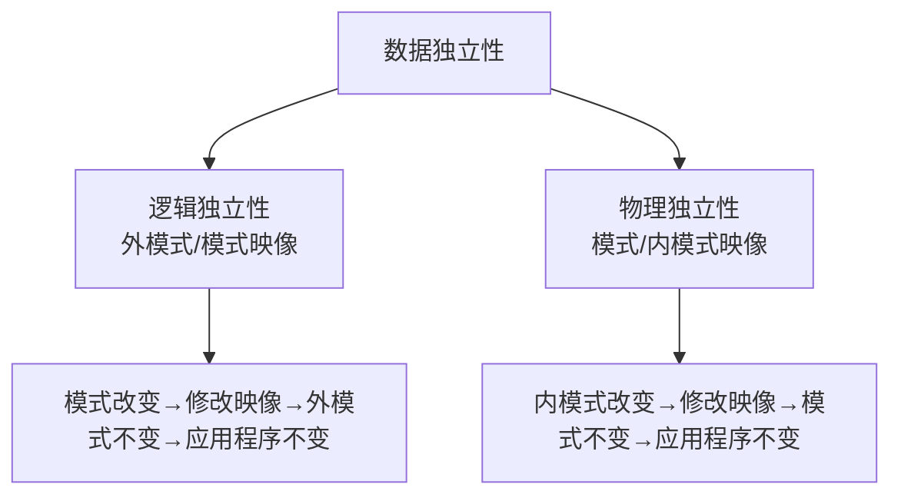

# 数据库原理习题集 — 第一部分 基本概念

## 一、单项选择题

### 题目1

在数据管理技术的发展过程中，经历了人工管理阶段、文件系统阶段和数据库系统阶段。在这几个阶段中，数据独立性最高的是（）阶段。

A. 数据库系统　B. 文件系统　C. 人工管理　D. 数据项管理

> [!tip]- 答案
> **A. 数据库系统**

---

### 题目2

数据库系统与文件系统的主要区别是（）。

A. 数据库系统复杂，而文件系统简单
B. 文件系统不能解决数据冗余和数据独立性问题，而数据库系统可以解决
C. 文件系统只能管理程序文件，而数据库系统能够管理各种类型的文件
D. 文件系统管理的数据量较少，而数据库系统可以管理庞大的数据量

> [!tip]- 答案
> **B**

---

### 题目3

数据库的概念模型独立于（）。

A. 具体的机器和 DBMS　B. E-R 图　C. 信息世界　D. 现实世界

> [!tip]- 答案
> **A. 具体的机器和 DBMS**

---

### 题目4

数据库是在计算机系统中按照一定的数据模型组织、存储和应用的①，支持数据库各种操作的软件系统叫②，由计算机、操作系统、DBMS、数据库、应用程序及用户等组成的一个整体叫做③。

① A. 文件的集合　B. 数据的集合　C. 命令的集合　D. 程序的集合
② A. 命令系统　B. 数据库管理系统　C. 数据库系统　D. 操作系统
③ A. 文件系统　B. 数据库系统　C. 软件系统　D. 数据库管理系统

> [!tip]- 答案
> ①**B** ②**B** ③**B**

---

### 题目5

数据库的基本特点是（）。

A. (1)数据可以共享(或数据结构化) (2)数据独立性 (3)数据冗余大，易移植 (4)统一管理和控制
B. (1)数据可以共享(或数据结构化) (2)数据独立性 (3)数据冗余小，易扩充 (4)统一管理和控制
C. (1)数据可以共享(或数据结构化) (2)数据互换性 (3)数据冗余小，易扩充 (4)统一管理和控制
D. (1)数据非结构化 (2)数据独立性 (3)数据冗余小，易扩充 (4)统一管理和控制

> [!tip]- 答案
> **B**

---

### 题目6

数据库具有①、最小的②和较高的③。

① A. 程序结构化　B. 数据结构化　C. 程序标准化　D. 数据模块化
② A. 冗余度　B. 存储量　C. 完整性　D. 有效性
③ A. 程序与数据可靠性　B. 程序与数据完整性　C. 程序与数据独立性　D. 程序与数据一致性

> [!tip]- 答案
> ①**B** ②**A** ③**C**

---

### 题目7

在数据库中，下列说法（）是不正确的。

A. 数据库避免了一切数据的重复
B. 若系统是完全可以控制的，则系统可确保更新时的一致性
C. 数据库中的数据可以共享
D. 数据库减少了数据冗余

> [!tip]- 答案
> **A. 数据库避免了一切数据的重复**
>
> 数据库减少冗余但不可避免一切冗余。

---

### 题目8

（）是存储在计算机内有结构的数据的集合。

A. 数据库系统　B. 数据库　C. 数据库管理系统　D. 数据结构

> [!tip]- 答案
> **B. 数据库**

---

### 题目9

在数据库中存储的是（）。

A. 数据　B. 数据模型　C. 数据以及数据之间的联系　D. 信息

> [!tip]- 答案
> **C. 数据以及数据之间的联系**

---

### 题目10

数据库中，数据的物理独立性是指（）。

A. 数据库与数据库管理系统的相互独立
B. 用户程序与 DBMS 的相互独立
C. 用户的应用程序与存储在磁盘上数据库中的数据是相互独立的
D. 应用程序与数据库中数据的逻辑结构相互独立

> [!tip]- 答案
> **C**

---

### 题目11

数据库的特点之一是数据的共享，严格地讲，这里的数据共享是指（）。

A. 同一个应用中的多个程序共享一个数据集合
B. 多个用户、同一种语言共享数据
C. 多个用户共享一个数据文件
D. 多种应用、多种语言、多个用户相互覆盖地使用数据集合

> [!tip]- 答案
> **D**

---

### 题目12

数据库系统的核心是（）。

A. 数据库　B. 数据库管理系统　C. 数据模型　D. 软件工具

> [!tip]- 答案
> **B. 数据库管理系统**

---

### 题目13

下述关于数据库系统的正确叙述是（）。

A. 数据库系统减少了数据冗余
B. 数据库系统避免了一切冗余
C. 数据库系统中数据的一致性是指数据类型一致
D. 数据库系统比文件系统能管理更多的数据

> [!tip]- 答案
> **A. 数据库系统减少了数据冗余**

---

### 题目14

下述关于数据库系统的正确叙述是（）。

A. 数据库中只存在数据项之间的联系
B. 数据库的数据项之间和记录之间都存在联系
C. 数据库的数据项之间无联系，记录之间存在联系
D. 数据库的数据项之间和记录之间都不存在联系

> [!tip]- 答案
> **B**

---

### 题目15

相对于其他数据管理技术，数据库系统有①、减少数据冗余、保持数据的一致性、②和③的特点。

① A. 数据共享　B. 数据模块化　C. 数据结构化　D. 数据共享
② A. 数据结构化　B. 数据无独立性　C. 数据统一管理　D. 数据有独立性
③ A. 使用专用文件　B. 不使用专用文件　C. 数据没有安全与完整性保障　D. 数据有安全与完整性保障

> [!tip]- 答案
> ①**D** ②**D** ③**D**

---

### 题目16

将数据库的结构划分成多个层次，是为了提高数据库的①和②。

① A. 数据独立性　B. 逻辑独立性　C. 管理规范性　D. 数据的共享
② A. 数据独立性　B. 物理独立性　C. 逻辑独立性　D. 管理规范性

> [!tip]- 答案
> ①**B. 逻辑独立性** ②**B. 物理独立性**

---

### 题目17

在数据库技术中，为提高数据库的逻辑独立性和物理独立性，数据库的结构被划分成用户级、（）和存储级三个层次。

A. 管理员级　B. 外部级　C. 概念级　D. 内部级

> [!tip]- 答案
> **C. 概念级**

---

### 题目18

数据库是在计算机系统中按照一定的数据模型组织、存储和应用的①，支持数据库各种操作的软件系统叫做②，由计算机、操作系统、DBMS、数据库、应用程序及用户组成的一个整体叫做③。

① A. 文件的集合　B. 数据的集合　C. 命令的集合　D. 程序的集合
② A. 命令系统　B. 数据库系统　C. 操作系统　D. 数据库管理系统
③ A. 数据库系统　B. 数据库管理系统　C. 文件系统　D. 软件系统

> [!tip]- 答案
> ①**B** ②**D** ③**A**

---

### 题目19

数据库(DB)、数据库系统(DBS)和数据库管理系统(DBMS)三者之间的关系是（）。

A. DBS 包括 DB 和 DBMS
B. DBMS 包括 DB 和 DBS
C. DB 包括 DBS 和 DBMS
D. DBS 就是 DB，也就是 DBMS

> [!tip]- 答案
> **A. DBS 包括 DB 和 DBMS**

---

### 题目20

（）可以减少相同数据重复存储的现象。

A. 记录　B. 字段　C. 文件　D. 数据库

> [!tip]- 答案
> **D. 数据库**

---

### 题目21

在数据库中，产生数据不一致的根本原因是（）。

A. 数据存储量太大　B. 没有严格保护数据　C. 未对数据进行完整性控制　D. 数据冗余

> [!tip]- 答案
> **D. 数据冗余**

---

### 题目22

数据库管理系统(DBMS)是（）。

A. 一个完整的数据库应用系统　B. 一组硬件　C. 一组软件　D. 既有硬件，也有软件

> [!tip]- 答案
> **C. 一组软件**

---

### 题目23

数据库管理系统(DBMS)是（）。

A. 数学软件　B. 应用软件　C. 计算机辅助设计　D. 系统软件

> [!tip]- 答案
> **D. 系统软件**

---

### 题目24

数据库管理系统(DBMS)的主要功能是（）。

A. 修改数据库　B. 定义数据库　C. 应用数据库　D. 保护数据库

> [!tip]- 答案
> **B. 定义数据库**

---

### 题目25

数据库管理系统的工作不包括（）。

A. 定义数据库　B. 对已定义的数据库进行管理　C. 为定义的数据库提供操作系统　D. 数据通信

> [!tip]- 答案
> **C. 为定义的数据库提供操作系统**
>
> 提供操作系统是操作系统的职责，不是 DBMS 的工作。

---

### 题目26

数据库管理系统中用于定义和描述数据库逻辑结构的语言称为（）。

A. 数据库模式描述语言　B. 数据库子语言　C. 数据操纵语言　D. 数据结构语言

> [!tip]- 答案
> **A. 数据库模式描述语言（DDL）**

---

### 题目27

（）是存储在计算机内的有结构的数据集合。

A. 网络系统　B. 数据库系统　C. 操作系统　D. 数据库

> [!tip]- 答案
> **D. 数据库**

---

### 题目28

数据库系统的核心是（）。

A. 编译系统　B. 数据库　C. 操作系统　D. 数据库管理系统

> [!tip]- 答案
> **D. 数据库管理系统**

---

### 题目29

数据库系统的特点是（）、数据独立、减少数据冗余、避免数据不一致和加强了数据保护。

A. 数据共享　B. 数据存储　C. 数据应用　D. 数据保密

> [!tip]- 答案
> **A. 数据共享**

---

### 题目30

数据库系统的最大特点是（）。

A. 数据的三级抽象和二级独立性
B. 数据共享性
C. 数据的结构化
D. 数据独立性

> [!tip]- 答案
> **A. 数据的三级抽象和二级独立性**

---

### 题目31

数据库系统是由①组成；而数据库应用系统是由②组成。

①② A. 数据库管理系统、应用程序系统、数据库
B. 数据库管理系统、数据库管理员、数据库
C. 数据库系统、应用程序系统、用户
D. 数据库管理系统、数据库、用户

> [!tip]- 答案
> ①**B** ②**C**

---

### 题目32

数据库系统由数据库、①和硬件等组成，数据库系统是在②的基础上发展起来的。数据库系统由于能减少数据冗余，提高数据独立性，并集中检查③，由此获得广泛的应用。数据库提供给用户的接口是④，它具有数据定义、数据操作和数据检查功能，可独立使用，也可嵌入宿主语言使用。⑤语言已被国际标准化组织采纳为标准的关系数据库语言。

①② A. 操作系统　B. 文件系统　C. 编译系统　D. 数据库管理系统
③ A. 数据完整性　B. 数据层次性　C. 数据的操作性　D. 数据兼容性
④ A. 数据库语言　B. 过程化语言　C. 宿主语言　D. 面向对象语言
⑤ A. QUEL　B. SEQUEL　C. SQL　D. ALPHA

> [!tip]- 答案
> ①**D** ②**B** ③**A** ④**A** ⑤**C**

---

### 题目33

数据的管理方法主要有（）。

A. 批处理和文件系统　B. 文件系统和分布式系统　C. 分布式系统和批处理　D. 数据库系统和文件系统

> [!tip]- 答案
> **D. 数据库系统和文件系统**

---

### 题目34

数据库系统和文件系统的主要区别是（）。

A. 数据库系统复杂，而文件系统简单
B. 文件系统不能解决数据冗余和数据独立性问题，而数据库系统能够解决
C. 文件系统只能管理文件，而数据库系统还能管理其他类型的数据
D. 文件系统只能用于小型、微型机，而数据库系统还能用于大型机

> [!tip]- 答案
> **B**

---

### 题目35

数据库管理系统能实现对数据库中数据的查询、插入、修改和删除等操作，这种功能称为（）。

A. 数据定义功能　B. 数据管理功能　C. 数据操纵功能　D. 数据控制功能

> [!tip]- 答案
> **C. 数据操纵功能**

---

### 题目36

数据库管理系统是（）。

A. 操作系统的一部分
B. 在操作系统支持下的系统软件
C. 一种编译程序
D. 一种操作系统

> [!tip]- 答案
> **B. 在操作系统支持下的系统软件**

---

### 题目37

在数据库的三级模式结构中，描述数据库中全体数据的全局逻辑结构和特征的是（）。

A. 外模式　B. 内模式　C. 存储模式　D. 模式

> [!tip]- 答案
> **D. 模式**

---

### 题目38

数据库系统的数据独立性是指（）。

A. 不会因为数据的变化而影响应用程序
B. 不会因为系统数据存储结构与数据逻辑结构的变化而影响应用程序
C. 不会因为存储策略的变化而影响存储结构
D. 不会因为某些存储结构的变化而影响其他的存储结构

> [!tip]- 答案
> **B**

---

### 题目39

为使程序员编程时既可使用数据库语言又可使用常规的程序设计语言，数据库系统需要把数据库语言嵌入到（）中。

A. 编译程序　B. 操作系统　C. 中间语言　D. 宿主语言

> [!tip]- 答案
> **D. 宿主语言**

---

### 题目40

在数据库系统中，通常用三级模式来描述数据库，其中①是用户与数据库的接口，是应用程序可见到的数据描述，②是对数据整体的③的描述，而④描述了数据的⑤。

A. 外模式　B. 概念模式　C. 内模式　D. 逻辑结构　E. 层次结构　F. 物理结构

> [!tip]- 答案
> ①**A. 外模式** ②**B. 概念模式** ③**D. 逻辑结构** ④**C. 内模式** ⑤**F. 物理结构**

---

### 题目41

应用数据库的主要目的是为了（）。

A. 解决保密问题　B. 解决数据完整性问题　C. 共享数据问题　D. 解决数据量大的问题

> [!tip]- 答案
> **C. 共享数据问题**

---

### 题目42

数据库应用系统包括（）。

A. 数据库语言、数据库
B. 数据库、数据库应用程序
C. 数据管理系统、数据库
D. 数据库管理系统

> [!tip]- 答案
> **B. 数据库、数据库应用程序**

---

### 题目43

实体是信息世界中的术语，与之对应的数据库术语为（）。

A. 文件　B. 数据库　C. 字段　D. 记录

> [!tip]- 答案
> **D. 记录**

---

### 题目44

层次型、网状型和关系型数据库划分原则是（）。

A. 记录长度　B. 文件的大小　C. 联系的复杂程度　D. 数据之间的联系

> [!tip]- 答案
> **D. 数据之间的联系**

---

### 题目45

按照传统的数据模型分类，数据库系统可以分为三种类型（）。

A. 大型、中型和小型　B. 西文、中文和兼容　C. 层次、网状和关系　D. 数据、图形和多媒体

> [!tip]- 答案
> **C. 层次、网状和关系**

---

### 题目46

数据库的网状模型应满足的条件是（）。

A. 允许一个以上的无双亲，也允许一个结点有多个双亲
B. 必须有两个以上的结点
C. 有且仅有一个结点无双亲，其余结点都只有一个双亲
D. 每个结点有且仅有一个双亲

> [!tip]- 答案
> **A**

---

### 题目47

在数据库的非关系模型中，基本层次联系是（）。

A. 两个记录型以及它们之间的多对多联系
B. 两个记录型以及它们之间的一对多联系
C. 两个记录型之间的多对多的联系
D. 两个记录之间的一对多的联系

> [!tip]- 答案
> **B**

---

### 题目48

数据模型用来表示实体间的联系，但不同的数据库管理系统支持不同的数据模型。在常用的数据模型中，不包括（）。

A. 网状模型　B. 链状模型　C. 层次模型　D. 关系模型

> [!tip]- 答案
> **B. 链状模型**
>
> 常用数据模型为层次、网状、关系，没有"链状模型"。

---

### 题目49

(1) 对于上层的一个记录，有多个下层记录与之对应，对于下层的一个记录，只有一个上层记录与之对应，这是①数据库。
(2) 对于上层的一个记录，有多个下层记录与之对应，对于下层的一个记录，也有多个上层记录与之对应，这是②数据库。
(3) 不预先定义固定的数据结构，而是以"二维表"结构来表达数据与数据之间的相互关系，这是③数据库。

A. 关系型　B. 集中型　C. 网状型　D. 层次型

> [!tip]- 答案
> ①**D. 层次型** ②**C. 网状型** ③**A. 关系型**

---

### 题目50

一个数据库系统必须能够表示实体和关系，关系可与①实体有关。实体与实体之间的关系有一对一、一对多和多对多三种，其中②不能描述多对多的联系。

① A. 0 个　B. 1 个　C. 2 个或 2 个以上　D. 1 个或 1 个以上
② A. 关系模型　B. 层次模型　C. 网状模型　D. 网状模型和层次模型

> [!tip]- 答案
> ①**D** ②**B. 层次模型**

---

### 题目51

按所使用的数据模型来分，数据库可分为（）三种模型。

A. 层次、关系和网状　B. 网状、环状和链状　C. 大型、中型和小型　D. 独享、共享和分时

> [!tip]- 答案
> **A. 层次、关系和网状**

---

### 题目52

通过指针链接来表示和实现实体之间联系的模型是（）。

A. 关系模型　B. 层次模型　C. 网状模型　D. 层次和网状模型

> [!tip]- 答案
> **D. 层次和网状模型**

---

### 题目53

层次模型不能直接表示（）。

A. 1:1 关系　B. 1:m 关系　C. m:n 关系　D. 1:1 和 1:m 关系

> [!tip]- 答案
> **C. m:n 关系**

---

### 题目54

关系数据模型（）。

A. 只能表示实体间的 1:1 联系
B. 只能表示实体间的 1:n 联系
C. 只能表示实体间的 m:n 联系
D. 可以表示实体间的上述三种联系

> [!tip]- 答案
> **D. 可以表示实体间的上述三种联系**

---

### 题目55

从逻辑上看关系模型是用①表示记录类型的，用②表示记录类型之间的联系；层次与网状模型是用③表示记录类型，用④表示记录类型之间的联系。从物理上看关系是⑤，层次与网状模型是用⑥来实现两个文件之间的联系。

A. 表　B. 结点　C. 指针　D. 连线　E. 位置寻址　F. 相联寻址

> [!tip]- 答案
> ①**A. 表** ②**A. 表** ③**B. 结点** ④**D. 连线** ⑤**F. 相联寻址** ⑥**C. 指针**

---

### 题目56

在数据库设计中用关系模型来表示实体和实体之间的联系。关系模型的结构是（）。

A. 层次结构　B. 二维表结构　C. 网状结构　D. 封装结构

> [!tip]- 答案
> **B. 二维表结构**

---

### 题目57

子模式是（）。

A. 模式的副本　B. 模式的逻辑子集　C. 多个模式的集合　D. 以上三者都对

> [!tip]- 答案
> **B. 模式的逻辑子集**

---

### 题目58

在数据库三级模式结构中，描述数据库中全体逻辑结构和特性的是（）。

A. 外模式　B. 内模式　C. 存储模式　D. 模式

> [!tip]- 答案
> **D. 模式**

---

### 题目59

数据库三级模式体系结构的划分，有利于保持数据库的（）。

A. 数据独立性　B. 数据安全性　C. 结构规范化　D. 操作可行性

> [!tip]- 答案
> **A. 数据独立性**

---

### 题目60

数据库技术的奠基人之一 E.F. Codd 从 1970 年起发表过多篇论文，主要论述的是（）。

A. 层次数据模型　B. 网状数据模型　C. 关系数据模型　D. 面向对象数据模型

> [!tip]- 答案
> **C. 关系数据模型**

---

## 二、填空题

### 题目61

经过处理和加工提炼而用于决策或其他应用活动的数据称为 \_\_\_\_\_\_\_\_。

> [!tip]- 答案
> **信息**

---

### 题目62

数据管理技术经历了 ① 、 ② 和 ③ 三个阶段。

> [!tip]- 答案
> ①**人工管理** ②**文件系统** ③**数据库系统**

---

### 题目63

数据库系统一般是由 ① 、 ② 、 ③ 、 ④ 和 ⑤ 组成。

> [!tip]- 答案
> ①**硬件系统** ②**数据库集合** ③**数据库管理系统及相关软件** ④**数据库管理员** ⑤**用户**

---

### 题目64

数据库是长期存储在计算机内、有 ① 的、可 ② 的数据集合。

> [!tip]- 答案
> ①**组织** ②**共享**

---

### 题目65

DBMS 是指 ①，它是位于 ② 和 ③ 之间的一层管理软件。

> [!tip]- 答案
> ①**数据库管理系统** ②**用户** ③**操作系统**

---

### 题目66

DBMS 管理的是 \_\_\_\_\_\_\_\_ 的数据。

> [!tip]- 答案
> **结构化**

---

### 题目67

数据库管理系统的主要功能有 ① 、 ② 、数据库的运行管理和数据库的建立以及维护等 4 个方面。

> [!tip]- 答案
> ①**数据定义功能** ②**数据操纵功能**

---

### 题目68

数据库管理系统包含的主要程序有 ① 、 ② 和 ③ 。

> [!tip]- 答案
> ①**语言翻译处理程序** ②**系统运行控制程序** ③**实用程序**

---

### 题目69

数据库语言包括 ① 和 ② 两大部分，前者负责描述和定义数据库的各种特性，后者用于说明对数据进行的各种操作。

> [!tip]- 答案
> ①**数据描述语言（DDL）** ②**数据操纵语言（DML）**

---

### 题目70

指出下列缩写的含义：

(1) DML： ①　(2) DBMS： ②　(3) DDL： ③　(4) DBS： ④　(5) SQL： ⑤
(6) DB： ⑥　(7) DD： ⑦　(8) DBA： ⑧　(9) SDDL： ⑨　(10) PDDL： ⑩

> [!tip]- 答案
> ①**数据操纵语言**　②**数据库管理系统**　③**数据描述语言**　④**数据库系统**　⑤**结构化查询语言**
> ⑥**数据库**　⑦**数据字典**　⑧**数据库管理员**　⑨**子模式数据描述语言**　⑩**物理数据描述语言**

---

### 题目71

数据库系统包括数据库 ① 、 ② 和 ③ 三个方面。

> [!tip]- 答案
> ①**相应硬件** ②**软件** ③**相关的各类人员**

---

### 题目72

开发、管理和使用数据库的人员主要有 ① 、 ② 、 ③ 和最终用户四类相关人员。

> [!tip]- 答案
> ①**数据库管理员** ②**系统分析员** ③**应用程序员**

---

### 题目73

由 \_\_\_\_\_\_\_\_ 负责全面管理和控制数据库系统。

> [!tip]- 答案
> **数据库管理员（DBA）**

---

### 题目74

数据库系统与文件系统的本质区别在于 \_\_\_\_\_\_\_\_。

> [!tip]- 答案
> **数据库系统实现了整体数据的结构化**

---

### 题目75

数据独立性是指 ① 与 ② 是相互独立的。

> [!tip]- 答案
> ①**用户的应用程序** ②**存储在外存上的数据库中的数据**

---

### 题目76

数据独立性又可分为 ① 和 ② 。

> [!tip]- 答案
> ①**逻辑数据独立性** ②**物理数据独立性**

---

### 题目77

当数据的物理存储改变了，应用程序不变，而由 DBMS 处理这种改变，这是指数据的 \_\_\_\_\_\_\_\_。

> [!tip]- 答案
> **物理独立性**

---

### 题目78

数据模型质量的高低不会影响数据库性能的好坏，这句话正确否？\_\_\_\_\_\_\_\_。

> [!tip]- 答案
> **不正确**
>
> 数据模型直接影响数据库的性能、存储效率和操作效率。

---

### 题目79

根据数据模型的应用目的不同，数据模型分为 ① 和 ② 。

> [!tip]- 答案
> ①**概念模型** ②**数据模型**

---

### 题目80

数据模型是由 ① 、 ② 和 ③ 三部分组成的。

> [!tip]- 答案
> ①**数据结构** ②**数据操作** ③**完整性约束**

---

### 题目81

按照数据结构的类型来命名，数据模型分为①、②和③。

> [!tip]- 答案
> ①**层次模型** ②**网状模型** ③**关系模型**

---

### 题目82

① 是对数据系统的静态特性的描述， ② 是对数据库系统的动态特性的描述。

> [!tip]- 答案
> ①**数据结构** ②**数据操作**

---

### 题目83

以子模式为框架的数据库是 ① ；以模式为框架的数据库是 ② ；以物理模式为框架的数据库是 ③ 。

> [!tip]- 答案
> ①**用户数据库** ②**概念数据库** ③**物理数据库**

---

### 题目84

非关系模型中数据结构的基本单位是 \_\_\_\_\_\_\_\_。

> [!tip]- 答案
> **基本层次联系**

---

### 题目85

层次数据模型中，只有一个结点，无父结点，它称为 \_\_\_\_\_\_\_\_。

> [!tip]- 答案
> **根结点**

---

### 题目86

层次模型的物理存储方法一般采用 ① 和 ② 。

> [!tip]- 答案
> ①**顺序法** ②**指针法**

---

### 题目87

层次模型是一个以记录类型为结点的有向树，这句话是否正确？\_\_\_\_\_\_\_\_。

> [!tip]- 答案
> **正确**

---

### 题目88

层次模型中，根结点以外的结点至多可有 \_\_\_\_\_\_\_\_ 个父结点。

> [!tip]- 答案
> **1**

---

### 题目89

关系模型是将数据之间的关系看成网络关系，这句话是否正确？\_\_\_\_\_\_\_\_

> [!tip]- 答案
> **不正确**
>
> 关系模型用二维表表示，不是网络关系。网状模型才用网络结构。

---

### 题目90

关系数据库是采用 \_\_\_\_\_\_\_\_ 作为数据的组织方式。

> [!tip]- 答案
> **关系模型**

---

### 题目91

数据描述语言的作用是 \_\_\_\_\_\_\_\_。

> [!tip]- 答案
> **定义数据库**

---

### 题目92

数据库体系结构按照 ① 、 ② 和 ③ 三级结构进行组织。

> [!tip]- 答案
> ①**模式** ②**外模式** ③**内模式**

---

### 题目93

外模式是 \_\_\_\_\_\_\_\_ 的子集。

> [!tip]- 答案
> **模式**

---

### 题目94

数据库的模式有 ① 和 ② 两方面，前者直接与操作系统或硬件联系，后者是数据库数据的完整表示。

> [!tip]- 答案
> ①**存储模式** ②**概念模式**

---

### 题目95

现实世界的事物反映到人的头脑中经过思维加工成数据，这一过程要经过三个领域，依次是 ① 、 ② 和 ③ 。

> [!tip]- 答案
> ①**现实世界** ②**信息世界** ③**计算机世界（或数据世界）**

---

### 题目96

实体之间的联系可抽象为三类，它们是 ① 、 ② 和 ③ 。

> [!tip]- 答案
> ①**1:1** ②**1:m** ③**m:n**

---

### 题目97

数据冗余可能导致的问题有 ① 和 ② 。

> [!tip]- 答案
> ①**浪费存储空间及修改麻烦** ②**潜在的数据不一致性**

---

### 题目98

从外部视图到子模式的数据结构的转换是由 ① 实现的；模式与子模式之间的映象是由 ② 实现的；存储模式与数据物理组织之间的映象是由 ③ 实现的。

> [!tip]- 答案
> ①**应用程序** ②**DBMS** ③**操作系统的存取方法**

---

## 三、简述题

### 题目99

从程序和数据之间的关系分析文件系统和数据库系统之间的区别和联系。

> [!note] 参考答案
> **(1) 区别：**
>
> | 文件系统 | 数据库系统 |
> |---------|-----------|
> | 用文件将数据长期保存在外存上 | 用数据库统一存储数据 |
> | 程序和数据有一定的联系 | 程序和数据分离 |
> | 用操作系统中的存取方法对数据进行管理 | 用 DBMS 统一管理和控制数据 |
> | 实现以文件为单位的数据共享 | 实现以记录和字段为单位的数据共享 |
>
> **(2) 联系：**
> 均为数据组织的管理技术；均由数据管理软件管理数据，程序与数据之间用存取方法进行转换；数据库系统是在文件系统的基础上发展而来的。

---

### 题目100

什么是数据库？

> [!note] 参考答案
> 数据库是长期存储在计算机内、有组织的、可共享的数据集合。数据库是按某种数据模型进行组织的、存放在外存储器上，且可被多个用户同时使用。因此，数据库具有较小的冗余度，较高的数据独立性和易扩展性。

---

### 题目101

什么是数据冗余？数据库系统与文件系统相比怎样减少冗余？

> [!note] 参考答案
> 数据冗余是指各个数据文件中存在重复的数据。
>
> 在文件管理系统中，数据被组织在一个个独立的数据文件中，每个文件都有完整的体系结构，数据文件之间没有联系，各数据文件中难免有许多数据相互重复，冗余度比较大。
>
> 数据库系统以数据库方式管理大量共享的数据，各个应用的数据集中存储，共同使用，数据库文件之间联系密切，因而尽可能地避免了数据的重复存储，减少和控制了数据的冗余。

---

### 题目102

使用数据库系统有什么好处？

> [!note] 参考答案
> 1. 查询迅速、准确，而且可以节约大量纸面文件
> 2. 数据结构化，并由 DBMS 统一管理
> 3. 数据冗余度小
> 4. 具有较高的数据独立性
> 5. 数据的共享性好
> 6. DBMS 还提供了数据的控制功能

---

### 题目103

什么是数据库的数据独立性？

> [!note] 参考答案
> 数据独立性表示应用程序与数据库中存储的数据不存在依赖关系，包括逻辑数据独立性和物理数据独立性。
>
> - **逻辑数据独立性**：局部逻辑数据结构（外视图）与全局逻辑数据结构（概念视图）之间的独立性。当全局逻辑数据结构发生变化时，不影响局部逻辑结构，应用程序不必修改。
> - **物理数据独立性**：数据的存储结构与存取方法（内视图）改变时，对全局逻辑结构和应用程序不必修改的特性。



---

### 题目104

什么是数据库管理系统？

> [!note] 参考答案
> 数据库管理系统（DBMS）是操纵和管理数据库的一组软件，它是数据库系统（DBS）的重要组成部分。
>
> DBMS 具有定义、建立、维护和使用数据库的功能，通常由三部分构成：
> 1. **数据描述语言（DDL）**：对应三级模式有外模式 DDL、概念模式 DDL 和内模式 DDL
> 2. **数据操纵语言（DML）**：用户与 DBMS 之间的接口，包括存储、控制、检索、更新语句
> 3. **数据库管理的例行程序**：语言翻译处理程序、公用程序、系统运行控制程序

---

### 题目105

数据库管理系统有哪些功能？

> [!note] 参考答案
> 1. **数据定义功能**：DBMS 提供 DDL，用户可通过它来定义数据
> 2. **数据操纵功能**：DBMS 提供 DML，实现对数据库的基本操作：查询、插入、删除和修改
> 3. **数据库的运行管理**：并发控制，安全性检查，完整性约束条件的检查和执行，数据库的内容维护等
> 4. **数据库的建立和维护功能**：数据库初始数据的输入及转换，数据库的转储与恢复，数据库的重组功能和性能的监视与分析功能等

---

### 题目106

DBA 的职责是什么？

> [!note] 参考答案
> 1. 决定 DB 中的信息内容和结构
> 2. 决定 DB 的存储结构和存取策略
> 3. 定义数据的安全性要求和完整性约束条件
> 4. 监控数据库的使用和运行

---

### 题目107

什么是数据字典？数据字典包含哪些基本内容？

> [!note] 参考答案
> 数据字典是数据库系统中各种描述信息和控制信息的集合，它是数据库设计与管理的有力工具。
>
> 基本内容包括：**数据项、组项、记录、文件、外模式、概念模式、内模式、外模式/概念模式映象、概念模式/内模式映象、用户管理信息、数据库控制信息**。

---

### 题目108

叙述数据字典的主要任务和作用？

> [!note] 参考答案
> **任务：**
> 1. 描述数据库系统的所有对象，并确定其属性
> 2. 描述数据库系统对象之间的各种交叉联系
> 3. 登记所有对象的完整性及安全性限制等
> 4. 对数据字典本身的维护、保护、查询与输出
>
> **作用：**
> 1. 供 DBMS 快速查找有关对象的信息
> 2. 供 DBA 查询，以掌握整个系统的运行情况
> 3. 支持数据库设计与系统分析

---

### 题目109

叙述模型、模式和具体值三者之间的联系和区别。

> [!note] 参考答案
> 数据模型是用来表示信息世界中的实体及其联系在数据世界中的抽象描述，它描述的是数据的逻辑结构。模式的主体就是数据库的数据模型。
>
> - **型**：只包含属性的名称，不包含属性的值
> - **值**：型的具体实例值，即赋了值的型
>
> 数据模型与模式都属于型的范畴。

---

### 题目110

什么是层次模型？

> [!note] 参考答案
> 在数据库中，把满足以下两个条件的基本层次联系的集合称为"层次模型"：
> 1. 有且仅有一个结点无双亲，这个结点称为"根结点"
> 2. 其他结点有且仅有一个双亲

---

### 题目111

什么是网状模型？

> [!note] 参考答案
> 在数据库中，把满足以下两个条件的基本层次结构的集合称为"网状模型"：
> 1. 允许一个以上结点无双亲
> 2. 一个结点可以有多个双亲

---

### 题目112

简要叙述关系数据库的优点？

> [!note] 参考答案
> 关系数据库是以关系模型作为数据的组织方式，关系模型是建立在严格的数学概念基础上的。
>
> 主要优点是：概念简单清晰，用户不需了解复杂的存取路径，不需说明"怎么干"，只需说明"干什么"，易懂易学。

---

### 题目113

层次模型、网状模型和关系模型等三种基本数据模型是根据什么来划分的？

> [!note] 参考答案
> 它们是依据描述实体与实体之间联系的不同方式来划分的：
> - **关系模型**：用二维表格来表示实体和实体之间的联系
> - **网状模型**：用图结构来表示实体和实体之间的联系
> - **层次模型**：用树结构来表示实体和实体之间的联系

| 数据模型 | 数据结构 | 表示联系的方式 | 物理实现 |
|---------|---------|--------------|---------|
| 层次模型 | 树结构 | 连线（指针） | 顺序法 + 指针法 |
| 网状模型 | 图结构 | 连线（指针） | 指针法 |
| 关系模型 | 二维表 | 表中外码 | 相联寻址 |

---

### 题目114

层次模型、网状模型和关系模型这三种基本数据模型各有哪些优缺点？

> [!note] 参考答案
> **(1) 层次模型**
> - 优点：结构清晰，表示各结点之间的联系简单；容易表示层次结构的事物
> - 缺点：不能表示 m:n 联系；严格的层次顺序使插入和删除操作复杂
>
> **(2) 网状模型**
> - 优点：能够表示实体之间的多种复杂联系
> - 缺点：比较复杂，需要程序员熟悉数据库的逻辑结构；重新组织时容易失去数据独立性
>
> **(3) 关系模型**
> - 优点：使用表的概念，简单直观；直接表示 m:n 联系；具有更好的数据独立性；具有坚实的理论基础
> - 缺点：联结等操作开销较大，需要较高性能计算机的支持

---

### 题目115

试举出三个实例，要求实体型之间具有一对一、一对多、多对多各种不同的联系。

> [!note] 参考答案
> - **1:1**：学校与校长；班级与班长；系与系主任
> - **1:n**：系与教师；班级与学生；车间与工人
> - **m:n**：学生与课程；教师与课程；医生与药品

---

### 题目116

学校中有若干系，每个系有若干班级和教研室，每个教研室有若干教员，其中有的教授和副教授每人各带若干研究生。每个班有若干学生，每个学生选修若干课程，每门课可有若干学生选修。用 E-R 图画出此学校的信息模型。

> [!note]- 参考答案
> **实体：**
> - 系（系号，系名）
> - 班级（班号，班名）
> - 教研室（教研室号，教研室名）
> - 教员（教员号，姓名，职称）
> - 研究生（学号，姓名）
> - 学生（学号，姓名）
> - 课程（课程号，课程名）
>
> **联系：**
> - 系-班级：1:n
> - 系-教研室：1:n
> - 教研室-教员：1:n
> - 教员-研究生：1:n（仅教授/副教授）
> - 班级-学生：1:n
> - 学生-课程：m:n
>
> ```mermaid
> graph LR
>     DEPT["系<br/>(系号,系名)"] ---|1:n| CLASS["班级<br/>(班号,班名)"]
>     DEPT ---|1:n| TROOM["教研室<br/>(教研室号,教研室名)"]
>     TROOM ---|1:n| TEACHER["教员<br/>(教员号,姓名,职称)"]
>     TEACHER ---|1:n| GRAD["研究生<br/>(学号,姓名)"]
>     CLASS ---|1:n| STUDENT["学生<br/>(学号,姓名)"]
>     STUDENT ---|m:n| COURSE["课程<br/>(课程号,课程名)"]
> ```

---

### 题目117

某工厂中生产若干产品，每种产品由不同的零件组成，有的零件可用在不同的产品上。这些零件由不同的原材料制成。不同零件所用的原材料可以相同。这些零件按所属的不同产品分别放在仓库中，原材料按照类别放在若干仓库中。请用 E-R 图画出此工厂产品、零件、材料、仓库的概念模型。

> [!note]- 参考答案
> **实体：**
> - 产品（产品号，产品名）
> - 零件（零件号，零件名）
> - 原材料（原材料号，原材料名，类别）
> - 仓库（仓库号，仓库名）
>
> **联系：**
> - 产品-零件：m:n（组成）
> - 零件-原材料：m:n（耗用）
> - 零件-仓库：m:n（存放）
> - 原材料-仓库：1:n（存放）
>
> ```mermaid
> graph LR
>     PRODUCT["产品<br/>(产品号,产品名)"] ---|m:n 组成| PART["零件<br/>(零件号,零件名)"]
>     PART ---|m:n 耗用| MATERIAL["原材料<br/>(原材料号,原材料名,类别)"]
>     PART ---|m:n 存放| WAREHOUSE["仓库<br/>(仓库号,仓库名)"]
>     MATERIAL ---|1:n 存放| WAREHOUSE
> ```
