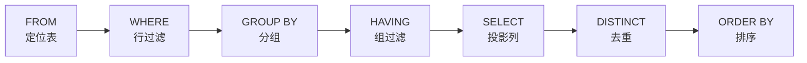
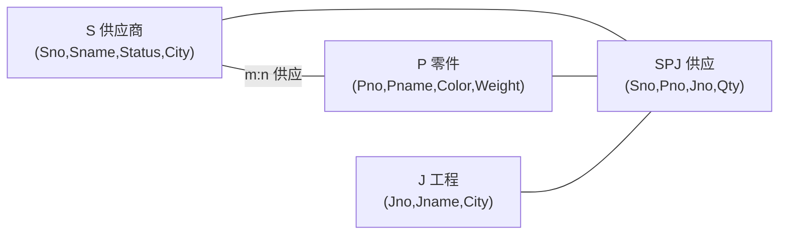

# 数据库原理习题集 — 第三部分 关系数据库标准语言 SQL

## 一、单项选择题

### 题目1

SQL 语言是（）的语言。

A. 过程化　B. 非过程化　C. 格式化　D. 导航式

> [!tip]- 答案
> **B. 非过程化**
>
> SQL 是声明式语言，用户只需说明"做什么"，不需要描述"怎么做"（存取路径由 DBMS 决定）。

---

### 题目2

SQL 语言是（）语言。

A. 层次数据库　B. 网络数据库　C. 关系数据库　D. 非数据库

> [!tip]- 答案
> **C. 关系数据库**

---

### 题目3

SQL 语言具有（）的功能。

A. 关系规范化、数据操纵、数据控制
B. 数据定义、数据操纵、数据控制
C. 数据定义、关系规范化、数据控制
D. 数据定义、关系规范化、数据操纵

> [!tip]- 答案
> **B. 数据定义、数据操纵、数据控制**
>
> 关系规范化是数据库设计理论，不是 SQL 的功能。

---

### 题目4

SQL 语言具有两种使用方式，分别称为交互式 SQL 和（）。

A. 提示式 SQL　B. 多用户 SQL　C. 嵌入式 SQL　D. 解释式 SQL

> [!tip]- 答案
> **C. 嵌入式 SQL**

---

### 题目5

假定学生关系是 S(S#, SNAME, SEX, AGE)，课程关系是 C(C#, CNAME, TEACHER)，学生选课关系是 SC(S#, C#, GRADE)。要查找选修"COMPUTER"课程的"女"学生姓名，将涉及关系（）。

A. S　B. SC，C　C. S，SC　D. S，C，SC

> [!tip]- 答案
> **D. S，C，SC**
>
> 课程名在 C 表，姓名和性别在 S 表，两表通过 SC 连接，三张表都要用到。

---

### 题目6

SQL 中，与"NOT IN"等价的操作符是（）。

A. `<>ALL`　B. `<>SOME`　C. `=SOME`　D. `=ALL`

> [!tip]- 答案
> **A. `<>ALL`**
>
> - `<>ALL(子查询)`：不等于子查询结果中的所有值，等价于 `NOT IN`
> - `<>SOME`：不等于其中某一个值即可（只要存在不等的）
> - `=SOME`：等价于 `IN`

---

### 题目7

若用如下的 SQL 语句创建一个 student 表：

```sql
CREATE TABLE student(
    NO CHAR(4) NOT NULL,
    NAME CHAR(8) NOT NULL,
    SEX CHAR(2),
    AGE INT
);
```

可以插入到 student 表中的是（）。

A. `('1031', '曾华', NULL, NULL)`
B. `('1031', NULL, '男', 23)`
C. `(NULL, '曾华', '男', 23)`
D. `('1031', '曾华', 男, 23)`

> [!tip]- 答案
> **A. `('1031', '曾华', NULL, NULL)`**
>
> - B 错：NAME 定义了 `NOT NULL`，不能插入 NULL
> - C 错：NO 定义了 `NOT NULL`，不能插入 NULL
> - D 错：`男` 是字符串必须加引号

---

### 题目8

查询选修课程号为 '02' 的学生中成绩最高的学生学号，下面正确的是（）。

A. `SELECT S# FROM SC WHERE C#='02' AND GRADE >= ALL(SELECT GRADE FROM SC WHERE C#='02')`
B. `SELECT S# FROM SC WHERE C#='02' AND GRADE >= ANY(SELECT GRADE FROM SC WHERE C#='02')`
C. `SELECT S# FROM SC WHERE C#='02' AND GRADE IN(MAX(GRADE))`
D. `SELECT S# FROM SC WHERE C#='02' AND MAX(GRADE)`

> [!tip]- 答案
> **A**
>
> `>=ALL(子查询)` 表示大于等于子查询结果的所有值，即最大值。MAX 聚集函数不能直接写在 WHERE 中。

---

### 题目9

在 SQL 中，建立视图用（）命令。

A. `CREATE SCHEMA`　B. `CREATE TABLE`　C. `CREATE VIEW`　D. `CREATE INDEX`

> [!tip]- 答案
> **C. `CREATE VIEW`**

---

### 题目10

在 SQL 中，删除视图用（）命令。

A. `DROP SCHEMA`　B. `DROP TABLE`　C. `DROP VIEW`　D. `DROP INDEX`

> [!tip]- 答案
> **C. `DROP VIEW`**

---

### 题目11

SQL 语言的 GRANT 和 REVOKE 语句主要用来维护数据库的（）。

A. 安全性　B. 完整性　C. 可靠性　D. 一致性

> [!tip]- 答案
> **A. 安全性**
>
> 授权/收权属于自主存取控制（DAC），是数据库安全措施。

---

### 题目12

下列 SQL 语句中，能够实现"收回用户 ZHAO 对学生表 (STUD) 中学号 (XH) 的修改权"这一功能的是（）。

A. `REVOKE UPDATE(XH) ON TABLE FROM ZHAO`
B. `REVOKE UPDATE(XH) ON TABLE STUD FROM ZHAO`
C. `REVOKE UPDATE(XH) ON STUD FROM ZHAO`
D. `REVOKE ALL PRIVILEGES ON TABLE STUD FROM ZHAO`

> [!tip]- 答案
> **C. `REVOKE UPDATE(XH) ON STUD FROM ZHAO`**
>
> 标准 SQL 语法中 `REVOKE 权限 ON 对象 FROM 用户`，TABLE 关键字可省略。

---

### 题目13

在 SQL 查询中，GROUP BY 子句的作用是（）。

A. 对查询结果进行分组
B. 消除查询结果中的重复行
C. 对分组结果进行筛选
D. 对查询结果排序

> [!tip]- 答案
> **A. 对查询结果进行分组**
>
> 消除重复行是 `DISTINCT`，分组筛选是 `HAVING`，排序是 `ORDER BY`。

---

### 题目14

在 SQL 查询中，HAVING 子句的作用是（）。

A. 设置行过滤条件　B. 设置分组过滤条件　C. 排序　D. 建立分组

> [!tip]- 答案
> **B. 设置分组过滤条件**
>
> `WHERE` 对行过滤（分组前），`HAVING` 对组过滤（分组后，可用聚集函数）。

---

### 题目15

在 SELECT 语句中，用于去除重复记录的关键字是（）。

A. UNIQUE　B. DISTINCT　C. SOME　D. ALL

> [!tip]- 答案
> **B. DISTINCT**

---

### 题目16

SQL 的聚集函数 COUNT、SUM、AVG、MAX、MIN，不允许出现在（）子句中。

A. SELECT　B. HAVING　C. WHERE　D. COMPUTE

> [!tip]- 答案
> **C. WHERE**
>
> `WHERE` 子句在分组前执行，不能使用聚集函数；聚集函数只能用于 `SELECT` 列表、`HAVING`、`ORDER BY`。

---

### 题目17

WHERE 子句的条件表达式中，可以匹配 0 个或者多个字符的通配符是（）。

A. `_`　B. `%`　C. `?`　D. `*`

> [!tip]- 答案
> **B. `%`**
>
> - `%`：匹配任意长度（含 0 个）任意字符
> - `_`：匹配单个任意字符

---

### 题目18

在 SQL 的嵌套查询中，EXISTS 关键字后面的子查询返回的结果是（）。

A. 数值　B. 集合　C. 逻辑真或逻辑假　D. 元组

> [!tip]- 答案
> **C. 逻辑真或逻辑假**
>
> EXISTS 是存在量词，只判断子查询结果是否为空（有行→真，无行→假），不返回数据。

---

### 题目19

视图不能完成的操作是（）。

A. 查询　B. 更新　C. 定义新视图　D. 定义基本表

> [!tip]- 答案
> **D. 定义基本表**
>
> 视图是虚表，可以查询、有限条件下更新、在视图上再定义视图，但不能通过视图创建基本表。

---

### 题目20

嵌入式 SQL 中，主变量前面加符号（）。

A. `@`　B. `&`　C. `:`　D. `$`

> [!tip]- 答案
> **C. `:`（冒号）**
>
> 嵌入式 SQL 中用 `:主变量名` 区分数据库变量与主语言变量。

---

## 二、填空题

### 题目21

SQL 是\_\_\_\_\_\_\_\_的缩写。

> [!tip]- 答案
> **Structured Query Language（结构化查询语言）**

---

### 题目22

SQL 语言的数据定义功能包括定义\_\_\_\_、定义\_\_\_\_、定义\_\_\_\_。

> [!tip]- 答案
> **数据库（模式）；基本表；视图（索引）**

---

### 题目23

在 SQL 中，用\_\_\_\_语句可以修改表结构。

> [!tip]- 答案
> **`ALTER TABLE`**

---

### 题目24

在 SQL 查询语句中，\_\_\_\_子句用于选择满足给定条件的元组；使用\_\_\_\_子句可按指定列的值分组；使用\_\_\_\_子句可对查询结果排序。

> [!tip]- 答案
> **WHERE；GROUP BY；ORDER BY**



---

### 题目25

在 SQL 中，集合的并、交、差运算分别是\_\_\_\_、\_\_\_\_、\_\_\_\_。

> [!tip]- 答案
> **UNION；INTERSECT；EXCEPT**
>
> | 关系代数 | SQL | 含义 |
> |---------|-----|------|
> | ∪ | UNION | 并（去重） |
> | ∩ | INTERSECT | 交 |
> | − | EXCEPT / MINUS | 差 |

---

### 题目26

视图是一个虚表，它是从\_\_\_\_导出的表。数据库中，只存放视图的\_\_\_\_，不存放视图对应的\_\_\_\_。

> [!tip]- 答案
> **一个或几个基本表；定义；数据**

---

### 题目27

SQL 中授权的语句是\_\_\_\_，回收权限的语句是\_\_\_\_。

> [!tip]- 答案
> **GRANT；REVOKE**

---

### 题目28

如果要在基本表 S 中增加一列 CN（课程名），可用语句\_\_\_\_。

> [!tip]- 答案
> ```sql
> ALTER TABLE S ADD CN CHAR(20);
> ```

---

### 题目29

如果要删除基本表 ST，可用语句\_\_\_\_。

> [!tip]- 答案
> ```sql
> DROP TABLE ST;
> ```

---

### 题目30

SQL 中，谓词 LIKE 可以用来进行\_\_\_\_查询。

> [!tip]- 答案
> **模糊（字符匹配）**
>
> 通配符：`%`（任意长度字符串）、`_`（单个字符）。

---

## 三、简述与应用题

### 题目31

试述 SQL 语言的特点。

> [!note] 参考答案
> 1. **综合统一**：SQL 集数据定义（DDL）、数据操纵（DML）、数据控制（DCL）功能于一体，语言风格统一。
> 2. **高度非过程化**：用户只需描述"做什么"，不用描述存取路径，存取路径的选择由 DBMS 自动完成。
> 3. **面向集合的操作方式**：操作对象、查找结果、插入/删除/更新的对象都可以是元组的集合。
> 4. **以同一种语法结构提供两种使用方式**：交互式 SQL（联机使用）和嵌入式 SQL（嵌入到高级语言程序中），语法基本一致。
> 5. **语言简洁，易学易用**：核心功能只用 9 个动词（CREATE、DROP、ALTER、SELECT、INSERT、UPDATE、DELETE、GRANT、REVOKE）。

---

### 题目32

什么是基本表？什么是视图？两者的区别和联系是什么？

> [!note] 参考答案
> - **基本表**：本身独立存在的表，在 SQL 中一个关系就对应一个基本表，数据实际存储在基本表中。
> - **视图**：从一个或几个基本表（或视图）导出的虚表。
>
> **区别：**
>
> | 对比项 | 基本表 | 视图 |
> |--------|--------|------|
> | 数据存储 | 实际存储数据 | 只存定义，不存数据 |
> | 占用空间 | 占物理空间 | 不占数据空间（仅占字典空间） |
> | 更新 | 可任意增删改 | 更新有限制 |
>
> **联系：** 视图的查询与基本表类似（DBMS 把视图查询转换为对基本表的查询）；可在视图上再定义视图；视图的数据随基本表数据变化而变化。

---

### 题目33

试述视图的优点。

> [!note] 参考答案
> 1. **简化用户的操作**：视图可以将多表连接、复杂查询封装起来，用户只需对视图做简单查询。
> 2. **使用户可以多角度看待同一数据**：不同用户可从不同角度定义不同视图。
> 3. **对重构数据库提供一定程度的逻辑独立性**：基本表结构改变时，可通过修改视图定义使用户外模式不变。
> 4. **能够对机密数据提供安全保护**：可为不同用户定义不同视图，把机密数据对无权用户隐藏。

---

### 题目34

所有的视图是否都可以更新？为什么？

> [!warning] 参考答案
> **并不是所有视图都可以更新。**
>
> 视图更新的本质是把对视图的更新转换为对基本表的更新。有些视图的更新不能唯一地、有意义地转换成对基本表的更新。
>
> **一般不可更新的视图：**
> - 由聚集函数（COUNT、SUM、AVG 等）导出的视图
> - 含 GROUP BY 子句的视图
> - 含 DISTINCT 的视图
> - 由多表连接导出的视图（部分情况可更新有限列）
> - 含表达式计算列的视图（计算列不可更新）
>
> 行列子集视图（从单个基本表导出、保留主键、只去掉某些行/列）一般是可更新的。

---

### 题目35

设有学生-课程数据库，包含三个关系：

- 学生 S(Sno, Sname, Ssex, Sage, Sdept)
- 课程 C(Cno, Cname, Ccredit)
- 选课 SC(Sno, Cno, Grade)

用 SQL 完成下面操作：

(1) 查询全体学生的学号与姓名。
(2) 查询全体学生的姓名及其出生年份。
(3) 查询选修了课程号为 'C2' 课程的学生学号、姓名。
(4) 查询姓名以"张"开头的所有学生。
(5) 查询没有选修 C1 课程的学生姓名。

> [!note]- 参考答案
> ```sql
> -- (1) 查询全体学生的学号与姓名
> SELECT Sno, Sname FROM S;
>
> -- (2) 查询全体学生的姓名及其出生年份
> SELECT Sname, 2026 - Sage AS 出生年份 FROM S;
>
> -- (3) 查询选修了 C2 课程的学生学号、姓名
> SELECT S.Sno, Sname
> FROM S, SC
> WHERE S.Sno = SC.Sno AND Cno = 'C2';
>
> -- (4) 查询姓名以"张"开头的所有学生
> SELECT * FROM S WHERE Sname LIKE '张%';
>
> -- (5) 查询没有选修 C1 课程的学生姓名（NOT EXISTS 双重否定的正向写法）
> SELECT Sname FROM S
> WHERE NOT EXISTS (
>     SELECT * FROM SC
>     WHERE S.Sno = SC.Sno AND Cno = 'C1'
> );
> ```

---

### 题目36

基于上面 S、C、SC 三张表，写出 SQL 语句：

(1) 查询每门课的课程号、课程名、选课人数、平均分。
(2) 查询平均分大于 80 分的课程号和平均分。
(3) 查询至少选修两门课程的学生学号。
(4) 查询选修全部课程的学生姓名。

> [!note]- 参考答案
> ```sql
> -- (1) 每门课的课程号、课程名、选课人数、平均分
> SELECT C.Cno, Cname, COUNT(SC.Sno) AS 选课人数, AVG(Grade) AS 平均分
> FROM C LEFT JOIN SC ON C.Cno = SC.Cno
> GROUP BY C.Cno, Cname;
>
> -- (2) 平均分大于 80 分的课程号和平均分（HAVING 过滤分组）
> SELECT Cno, AVG(Grade) AS 平均分
> FROM SC
> GROUP BY Cno
> HAVING AVG(Grade) > 80;
>
> -- (3) 至少选修两门课程的学生学号
> SELECT Sno FROM SC
> GROUP BY Sno
> HAVING COUNT(*) >= 2;
>
> -- (4) 选修全部课程的学生姓名（全称量词 → 双重 NOT EXISTS）
> SELECT Sname FROM S
> WHERE NOT EXISTS (
>     SELECT * FROM C
>     WHERE NOT EXISTS (
>         SELECT * FROM SC
>         WHERE SC.Sno = S.Sno AND SC.Cno = C.Cno
>     )
> );
> ```

> [!tip] 解题技巧
> "选修全部课程"属于**全称量词**问题，SQL 中没有全称量词，用"不存在一门他没选的课"即**双重 NOT EXISTS** 表达：
> 选出学生 x，使得不存在（课程 y，不存在（x 选 y 的记录））。

---

### 题目37

基于 S、C、SC 三张表，完成更新操作 SQL：

(1) 把 C2 课程的所有成绩提高 5 分。
(2) 删除学号 'S05' 学生的所有选课记录。
(3) 将一个新选课记录 ('S08', 'C3', 85) 插入 SC 表。

> [!note]- 参考答案
> ```sql
> -- (1) 把 C2 课程的所有成绩提高 5 分
> UPDATE SC SET Grade = Grade + 5 WHERE Cno = 'C2';
>
> -- (2) 删除学号 S05 学生的所有选课记录
> DELETE FROM SC WHERE Sno = 'S05';
>
> -- (3) 插入新选课记录
> INSERT INTO SC(Sno, Cno, Grade) VALUES ('S08', 'C3', 85);
> ```

---

### 题目38

基于 S、C、SC 三张表，建立视图 CS_View，存放计算机系学生的学号、姓名、课程名、成绩。

> [!note]- 参考答案
> ```sql
> CREATE VIEW CS_View(Sno, Sname, Cname, Grade)
> AS
> SELECT S.Sno, Sname, Cname, Grade
> FROM S, SC, C
> WHERE S.Sno = SC.Sno
>   AND SC.Cno = C.Cno
>   AND Sdept = '计算机';
> ```
>
> [!warning] 注意
> 该视图由三表连接导出，属于**不可更新视图**，只能用于查询。

---

### 题目39

设有四个关系（SPJ 供应关系数据库，经典教材例题）：

- S(Sno, Sname, Status, City)：供应商
- P(Pno, Pname, Color, Weight)：零件
- J(Jno, Jname, City)：工程
- SPJ(Sno, Pno, Jno, Qty)：供应（某供应商给某工程供应某零件的数量）

用 SQL 实现：

(1) 查询供应工程 J1 零件的供应商号码 Sno。
(2) 查询供应工程 J1 零件 P1 的供应商号码 Sno。
(3) 查询供应工程 J1 零件为红色的供应商号码 Sno。
(4) 查询没有使用天津供应商生产的红色零件的工程号 Jno。
(5) 查询至少用了供应商 S1 所供应的全部零件的工程号 Jno。

> [!note]- 参考答案
> ```sql
> -- (1) 供应工程 J1 零件的供应商号码（DISTINCT 去重）
> SELECT DISTINCT Sno FROM SPJ WHERE Jno = 'J1';
>
> -- (2) 供应工程 J1 零件 P1 的供应商号码
> SELECT DISTINCT Sno FROM SPJ
> WHERE Jno = 'J1' AND Pno = 'P1';
>
> -- (3) 供应工程 J1 红色零件的供应商号码（需连接 P 表查颜色）
> SELECT DISTINCT SPJ.Sno
> FROM SPJ, P
> WHERE SPJ.Pno = P.Pno
>   AND Jno = 'J1'
>   AND Color = '红';
>
> -- (4) 没有使用天津供应商生产的红色零件的工程号
> SELECT DISTINCT Jno FROM J
> WHERE Jno NOT IN (
>     SELECT Jno FROM SPJ, S, P
>     WHERE SPJ.Sno = S.Sno
>       AND SPJ.Pno = P.Pno
>       AND S.City = '天津'
>       AND P.Color = '红'
> );
>
> -- (5) 至少用了供应商 S1 所供应的全部零件的工程号（全称量词 → 双重 NOT EXISTS）
> SELECT DISTINCT Jno FROM SPJ SPJ1
> WHERE NOT EXISTS (
>     -- S1 供应的某零件，SPJ1 工程没有使用
>     SELECT * FROM SPJ SPJ2
>     WHERE SPJ2.Sno = 'S1'
>       AND NOT EXISTS (
>         SELECT * FROM SPJ SPJ3
>         WHERE SPJ3.Sno = SPJ1.Sno
>           AND SPJ3.Pno = SPJ2.Pno
>           AND SPJ3.Jno = SPJ1.Jno
>     )
> );
> ```



---

### 题目40

建立学生表 S(Sno CHAR(9) PRIMARY KEY, Sname CHAR(20) UNIQUE, Ssex CHAR(2), Sage SMALLINT, Sdept CHAR(20))，定义主键约束，姓名唯一。

> [!note]- 参考答案
> ```sql
> CREATE TABLE S(
>     Sno   CHAR(9)    PRIMARY KEY,       -- 实体完整性：主键
>     Sname CHAR(20)   UNIQUE,            -- 姓名唯一约束
>     Ssex  CHAR(2),
>     Sage  SMALLINT,
>     Sdept CHAR(20)
> );
> ```

---

### 题目41

把查询 Student 表权限授给用户 U1。

> [!note]- 参考答案
> ```sql
> GRANT SELECT ON TABLE Student TO U1;
> ```

---

### 题目42

把用户 U1 修改 Student 表学号的权限收回。

> [!note]- 参考答案
> ```sql
> REVOKE UPDATE(Sno) ON TABLE Student FROM U1;
> ```

> [!note] 授权语法小结
>
> ```sql
> -- 授权：WITH GRANT OPTION 表示可转授
> GRANT 权限[(列名)] [, 权限...]
> ON 对象类型 对象名
> TO 用户 [, 用户...]
> [WITH GRANT OPTION];
>
> -- 收权：CASCADE 级联收回（连同转授出去的）
> REVOKE 权限[(列名)] [, 权限...]
> ON 对象类型 对象名
> FROM 用户 [, 用户...]
> [CASCADE];
> ```
