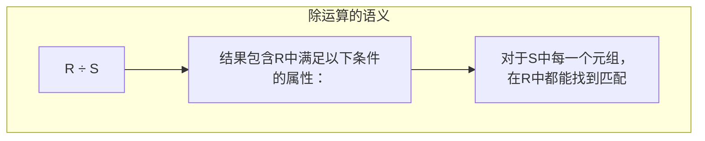
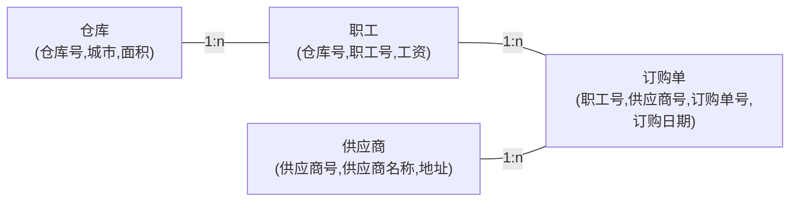

# 数据库原理习题集 — 第二部分 关系数据库

## 一、单项选择题

### 题目1

对关系模型叙述错误的是（）。

A. 建立在严格的数学理论、集合论和谓词演算公式的基础之上
B. 微机 DBMS 绝大部分采取关系数据模型
C. 用二维表表示关系模型是其一大特点
D. 不具有连接操作的 DBMS 也可以是关系数据库系统

> [!tip]- 答案
> **D**
>
> 连接运算是关系数据库系统的基本操作之一，不具备连接操作的 DBMS 不能称为完整的关系数据库系统。

---

### 题目2

关系数据库管理系统应能实现的专门关系运算包括（）。

A. 排序、索引、统计　B. 选择、投影、连接　C. 关联、更新、排序　D. 显示、打印、制表

> [!tip]- 答案
> **B. 选择、投影、连接**

---

### 题目3

关系模型中，一个关键字是（）。

A. 可由多个任意属性组成
B. 至多由一个属性组成
C. 可由一个或多个其值能惟一标识该关系模式中任何元组的属性组成
D. 以上都不是

> [!tip]- 答案
> **C**

---

### 题目4

在一个关系中如果有这样一个属性存在，它的值能惟一地标识关系中的每一个元组，称这个属性为（）。

A. 关键字　B. 数据项　C. 主属性　D. 主属性值

> [!tip]- 答案
> **A. 关键字**

---

### 题目5

同一个关系模型的任两个元组值（）。

A. 不能全同　B. 可全同　C. 必须全同　D. 以上都不是

> [!tip]- 答案
> **A. 不能全同**
>
> 关系的实体完整性规则要求主码不能重复，任两个元组不能完全相同。

---

### 题目6

在通常情况下，下面的关系中不可以作为关系数据库的关系是（）。

A. R1(学生号，学生名，性别)
B. R2(学生号，学生名，班级号)
C. R3(学生号，学生名，宿舍号)
D. R4(学生号，学生名，简历)

> [!tip]- 答案
> **D**
>
> "简历"字段通常包含大段文本，不可再分性差，不满足 1NF 对属性原子性的要求。

---

### 题目7

一个关系数据库文件中的各条记录（）。

A. 前后顺序不能任意颠倒，一定要按照输入的顺序排列
B. 前后顺序可以任意颠倒，不影响库中的数据关系
C. 前后顺序可以任意颠倒，但排列顺序不同，统计处理的结果就可能不同
D. 前后顺序不能任意颠倒，一定要按照关键字段值的顺序排列

> [!tip]- 答案
> **B**
>
> 关系是集合的数学概念，元组无序。

---

### 题目8

在关系代数的传统集合运算中，假定有关系 R 和 S，运算结果为 W。如果 W 中的元组属于 R，或者属于 S，则 W 为①运算的结果。如果 W 中的元组属于 R 而不属于 S，则 W 为②运算的结果。如果 W 中的元组既属于 R 又属于 S，则 W 为③运算的结果。

A. 笛卡尔积　B. 并　C. 差　D. 交

> [!tip]- 答案
> ①**B. 并** ②**C. 差** ③**D. 交**

---

### 题目9

在关系代数的专门关系运算中，从表中取出满足条件的属性的操作称为①；从表中选出满足某种条件的元组的操作称为②；将两个关系中具有共同属性值的元组连接到一起构成新表的操作称为③。

A. 选择　B. 投影　C. 连接　D. 扫描

> [!tip]- 答案
> ①**B. 投影** ②**A. 选择** ③**C. 连接**

---

### 题目10

自然连接是构成新关系的有效方法。一般情况下，当对关系 R 和 S 使用自然连接时，要求 R 和 S 含有一个或多个共有的（）。

A. 元组　B. 行　C. 记录　D. 属性

> [!tip]- 答案
> **D. 属性**

---

### 题目11

等值连接与自然连接是（）。

A. 相同的　B. 不同的

> [!tip]- 答案
> **B. 不同的**
>
> 等值连接保留重复属性列，自然连接去除重复属性列。自然连接是等值连接的特例。

---

### 题目12

设有 R1(A,B,C)，R2(D,E,M)，经过运算后得到 R3(A,B,C,D,E)，该运算是（）。

A. 交　B. 并　C. 笛卡尔积　D. 连接

> [!tip]- 答案
> **D. 连接**
>
> R3 有 5 个属性（少于 R1 的 3 + R2 的 3 = 6），说明公共属性被去重，是自然连接或等值连接。

---

### 题目13

设有属性 A，B，C，D，以下表示中不是关系的是（）。

A. R(A)　B. R(A, B, C, D)　C. R(A×B×C×D)　D. R(A, B)

> [!tip]- 答案
> **C**
>
> 关系的属性是并列的，不能用乘号连接。

---

### 题目14

设关系 R(A, B, C) 和 S(B, C, D)，下列各关系代数表达式不成立的是（）。

A. πA(R) ⋈ πD(S)
B. R ∪ S
C. πB(R) ∩ πB(S)
D. R ⋈ S

> [!tip]- 答案
> **B**
>
> 并运算要求两个关系具有相同的属性个数和对应的属性域。R 有 3 个属性(A,B,C)，S 有 3 个属性(B,C,D)，属性名不同，不满足并相容条件。

---

### 题目15

关系运算中花费时间可能最长的运算是（）。

A. 投影　B. 选择　C. 笛卡尔积　D. 除

> [!tip]- 答案
> **C. 笛卡尔积**
>
> 笛卡尔积产生 m × n 个元组，数据量最大。

---

### 题目16

关系模式的任何属性（）。

A. 不可再分　B. 可再分　C. 命名在该关系模式中可以不惟一　D. 以上都不是

> [!tip]- 答案
> **A. 不可再分**
>
> 1NF 要求属性原子性。

---

### 题目17

在关系代数运算中，五种基本运算为（）。

A. 并、差、选择、投影、自然连接
B. 并、差、交、选择、投影
C. 并、差、选择、投影、乘积
D. 并、差、交、选择、乘积

> [!tip]- 答案
> **C. 并、差、选择、投影、乘积（笛卡尔积）**

---

### 题目18

关系数据库用①来表示实体之间的联系，其任何检索操作的实现都是由②三种基本操作组合而成的。

① A. 层次模型　B. 网状模型　C. 指针链　D. 表格数据

② A. 选择、投影和扫描　B. 选择、投影和连接　C. 选择、运算和投影　D. 选择、投影和比较

> [!tip]- 答案
> ①**D. 表格数据** ②**B. 选择、投影和连接**

---

### 题目19

关系数据库中的关键字是指（）。

A. 能惟一决定关系的字段
B. 不可改动的专用保留字
C. 关键的很重要的字段
D. 能惟一标识元组的属性或属性集合

> [!tip]- 答案
> **D**

---

### 题目20

设有关系 R，按条件 f 对关系 R 进行选择，正确的是（）。

A. R ⋈ R
B. R ⋈f R
C. σf(R)
D. πf(R)

> [!tip]- 答案
> **C. σf(R)**

---

### 题目21

在关系数据模型中，通常可以把①称为属性，而把②称为关系模式。常用的关系运算是关系代数和③。在关系代数中，对一个关系做投影操作后，新关系的元组个数④原来关系的元组个数。用⑤形式表示实体类型和实体间的联系是关系模型的主要特征。

① A. 记录　B. 基本表　C. 模式　D. 字段
② A. 记录　B. 记录类型　C. 元组　D. 元组集
③ A. 集合代数　B. 逻辑演算　C. 关系演算　D. 集合演算
④ A. 小于　B. 小于或等于　C. 等于　D. 大于
⑤ A. 指针　B. 链表　C. 关键字　D. 表格

> [!tip]- 答案
> ①**D. 字段** ②**B. 记录类型** ③**C. 关系演算** ④**B. 小于或等于** ⑤**D. 表格**
>
> 投影后可能去除重复元组，故"小于或等于"。

---

## 二、填空题

### 题目22

关系操作的特点是\_\_\_\_操作。

> [!tip]- 答案
> **集合**

---

### 题目23

一个关系模式的定义格式为\_\_\_\_。

> [!tip]- 答案
> `关系名(属性名1, 属性名2, …, 属性名n)`

---

### 题目24

一个关系模式的定义主要包括①、②、③、④和⑤。

> [!tip]- 答案
> ①**关系名** ②**属性名** ③**属性类型** ④**属性长度** ⑤**关键字**

---

### 题目25

关系数据库中可命名的最小数据单位是\_\_\_\_。

> [!tip]- 答案
> **属性名**

---

### 题目26

关系模式是关系的①，相当于②。

> [!tip]- 答案
> ①**框架** ②**记录格式**

---

### 题目27

在一个实体表示的信息中，称\_\_\_\_为关键字。

> [!tip]- 答案
> **能惟一标识实体的属性或属性组**

---

### 题目28

关系代数运算中，传统的集合运算有①、②、③和④。

> [!tip]- 答案
> ①**笛卡尔积** ②**并** ③**交** ④**差**

---

### 题目29

关系代数运算中，基本的运算是①、②、③、④和⑤。

> [!tip]- 答案
> ①**并** ②**差** ③**笛卡尔积** ④**投影** ⑤**选择**

---

### 题目30

关系代数运算中，专门的关系运算有①、②和③。

> [!tip]- 答案
> ①**选择** ②**投影** ③**连接**

---

### 题目31

关系数据库中基于数学上两类运算是①和②。

> [!tip]- 答案
> ①**关系代数** ②**关系演算**

---

### 题目32

传统的集合"并、交、差"运算施加于两个关系时，这两个关系的①必须相等，②必须取自同一个域。

> [!tip]- 答案
> ①**属性个数** ②**相对应的属性值**

---

### 题目33

关系代数中，从两个关系中找出相同元组的运算称为\_\_\_\_运算。

> [!tip]- 答案
> **交**

---

### 题目34

已知系(系编号，系名称，系主任，电话，地点)和学生(学号，姓名，性别，入学日期，专业，系编号)两个关系，系关系的主关键字是①，系关系的外关键字是②，学生关系的主关键字是③，外关键字是④。

> [!tip]- 答案
> ①**系编号** ②**无** ③**学号** ④**系编号**

---

### 题目35

关系代数是用对关系的运算来表达查询的，而关系演算是用①查询的，它又分为②演算和③演算两种。

> [!tip]- 答案
> ①**谓词表达** ②**元组关系** ③**域关系**

---

## 三、简述与应用题

### 题目36

叙述等值连接与自然连接的区别和联系。

> [!note] 参考答案
> 等值连接表示为 R ⋈(R.A=S.B) S，自然连接表示为 R ⋈ S；自然连接是除去重复属性的等值连接。
>
> 两者之间的区别和联系如下：
> 1. 自然连接一定是等值连接，但等值连接不一定是自然连接。
> 2. 等值连接要求相等的分量，不一定是公共属性；而自然连接要求相等的分量必须是公共属性。
> 3. 等值连接不把重复的属性除去；而自然连接要把重复的属性除去。

| 对比项 | 等值连接 | 自然连接 |
|--------|---------|---------|
| 比较属性 | 任意属性 | 公共属性 |
| 重复列 | 保留 | 去除 |
| 关系 | 一般情况 | 等值连接的特例 |

---

### 题目37

举例说明关系参照完整性的含义。

> [!note] 参考答案
> **成绩表：**

| 学号 | 姓名 | 课程号 | 成绩 |
|------|------|--------|------|
| 101 | 刘林 | K5 | 80 |
| 212 | 王红 | K8 | 78 |
| 221 | 李平 | K9 | 90 |

> **课程表：**

| 课程号 | 课程名 |
|--------|--------|
| K5 | 高等数学 |
| K8 | 程序设计 |
| K9 | 操作系统 |

> [!definition] 参照完整性
> 在成绩表中，课程号是外关键字；课程表中课程号是关键字。
>
> 参照完整性要求：成绩表中外码课程号的值，**或者为空，或者必须在课程表主码课程号中能够找到**。
>
> 如果成绩表出现课程号 K20，而课程表没有 K20，则违反参照完整性，会造成数据不一致。

---

### 题目38

设有关系 R 和 S，计算：

(1) R1 = R - S　(2) R2 = R ∪ S　(3) R3 = R ∩ S　(4) R4 = R × S

> [!note]- 参考答案
> 1. R - S：属于 R 但不属于 S 的元组；
> 2. R ∪ S：属于 R 或者属于 S 的元组，去重；
> 3. R ∩ S：既属于 R 又属于 S 的元组；
> 4. R × S：R 每一个元组与 S 每一个元组全部拼接，元组数 = |R| × |S|。

---

### 题目39

设有关系 R，S 和 T，计算：

(1) R1 = R ∪ S
(2) R2 = R - S
(3) R3 = R ⋈ T
(4) R4 = σ(A<C)(R × T)
(5) R5 = πA(R)
(6) R6 = σ(A=C)(R × T)

> [!note]- 参考答案
> (1) 并：取 R、S 所有元组，去除重复；
> (2) 差：R 中去掉同时出现在 S 中的元组；
> (3) 自然连接：按公共属性相等合并，去掉重复属性；
> (4) 先笛卡尔积，筛选满足 A < C 条件的元组；
> (5) 投影，只保留 A 列；
> (6) 笛卡尔积后筛选 A = C 的元组。

---

### 题目40

设有关系 R，S，计算：

(1) R1 = R ⋈ S
(2) R2 = R ⋈([2]<[2]) S
(3) R3 = σ(B='d')(R × S)

> [!note]- 参考答案
> (1) 自然连接，公共属性等值匹配，消除重复属性；
> (2) θ 连接，R 的第 2 列小于 S 的第 2 列；
> (3) 笛卡尔积后，筛选 R 的 B 属性等于 `'d'` 的元组。

---

### 题目41

将关系代数中的五种基本运算用元组关系演算表达式表示。

> [!note]- 参考答案
> 1. **并**：R ∪ S = {t | R(t) ∨ S(t)}
> 2. **差**：R - S = {t | R(t) ∧ ¬ S(t)}
> 3. **笛卡尔积**（R 为 k1 元，S 为 k2 元）：
>
> R × S = {t | ∃ u ∃ v(R(u) ∧ S(v) ∧ t[1]=u[1] ∧ ⋯ ∧ t[k1]=u[k1] ∧ t[k1+1]=v[1] ∧ ⋯ ∧ t[k1+k2]=v[k2])}
>
> 4. **投影**：π(i1, i2, …, ik)(R) = {t | ∃ u(R(u) ∧ t[1]=u[i1] ∧ ⋯ ∧ t[k]=u[ik])}
> 5. **选择**：σF(R) = {t | R(t) ∧ F'}，F' 是与条件 F 等价的谓词公式。

---

### 题目42

如有关系 R、S 和 W，写出域演算表达式结果。

(1) R1 = {x y z | R(x y z) ∧ (z > 5 ∨ y = 'a')}
(2) R2 = {x y z | R(x y z) ∨ (S(x y z) ∧ (x = 5 ∧ z ≠ 6))}
(3) R3 = {v y x | ∃ u ∃ v (R(x y z) ∧ W(u v t) ∧ z > u)}

> [!note]- 参考答案
> (1) 取 R 中满足 z > 5 或者 y = 'a' 的元组；
> (2) 取满足条件的 R 或者 S 中元组；
> (3) 从 R、W 中选取满足 z > u 条件的元组，重新排列属性顺序为 v, y, x。

---

### 题目43

将关系代数中的五种基本运算用域关系演算表达式表示（假设 R 和 S 都为属性名相同的二元关系）。

> [!note]- 参考答案
> 1. **并**：R ∪ S = {x y | R(x y) ∨ S(x y)}
> 2. **差**：R - S = {x y | R(x y) ∧ ¬ S(x y)}
> 3. **笛卡尔积**：R × S = {w x y z | ∃ w ∃ y(R(w x) ∧ S(y z))}
> 4. **投影**：π2(R) = {y | ∃ x R(x y)}
> 5. **选择**：σF(R) = {x y | R(x y) ∧ F'}，F' 为等价条件谓词。

---

### 题目44

设有两个关系 E1 和 E2，E2 是 E1 运算结果，写出运算表达式。

> [!note]- 参考答案
> 示例：π(2,3)(σ(B>2)(E1))，也可写作 π(2,3)(σ(C>3)(E1))。

---

### 题目45

设有三个关系 S、C 和 SC。

- S(学号，姓名，年龄，性别，籍贯)
- C(课程号，课程名，教师，办公室)
- SC(学号，课程号，成绩)

完成：

(1) 检索籍贯为上海的学生姓名、学号和选修的课程号。
(2) 检索选修操作系统的学生姓名、课程号和成绩。
(3) 检索选修了全部课程的学生姓名、年龄。

> [!note]- 参考答案
> (1) π(姓名, S.学号, 课程号)(σ(籍贯='上海')(S) ⋈ SC)
>
> (2) π(姓名, SC.课程号, 成绩)(S ⋈ SC ⋈ σ(课程名='操作系统')(C))
>
> (3) π(姓名, 年龄)(S ⋈ (π(学号, 课程号)(SC) ÷ π(课程号)(C)))

---

### 题目46

设有 S(S#, SNAME, AGE, SEX)、C(C#, CNAME, TEACHER)、SC(S#, C#, GRADE)，用关系代数写出：

(1) 检索"程军"老师所授课程的课程号(C#)和课程名(CNAME)。
(2) 检索年龄大于 21 的男学生学号(S#)和姓名(SNAME)。
(3) 检索至少选修"程军"老师所授全部课程的学生姓名(SNAME)。
(4) 检索"李强"同学不学课程的课程号(C#)。
(5) 检索至少选修两门课程的学生学号(S#)。
(6) 检索全部学生都选修的课程的课程号(C#)和课程名(CNAME)。
(7) 检索选修课程包含"程军"老师所授课程之一的学生学号(S#)。
(8) 检索选修课程号为 k1 和 k5 的学生学号(S#)。
(9) 检索选修全部课程的学生姓名(SNAME)。
(10) 检索选修课程包含学号为 2 的学生所修课程的学生学号(S#)。
(11) 检索选修课程名为"C 语言"的学生学号(S#)和姓名(SNAME)。

> [!note]- 参考答案
> (1) π(C#, CNAME)(σ(TEACHER='程军')(C))
>
> (2) π(S#, SNAME)(σ(AGE>21 ∧ SEX='男')(S))
>
> (3) π(SNAME)(S ⋈ (π(S#, C#)(SC) ÷ π(C#)(σ(TEACHER='程军')(C))))
>
> (4) π(C#)(C) - π(C#)(σ(SNAME='李强')(S) ⋈ SC)
>
> (5) π(S#)(σ([1]=[4] ∧ [2] ≠ [5])(SC × SC))
>
> (6) π(C#, CNAME)(C ⋈ (π(S#, C#)(SC) ÷ π(S#)(S)))
>
> (7) π(S#)(SC ⋈ π(C#)(σ(TEACHER='程军')(C)))
>
> (8) π(S#, C#)(SC) ÷ π(C#)(σ(C#='k1' ∨ C#='k5')(C))
>
> (9) π(SNAME)(S ⋈ (π(S#, C#)(SC) ÷ π(C#)(C)))
>
> (10) π(S#, C#)(SC) ÷ π(C#)(σ(S#='2')(SC))
>
> (11) π(S#, SNAME)(S ⋈ (π(S#)(SC) ⋈ σ(CNAME='C语言')(C)))

---

### 题目47

仓库(仓库号，城市，面积)；职工(仓库号，职工号，工资)；订购单(职工号，供应商号，订购单号，订购日期)；供应商(供应商号，供应商名称，地址)。

(1) 检索在仓库 WH2 工作的职工的工资。
(2) 检索在上海工作的职工的工资。
(3) 检索北京的供应商名称。
(4) 检索目前与职工 E6 有业务联系的供应商名称。
(5) 检索所有职工的工资大于 1220 的仓库所在的城市。
(6) 检索和北京的所有供应商都有业务联系的职工的工资。

> [!note]- 参考答案
> (1) π(职工号, 工资)(σ(仓库号='WH2')(职工))
>
> (2) π(职工号, 工资)(σ(城市='上海')(仓库) ⋈ 职工)
>
> (3) π(供应商名称)(σ(地址='北京')(供应商))
>
> (4) π(供应商名称)(σ(职工号='E6')(订购单) ⋈ 供应商)
>
> (5) π(城市)(仓库 ⋈ (π(仓库号)(职工) - π(仓库号)(σ(工资 ≤ 1220)(职工))))
>
> (6) 令 R = π(供应商号)(σ(地址='北京')(供应商))，则：
>
> π(工资)(职工 ⋈ (π(职工号, 供应商号)(订购单) ÷ R))

