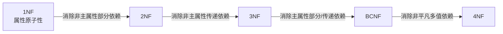
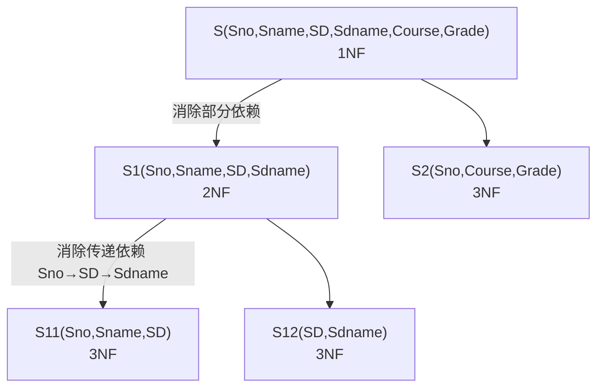

# 数据库原理习题集 — 第四部分 关系数据理论

## 一、单项选择题

### 题目1

关系规范化中的删除操作异常是指（），插入操作异常是指（）。

A. 不该删除的数据被删除
B. 不该插入的数据被插入
C. 应该删除的数据未被删除
D. 应该插入的数据未被插入

> [!tip]- 答案
> 删除异常：**①A. 不该删除的数据被删除**；插入异常：**②D. 应该插入的数据未被插入**

---

### 题目2

设计性能较优的关系模式称为规范化，规范化主要的理论依据是（）。

A. 关系规范化理论　B. 关系运算理论　C. 关系代数理论　D. 数理逻辑

> [!tip]- 答案
> **A. 关系规范化理论**

---

### 题目3

规范化过程主要为克服数据库逻辑结构中的插入异常、删除异常以及（）的缺陷。

A. 数据的不一致性　B. 结构不合理　C. 冗余度大　D. 数据丢失

> [!tip]- 答案
> **C. 冗余度大**

---

### 题目4

当关系模式 R(A, B) 已属于 3NF，下列说法中（）是正确的。

A. 它一定消除了插入和删除异常
B. 仍存在一定的插入和删除异常
C. 一定属于 BCNF
D. A 和 C 都是

> [!tip]- 答案
> **B. 仍存在一定的插入和删除异常**
>
> 3NF 只消除**非主属性**对码的部分/传递依赖，主属性仍可能存在不良依赖；BCNF 才能进一步消除。

---

### 题目5

关系模型中的关系模式至少是（）。

A. 1NF　B. 2NF　C. 3NF　D. BCNF

> [!tip]- 答案
> **A. 1NF**

---

### 题目6

在关系 DB 中，任何二元关系模式的最高范式必定是（）。

A. 1NF　B. 2NF　C. 3NF　D. BCNF

> [!tip]- 答案
> **D. BCNF**
>
> 二元关系（只有两个属性）中，任何非平凡函数依赖的决定因素必包含码，必然满足 BCNF。

---

### 题目7

候选关键字中的属性称为（）。

A. 非主属性　B. 主属性　C. 复合属性　D. 关键属性

> [!tip]- 答案
> **B. 主属性**

---

### 题目8

消除了部分函数依赖的 1NF 的关系模式，必定是（）。

A. 1NF　B. 2NF　C. 3NF　D. 4NF

> [!tip]- 答案
> **B. 2NF**

---

### 题目9

关系模式的候选关键字可以有①，主关键字有②。

① A. 0 个　B. 1 个　C. 1 个或多个　D. 多个
② A. 0 个　B. 1 个　C. 1 个或多个　D. 多个

> [!tip]- 答案
> ①**C. 1 个或多个**　②**B. 1 个**
>
> 候选码可以有多个；主码（主键）是从候选码中选定的一个。

---

### 题目10

根据关系数据库规范化理论，关系数据库中的关系要满足第一范式。下面"部门"关系中，因哪个属性而使它不满足第一范式（）。

部门（部门号，部门名，部门成员，部门总经理）

A. 部门总经理　B. 部门成员　C. 部门名　D. 部门号

> [!tip]- 答案
> **B. 部门成员**
>
> "部门成员"是多值属性（一个部门有多个成员），属性不可再分/含多个值，违反 1NF。

---

## 二、填空题

### 题目11

在关系 A(S, SN, D) 和 B(D, CN, NM) 中，A 的主键是 S，B 的主键是 D，则 D 在 A 中称为\_\_\_\_。

> [!tip]- 答案
> **外部键（外码/外键）**

---

### 题目12

对于非规范化的模式，经过\_\_\_\_转变为 1NF，将 1NF 经过\_\_\_\_转变为 2NF，将 2NF 经过\_\_\_\_转变为 3NF。

> [!tip]- 答案
> **使属性域变为简单域（属性原子化）；消除非主属性对主关键字的部分函数依赖；消除非主属性对主关键字的传递函数依赖**

---

### 题目13

在关系数据库的规范化理论中，在执行"分解"时，必须遵守规范化原则：保持原有的依赖关系和\_\_\_\_。

> [!tip]- 答案
> **无损连接性**

---

## 三、应用题

### 题目14

已知学生关系模式：

S(Sno, Sname, SD, Sdname, Course, Grade)

其中：Sno 学号、Sname 姓名、SD 系名、Sdname 系主任名、Course 课程、Grade 成绩。

(1) 写出关系模式 S 的基本函数依赖和主码。
(2) 原关系模式 S 为几范式？为什么？分解成高一级范式，并说明为什么？
(3) 将关系模式分解成 3NF，并说明为什么？

> [!note]- 参考答案
> **(1) 基本函数依赖与主码**
>
> - Sno → Sname
> - Sno → SD
> - SD → Sdname
> - (Sno, Course) → Grade
>
> 主码：**(Sno, Course)**
>
> **(2) 原关系属于 1NF。**
>
> 非主属性 Sname、SD、Sdname 仅依赖 Sno，对码 (Sno, Course) 存在**部分函数依赖**，不满足 2NF。
>
> 分解为 2NF（消除部分依赖）：
> - S1(Sno, Sname, SD, Sdname)，主码 Sno
> - S2(Sno, Course, Grade)，主码 (Sno, Course)
>
> **(3) 分解为 3NF。**
>
> S1 中存在传递函数依赖 Sno → SD → Sdname，不满足 3NF，继续分解：
> - S11(Sno, Sname, SD)，主码 Sno
> - S12(SD, Sdname)，主码 SD
> - S2(Sno, Course, Grade)，主码 (Sno, Course)
>
> S11、S12、S2 中均无非主属性对码的部分/传递函数依赖，满足 3NF。

---

### 题目15

设有关系模式 R(A, B, C, D, E)，其上的函数依赖集：F = {A → BC, CD → E, B → D, E → A}。

(1) 计算 (AB) 关于 F 的属性闭包。
(2) 求出 R 的所有候选关键字。

> [!note]- 参考答案
> **(1) 求属性闭包 (AB)⁺**
>
> | 迭代 | 已得属性 | 新增依据 |
> |------|---------|---------|
> | X(0) | {A, B} | 初始 |
> | X(1) | {A, B, C} | A → BC，加入 C |
> | X(2) | {A, B, C, D} | B → D，加入 D |
> | X(3) | {A, B, C, D, E} | CD → E，加入 E |
>
> 所以 **(AB)⁺ = {A, B, C, D, E} = U**，AB 是超码。
>
> **(2) 求候选码：**
>
> - (AB)⁺ = ABCD = U ✓
> - (CD)⁺：CD → E → A → BC，得 ABCDE ✓
> - E：E → A → BC → D，得 ABCDE ✓
>
> 候选码为：**AB、CD、E**（均不可再去掉属性，均为最小超码）。

---

### 题目16

设有关系模式 R(U, F)，其中 U = {A, B, C, D, E}，F = {D → E, E → D, A → D, B → D}。

(1) 求 R 的候选码。
(2) 判断 R 最高达到第几范式，说明理由。
(3) 将 R 分解为 3NF 模式集。

> [!note]- 参考答案
> **(1) 候选码：(A, B, C)**
>
> C 不出现在任何函数依赖中，必在候选码中；A → D、B → D、D → E，故 (A, B, C)⁺ = {A, B, C, D, E} = U，且去掉任一属性都不能推出全部属性。
>
> **(2) 属于 1NF。**
>
> 存在非主属性 D、E 对候选码 (A, B, C) 的部分函数依赖（A → D，B → D），不满足 2NF。
>
> **(3) 3NF 分解（按函数依赖分组，保证无损 + 保持依赖）：**
>
> - R1(A, D)，A → D
> - R2(B, D)，B → D
> - R3(D, E)，D → E，E → D
> - R4(A, B, C)，候选码表（保证无损连接）
>
> [!warning] 订正说明
> 原答案写作 R1(A, D, E) 含 A → D → E 的传递依赖，不满足 3NF；正确做法是把 D → E、E → D 单独分为 R3(D, E)。

---

### 题目17

设有关系模式 R(职工号, 项目号, 工资, 部门号, 部门名称)。

规定：每个职工可以参加多个项目，每个项目有多个职工参加；职工参加一个项目就有一份工资；一个职工只属于一个部门；一个部门只有一个部门名称。

(1) 写出函数依赖集。
(2) 找出 R 的候选码。
(3) 判断 R 属于第几范式，说明理由。
(4) 分解为 3NF 模式集。

> [!note]- 参考答案
> **(1) 函数依赖：**
>
> - (职工号, 项目号) → 工资
> - 职工号 → 部门号
> - 部门号 → 部门名称
>
> **(2) 候选码：(职工号, 项目号)**
>
> **(3) 属于 1NF。**
>
> 非主属性部门号仅由职工号决定，对候选码存在**部分函数依赖**（职工号 → 部门号），不满足 2NF（部门名称还经部门号传递依赖于码）。
>
> **(4) 3NF 分解：**
> - R1(职工号, 项目号, 工资)，主码 (职工号, 项目号)
> - R2(职工号, 部门号)，主码 职工号
> - R3(部门号, 部门名称)，主码 部门号

---

### 题目18

设有关系模式 R(A, B, C, D)，函数依赖 F = {AB → C, C → D, D → A}。

(1) 找出 R 的全部候选码。
(2) 判断 R 最高达到第几范式，是否属于 BCNF，说明理由。

> [!note]- 参考答案
> **(1) 求候选码：**
>
> B 不出现在任何依赖的右部，必在候选码中。
>
> - (AB)⁺：AB → C，C → D ⇒ ABCD ✓
> - (BC)⁺：C → D，D → A ⇒ ABCD ✓
> - (BD)⁺：D → A，AB → C ⇒ ABCD ✓
>
> 候选码为：**AB、BC、BD**。
>
> [!warning] 订正说明
> 原答案只列出 AB、BC，遗漏 BD：由 D → A 得 A，再由 AB → C 得 C，(BD)⁺ 同样等于 U。
>
> **(2) 最高 3NF，不是 BCNF。**
>
> A、B、C、D 全部出现在某个候选码中，**所有属性都是主属性**，不存在非主属性对码的部分/传递依赖，满足 3NF；
>
> 但 C → D、D → A 的决定因素 C、D 都不是超码（C 单独不能推出 B，D 单独不能推出 B、C），不满足 BCNF。

---

### 题目19

设有一关系模式 R(学号, 姓名, 年龄, 课程号, 课程名, 成绩)。

函数依赖：学号 → 姓名，学号 → 年龄，课程号 → 课程名，(学号, 课程号) → 成绩。

(1) 求候选码。
(2) R 属于第几范式，说明理由。
(3) 分解为 3NF。

> [!note]- 参考答案
> **(1) 候选码：(学号, 课程号)**
>
> **(2) 属于 1NF。** 姓名、年龄仅依赖学号，课程名仅依赖课程号，均为对候选码的**部分函数依赖**，不满足 2NF。
>
> **(3) 3NF 分解：**
> - R1(学号, 姓名, 年龄)，主码 学号
> - R2(课程号, 课程名)，主码 课程号
> - R3(学号, 课程号, 成绩)，主码 (学号, 课程号)

---

### 题目20

设有关系模式 R(商店编号, 商品编号, 数量, 部门编号, 负责人)。

规定：

1. 每个商店的每种商品只在一个部门销售；
2. 每个商店的每个部门只有一个负责人；
3. 每个商店的每种商品只有一个库存数量。

(1) 写出基本函数依赖。
(2) 找出候选码。
(3) R 最高达到第几范式？为什么？
(4) 分解成 3NF 模式集。

> [!note]- 参考答案
> **(1) 函数依赖：**
>
> - (商店编号, 商品编号) → 部门编号
> - (商店编号, 部门编号) → 负责人
> - (商店编号, 商品编号) → 数量
>
> **(2) 候选码：(商店编号, 商品编号)**
>
> **(3) 最高 2NF。**
>
> 不存在非主属性对码的部分函数依赖（数量、部门编号都完全依赖整个码）；但存在**传递函数依赖**：(商店编号, 商品编号) → 部门编号，而 (商店编号, 部门编号) → 负责人，负责人经部门编号传递依赖于候选码，不满足 3NF。
>
> **(4) 3NF 分解：**
> - R1(商店编号, 商品编号, 数量, 部门编号)，主码 (商店编号, 商品编号)
> - R2(商店编号, 部门编号, 负责人)，主码 (商店编号, 部门编号)

---

## 四、简答题

### 题目21

什么叫函数依赖？什么叫部分函数依赖？什么叫完全函数依赖？什么叫传递函数依赖？

> [!note] 参考答案
> 1. **函数依赖**：设 R(U) 是属性集 U 上的关系模式，X、Y 是 U 的子集。若对于 R(U) 的任意一个可能的关系 r，r 中不可能存在两个元组在 X 上的属性值相等而在 Y 上属性值不等，则称 X 函数决定 Y，记作 **X → Y**。
> 2. **完全函数依赖**：X → Y，且 X 的任何真子集 X′ 都有 X′ ↛ Y，记作 **X →(F) Y**。
> 3. **部分函数依赖**：X → Y，但存在 X 的真子集 X′ 使得 X′ → Y，记作 **X →(P) Y**。
> 4. **传递函数依赖**：若 X → Y，Y ↛ X，Y → Z，且 Z ∉ Y，则称 Z 传递函数依赖于 X。

---

### 题目22

简述 1NF、2NF、3NF、BCNF 的定义。

> [!note] 参考答案
> - **1NF**：关系中每一个属性都是不可再分的原子属性（属性值是原子值）。
> - **2NF**：满足 1NF，且每一个非主属性都**完全函数依赖**于码（消除非主属性对码的部分函数依赖）。
> - **3NF**：满足 2NF，且每一个非主属性都**不传递函数依赖**于码（等价说法：每个非平凡函数依赖 X → Y，要么 X 是超码，要么 Y 是主属性）。
> - **BCNF**：满足 3NF，且对于每一个非平凡函数依赖 X → Y，决定因素 X 都包含码（即 X 必是超码）。

---

### 题目23

简述模式分解的两个等价标准。

> [!note] 参考答案
> 1. **无损连接性**：分解后的各个关系做自然连接能够还原原来的关系，不丢失元组，也不产生多余的虚假元组。
> 2. **保持函数依赖性**：分解后各子模式上函数依赖的并集与原关系的函数依赖集等价，不丢失语义约束。

---

### 题目24

规范化的目的是什么？

> [!note] 参考答案
> 规范化的目的是改造关系模式，消除关系中存在的**插入异常、删除异常、修改（更新）异常**，降低**数据冗余**。通过模式分解，把低范式的关系转化为若干个高范式关系，使数据结构更合理、存储更经济、一致性更好。

---

### 题目25

3NF 和 BCNF 的区别？

> [!note] 参考答案
> - **3NF**：消除**非主属性**对码的部分、传递函数依赖；但允许**主属性**对码存在部分/传递依赖。
> - **BCNF**：消除**所有属性（主属性和非主属性）**对码的部分、传递函数依赖；每一个非平凡函数依赖的决定因素都必须包含码（是超码）。
>
> BCNF 是比 3NF 更高的范式：满足 BCNF 一定满足 3NF，满足 3NF 不一定满足 BCNF。
