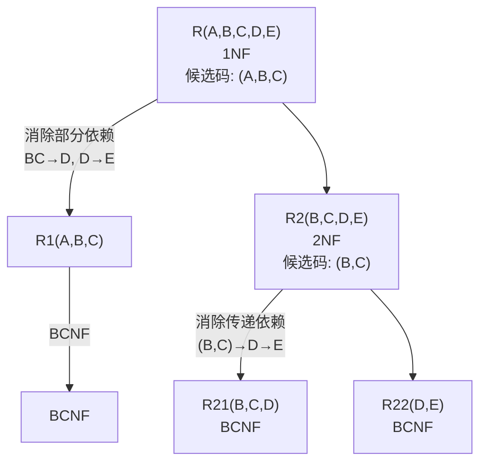

# 数据库原理期末综合试卷（试题一）

## 一、单项选择题

**题目1.** 数据库系统的核心是（ ）

A. 数据库　B. 数据库管理系统　C. 数据模型　D. 软件工具

> [!tip]- 答案
> **B. 数据库管理系统**

---

**题目2.** 下列四项中，不属于数据库系统的特点的是（ ）

A. 数据结构化　B. 数据由DBMS统一管理和控制　C. 数据冗余度大　D. 数据独立性高

> [!tip]- 答案
> **C**
>
> 数据库系统的特点是数据共享性高、冗余度低，而非冗余度大。

---

**题目3.** 概念模型是现实世界的第一层抽象，这一类模型中最著名的模型是（ ）

A. 层次模型　B. 关系模型　C. 网状模型　D. 实体-联系模型

> [!tip]- 答案
> **D. 实体-联系模型**

---

**题目4.** 数据的物理独立性是指（ ）

A. 数据库与数据库管理系统相互独立　B. 用户程序与数据库管理系统相互独立　C. 用户的应用程序与存储在磁盘上数据库中的数据是相互独立的　D. 应用程序与数据库中数据的逻辑结构是相互独立的

> [!tip]- 答案
> **C**
>
> 物理独立性指应用程序与存储结构（内模式）相互独立，由模式/内模式映像保证。

---

**题目5.** 要保证数据库的逻辑数据独立性，需要修改的是（ ）

A. 模式与外模式之间的映象　B. 模式与内模式之间的映象　C. 模式　D. 三级模式

> [!tip]- 答案
> **A. 模式与外模式之间的映象**

---

**题目6.** 关系数据模型的基本数据结构是（ ）

A. 树　B. 图　C. 索引　D. 关系

> [!tip]- 答案
> **D. 关系**

---

**题目7.** 有一名为"列车运营"实体，含有：车次、日期、实际发车时间、实际抵达时间、情况摘要等属性，该实体主码是（ ）

A. 车次　B. 日期　C. 车次+日期　D. 车次+情况摘要

> [!tip]- 答案
> **C. 车次+日期**
>
> 同一车次在不同日期运营，需 (车次, 日期) 联合标识。

---

**题目8.** 已知关系 R 和 S，R ∩ S 等价于（ ）

A. (R-S)-S　B. S-(S-R)　C. (S-R)-R　D. S-(R-S)

> [!tip]- 答案
> **B. S-(S-R)**

---

**题目9.** 学校数据库中有学生和宿舍两个关系：学生（学号，姓名）和宿舍（楼名，房间号，床位号，学号）。假设有的学生不住宿，床位也可能空闲。如果要列出所有学生住宿和宿舍分配的情况，包括没有住宿的学生和空闲的床位，则应执行（ ）

A. 全外联接　B. 左外联接　C. 右外联接　D. 自然联接

> [!tip]- 答案
> **A. 全外联接**
>
> 需要保留两边不匹配的元组（未住宿学生 + 空闲床位），故用全外联接。

---

**题目10.** 用下面的T-SQL语句建立一个基本表：

```sql
CREATE TABLE Student(
    Sno CHAR(4) PRIMARY KEY,
    Sname CHAR(8) NOT NULL,
    Sex CHAR(2),
    Age INT
)
```

可以插入到表中的元组是（ ）

A. '5021'，'刘祥'，男，21　B. NULL，'刘祥'，NULL，21　C. '5021'，NULL，男，21　D. '5021'，'刘祥'，NULL，NULL

> [!tip]- 答案
> **D**
>
> A 中 Sex 值 '男' 未加引号（CHAR 类型需引号）；B 中 Sno 为 NULL 违反 PRIMARY KEY；C 中 Sname 为 NULL 违反 NOT NULL。D 满足所有约束。

---

**题目11.** 把对关系 SPJ 的属性 QTY 的修改权授予用户李勇的 T-SQL 语句是（ ）

A. `GRANT QTY ON SPJ TO '李勇'`　B. `GRANT UPDATE (QTY) ON SPJ TO '李勇'`　C. `GRANT UPDATE (QTY) ON SPJ TO 李勇`　D. `GRANT UPDATE ON SPJ (QTY) TO 李勇`

> [!tip]- 答案
> **C**
>
> GRANT 语法：`GRANT UPDATE (属性名) ON 表名 TO 用户名`，用户名不加引号。

---

**题目12.** 图1中（ ）是最小关系系统

> [!note] 说明
> 原题此处插入图片"图1"，涉及 DBMS 分级示意图，最小关系系统仅支持关系数据结构和基本关系操作，不含完整的完整性约束和查询优化。

> [!tip]- 答案
> **B**

---

**题目13.** 关系规范化中的插入操作异常是指（ ）

A. 不该删除的数据被删除　B. 不该插入的数据被插入　C. 应该删除的数据未被删除　D. 应该插入的数据未被插入

> [!tip]- 答案
> **D**
>
> 插入异常 = 应该插入的数据因码约束无法插入。

---

**题目14.** 在关系数据库设计中，设计关系模式是数据库设计中（ ）阶段的任务

A. 逻辑设计　B. 物理设计　C. 需求分析　D. 概念设计

> [!tip]- 答案
> **A. 逻辑设计**

---

**题目15.** 在E-R模型中，如果有3个不同的实体型，3个m:n联系，根据E-R模型转换为关系模型的规则，转换后关系的数目为（ ）

A. 4　B. 5　C. 6　D. 7

> [!tip]- 答案
> **C. 6**
>
> 3个实体 → 3个关系 + 3个m:n联系 → 3个关系 = 6个关系。

---

**题目16.** 事务的隔离性是指（ ）

A. 一个事务内部的操作及使用的数据对并发的其他事务是隔离的　B. 事务一旦提交，对数据库的改变是永久的　C. 事务中包括的所有操作要么都做，要么都不做　D. 事务必须是使数据库从一个一致性状态变到另一个一致性状态

> [!tip]- 答案
> **A**
>
> B=持久性，C=原子性，D=一致性。

---

**题目17.** 数据库恢复的基础是利用转储的冗余数据。这些转储的冗余数据是指（ ）

A. 数据字典、应用程序、审计档案、数据库后备副本　B. 数据字典、应用程序、日志文件、审计档案　C. 日志文件、数据库后备副本　D. 数据字典、应用程序、数据库后备副本

> [!tip]- 答案
> **C. 日志文件、数据库后备副本**

---

**题目18.** 若事务 T 对数据对象 A 加上 S 锁，则（ ）

A. 事务 T 可以读 A 和修改 A，其它事务只能再对 A 加 S 锁，而不能加 X 锁。　B. 事务 T 可以读 A 但不能修改 A，其它事务只能再对 A 加 S 锁，而不能加 X 锁。　C. 事务 T 可以读 A 但不能修改 A，其它事务能对 A 加 S 锁和 X 锁。　D. 事务 T 可以读 A 和修改 A，其它事务能对 A 加 S 锁和 X 锁。

> [!tip]- 答案
> **B**
>
> S 锁（共享锁）：持锁事务可读不可写，其他事务只能加 S 锁不能加 X 锁。

---

**题目19.** 设有两个事务 T1、T2，其并发操作如下：T1：①读 A=100；③A=A-5 写回；T2：②读 A=100；④A=A-8 写回。下面评价正确的是（ ）

A. 该操作不存在问题　B. 该操作丢失修改　C. 该操作不能重复读　D. 该操作读"脏"数据

> [!tip]- 答案
> **B. 该操作丢失修改**
>
> T1 和 T2 都读到 A=100，T2 的写回覆盖了 T1 的修改（A=95 → A=92），T1 的修改丢失。

---

**题目20.** 以下（ ）封锁违反两段锁协议。

A. `Slock A … Slock B … Xlock C ………… Unlock A … Unlock B … Unlock C`  
B. `Slock A … Slock B … Xlock C ………… Unlock C … Unlock B … Unlock A`  
C. `Slock A … Slock B … Xlock C ………… Unlock B … Unlock C … Unlock A`  
D. `Slock A … Unlock A … Slock B … Xlock C ………… Unlock B … Unlock C`

> [!tip]- 答案
> **D**
>
> 两段锁协议要求：所有加锁操作在释放锁之前完成。D 中 Unlock A 后又 Slock B、Xlock C，违反协议。

---

## 二、填空题

**题目21.** 关系数据模型由关系数据结构、关系操作和 ________ 三部分组成。

> [!tip]- 答案
> **关系完整性约束**

**题目22.** 一般情况下，当对关系 R 和 S 使用自然连接时，要求 R 和 S 含有一个或多个共有的 ________。

> [!tip]- 答案
> **属性**

**题目23.** 在 Student 表的 Sname 列上建立一个唯一索引的 SQL 语句为：CREATE ________ Stusname ON student (Sname)

> [!tip]- 答案
> **UNIQUE INDEX**

**题目24.** SELECT 语句查询条件中的谓词 "!=ALL" 与运算符 ________ 等价。

> [!tip]- 答案
> **NOT IN**

**题目25.** 关系模式 R(A, B, C, D) 中，存在函数依赖关系 {A → B, A → C, A → D, (B, C) → A}，则候选码是 ________，R ∈ ________ NF。

> [!tip]- 答案
> **A 和 (B, C)**；**BCNF**
>
> A 和 (B,C) 均能函数决定全部属性；所有依赖左部均包含候选码，故为 BCNF。

**题目26.** 分E-R图之间的冲突主要有属性冲突、________、结构冲突三种。

> [!tip]- 答案
> **命名冲突**

**题目27.** ________ 是 DBMS 的基本单位，是用户定义的一个数据库操作序列。

> [!tip]- 答案
> **事务**

**题目28.** 存在一个等待事务集 {T0, T1, ..., Tn}，其中 T0 正等待被 T1 锁住的数据项，T1 正等待被 T2 锁住的数据项，Tn-1 正等待被 Tn 锁住的数据项，且 Tn 正等待被 T0 锁住的数据项，这种情形称为 ________。

> [!tip]- 答案
> **死锁**

**题目29.** ________ 是并发事务正确性的准则。

> [!tip]- 答案
> **可串行性**

---

## 三、简答题

### 题目30. 试述关系模型的参照完整性规则

> [!note] 参考答案
> 参照完整性规则：若属性（或属性组）F 是基本关系 R 的外码，它与基本关系 S 的主码 Ks 相对应（基本关系 R 和 S 不一定是不同的关系），则对于 R 中每个元组在 F 上的值必须为：
> - 取空值（F 的每个属性值均为空值）
> - 或者等于 S 中某个元组的主码值

### 题目31. 试述视图的作用

> [!note] 参考答案
> (1) 视图能够简化用户的操作。
> (2) 视图使用户能以多种角度看待同一数据。
> (3) 视图对重构数据库提供了一定程度的逻辑独立性。
> (4) 视图能够对机密数据提供安全保护。

### 题目32. 登记日志文件时必须遵循什么原则？

> [!note] 参考答案
> 登记日志文件时必须遵循两条原则：
> 1. 登记的次序严格按并发事务执行的时间次序。
> 2. **必须先写日志文件，后写数据库**（Write-Ahead Logging, WAL）。

---

## 四、设计题

### 题目33. SQL语句阐述与关系代数转换

> [!example] 题目
> 设教学数据库中有三个基本表：
> 学生表 S(SNO, SNAME, AGE, SEX)，课程表 C(CNO, CNAME, TEACHER)，选修表 SC(SNO, CNO, GRADE)。
>
> 有如下SQL查询语句：
> ```sql
> SELECT CNO
> FROM C
> WHERE CNO NOT IN
>     (SELECT CNO
>      FROM S, SC
>      WHERE S.SNO = SC.SNO
>        AND SNAME = '张三');
> ```
> (1) 用汉语句子阐述上述SQL语句的含义。
> (2) 用等价的关系代数表达式表示上述SQL查询语句。

> [!note]- 参考答案
> **(1)** 查询张三同学没有选修的课程的课程号。
>
> **(2)**
> ΠCNO(C) - ΠCNO(σ(SNAME='张三')(S) ⋈ SC)

---

### 题目34. SQL查询

> [!example] 题目
> 设有三个关系：A(A#, ANAME, WQTY, CITY)；B(B#, BNAME, PRICE)；AB(A#, B#, QTY)。
>
> 试用SQL语言写出下列查询：
> (1) 找出店员人数不超过100人或者在长沙市的所有商店的代号和商店名。
> (2) 找出至少供应了代号为'256'的商店所供应的全部商品的其它商店的商店名和所在城市。

> [!note]- 参考答案
> **(1)**
> ```sql
> SELECT A#, ANAME FROM A
> WHERE WQTY <= 100 OR CITY = '长沙';
> ```
>
> **(2)**
> ```sql
> SELECT ANAME, CITY FROM A
> WHERE NOT EXISTS
>     (SELECT * FROM B
>      WHERE EXISTS
>          (SELECT * FROM AB AB1
>           WHERE A# = '256' AND B# = B.B#)
>      AND NOT EXISTS
>          (SELECT * FROM AB AB2
>           WHERE A# != '256' AND A# = A.A# AND B# = B.B#));
> ```

---

### 题目35. SQL更新

> [!example] 题目
> 设有职工基本表：EMP(ENO, ENAME, AGE, SEX, SALARY)，为每个工资低于1000元的女职工加薪200元，试写出这个操作的SQL语句。

> [!note]- 参考答案
> ```sql
> UPDATE EMP
> SET SALARY = SALARY + 200
> WHERE SALARY < 1000 AND SEX = '女';
> ```

---

### 题目36. 创建视图

> [!example] 题目
> 设某工厂数据库中有两个基本表：
> - 车间基本表：DEPT(DNO, DNAME, MGR_ENO)
> - 职工基本表：EMP(ENO, ENAME, AGE, SEX, SALARY, DNO)
>
> 建立一个有关女车间主任的职工号和姓名的视图 VIEW6，结构 VIEW6(ENO, ENAME)。写出创建视图SQL。

> [!note]- 参考答案
> **方案1：**
> ```sql
> CREATE VIEW VIEW6 AS
> SELECT ENO, ENAME FROM EMP
> WHERE SEX = '女' AND ENO IN
>     (SELECT MGR_ENO FROM DEPT);
> ```
>
> **方案2：**
> ```sql
> CREATE VIEW VIEW6 AS
> SELECT ENO, ENAME FROM DEPT, EMP
> WHERE MGR_ENO = ENO AND SEX = '女';
> ```

---

### 题目37. 关系规范化

> [!example] 题目
> 设有关系 R 和函数依赖 F：
> R(A, B, C, D, E)，F = {ABC → DE, BC → D, D → E}
>
> (1) 关系 R 的候选码是什么？R 属于第几范式？并说明理由。
> (2) 如果关系 R 不属于 BCNF，请将关系 R 逐步分解为 BCNF。写出每一级范式分解过程，指明消除什么类型函数依赖。

> [!note]- 参考答案
> **(1)** 关系 R 的候选码是 **(A, B, C)**，R ∈ 1NF。
>
> 理由：R 中存在非主属性 D、E 对候选码 (A, B, C) 的部分函数依赖（BC → D，D → E），不满足 2NF。
>
> **(2) 逐步分解：**
>
> **第一步：消除部分函数依赖（1NF → 2NF）**
>
> 将 R 分解为：
> - R1(A, B, C) — (A, B, C) 为候选码，R1 中不存在非平凡的函数依赖
> - R2(B, C, D, E) — (B, C) 为候选码，F2 = {(B, C) → D, D → E}
>
> **第二步：消除传递函数依赖（2NF → 3NF）**
>
> 在 R2 中存在非主属性 E 对候选码 (B, C) 的传递函数依赖：(B, C) → D, D → E，继续分解 R2：
> - R21(B, C, D) — (B, C) 候选码，F21 = {(B, C) → D}
> - R22(D, E) — D 候选码，F22 = {D → E}
>
> R1、R21、R22 均为 BCNF。



---

### 题目38. E-R图设计与关系模式转换

> [!example] 题目
> 某企业集团有若干工厂，每个工厂生产多种产品，且每一种产品可以在多个工厂生产，每个工厂按照固定的计划数量生产产品；每个工厂聘用多名职工，且每名职工只能在一个工厂工作，工厂聘用职工有聘期和工资。
>
> 工厂：工厂编号、厂名、地址
> 产品：产品编号、产品名、规格
> 职工：职工号、姓名
>
> (1) 画出E-R图
> (2) 将该E-R模型转换为关系模型（1:1 和 1:n 的联系进行合并）
> (3) 指出转换结果中每个关系模式的主码和外码

> [!note]- 参考答案
> **(1) E-R图**
>
> ```mermaid
> graph LR
>     FACTORY["工厂<br/>(工厂编号, 厂名, 地址)"] ---|生产 m:n<br/>(计划数量)| PRODUCT["产品<br/>(产品编号, 产品名, 规格)"]
>     FACTORY ---|聘用 1:n<br/>(聘期, 工资)| WORKER["职工<br/>(职工号, 姓名)"]
> ```

> [!note] 实体与联系说明
> 实体：工厂、产品、职工
> 联系：生产（工厂-产品 m:n，属性计划数量）；聘用（工厂-职工 1:n，属性聘期、工资）

> **(2) 转换后的关系模式：**
>
> | 关系模式 | 属性 | 主码 | 外码 |
> |---------|------|------|------|
> | 工厂 | 工厂编号，厂名，地址 | 工厂编号 | — |
> | 产品 | 产品编号，产品名，规格 | 产品编号 | — |
> | 职工 | 职工号，姓名，工厂编号，聘期，工资 | 职工号 | 工厂编号→工厂 |
> | 生产 | 工厂编号，产品编号，计划数量 | (工厂编号，产品编号) | 工厂编号→工厂；产品编号→产品 |
