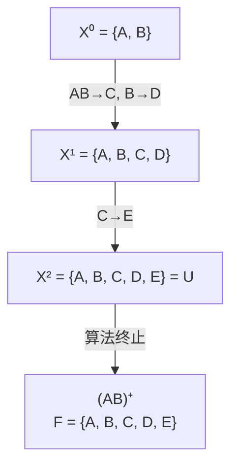

# 数据库原理期末综合试卷（试题七）

## 一、单项选择题

**题目1.** 在数据库系统中，负责监控数据库系统的运行情况，及时处理运行过程中出现的问题，这是（ ）人员的职责

A. 数据库管理员　B. 系统分析员　C. 数据库设计员　D. 应用程序员

> [!tip]- 答案
> **A. 数据库管理员**

---

**题目2.** 在数据库三级模式中，模式的个数（ ）

A. 只有一个　B. 可以有任意多个　C. 与用户个数相同　D. 由设置的系统参数决定

> [!tip]- 答案
> **A. 只有一个**
>
> 一个数据库只有一个模式，描述全局逻辑结构。

---

**题目3.** 在关系数据库系统中，当关系的类型改变时，用户程序也可以不变。这是（ ）

A. 数据的物理独立性　B. 数据的逻辑独立性　C. 数据的位置独立性　D. 数据的存储独立性

> [!tip]- 答案
> **B. 数据的逻辑独立性**
>
> 逻辑独立性由外模式/模式映像保证，模式改变时外模式和应用程序不变。

---

**题目4.** 设关系 R 和 S 具有相同的目，且它们相对应的属性的值取自同一个域，则 R-(R-S) 等于（ ）

A. R ∪ S　B. R ∩ S　C. R × S　D. R ÷ S

> [!tip]- 答案
> **B. R ∩ S**
>
> R - (R - S) = R ∩ S，这是集合论中的差运算性质：先求 R 与 S 的差集，再从 R 中减去差集，得到的就是 R 与 S 的交集。

---

**题目5.** 在关系代数中，从两个关系的笛卡尔积中选取它们属性间满足一定条件的元组的操作，称为（ ）

A. 并　B. 选择　C. 自然连接　D. θ 连接

> [!tip]- 答案
> **D. θ 连接**
>
> θ 连接（条件连接）从笛卡尔积中选取满足指定条件的元组。自然连接是 θ 连接的特例（等值且去重复列）。

---

> [!note] 题目6~8 基于"学生—选课—课程"数据库
> S(S#, SNAME, SEX, AGE)，SC(S#, C#, GRADE)，C(C#, CNAME, TEACHER)

**题目6.** 若要求查找"由张劲老师执教的数据库课程的平均成绩、最高成绩和最低成绩"，将使用关系（ ）

A. S 和 SC　B. SC 和 C　C. S 和 C　D. S、SC 和 C

> [!tip]- 答案
> **B. SC 和 C**
>
> 需要 C 表找课程名和教师，SC 表找成绩，不涉及学生个人信息（S 表）。

---

**题目7.** 若要求查找'李'姓学生的学生号和姓名，正确的 SQL 语句是（ ）

A. `SELECT S#, SNAME FROM S WHERE SNAME='李%'`
B. `SELECT S#, SNAME FROM S WHERE SNAME LIKE '李%'`
C. `SELECT S#, SNAME FROM S WHERE SNAME='%李%'`
D. `SELECT S#, SNAME FROM S WHERE SNAME LIKE '%李%'`

> [!tip]- 答案
> **B**
>
> 模糊匹配用 `LIKE`，'李%' 表示以"李"开头。`=` 不支持通配符。A 用了 `=` 错误；C、D 用 '%李%' 匹配包含"李"的，不是以"李"开头。

---

**题目8.** 设 S_AVG(SNO, AVG_GRADE) 是一个基于关系 SC 定义的学生号和他的平均成绩的视图。下面对该视图的操作语句中，（ ）不能正确执行。

Ⅰ. `UPDATE S_AVG SET AVG_GRADE=90 WHERE SNO='2004010601'`
Ⅱ. `SELECT SNO, AVG_GRADE FROM S_AVG WHERE SNO='2004010601'`

A. 仅 Ⅰ　B. 仅 Ⅱ　C. 都能　D. 都不能

> [!tip]- 答案
> **A. 仅 Ⅰ**
>
> 视图 S_AVG 使用了聚集函数 AVG，属于不可更新视图，不能执行 UPDATE。SELECT 查询不受限制。

---

> [!note] 题目9~11 基于如下关系 R 和 S，且属性 A 是关系 R 的主码，属性 B 是关系 S 的主码

**R**

| B | E |
|---|---|
| b1 | 3 |
| b2 | 7 |
| b3 | 10 |
| b4 | 2 |
| b5 | 2 |

**S**

| A | B | C |
|---|---|---|
| a1 | b1 | 5 |
| a2 | b2 | 6 |
| a3 | b3 | 8 |
| a4 | b4 | 12 |

---

**题目9.** 若关系 R 和 S 的关系代数操作结果如下，这是执行了（ ）

| A | R.B | C | S.B | E |
|---|-----|---|-----|---|
| a1 | b1 | 5 | b2 | 7 |
| a1 | b1 | 5 | b3 | 10 |
| a2 | b2 | 6 | b2 | 7 |
| a2 | b2 | 6 | b3 | 10 |
| a3 | b3 | 8 | b3 | 10 |

A. R ⋈(C<E) S　B. R ⋈(C>E) S　C. R ⋈(R.B=S.B) S　D. R ⋈ S

> [!tip]- 答案
> **A. R ⋈(C<E) S**
>
> 结果保留了 R.B 和 S.B 两列（说明是 θ 连接而非自然连接），且每行满足 C < E：5<7 ✓, 5<10 ✓, 6<7 ✓, 6<10 ✓, 8<10 ✓。

---

**题目10.** 若关系 R 和 S 的关系代数操作结果如下，这是执行了（ ）

| A | B | C | E |
|---|---|---|---|
| a1 | b1 | 5 | 3 |
| a2 | b2 | 6 | 7 |
| a3 | b3 | 8 | 10 |
| a4 | b4 | 12 | 2 |

A. R ⋈(C<L) S　B. R ⋈(C>E) S　C. R ⋈(R.B=S.B) S　D. R ⋈ S

> [!tip]- 答案
> **D. R ⋈ S**
>
> 结果只有 4 列（A, B, C, E），B 列合并（说明是自然连接），且每行 R.B = S.B。这是自然连接 R ⋈ S。

---

**题目11.** 如果要在关系 R 中插入一个元组，下面（ ）元组不能插入。

A. (a2, b5, 7)　B. (a6, b5, 3)　C. (a7, b7, 8)　D. (a8, b4, 1)

> [!tip]- 答案
> **C. (a7, b7, 8)**
>
> R 的属性为 (A, B, ...)，A 是主码。S 的 B 是主码，R 中的 B 应参照 S 的 B（外码）。b7 不在 S 表的 B 列中，违反参照完整性。

---

**题目12.** 设有关系 R(A, B, C)，与 SQL 语句 `SELECT DISTINCT A, C FROM R WHERE B=5` 等价的关系代数表达式是（ ）

Ⅰ. Π(A, C)(σ(B=5)(R))
Ⅱ. σ(B=5)(Π(A, C)(R))

A. 都等价　B. 仅 Ⅰ　C. 仅 Ⅱ　D. 都不等价

> [!tip]- 答案
> **B. 仅 Ⅰ**
>
> Ⅰ 先选择再投影，等价于先 WHERE 再 SELECT DISTINCT ✓。Ⅱ 先投影去掉 B 列，无法再做 σ(B=5) 选择 ✗。

---

**题目13.** 并发操作有可能引起下述（ ）问题。

Ⅰ. 丢失更新　Ⅱ. 不可重复读　Ⅲ. 读脏数据

A. 仅 Ⅰ 和 Ⅱ　B. 仅 Ⅰ 和 Ⅲ　C. 仅 Ⅱ 和 Ⅲ　D. 都是

> [!tip]- 答案
> **D. 都是**
>
> 并发操作的三个典型问题：丢失修改、不可重复读、读"脏"数据。

---

**题目14.** 设有两个事务 T1 和 T2，其并发操作序列如下表所示。则下面说法中正确的是（ ）

| 步骤 | T1 | T2 |
|------|----|----|
| 1 | 读 A=100 | |
| 2 | | 读 A=100 |
| 3 | A←A+10 写回 | |
| 4 | | A←A-10 写回 |

A. 该操作序列不存在问题
B. 该操作序列丢失更新
C. 该操作序列不能重复读
D. 该操作序列读出"脏"数据

> [!tip]- 答案
> **B. 该操作序列丢失更新**
>
> T1 和 T2 都读到 A=100，T1 写回 A=110，但 T2 写回 A=90，T1 的更新被覆盖丢失。

---

> [!note] 题目15~17 基于下列描述
> 关系模式 R(A, B, C, D, E)，函数依赖集 F = {A → C, BC → D, CD → A, AB → E}

**题目15.** 下列属性组中的哪个（些）是关系 R 的候选码？（ ）

Ⅰ. (A, B)　Ⅱ. (A, D)　Ⅲ. (B, C)　Ⅳ. (C, D)　Ⅴ. (B, D)

A. 仅 Ⅲ　B. Ⅰ 和 Ⅲ　C. Ⅰ、Ⅱ、Ⅳ　D. Ⅱ、Ⅲ、Ⅴ

> [!tip]- 答案
> **B. Ⅰ 和 Ⅲ**
>
> - (A,B)⁺：A → C 得 C，BC → D 得 D，AB → E 得 E → ABCDE ✓
> - (B,C)⁺：BC → D 得 D，CD → A 得 A，AB → E 得 E → ABCDE ✓
> - (A,D)⁺：A → C 得 C，CD → A 已有，BC → D 已有，但无 B → 无法得到 B 和 E ✗

---

**题目16.** 关系模式 R 的规范化程度最高达到（ ）

A. 1NF　B. 2NF　C. 3NF　D. BCNF

> [!tip]- 答案
> **C. 3NF**
>
> 候选码为 (A,B) 和 (B,C)。每个依赖的右部都是非主属性，左部包含候选码或候选码的真子集：
> - A → C：A 是主属性（候选码的一部分），传递依赖但不违反 3NF
> - 不满足 BCNF：A → C 中 A 不是候选码，但 C 是主属性
> - 最高达到 3NF

---

**题目17.** 现将关系模式 R 分解为两个关系模式 R1(A, C, D) 和 R2(A, B, E)，那么这个分解（ ）

A. 不具有无损连接性且不保持函数依赖
B. 具有无损连接性且不保持函数依赖
C. 不具有无损连接性且保持函数依赖
D. 具有无损连接性且保持函数依赖

> [!tip]- 答案
> **A. 不具有无损连接性且不保持函数依赖**
>
> R1 包含 A → C, CD → A，R2 包含 AB → E，但 BC → D 丢失（B 在 R2、C 在 R1，跨关系无法保持）。分解也不满足无损连接条件。

---

**题目18.** 存取方法设计是数据库设计的（ ）阶段的任务。

A. 需求分析　B. 概念结构设计　C. 逻辑结构设计　D. 物理结构设计

> [!tip]- 答案
> **D. 物理结构设计**
>
> 存取方法（如索引设计）属于物理结构设计阶段。

---

**题目19.** 以下关系 E-R 模型向关系模型转换的叙述中，（ ）是不正确的？

A. 一个 1:1 联系可以转换为一个独立的关系模式，也可以与联系的任意一端实体所对应的关系模式合并
B. 一个 1:n 联系可以转换为一个独立的关系模式，也可以与联系的 n 端实体所对应的关系模式合并
C. 一个 m:n 联系可以转换为一个独立的关系模式，也可以与联系的任意一端实体所对应的关系模式合并
D. 三个或三个以上的实体间的多元联系转换为一个关系模式

> [!tip]- 答案
> **C**
>
> m:n 联系**必须**转换为一个独立的关系模式，不能与任意一端合并。只有 1:1 和 1:n 联系可以合并。

---

**题目20.** 下列 SQL Server 语句中出现语法错误的是（ ）

A. `DECLARE @Myvar INT`
B. `SELECT * FROM [AAA]`
C. `CREATE DATABASE AAA`
D. `DELETE * FROM AAA`

> [!tip]- 答案
> **D**
>
> SQL Server 中 DELETE 语句不需要 `*`，正确语法为 `DELETE FROM AAA`。`DELETE * FROM AAA` 是错误的语法。

---

## 二、填空题

**题目21.** 根据参照完整性规则，外码的值或者等于以此码为主码的关系中某个元组主码的值，或者取 ________。

> [!tip]- 答案
> **空值（或 NULL）**

**题目22.** 在 SQL 语言中，使用 ________ 语句进行授权。

> [!tip]- 答案
> **GRANT**

**题目23.** 有关系 R(A, B, C) 和关系 S(A, D, E, F)。如果将关系代数表达式 Π(R.A, R.B, S.D, S.F)(R ⋈ S) 用 SQL 的查询语句来表示，则有：`SELECT R.A, R.B, S.D, S.F FROM R, S WHERE ________`。

> [!tip]- 答案
> `R.A = S.A`

**题目24.** "向 emp 表增加一个 telephone 列，其数据类型为 11 个字符型"的 SQL 语句是：`ALTER TABLE emp ________`。

> [!tip]- 答案
> `ADD telephone CHAR(11)`

**题目25.** 若关系模式 R ∈ 1NF，且对于每一个非平凡的函数依赖 X → Y，都有 X 包含码，则 R 最高一定可以达到 ________。

> [!tip]- 答案
> **BCNF**
>
> 这是 BCNF 的定义：所有非平凡函数依赖的左部都必须包含候选码。

**题目26.** 当对视图进行 UPDATE、INSERT、DELETE 操作时，为了保证被操作的行满足视图定义中子查询语句的谓词条件，应在视图定义语句中使用可选择项 ________。

> [!tip]- 答案
> `WITH CHECK OPTION`

**题目27.** SQL 语言支持数据库的外模式、模式和内模式结构。外模式对应于视图和部分基本表，模式对应于 ________，内模式对应于存储文件。

> [!tip]- 答案
> **基本表（或全体基本表）**

**题目28.** 设一个关系 A 具有 a1 个属性和 a2 个元组，关系 B 具有 b1 个属性和 b2 个元组，则关系 A × B 具有 ________ 个属性和 ________ 个元组。

> [!tip]- 答案
> a1 + b1；a2 × b2

**题目29.** 函数 `RIGHT('abcdef', 2)` 的结果是 ________。

> [!tip]- 答案
> `'ef'`
>
> `RIGHT(str, n)` 从字符串右侧截取 n 个字符。

---

## 三、计算题

### 题目30. 关系代数运算

> [!example] 题目
> 已知关系 R、S、T、U 如下所述，求关系代数表达式 R × S ÷ T - U 的运算结果。
>
> **R**
>
> | A | B |
> |---|---|
> | 1 | a |
> | 2 | b |
> | 3 | a |
> | 3 | b |
> | 4 | a |
>
> **S**
>
> | C |
> |---|
> | x |
> | y |
>
> **T**
>
> | C |
> |---|
> | x |
> | y |
>
> **U**
>
> | B | C |
> |---|---|
> | a | x |
> | c | z |

> [!note]- 参考答案
> **第一步：计算 R × S**
>
> R × S 的属性为 (A, B, C)，元组数为 5 × 2 = 10。
>
> **第二步：计算 R × S ÷ T**
>
> T 的属性为 (C)，值为 {x, y}。R × S ÷ T 的结果为：在 (A, B) 上投影后，所有 C 值包含 {x, y} 的 (A, B) 组对应的 (B, C) 值。
>
> 实际上除法结果保留 (A, B) 属性，但此处题目意在求 (B, C) 结果：
>
> | B | C |
> |---|---|
> | a | x |
> | a | y |
>
> **第三步：减去 U**
>
> U 中有 (a, x)，从结果中去除：
>
> | B | C |
> |---|---|
> | a | y |

---

### 题目31. 闭包计算

> [!example] 题目
> 已知关系模式 R⟨U, F⟩，其中 U = {A, B, C, D, E}，F = {AB → C, B → D, C → E, EC → B, AC → B}。求 (AB)F⁺。

> [!note]- 参考答案
> **求解过程：**
>
> 设 X(0) = AB
>
> **第一轮：** 扫描 F，找左部为 AB 子集的依赖：
> - AB → C：AB 的左部 ⊆ X(0)，加入 C
> - B → D：B ⊆ X(0)，加入 D
>
> X(1) = AB ∪ CD = ABCD
>
> **第二轮：** X(0) ≠ X(1)，继续扫描，找左部为 ABCD 子集的依赖：
> - AB → C：C 已在
> - B → D：D 已在
> - C → E：C ⊆ X(1)，加入 E
> - AC → B：B 已在
>
> X(2) = ABCD ∪ E = ABCDE
>
> X(2) = U，算法终止。
>
> ∴ (AB)F⁺ = {A, B, C, D, E}



---

## 四、综合应用题

### 题目32. E-R图设计与关系模式转换

> [!example] 题目
> 某企业集团有若干工厂，每个工厂生产多种产品，且每一种产品可以在多个工厂生产，每个工厂按照固定的计划数量生产产品；每个工厂聘用多名职工，且每名职工只能在一个工厂工作，工厂聘用职工有聘期和工资。
>
> 工厂的属性有工厂编号、厂名、地址，产品的属性有产品编号、产品名、规格，职工的属性有职工号、姓名。
>
> (1) 根据上述语义画出 E-R 图
> (2) 将该 E-R 模型转换为关系模型（要求：1:1 和 1:n 的联系进行合并）
> (3) 指出转换结果中每个关系模式的主码和外码

> [!note]- 参考答案
> **(1) E-R 图**
>
> ```mermaid
> graph LR
>     FACTORY["工厂<br/>(工厂编号, 厂名, 地址)"] ---|生产 m:n<br/>(计划数量)| PRODUCT["产品<br/>(产品编号, 产品名, 规格)"]
>     FACTORY ---|聘用 1:n<br/>(聘期, 工资)| WORKER["职工<br/>(职工号, 姓名)"]
> ```

> [!note] 实体与联系说明
> 实体：工厂、产品、职工
> 联系：
> - 生产：工厂-产品 m:n，属性：计划数量
> - 聘用：工厂-职工 1:n，属性：聘期、工资

> **(2) 转换后的关系模式：**
>
> | 关系模式 | 属性 | 主码 | 外码 |
> |---------|------|------|------|
> | 工厂 | 工厂编号，厂名，地址 | 工厂编号 | — |
> | 产品 | 产品编号，产品名，规格 | 产品编号 | — |
> | 职工 | 职工号，姓名，工厂编号，聘期，工资 | 职工号 | 工厂编号→工厂 |
> | 生产 | 工厂编号，产品编号，计划数量 | (工厂编号, 产品编号) | 工厂编号→工厂；产品编号→产品 |

---

### 题目33. 存储过程编程

> [!example] 题目
> 假设存在名为 AAA 的数据库，包括：
> - S(S# char(8), SN varchar(8), AGE int, DEPT varchar(20), DateT DateTime)
> - SC(S# char(8), CN varchar(10), GRADE numeric(5,2))
>
> 两张表。请按下列要求写一存储过程 PROC3。
>
> 要求：修改 SC 表中学号为 @s1 的值、课程名为 @c1 的值的学生成绩为 @g1 的值。

> [!note]- 参考答案
> ```sql
> CREATE PROCEDURE PROC3
>     @s1 char(8),
>     @c1 varchar(10),
>     @g1 numeric(5,2)
> AS
> BEGIN
>     UPDATE SC
>     SET GRADE = @g1
>     WHERE S# = @s1 AND CN = @c1;
> END
> ```
