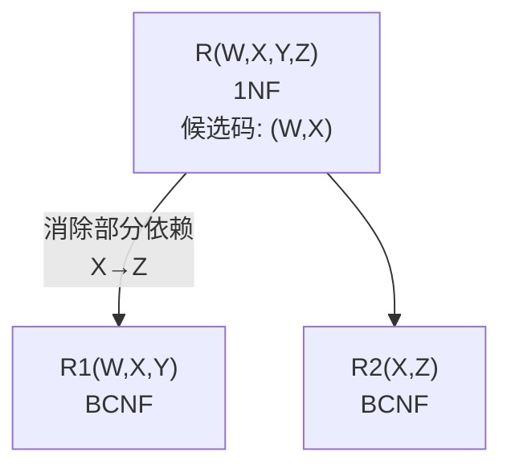

# 数据库原理期末综合试卷（试题三）

## 一、单项选择题

**题目1.** 数据库系统与文件系统的主要区别是（ ）

A. 数据库系统复杂，而文件系统简单
B. 文件系统不能解决数据冗余和数据独立性问题，而数据库系统可以解决
C. 文件系统只能管理程序文件，而数据库系统能够管理各种类型的文件
D. 文件系统管理的数据量较少，而数据库系统可以管理庞大的数据量

> [!tip]- 答案
> **B**
>
> 文件系统数据冗余度大、数据独立性差，数据库系统通过数据共享和三级模式映像解决了这两个核心问题。

---

**题目2.** 数据库管理系统能实现对数据库中数据的查询、插入、修改和删除等操作的数据库语言称为（ ）

A. 数据定义语言（DDL）　B. 数据管理语言　C. 数据操纵语言（DML）　D. 数据控制语言

> [!tip]- 答案
> **C. 数据操纵语言（DML）**

---

**题目3.** 数据库的网状模型应满足的条件是（ ）

A. 允许一个以上结点无双亲，也允许一个结点有多个双亲
B. 必须有两个以上的结点
C. 有且仅有一个结点无双亲，其余结点都只有一个双亲
D. 每个结点有且仅有一个双亲

> [!tip]- 答案
> **A**
>
> C 是层次模型的条件；D 也描述层次模型。网状模型允许一个以上结点无双亲，且允许一个结点有多个双亲。

---

**题目4.** 数据的逻辑独立性是指（ ）

A. 内模式改变，模式不变
B. 模式改变，内模式不变
C. 模式改变，外模式和应用程序不变
D. 内模式改变，外模式和应用程序不变

> [!tip]- 答案
> **C**
>
> 逻辑独立性由外模式/模式映像保证，模式改变时外模式和应用程序不变。

---

**题目5.** 设有关系模式 EMP（职工号，姓名，年龄，技能）。假设职工号唯一，每个职工有多项技能，则 EMP 表的主码是（ ）

A. 职工号　B. 姓名，技能　C. 技能　D. 职工号，技能

> [!tip]- 答案
> **D. 职工号，技能**
>
> 一个职工有多项技能，仅靠职工号无法唯一标识一行，需 (职工号, 技能) 联合作为主码。

---

**题目6.** 在关系代数中，对一个关系做投影操作后，新关系的元组个数（ ）原来关系的元组个数。

A. 小于　B. 小于或等于　C. 等于　D. 大于

> [!tip]- 答案
> **B. 小于或等于**
>
> 投影可能取消重复元组，故新关系元组数 ≤ 原关系。

---

**题目7.** 设关系 R 和 S 的属性个数分别是 2 和 3，那么 σ(1<2)(R × S) 等价于（ ）

A. σ(1<2)(R × S)　B. σ(1<4)(R × S)　C. σ(1<2)(R ⋈ S)　D. σ(1<4)(R ⋈ S)

> [!tip]- 答案
> **B. σ(1<4)(R × S)**
>
> R × S 后属性个数为 5（R 的 2 个 + S 的 3 个），σ(1<2) 是选择 R 的第 1 列 < R 的第 2 列的元组。但在广义笛卡尔积中列编号为 1~5，若 R 的第 1 列比较 S 的第 1 列（第 4 列），等价于 σ(1<4)。

---

**题目8.** 学校数据库中有学生和宿舍两个关系：学生（学号，姓名）和 宿舍（楼名，房间号，床位号，学号）。假设有的学生不住宿，床位也可能空闲。如果要列出所有学生住宿和宿舍分配的情况，包括没有住宿的学生和空闲的床位，则应执行（ ）

A. 全外联接　B. 左外联接　C. 右外联接　D. 自然联接

> [!tip]- 答案
> **A. 全外联接**
>
> 需要保留两边不匹配的元组（未住宿学生 + 空闲床位），故用全外联接。

---

**题目9.** 用下面的 T-SQL 语句建立一个基本表：

```sql
CREATE TABLE Student(
    Sno  CHAR(4) NOT NULL,
    Sname CHAR(8) NOT NULL,
    Sex   CHAR(2),
    Age   SMALLINT
)
```

可以插入到表中的元组是（ ）

A. '5021'，'刘祥'，男，21　B. NULL，'刘祥'，NULL，21　C. '5021'，NULL，男，21　D. '5021'，'刘祥'，NULL，NULL

> [!tip]- 答案
> **D**
>
> Sno 和 Sname 有 NOT NULL 约束。A 中 Sex 值 '男' 未加引号（CHAR 类型需引号）；B 中 Sno 为 NULL 违反 NOT NULL；C 中 Sname 为 NULL 违反 NOT NULL。D 满足所有约束。

---

**题目10.** 把对关系 SC 的属性 GRADE 的修改权授予用户 ZHAO 的 T-SQL 语句是（ ）

A. `GRANT GRADE ON SC TO ZHAO`
B. `GRANT UPDATE ON SC TO ZHAO`
C. `GRANT UPDATE (GRADE) ON SC TO ZHAO`
D. `GRANT UPDATE ON SC (GRADE) TO ZHAO`

> [!tip]- 答案
> **C**
>
> GRANT 语法：`GRANT UPDATE (属性名) ON 表名 TO 用户名`。

---

**题目11.** 图1中（ ）是关系完备的系统

> [!note] 说明
> 原题此处插入图片"图1"，涉及 DBMS 分级示意图。关系完备的系统支持关系数据结构和所有关系操作（选择、投影、连接及集合运算），但不含完整的完整性约束和查询优化。

> [!tip]- 答案
> **C**

---

**题目12.** 给定关系模式 SCP（Sno, Cno, P），其中 Sno 表示学号，Cno 表示课程号，P 表示名次。若每一名学生每门课程有一定的名次，每门课程每一名次只有一名学生，则以下叙述中错误的是（ ）

A. (Sno, Cno) 和 (Cno, P) 都可以作为候选码
B. (Sno, Cno) 是唯一的候选码
C. 关系模式 SCP 既属于 3NF 也属于 BCNF
D. 关系模式 SCP 没有非主属性

> [!tip]- 答案
> **B**
>
> 依赖：(Sno, Cno) → P，(Cno, P) → Sno。两个候选码 (Sno, Cno) 和 (Cno, P)，所有属性都是主属性，无部分和传递依赖，达到 BCNF。B 说"唯一候选码"是错误的。

---

**题目13.** 关系规范化中的删除操作异常是指（ ）

A. 不该删除的数据被删除　B. 不该插入的数据被插入　C. 应该删除的数据未被删除　D. 应该插入的数据未被插入

> [!tip]- 答案
> **A. 不该删除的数据被删除**

---

**题目14.** 在数据库设计中，将 E-R 图转换成关系数据模型的过程属于（ ）

A. 需求分析阶段　B. 物理设计阶段　C. 逻辑设计阶段　D. 概念设计阶段

> [!tip]- 答案
> **C. 逻辑设计阶段**

---

**题目15.** 在合并分 E-R 图时必须消除各分图中的不一致。各分 E-R 图之间的冲突主要有三类，即属性冲突、命名冲突和结构冲突，其中命名冲突是指（ ）

A. 命名太长或太短　B. 同名异义或同义异名　C. 属性类型冲突　D. 属性取值单位冲突

> [!tip]- 答案
> **B. 同名异义或同义异名**

---

**题目16.** 事务的原子性是指（ ）

A. 一个事务内部的操作及使用的数据对并发的其他事务是隔离的
B. 事务一旦提交，对数据库的改变是永久的
C. 事务中包括的所有操作要么都做，要么都不做
D. 事务必须是使数据库从一个一致性状态变到另一个一致性状态

> [!tip]- 答案
> **C**
>
> A=隔离性，B=持久性，D=一致性。原子性 = 要么全做要么全不做。

---

**题目17.** 若系统在运行过程中，由于某种硬件故障，使存储在外存上的数据部分损失或全部损失，这种情况称为（ ）

A. 事务故障　B. 系统故障　C. 介质故障　D. 运行故障

> [!tip]- 答案
> **C. 介质故障**
>
> 外存（磁盘）损坏属于介质故障。系统故障通常指内存数据丢失（如断电），不影响外存。

---

**题目18.** 若事务 T 对数据对象 A 加上 S 锁，则（ ）

A. 事务 T 可以读 A 和修改 A，其它事务只能再对 A 加 S 锁，而不能加 X 锁。
B. 事务 T 可以读 A 但不能修改 A，其它事务能对 A 加 S 锁和 X 锁。
C. 事务 T 可以读 A 但不能修改 A，其它事务只能再对 A 加 S 锁，而不能加 X 锁。
D. 事务 T 可以读 A 和修改 A，其它事务能对 A 加 S 锁和 X 锁。

> [!tip]- 答案
> **C**
>
> S 锁（共享锁）：持锁事务可读不可写，其他事务只能加 S 锁不能加 X 锁。

---

**题目19.** 设有两个事务 T1、T2，其并发操作如下：

> T1：①读 A=100；A=A*2 写回；③ ROLLBACK 恢复 A=100
> T2：②读 A=200

A. 该操作不存在问题　B. 该操作丢失修改　C. 该操作不能重复读　D. 该操作读"脏"数据

> [!tip]- 答案
> **D. 该操作读"脏"数据**
>
> T1 写回 A=200 后 T2 读到该值，但 T1 随后 ROLLBACK 恢复 A=100，T2 读到的是未提交的脏数据。

---

**题目20.** 图3是一个（ ）

A. ER 图　B. I/O 图　C. DFD 图　D. IPO 图

> [!note] 说明
> 原题此处插入图片"图3"，为数据流图（DFD）。

> [!tip]- 答案
> **C. DFD 图**

---

## 二、填空题

**题目21.** 数据库系统的三级模式结构是指数据库系统由 ________、________ 和 ________ 三级构成。

> [!tip]- 答案
> **外模式**；**模式**；**内模式**

**题目22.** 在关系 A（S，SN，D）和 B（D，CN，NM）中，A 的主码是 S，B 的主码是 D，则 D 在 A 中称为 ________。

> [!tip]- 答案
> **外码**

**题目23.** 关系操作的特点是 ________ 操作。

> [!tip]- 答案
> **集合**

**题目24.** 已知学生关系（学号，姓名，年龄，班级），要检索班级为空值的学生姓名，其 SQL 查询语句中 WHERE 子句的条件表达式是 ________。

> [!tip]- 答案
> **`班级 IS NULL`**

**题目25.** 集合 R 与 S 的连接可以用关系代数的 5 种基本运算表示为 ________。

> [!tip]- 答案
> σF(R × S)
>
> 连接 = 选择（σ）+ 广义笛卡尔积（×），二者均为 5 种基本运算之一。

**题目26.** SELECT 语句查询条件中的谓词 "=ANY" 与运算符 ________ 等价。

> [!tip]- 答案
> **IN**

**题目27.** 在数据库中，只存放视图的 ________，不存放视图对应的数据。

> [!tip]- 答案
> **定义**

**题目28.** "为哪些表，在哪些字段上，建立什么样的索引"这一设计内容应该属于数据库设计中的 ________ 设计阶段。

> [!tip]- 答案
> **物理**

**题目29.** 并发控制的主要方法是 ________ 机制。

> [!tip]- 答案
> **封锁**

**题目30.** 已知关系 R（A，B，C，D）和 R 上的函数依赖集 F = {A → CD, C → B}，R 属于第 ________ 范式。

> [!tip]- 答案
> **2**
>
> 候选码为 A，A → CD 完全依赖，无部分依赖，满足 2NF。但 A → C → B 存在传递依赖，不满足 3NF。

---

## 三、简答题

### 题目31. 数据库管理系统有哪些功能？

> [!note] 参考答案
> 数据库管理系统（DBMS）是位于操作系统与用户之间的一个数据管理软件，它主要功能包括以下几个方面：
>
> 1. **数据定义功能**：DBMS 提供数据描述语言（DDL），用户可通过它来定义数据对象。
> 2. **数据操纵功能**：DBMS 还提供数据操纵语言（DML），实现对数据库的基本操作：查询、插入、删除和修改。
> 3. **数据库的运行管理**：这是 DBMS 运行时的核心部分，它包括并发控制、安全性检查、完整性约束条件的检查和执行、发生故障后的恢复等。
> 4. **数据库的建立和维护功能**：包括数据库初始数据的输入及转换、数据库的转储与恢复、数据库的重组功能和性能的监视与分析功能等。

### 题目32. 数据库设计分哪几个阶段？

> [!note] 参考答案
> 1. 需求分析
> 2. 概念结构设计
> 3. 逻辑结构设计
> 4. 物理结构设计
> 5. 数据库实施
> 6. 数据库运行和维护


---

## 四、设计题

### 题目33. SQL查询

> [!example] 题目
> 设有学生选课关系 SC（学号，课程号，成绩），试用 SQL 语句检索每门课程的最高分。

> [!note]- 参考答案
> ```sql
> SELECT 课程号, MAX(成绩)
> FROM SC
> GROUP BY 课程号;
> ```

---

### 题目34. 关系代数与SQL

> [!example] 题目
> 关系模式如下：
> - 商品 P (PNO, PN, COLOR, PRICE)
> - 商店 S (SNO, SN, CITY)
> - 销售 SP (PNO, SNO, QTY)
>
> 分别用关系代数和 SQL 写出查询语句：查询销售商品 "TV" 的商店名 SN。

> [!note]- 参考答案
> **关系代数：**
> ΠSN(σ(PN='TV')(P ⋈ SP ⋈ S))
>
> **SQL：**
> ```sql
> SELECT SN
> FROM S, SP, P
> WHERE S.SNO = SP.SNO
>   AND P.PNO = SP.PNO
>   AND PN = 'TV';
> ```

---

### 题目35. SQL查询与更新

> [!example] 题目
> 设有关系 R 和 S 如下：
>
> **R**
>
> | A | B |
> |---|---|
> | a1 | b1 |
> | a2 | b2 |
> | a3 | b3 |
>
> **S**
>
> | A | C |
> |---|---|
> | a1 | 40 |
> | a2 | 50 |
> | a3 | 55 |
>
> 试用 SQL 语句实现：
> (1) 查询属性 C > 50 时，R 中与之相关联的属性 B 之值。
> (2) 当属性 C = 40 时，将 R 中与之相关联的属性 B 值修改为 b4。

> [!note]- 参考答案
> **(1)**
> ```sql
> SELECT B
> FROM R, S
> WHERE R.A = S.A AND C > 50;
> ```
>
> **(2)**
> ```sql
> UPDATE R
> SET B = 'b4'
> WHERE A IN
>     (SELECT A
>      FROM S
>      WHERE C = 40);
> ```

---

### 题目36. 关系规范化

> [!example] 题目
> 设有关系 R 和函数依赖 F：
> R(W, X, Y, Z)，F = {X → Z, WX → Y}
>
> (1) 关系 R 属于第几范式？
> (2) 如果关系 R 不属于 BCNF，请将关系 R 逐步分解为 BCNF。要求：写出达到每一级范式的分解过程，并指明消除什么类型的函数依赖。

> [!note]- 参考答案
> **(1)** R ∈ 1NF。
>
> 候选码为 (W, X)，Y、Z 为非主属性。由于 X → Z，Z 部分依赖于候选码 (W, X)，不满足 2NF。
>
> **(2) 逐步分解：**
>
> **第一步：消除部分函数依赖（1NF → 2NF）**
>
> 将 R 分解为：
> - R1(W, X, Y) — 候选码 (W, X)，F1 = {WX → Y}
> - R2(X, Z) — 候选码 X，F2 = {X → Z}
>
> 消除了非主属性对码的部分函数依赖。
>
> F1 和 F2 中的函数依赖都是非平凡的，并且决定因素均是候选码，故 R1、R2 均为 **BCNF**。



---

### 题目37. E-R图设计与关系模式转换

> [!example] 题目
> 某医院病房管理系统中，包括四个实体型，分别为：
> - 科室：科名，科地址，科电话
> - 病房：病房号，病房地址
> - 医生：工作证号，姓名，职称，年龄
> - 病人：病历号，姓名，性别
>
> 且存在如下语义约束：
> ① 一个科室有多个病房、多个医生；一个病房只能属于一个科室，一个医生只属于一个科室
> ② 一个医生可负责多个病人的诊治，一个病人的主管医生只有一个
> ③ 一个病房可入住多个病人，一个病人只能入住在一个病房
>
> 注意：不同科室可能有相同的病房号。
>
> 完成如下设计：
> (1) 画出该医院病房管理系统的 E-R 图
> (2) 将该 E-R 图转换为关系模型
> (3) 指出转换结果中每个关系模式的主码和外码

> [!note]- 参考答案
> **(1) E-R 图**
>
> ```mermaid
> graph LR
>     DEPT["科室<br/>(科名, 科地址, 科电话)"] ---|拥有 1:n| WARD["病房<br/>(病房号, 病房地址)"]
>     DEPT ---|拥有 1:n| DOCTOR["医生<br/>(工作证号, 姓名, 职称, 年龄)"]
>     DOCTOR ---|诊治 1:n| PATIENT["病人<br/>(病历号, 姓名, 性别)"]
>     WARD ---|入住 1:n| PATIENT
> ```

> [!note] 实体与联系说明
> 实体：科室、病房、医生、病人
> 联系：
> - 科室—病房：1:n（拥有）
> - 科室—医生：1:n（拥有）
> - 医生—病人：1:n（诊治）
> - 病房—病人：1:n（入住）
>
> 注意：不同科室可能有相同的病房号，因此病房的主码需要包含科名。

> **(2) 转换后的关系模式：**
>
> | 关系模式 | 属性 | 主码 | 外码 |
> |---------|------|------|------|
> | 科室 | 科名，科地址，科电话 | 科名 | — |
> | 病房 | 病房号，病房地址，科名 | (科名, 病房号) | 科名→科室 |
> | 医生 | 工作证号，姓名，职称，年龄，科名 | 工作证号 | 科名→科室 |
> | 病人 | 病历号，姓名，性别，主管医生，病房号，科名 | 病历号 | (科名, 病房号)→病房；工作证号→医生 |
