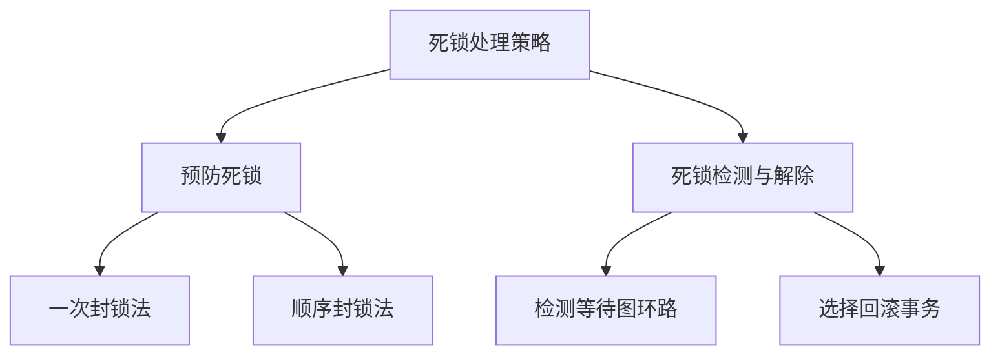
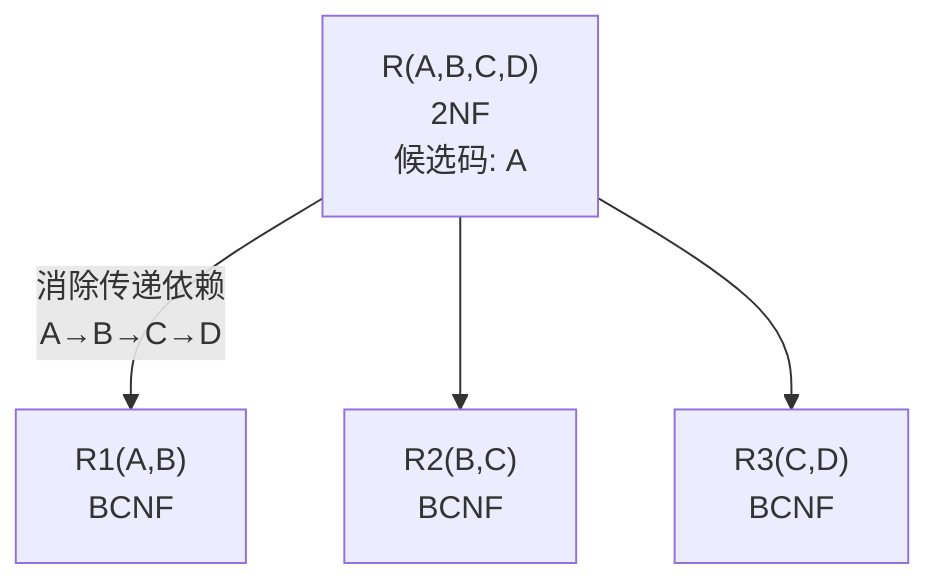

# 数据库原理期末综合试卷（试题九）

## 一、单项选择题

**题目1.** 数据库系统的核心是（ ）

A. 数据库　B. 数据库管理系统　C. 数据模型　D. 软件工具

> [!tip]- 答案
> **B. 数据库管理系统**

---

**题目2.** 下面哪一个不是数据库系统的特点（ ）

A. 数据结构化　B. 数据独立性高　C. 数据冗余度尽可能小　D. 程序标准化

> [!tip]- 答案
> **D. 程序标准化**
>
> 程序标准化不是数据库系统的特点。数据库系统的特点包括数据结构化、数据共享性高冗余度低、数据独立性高、数据由 DBMS 统一管理。

---

**题目3.** E-R 图是哪种数据模型的描述工具（ ）

A. 概念模型　B. 逻辑模型　C. 物理模型　D. 关系模型

> [!tip]- 答案
> **A. 概念模型**
>
> E-R 图是概念层数据模型的描述工具，独立于具体的 DBMS。

---

**题目4.** 要保证数据库物理数据独立性，需要修改的是（ ）

A. 模式与外模式的映像　B. 模式与内模式的映像　C. 模式　D. 三级模式

> [!tip]- 答案
> **B. 模式与内模式的映像**
>
> 物理独立性由模式/内模式映像保证，内模式（存储结构）改变时修改映像，使模式不变。

---

**题目5.** 关系数据库中，实现实体完整性是通过（ ）

A. 外码　B. 主码　C. 索引　D. 锁

> [!tip]- 答案
> **B. 主码**
>
> 实体完整性要求主码取值唯一且非空。

---

**题目6.** 关系代数的 5 种基本运算为（ ）

A. 并、差、选择、投影、自然连接
B. 并、差、交、选择、投影
C. 并、差、笛卡尔积、选择、投影
D. 并、差、交、选择、笛卡尔积

> [!tip]- 答案
> **C. 并、差、笛卡尔积、选择、投影**
>
> 交可以用差表示（R ∩ S = R - (R-S)），自然连接可以用选择+笛卡尔积+投影表示，故5种基本运算是并、差、笛卡尔积、选择、投影。

---

**题目7.** SQL 语言中，删除视图的命令是（ ）

A. `DELETE VIEW`　B. `DROP VIEW`　C. `ERASE VIEW`　D. `REMOVE VIEW`

> [!tip]- 答案
> **B. `DROP VIEW`**

---

**题目8.** SQL 的 GRANT 语句实现的是数据库的（ ）

A. 完整性控制　B. 安全性控制　C. 并发控制　D. 恢复控制

> [!tip]- 答案
> **B. 安全性控制**
>
> GRANT/REVOKE 实现自主存取控制（安全性），属于数据控制功能。

---

**题目9.** 关系规范化中的删除异常是指（ ）

A. 不该删的数据被删除
B. 不该插入的数据被插入
C. 应该删除的数据未被删除
D. 应该插入的数据未被插入

> [!tip]- 答案
> **A. 不该删的数据被删除**

---

**题目10.** 候选码中的属性统称为（ ）

A. 外属性　B. 主属性　C. 非主属性　D. 复合属性

> [!tip]- 答案
> **B. 主属性**
>
> 包含在任何一个候选码中的属性称为主属性，不包含在任何候选码中的属性称为非主属性。

---

**题目11.** 在数据库设计中，E-R 图是哪个阶段的产物（ ）

A. 需求分析　B. 概念结构设计　C. 逻辑结构设计　D. 物理结构设计

> [!tip]- 答案
> **B. 概念结构设计**

---

**题目12.** 事务的原子性是指（ ）

A. 事务要么全部执行，要么全部不执行
B. 事务提交后修改永久生效
C. 事务内部操作对其他事务隔离
D. 事务执行前后数据库保持一致

> [!tip]- 答案
> **A. 事务要么全部执行，要么全部不执行**
>
> B=持久性，C=隔离性，D=一致性。

---

**题目13.** 日志文件主要用于数据库的（ ）

A. 安全性　B. 完整性　C. 并发控制　D. 故障恢复

> [!tip]- 答案
> **D. 故障恢复**
>
> 日志文件记录所有更新操作，用于 UNDO/REDO 恢复。

---

**题目14.** 若事务 T 对数据 A 加上 X 排他锁，则其他事务（ ）

A. 只能加 S 锁　B. 只能加 X 锁　C. 可以加 S 和 X 锁　D. 不能加任何锁

> [!tip]- 答案
> **D. 不能加任何锁**
>
> X 锁（排他锁）与任何锁都不相容。

---

**题目15.** 两段锁协议的作用是保证（ ）

A. 事务原子性　B. 调度可串行化　C. 防止死锁　D. 防止事务故障

> [!tip]- 答案
> **B. 调度可串行化**
>
> 两段锁协议是可串行化的充分条件，但**不防死锁**。

---

**题目16.** 发生介质故障，恢复数据库依靠（ ）

A. 日志文件
B. 数据库后备副本 + 日志文件
C. 后备副本
D. 数据字典

> [!tip]- 答案
> **B. 数据库后备副本 + 日志文件**
>
> 介质故障导致外存数据丢失，需用后备副本恢复数据，再用日志文件重做已提交事务。

---

**题目17.** 1NF 的定义是（ ）

A. 不存在传递依赖
B. 不存在部分依赖
C. 属性不可再分
D. 所有属性是主属性

> [!tip]- 答案
> **C. 属性不可再分**
>
> 1NF 要求每个属性都是不可再分的原子值。

---

**题目18.** 消除非主属性对码的部分函数依赖得到（ ）

A. 1NF　B. 2NF　C. 3NF　D. BCNF

> [!tip]- 答案
> **B. 2NF**

---

**题目19.** 消除非主属性对码的传递函数依赖得到（ ）

A. 1NF　B. 2NF　C. 3NF　D. BCNF

> [!tip]- 答案
> **C. 3NF**

---

**题目20.** BCNF 范式要求（ ）

A. 消除部分依赖
B. 消除传递依赖
C. 决定因素都包含码
D. 属性全部为主属性

> [!tip]- 答案
> **C. 决定因素都包含码**
>
> BCNF 要求所有非平凡函数依赖 X → Y 的左部 X 都包含候选码。

---

## 二、填空题

**题目21.** 数据库三级模式：外模式、________、内模式。

> [!tip]- 答案
> **模式**

**题目22.** 参照完整性约束是对 ________ 的约束。

> [!tip]- 答案
> **外码**

**题目23.** 关系代数中从表中选出若干列的运算叫 ________。

> [!tip]- 答案
> **投影**

**题目24.** SQL 查询去掉重复行使用关键字 ________。

> [!tip]- 答案
> **DISTINCT**

**题目25.** 事务 ACID：原子性、________、隔离性、持久性。

> [!tip]- 答案
> **一致性**

**题目26.** 并发操作带来三类问题：丢失修改、不可重复读、________。

> [!tip]- 答案
> **读脏数据**

**题目27.** 数据库故障分为事务故障、________、介质故障。

> [!tip]- 答案
> **系统故障**

**题目28.** E-R 模型中，实体之间 m:n 联系转换关系模式，关系的主码是 ________。

> [!tip]- 答案
> **两端实体主码的组合**

**题目29.** 关系模式分解两个等价标准：保持函数依赖、________。

> [!tip]- 答案
> **无损连接性**

**题目30.** 封锁的两种基本类型：共享锁 S、________。

> [!tip]- 答案
> **排他锁（X 锁）**

---

## 三、简答题

### 题目31. 简述数据库、DBMS、DBS 概念

> [!note] 参考答案
> 1. **数据库（DB）**：长期存储在计算机内、有组织、可共享的大量数据集合。
> 2. **数据库管理系统（DBMS）**：位于用户与操作系统之间，管理数据库的系统软件，提供数据定义（DDL）、数据操纵（DML）、运行管理、数据库维护等功能。
> 3. **数据库系统（DBS）**：引入数据库后的计算机系统，包含数据库、DBMS、应用系统、硬件、DBA 和各类用户。

### 题目32. 简述视图的作用

> [!note] 参考答案
> 1. 简化用户查询操作
> 2. 多角度看待同一套数据
> 3. 提供一定逻辑独立性
> 4. 提供安全保护，屏蔽敏感字段
>
> 视图是虚表，只保存定义，不存储真实数据。

### 题目33. 简述什么是死锁，死锁如何解决

> [!note] 参考答案
> **死锁**：多个事务互相等待对方所持有的锁，全部事务都无法继续执行的状态。
>
> **解决方法：**
>
> 1. **预防死锁**：
>    - 一次封锁法：事务一次性申请所有需要的锁
>    - 顺序封锁法：按固定顺序申请锁
> 2. **死锁检测**：定期检测等待图中是否存在环
> 3. **死锁解除**：选择代价最小的事务回滚，释放其持有的锁



---

## 四、设计题

### 题目34. SQL查询与关系代数

> [!example] 题目
> 学生数据库三张表：
> - S(Sno, Sname, Ssex, Sdept)
> - C(Cno, Cname, Ccredit)
> - SC(Sno, Cno, Grade)
>
> (1) SQL 查询每个系的学生人数
> (2) SQL 查询没有选修"数据库"课程的学生姓名
> (3) 写出查询"选修 2 号课程，分数大于 80 的学生姓名"的关系代数

> [!note]- 参考答案
> **(1)**
> ```sql
> SELECT Sdept, COUNT(Sno) AS 人数
> FROM S
> GROUP BY Sdept;
> ```
>
> **(2)**
> ```sql
> SELECT Sname
> FROM S
> WHERE Sno NOT IN
>     (SELECT Sno FROM SC, C
>      WHERE SC.Cno = C.Cno
>        AND Cname = '数据库');
> ```
>
> 或用 `NOT EXISTS`：
> ```sql
> SELECT Sname
> FROM S
> WHERE NOT EXISTS
>     (SELECT * FROM SC, C
>      WHERE SC.Sno = S.Sno
>        AND SC.Cno = C.Cno
>        AND Cname = '数据库');
> ```
>
> **(3)**
> ΠSname(σ(Cno='2' ∧ Grade>80)(S ⋈ SC))

---

### 题目35. 关系规范化

> [!example] 题目
> 设有关系 R(A, B, C, D)，F = {A → B, B → C, C → D}
>
> (1) 求候选码
> (2) 判断最高范式
> (3) 分解为 3NF

> [!note]- 参考答案
> **(1) 候选码：** **A**
>
> A⁺：A → B → B → C → C → D → ABCD，全部属性可达，故 A 为候选码。
>
> **(2) 最高为 2NF。**
>
> A → B 完全依赖，无部分依赖，满足 2NF。但存在传递函数依赖：A → B → C → D，不满足 3NF。
>
> **(3) 3NF 分解：**
> - R1(A, B) — F1 = {A → B}
> - R2(B, C) — F2 = {B → C}
> - R3(C, D) — F3 = {C → D}



---

### 题目36. E-R图设计与关系模式转换

> [!example] 题目
> 工厂管理系统：
>
> 实体：
> - 工厂（工厂编号，厂名，地址）
> - 产品（产品编号，产品名，规格）
> - 职工（职工号，姓名）
>
> 语义：
> 1. 一个工厂多个职工，一个职工只属于一个工厂；聘用联系：聘期、工资
> 2. 工厂与产品 m:n 生产联系，属性：计划产量
>
> (1) 绘制 E-R 图
> (2) 转为关系模式，标注主码、外码

> [!note]- 参考答案
> **(1) E-R 图**
>
> ```mermaid
> graph LR
>     FACTORY["工厂<br/>(工厂编号, 厂名, 地址)"] ---|生产 m:n<br/>(计划产量)| PRODUCT["产品<br/>(产品编号, 产品名, 规格)"]
>     FACTORY ---|聘用 1:n<br/>(聘期, 工资)| WORKER["职工<br/>(职工号, 姓名)"]
> ```

> [!note] 实体与联系说明
> 实体：工厂、产品、职工
> 联系：
> - 聘用：工厂-职工 1:n，属性：聘期、工资
> - 生产：工厂-产品 m:n，属性：计划产量

> **(2) 转换后的关系模式：**
>
> | 关系模式 | 属性 | 主码 | 外码 |
> |---------|------|------|------|
> | 工厂 | 工厂编号，厂名，地址 | 工厂编号 | — |
> | 产品 | 产品编号，产品名，规格 | 产品编号 | — |
> | 职工 | 职工号，姓名，工厂编号，聘期，工资 | 职工号 | 工厂编号→工厂 |
> | 生产 | 工厂编号，产品编号，计划产量 | (工厂编号, 产品编号) | 工厂编号→工厂；产品编号→产品 |
