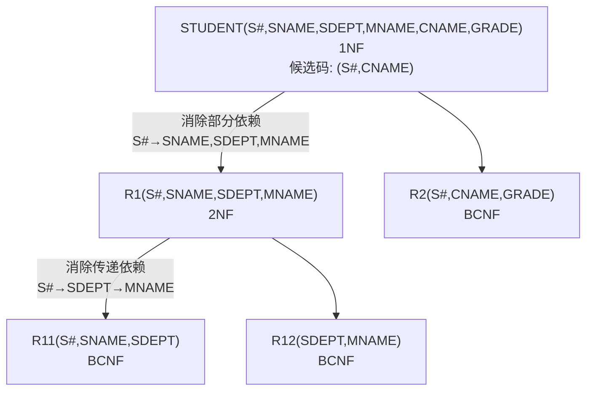

# 数据库原理期末综合试卷（试题二）

## 一、单项选择题

**题目1.** 下列四项中，不属于数据库系统的主要特点的是（ ）

A. 数据结构化　B. 数据的冗余度小　C. 较高的数据独立性　D. 程序的标准化

> [!tip]- 答案
> **D. 程序的标准化**

---

**题目2.** 数据的逻辑独立性是指（ ）

A. 内模式改变，模式不变　B. 模式改变，内模式不变　C. 模式改变，外模式和应用程序不变　D. 内模式改变，外模式和应用程序不变

> [!tip]- 答案
> **C**
>
> 逻辑独立性由外模式/模式映像保证，模式改变时外模式和应用程序不变。

---

**题目3.** 在数据库的三级模式结构中，描述数据库中全体数据的全局逻辑结构和特征的是（ ）

A. 外模式　B. 内模式　C. 存储模式　D. 模式

> [!tip]- 答案
> **D. 模式**

---

**题目4.** 相对于非关系模型，关系数据模型的缺点之一是（ ）

A. 存取路径对用户透明，需查询优化　B. 数据结构简单　C. 数据独立性高　D. 有严格的数学基础

> [!tip]- 答案
> **A**
>
> 关系模型存取路径对用户透明，导致查询效率依赖查询优化器，这是其缺点。

---

**题目5.** 现有关系表：学生（宿舍编号，宿舍地址，学号，姓名，性别，专业，出生日期）的主码是（ ）

A. 宿舍编号　B. 学号　C. 宿舍地址，姓名　D. 宿舍编号，学号

> [!tip]- 答案
> **B. 学号**

---

**题目6.** 自然连接是构成新关系的有效方法。一般情况下，当对关系R和S使用自然连接时，要求R和S含有一个或多个共有的（ ）

A. 元组　B. 行　C. 记录　D. 属性

> [!tip]- 答案
> **D. 属性**

---

**题目7.** 下列关系运算中，（ ）运算不属于专门的关系运算。

A. 选择　B. 连接　C. 广义笛卡尔积　D. 投影

> [!tip]- 答案
> **C. 广义笛卡尔积**
>
> 选择、投影、连接是专门关系运算；广义笛卡尔积属于传统集合运算。

---

**题目8.** SQL语言具有（ ）的功能。

A. 关系规范化、数据操纵、数据控制　B. 数据定义、数据操纵、数据控制　C. 数据定义、关系规范化、数据控制　D. 数据定义、关系规范化、数据操纵

> [!tip]- 答案
> **B. 数据定义、数据操纵、数据控制**

---

**题目9.** 从E-R模型向关系模型转换时，一个M:N联系转换为关系模式时，该关系模式的关键字是（ ）

A. M端实体的关键字　B. N端实体的关键字　C. M端实体关键字与N端实体关键字组合　D. 重新选取其他属性

> [!tip]- 答案
> **C. M端实体关键字与N端实体关键字组合**

---

**题目10.** SQL语言中，删除一个表的命令是（ ）

A. DELETE　B. DROP　C. CLEAR　D. REMOVE

> [!tip]- 答案
> **B. DROP**
>
> `DELETE` 删除表中数据（元组），`DROP TABLE` 删除整个表结构。

---

**题目11.** 图1中（ ）是关系完备的系统

> [!note] 说明
> 原题此处插入图片"图1"，涉及 DBMS 分级示意图。关系完备的系统支持关系数据结构和所有关系操作（选择、投影、连接及集合运算），但不含完整的完整性约束和查询优化。

> [!tip]- 答案
> **C**

---

**题目12.** 有关系模式 A(S, C, M)，其中各属性的含义是：S：学生；C：课程；M：名次，其语义是：每一个学生选修每门课程的成绩有一定的名次，每门课程中每一名次只有一个学生（即没有并列名次），则关系模式A最高达到（ ）

A. 1NF　B. 2NF　C. 3NF　D. BCNF

> [!tip]- 答案
> **D. BCNF**
>
> 依赖：(S, C) → M，(C, M) → S。两个候选码 (S, C) 和 (C, M)，所有属性都是主属性，且每个依赖左部都包含候选码，故为 BCNF。

---

**题目13.** 关系规范化中的删除异常是指（ ）

A. 不该删除的数据被删除　B. 不该插入的数据被插入　C. 应该删除的数据未被删除　D. 应该插入的数据未被插入

> [!tip]- 答案
> **A. 不该删除的数据被删除**

---

**题目14.** 在数据库设计中，E-R图产生于（ ）

A. 需求分析阶段　B. 物理设计阶段　C. 逻辑设计阶段　D. 概念设计阶段

> [!tip]- 答案
> **D. 概念设计阶段**

---

**题目15.** 有一个关系：学生（学号，姓名，系别），规定学号的值域是8个数字组成的字符串，这一规则属于（ ）

A. 实体完整性约束　B. 参照完整性约束　C. 用户自定义完整性约束　D. 关键字完整性约束

> [!tip]- 答案
> **C. 用户自定义完整性约束**

---

**题目16.** 事务是数据库运行的基本单位。如果一个事务执行成功，则全部更新提交；如果一个事务执行失败，则已做过的更新被恢复原状，好像整个事务从未有过这些更新，这样保持了数据库处于（ ）状态。

A. 安全性　B. 一致性　C. 完整性　D. 可靠性

> [!tip]- 答案
> **B. 一致性**
>
> 事务的 ACID 特性中，原子性保证要么全做要么全不做，从而保持数据库从一致状态到一致状态。

---

**题目17.** （ ）用来记录对数据库中数据进行的每一次更新操作。

A. 后援副本　B. 日志文件　C. 数据库　D. 缓冲区

> [!tip]- 答案
> **B. 日志文件**

---

**题目18.** 在并发控制技术中，最常用的是封锁机制，基本的封锁类型有排它锁X和共享锁S，下列关于两种锁的相容性描述不正确的是（ ）

A. X/X：TRUE　B. S/S：TRUE　C. S/X：FALSE　D. X/S：FALSE

> [!tip]- 答案
> **A**
>
> X/X 不相容（FALSE）。X 锁与其他任何锁都不相容。正确：X/X = FALSE。

---

**题目19.** 设有两个事务T1、T2，其并发操作如下：

> T1：read(A)；read(B)；sum=A+B  
> T2：read(A)；A=A*2；write(A)  
> T1：read(A)；read(B)；sum=A+B；write(A+B)

A. 该操作不存在问题　B. 该操作丢失修改　C. 该操作不能重复读　D. 该操作读"脏"数据

> [!tip]- 答案
> **C. 该操作不能重复读**
>
> T1 第一次读 A 后，T2 修改了 A 并写回，T1 第二次读 A 得到不同值，属于不可重复读。

---

**题目20.** 已知事务T1的封锁序列为：`LOCK S(A) … LOCK S(B) … LOCK X(C) … UNLOCK(B) … UNLOCK(A) … UNLOCK(C)`，事务T2的封锁序列为：`LOCK S(A) … UNLOCK(A) … LOCK S(B) … LOCK X(C) … UNLOCK(C) … UNLOCK(B)`，则遵守两段封锁协议的事务是（ ）

A. T1　B. T2　C. T1和T2　D. 没有

> [!tip]- 答案
> **A. T1**
>
> T1：所有加锁（S(A), S(B), X(C)）在所有释放锁（Unlock(B), Unlock(A), Unlock(C)）之前完成，满足两段锁协议。
> T2：Unlock(A) 后又 Lock S(B), Lock X(C)，违反两段锁协议。

---

## 二、填空题

**题目21.** 关系数据库的实体完整性规则规定基本关系的 ________ 都不能取 ________。

> [!tip]- 答案
> **主属性**（主码）；**空值**（或 NULL）

**题目22.** 在关系 A(S, SN, D) 和 B(D, CN, NM) 中，A 的主码是 S，B 的主码是 D，则 D 在 A 中称为 ________。

> [!tip]- 答案
> **外码**

**题目23.** SQL语言中，用于授权的语句是 ________。

> [!tip]- 答案
> **GRANT**

**题目24.** 关系 R 与 S 的交可以用关系代数的5种基本运算表示为 ________。

> [!tip]- 答案
> R - (R - S)

**题目25.** 数据库系统中最重要的软件是 ________，最重要的用户是 ________。

> [!tip]- 答案
> **数据库管理系统（或 DBMS）**；**数据库管理员（或 DBA）**

**题目26.** 数据库设计分为以下六个设计阶段：需求分析阶段、________、逻辑结构设计阶段、________、数据库实施阶段、数据库运行和维护阶段。

> [!tip]- 答案
> **概念结构设计阶段**；**物理结构设计阶段**

**题目27.** 已知关系 R(A, B, C, D) 和 R 上的函数依赖集 F = {A → CD, C → B}，则 R ∈ ________ NF。

> [!tip]- 答案
> **2**
>
> 候选码为 A，A → CD 完全依赖，无部分依赖，满足 2NF。但 A → C → B 存在传递依赖，不满足 3NF。

---

## 三、简答题

### 题目28. 试述数据、数据库、数据库管理系统、数据库系统的概念

> [!note] 参考答案
> - **数据**：描述事物的符号记录。
> - **数据库**：长期存储在计算机内的、有组织的、可共享的数据集合。
> - **数据库管理系统（DBMS）**：位于用户与操作系统之间的具有数据定义、数据操纵、数据库的运行管理、数据库的建立和维护功能的一层数据管理软件。
> - **数据库系统（DBS）**：在计算机系统中引入数据库后的系统，一般由数据库、数据库管理系统（及其开发工具）、应用系统、数据库管理员和用户构成。

### 题目29. 说明视图与基本表的区别和联系

> [!note] 参考答案
> 视图是从一个或几个基本表导出的表，它与基本表不同，是一个**虚表**，数据库中只存放视图的定义，而不存放视图对应的数据，这些数据存放在原来的基本表中。当基本表中的数据发生变化，从视图中查询出的数据也就随之改变。
>
> 视图一经定义就可以像基本表一样被查询、删除，也可以在一个视图之上再定义新的视图，但是对视图的更新操作有限制。

### 题目30. 数据库系统的故障有哪些类型？

> [!note] 参考答案
> (1) **事务故障**：事务在运行到正常运行终点前被终止，如运算溢出、并发事务死锁等。
> (2) **系统故障**：造成系统停止运转的任何事件，如 CPU 故障、操作系统故障、DBMS 错误等。
> (3) **介质故障**：外存故障，如磁盘损坏、磁碰碰撞等。

---

## 四、设计题

### 题目31. 工程供应数据库查询

> [!example] 题目
> 设有一个工程供应数据库系统，包括如下四个关系模式：
> - S(SNO, SNAME, STATUS, CITY) — 供应商表
> - P(PNO, PNAME, COLOR, WEIGHT) — 零件表
> - J(JNO, JNAME, CITY) — 工程项目表
> - SPJ(SNO, PNO, JNO, QTY) — 供应情况表
>
> (1) 用关系代数查询没有使用天津供应商生产的红色零件的工程号
> (2) 用关系代数查询至少使用了供应商S1所供应的全部零件的工程号JNO
> (3) 用SQL查询供应工程J1零件为红色的工程号JNO
> (4) 用SQL查询没有使用天津供应商生产的零件的工程号
> (5) 用SQL语句将全部红色零件改为蓝色
> (6) 用SQL语句将（S2, P4, J6, 400）插入供应情况关系

> [!note]- 参考答案
> **(1)**
> ΠJNO(J) - ΠJNO(σ(CITY='天津')(S) ⋈ SPJ ⋈ σ(COLOR='红')(P))
>
> **(2)**
> Π(PNO, JNO)(SPJ) ÷ ΠPNO(σ(SNO='S1')(SPJ))
>
> **(3)**
> ```sql
> SELECT DISTINCT JNO
> FROM SPJ, P
> WHERE SPJ.PNO = P.PNO
>   AND COLOR = '红'
>   AND JNO = 'J1';
> ```
>
> **(4)**
> ```sql
> SELECT JNO
> FROM J
> WHERE JNO NOT IN
>     (SELECT JNO
>      FROM SPJ
>      WHERE SNO IN
>          (SELECT SNO
>           FROM S
>           WHERE CITY = '天津'));
> ```
>
> **(5)**
> ```sql
> UPDATE P SET COLOR = '蓝' WHERE COLOR = '红';
> ```
>
> **(6)**
> ```sql
> INSERT INTO SPJ VALUES('S2', 'P4', 'J6', 400);
> ```

---

### 题目32. 关系规范化

> [!example] 题目
> 设有关系 STUDENT(S#, SNAME, SDEPT, MNAME, CNAME, GRADE)，(S#, CNAME) 为候选码，设关系中有如下函数依赖：
> - (S#, CNAME) → SNAME, SDEPT, MNAME
> - S# → SNAME, SDEPT, MNAME
> - (S#, CNAME) → GRADE
> - SDEPT → MNAME
>
> (1) 关系 STUDENT 属于第几范式？并说明理由。
> (2) 如果关系 STUDENT 不属于 BCNF，请将关系 STUDENT 逐步分解为 BCNF。写出达到每一级范式的分解过程，并指明消除什么类型的函数依赖。

> [!note]- 参考答案
> **(1)** 关系 STUDENT 是 **1NF**，因为 F 中存在非主属性 SNAME、SDEPT、MNAME 对候选码 (S#, CNAME) 的**部分函数依赖**（S# → SNAME, SDEPT, MNAME）。
>
> **(2) 逐步分解：**
>
> **第一步：消除部分函数依赖（1NF → 2NF）**
>
> 将关系分解为：
> - R1(S#, SNAME, SDEPT, MNAME) — S# 为候选码，F1 = {S# → SNAME, SDEPT, MNAME, SDEPT → MNAME}
> - R2(S#, CNAME, GRADE) — (S#, CNAME) 为候选码，F2 = {(S#, CNAME) → GRADE}
>
> **第二步：消除传递函数依赖（2NF → 3NF）**
>
> 在 R1 中存在非主属性 MNAME 对候选码 S# 的传递函数依赖：S# → SDEPT → MNAME，将 R1 进一步分解：
> - R11(S#, SNAME, SDEPT) — S# 为候选码，F11 = {S# → SNAME, SDEPT}
> - R12(SDEPT, MNAME) — SDEPT 为候选码，F12 = {SDEPT → MNAME}
>
> 在 R2、R11、R12 中函数依赖都是非平凡的，并且决定因素均是候选码，故上述三个关系模式均是 **BCNF**。



---

### 题目33. E-R图设计与关系模式转换

> [!example] 题目
> 某企业集团有若干工厂，每个工厂生产多种产品，且每一种产品可以在多个工厂生产，每个工厂按照固定的计划数量生产产品；每个工厂聘用多名职工，且每名职工只能在一个工厂工作，工厂聘用职工有聘期和工资。
>
> 工厂的属性有工厂编号、厂名、地址，产品的属性有产品编号、产品名、规格，职工的属性有职工号、姓名。
>
> (1) 根据上述语义画出E-R图
> (2) 将该E-R模型转换为关系模型（要求：1:1 和 1:n 的联系进行合并）
> (3) 指出转换结果中每个关系模式的主码和外码

> [!note]- 参考答案
> **(1) E-R图**
>
> ```mermaid
> graph LR
>     FACTORY["工厂<br/>(工厂编号, 厂名, 地址)"] ---|生产 m:n<br/>(计划数量)| PRODUCT["产品<br/>(产品编号, 产品名, 规格)"]
>     FACTORY ---|聘用 1:n<br/>(聘期, 工资)| WORKER["职工<br/>(职工号, 姓名)"]
> ```

> [!note] 实体与联系说明
> 实体：工厂、产品、职工
> 联系：生产（工厂-产品 m:n，属性计划数量）；聘用（工厂-职工 1:n，属性聘期、工资）

> **(2) 转换后的关系模式：**
>
> | 关系模式 | 属性 | 主码 | 外码 |
> |---------|------|------|------|
> | 工厂 | 工厂编号，厂名，地址 | 工厂编号 | — |
> | 产品 | 产品编号，产品名，规格 | 产品编号 | — |
> | 职工 | 职工号，姓名，工厂编号，聘期，工资 | 职工号 | 工厂编号→工厂 |
> | 生产 | 工厂编号，产品编号，计划数量 | (工厂编号，产品编号) | 工厂编号→工厂；产品编号→产品 |
