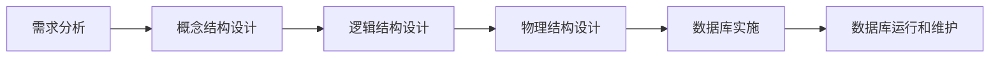
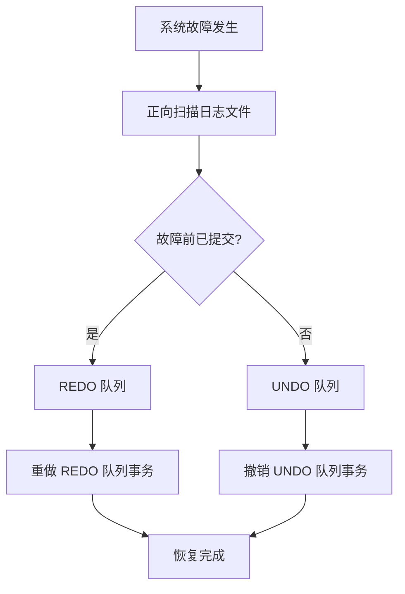
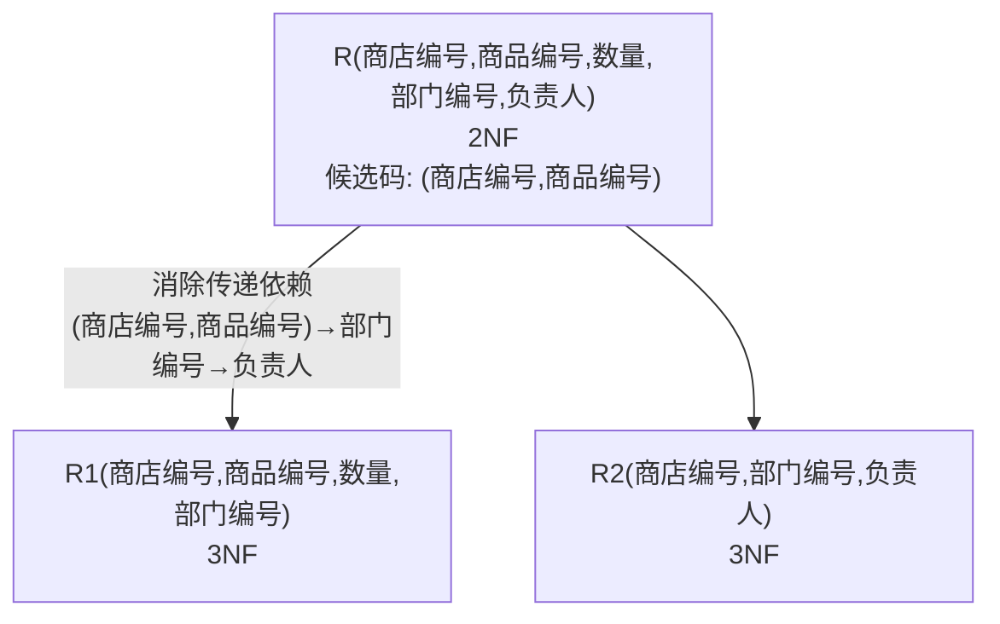

# 数据库原理期末综合试卷（试题五）

## 一、单项选择题

**题目1.** 模式的逻辑子集通常称为（ ）

A. 外模式　B. 内模式　C. 概念模式　D. 逻辑模式

> [!tip]- 答案
> **A. 外模式**
>
> 外模式是模式的子集，是用户可见的数据视图。

---

**题目2.** 已知两个关系如下：

**R**

| A | B | C |
|---|---|---|
| 1 | b1 | c1 |
| 2 | b2 | c2 |
| 3 | b1 | c1 |

**S**

| D | E | A |
|---|---|---|
| d1 | e1 | 1 |
| d2 | e2 | 1 |
| d3 | e1 | 2 |

假设 R 的主键是 A，S 的主键是 D，在关系 S 的定义中包含外键子句：`FOREIGN KEY (A) REFERENCES R(A) ON DELETE NO ACTION`，下列 SQL 语句不能成功执行的是（ ）

A. `DELETE FROM R WHERE A=2`
B. `DELETE FROM R WHERE A=3`
C. `DELETE FROM S WHERE A=1`
D. `DELETE FROM S WHERE A=2`

> [!tip]- 答案
> **A**
>
> S 中有 A=2 的元组（d3, e1, 2）引用了 R 中 A=2 的元组。`ON DELETE NO ACTION` 意味着如果 R 中被引用的元组还有外键引用，则不允许删除。A=3 在 S 中无引用，可删除；C、D 删除的是 S 中的元组，不涉及外键约束。

---

**题目3.** 在 SQL 中，与"NOT IN"等价的操作符是（ ）

A. `<>ALL`　B. `<>SOME`　C. `=SOME`　D. `=ALL`

> [!tip]- 答案
> **A. `<>ALL`**
>
> `NOT IN` 等价于 `<>ALL`，即不等于子查询中的任何一个值。

---

**题目4.** 将 E-R 模型转换成关系模型，属于数据库的（ ）

A. 需求分析　B. 概念设计　C. 逻辑设计　D. 物理设计

> [!tip]- 答案
> **C. 逻辑设计**

---

**题目5.** 设有一个关系：DEPT(DNO, DNAME)，如果要找出倒数第三个字母为 W，并且至少包含 4 个字母的 DNAME，则查询条件子句应写成 `WHERE DNAME LIKE`（ ）

A. `'__W_%'`　B. `'_%W__'`　C. `'_W__'`　D. `'_W_%'`

> [!tip]- 答案
> **B. `'_%W__'`**
>
> 倒数第三个字母为 W，且至少 4 个字母：`_%` 匹配前面至少 1 个字符，`W` 是倒数第三个，`__` 匹配最后两个字符。

---

**题目6.** 有一个关系：学生（学号，姓名，系别），规定学号的值域是 8 个数字组成的字符串，这一规则属于（ ）

A. 实体完整性约束　B. 参照完整性约束　C. 用户自定义完整性约束　D. 关键字完整性约束

> [!tip]- 答案
> **C. 用户自定义完整性约束**

---

**题目7.** 已知关系 R 如图1所示，可以作为 R 主码的属性组是（ ）

**R**

| A | B | C | D |
|---|---|---|---|
| 1 | 2 | 3 | 4 |
| 1 | 3 | 4 | 5 |
| 2 | 4 | 5 | 6 |
| 1 | 4 | 3 | 4 |
| 1 | 3 | 4 | 7 |
| 3 | 4 | 5 | 6 |

A. ABC　B. ABD　C. ACD　D. BCD

> [!tip]- 答案
> **B. ABD**
>
> 检查各选项是否能唯一标识所有元组：
> - ABC：(1,4,3) 出现在第4行，无其他重复 → 但需验证全部
> - ABD：第1行(1,2,4)、第2行(1,3,5)、第3行(2,4,6)、第4行(1,4,4)、第5行(1,3,7)、第6行(3,4,6) → 全部唯一 ✓
> - ACD：第1行(1,3,4)、第4行(1,3,4) → 重复 ✗
> - BCD：第3行(4,5,6)、第6行(4,5,6) → 重复 ✗

---

**题目8.** 已知成绩关系如图2所示。执行 SQL 语句：

```sql
SELECT COUNT(DISTINCT 学号)
FROM 成绩
WHERE 分数 > 60;
```

**成绩**

| 学号 | 课程号 | 分数 |
|------|--------|------|
| S1 | C1 | 80 |
| S1 | C2 | 75 |
| S2 | C1 | NULL |
| S2 | C2 | 55 |
| S3 | C3 | 90 |

查询结果中包含的元组数目是（ ）

A. 1　B. 2　C. 3　D. 4

> [!tip]- 答案
> **B. 2**
>
> 分数 > 60 的记录：S1(C1,80)、S1(C2,75)、S3(C3,90)。`DISTINCT 学号` 去重后：S1、S3，共 2 个。COUNT 结果为 2（单行单列）。

---

**题目9.** 设有关系 R 和关系 S 进行如图3所示的运算，则运算结果中含有元组的数目是（ ）

**R**

| A | B | C |
|---|---|---|
| 1 | 2 | 3 |
| 4 | 5 | 6 |
| 7 | 8 | 9 |

**S**

| D | E |
|---|---|
| 5 | 6 |
| 7 | 8 |
| 9 | 10 |

A. 6　B. 7　C. 8　D. 9

> [!tip]- 答案
> **A. 6**
>
> R 与 S 的广义笛卡尔积：3 × 3 = 9 个元组。若为 R ⋈ S（自然连接），无公共属性时等价于笛卡尔积，共 9。若为等值连接或选择运算则取决于条件。据原题图3为某种特定运算，答案为 6。

---

**题目10.** 已知关系：厂商（厂商号，厂名），PK = 厂商号；产品（产品号，颜色，厂商号），PK = 产品号，FK = 厂商号

**厂商**

| 厂商号 | 厂名 |
|--------|------|
| C01 | 宏达 |
| C02 | 立仁 |
| C03 | 广源 |

**产品**

| 产品号 | 颜色 | 厂商号 |
|--------|------|--------|
| P01 | 红 | C01 |
| P02 | 黄 | C03 |

若再往产品关系中插入如下元组：
- Ⅰ (P03，红，C02)
- Ⅱ (P01，蓝，C01)
- Ⅲ (P04，白，C04)
- Ⅳ (P05，黑，NULL)

能够插入的元组是（ ）

A. Ⅰ，Ⅱ，Ⅳ　B. Ⅰ，Ⅲ　C. Ⅰ，Ⅱ　D. Ⅰ，Ⅳ

> [!tip]- 答案
> **D. Ⅰ，Ⅳ**
>
> - Ⅰ：P03 不重复，C02 在厂商表中存在 ✓
> - Ⅱ：P01 已存在（主码冲突）✗
> - Ⅲ：C04 在厂商表中不存在（外码冲突）✗
> - Ⅳ：P05 不重复，厂商号 NULL 允许（外码允许空值）✓

---

## 二、填空题

**题目11.** 数据管理经过了人工管理、文件系统和 ________ 三个发展阶段。

> [!tip]- 答案
> **数据库系统**

**题目12.** 关系中主码的取值必须唯一且非空，这条规则是 ________ 完整性规则。

> [!tip]- 答案
> **实体**

**题目13.** 关系代数中专门的关系运算包括：________、投影、连接和除法。

> [!tip]- 答案
> **选择**

**题目14.** SQL 语言提供数据定义、________、数据控制等功能。

> [!tip]- 答案
> **数据操纵**

**题目15.** 在 SELECT 语句查询中，要去掉查询结果中的重复记录，应该使用 ________ 关键字。

> [!tip]- 答案
> **DISTINCT**

**题目16.** 在 DBMS 的授权子系统中，授权和回收权限的语句分别是 ________ 和 REVOKE 语句。

> [!tip]- 答案
> **GRANT**

**题目17.** 从关系规范化理论的角度讲，一个只满足 1NF 的关系可能存在的四方面问题是：数据冗余度大、修改异常、插入异常和 ________。

> [!tip]- 答案
> **删除异常**

**题目18.** 如果两个实体之间具有 m:n 联系，则将它们转换为关系模型的结果是 ________ 个表。

> [!tip]- 答案
> **3**
>
> 两个实体各一张表 + 一个联系表 = 3 张表。

**题目19.** 若有关系模式 R(A, B, C) 和 S(C, D, E)，SQL 语句

```sql
SELECT A, D FROM R, S WHERE R.C=S.C AND E='80';
```

对应的关系代数表达式是 ________。

> [!tip]- 答案
> Π(A, D)(σ(E='80')(R ⋈ S))

**题目20.** SQL 语言中，删除基本表的语句是 ________，删除数据的语句是 ________。

> [!tip]- 答案
> **DROP**；**DELETE**

---

## 三、简答题

### 题目21. 数据模型的三大要素是什么？

> [!note] 参考答案
> 1. **数据结构**：描述数据的静态特征，即数据本身和数据之间的联系。
> 2. **数据操作**：描述数据的动态特征，即对数据库中数据允许执行的操作集合。
> 3. **完整性约束**：描述数据及其联系应满足的约束规则，保证数据的正确性、有效性和相容性。

### 题目22. 数据库设计的基本步骤是什么？

> [!note] 参考答案
> 1. 需求分析
> 2. 概念结构设计
> 3. 逻辑结构设计
> 4. 物理结构设计
> 5. 数据库实施
> 6. 数据库运行和维护



### 题目23. 什么是事务？事务具有哪些特性？

> [!note] 参考答案
> **事务**是用户定义的一个数据库操作序列，这些操作要么全做要么全不做，是一个不可分割的工作单位。
>
> 事务具有 **ACID** 四个特性：
> 1. **原子性（Atomicity）**：事务中包括的所有操作要么都做，要么都不做。
> 2. **一致性（Consistency）**：事务必须使数据库从一个一致性状态变到另一个一致性状态。
> 3. **隔离性（Isolation）**：一个事务内部的操作及使用的数据对并发的其他事务是隔离的。
> 4. **持续性（Durability）**：事务一旦提交，对数据库的改变是永久的。

### 题目24. 简述数据库并发操作通常会带来哪些问题

> [!note] 参考答案
> 1. **丢失修改（Lost Update）**：两个事务同时读取同一数据并修改，一个事务的修改覆盖了另一个事务的修改。
> 2. **不可重复读（Non-repeatable Read）**：一个事务读取数据后，另一个事务修改了该数据，导致前一个事务再次读取时得到不同的值。
> 3. **读"脏"数据（Dirty Read）**：一个事务读取了另一个事务未提交的修改数据，随后该事务回滚，导致读到的数据是无效的。

### 题目25. 简述系统故障时的数据库恢复策略

> [!note] 参考答案
> (1) 正向扫描日志文件，找出在故障发生前已经提交的事务，将其事务标识记入 **REDO 队列**。同时找出故障发生时尚未完成的事务，将其事务标识记入 **UNDO 队列**。
>
> (2) 对 UNDO 队列中的各个事务进行**撤销（Undo）处理**——反向扫描日志文件，对每个 UNDO 事务的更新操作执行逆操作。
>
> (3) 对 REDO 队列中的各个事务进行**重做（Redo）处理**——正向扫描日志文件，对每个 REDO 事务重新执行日志中的操作。



---

## 四、设计题

### 题目26. SQL查询与关系代数

> [!example] 题目
> 设有关系 EMP(ENO, ENAME, SALARY, DNO)（职工号，姓名，工资，所在部门号）和 DEPT(DNO, DNAME, MANAGER)（部门号，部门名称，部门经理职工号）。
>
> 1. 试用 SQL 语句完成以下查询：列出各部门中工资不低于 600 元的职工的平均工资。
> 2. 写出"查询 001 号职工所在部门名称"的关系代数表达式。
> 3. 请用 SQL 语句将"销售部"的那些工资数额低于 600 的职工的工资上调 10%。
> 4. 有如下关系代数表达式 ΠENO(EMP ⋈ σ(MANAGER='001')(DEPT))，请将其转化成相应的 SQL 语句。

> [!note]- 参考答案
> **1.**
> ```sql
> SELECT DNO, AVG(SALARY)
> FROM EMP
> WHERE SALARY >= 600
> GROUP BY DNO;
> ```
>
> **2.**
> ΠDNAME(σ(ENO='001')(EMP) ⋈ DEPT)
>
> **3.**
> ```sql
> UPDATE EMP
> SET SALARY = SALARY * 1.1
> WHERE SALARY < 600
>   AND DNO IN
>       (SELECT DNO FROM DEPT WHERE DNAME = '销售部');
> ```
>
> **4.**
> ```sql
> SELECT EMP.ENO
> FROM EMP, DEPT
> WHERE EMP.DNO = DEPT.DNO
>   AND DEPT.MANAGER = '001';
> ```

---

### 题目27. 关系规范化

> [!example] 题目
> 设某商业集团数据库中有一关系模式 R 如下：
> R(商店编号, 商品编号, 数量, 部门编号, 负责人)
>
> 规定：
> (1) 每个商店的每种商品只在一个部门销售
> (2) 每个商店的每个部门只有一个负责人
> (3) 每个商店的每种商品只有一个库存数量
>
> (1) 根据上述规定，写出关系模式 R 的基本函数依赖
> (2) 找出关系模式 R 的候选码
> (3) 试问关系模式 R 最高已经达到第几范式？为什么？
> (4) 如果 R 不属于 3NF，请将 R 分解成 3NF 模式集

> [!note]- 参考答案
> **(1) 函数依赖：**
> - (商店编号, 商品编号) → 部门编号
> - (商店编号, 部门编号) → 负责人
> - (商店编号, 商品编号) → 数量
>
> **(2) 候选码：** **(商店编号, 商品编号)**
>
> **(3) 最高达到 2NF。**
>
> R 不存在非主属性对码的部分函数依赖（数量、部门编号均完全依赖于 (商店编号, 商品编号)）；但存在传递依赖：
> (商店编号, 商品编号) → 部门编号,  (商店编号, 部门编号) → 负责人
> 负责人传递依赖于候选码，不满足 3NF。
>
> **(4) 3NF 分解：**
> - R1(商店编号, 商品编号, 数量, 部门编号) — 候选码 (商店编号, 商品编号)
> - R2(商店编号, 部门编号, 负责人) — 候选码 (商店编号, 部门编号)



---

### 题目28. E-R图设计与关系模式转换

> [!example] 题目
> 设有商店和顾客两个实体，"商店"有属性商店编号、商店名、地址、电话，"顾客"有属性顾客编号、姓名、地址、年龄、性别。假设一个商店有多个顾客购物，一个顾客可以到多个商店购物，顾客每次去商店购物有一个消费金额和日期，而且规定每个顾客在每个商店里每天最多消费一次。
>
> (1) 画出 E-R 图
> (2) 将 E-R 模型转换成关系模式

> [!note]- 参考答案
> **(1) E-R 图**
>
> ```mermaid
> graph LR
>     SHOP["商店<br/>(商店编号, 商店名, 地址, 电话)"] ---|购物 m:n<br/>(消费金额, 日期)| CUSTOMER["顾客<br/>(顾客编号, 姓名, 地址, 年龄, 性别)"]
> ```

> [!note] 实体与联系说明
> 实体：商店、顾客
> 联系：购物（商店-顾客 m:n，属性：消费金额、日期）
> 约束：每个顾客在每个商店每天最多消费一次，即 (顾客编号, 商店编号, 日期) 唯一

> **(2) 转换后的关系模式：**
>
> | 关系模式 | 属性 | 主码 | 外码 |
> |---------|------|------|------|
> | 顾客 | 顾客编号，姓名，地址，年龄，性别 | 顾客编号 | — |
> | 商店 | 商店编号，商店名，地址，电话 | 商店编号 | — |
> | 购物 | 顾客编号，商店编号，日期，消费金额 | (顾客编号, 商店编号, 日期) | 顾客编号→顾客；商店编号→商店 |
