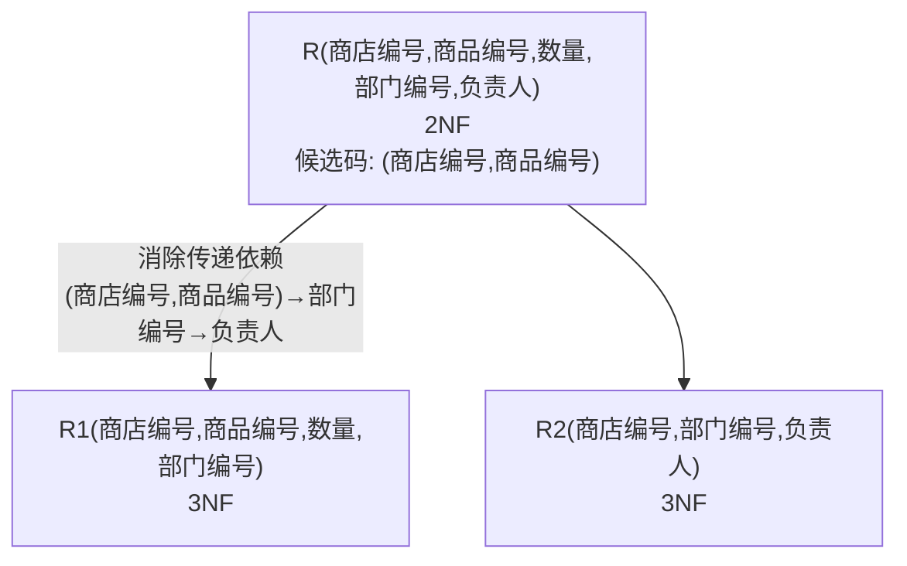

# 数据库原理期末综合试卷（试题八）

## 一、单项选择题

**题目1.** 下面列出的数据管理技术发展的三个阶段中，哪个（些）阶段没有专门的软件对数据进行管理？

Ⅰ. 人工管理阶段　Ⅱ. 文件系统阶段　Ⅲ. 数据库阶段

A. 只有 Ⅰ　B. 只有 Ⅱ　C. Ⅰ 和 Ⅱ　D. Ⅱ 和 Ⅲ

> [!tip]- 答案
> **A. 只有 Ⅰ**
>
> 人工管理阶段没有专门的数据管理软件，由应用程序自己管理数据。文件系统阶段有文件管理系统，数据库阶段有 DBMS。

---

**题目2.** 在关系数据库中，表（table）是三级模式结构中的（ ）

A. 外模式　B. 模式　C. 存储模式　D. 内模式

> [!tip]- 答案
> **B. 模式**
>
> 基本表对应模式，视图对应外模式，存储文件对应内模式。

---

> [!note] 题目3~5 基于如下两个关系
> 雇员信息表关系 EMP 的主键是雇员号，部门信息表关系 DEPT 的主键是部门号。
>
> **EMP**
>
> | 雇员号 | 雇员名 | 部门号 | 工资 |
> |--------|--------|--------|------|
> | 001 | 张山 | 02 | 2000 |
> | 010 | 王宏达 | 01 | 1200 |
> | 056 | 马林生 | 02 | 1000 |
> | 101 | 赵敏 | 04 | 1500 |
>
> **DEPT**
>
> | 部门号 | 部门名 | 地址 |
> |--------|--------|------|
> | 01 | 业务部 | 1号楼 |
> | 02 | 销售部 | 2号楼 |
> | 03 | 服务部 | 3号楼 |
> | 04 | 财务部 | 4号楼 |

**题目3.** 若执行下面列出的操作，哪个操作不能成功执行？

A. 从 EMP 中删除行 ('010', '王宏达', '01', 1200)
B. 在 EMP 中插入行 ('102', '赵敏', '01', 1500)
C. 将 EMP 中雇员号='056' 的工资改为 1600 元
D. 将 EMP 中雇员号='101' 的部门号改为 '05'

> [!tip]- 答案
> **D**
>
> 部门号 '05' 不在 DEPT 表中，将 EMP 中部门号改为 '05' 违反参照完整性（外码约束）。

---

**题目4.** 若执行下面列出的操作，哪个操作不能成功执行？

A. 从 DEPT 中删除部门号='03' 的行
B. 在 DEPT 中插入行 ('06', '计划部', '6号楼')
C. 将 DEPT 中部门号='02' 的部门号改为 '10'
D. 将 DEPT 中部门号='01' 的地址改为 '5号楼'

> [!tip]- 答案
> **C**
>
> DEPT 中部门号='02' 被 EMP 中雇员 001 和 056 引用，修改主码值会导致参照完整性破坏（除非使用 `ON UPDATE CASCADE`）。

---

**题目5.** 在雇员信息表关系 EMP 中，哪个属性是外键（foreign key）？

A. 雇员号　B. 雇员名　C. 部门号　D. 工资

> [!tip]- 答案
> **C. 部门号**
>
> 部门号在 EMP 中引用 DEPT 表的主码（部门号），是外码。

---

**题目6.** 在 SQL 语言的 SELECT 语句中，实现投影操作的是哪个子句？

A. SELECT　B. FROM　C. WHERE　D. GROUP BY

> [!tip]- 答案
> **A. SELECT**
>
> 投影（Π）选择列，对应 SELECT 子句；选择（σ）选择行，对应 WHERE 子句。

---

**题目7.** SQL 语言集数据查询、数据操纵、数据定义和数据控制功能于一体，语句 INSERT、DELETE、UPDATE 实现哪类功能？

A. 数据查询　B. 数据操纵　C. 数据定义　D. 数据控制

> [!tip]- 答案
> **B. 数据操纵**
>
> INSERT、DELETE、UPDATE 属于 DML（数据操纵语言）。

---

**题目8.** 设关系 R 和关系 S 的基数分别是 3 和 4，关系 T 是 R 与 S 的广义笛卡尔积，即 T = R × S，则关系 T 的基数是（ ）

A. 7　B. 9　C. 12　D. 16

> [!tip]- 答案
> **C. 12**
>
> 笛卡尔积的基数 = 3 × 4 = 12。

---

**题目9.** 设属性 A 是关系 R 的主属性，则属性 A 不能取空值（NULL）。这是（ ）

A. 实体完整性规则　B. 参照完整性规则　C. 用户定义完整性规则　D. 域完整性规则

> [!tip]- 答案
> **A. 实体完整性规则**
>
> 实体完整性要求主属性（主码）不能取空值。

---

**题目10.** 在并发控制的技术中，最常用的是封锁方法。对于共享锁（S）和排他锁（X）来说，下面列出的相容关系中，哪一个是不正确的？

A. X/X：TRUE　B. S/S：TRUE　C. S/X：FALSE　D. X/S：FALSE

> [!tip]- 答案
> **A**
>
> X/X 不相容（FALSE）。X 锁是排他锁，与任何锁都不相容。正确：X/X = FALSE。

---

**题目11.** 下面关于函数依赖的叙述中，不正确的是（ ）

A. 若 X → Y, X → Z，则 X → YZ
B. 若 XY → Z，则 X → Z, Y → Z
C. 若 X → Y, Y → Z，则 X → Z
D. 若 X → Y, Y' ⊂ Y，则 X → Y'

> [!tip]- 答案
> **B**
>
> XY → Z 不意味着 X → Z 或 Y → Z（部分依赖不成立）。A=合并规则，C=传递规则，D=分解规则，均正确。

---

> [!note] 题目12~14 基于以下叙述
> 有关系模式 A(C, T, H, R, S)，各属性含义：C=课程，T=教员，H=上课时间，R=教室，S=学生。
> 函数依赖集 F = {C → T, (H,R) → C, (H,T) → R, (H,S) → R}

**题目12.** 关系模式 A 的码是（ ）

A. C　B. (H, R)　C. (H, T)　D. (H, S)

> [!tip]- 答案
> **D. (H, S)**
>
> (H,S)⁺：H,S → (H,S) → R（由 (H,S) → R）得 R → (H,R) → C（由 (H,R) → C）得 C → C → T 得 T → 全部属性 CTHRS ✓

---

**题目13.** 关系模式 R 的规范化程度最高达到（ ）

A. 1NF　B. 2NF　C. 3NF　D. BCNF

> [!tip]- 答案
> **B. 2NF**
>
> 候选码为 (H, S)。非主属性 C、T、R 均完全依赖于候选码 (H, S)（无部分依赖），满足 2NF。但存在传递依赖：(H,S) → R → C → T，不满足 3NF。

---

**题目14.** 现将关系模式 A 分解为两个关系模式 A1(C, T) 和 A2(H, R, S)，则其中 A1 的规范化程度达到（ ）

A. 1NF　B. 2NF　C. 3NF　D. BCNF

> [!tip]- 答案
> **D. BCNF**
>
> A1(C, T) 中候选码为 C，F = {C → T}，唯一的非平凡函数依赖左部 C 包含候选码，满足 BCNF。

---

**题目15.** 设有两个事务 T1 和 T2，其并发操作序列如下表所示。则下面说法中正确的是（ ）

| 步骤 | T1 | T2 |
|------|----|----|
| 1 | 读 A=100；A=A*2 写回 | |
| 2 | | 读 A=200 |
| 3 | ROLLBACK 恢复 A=100 | |

A. 该并发操作不存在问题
B. 该并发操作丢失更新
C. 该并发操作不能重复读
D. 该并发操作读出"脏"数据

> [!tip]- 答案
> **D. 该并发操作读出"脏"数据**
>
> T1 写回 A=200 后 T2 读到该值，但 T1 随后 ROLLBACK 恢复 A=100，T2 读到的是未提交的脏数据。

---

**题目16.** 并发操作有可能引起下述（ ）问题。

Ⅰ. 丢失更新　Ⅱ. 不可重复读　Ⅲ. 读脏数据

A. 仅 Ⅰ 和 Ⅱ　B. 仅 Ⅰ 和 Ⅲ　C. 仅 Ⅱ 和 Ⅲ　D. 都是

> [!tip]- 答案
> **D. 都是**

---

**题目17.** E-R 模型向关系模型转换是数据库设计的（ ）阶段的任务。

A. 需求分析　B. 概念结构设计　C. 逻辑结构设计　D. 物理结构设计

> [!tip]- 答案
> **C. 逻辑结构设计**

---

**题目18.** SQL 语言中，删除一个表的命令是（ ）

A. DELETE　B. DROP　C. CLEAR　D. REMOVE

> [!tip]- 答案
> **B. DROP**
>
> `DELETE` 删除表中数据（元组），`DROP TABLE` 删除整个表结构。

---

**题目19.** 从 E-R 模型向关系模型转换时，一个 m:n 联系转换为关系模式时，该关系模式的候选码是（ ）

A. m 端实体的关键字
B. n 端实体的关键字
C. m 端实体关键字与 n 端实体关键字组合
D. 重新选取其他属性

> [!tip]- 答案
> **C. m 端实体关键字与 n 端实体关键字组合**

---

**题目20.** 已知关系 SPJ(S#, P#, J#, QTY)，把对关系 SPJ 的属性 QTY 的修改权授予用户张三的 T-SQL 语句是（ ）

A. `GRANT QTY ON SPJ TO 张三`
B. `GRANT UPDATE ON SPJ TO 张三`
C. `GRANT UPDATE (QTY) ON SPJ TO 张三`
D. `GRANT UPDATE ON SPJ (QTY) TO 张三`

> [!tip]- 答案
> **C**
>
> GRANT 语法：`GRANT UPDATE (属性名) ON 表名 TO 用户名`。

---

## 二、填空题

**题目21.** 在数据库的三级模式体系结构中，模式与内模式之间的映象（模式/内模式），实现了数据的 ________ 独立性。

> [!tip]- 答案
> **物理**

**题目22.** 在 SQL 语言中，使用 ________ 语句收回授权。

> [!tip]- 答案
> **REVOKE**

**题目23.** 一个 SQL 语句原则上可产生或处理一组记录，而程序语言一次只能处理一个记录，为此必须协调两种处理方式，这是通过使用 ________ 机制来解决的。

> [!tip]- 答案
> **游标（Cursor）**

**题目24.** 在"学生—选课—课程"数据库中的三个关系如下：S(S#, SNAME, SEX, AGE)，SC(S#, C#, GRADE)，C(C#, CNAME, TEACHER)。现要查找选修"数据库技术"这门课程的学生的学生姓名和成绩，可使用如下的 SQL 语句：

`SELECT SNAME, GRADE FROM S, SC, C WHERE CNAME='数据库技术' AND S.S#=SC.S# AND ________`

> [!tip]- 答案
> `SC.C# = C.C#`

**题目25.** 数据库管理系统中，为了保证事务的正确执行，维护数据库的完整性，要求数据库系统维护以下事务特性：________、一致性、隔离性和持久性。

> [!tip]- 答案
> **原子性**

**题目26.** 在一个关系中，任何候选码中所包含的属性都称为 ________。

> [!tip]- 答案
> **主属性**

**题目27.** 关系模式分解的等价性标准主要有两个，分别为分解具有 ________ 和 ________。

> [!tip]- 答案
> **无损连接性**；**保持函数依赖性**

**题目28.** 如果关系模式 R 中所有的属性都是主属性，则 R 的规范化程度至少达到 ________。

> [!tip]- 答案
> **3NF**
>
> 所有属性都是主属性意味着不存在非主属性对码的部分依赖和传递依赖，满足 3NF。

**题目29.** ________ 是一种特殊的存储过程，它可以在对一个表上进行 INSERT、UPDATE 和 DELETE 操作中的任一种或几种操作时被自动调用执行。

> [!tip]- 答案
> **触发器（Trigger）**

---

## 三、设计题

### 题目30. 关系规范化

> [!example] 题目
> 假设某商业集团数据库中有一关系模式 R 如下：
> R(商店编号, 商品编号, 数量, 部门编号, 负责人)
>
> 规定：
> (1) 每个商店的每种商品只在一个部门销售
> (2) 每个商店的每个部门只有一个负责人
> (3) 每个商店的每种商品只有一个库存数量
>
> (1) 根据上述规定，写出关系模式 R 的基本函数依赖
> (2) 找出关系模式 R 的候选码
> (3) 试问关系模式 R 最高已经达到第几范式？为什么？
> (4) 如果 R 不属于 3NF，请将 R 分解成 3NF 模式集

> [!note]- 参考答案
> **(1) 函数依赖：**
> - (商店编号, 商品编号) → 部门编号
> - (商店编号, 部门编号) → 负责人
> - (商店编号, 商品编号) → 数量
>
> **(2) 候选码：** **(商店编号, 商品编号)**
>
> **(3) 最高达到 2NF。**
>
> R 不存在非主属性对码的部分函数依赖（数量、部门编号均完全依赖于候选码）；但存在传递依赖：
> (商店编号, 商品编号) → 部门编号,  (商店编号, 部门编号) → 负责人
> 负责人传递依赖于候选码，不满足 3NF。
>
> **(4) 3NF 分解：**
> - R1(商店编号, 商品编号, 数量, 部门编号) — 候选码 (商店编号, 商品编号)
> - R2(商店编号, 部门编号, 负责人) — 候选码 (商店编号, 部门编号)



---

### 题目31. E-R图设计与关系模式转换

> [!example] 题目
> 某医院病房管理系统中，包括四个实体型，分别为：
> - 科室：科名，科地址，科电话
> - 病房：病房号，病房地址
> - 医生：工作证号，姓名，职称，年龄
> - 病人：病历号，姓名，性别
>
> 语义约束：
> ① 一个科室有多个病房、多个医生；一个病房只能属于一个科室，一个医生只属于一个科室
> ② 一个医生可负责多个病人的诊治，一个病人的主管医生只有一个
> ③ 一个病房可入住多个病人，一个病人只能入住在一个病房
>
> 注意：不同科室可能有相同的病房号。
>
> (1) 画出该医院病房管理系统的 E-R 图
> (2) 将该 E-R 图转换为关系模型（要求：1:1 和 1:n 的联系进行合并）
> (3) 指出转换结果中每个关系模式的主码和外码

> [!note]- 参考答案
> **(1) E-R 图**
>
> ```mermaid
> graph LR
>     DEPT["科室<br/>(科名, 科地址, 科电话)"] ---|组成 1:n| WARD["病房<br/>(病房号, 病房地址)"]
>     DEPT ---|拥有 1:n| DOCTOR["医生<br/>(工作证号, 姓名, 职称, 年龄)"]
>     DOCTOR ---|诊治 1:n| PATIENT["病人<br/>(病历号, 姓名, 性别)"]
>     WARD ---|入住 1:n| PATIENT
> ```

> [!note] 实体与联系说明
> 实体：科室、病房、医生、病人
> 联系：
> - **组成**：科室 `1 ── n` 病房
> - **拥有**：科室 `1 ── n` 医生
> - **入住**：病房 `1 ── n` 病人
> - **诊治**：医生 `1 ── n` 病人
>
> 注意：不同科室可能有相同的病房号，因此病房的主码需要包含科名。

> **(2) 转换后的关系模式：**
>
> | 关系模式 | 属性 | 主码 | 外码 |
> |---------|------|------|------|
> | 科室 | 科名，科地址，科电话 | 科名 | — |
> | 病房 | 病房号，病房地址，科名 | (科名, 病房号) | 科名→科室 |
> | 医生 | 工作证号，姓名，职称，年龄，科名 | 工作证号 | 科名→科室 |
> | 病人 | 病历号，姓名，性别，主管医生，病房号，科名 | 病历号 | (科名, 病房号)→病房；工作证号→医生 |

---

### 题目32. 存储过程编程

> [!example] 题目
> 假设存在名为 AAA 的数据库，包括：
> - S(S# char(8), SN varchar(8), AGE int, DEPT varchar(20), DateT DateTime)
> - SC(S# char(8), CN varchar(10), GRADE numeric(5,2))
>
> 两张表。请按下列要求写一存储过程 PROC3。
>
> 要求：修改 SC 表中学号为 @s1 的值、课程名为 @c1 的值的学生成绩为 @g1 的值。

> [!note]- 参考答案
> ```sql
> CREATE PROCEDURE PROC3
>     @s1 char(8),
>     @c1 varchar(10),
>     @g1 numeric(5,2)
> AS
> BEGIN
>     UPDATE SC
>     SET GRADE = @g1
>     WHERE S# = @s1 AND CN = @c1;
> END
> ```
