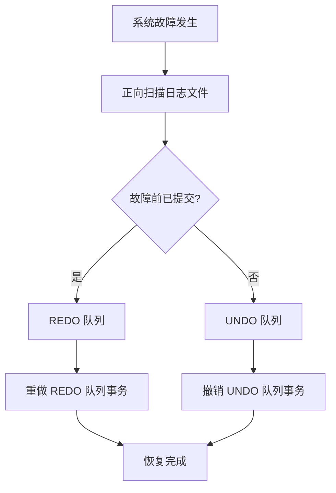
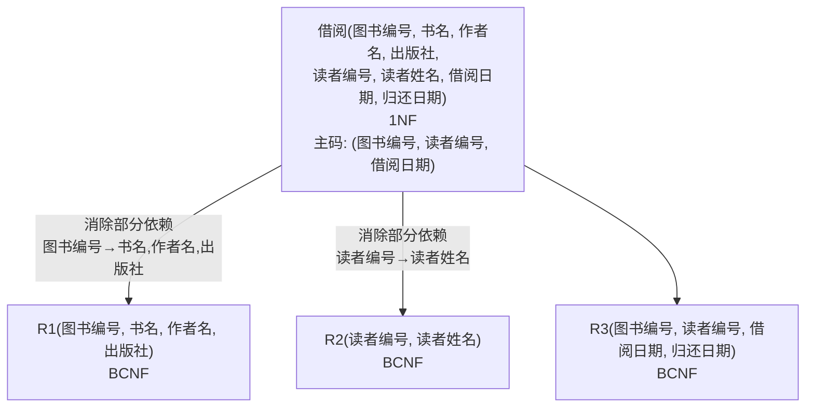

# 数据库原理期末综合试卷（试题六）

## 一、单项选择题

**题目1.** DB、DBMS 和 DBS 三者之间的关系是（ ）

A. DB 包括 DBMS 和 DBS　B. DBS 包括 DB 和 DBMS　C. DBMS 包括 DB 和 DBS　D. 不能相互包括

> [!tip]- 答案
> **B. DBS 包括 DB 和 DBMS**
>
> 数据库系统（DBS）= 数据库（DB）+ 数据库管理系统（DBMS）+ 应用系统 + 数据库管理员 + 用户。

---

**题目2.** 对数据库物理存储方式的描述称为（ ）

A. 外模式　B. 内模式　C. 概念模式　D. 逻辑模式

> [!tip]- 答案
> **B. 内模式**
>
> 内模式描述数据的物理存储方式和存取路径。

---

**题目3.** 在数据库三级模式间引入二级映象的主要作用是（ ）

A. 提高数据与程序的独立性
B. 提高数据与程序的安全性
C. 保持数据与程序的一致性
D. 提高数据与程序的可移植性

> [!tip]- 答案
> **A. 提高数据与程序的独立性**
>
> 外模式/模式映像保证逻辑独立性，模式/内模式映像保证物理独立性。

---

**题目4.** 视图是一个"虚表"，视图的构造基于（ ）

A. 基本表　B. 视图　C. 基本表或视图　D. 数据字典

> [!tip]- 答案
> **C. 基本表或视图**
>
> 视图可以基于基本表或已定义的视图构造。

---

**题目5.** 关系代数中的 π 运算符对应 SELECT 语句中的以下哪个子句？（ ）

A. SELECT　B. FROM　C. WHERE　D. GROUP BY

> [!tip]- 答案
> **A. SELECT**
>
> π（投影）对应 SELECT 子句，σ（选择）对应 WHERE 子句。

---

**题目6.** 公司中有多个部门和多名职员，每个职员只能属于一个部门，一个部门可以有多名职员，从职员到部门的联系类型是（ ）

A. 多对多　B. 一对一　C. 多对一　D. 一对多

> [!tip]- 答案
> **C. 多对一**
>
> 多个职员属于一个部门，从职员角度看是 n:1（多对一）。

---

**题目7.** 如何构造出一个合适的数据逻辑结构是（ ）主要解决的问题。

A. 关系系统查询优化　B. 数据字典　C. 关系数据库规范化理论　D. 关系数据库查询

> [!tip]- 答案
> **C. 关系数据库规范化理论**
>
> 规范化理论研究如何消除不合适的函数依赖，构造合适的关系模式。

---

**题目8.** 将 E-R 模型转换成关系模型，属于数据库的（ ）

A. 需求分析　B. 概念设计　C. 逻辑设计　D. 物理设计

> [!tip]- 答案
> **C. 逻辑设计**

---

**题目9.** 事务日志的用途是（ ）

A. 事务处理　B. 完整性约束　C. 数据恢复　D. 安全性控制

> [!tip]- 答案
> **C. 数据恢复**
>
> 日志文件记录对数据库的所有更新操作，用于故障恢复。

---

**题目10.** 如果事务 T 已在数据 R 上加了 X 锁，则其他事务在数据 R 上（ ）

A. 只可加 X 锁　B. 只可加 S 锁　C. 可加 S 锁或 X 锁　D. 不能加任何锁

> [!tip]- 答案
> **D. 不能加任何锁**
>
> X 锁（排他锁）与其他任何锁都不相容，其他事务既不能加 S 锁也不能加 X 锁。

---

## 二、填空题

**题目11.** 数据库的逻辑数据独立性是由 ________ 映象提供的。

> [!tip]- 答案
> **外模式/模式**

**题目12.** 关系代数中专门的关系运算包括：选择、投影、连接和 ________。

> [!tip]- 答案
> **除**

**题目13.** 设有学生表 S(学号，姓名，班级) 和学生选课表 SC(学号，课程号，成绩)，为维护数据一致性，表 S 与 SC 之间应满足 ________ 完整性约束。

> [!tip]- 答案
> **参照**

**题目14.** 当数据库被破坏后，如果事先保存了数据库副本和 ________，就有可能恢复数据库。

> [!tip]- 答案
> **日志文件**

**题目15.** 如果一个满足 1NF 关系的所有属性合起来组成一个关键字，则该关系最高满足的范式是 ________（在 1NF、2NF、3NF 范围内）。

> [!tip]- 答案
> **3NF**
>
> 所有属性组成候选码意味着不存在非主属性，因此不存在部分函数依赖和传递函数依赖，满足 3NF。

**题目16.** 设关系模式 R(A, B, C, D)，函数依赖集 F = {AB → C, D → B}，则 R 的候选码为 ________。

> [!tip]- 答案
> **AD**
>
> AD 的闭包：A 无依赖，D → B 得 B，AB → C 得 C。(AD)⁺ = ABCD，全部属性均可推出，且 AD 的任何真子集都不能推出全部属性。

**题目17.** 从关系规范化理论的角度讲，一个只满足 1NF 的关系可能存在的四方面问题是：数据冗余度大、插入异常、________ 和删除异常。

> [!tip]- 答案
> **修改异常**

**题目18.** 并发控制的主要方法是 ________ 机制。

> [!tip]- 答案
> **封锁**

**题目19.** 若有关系模式 R(A, B, C) 和 S(C, D, E)，SQL 语句

```sql
SELECT A, D FROM R, S WHERE R.C=S.C AND E='80';
```

对应的关系代数表达式是 ________。

> [!tip]- 答案
> Π(A, D)(σ(E='80')(R ⋈ S))

**题目20.** 分 E-R 图之间的冲突主要有属性冲突、________、结构冲突三种。

> [!tip]- 答案
> **命名冲突**

---

## 三、简答题

### 题目21. 说明视图与基本表的区别和联系

> [!note] 参考答案
> 视图是从一个或几个基本表导出的表，它与基本表不同，是一个**虚表**。数据库中只存放视图的定义，而不存放视图对应的数据，这些数据存放在原来的基本表中。当基本表中的数据发生变化，从视图中查询出的数据也就随之改变。
>
> 视图一经定义就可以像基本表一样被查询、删除，也可以在一个视图之上再定义新的视图，但是对视图的更新操作有限制。

### 题目22. 简述事务的特性

> [!note] 参考答案
> 事务具有四个特性，即 **ACID** 特性：
>
> 1. **原子性（Atomicity）**：事务中包括的所有操作要么都做，要么都不做。
> 2. **一致性（Consistency）**：事务必须使数据库从一个一致性状态变到另一个一致性状态。
> 3. **隔离性（Isolation）**：一个事务内部的操作及使用的数据对并发的其他事务是隔离的。
> 4. **持续性（Durability）**：事务一旦提交，对数据库的改变是永久的。

### 题目23. 试述关系模型的参照完整性规则

> [!note] 参考答案
> 参照完整性规则：若属性（或属性组）F 是基本关系 R 的外码，它与基本关系 S 的主码 Ks 相对应（基本关系 R 和 S 不一定是不同的关系），则对于 R 中每个元组在 F 上的值必须为：
>
> - **取空值**（F 的每个属性值均为空值）
> - 或者**等于 S 中某个元组的主码值**

### 题目24. 简述系统故障时的数据库恢复策略

> [!note] 参考答案
> (1) 正向扫描日志文件，找出在故障发生前已经提交的事务，将其事务标识记入 **REDO 队列**。同时找出故障发生时尚未完成的事务，将其事务标识记入 **UNDO 队列**。
>
> (2) 对 UNDO 队列中的各个事务进行**撤销（Undo）处理**。
>
> (3) 对 REDO 队列中的各个事务进行**重做（Redo）处理**。



---

## 四、设计题

### 题目25. 关系代数与SQL查询

> [!example] 题目
> 现有关系数据库如下：
> - 学生（学号，姓名，性别，专业）
> - 课程（课程号，课程名，学分）
> - 学习（学号，课程号，分数）
>
> 分别用**关系代数表达式和 SQL 语句**实现下列 1—5 小题（每小题都要分别写出关系代数表达式和 SQL 语句）

#### (1) 检索所有选修了课程号为"C112"的课程的学生的学号和分数

> [!note]- 参考答案
> **SQL：**
> ```sql
> SELECT 学号, 分数
> FROM 学习
> WHERE 课程号 = 'C112';
> ```
>
> **关系代数：**
> Π(学号, 分数)(σ(课程号='C112')(学习))

#### (2) 检索"英语"专业学生所学课程的信息，包括学号、姓名、课程名和分数

> [!note]- 参考答案
> **SQL：**
> ```sql
> SELECT 学生.学号, 姓名, 课程名, 分数
> FROM 学生, 学习, 课程
> WHERE 学习.学号 = 学生.学号
>   AND 学习.课程号 = 课程.课程号
>   AND 专业 = '英语';
> ```
>
> **关系代数：**
> Π(学号, 姓名, 课程名, 分数)(σ(专业='英语')(学生) ⋈ 学习 ⋈ 课程)

#### (3) 检索"数据库原理"课程成绩高于 90 分的所有学生的学号、姓名、专业和分数

> [!note]- 参考答案
> **SQL：**
> ```sql
> SELECT 学生.学号, 姓名, 专业, 分数
> FROM 学生, 学习, 课程
> WHERE 学生.学号 = 学习.学号
>   AND 学习.课程号 = 课程.课程号
>   AND 分数 > 90
>   AND 课程名 = '数据库原理';
> ```
>
> **关系代数：**
> Π(学号, 姓名, 专业, 分数)(σ(课程名='数据库原理' ∧ 分数 > 90)(学生 ⋈ 学习 ⋈ 课程))

#### (4) 检索没学课程号为"C135"课程的学生信息，包括学号、姓名和专业

> [!note]- 参考答案
> **SQL：**
> ```sql
> SELECT 学号, 姓名, 专业
> FROM 学生
> WHERE 学号 NOT IN
>     (SELECT 学号 FROM 学习 WHERE 课程号 = 'C135');
> ```
>
> **关系代数：**
> Π(学号, 姓名, 专业)(学生) - Π(学号, 姓名, 专业)(σ(课程号='C135')(学生 ⋈ 学习))

#### (5) 检索至少学过课程号为"C135"和"C219"的课程的学生的信息，包括学号、姓名和专业

> [!note]- 参考答案
> **SQL：**
> ```sql
> SELECT 学号, 姓名, 专业
> FROM 学生
> WHERE 学号 IN
>     (SELECT X1.学号
>      FROM 学习 X1, 学习 X2
>      WHERE X1.学号 = X2.学号
>        AND X1.课程号 = 'C135'
>        AND X2.课程号 = 'C219');
> ```
>
> **关系代数：**
> Π(学号, 姓名, 专业)(学生) ⋈ (Π(学号, 课程号)(学习) ÷ Π课程号(σ(课程号='C135' ∨ 课程号='C219')(课程)))

---

### 题目26. 关系规范化

> [!example] 题目
> 现有如下关系模式：
> 借阅(图书编号, 书名, 作者名, 出版社, 读者编号, 读者姓名, 借阅日期, 归还日期)
>
> 基本函数依赖集：
> F = {图书编号 → (书名, 作者名, 出版社), 读者编号 → 读者姓名, (图书编号, 读者编号, 借阅日期) → 归还日期}
>
> (1) 读者编号是候选码吗？
> (2) 写出该关系模式的主码。
> (3) 该关系模式中是否存在非主属性对码的部分函数依赖？如果存在，请写出一个。
> (4) 该关系模式满足第几范式？并说明理由。

> [!note]- 参考答案
> **(1)** 不是。读者编号只能函数决定读者姓名，不能决定图书编号、借阅日期等其他属性，不能唯一标识元组。
>
> **(2)** 主码：**(图书编号, 读者编号, 借阅日期)**
>
> **(3)** 存在部分函数依赖。例如：图书编号 → (书名, 作者名, 出版社)，书名、作者名、出版社部分依赖于主码中的图书编号；读者编号 → 读者姓名，读者姓名部分依赖于主码中的读者编号。
>
> **(4)** 满足 **1NF**。因为存在非主属性（书名、作者名、出版社、读者姓名等）对码的部分函数依赖，不满足 2NF。



---

### 题目27. E-R图设计与关系模式转换

> [!example] 题目
> 某工厂生产多种产品，每种产品由不同的零件组装而成，有的零件可用在不同的产品上。产品有产品号和产品名两个属性，零件有零件号和零件名两个属性。
>
> (1) 画出 E-R 图
> (2) 将 E-R 模型转换成关系模式，标注主码

> [!note]- 参考答案
> **(1) E-R 图**
>
> ```mermaid
> graph LR
>     PRODUCT["产品<br/>(产品号, 产品名)"] ---|组装 m:n| PART["零件<br/>(零件号, 零件名)"]
> ```

> [!note] 实体与联系说明
> 实体：产品、零件
> 联系：组装（产品-零件 m:n，无属性）

> **(2) 转换后的关系模式：**
>
> | 关系模式 | 属性 | 主码 | 外码 |
> |---------|------|------|------|
> | 产品 | 产品号，产品名 | 产品号 | — |
> | 零件 | 零件号，零件名 | 零件号 | — |
> | 组装 | 产品号，零件号 | (产品号, 零件号) | 产品号→产品；零件号→零件 |
