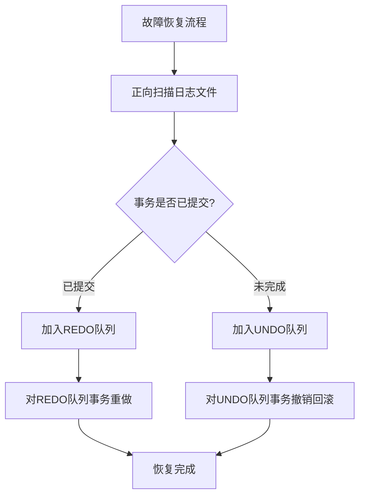
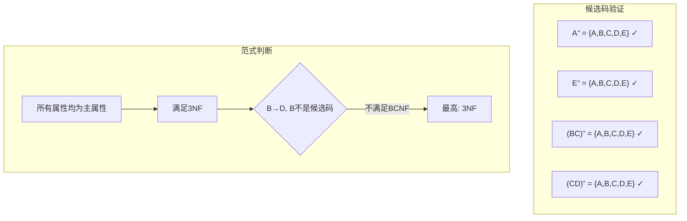

# 数据库原理期末综合试卷（试题十）

## 一、单项选择题

**题目1.** 数据库系统的最大特点是（ ）

A. 数据的三级抽象和二级映像　B. 数据的共享性　C. 数据的结构化　D. 数据的独立性

> [!tip]- 答案
> **A. 数据的三级抽象和二级映像**
>
> 三级模式（外模式、模式、内模式）和两级映像（外模式/模式、模式/内模式）是数据库系统的核心架构特点，保证了数据独立性。

---

**题目2.** 在数据库的三级模式结构中，描述数据库全局逻辑结构的是（ ）

A. 外模式　B. 模式　C. 内模式　D. 存储模式

> [!tip]- 答案
> **B. 模式**
>
> 模式描述全局逻辑结构，外模式描述局部逻辑结构，内模式描述物理存储结构。

---

**题目3.** 关系模型中，一个候选码（ ）

A. 只能由一个属性构成　B. 必须由多个属性构成　C. 可以由一个或者多个属性构成　D. 以上都不对

> [!tip]- 答案
> **C. 可以由一个或者多个属性构成**

---

**题目4.** 自然连接是一种特殊的（ ）

A. 选择运算　B. 投影运算　C. 等值连接　D. 笛卡尔积

> [!tip]- 答案
> **C. 等值连接**
>
> 自然连接是等值连接的特例：在两关系公共属性上做等值连接，并去掉重复列。

---

**题目5.** SQL 语言中，修改表结构的命令是（ ）

A. `MODIFY TABLE`　B. `ALTER TABLE`　C. `CHANGE TABLE`　D. `UPDATE TABLE`

> [!tip]- 答案
> **B. `ALTER TABLE`**

---

**题目6.** 下列哪一个不是关系完整性约束（ ）

A. 实体完整性　B. 参照完整性　C. 用户自定义完整性　D. 安全完整性

> [!tip]- 答案
> **D. 安全完整性**
>
> 关系完整性三要素：实体完整性、参照完整性、用户自定义完整性。

---

**题目7.** 关系规范化中的插入异常是指（ ）

A. 不该删除的数据被删除　B. 不该插入的数据被插入　C. 应该删除的数据未被删除　D. 应该插入的数据未被插入

> [!tip]- 答案
> **D. 应该插入的数据未被插入**

---

**题目8.** 消除非主属性对码的传递函数依赖，可达到（ ）

A. 1NF　B. 2NF　C. 3NF　D. BCNF

> [!tip]- 答案
> **C. 3NF**

---

**题目9.** 数据库概念结构设计阶段得到的结果是（ ）

A. 数据流图　B. E-R 模型　C. 关系模式集合　D. 索引设计方案

> [!tip]- 答案
> **B. E-R 模型**

---

**题目10.** E-R 图转换为关系模式属于数据库设计的哪个阶段（ ）

A. 需求分析　B. 概念结构设计　C. 逻辑结构设计　D. 物理结构设计

> [!tip]- 答案
> **C. 逻辑结构设计**

---

**题目11.** 事务的持久性是指（ ）

A. 事务操作要么全做，要么全不做　B. 事务提交之后对数据库的修改永久有效　C. 多个事务之间操作互相隔离　D. 事务执行前后数据库保持一致性

> [!tip]- 答案
> **B. 事务提交之后对数据库的修改永久有效**
>
> A=原子性，C=隔离性，D=一致性。

---

**题目12.** 下面不属于并发操作带来问题的是（ ）

A. 丢失修改　B. 不可重复读　C. 读脏数据　D. 事务回滚

> [!tip]- 答案
> **D. 事务回滚**
>
> 事务回滚是故障恢复机制，不是并发问题。并发三问题是：丢失修改、不可重复读、读脏数据。

---

**题目13.** 共享锁 S 的作用是（ ）

A. 只允许读，不允许修改数据　B. 允许读，也允许修改数据　C. 禁止任何其他事务访问　D. 专门用于事务回滚

> [!tip]- 答案
> **A. 只允许读，不允许修改数据**
>
> S 锁（共享锁）允许其他事务再加 S 锁（并发读），但不允许加 X 锁（不能写）。

---

**题目14.** 两段锁协议主要用来保证事务调度的（ ）

A. 原子性　B. 可串行性　C. 持久性　D. 一致性

> [!tip]- 答案
> **B. 可串行性**
>
> 两段锁协议是可串行化调度的充分条件，但**不防死锁**。

---

**题目15.** 数据库故障中，破坏磁盘上数据库数据的是（ ）

A. 事务故障　B. 系统故障　C. 介质故障　D. 死锁

> [!tip]- 答案
> **C. 介质故障**
>
> 介质故障导致外存数据丢失，需用后备副本 + 日志文件恢复。

---

**题目16.** 数据库恢复用到的两类重要资源是（ ）

A. 数据字典与应用程序　B. 后备副本、日志文件　C. 索引、视图　D. 授权表、审计日志

> [!tip]- 答案
> **B. 后备副本、日志文件**

---

**题目17.** SQL 中收回权限的语句是（ ）

A. `GRANT`　B. `REVOKE`　C. `DENY`　D. `REMOVE`

> [!tip]- 答案
> **B. `REVOKE`**

---

**题目18.** 视图的描述保存在（ ）

A. 数据库中，保存完整数据副本　B. 只保存视图定义，不保存实际数据　C. 日志文件　D. 后备副本

> [!tip]- 答案
> **B. 只保存视图定义，不保存实际数据**
>
> 视图是虚表，只存储视图定义（SELECT 语句），实际数据在基本表中。

---

**题目19.** m:n 的 E-R 联系转换为关系模式，主码为（ ）

A. m 端实体主码　B. n 端实体主码　C. m 端与 n 端实体主码组合　D. 任意选取一个属性

> [!tip]- 答案
> **C. m 端与 n 端实体主码组合**

---

**题目20.** 下面关于 BCNF 描述正确的是（ ）

A. 仅消除非主属性的部分依赖　B. 仅消除非主属性传递依赖　C. 所有函数依赖的决定因素都包含码　D. 所有属性都是主属性

> [!tip]- 答案
> **C. 所有函数依赖的决定因素都包含码**

---

## 二、填空题

**题目21.** 数据库三级模式：外模式、________、内模式。

> [!tip]- 答案
> **模式**

**题目22.** 实体完整性约束规定 ________ 不能取空值。

> [!tip]- 答案
> **主属性（主码）**

**题目23.** 关系代数五种基本运算：并、差、笛卡尔积、选择、________。

> [!tip]- 答案
> **投影**

**题目24.** SQL 中实现模糊查询使用关键字 ________。

> [!tip]- 答案
> **LIKE**

**题目25.** 事务 ACID：原子性、一致性、隔离性、________。

> [!tip]- 答案
> **持久性**

**题目26.** 封锁两种基本锁类型：共享锁 S、________。

> [!tip]- 答案
> **排他锁（X 锁）**

**题目27.** 数据库故障：事务故障、________、介质故障。

> [!tip]- 答案
> **系统故障**

**题目28.** 关系模式分解两个等价标准：________、保持函数依赖性。

> [!tip]- 答案
> **无损连接性**

**题目29.** 概念模型最常用工具是 ________。

> [!tip]- 答案
> **E-R 图**

**题目30.** 数据库设计六个阶段：需求分析、概念结构设计、逻辑结构设计、________、实施、运行维护。

> [!tip]- 答案
> **物理结构设计**

---

## 三、简答题

### 题目31. 简述数据的逻辑独立性

> [!note] 参考答案
> **逻辑独立性**：应用程序与数据库全局逻辑模式互相独立。当全局逻辑模式发生修改（如增加新关系、新属性），应用程序不需要修改。
>
> 依靠**外模式/模式映像**实现逻辑独立性。当模式改变时，数据库管理员修改外模式/模式映像，使外模式保持不变，从而应用程序不用修改。

---

### 题目32. 简述事务四个 ACID 特性

> [!note] 参考答案
> 1. **原子性（Atomicity）**：事务内部操作要么全部完成，要么全部不做。
> 2. **一致性（Consistency）**：事务执行前后数据库保持一致性状态。
> 3. **隔离性（Isolation）**：并发执行的各个事务之间操作互相隔离，互不干扰。
> 4. **持久性（Durability）**：事务一旦提交，它对数据库的修改永久生效。

---

### 题目33. 简述并发操作带来的三类问题

> [!note] 参考答案
> 1. **丢失修改**：两个事务同时修改同一数据，后提交的覆盖先提交的修改。
> 2. **不可重复读**：同一事务内，两次读取同一数据，中间被其他事务修改，前后读取结果不一致。
> 3. **读脏数据**：读到其他事务回滚未提交的数据。

---

### 题目34. 简述数据库系统故障的恢复步骤

> [!note] 参考答案
> 1. **正向扫描日志文件**，区分两类事务：
>    - 故障前已提交事务 → 加入 REDO 队列
>    - 故障尚未完成事务 → 加入 UNDO 队列
> 2. **对 UNDO 队列的事务执行撤销（回滚）**。
> 3. **对 REDO 队列的事务执行重做（REDO）**。



---

## 四、设计题

### 题目35. SQL查询与数据操作

> [!example] 题目
> 教学数据库三张表：
> - S(Sno, Sname, Ssex, Sdept)
> - C(Cno, Cname, Ccredit)
> - SC(Sno, Cno, Grade)
>
> 写出 SQL 语句完成下面需求：
> (1) 查询每个系学生总人数
> (2) 查询没有选修任何课程的学生姓名
> (3) 查询"数据库原理"课程分数大于 85 分的学生学号、姓名
> (4) 将 C05 课程所有不及格（小于 60）学生成绩修改为 60 分

> [!note]- 参考答案
> ```sql
> -- (1) 查询每个系学生总人数
> SELECT Sdept, COUNT(Sno) AS 总人数
> FROM S
> GROUP BY Sdept;
>
> -- (2) 查询没有选修任何课程的学生姓名
> SELECT Sname
> FROM S
> WHERE NOT EXISTS (
>     SELECT * FROM SC WHERE SC.Sno = S.Sno
> );
>
> -- (3) 查询"数据库原理"课程分数大于85分的学生学号、姓名
> SELECT S.Sno, Sname
> FROM S, SC, C
> WHERE S.Sno = SC.Sno
>   AND SC.Cno = C.Cno
>   AND Cname = '数据库原理'
>   AND Grade > 85;
>
> -- (4) 将C05课程所有不及格学生成绩修改为60分
> UPDATE SC
> SET Grade = 60
> WHERE Cno = 'C05' AND Grade < 60;
> ```

---

### 题目36. 候选码与范式判断

> [!example] 题目
> 设有关系模式 R(A, B, C, D, E)，F = {A → BC, CD → E, B → D, E → A}
>
> (1) 求 R 全部候选码
> (2) 判断该关系最高达到第几范式，说明理由

> [!note]- 参考答案
> **(1) 求候选码：**
>
> 逐一验证各属性（组）的闭包：
>
> - A⁺：A → BC 得 B, C → B → D 得 D → CD → E 得 E → ABCDE ✓
> - E⁺：E → A 得 A → A → BC 得 B, C → B → D 得 D → ABCDE ✓
> - (BC)⁺：B → D 得 D → CD → E 得 E → E → A 得 A → ABCDE ✓
> - (CD)⁺：CD → E 得 E → E → A 得 A → A → BC 得 B → ABCDE ✓
>
> ∴ 候选码为：A, E, BC, CD
>
> **(2) 最高达到 3NF：**
>
> 所有非平凡函数依赖：
> - A → BC：A 是候选码 ✓
> - CD → E：CD 是候选码 ✓
> - B → D：B 是主属性（BC 的子集），但 B 不是候选码 ✗
> - E → A：E 是候选码 ✓
>
> 所有属性都是主属性（都包含在某个候选码中），不存在非主属性，满足 3NF。
>
> 但 B → D 中 B 不是候选码（决定因素不包含码），不满足 BCNF。
>
> ∴ 最高达到 3NF



---

### 题目37. E-R图设计与关系模式转换

> [!example] 题目
> 工厂产品零件管理需求：
>
> 实体：
> 1. 工厂（工厂编号，厂名，地址）
> 2. 零件（零件号，零件名称，规格）
>
> 语义：
> - 一个工厂可以加工多种零件；一种零件可以由多个工厂加工；加工联系属性：加工数量。
>
> (1) 画出 E-R 图文字描述
> (2) 将 E-R 模型转换为关系模式，标注主码、外码

> [!note]- 参考答案
> **(1) E-R 图**
>
> ```mermaid
> graph LR
>     FACTORY["工厂<br/>(工厂编号, 厂名, 地址)"] ---|加工 m:n<br/>(加工数量)| PART["零件<br/>(零件号, 零件名称, 规格)"]
> ```

> [!note] 实体与联系说明
> 实体：工厂（工厂编号，厂名，地址）；零件（零件号，零件名称，规格）
> 工厂与零件为 m:n "加工"联系，联系属性：加工数量。

> **(2) 转换后的关系模式：**
>
> | 关系模式 | 属性 | 主码 | 外码 |
> |---------|------|------|------|
> | 工厂 | 工厂编号，厂名，地址 | 工厂编号 | — |
> | 零件 | 零件号，零件名称，规格 | 零件号 | — |
> | 加工 | 工厂编号，零件号，加工数量 | (工厂编号, 零件号) | 工厂编号→工厂；零件号→零件 |
