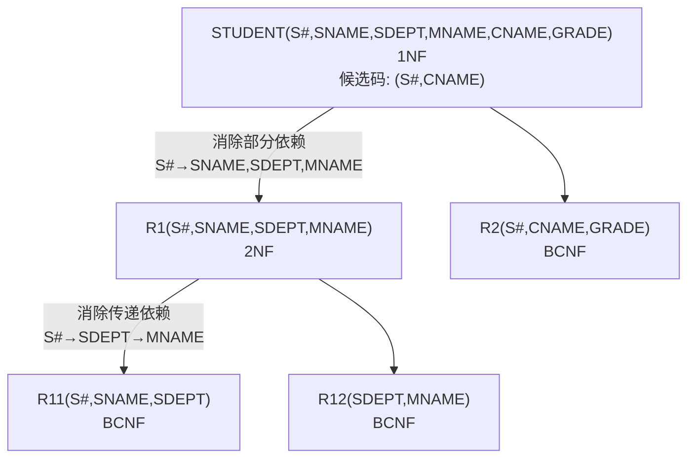

# 数据库原理期末综合试卷（试题四）

## 一、单项选择题

**题目1.** 数据库系统的特点是（ ）、数据独立、减少数据冗余、避免数据不一致和加强了数据保护。

A. 数据共享　B. 数据存储　C. 数据应用　D. 数据保密

> [!tip]- 答案
> **A. 数据共享**

---

**题目2.** 数据库系统中，物理数据独立性是指（ ）

A. 数据库与数据库管理系统的相互独立
B. 应用程序与 DBMS 的相互独立
C. 应用程序与存储在磁盘上数据库的物理模式是相互独立的
D. 应用程序与数据库中数据的逻辑结构相互独立

> [!tip]- 答案
> **C**
>
> 物理独立性由模式/内模式映像保证，内模式（存储结构）改变时应用程序不变。

---

**题目3.** 在数据库的三级模式结构中，描述数据库中全体数据的全局逻辑结构和特征的是（ ）

A. 外模式　B. 内模式　C. 存储模式　D. 模式

> [!tip]- 答案
> **D. 模式**

---

**题目4.** 关系模型的数据结构是（ ）

A. 层次结构　B. 二维表结构　C. 网状结构　D. 封装结构

> [!tip]- 答案
> **B. 二维表结构**

---

**题目5.** 关系模型中，一个候选码（ ）

A. 可由多个任意属性组成
B. 至多由一个属性组成
C. 可由一个或多个其值能唯一标识该关系模式中任何元组的属性组成
D. 必须由多个属性组成

> [!tip]- 答案
> **C**
>
> 候选码可由一个或多个属性组成，要求其值能唯一标识关系中的每个元组。

---

**题目6.** 自然连接是构成新关系的有效方法。一般情况下，当对关系 R 和 S 使用自然连接时，要求 R 和 S 含有一个或多个共有的（ ）

A. 元组　B. 行　C. 记录　D. 属性

> [!tip]- 答案
> **D. 属性**

---

**题目7.** 设关系 R 和 S 的属性个数分别是 2 和 3，那么 σ(1<2)(R × S) 等价于（ ）

A. σ(1<2)(R × S)　B. σ(1<4)(R × S)　C. σ(1<2)(R ⋈ S)　D. σ(1<4)(R ⋈ S)

> [!tip]- 答案
> **B. σ(1<4)(R × S)**
>
> R × S 后属性个数为 5，列编号 1~5。σ(1<2) 意为 R 的第 1 列 < S 的第 1 列（第 4 列），等价于 σ(1<4)。

---

**题目8.** SQL 语言具有（ ）的功能。

A. 关系规范化、数据操纵、数据控制
B. 数据定义、数据操纵、数据控制
C. 数据定义、关系规范化、数据控制
D. 数据定义、关系规范化、数据操纵

> [!tip]- 答案
> **B. 数据定义、数据操纵、数据控制**

---

**题目9.** 假定学生关系是 S（S#, SNAME, SEX, AGE），课程关系是 C（C#, CNAME, TEACHER），学生选课关系是 SC（S#, C#, GRADE）。要查找选修"COMPUTER"课程的"女"学生姓名，将涉及到关系（ ）

A. S　B. SC, C　C. S, SC　D. S, C, SC

> [!tip]- 答案
> **D. S, C, SC**
>
> 需要从 S 中筛选女生、从 C 中筛选课程名、从 SC 中关联选课记录，涉及三个关系。

---

**题目10.** 已知关系 SPJ(S#, P#, J#, QTY)，把对关系 SPJ 的属性 QTY 的修改权授予用户张三的 T-SQL 语句是（ ）

A. `GRANT QTY ON SPJ TO 张三`
B. `GRANT UPDATE ON SPJ TO 张三`
C. `GRANT UPDATE (QTY) ON SPJ TO 张三`
D. `GRANT UPDATE ON SPJ (QTY) TO 张三`

> [!tip]- 答案
> **C**
>
> GRANT 语法：`GRANT UPDATE (属性名) ON 表名 TO 用户名`。

---

**题目11.** 图1中（ ）是关系完备的系统

> [!note] 说明
> 原题此处插入图片"图1"，涉及 DBMS 分级示意图。关系完备的系统支持关系数据结构和所有关系操作（选择、投影、连接及集合运算），但不含完整的完整性约束和查询优化。

> [!tip]- 答案
> **C**

---

**题目12.** 在 R(U) 中，如果 X → Y，并且对于 X 的任何一个真子集 X'，都有 X' ↛ Y，则（ ）

A. Y 函数依赖于 X
B. Y 对 X 完全函数依赖
C. X 为 U 的候选码
D. R 属于 2NF

> [!tip]- 答案
> **B. Y 对 X 完全函数依赖**
>
> 完全函数依赖的定义：X → Y 且 X 的任何真子集都不能函数决定 Y。

---

**题目13.** 关系规范化中的插入操作异常是指（ ）

A. 不该删除的数据被删除
B. 不该插入的数据被插入
C. 应该删除的数据未被删除
D. 应该插入的数据未被插入

> [!tip]- 答案
> **D. 应该插入的数据未被插入**
>
> 插入异常 = 应该插入的数据因码约束无法插入。

---

**题目14.** 在数据库设计中，E-R 图产生于（ ）

A. 需求分析阶段　B. 物理设计阶段　C. 逻辑设计阶段　D. 概念设计阶段

> [!tip]- 答案
> **D. 概念设计阶段**

---

**题目15.** 在合并分 E-R 图时必须消除各分图中的不一致。各分 E-R 图之间的冲突主要有三类，即属性冲突、命名冲突和结构冲突，其中命名冲突是指（ ）

A. 命名太长或太短
B. 同名异义或同义异名
C. 属性类型冲突
D. 属性取值单位冲突

> [!tip]- 答案
> **B. 同名异义或同义异名**

---

**题目16.** 事务是数据库运行的基本单位。如果一个事务执行成功，则全部更新提交；如果一个事务执行失败，则已做过的更新被恢复原状，好像整个事务从未有过这些更新，这样保持了数据库处于（ ）状态。

A. 安全性　B. 一致性　C. 完整性　D. 可靠性

> [!tip]- 答案
> **B. 一致性**
>
> 事务的 ACID 特性中，原子性保证要么全做要么全不做，从而保持数据库从一致状态到一致状态。

---

**题目17.** （ ）用来记录对数据库中数据进行的每一次更新操作。

A. 后援副本　B. 日志文件　C. 数据库　D. 缓冲区

> [!tip]- 答案
> **B. 日志文件**

---

**题目18.** 若事务 T 对数据对象 A 加上 S 锁，则（ ）

A. 事务 T 可以读 A 和修改 A，其它事务只能再对 A 加 S 锁，而不能加 X 锁。
B. 事务 T 可以读 A 但不能修改 A，其它事务能对 A 加 S 锁和 X 锁。
C. 事务 T 可以读 A 但不能修改 A，其它事务只能再对 A 加 S 锁，而不能加 X 锁。
D. 事务 T 可以读 A 和修改 A，其它事务能对 A 加 S 锁和 X 锁。

> [!tip]- 答案
> **C**
>
> S 锁（共享锁）：持锁事务可读不可写，其他事务只能加 S 锁不能加 X 锁。

---

**题目19.** 设有两个事务 T1、T2，其并发操作如下：

> T1：read(A)；read(B)；sum=A+B
> T2：read(A)；A=A*2；write(A)
> T1：read(A)；read(B)；sum=A+B；write(A+B)

A. 该操作不存在问题
B. 该操作丢失修改
C. 该操作不能重复读
D. 该操作读"脏"数据

> [!tip]- 答案
> **C. 该操作不能重复读**
>
> T1 第一次读 A 后，T2 修改了 A 并写回，T1 第二次读 A 得到不同值，属于不可重复读。

---

**题目20.** 已知事务 T1 的封锁序列为：`LOCK S(A) … LOCK S(B) … LOCK X(C) … UNLOCK(B) … UNLOCK(A) … UNLOCK(C)`

事务 T2 的封锁序列为：`LOCK S(A) … UNLOCK(A) … LOCK S(B) … LOCK X(C) … UNLOCK(C) … UNLOCK(B)`

则遵守两段封锁协议的事务是（ ）

A. T1　B. T2　C. T1 和 T2　D. 没有

> [!tip]- 答案
> **A. T1**
>
> T1：所有加锁（S(A), S(B), X(C)）在所有释放锁之前完成，满足两段锁协议。
> T2：Unlock(A) 后又 Lock S(B), Lock X(C)，违反两段锁协议。

---

## 二、填空题

**题目21.** 数据管理经历了人工管理、文件系统、________ 三个阶段。

> [!tip]- 答案
> **数据库系统**

**题目22.** 数据模型由数据结构、数据操作和 ________ 三部分组成。

> [!tip]- 答案
> **完整性约束**

**题目23.** 在 Student 表的 Sname 列上建立一个聚簇索引的 SQL 语句为：CREATE ________ Stusname ON student(Sname)

> [!tip]- 答案
> **CLUSTER INDEX**

**题目24.** SELECT 语句查询条件中的谓词 "=ANY" 与运算符 ________ 等价。

> [!tip]- 答案
> **IN**

**题目25.** 关系模式 R({A, B, C}, {(A,C) → B, (A,B) → C, B → C}) 最高可达到第 ________ 范式。

> [!tip]- 答案
> **3**
>
> 候选码：(A,C) 和 (A,B)。所有属性都是主属性。B → C 中 B 是主属性，不违反 3NF（3NF 允许主属性对候选码的传递依赖），但违反 BCNF（B 不是候选码）。故最高为 3NF。

**题目26.** 数据抽象主要有分类和 ________ 两种。

> [!tip]- 答案
> **聚集**

**题目27.** 存在一个等待事务集 {T0, T1, ..., Tn}，其中 T0 正等待被 T1 锁住的数据项，T1 正等待被 T2 锁住的数据项，Tn-1 正等待被 Tn 锁住的数据项，且 Tn 正等待被 T0 锁住的数据项，这种情形称为 ________。

> [!tip]- 答案
> **死锁**

**题目28.** "为哪些表，在哪些字段上，建立什么样的索引"这一设计内容应该属于数据库设计中的 ________ 设计阶段。

> [!tip]- 答案
> **物理**

**题目29.** 并发控制的主要方法是 ________ 机制。

> [!tip]- 答案
> **封锁**

**题目30.** 故障分为事务故障、________ 和介质故障三种。

> [!tip]- 答案
> **系统故障**

---

## 三、简答题

### 题目31. 简述等值连接与自然连接的区别和联系

> [!note] 参考答案
> 连接运算符是 `=` 的连接运算称为**等值连接**。它是从关系 R 与 S 的广义笛卡尔积中选取 A、B 属性值相等的那些元组：
> R ⋈(A=B) S = {tr ts | tr ∈ R ∧ ts ∈ S ∧ tr[A] = ts[B]}
>
> **自然连接**是一种特殊的等值连接，它要求两个关系中进行比较的分量必须是相同的属性组，并且在结果中把重复的属性列去掉。
>
> 区别：等值连接不要求比较的属性相同，结果保留所有列；自然连接要求比较相同属性组，结果去掉重复列。

### 题目32. 说明视图与基本表的区别和联系

> [!note] 参考答案
> 视图是从一个或几个基本表导出的表，它与基本表不同，是一个**虚表**。数据库中只存放视图的定义，而不存放视图对应的数据，这些数据存放在原来的基本表中。当基本表中的数据发生变化，从视图中查询出的数据也就随之改变。
>
> 视图一经定义就可以像基本表一样被查询、删除，也可以在一个视图之上再定义新的视图，但是对视图的更新操作有限制。

### 题目33. 简述事务的特性

> [!note] 参考答案
> 事务具有四个特性，即 **ACID** 特性：
>
> 1. **原子性（Atomicity）**：事务中包括的所有操作要么都做，要么都不做。
> 2. **一致性（Consistency）**：事务必须使数据库从一个一致性状态变到另一个一致性状态。
> 3. **隔离性（Isolation）**：一个事务内部的操作及使用的数据对并发的其他事务是隔离的。
> 4. **持续性（Durability）**：事务一旦提交，对数据库的改变是永久的。


---

## 四、设计题

### 题目34. 工程供应数据库

> [!example] 题目
> 设有一个工程供应数据库系统，包括如下四个关系模式：
> - S(Sno, Sname, Status, City) — 供应商表
> - P(Pno, Pname, Color, Weight) — 零件表
> - J(Jno, Jname, City) — 工程项目表
> - SPJ(Sno, Pno, Jno, Qty) — 供应情况表
>
> (1) 用关系代数查询没有使用天津供应商生产的红色零件的工程号
> (2) 用关系代数查询至少使用了供应商 S1 所供应的全部零件的工程号 JNO
> (3) 用 ALPHA 语言查询供应工程 J1 零件为红色的供应商号 SNO
> (4) 用 T-SQL 语句建立"供应商" S 表（主码必须定义）
> (5) 用 SQL 查询工程 J1 使用的各种零件的名称和使用数量
> (6) 用 SQL 查询没有使用天津供应商生产的零件的工程号
> (7) 用 SQL 语句将全部红色零件改为蓝色
> (8) 用 SQL 语句将 (S2, P4, J6, 400) 插入供应情况关系

> [!note]- 参考答案
> **(1)**
> ΠJNO(J) - ΠJNO(σ(CITY='天津')(S) ⋈ SPJ ⋈ σ(COLOR='红')(P))
>
> **(2)**
> Π(PNO, JNO)(SPJ) ÷ ΠPNO(σ(SNO='S1')(SPJ))
>
> **(3)** ALPHA 语言：
> ```
> RANGE P PX
> GET W (SPJ.Sno): SPJ.Jno='J1' ∧ PX(SPJ.Pno=PX.Pno ∧ PX.Color='红')
> ```
>
> **(4)**
> ```sql
> CREATE TABLE S (
>     Sno    CHAR(6) PRIMARY KEY,
>     Sname  CHAR(10),
>     Status INT,
>     City   CHAR(20)
> );
> ```
>
> **(5)**
> ```sql
> SELECT Pname, TotalQty
> FROM (
>     SELECT Pno, SUM(Qty) AS TotalQty
>     FROM SPJ
>     WHERE Jno = 'J1'
>     GROUP BY Pno
> ) X, P
> WHERE P.Pno = X.Pno;
> ```
>
> **(6)**
> ```sql
> SELECT Jno
> FROM J
> WHERE Jno NOT IN
>     (SELECT Jno
>      FROM SPJ
>      WHERE Sno IN
>          (SELECT Sno
>           FROM S
>           WHERE City = '天津'));
> ```
>
> 或等价的 `NOT EXISTS` 写法：
> ```sql
> SELECT Jno
> FROM J
> WHERE NOT EXISTS
>     (SELECT * FROM SPJ, S
>      WHERE SPJ.Sno = S.Sno
>        AND SPJ.Jno = J.Jno
>        AND City = '天津');
> ```
>
> **(7)**
> ```sql
> UPDATE P SET Color = '蓝' WHERE Color = '红';
> ```
>
> **(8)**
> ```sql
> INSERT INTO SPJ VALUES('S2', 'P4', 'J6', 400);
> ```

---

### 题目35. 关系规范化

> [!example] 题目
> 设有关系 STUDENT(S#, SNAME, SDEPT, MNAME, CNAME, GRADE)，(S#, CNAME) 为候选码，设关系中有如下函数依赖：
> - (S#, CNAME) → SNAME, SDEPT, MNAME
> - S# → SNAME, SDEPT, MNAME
> - (S#, CNAME) → GRADE
> - SDEPT → MNAME
>
> (1) 关系 STUDENT 属于第几范式？
> (2) 如果关系 STUDENT 不属于 BCNF，请将关系 STUDENT 逐步分解为 BCNF。要求：写出达到每一级范式的分解过程，并指明消除什么类型的函数依赖。

> [!note]- 参考答案
> **(1)** 关系 STUDENT 是 **1NF**。
>
> 因为 F 中存在非主属性 SNAME、SDEPT、MNAME 对候选码 (S#, CNAME) 的**部分函数依赖**（S# → SNAME, SDEPT, MNAME）。
>
> **(2) 逐步分解：**
>
> **第一步：消除部分函数依赖（1NF → 2NF）**
>
> 将关系分解为：
> - R1(S#, SNAME, SDEPT, MNAME) — 候选码 S#，F1 = {S# → SNAME, SDEPT, MNAME, SDEPT → MNAME}
> - R2(S#, CNAME, GRADE) — 候选码 (S#, CNAME)，F2 = {(S#, CNAME) → GRADE}
>
> **第二步：消除传递函数依赖（2NF → 3NF）**
>
> 在 R1 中存在非主属性 MNAME 对候选码 S# 的传递函数依赖：S# → SDEPT → MNAME，将 R1 进一步分解：
> - R11(S#, SNAME, SDEPT) — 候选码 S#，F11 = {S# → SNAME, SDEPT}
> - R12(SDEPT, MNAME) — 候选码 SDEPT，F12 = {SDEPT → MNAME}
>
> 在 R2、R11、R12 中函数依赖都是非平凡的，并且决定因素均是候选码，故上述三个关系模式均为 **BCNF**。



---

### 题目36. E-R图设计与关系模式转换

> [!example] 题目
> 某医院病房管理系统中，包括四个实体型，分别为：
> - 科室：科名，科地址，科电话
> - 病房：病房号，病房地址
> - 医生：工作证号，姓名，职称，年龄
> - 病人：病历号，姓名，性别
>
> 且存在如下语义约束：
> ① 一个科室有多个病房、多个医生；一个病房只能属于一个科室，一个医生只属于一个科室
> ② 一个医生可负责多个病人的诊治，一个病人的主管医生只有一个
> ③ 一个病房可入住多个病人，一个病人只能入住在一个病房
>
> 注意：不同科室可能有相同的病房号。
>
> 完成如下设计：
> (1) 画出该医院病房管理系统的 E-R 图
> (2) 将该 E-R 图转换为关系模型（要求：1:1 和 1:n 的联系进行合并）
> (3) 指出转换结果中每个关系模式的主码和外码

> [!note]- 参考答案
> **(1) E-R 图**
>
> ```mermaid
> graph LR
>     DEPT["科室<br/>(科名, 科地址, 科电话)"] ---|组成 1:n| WARD["病房<br/>(病房号, 病房地址)"]
>     DEPT ---|拥有 1:n| DOCTOR["医生<br/>(工作证号, 姓名, 职称, 年龄)"]
>     DOCTOR ---|诊治 1:n| PATIENT["病人<br/>(病历号, 姓名, 性别)"]
>     WARD ---|入住 1:n| PATIENT
> ```

> [!note] 实体与联系说明
> 实体：科室、病房、医生、病人
> 联系：
> - **组成**：科室 `1 ── n` 病房：一个科室包含多个病房，一个病房仅属于一个科室
> - **拥有**：科室 `1 ── n` 医生：一个科室多名医生，一名医生归属一个科室
> - **入住**：病房 `1 ── n` 病人：一间病房多名病人，一个病人住一间病房
> - **诊治**：医生 `1 ── n` 病人：一位医生负责多名病人，一个病人主管医生唯一
>
> 注意：不同科室可能有相同的病房号，因此病房的主码需要包含科名。

> **(2) 转换后的关系模式：**
>
> | 关系模式 | 属性 | 主码 | 外码 |
> |---------|------|------|------|
> | 科室 | 科名，科地址，科电话 | 科名 | — |
> | 病房 | 病房号，病房地址，科名 | (科名, 病房号) | 科名→科室 |
> | 医生 | 工作证号，姓名，职称，年龄，科名 | 工作证号 | 科名→科室 |
> | 病人 | 病历号，姓名，性别，主管医生，病房号，科名 | 病历号 | (科名, 病房号)→病房；工作证号→医生 |
