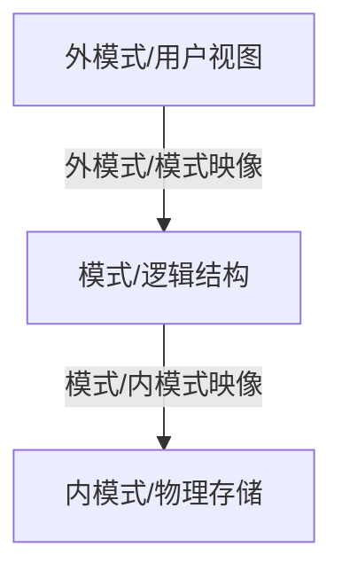

# 数据库综合复习题

## 一、单选题

### 第一组

**1. 对全局数据视图的描述称为（ ）。**

A. 模式　B. 内模式　C. 存储模式　D. 外模式

> [!tip]- 答案
> **A. 模式**

---

**2. 数据库系统中，物理数据独立性是指（ ）。**

A. 外模式改变不影响模式　B. 模式改变不影响应用程序　C. 模式改变不影响内模式　D. 内模式改变不影响应用程序

> [!tip]- 答案
> **D. 内模式改变不影响应用程序**

---

**3. 实现关系代数选择运算的SQL子句是（ ）。**

> [!tip]- 答案
> **D. WHERE**

---

**4. 有如下4条SQL语句：①CREATE TABLE ②CREATE VIEW ③COMMIT ④GRANT，其中具有安全性控制功能的是（ ）。**

> [!tip]- 答案
> **D. ②和④**
>
> CREATE VIEW 可配合授权隐藏机密数据，GRANT 是授权语句。

---

**5. 设有关系R（书号，书名），检索第3个字母为M、且至少包含4个字母的书名，WHERE条件应写成：书名 LIKE（ ）。**

> [!tip]- 答案
> **C. `'_M%'`**

---

**6. 关系模式设计理论主要解决的问题是（ ）。**

> [!tip]- 答案
> **A. 插入异常、删除异常和数据冗余**

---

**7. 建立索引属于数据库的（ ）。**

> [!tip]- 答案
> **C. 物理结构设计**

---

**8. 学生选课数据库中存在选课记录（S9，C2，100），而学生表中不存在S9，说明（ ）。**

> [!tip]- 答案
> **B. 数据的参照完整性未受到保护**

---

**9. 关系模式R（A，B，C）中，F={（A，B）→C，B→C}，则R最高达到（ ）。**

> [!tip]- 答案
> **A. 1NF**
>
> 码为 (A,B)，存在非主属性 C 对码的部分依赖 B→C，不满足 2NF。

---

**10. 关于触发器的说法不正确的是（ ）。**

> [!tip]- 答案
> **D. 执行触发器与执行存储过程一样需要调用**
>
> 触发器由事件自动激活，不需显式调用。

---

**11. 实体完整性规则是对（ ）的约束，参照完整性规则是对（ ）的约束。**

> [!tip]- 答案
> **B. 主码、外码**

---

**12. 数据库的并发操作通常会带来的3类问题，即（ ）。**

> [!tip]- 答案
> **A. 丢失修改、不可重复读和读脏数据**

---

### 第二组

**1. 数据库系统与文件系统的根本区别在于（ ）。**

> [!tip]- 答案
> **C. 数据整体结构化**

---

**2. 一个25岁的工人有35年工龄，说明（ ）。**

> [!tip]- 答案
> **B. 数据的完整性未受到保护**

---

**3. 在用于表示两个实体间联系的关系中，用来表示实体间联系的是（ ）。**

> [!tip]- 答案
> **D. 外部关键字（外码）**

---

**4. 关系中任意两个元组的内容（ ）。**

> [!tip]- 答案
> **B. 可以部分相同（主码值不能全部相同）**

---

**5. 在一个关系中，非主属性的个数（ ）。**

> [!tip]- 答案
> **A. 可以为零**

---

**6. 实现关系代数选择运算的SQL子句是（ ）。**

> [!tip]- 答案
> **D. WHERE**

---

**7. 对关系代数表达式的查询树进行优化的启发式规则，哪个说法不正确？**

> [!tip]- 答案
> **D. 选择不能和笛卡尔积结合起来**
>
> 恰恰应把选择与其前的笛卡尔积结合成连接运算。

---

**8. DBMS中实现事务持久性的子系统是（ ）。**

> [!tip]- 答案
> **D. 恢复管理子系统**

---

**9. 对于并发操作带来的数据不一致性，二级封锁协议可以防止（ ）。**

> [!tip]- 答案
> **C. 丢失修改、读"脏"数据**
>
> 一级防丢失修改；二级 = 一级 + 防读脏数据；三级再防不可重复读。

---

### 第三组

**1. 查询至少选修了学号为'200215121'的同学选修的全部课程的学生姓名，以下说法错误的是（ ）。**

> [!tip]- 答案
> **B. SQL语句需用除运算实现该查询中的逻辑蕴含**
>
> SQL 中没有除运算，需用两层 `NOT EXISTS` 实现逻辑蕴涵。

---

**2. 下列选项中，（ ）不是数据库并发操作可能带来的三个问题。**

> [!tip]- 答案
> **A. 缓冲区溢出**

---

## 二、填空题

**1.** DBMS在进行参照完整性的违约处理时有三种方案，分别是______、______和______。

> [!tip]- 答案
> **拒绝执行**、**级联操作（删除/修改）**、**设置空值**

---

## 三、简答题

### 1. 参照完整性中，为什么外码值可以为空？什么情况下可为空？

> [!note] 参照完整性规则
> 若属性（组）F是关系R的外码，它与关系S的主码K相对应，则F的每个值或者取空值，或者等于S中某个元组的主码值。

外码取空值的语义是"该参照暂时不明确或不适用"。例如学生-专业关系中，若"专业号"是学生表的外码，一个新生尚未分配专业时，其专业号就可以取空值，表示"等待重新选择专业"。

**可为空的条件：**

1. 外码不是本关系的主属性——因为实体完整性要求主码（主属性）不能取空值。如SC表的主码是 (Sno, Cno)，Sno、Cno 作为外码也不能取空值。
2. 现实应用语义允许该参照暂时为空。

### 2. 所有视图是否都可以更新？为什么？

不是所有视图都可以更新。视图更新的实质是通过视图消解转换为对基本表的更新，而有些视图无法做这种有意义的转换。

- 一般地，**行列子集视图**（从单个基本表导出、只去掉某些行和列但保留主码）是可更新的。
- 包含聚集函数、`GROUP BY` 子句、`DISTINCT` 短语的视图，以及由多表连接导出的视图，通常不可更新。例如 `S_GradeAVG` 视图中的平均成绩是分组计算得来的，系统无法把"修改某学生平均成绩为90"转换为对基本表SC中各科成绩的修改。

> [!warning] 注意区分
> - **不可更新的视图**：指理论上已证明不可更新。
> - **不允许更新的视图**：指具体系统不支持其更新，但本身有可能是可更新的视图。

### 3. 试述数据库设计的各个阶段。

数据库设计分为六个阶段：

1. **需求分析**：收集和分析用户对数据与处理的需求，形成数据字典和数据流图。
2. **概念结构设计**：将需求抽象为独立于DBMS的概念模型，常用E-R模型。
3. **逻辑结构设计**：把概念模型（E-R图）转换为具体DBMS支持的数据模型（如关系模式），并优化。
4. **物理结构设计**：为逻辑数据模型选取合适的物理结构与存取方法（如索引、存储结构）。
5. **数据库实施**：建立数据库、装载数据、编制与调试应用程序、试运行。
6. **数据库运行和维护**：正式运行后进行维护，包括转储恢复、性能监控与调整、数据库重组与重构。

### 4. 登记日志文件时为什么必须先写日志文件，后写数据库？

这是"先写日志"（Write-Ahead Logging，WAL）原则。写日志文件和写数据库是两个独立的操作，两者之间可能发生故障：

- 如果**先修改数据库、后写日志**，而系统在写完数据库后、写日志前发生故障，则这次修改没有留下日志记录，恢复系统无法得知该修改，无法对其进行 UNDO，导致数据库处于不一致状态。
- 如果**先写日志、后写数据库**，即使写库时发生故障，日志中已有完整记录，恢复时可以根据日志重做（REDO）已提交事务或撤销（UNDO）未提交事务，保证数据库的一致性。

> [!warning] 结论
> 必须先写日志文件，后写数据库，以保证事务的**原子性**和**持久性**。

### 5. 说明数据库中逻辑独立性和物理独立性的含义。

数据独立性由数据库的**三级模式两级映像**结构保证：

- **物理独立性**：指用户的应用程序与数据库中数据的物理存储相互独立。当内模式（存储结构）改变时，如改变存储设备或索引方式，由DBA调整**模式/内模式映像**，使模式保持不变，从而应用程序不必改变。
- **逻辑独立性**：指用户的应用程序与数据库的逻辑结构相互独立。当模式（逻辑结构）改变时，如增加新的关系或属性，由DBA调整**外模式/模式映像**，使用户的外模式保持不变，从而基于外模式的应用程序不必修改。
