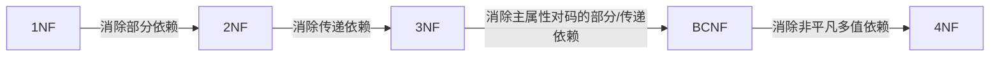

# 数据库原理复习题6（关系数据理论专题，附答案）

## 一、单项选择题

**1. 已知关系模式R（A，B，C，D，E）及函数依赖集F＝{A→D，B→C，E→A}，候选关键字是（ ）。**

> [!tip]- 答案
> **BE**
>
> B、E不出现在任何依赖右部，必含于码中；BE的闭包 = {B, E, A, D, C} = U ✓

---

**2. 关系R（SNO，CNO，SSEX，SAGE，SDPART，SCORE）主键为SNO和CNO（SSEX、SAGE等只依赖SNO），其满足（ ）。**

> [!tip]- 答案
> **1NF**
>
> 存在非主属性对码的部分依赖，不满足2NF。

---

**3. 关系模式W（C课程，P教师，S学生，G成绩，T时间，R教室），D={C→P，（S,C）→G，（T,R）→C，（T,P）→R，（T,S）→R}，W的一个关键字是（ ）。**

> [!tip]- 答案
> **（T，S）**

---

**4. 关系模式中，满足2NF的模式（ ）。**

> [!tip]- 答案
> **必定是1NF**

---

**5. 关系模式R中的属性全是主属性，则R的最高范式必定是（ ）。**

> [!tip]- 答案
> **3NF**

---

**6. 消除了部分函数依赖的1NF关系模式，必定是（ ）。**

> [!tip]- 答案
> **2NF**

---

**7. 如果A→B，那么属性A和属性B的联系是（ ）。**

> [!tip]- 答案
> **多对一**

---

**8. 关系模式的候选关键字可以有1个或多个，而主关键字有（ ）。**

> [!tip]- 答案
> **1个**

---

**9. 候选关键字的属性可以有（ ）。**

> [!tip]- 答案
> **1个或多个**

---

**10. 将W分解为W1（C，P）、W2（S，C，G）、W3（S，T，R，C），W1的规范化程度最高达到（ ）。**

> [!tip]- 答案
> **BCNF**

---

**11. 在关系数据库中，任何二元关系模式的最高范式必定是（ ）。**

> [!tip]- 答案
> **BCNF**

---

**12. 不能使一个关系从1NF转化为2NF的条件是（ ）。**

> [!tip]- 答案
> **每一个非主属性都部分函数依赖主属性**

---

**13. 任何一个满足2NF但不满足3NF的关系模式都不存在（ ）。**

> [!tip]- 答案
> **非主属性对键的部分依赖**
>
> 2NF已消除部分依赖；不满足3NF说明仍存在非主属性对键的传递依赖。

---

**14. 关于多值依赖的叙述中，不正确的是（ ）。**

> [!tip]- 答案
> **若X→→Y，且Y′⊆Y，则X→→Y′**
>
> 多值依赖无此子集性质；其余三条均为多值依赖的正确性质/规则。

---

**15. 若关系模式R（U，F）属于3NF，则（ ）。**

> [!tip]- 答案
> **仍存在一定的插入和删除异常**

---

**16. 下列说法不正确的是（ ）。**

> [!tip]- 答案
> **任何一个包含三个属性的关系模式一定满足3NF**
>
> 二元关系必满足3NF和BCNF；三属性关系不保证3NF。

---

**17. 设R（A，B，C），F＝{B→C}，分解ρ＝{AB，BC}相对于F（ ）。**

> [!tip]- 答案
> **是无损连接，也保持FD的分解**

---

**18. 关系数据库规范化是为了解决关系数据库中（ ）的问题而引入的。**

> [!tip]- 答案
> **插入、删除异常和数据冗余**

---

**19. 各个范式之间的关系是（ ）。**

> [!tip]- 答案
> **1NF⊃2NF⊃3NF**（满足高一级范式的关系必然满足低一级范式）

---

**20. 数据库中的冗余数据是指可（ ）的数据。**

> [!tip]- 答案
> **由基本数据导出**

---

**21. 学生表（id，name，sex，age，depart_id，depart_name），依赖：id→name,sex,age,depart_id；depart_id→depart_name，满足（ ）。**

> [!tip]- 答案
> **2NF**
>
> 码为id单属性，无部分依赖；但depart_name传递依赖于id，不满足3NF。

---

**22. R（S，D，M），F＝{S→D，D→M}，最高达到（ ）。**

> [!tip]- 答案
> **2NF**（存在传递依赖S→D→M）

---

**23. R（A，B，C，D），F＝{（A，B）→C，C→D}，最高达到（ ）。**

> [!tip]- 答案
> **2NF**
>
> 码为(A,B)，无部分依赖故是2NF；但D传递依赖于码，不是3NF。

---

**24. 关于函数依赖的叙述，不正确的是（ ）。**

> [!tip]- 答案
> **由X→YZ，则X→Y，Y→Z**
>
> X→YZ可分解出X→Y和X→Z，但推不出Y→Z。

---

**25. X→Y，当下列哪一条成立时称为平凡的函数依赖？（ ）**

> [!tip]- 答案
> **Y⊆X**

---

**26. 部门（部门号，部门名，部门成员，部门总经理）关系中，因哪个属性而不满足1NF？（ ）**

> [!tip]- 答案
> **部门成员**（成员为多值，属性可再分）

---

**27. 关系模式A（C课程，T教员，H上课时间，R教室，S学生），F={C→T，（H,R）→C，（H,T）→R，（H,S）→R}：（1）A的码是（ ）。**

> [!tip]- 答案
> **（H，S）**

---

**28. （2）A的规范化程度最高达到（ ）。**

> [!tip]- 答案
> **2NF**

---

**29. （3）分解为A1（C，T）、A2（H，R，S），A1的规范化程度达到（ ）。**

> [!tip]- 答案
> **BCNF**

---

**30. 规范化理论要求关系中的每一个属性都是（ ）。**

> [!tip]- 答案
> **不可分解的**

---

## 二、填空题

**1.** 设计性能较优的关系模式称为规范化，规范化主要的理论依据是______。

> [!tip]- 答案
> **关系规范化理论**

**2.** 删除操作异常是指______，插入操作异常是指______。

> [!tip]- 答案
> **不该被删除的数据被删除了**；**应该插入的数据不能被插入**

**3.** 规范化过程主要为克服数据库逻辑结构中的插入异常、删除异常以及______的缺陷。

> [!tip]- 答案
> **冗余度大**

**4.** 关系模式的任何属性都是______。

> [!tip]- 答案
> **不可再分的基本数据项**

**5.** 关系模型中的关系模式至少是______。

> [!tip]- 答案
> **1NF**

**6.** 任何二元关系模式的最高范式必定是______。

> [!tip]- 答案
> **BCNF**

**7.** 候选关键字中的属性称为______。

> [!tip]- 答案
> **主属性**

**8.** 消除了部分函数依赖的1NF关系模式，必定是______。

> [!tip]- 答案
> **2NF**

**9.** 在关系A（S，SN，D）和B（D，CN，NM）中，A的主键是S，B的主键是D，则D在A中称为______。

> [!tip]- 答案
> **外部键/外码**

**10.** 非规范化模式经过______转变为1NF，1NF经过______转变为2NF，2NF经过______转变为3NF。

> [!tip]- 答案
> ① **使属性域变为简单域**；② **消除非主属性对主关键字的部分依赖**；③ **消除非主属性对主关键字的传递依赖**

**11.** 执行"分解"时必须遵守的规范化原则：______、______。

> [!tip]- 答案
> ① **保持原有的依赖关系**；② **无损连接性**

---

## 三、问答题

### 1. 理解并给出下列术语的定义

> [!definition] 函数依赖
> 设R(U)是关系模式，U是R的属性集合，X、Y是U的子集。对于R(U)的任意一个可能的关系r，如果r中不存在两个元组在X上取值相同而在Y上取值不同，则称"X函数确定Y"或"Y函数依赖于X"，记作X→Y。
>
> 注意：函数依赖反映现实世界的语义约束，是R任何时刻的一切关系均要满足的条件，而非某个时刻的取值巧合。

> [!definition] 平凡的函数依赖
> 若X→Y，且 **Y⊆X**，则称X→Y是平凡的函数依赖（任何关系都必然满足）。

> [!definition] 非平凡的函数依赖
> 若X→Y，但 **Y⊄X**，则称X→Y是非平凡的函数依赖。

> [!definition] 完全函数依赖
> 在R(U)中，如果X→Y，并且对于X的任何一个真子集X′，都有X′↛Y，则称Y对X完全函数依赖。

> [!definition] 部分函数依赖
> 若X→Y，但Y不完全函数依赖于X（即X的某个真子集也能决定Y），则称Y对X部分函数依赖。

> [!definition] 候选码
> 设K为R(U,F)中的属性或属性组，若K→U（完全函数依赖），则K为R的候选码。

> [!definition] 主码
> 候选码多于一个时，选定其中的一个为主码。

> [!definition] 外码
> 关系模式R中属性或属性组X并非R的码，但X是另一个关系模式的码，则称X是R的外部码（外码）。

> [!definition] 全码
> 整个属性组都是码，称为全码（All-key）。

> [!warning] 勘误
> 原卷答案中"平凡/非平凡函数依赖"两条定义写反了，以上已按教材更正：**Y⊆X为平凡，Y⊄X为非平凡**。

### 2. 建立关于系、学生、班级、学会的关系数据库

**关系模式：**

- 学生 S（S#，SN，SB，DN，C#，SA）——学号、姓名、出生年月、系名、班号、宿舍区
- 班级 C（C#，CS，DN，CNUM，CDATE）——班号、专业名、系名、班级人数、入校年份
- 系 D（D#，DN，DA，DNUM）——系号、系名、系办公室地点、系人数
- 学会 P（PN，DATE1，PA，PNUM）——学会名、成立年份、地点、人数
- 学生-学会 SP（S#，PN，DATE2）——DATE2为入会年份

**极小函数依赖集：**

| 关系 | 函数依赖 |
|------|---------|
| S | S#→SN，S#→SB，S#→C#，C#→DN，DN→SA |
| C | C#→CS，C#→CNUM，C#→CDATE，CS→DN，(CS,CDATE)→C# |
| D | D#→DN，DN→D#，D#→DA，D#→DNUM |
| P | PN→DATE1，PN→PA，PN→PNUM |
| SP | (S#，PN)→DATE2（完全函数依赖） |

> [!note] 传递依赖分析
> - S中存在传递依赖：S#→DN，DN→SA
> - C中存在传递依赖：C#→CS→DN

| 关系 | 候选码 | 外码 | 全码 |
|------|--------|------|------|
| S | S# | C#，DN | 无 |
| C | C#，(CS,CDATE) | DN | 无 |
| D | D# 和 DN | 无 | 无 |
| P | PN | 无 | 无 |
| SP | (S#，PN) | S#，PN | 无 |

---

## 四、论述题

### 1. 商业集团数据库

> [!example] 题目
> 商业集团数据库 R（商店编号，商品编号，数量，部门编号，负责人），规定：
> - 每个商店的每种商品只在一个部门销售
> - 每个商店的每个部门只有一个负责人
> - 每个商店的每种商品只有一个库存数量

**（1）基本函数依赖：**

- （商店编号，商品编号）→ 部门编号
- （商店编号，部门编号）→ 负责人
- （商店编号，商品编号）→ 数量

**（2）候选码：**（商店编号，商品编号，部门编号）

**（3）最高为 1NF。**

> [!note] 分析
> 非主属性（数量、负责人）对码的函数依赖均为部分函数依赖（如数量只依赖商店编号+商品编号），所以不属于2NF。

消除部分依赖分解为 2NF：

| 子关系 | 属性 |
|-------|------|
| R1 | 商店编号，商品编号，部门编号，数量 |
| R2 | 商店编号，部门编号，负责人 |

**（4）分解为 3NF：** 即上述R1、R2，分解后不存在非主属性对码的传递依赖，故R1、R2均已是3NF。

---

### 2. 学生关系模式

> [!example] 题目
> 学生关系模式 S（Sno，Sname，SD，Sdname，Course，Grade）

**（1）基本函数依赖：** Sno→Sname，Sno→SD，SD→Sdname，(Sno，Course)→Grade

**主码：**（Sno，Course）

**（2）原模式是 1NF：**

> [!note] 分析
> 码为(Sno，Course)，Grade完全依赖于码，但Sname、SD、Sdname只依赖于Sno（部分依赖），不满足2NF。

消除部分依赖分解为 2NF：

| 子关系 | 属性 |
|-------|------|
| S1 | Sno，Sname，SD，Sdname |
| S2 | Sno，Course，Grade |

**（3）分解为 3NF：**

> [!note] 分析
> S1中存在Sno→SD、SD→Sdname，即Sdname传递依赖于Sno，不是3NF，继续分解：

| 子关系 | 属性 |
|-------|------|
| S11 | Sno，Sname，SD |
| S12 | SD，Sdname |
| S2 | Sno，Course，Grade |

分解后S11、S12、S2均满足3NF。

---

### 3. 关系 R（课程名，教师名，教师地址）

**（1）是 2NF：**

> [!note] 分析
> 候选码为课程名；依赖为课程名→教师名、教师名→课程名、教师名→教师地址，从而课程名→教师地址——存在非主属性"教师地址"对候选码的传递函数依赖，故R不是3NF；但不存在非主属性对候选码的部分函数依赖，故是2NF。

**（2）存在删除操作异常：** 当删除某门课程时，会连带删除不该删除的教师的有关信息。

**（3）分解为高一级范式：**

| 子关系 | 属性 |
|-------|------|
| R1 | 课程名，教师名 |
| R2 | 教师名，教师地址 |

> [!tip] 结果
> 分解后，删除课程数据时仅对R1操作，教师地址信息保留在R2中不会丢失，从而解决了删除异常问题。
