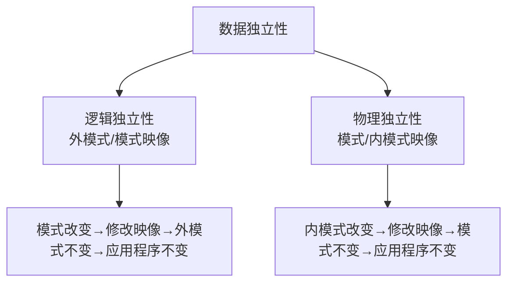
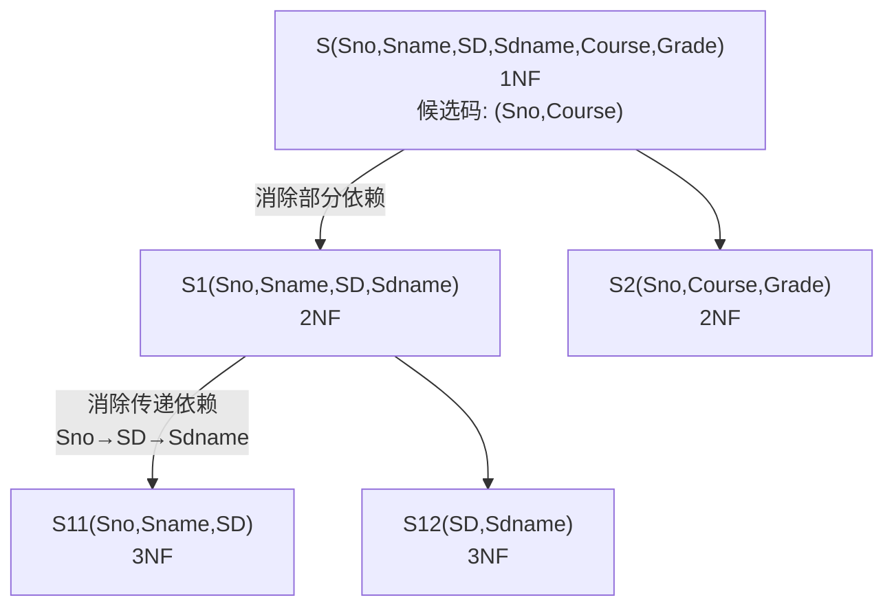
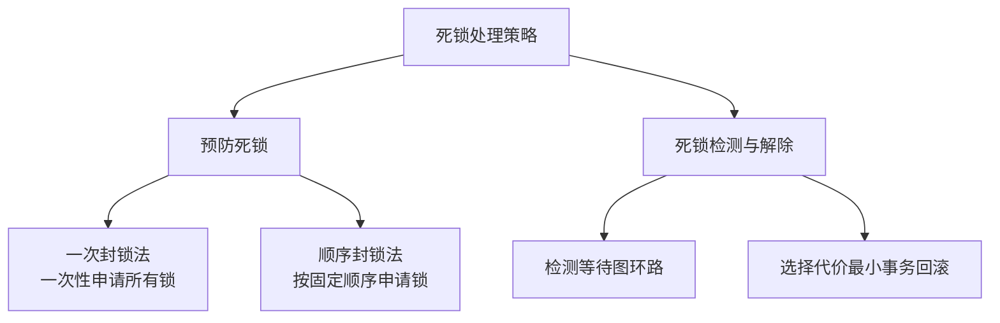

# 数据库原理综合复习题库

## 第一部分 分章节题库

---

## 第1章 数据库系统概论

### 题目1

**【单项选择题】** 在数据管理技术的发展过程中，经历了人工管理阶段、文件系统阶段和数据库系统阶段。在这几个阶段中，数据独立性最高的是（）阶段。

A. 数据库系统　B. 文件系统　C. 人工管理　D. 数据项管理

> [!tip]- 答案
> **A. 数据库系统**

---

### 题目2

**【单项选择题】** 数据库的概念模型独立于（）。

A. 具体的机器和 DBMS　B. E-R 图　C. 信息世界　D. 现实世界

> [!tip]- 答案
> **A. 具体的机器和 DBMS**
>
> 概念模型独立于具体的机器和 DBMS，是现实世界到信息世界的第一层抽象。

---

### 题目3

**【单项选择题】** 数据库的基本特点是（）。

A. (1)数据可以共享(或数据结构化) (2)数据独立性 (3)数据冗余大，易扩充 (4)统一管理和控制
B. (1)数据可以共享(或数据结构化) (2)数据独立性 (3)数据冗余小，易扩充 (4)统一管理和控制
C. (1)数据可以共享(或数据结构化) (2)数据互换性 (3)数据冗余小，易扩充 (4)统一管理和控制
D. (1)数据非结构化 (2)数据独立性 (3)数据冗余小，易扩充 (4)统一管理和控制

> [!tip]- 答案
> **B**

---

### 题目4

**【单项选择题】** （）是存储在计算机内有结构的数据的集合。

A. 数据库系统　B. 数据库　C. 数据库管理系统　D. 数据结构

> [!tip]- 答案
> **B. 数据库**

---

### 题目5

**【单项选择题】** 数据库中存储的是（）。

A. 数据　B. 数据模型　C. 数据以及数据之间的联系　D. 信息

> [!tip]- 答案
> **C. 数据以及数据之间的联系**

---

### 题目6

**【单项选择题】** 数据库中，数据的物理独立性是指（）。

A. 数据库与数据库管理系统的相互独立
B. 用户程序与 DBMS 的相互独立
C. 用户的应用程序与存储在磁盘上数据库中的数据是相互独立的
D. 应用程序与数据库中数据的逻辑结构相互独立

> [!tip]- 答案
> **C**

---

### 题目7

**【单项选择题】** 数据库的特点之一是数据的共享，严格地讲，这里的数据共享是指（）。

A. 同一个应用中的多个程序共享一个数据集合
B. 多个用户、同一种语言共享数据
C. 多个用户共享一个数据文件
D. 多种应用、多种语言、多个用户相互覆盖地使用数据集合

> [!tip]- 答案
> **D**

---

### 题目8

**【单项选择题】** 数据库系统的核心是（）。

A. 数据库　B. 数据库管理系统　C. 数据模型　D. 软件工具

> [!tip]- 答案
> **B. 数据库管理系统**

---

### 题目9

**【单项选择题】** 下述关于数据库系统的正确叙述是（）。

A. 数据库系统减少了数据冗余
B. 数据库系统避免了一切冗余
C. 数据库系统中数据的一致性是指数据类型一致
D. 数据库系统比文件系统能管理更多的数据

> [!tip]- 答案
> **A. 数据库系统减少了数据冗余**
>
> 数据库系统减少冗余但不可避免一切冗余（有时需要适当冗余提高查询效率）。

---

### 题目10

**【单项选择题】** 将数据库的结构划分成多个层次，是为了提高数据库的①和②。

① A. 数据独立性　B. 逻辑独立性　C. 管理规范性　D. 数据的共享
② A. 数据独立性　B. 物理独立性　C. 逻辑独立性　D. 管理规范性

> [!tip]- 答案
> ①**B. 逻辑独立性**　②**B. 物理独立性**

---

### 题目11

**【单项选择题】** 数据库(DB)、数据库系统(DBS)和数据库管理系统(DBMS)三者之间的关系是（）。

A. DBS 包括 DB 和 DBMS
B. DBMS 包括 DB 和 DBS
C. DB 包括 DBS 和 DBMS
D. DBS 就是 DB，也就是 DBMS

> [!tip]- 答案
> **A. DBS 包括 DB 和 DBMS**

---

### 题目12

**【单项选择题】** 在数据库中，产生数据不一致的根本原因是（）。

A. 数据存储量太大
B. 没有严格保护数据
C. 未对数据进行完整性控制
D. 数据冗余

> [!tip]- 答案
> **D. 数据冗余**
>
> 数据冗余导致同一数据的多份副本不一致。

---

### 题目13

**【单项选择题】** 数据库管理系统(DBMS)是（）。

A. 数学软件　B. 应用软件　C. 计算机辅助设计　D. 系统软件

> [!tip]- 答案
> **D. 系统软件**

---

### 题目14

**【单项选择题】** 数据库管理系统(DBMS)的主要功能是（）。

A. 修改数据库　B. 定义数据库　C. 应用数据库　D. 保护数据库

> [!tip]- 答案
> **B. 定义数据库**

---

### 题目15

**【单项选择题】** 数据库系统的特点是（）、数据独立、减少数据冗余、避免数据不一致和加强了数据保护。

A. 数据共享　B. 数据存储　C. 数据应用　D. 数据保密

> [!tip]- 答案
> **A. 数据共享**

---

### 题目16

**【单项选择题】** 数据库系统的最大特点是（）。

A. 数据的三级抽象和二级独立性
B. 数据共享性
C. 数据的结构化
D. 数据独立性

> [!tip]- 答案
> **A. 数据的三级抽象和二级独立性**

---

### 题目17

**【单项选择题】** 数据库管理系统能实现对数据库中数据的查询、插入、修改和删除等操作，这种功能称为（）。

A. 数据定义功能　B. 数据管理功能　C. 数据操纵功能　D. 数据控制功能

> [!tip]- 答案
> **C. 数据操纵功能**

---

### 题目18

**【单项选择题】** 数据库管理系统是（）。

A. 操作系统的一部分
B. 在操作系统支持下的系统软件
C. 一种编译程序
D. 一种操作系统

> [!tip]- 答案
> **B. 在操作系统支持下的系统软件**

---

### 题目19

**【单项选择题】** 数据库的三级模式结构中，描述数据库中全体数据的全局逻辑结构和特征的是（）

A. 外模式　B. 内模式　C. 存储模式　D. 模式

> [!tip]- 答案
> **D. 模式**

---

### 题目20

**【单项选择题】** 数据库系统的数据独立性是指（）。

A. 不会因为数据的变化而影响应用程序
B. 不会因为系统数据存储结构与数据逻辑结构的变化而影响应用程序
C. 不会因为存储策略的变化而影响存储结构
D. 不会因为某些存储结构的变化而影响其他的存储结构

> [!tip]- 答案
> **B**

---

### 题目21

**【单项选择题】** 信息世界中的术语，与之对应的数据库术语为（）。

A. 文件　B. 数据库　C. 字段　D. 记录

> [!tip]- 答案
> **D. 记录**
>
> 信息世界"实体"→数据库"记录"，"属性"→"字段/数据项"，"实体集"→"文件"。

---

### 题目22

**【单项选择题】** 层次型、网状型和关系型数据库划分原则是（）。

A. 记录长度　B. 文件的大小　C. 联系的复杂程度　D. 数据之间的联系

> [!tip]- 答案
> **D. 数据之间的联系**

---

### 题目23

**【单项选择题】** 传统的数据模型分类，数据库系统可以分为三种类型（）。

A. 大型、中型和小型　B. 西文、中文和兼容　C. 层次、网状和关系　D. 数据、图形和多媒体

> [!tip]- 答案
> **C. 层次、网状和关系**

---

### 题目24

**【单项选择题】** 层次模型不能直接表示（）。

A. 1:1 关系　B. 1:m 关系　C. m:n 关系　D. 1:1 和 1:m 关系

> [!tip]- 答案
> **C. m:n 关系**
>
> 层次模型只能直接表示 1:1 和 1:n 联系，m:n 需要分解为两个 1:n。

---

### 题目25

**【单项选择题】** 数据库技术的奠基人之一 E.F. Codd 从 1970 年起发表过多篇论文，主要论述的是（）。

A. 层次数据模型　B. 网状数据模型　C. 关系数据模型　D. 面向对象数据模型

> [!tip]- 答案
> **C. 关系数据模型**

---

### 题目26

**【填空题】** 数据管理技术经历了 \_\_\_、\_\_\_ 和 \_\_\_ 三个阶段。

> [!tip]- 答案
> **人工管理；文件系统；数据库系统**

---

### 题目27

**【填空题】** 数据库是长期存储在计算机内、有 \_\_\_ 的、可 \_\_\_ 的数据集合。

> [!tip]- 答案
> **组织；共享**

---

### 题目28

**【填空题】** DBMS 是指 \_\_\_，它是位于 \_\_\_ 和 \_\_\_ 之间的一层管理软件。

> [!tip]- 答案
> **数据库管理系统；用户；操作系统**

---

### 题目29

**【填空题】** 数据库管理系统的主要功能有 \_\_\_、\_\_\_、数据库的运行管理和数据库的建立以及维护等 4 个方面。

> [!tip]- 答案
> **数据定义功能；数据操纵功能**

---

### 题目30

**【填空题】** 数据独立性又可分为 \_\_\_ 和 \_\_\_。

> [!tip]- 答案
> **逻辑数据独立性；物理数据独立性**

---

### 题目31

**【填空题】** 当数据的物理存储改变了，应用程序不变，而由 DBMS 处理这种改变，这是指数据的 \_\_\_。

> [!tip]- 答案
> **物理独立性**

---

### 题目32

**【填空题】** 数据模型是由 \_\_\_、\_\_\_ 和 \_\_\_ 三部分组成的。

> [!tip]- 答案
> **数据结构；数据操作；完整性约束**

---

### 题目33

**【填空题】** \_\_\_ 是对数据系统的静态特性的描述，\_\_\_ 是对数据库系统的动态特性的描述。

> [!tip]- 答案
> **数据结构；数据操作**

---

### 题目34

**【填空题】** 数据库体系结构按照 \_\_\_、\_\_\_ 和 \_\_\_ 三级结构进行组织。

> [!tip]- 答案
> **模式；外模式；内模式**

---

### 题目35

**【填空题】** 实体之间的联系可抽象为三类，它们是 \_\_\_、\_\_\_ 和 \_\_\_。

> [!tip]- 答案
> **1:1；1:m；m:n**

---

### 题目36

**【填空题】** 数据冗余可能导致的问题有 \_\_\_ 和 \_\_\_。

> [!tip]- 答案
> **浪费存储空间及修改麻烦；潜在的数据不一致性**

---

### 题目37

**【简答题】** 什么是数据库？

> [!note] 参考答案
> 数据库是长期存储在计算机内、有组织的、可共享的数据集合。数据库是按某种数据模型进行组织的、存放在外存储器上，且可被多个用户同时使用。因此，数据库具有较小的冗余度，较高的数据独立性和易扩展性。

---

### 题目38

**【简答题】** 什么是数据库的数据独立性？

> [!note] 参考答案
> 数据独立性表示应用程序与数据库中存储的数据不存在依赖关系，包括逻辑数据独立性和物理数据独立性。
>
> - **逻辑数据独立性**：局部逻辑数据结构（外视图）与全局逻辑数据结构（概念视图）之间的独立性。当全局逻辑数据结构发生变化时，不影响局部的逻辑结构性质，应用程序不必修改。
> - **物理数据独立性**：数据的存储结构与存取方法（内视图）改变时，对数据库的全局逻辑结构（概念视图）和应用程序不必作修改的特性。



---

### 题目39

**【简答题】** 什么是数据库管理系统？

> [!note] 参考答案
> 数据库管理系统（DBMS）是操纵和管理数据库的一组软件，它是数据库系统（DBS）的重要组成部分。不同的数据库系统都配有各自的 DBMS，而不同的 DBMS 各支持一种数据库模型。
>
> DBMS 具有定义、建立、维护和使用数据库的功能，通常由三部分构成：
> 1. 数据描述语言及其翻译程序（DDL）
> 2. 数据操纵语言及其处理程序（DML）
> 3. 数据库管理的例行程序

---

### 题目40

**【简答题】** 什么是数据字典？数据字典包含哪些基本内容？

> [!note] 参考答案
> 数据字典是数据库系统中各种描述信息和控制信息的集合，它是数据库设计与管理的有力工具，是进行详细数据收集和数据分析所获得的主要成果。
>
> 数据字典的基本内容有 5 个部分：**数据项、数据结构、数据流、数据存储和处理过程**。

---

### 题目41

**【应用题】** 假设教学管理规定：
1. 一个学生可选修多门课，一门课有若干学生选修；
2. 一个教师可讲授多门课，一门课只有一个教师讲授；
3. 一个学生选修一门课，仅有一个成绩。

学生的属性有学号、学生姓名；教师的属性有教师编号、教师姓名；课程的属性有课程号、课程名。

要求：根据上述语义画出 E-R 图，注明实体的属性并注明联系的类型。

> [!note]- 参考答案
> **实体：**
> - 学生（学号，姓名）
> - 教师（教师编号，教师姓名）
> - 课程（课程号，课程名）
>
> **联系：**
> - 选修：学生与课程 m:n，属性：成绩
> - 讲授：教师与课程 1:n
>
> ```mermaid
> graph LR
>     STUDENT["学生<br/>(学号, 姓名)"] ---|选修 m:n<br/>(成绩)| COURSE["课程<br/>(课程号, 课程名)"]
>     TEACHER["教师<br/>(教师编号, 教师姓名)"] ---|讲授 1:n| COURSE
> ```

---

## 第2章 关系数据库

### 题目42

**【单项选择题】** 关系数据库管理系统应能实现的专门关系运算包括（）。

A. 排序、索引、统计　B. 选择、投影、连接　C. 关联、更新、排序　D. 显示、打印、制表

> [!tip]- 答案
> **B. 选择、投影、连接**

---

### 题目43

**【单项选择题】** 关系模型中，一个关键字是（）。

A. 可由多个任意属性组成
B. 至多由一个属性组成
C. 可由一个或多个其值能惟一标识该关系模式中任何元组的属性组成
D. 以上都不是

> [!tip]- 答案
> **C**

---

### 题目44

**【单项选择题】** 自然连接是构成新关系的有效方法。一般情况下，当对关系 R 和 S 使用自然连接时，要求 R 和 S 含有一个或多个共有的（）。

A. 元组　B. 行　C. 记录　D. 属性

> [!tip]- 答案
> **D. 属性**

---

### 题目45

**【单项选择题】** 关系运算中花费时间可能最长的运算是（）。

A. 投影　B. 选择　C. 笛卡尔积　D. 除

> [!tip]- 答案
> **C. 笛卡尔积**
>
> 笛卡尔积产生 m × n 个元组，数据量最大。

---

### 题目46

**【单项选择题】** 关系模式的任何属性（）。

A. 不可再分　B. 可再分　C. 命名在该关系模式中可以不惟一　D. 以上都不是

> [!tip]- 答案
> **A. 不可再分**
>
> 1NF 要求属性不可再分（原子性）。

---

### 题目47

**【单项选择题】** 在关系代数运算中，五种基本运算为（）。

A. 并、差、选择、投影、自然连接
B. 并、差、交、选择、投影
C. 并、差、选择、投影、乘积
D. 并、差、交、选择、乘积

> [!tip]- 答案
> **C. 并、差、选择、投影、乘积（笛卡尔积）**

---

### 题目48

**【填空题】** 一个关系模式的定义格式为 \_\_\_。

> [!tip]- 答案
> `关系名(属性名1, 属性名2, …, 属性名n)`

---

### 题目49

**【填空题】** 一个关系模式的定义主要包括 \_\_\_、\_\_\_、\_\_\_、\_\_\_ 和 \_\_\_。

> [!tip]- 答案
> **关系名；属性名；属性类型；属性长度；关键字**

---

### 题目50

**【填空题】** 关系代数运算中，传统的集合运算有 \_\_\_、\_\_\_、\_\_\_ 和 \_\_\_。

> [!tip]- 答案
> **笛卡尔积；并；交；差**

---

### 题目51

**【填空题】** 关系代数运算中，基本的运算是 \_\_\_、\_\_\_、\_\_\_、\_\_\_ 和 \_\_\_。

> [!tip]- 答案
> **并；差；笛卡尔积；投影；选择**

---

### 题目52

**【填空题】** 关系代数运算中，专门的关系运算有 \_\_\_、\_\_\_ 和 \_\_\_。

> [!tip]- 答案
> **选择；投影；连接**

---

### 题目53

**【填空题】** 关系数据库中基于数学上两类运算是 \_\_\_ 和 \_\_\_。

> [!tip]- 答案
> **关系代数；关系演算**

---

### 题目54

**【填空题】** 已知系（系编号，系名称，系主任，电话，地点）和学生（学号，姓名，性别，入学日期，专业，系编号）两个关系，系关系的主关键字是①，系关系的外关键字②，学生关系的主关键字是③，外关键字④。

> [!tip]- 答案
> ①**系编号**；②**无**；③**学号**；④**系编号**

---

### 题目55

**【应用题】** 设有如下所示的关系 S(S#, SNAME, AGE, SEX)、C(C#, CNAME, TEACHER) 和 SC(S#, C#, GRADE)，试用关系代数表达式表示下列查询语句：

(1) 检索"程军"老师所授课程的课程号(C#)和课程名(CNAME)。
(2) 检索年龄大于 21 的男学生学号(S#)和姓名(SNAME)。
(3) 检索至少选修"程军"老师所授全部课程的学生姓名(SNAME)。
(4) 检索"李强"同学不学课程的课程号(C#)。
(5) 检索至少选修两门课程的学生学号(S#)。
(6) 检索全部学生都选修的课程的课程号(C#)和课程名(CNAME)。
(7) 检索选修课程包含"程军"老师所授课程之一的学生学号(S#)。
(8) 检索选修课程号为 k1 和 k5 的学生学号(S#)。
(9) 检索选修全部课程的学生姓名(SNAME)。
(10) 检索选修课程包含学号为 2 的学生所修课程的学生学号(S#)。
(11) 检索选修课程名为"C 语言"的学生学号(S#)和姓名(SNAME)。

> [!note]- 参考答案
> (1) Π(C#, CNAME)(σ(TEACHER='程军')(C))
>
> (2) Π(S#, SNAME)(σ(AGE>21 ∧ SEX='男')(S))
>
> (3) Π(SNAME)(S ⋈ (Π(S#, C#)(SC) ÷ Π(C#)(σ(TEACHER='程军')(C))))
>
> (4) Π(C#)(C) - Π(C#)(σ(SNAME='李强')(S) ⋈ SC)
>
> (5) Π(S#)(σ([1]=[4] ∧ [2] ≠ [5])(SC × SC))
>
> (6) Π(C#, CNAME)(C ⋈ (Π(S#, C#)(SC) ÷ Π(S#)(S)))
>
> (7) Π(S#)(SC ⋈ Π(C#)(σ(TEACHER='程军')(C)))
>
> (8) Π(S#, C#)(SC) ÷ Π(C#)(σ(C#='k1' ∨ C#='k5')(C))
>
> (9) Π(SNAME)(S ⋈ (Π(S#, C#)(SC) ÷ Π(C#)(C)))
>
> (10) Π(S#, C#)(SC) ÷ Π(C#)(σ(S#='2')(SC))
>
> (11) Π(S#, SNAME)(S ⋈ (Π(S#)(SC) ⋈ σ(CNAME='C语言')(C)))

---

## 第3章 关系数据库标准语言 SQL

### 题目56

**【单项选择题】** SQL 语言是（）的语言，易学习。

A. 过程化　B. 非过程化　C. 格式化　D. 导航式

> [!tip]- 答案
> **B. 非过程化**

---

### 题目57

**【单项选择题】** SQL 语言是（）语言。

A. 层次数据库　B. 网络数据库　C. 关系数据库　D. 非数据库

> [!tip]- 答案
> **C. 关系数据库**

---

### 题目58

**【单项选择题】** SQL 语言具有（）的功能。

A. 关系规范化、数据操纵、数据控制
B. 数据定义、数据操纵、数据控制
C. 数据定义、关系规范化、数据控制
D. 数据定义、关系规范化、数据操纵

> [!tip]- 答案
> **B. 数据定义、数据操纵、数据控制**

---

### 题目59

**【单项选择题】** SQL 语言具有两种使用方式，分别称为交互式 SQL 和（）。

A. 提示式 SQL　B. 多用户 SQL　C. 嵌入式 SQL　D. 解释式 SQL

> [!tip]- 答案
> **C. 嵌入式 SQL**

---

### 题目60

**【填空题】** SQL 是 \_\_\_。

> [!tip]- 答案
> **结构化查询语言（Structured Query Language）**

---

### 题目61

**【填空题】** 视图是一个虚表，它是从 \_\_\_ 中导出的表。在数据库中，只存放视图的 \_\_\_，不存放视图的 \_\_\_。

> [!tip]- 答案
> **一个或几个基本表；定义；视图对应的数据**

---

### 题目62

**【设计题】** 设学生课程数据库中有三个关系：

学生关系 S（S#, SNAME, AGE, SEX）
学习关系 SC（S#, C#, GRADE）
课程关系 C（C#, CNAME）

用 SQL 语句表达下列操作：

(1) 检索选修课程名称为"MATHS"的学生的学号与姓名
(2) 检索至少学习了课程号为"C1"和"C2"的学生的学号
(3) 检索年龄在 18 到 20 之间（含 18 和 20）的女生的学号、姓名和年龄
(4) 检索平均成绩超过 80 分的学生学号和平均成绩
(5) 检索选修了全部课程的学生姓名
(6) 检索选修了三门课以上的学生的姓名

> [!note]- 参考答案
> ```sql
> -- (1)
> SELECT S#, SNAME
> FROM S, SC, C
> WHERE S.S# = SC.S# AND C.C# = SC.C# AND CNAME = 'MATHS';
>
> -- (2)
> SELECT S#
> FROM SC
> WHERE C# = 'C1' AND S# IN (SELECT S# FROM SC WHERE C# = 'C2');
>
> -- (3)
> SELECT S#, SNAME, AGE
> FROM S
> WHERE AGE BETWEEN 18 AND 20 AND SEX = '女';
>
> -- (4)
> SELECT S#, AVG(GRADE) AS 平均成绩
> FROM SC
> GROUP BY S#
> HAVING AVG(GRADE) > 80;
>
> -- (5)
> SELECT SNAME
> FROM S
> WHERE NOT EXISTS (
>     SELECT * FROM C
>     WHERE NOT EXISTS (
>         SELECT * FROM SC
>         WHERE S# = S.S# AND C# = C.C#
>     )
> );
>
> -- (6)
> SELECT SNAME
> FROM S, SC
> WHERE S.S# = SC.S#
> GROUP BY SNAME
> HAVING COUNT(*) > 3;
> ```

---

### 题目63

**【设计题】** 设学生-课程数据库中包括三个表：

学生表：Student（Sno, Sname, Sex, Sage, Sdept）
课程表：Course（Cno, Cname, Ccredit）
学生选课表：SC（Sno, Cno, Grade）

试用 SQL 语言完成下列操作：

(1) 查询选修课程包括"1042"号学生所学的课程的学生学号
(2) 创建一个计科系学生信息视图 S_CS_VIEW，包括 Sno 学号、Sname 姓名、Sex 性别
(3) 通过上面第 2 题创建的视图修改数据，把王平的名字改为王慧平
(4) 创建一选修数据库课程信息的视图，视图名称为 datascore_view，包含学号、姓名、成绩

> [!note]- 参考答案
> ```sql
> -- (1)
> SELECT DISTINCT SNO
> FROM SC SCX
> WHERE NOT EXISTS (
>     SELECT * FROM SC SCY
>     WHERE SCY.SNO = '1042' AND NOT EXISTS (
>         SELECT * FROM SC SCZ
>         WHERE SCZ.SNO = SCX.SNO AND SCZ.CNO = SCY.CNO
>     )
> );
>
> -- (2)
> CREATE VIEW S_CS_VIEW AS
> SELECT SNO, SNAME, SEX
> FROM STUDENT
> WHERE Sdept = 'CS';
>
> -- (3)
> UPDATE S_CS_VIEW
> SET SNAME = '王慧平'
> WHERE SNAME = '王平';
>
> -- (4)
> CREATE VIEW datascore_view AS
> SELECT SNO AS 学号, SNAME AS 姓名, GRADE AS 成绩
> FROM STUDENT, SC, COURSE
> WHERE STUDENT.SNO = SC.SNO AND COURSE.CNO = SC.CNO AND CNAME = '数据库';
> ```

---

## 第4章 数据库的安全性

### 题目64

**【单项选择题】** 下面哪个不是数据库系统必须提供的数据控制功能（）。

A. 安全性　B. 可移植性　C. 完整性　D. 并发控制

> [!tip]- 答案
> **B. 可移植性**

---

### 题目65

**【单项选择题】** 保护数据库，防止未经授权的或不合法的使用造成的数据泄漏、更改破坏。这是指数据的（）。

A. 安全性　B. 完整性　C. 并发控制　D. 恢复

> [!tip]- 答案
> **A. 安全性**

---

### 题目66

**【单项选择题】** 数据库的（）是指数据的正确性和相容性。

A. 安全性　B. 完整性　C. 并发控制　D. 恢复

> [!tip]- 答案
> **B. 完整性**

---

### 题目67

**【单项选择题】** 在数据系统中，对存取权限的定义称为（）。

A. 命令　B. 授权　C. 定义　D. 审计

> [!tip]- 答案
> **B. 授权**

---

### 题目68

**【单项选择题】** 数据库管理系统通常提供授权功能来控制不同用户访问数据的权限，这主要是为了实现数据库的（）。

A. 可靠性　B. 一致性　C. 完整性　D. 安全性

> [!tip]- 答案
> **D. 安全性**

---

### 题目69

**【填空题】** 保护数据安全性的一般方法是 \_\_\_。

> [!tip]- 答案
> **设置用户标识和存取权限控制**

---

### 题目70

**【填空题】** 安全性控制的一般方法有 \_\_\_、\_\_\_、\_\_\_、\_\_\_ 和视图的保护五级安全措施。

> [!tip]- 答案
> **用户标识鉴定；存取控制；审计；数据加密**

---

### 题目71

**【填空题】** 存取权限包括两方面的内容，一个是 \_\_\_，另一个是 \_\_\_。

> [!tip]- 答案
> **要存取的数据对象；对此数据对象进行操作的类型**

---

### 题目72

**【填空题】** 在 SQL 语言中，为了数据库的安全性，设置了对数据的存取进行控制的语句，对用户授权使用 \_\_\_ 语句，收回所授的权限使用 \_\_\_ 语句。

> [!tip]- 答案
> `GRANT`；`REVOKE`

---

### 题目73

**【填空题】** DBMS 存取控制机制主要包括两部分：自主存取控制，\_\_\_。

> [!tip]- 答案
> **强制存取控制**

---

## 第5章 数据库完整性

### 题目74

**【单项选择题】** 在数据库系统中，保证数据及语义正确和有效的功能是（）

A. 并发控制　B. 存取控制　C. 安全控制　D. 完整性控制

> [!tip]- 答案
> **D. 完整性控制**

---

### 题目75

**【单项选择题】** 关于主键约束以下说法错误的是（）

A. 一个表中只能设置一个主键约束
B. 允许空值的字段上不能定义主键约束
C. 允许空值的字段上可以定义主键约束
D. 可以将包含多个字段的字段组合设置为主键

> [!tip]- 答案
> **C**
>
> 主键不允许空值，允许空值的字段不能定义主键约束。

---

### 题目76

**【单项选择题】** 数据库的 \_\_\_ 是指数据的正确性和相容性。

A. 安全性　B. 完整性　C. 并发控制　D. 恢复

> [!tip]- 答案
> **B. 完整性**

---

### 题目77

**【填空题】** 数据库的完整性是指数据的 \_\_\_、\_\_\_ 和 \_\_\_。

> [!tip]- 答案
> **实体完整性；参照完整性；用户定义完整性**

---

### 题目78

**【填空题】** 实体完整性是指在基本表中，\_\_\_。

> [!tip]- 答案
> **主属性（主码）不能取空值**

---

### 题目79

**【填空题】** 参照完整性是指在基本表中，\_\_\_。

> [!tip]- 答案
> **外码可以是空值或者另一个关系主码的有效值**

---

### 题目80

**【设计题】** 在学生课程管理数据库中创建一触发器，当向学生选课表插入记录时，检查该记录的学号在学生表中是否存在，检查该记录的课程号在课程表中是否存在，及选课成绩是否在 0 到 100 范围，若有一项为否，则不允许插入。

> [!note]- 参考答案
> ```sql
> CREATE TRIGGER stu_ins_tri
> ON SC
> FOR INSERT
> AS
> BEGIN
>     DECLARE @s# CHAR(6), @c# CHAR(5), @grade INT
>     SELECT @s# = sno, @c# = cno, @grade = score
>     FROM inserted
>     IF (@s# NOT IN (SELECT sno FROM student))
>        OR (@c# NOT IN (SELECT cno FROM course))
>        OR (@grade NOT BETWEEN 0 AND 100)
>         ROLLBACK TRANSACTION
>     ELSE
>         PRINT '成功插入'
> END
> ```

---

## 第6章 关系数据理论

### 题目81

**【单项选择题】** 关系规范化中的删除操作异常是指①，插入操作异常是指②。

A. 不该删除的数据被删除
B. 不该插入的数据被插入
C. 应该删除的数据未被删除
D. 应该插入的数据未被插入

> [!tip]- 答案
> ①**A. 不该删除的数据被删除**　②**D. 应该插入的数据未被插入**

---

### 题目82

**【单项选择题】** 设计性能较优的关系模式称为规范化，规范化主要的理论依据是（）。

A. 关系规范化理论　B. 关系运算理论　C. 关系代数理论　D. 数理逻辑

> [!tip]- 答案
> **A. 关系规范化理论**

---

### 题目83

**【单项选择题】** 规范化过程主要为克服数据库逻辑结构中的插入异常，删除异常以及（）的缺陷。

A. 数据的不一致性　B. 结构不合理　C. 冗余度大　D. 数据丢失

> [!tip]- 答案
> **C. 冗余度大**

---

### 题目84

**【单项选择题】** 当关系模式 R(A, B) 已属于 3NF，下列说法中（）是正确的。

A. 它一定消除了插入和删除异常
B. 仍存在一定的插入和删除异常
C. 一定属于 BCNF
D. A 和 C 都是

> [!tip]- 答案
> **B. 仍存在一定的插入和删除异常**
>
> 3NF 不一定消除所有异常，BCNF 才能进一步消除。

---

### 题目85

**【单项选择题】** 关系模型中的关系模式至少是（）。

A. 1NF　B. 2NF　C. 3NF　D. BCNF

> [!tip]- 答案
> **A. 1NF**

---

### 题目86

**【单项选择题】** 在关系 DB 中，任何二元关系模式的最高范式必定是（）。

A. 1NF　B. 2NF　C. 3NF　D. BCNF

> [!tip]- 答案
> **D. BCNF**
>
> 二元关系（只有两个属性）必定满足 BCNF。

---

### 题目87

**【单项选择题】** 候选关键字中的属性称为（）。

A. 非主属性　B. 主属性　C. 复合属性　D. 关键属性

> [!tip]- 答案
> **B. 主属性**

---

### 题目88

**【单项选择题】** 消除了部分函数依赖的 1NF 的关系模式，必定是（）。

A. 1NF　B. 2NF　C. 3NF　D. 4NF

> [!tip]- 答案
> **B. 2NF**

---

### 题目89

**【填空题】** 在关系 A(S, SN, D) 和 B(D, CN, NM) 中，A 的主键是 S，B 的主键是 D，则 D 在 A 中称为 \_\_\_。

> [!tip]- 答案
> **外部键（外码）**

---

### 题目90

**【填空题】** 对于非规范化的模式，经过 \_\_\_ 转变为 1NF，将 1NF 经过 \_\_\_ 转变为 2NF，将 2NF 经过 \_\_\_ 转变为 3NF。

> [!tip]- 答案
> **使属性域变为简单域；消除非主属性对主关键字的部分依赖；消除非主属性对主关键字的传递依赖**

---

### 题目91

**【填空题】** 在关系数据库的规范化理论中，在执行"分解"时，必须遵守规范化原则：保持原有的依赖关系和 \_\_\_。

> [!tip]- 答案
> **无损连接性**

---

### 题目92

**【综合题】** 已知学生关系模式 S(Sno, Sname, SD, Sdname, Course, Grade)

其中：Sno 学号、Sname 姓名、SD 系名、Sdname 系主任名、Course 课程、Grade 成绩。

(1) 写出关系模式 S 的基本函数依赖和主码。
(2) 原关系模式 S 为几范式？为什么？分解成高一级范式，并说明为什么？
(3) 将关系模式分解成 3NF，并说明为什么？

> [!note]- 参考答案
> **(1) 函数依赖：**
> - Sno → Sname
> - SD → Sdname
> - Sno → SD
> - (Sno, Course) → Grade
>
> **主码：** (Sno, Course)
>
> **(2) 属于 1NF。**
>
> 码为 (Sno, Course)，非主属性 Sname、SD、Sdname 对码存在部分函数依赖（仅依赖 Sno），不满足 2NF。
>
> 分解为 2NF：
> - S1(Sno, Sname, SD, Sdname)
> - S2(Sno, Course, Grade)
>
> **(3) 分解为 3NF：**
>
> S1 存在传递依赖 Sno → SD → Sdname，继续分解：
> - S11(Sno, Sname, SD)
> - S12(SD, Sdname)
> - S2(Sno, Course, Grade)
>
> S11、S12、S2 均满足 3NF。



---

### 题目93

**【综合题】** 设某商业集团数据库中有一关系模式 R 如下：

R（商店编号，商品编号，数量，部门编号，负责人）

规定：
1. 每个商店的每种商品只在一个部门销售
2. 每个商店的每个部门只有一个负责人
3. 每个商店的每种商品只有一个库存数量

(1) 根据上述规定，写出关系模式 R 的基本函数依赖
(2) 找出关系模式 R 的候选码
(3) 试问关系模式 R 最高已经达到第几范式？为什么？
(4) 如果 R 不属于 3NF，请将 R 分解成 3NF 模式集

> [!note]- 参考答案
> **(1) 函数依赖：**
> - (商店编号, 商品编号) → 部门编号
> - (商店编号, 部门编号) → 负责人
> - (商店编号, 商品编号) → 数量
>
> **(2) 候选码：** (商店编号, 商品编号)
>
> **(3) 最高达到 2NF。** 存在传递函数依赖：(商店编号, 商品编号) → 部门编号 → 负责人，不满足 3NF。
>
> **(4) 3NF 分解：**
> - R1(商店编号, 商品编号, 数量, 部门编号)
> - R2(商店编号, 部门编号, 负责人)

---

## 第7章 数据库设计

### 题目94

**【单项选择题】** 在数据库设计中，用 E-R 图来描述信息结构但不涉及信息在计算机中的表示，它是数据库设计的（）阶段。

A. 需求分析　B. 概念设计　C. 逻辑设计　D. 物理设计

> [!tip]- 答案
> **B. 概念设计**

---

### 题目95

**【单项选择题】** 在关系数据库设计中，设计关系模式是（）的任务。

A. 需求分析阶段　B. 概念设计阶段　C. 逻辑设计阶段　D. 物理设计阶段

> [!tip]- 答案
> **C. 逻辑设计阶段**

---

### 题目96

**【单项选择题】** 数据库物理设计完成后，进入数据库实施阶段，下列各项中不属于实施阶段的工作是（）。

A. 建立库结构　B. 扩充功能　C. 加载数据　D. 系统调试

> [!tip]- 答案
> **B. 扩充功能**

---

### 题目97

**【单项选择题】** 从 E-R 模型关系向关系模型转换时，一个 M:N 联系转换为关系模型时，该关系模式的关键字是（）。

A. M 端实体的关键字　B. N 端实体的关键字　C. M 端实体关键字与 N 端实体关键字组合　D. 重新选取其他属性

> [!tip]- 答案
> **C. M 端实体关键字与 N 端实体关键字组合**

---

### 题目98

**【填空题】** 数据库设计的几个步骤是 \_\_\_。

> [!tip]- 答案
> **需求分析，概念设计，逻辑设计，物理设计，系统实施，系统运行和维护**

---

### 题目99

**【填空题】** "为哪些表，在哪些字段上，建立什么样的索引"这一设计内容应该属于数据库 \_\_\_ 设计阶段。

> [!tip]- 答案
> **物理**

---

### 题目100

**【填空题】** 在设计分 E-R 图时，由于各个子系统分别有不同的应用，而且往往是由不同的设计人员设计的，所以各个分 E-R 图之间难免有不一致的地方，这些冲突主要有 \_\_\_、\_\_\_ 和 \_\_\_ 三类。

> [!tip]- 答案
> **属性冲突；命名冲突；结构冲突**

---

### 题目101

**【应用题】** 设有如下实体：

学生：学号、单位、姓名、性别、年龄、选修课程名
课程：编号、课程名、开课单位、任课教师号
教师：教师号、姓名、性别、职称、讲授课程编号
单位：单位名称、电话、教师号、教师名

联系：
1. 一个学生可选修多门课程，一门课程可为多个学生选修
2. 一个教师可讲授多门课程，一门课程可为多个教师讲授
3. 一个单位可有多个教师，一个教师只能属于一个单位

要求：
(1) 分别设计学生选课和教师任课两个局部 E-R 图
(2) 将上述设计完成的 E-R 图合并成一个全局 E-R 图
(3) 将该全局 E-R 图转换为等价的关系模型表示的数据库逻辑结构

> [!note]- 参考答案
> **(3) 转换后关系模式：**
>
> | 关系模式 | 属性 | 主码 | 外码 |
> |---------|------|------|------|
> | 单位 | 单位名，电话 | 单位名 | — |
> | 教师 | 教师号，姓名，性别，职称，单位名 | 教师号 | 单位名→单位 |
> | 课程 | 课程编号，课程名，单位名 | 课程编号 | 单位名→单位 |
> | 学生 | 学号，姓名，性别，年龄，单位名 | 学号 | 单位名→单位 |
> | 讲授 | 教师号，课程编号 | (教师号, 课程编号) | 教师号→教师；课程编号→课程 |
> | 选修 | 学号，课程编号 | (学号, 课程编号) | 学号→学生；课程编号→课程 |

---

### 题目102

**【简答题】** 数据库设计一般分为哪几个阶段，每个阶段的主要任务是什么？

> [!note] 参考答案
> 数据库设计分为 6 个阶段：
>
> 1. **需求分析**：准确了解与分析用户需求（包括数据与处理）。
> 2. **概念结构设计**：通过对用户需求进行综合、归纳与抽象，形成一个独立于具体 DBMS 的概念模型。
> 3. **逻辑结构设计**：将概念结构转换为某个 DBMS 所支持的数据模型，并对其进行优化。
> 4. **数据库物理设计**：为逻辑数据模型选取一个最适合应用环境的物理结构（包括存储结构和存取方法）。
> 5. **数据库实施**：设计人员运用 DBMS 提供的数据语言、工具及宿主语言，根据逻辑设计和物理设计的结果建立数据库，编制与调试应用程序，组织数据入库，并进行试运行。
> 6. **数据库运行和维护**：在数据库系统运行过程中对其进行评价、调整与修改。


---

## 第8章 数据库编程

### 题目103

**【单项选择题】** 修改存储过程使用的语句是（）。

A. `ALTER PROCEDURE`　B. `DROP PROCEDURE`　C. `INSERT PROCEDURE`　D. `DELETE PROCEDURE`

> [!tip]- 答案
> **A. `ALTER PROCEDURE`**

---

### 题目104

**【单项选择题】** 创建存储过程的语句是（）。

A. `ALTER PROCEDURE`　B. `DROP PROCEDURE`　C. `CREATE PROCEDURE`　D. `INSERT PROCEDURE`

> [!tip]- 答案
> **C. `CREATE PROCEDURE`**

---

### 题目105

**【单项选择题】** 在 SQL Server 编程中，可使用（）将多个语句捆绑。

A. `{ }`　B. `BEGIN-END`　C. `( )`　D. `[ ]`

> [!tip]- 答案
> **B. `BEGIN-END`**

---

### 题目106

**【填空题】** 在 T-SQL 编程语句中，WHILE 结构可以根据条件多次重复执行一条语句或一个语句块，还可以使用（）和 CONTINUE 关键字在循环内部控制 WHILE 循环中语句的执行。

> [!tip]- 答案
> **BREAK**

---

### 题目107

**【填空题】** 存储过程是存放在（）上的预先定义并编译好的 T-SQL 语句。

> [!tip]- 答案
> **SQL Server 服务器**

---

### 题目108

**【填空题】** 游标是系统为用户开设的一个（），存放 SQL 语句的执行结果。

> [!tip]- 答案
> **数据缓冲区**

---

## 第10章 数据库恢复技术

### 题目109

**【单项选择题】** （）是 DBMS 的基本单位，它是用户定义的一组逻辑一致的程序序列。

A. 程序　B. 命令　C. 事务　D. 文件

> [!tip]- 答案
> **C. 事务**

---

### 题目110

**【单项选择题】** 事务的原子性是指（）。

A. 事务中包括的所有操作要么都做，要么都不做
B. 事务一旦提交，对数据库的改变是永久的
C. 一个事务内部的操作及使用的数据对并发的其他事务是隔离的
D. 事务必须是使数据库从一个一致性状态变到另一个一致性状态

> [!tip]- 答案
> **A**

---

### 题目111

**【单项选择题】** 事务的一致性是指（）。

A. 事务中包括的所有操作要么都做，要么都不做
B. 事务一旦提交，对数据库的改变是永久的
C. 一个事务内部的操作及使用的数据对并发的其他事务是隔离的
D. 事务必须是使数据库从一个一致性状态变到另一个一致性状态

> [!tip]- 答案
> **D**

---

### 题目112

**【单项选择题】** 事务的隔离性是指（）。

A. 事务中包括的所有操作要么都做，要么都不做
B. 事务一旦提交，对数据库的改变是永久的
C. 一个事务内部的操作及使用的数据对并发的其他事务是隔离的
D. 事务必须是使数据库从一个一致性状态变到另一个一致性状态

> [!tip]- 答案
> **C**

---

### 题目113

**【单项选择题】** 事务的持续性是指（）。

A. 事务中包括的所有操作要么都做，要么都不做
B. 事务一旦提交，对数据库的改变是永久的
C. 一个事务内部的操作及使用的数据对并发的其他事务是隔离的
D. 事务必须是使数据库从一个一致性状态变到另一个一致性状态

> [!tip]- 答案
> **B**

---

### 题目114

**【单项选择题】** （）用来记录对数据库中数据进行的每一次更新操作。

A. 后援副本　B. 日志文件　C. 数据库　D. 缓冲区

> [!tip]- 答案
> **B. 日志文件**

---

### 题目115

**【填空题】** \_\_\_ 是 DBMS 的基本单位，它是用户定义的一组逻辑一致的程序序列。

> [!tip]- 答案
> **事务**

---

### 题目116

**【填空题】** 数据库恢复是将数据库从 \_\_\_ 状态恢复到 \_\_\_ 的功能。

> [!tip]- 答案
> **错误；某一已知的正确状态**

---

### 题目117

**【简答题】** 什么是事务，事务有哪些特性？

> [!note] 参考答案
> 事务是 DBMS 的基本工作单位，它是用户定义的一组逻辑一致的程序序列。它是一个不可分割的工作单位，其中包含的所有操作，要么都执行，要么都不执行。
>
> 事务具有 4 个特性（ACID）：
> 1. **原子性（Atomicity）**：事务中包括的诸操作要么都做，要么都不做。
> 2. **一致性（Consistency）**：事务执行的结果必须是使数据库从一个一致性状态变到另一个一致性状态。
> 3. **隔离性（Isolation）**：一个事务的执行不能被其他事务干扰，并发执行的各个事务之间不能互相干扰。
> 4. **持续性（Durability）**：一个事务一旦提交，它对数据库中数据的改变就应该是永久性的。

---

### 题目118

**【简答题】** 为什么要设立日志文件？

> [!note] 参考答案
> 设立日志文件的目的，是为了记录对数据库中数据的每一次更新操作。从而 DBMS 可以根据日志文件进行事务故障的恢复和系统故障的恢复，并可结合后援副本进行介质故障的恢复。

---

## 第11章 并发控制

### 题目119

**【单项选择题】** 解决并发操作带来的数据不一致性总是普遍采用（）。

A. 封锁　B. 恢复　C. 存取控制　D. 协商

> [!tip]- 答案
> **A. 封锁**

---

### 题目120

**【单项选择题】** 若事务 T 对数据 R 已经加 X 锁，则其他事务对数据 R（）。

A. 可以加 S 锁不能加 X 锁
B. 不能加 S 锁可以加 X 锁
C. 可以加 S 锁也可以加 X 锁
D. 不能加任何锁

> [!tip]- 答案
> **D. 不能加任何锁**
>
> X 锁（排他锁）与任何锁都不相容。

---

### 题目121

**【单项选择题】** 对并发操作若不加以控制，可能会带来（）问题。

A. 不安全　B. 死锁　C. 死机　D. 不一致

> [!tip]- 答案
> **D. 不一致**

---

### 题目122

**【单项选择题】** 并发操作会带来哪些数据不一致性（）。

A. 丢失修改、不可重复读、脏读、死锁
B. 不可重复读、脏读、死锁
C. 丢失修改、脏读、死锁
D. 丢失修改、不可重复读、脏读

> [!tip]- 答案
> **D. 丢失修改、不可重复读、脏读**
>
> 死锁不是数据不一致性问题，是并发控制的问题。

---

### 题目123

**【填空题】** DBMS 的基本工作单位是事务，它是用户定义的一组逻辑一致的程序序列；并发控制的主要方法是 \_\_\_ 机制。

> [!tip]- 答案
> **封锁**

---

### 题目124

**【填空题】** 有两种基本类型的锁，它们是 \_\_\_ 和 \_\_\_。

> [!tip]- 答案
> **共享锁（S 锁）；排他锁（X 锁）**

---

### 题目125

**【简答题】** 叙述数据库中死锁产生的原因和解决死锁的方法。

> [!note] 参考答案
> **死锁产生的原因**：封锁可以引起死锁。比如事务 T1 封锁了数据 A，事务 T2 封锁了数据 B。T1 又申请封锁数据 B，但因 B 被 T2 封锁，所以 T1 只能等待。T2 又申请封锁数据 A，但 A 已被 T1 封锁，所以也处于等待状态。这样，T1 和 T2 处于相互等待状态而均不能结束，这就形成了死锁。
>
> **解决死锁的常用方法：**
> 1. 要求每个事务一次就要将它所需要的数据全部加锁（一次封锁法）。
> 2. 预先规定一个封锁顺序，所有的事务都要按这个顺序实行封锁（顺序封锁法）。
> 3. 允许死锁发生，当死锁发生时，系统就选择一个处理死锁代价小的事务，将其撤消，释放此事务持有的所有的锁（死锁检测与解除）。



---

### 题目126

**【简答题】** 基本的封锁类型有几种？试叙述它们的含义。

> [!note] 参考答案
> 基本的封锁类型有**排他锁（X 锁）**和**共享锁（S 锁）**两种。
>
> - **排他锁（X 锁）**：若事务 T 对数据 A 加上 X 锁，则只允许事务 T 读取和修改数据 A，其他事务都不能再对 A 加任何类型的锁，直到 T 释放 A 上的锁。
> - **共享锁（S 锁）**：若事务 T 对数据 A 加上 S 锁，则其他事务可以再对 A 加 S 锁，而不能加 X 锁，直到 T 释放 A 上的锁。

| 锁类型 | 读 | 写 | 兼容性 |
|--------|-----|-----|--------|
| S 锁 | 允许 | 不允许 | S/S 兼容，S/X 不兼容 |
| X 锁 | 允许 | 允许 | X/S 不兼容，X/X 不兼容 |

---

## 第二部分 综合填空题库

> [!info] 说明
> 本部分为自考风格填空习题集，用于选择填空专项训练。

---

### 第一章 数据库系统概论 — 填空专项

#### 题目127

**【填空题】** 数据库处理技术经历了 \_\_\_、\_\_\_、\_\_\_ 以及分布式数据库管理四个发展阶段。

> [!tip]- 答案
> **人工管理；文件管理；数据库管理**

---

#### 题目128

**【填空题】** 在文件管理阶段，程序和数据在存储位置上是 \_\_\_ 存放的。

> [!tip]- 答案
> **分开**

---

#### 题目129

**【填空题】** 数据库系统具有 \_\_\_、\_\_\_、\_\_\_、数据粒度小、独立的数据操作界面、由 DBMS 统一管理等优点。

> [!tip]- 答案
> **数据结构化；数据共享；数据独立性**

---

#### 题目130

**【填空题】** 在实体中能作为码的属性称为 \_\_\_，否则称为 \_\_\_。

> [!tip]- 答案
> **主属性；非主属性**

---

#### 题目131

**【填空题】** 域是实体中相应属性的 \_\_\_，性别属性的域包含 \_\_\_ 个值。

> [!tip]- 答案
> **取值范围；2**

---

#### 题目132

**【填空题】** 实体之间的联系类型有三种，分别是 \_\_\_、\_\_\_ 和 \_\_\_。

> [!tip]- 答案
> **1 对 1；1 对多；多对多**

---

#### 题目133

**【填空题】** 在数据库体系结构中，两级数据映像分别是指 \_\_\_ 之间的数据映像与 \_\_\_ 之间的数据映像。

> [!tip]- 答案
> **外模式和模式；模式和内模式**

---

#### 题目134

**【填空题】** 数据库系统的三级模式结构和两级数据映像确保了数据的 \_\_\_ 独立性和 \_\_\_ 独立性。

> [!tip]- 答案
> **物理；逻辑**

---

### 第二章 关系运算 — 填空专项

#### 题目135

**【填空题】** 关系数据模型包括 \_\_\_、\_\_\_ 和 \_\_\_ 三个方面。

> [!tip]- 答案
> **关系数据结构；关系完整性规则；关系运算**

---

#### 题目136

**【填空题】** 关系完整性包括 \_\_\_ 完整性、\_\_\_ 完整性和 \_\_\_ 完整性三个方面。

> [!tip]- 答案
> **实体；参照；用户定义**

---

#### 题目137

**【填空题】** 专门的关系运算包括 \_\_\_、\_\_\_、\_\_\_ 和 \_\_\_ 四种。

> [!tip]- 答案
> **选择；投影；连接；除**

---

### 第三章 关系规范化基础 — 填空专项

#### 题目138

**【填空题】** 在一个关系 R 中，若属性集 X 函数决定属性集 Y，则记作为 \_\_\_，称 X 为 \_\_\_。

> [!tip]- 答案
> X → Y；**决定因素**

---

#### 题目139

**【填空题】** 一个关系若存在部分函数依赖和传递函数依赖，则必然会造成数据 \_\_\_ 以及 \_\_\_、\_\_\_ 和 \_\_\_ 异常。

> [!tip]- 答案
> **冗余；插入；删除；修改**

---

#### 题目140

**【填空题】** 关系数据库中的每个关系必须最低达到 \_\_\_ 范式，该范式中的每个属性都是 \_\_\_ 的。

> [!tip]- 答案
> **第一；不可再分**

---

### 第四章 SQL — 填空专项

#### 题目141

**【填空题】** 数据库系统的外模式在 SQL 中称为 \_\_\_，它由 \_\_\_ 产生出来。

> [!tip]- 答案
> **视图；基本表**

---

#### 题目142

**【填空题】** SQL 是高度 \_\_\_ 和面向 \_\_\_ 操作的语言。

> [!tip]- 答案
> **非过程化；集合**

---

### 第五章 数据库应用系统设计 — 填空专项

#### 题目143

**【填空题】** 一个数据库应用系统的开发过程大致相继经过 \_\_\_、\_\_\_、逻辑设计、物理设计、机器实现、运行维护等六个阶段。

> [!tip]- 答案
> **需求分析；概念设计**

---

#### 题目144

**【填空题】** 需求分析阶段的主要目标是画出 \_\_\_、建立 \_\_\_ 和编写 \_\_\_。

> [!tip]- 答案
> **数据流图；数据字典；需求说明书**

---

### 第八、九章 SQL Server — 填空专项

#### 题目145

**【填空题】** SQL Server 2000 采用的结构化查询语言称为 \_\_\_。

> [!tip]- 答案
> **Transaction-SQL（T-SQL）**

---

#### 题目146

**【填空题】** 每个 SQL Server 2000 数据库下都包括 master、model、tempdb 和 msdb 四个 \_\_\_ 数据库。

> [!tip]- 答案
> **系统**
