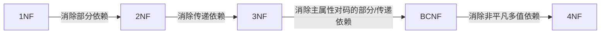

# 第7章 关系规范化理论复习题

## 一、单项选择题

**题目1.** 关系规范化中的删除操作异常是指 ① ，插入操作异常是指 ② 。

A. 不该删除的数据被删除　B. 不该插入的数据被插入　C. 应该删除的数据未被删除　D. 应该插入的数据未被插入

> [!tip]- 答案
> ① **A**　② **D**

---

**题目2.** 设计性能较优的关系模式称为规范化，规范化主要的理论依据是（ ）。

A. 关系规范化理论　B. 关系运算理论　C. 关系代数理论　D. 数理逻辑

> [!tip]- 答案
> **A**

---

**题目3.** 规范化理论是关系数据库进行逻辑设计的理论依据。根据这个理论，关系数据库中的关系必须满足：其每一属性都是（ ）。

A. 互不相关的　B. 不可分解的　C. 长度可变的　D. 互相关联的

> [!tip]- 答案
> **B**

---

**题目4.** 关系数据库规范化是为解决关系数据库中（ ）问题而引入的。

A. 插入、删除和数据冗余　B. 提高查询速度　C. 减少数据操作的复杂性　D. 保证数据的安全性和完整性

> [!tip]- 答案
> **A**

---

**题目5.** 规范化过程主要为克服数据库逻辑结构中的插入异常，删除异常以及（ ）的缺陷。

A. 数据的不一致性　B. 结构不合理　C. 冗余度大　D. 数据丢失

> [!tip]- 答案
> **C**

---

**题目6.** 当关系模式 R(A, B) 已属于 3NF，下列说法中（ ）是正确的。

A. 它一定消除了插入和删除异常　B. 仍存在一定的插入和删除异常　C. 一定属于 BCNF　D. A和C都是

> [!tip]- 答案
> **B**

---

**题目7.** 关系模式 1NF 是指 ________。

A. 不存在传递依赖现象　B. 不存在部分依赖现象　C. 不存在非主属性　D. 不存在组合属性

> [!tip]- 答案
> **D**

---

**题目8.** 关系模式中 2NF 是指 ________。

A. 满足1NF且不存在非主属性对关键字的传递依赖现象　B. 满足1NF且不存在非主属性对关键字部分依赖现象　C. 满足1NF且不存在非主属性　D. 满足1NF且不存在组合属性

> [!tip]- 答案
> **B**

---

**题目9.** 关系模式中 3NF 是指 ________。

A. 满足2NF且不存在非主属性对关键字的传递依赖现象　B. 满足2NF且不存在非主属性对关键字部分依赖现象　C. 满足2NF且不存在非主属性　D. 满足2NF且不存在组合属性

> [!tip]- 答案
> **A**

---

**题目10.** 关系模型中的关系模式至少是（ ）。

A. 1NF　B. 2NF　C. 3NF　D. BCNF

> [!tip]- 答案
> **A**

---

**题目11.** 关系模式中，满足 2NF 的模式，（ ）。

A. 可能是1NF　B. 必定是1NF　C. 必定是3NF　D. 必定是BCNF

> [!tip]- 答案
> **B**

---

**题目12.** X→Y 为平凡函数依赖是指 ________。

A. X<Y　B. X⊂Y　C. X=Y　D. X≠Y

> [!tip]- 答案
> **C**

---

**题目13.** 若关系模式 R∈1NF，且 R 中若存在 X→Y，则 X 必含关键字，称该模式 ________。

A. 满足3NF　B. 满足BCNF　C. 满足2NF　D. 满足1NF

> [!tip]- 答案
> **B**

---

**题目14.** 在关系模式中，如果属性 A 和 B 存在 1 对 1 的联系，则说（ ）。

A. A→B　B. B→A　C. A↔B　D. 以上都不是

> [!tip]- 答案
> **C**

---

**题目15.** 候选关键字中的属性称为（ ）。

A. 非主属性　B. 主属性　C. 复合属性　D. 关键属性

> [!tip]- 答案
> **B**

---

**题目16.** 关系模式中各级模式之间的关系为（ ）。

A. 3NF⊂2NF⊂1NF　B. 3NF⊂1NF⊂2NF　C. 1NF⊂2NF⊂3NF　D. 2NF⊂1NF⊂3NF

> [!tip]- 答案
> **A**

---

**题目17.** 消除了部分函数依赖的 1NF 的关系模式，必定是（ ）。

A. 1NF　B. 2NF　C. 3NF　D. BCNF

> [!tip]- 答案
> **B**

---

**题目18.** 关系模式的候选关键字可以有 ① ，主关键字有 ② 。

A. 0个　B. 1个　C. 1个或多个　D. 多个

> [!tip]- 答案
> ① **C**　② **B**

---

**题目19.** 候选关键字中的属性可以有（ ）。

A. 0个　B. 1个　C. 1个或多个　D. 多个

> [!tip]- 答案
> **C**

---

**题目20.** 关系模式的分解（ ）。

A. 唯一　B. 不唯一

> [!tip]- 答案
> **B**

---

**题目21.** 什么样的关系模式是严格好的关系模式 ________。

A. 优化级别最高的关系模式　B. 优化级别最高的关系模式　C. 符合3NF要求的关系模式　D. 视具体情况而定

> [!tip]- 答案
> **D**

---

**题目22.** 按照规范化设计要求，通常以关系模式符合 ________ 为标准。

A. 1NF　B. 2NF　C. 3NF　D. BCNF

> [!tip]- 答案
> **C**

---

**题目23.** 设某关系模式 S(SNO, CNO, G, TN, D)，其中 SNO 表示学号，CNO 表示课程号，G 表示成绩，TN 表示教师姓名，D 表示系名。属性间的依赖关系为：(SNO, CNO)→G，CNO→TN，TN→D。则该关系模式最高满足 ________。

A. 1NF　B. 2NF　C. 3NF　D. BCNF

> [!tip]- 答案
> **A**
>
> 码为 (SNO, CNO)，存在 CNO→TN（部分依赖），不满足 2NF。

---

**题目24.** 设某关系模式 S(SNO, CNO, G, TN, D)，其属性的含义及属性间的依赖关系同23题，若将 S 分解为 S1(SNO, CNO, G)、S2(CNO, TN)、S3(TN, D)，则 S1 最高满足 ① 、S2 最高满足 ② 、S3 最高满足 ③ 。

A. 1NF　B. 2NF　C. 3NF　D. BCNF

> [!tip]- 答案
> ① **D**　② **D**　③ **D**

---

**题目25.** 设某关系模式 R(ABCD)，函数依赖 {B→D, AB→C}，则 R 最高满足 ________。

A. 1NF　B. 2NF　C. 3NF　D. BCNF

> [!tip]- 答案
> **A**（AB 为 Key，D 部分依赖于 AB）

---

**题目26.** 设某关系模式 R(ABC)，函数依赖 {A→B, B→A, A→C}，则 R 最高满足 ________。

A. 1NF　B. 2NF　C. 3NF　D. BCNF

> [!tip]- 答案
> **C**（A 为 Key）

---

**题目27.** 设某关系模式 R(ABC)，函数依赖 {A→B, B→A, C→A}，则 R 最高满足 ________。

A. 1NF　B. 2NF　C. 3NF　D. BCNF

> [!tip]- 答案
> **B**（C 为 Key，存在 C→A→B 传递依赖）

---

**题目28.** 设某关系模式 R(ABCD)，函数依赖 {A→C, D→B}，则 R 最高满足 ________。

A. 1NF　B. 2NF　C. 3NF　D. BCNF

> [!tip]- 答案
> **A**（AD 为 Key，A→C、D→B 均为部分依赖）

---

**题目29.** 设有关系模式 W(C, P, S, G, T, R)，其中各属性的含义是：C 为课程，P 为教师，S 为学生，G 为成绩，T 为时间，R 为教室，根据定义有如下函数依赖集：F = {C→G, (S,C)→G, (T,R)→C, (T,P)→R, (T,S)→R}。关系模式 W 的一个关键字是 ① ，W 的规范化程度最高达到 ② 。若将关系模式 W 分解为3个关系模式 W1(C, P)，W2(S, C, G)，W3(S, T, R, C)，则 W1 的规范化程度最高达到 ③ ，W2 的规范化程度最高达到 ④ ，W3 的规范化程度最高达到 ⑤ 。

① A. (S,C)　B. (T,R)　C. (T,P)　D. (T,S)　E. (T,S,P)
②③④⑤ A. 1NF　B. 2NF　C. 3NF　D. BCNF　E. 4NF

> [!tip]- 答案
> ① **E**　② **B**　③ **E**　④ **E**　⑤ **B**

---

## 二、填空题

**题目30.** 关系规范化的目的是 ________。

> [!tip]- 答案
> 控制冗余，避免插入和删除异常，从而增强数据库结构的稳定性和灵活性

**题目31.** 在关系 A(S, SN, D) 和 B(D, CN, NM) 中，A 的主键是 S，B 的主键是 D，则 D 在 S 中称为 ________。

> [!tip]- 答案
> **外码**

**题目32.** 对于非规范化的模式，经过 ① 转变为 1NF，将 1NF 经过 ② 转变为 2NF，将 2NF 经过 ③ 转变为 3NF。

> [!tip]- 答案
> ① **使属性域变为简单域**；② **消除非主属性对主关键字的部分依赖**；③ **消除非主属性对主关键字的传递依赖**

**题目33.** 在一个关系 R 中，若每个数据项都是不可再分割的，那么 R 一定属于 ________。

> [!tip]- 答案
> **1NF**

**题目34.** 1NF，2NF，3NF 之间，相互是一种 ________ 关系。

> [!tip]- 答案
> **3NF ⊂ 2NF ⊂ 1NF**

**题目35.** 若关系为 1NF，且它的每一非主属性都 ________ 候选关键字，则该关系为 2NF。

> [!tip]- 答案
> **不部分函数依赖于**

**题目36.** 在关系数据库的规范化理论中，在执行"分解"时，必须遵守规范化原则：保持原有的依赖关系和 ________。

> [!tip]- 答案
> **无损连接性**

---

## 三、应用题

### 题目37. 理解并给出下列术语的定义

> [!example] 题目
> 理解并给出下列术语的定义：函数依赖、部分函数依赖、完全函数依赖、传递函数依赖、候选码、主码、外码、全码、1NF、2NF、3NF、BCNF。

> [!definition] 函数依赖
> 设 R(U) 是属性集 U 上的关系模式。X, Y 是属性集 U 的子集。若对于 R(U) 的任意一个可能的关系 r，r 中不可能存在两个元组在 X 上的属性值相等，而在 Y 上的属性值不等，则称 X 函数确定 Y 或 Y 函数依赖于 X，记作 X → Y。

> [!note] 术语和记号
> - X → Y，但 Y 不是 X 的子集，则称 X → Y 是**非平凡的函数依赖**。若不特别声明，总是讨论非平凡的函数依赖。
> - X → Y，但 Y 是 X 的子集，则称 X → Y 是**平凡的函数依赖**。
> - 若 X → Y，则 X 叫做**决定因子**（Determinant）。
> - 若 X → Y，Y → X，则记作 X ↔ Y。
> - 若 Y 不函数依赖于 X，则记作 X ↛ Y。

> [!definition] 完全函数依赖与部分函数依赖
> 在 R(U) 中，如果 X → Y，并且对于 X 的任何一个真子集 X'，都有 X' ↛ Y，则称 Y 对 X **完全函数依赖**，记作 X f→ Y。
>
> 若 X → Y，但 Y 不完全函数依赖于 X，则称 Y 对 X **部分函数依赖**，记作 X p→ Y。

> [!definition] 传递函数依赖
> 如果 X → Y（非平凡函数依赖，并且 Y ↛ X）、Y → Z，则称 Z **传递函数依赖**于 X。

> [!definition] 候选码、主码、全码
> - **候选码**：设 K 为 R(U,F) 中的属性或属性组，若 K f→ U，则 K 为 R 候选码（K 为决定 R 全部属性值的最小属性组）。
> - **主码**：关系 R(U,F) 中可能有多个候选码，则选其中一个作为主码。
> - **全码**：整个属性组是码，称为全码（All-key）。

> [!note] 主属性与非主属性
> 包含在任何一个候选码中的属性，称为**主属性**（Prime attribute）。不包含在任何码中的属性称为**非主属性**（Nonprime attribute）或非码属性（Non-key attribute）。

> [!definition] 外码
> 关系模式 R 中属性或属性组 X 并非 R 的码，但 X 是另一个关系模式的码，则称 X 是 R 的外部码（Foreign key）也称**外码**。

> [!definition] 1NF
> 若关系模式 R 的每一个分量是不可再分的数据项，则关系模式 R 属于第一范式（1NF）。

> [!definition] 2NF
> 若关系模式 R ∈ 1NF，且每一个非主属性完全函数依赖于码，则关系模式 R ∈ 2NF（即 1NF 消除了非主属性对码的部分函数依赖则成为 2NF）。

> [!definition] 3NF
> 关系模式 R<U, F> 中若不存在这样的码 X、属性组 Y 及非主属性 Z（Z 不是 Y 的子集）使得 X → Y，Y ↛ X，Y → Z 成立，则称 R<U, F> ∈ 3NF（若 R ∈ 3NF，则每一个非主属性既不部分依赖于码也不传递依赖于码）。

> [!definition] BCNF
> 关系模式 R<U, F> ∈ 1NF。若 X → Y 且 Y 不是 X 的子集时，X 必含有码，则 R<U, F> ∈ BCNF。

---

### 题目38. 指出下列关系模式是第几范式？并说明理由

> [!example] 题目
> (1) R(X, Y, Z)　F = {XY → Z}
> (2) R(X, Y, Z)　F = {Y → Z, XZ → Y}
> (3) R(X, Y, Z)　F = {Y → Z, Y → X, X → YZ}
> (4) R(X, Y, Z)　F = {X → Y, X → Z}
> (5) R(X, Y, Z)　F = {XY → Z}
> (6) R(W, X, Y, Z)　F = {X → Z, WX → Y}

> [!note]- 参考答案
> (1) R 是 **BCNF**。候选关键字为 XY，F 中只有一个函数依赖，而该函数依赖的左部包含了 R 的候选关键字 XY。
>
> (2) R 是 **3NF**。候选关键字为 XY 和 XZ，R 中所有属性都是主属性，不存在非主属性对候选关键字的传递依赖。
>
> (3) R 是 **BCNF**。候选关键字为 X 和 Y，∵ X → YZ，∴ X → Y，X → Z，由于 F 中有 Y → Z，Y → X，因此 Z 是直接函数依赖于 X，而不是传递依赖于 X。又∵ F 的每一函数依赖的左部都包含了任一候选关键字，∴ R 是 BCNF。
>
> (4) R 是 **BCNF**。候选关键字为 X，F 中每一个函数依赖的左部都包含了候选关键字 X。
>
> (5) R 是 **BCNF**。候选关键字为 XY，F 中函数依赖的左部包含了候选关键字 XY。
>
> (6) R 是 **1NF**。候选关键字为 WX，Y、Z 为非主属性，由于 X → Z，存在非主属性对候选关键字的部分函数依赖。

---

### 题目39. 求 R 的所有候选关键字

> [!example] 题目
> 设有关系模式 R(U, F)，其中：U = {A, B, C, D, E, P}，F = {A → B, C → P, E → A, CE → D}，求出 R 的所有候选关键字。

> [!note]- 参考答案
> 候选关键字只可能由 A, C, E 组成，但有 E → A，所以组成候选关键字的属性可能是 CE。
>
> 计算可知：(CE)⁺ = ABCDEP，即 CE → U
>
> 而：C⁺ = CP，E⁺ = ABE
>
> ∴ R 只有一个候选关键字 **CE**。

> [!info]- 补充知识：Armstrong 公理系统与闭包算法
> **Armstrong 公理系统：**
> - **A1. 自反律**（Reflexivity）：若 Y ⊆ X ⊆ U，则 X → Y 为 F 所蕴含。
> - **A2. 增广律**（Augmentation）：若 X → Y 为 F 所蕴含，且 Z ⊆ U，则 XZ → YZ 为 F 所蕴含。
> - **A3. 传递律**（Transitivity）：若 X → Y 及 Y → Z 为 F 所蕴含，则 X → Z 为 F 所蕴含。
>
> **导出规则：**
> - **合并规则**：由 X → Y，X → Z，有 X → YZ。
> - **伪传递规则**：由 X → Y，WY → Z，有 XW → Z。
> - **分解规则**：由 X → Y 及 Z ⊆ Y，有 X → Z。
>
> **求属性集 X 关于 F 的闭包 XF⁺ 算法：**
> 1. 令 X(0) = X，i = 0
> 2. 求 B，B = {A | ∃(V)(∃(W)(V → W ∈ F ∧ V ⊆ X(i) ∧ A ∈ W))}
> 3. X(i+1) = B ∪ X(i)
> 4. 判断 X(i+1) = X(i) 吗？
> 5. 若相等或 X(i) = U，则 X(i) 就是 XF⁺，算法终止。
> 6. 若否，则 i = i + 1，返回第2步。

---

### 题目40. 求 R 的所有候选关键字

> [!example] 题目
> 设有关系模式 R(C, T, S, N, G)，其上的函数依赖集：F = {C → T, CS → G, S → N}，求出 R 的所有候选关键字。

> [!note]- 参考答案
> R 的候选关键字只可能由 F 中各个函数依赖的左边属性组成，即 C, S，所以组成候选关键字的属性可能是 CS。
>
> 计算可知：(CS)⁺ = CGNST，即 CS → U
>
> 而：C⁺ = CT，S⁺ = NS
>
> ∴ R 只有一个候选关键字 **CS**。

---

### 题目41. 计算 B⁺ 并求 R 的所有候选关键字

> [!example] 题目
> 设有关系模式 R(A, B, C, D, E)，其上的函数依赖集：F = {A → BC, CD → E, B → D, E → A}
> (1) 计算 B⁺。
> (2) 求出 R 的所有候选关键字。

> [!note]- 参考答案
> **(1)** 令 X = {B}，X(0) = B，X(1) = BD，X(2) = BD，故 B⁺ = BD。
>
> **(2)** 根据 F 中各依赖的左边属性 A, B, C, D, E 分析：
>
> | 尝试属性组 | 闭包计算 | 是否候选码 |
> |-----------|---------|----------|
> | E | E⁺ = ABCDE | ✓ |
> | CD | (CD)⁺ = ABCDE，但 C⁺ = C，D⁺ = D | ✓ |
> | A | A⁺ = ABCDE | ✓ |
> | BC | (BC)⁺ = ABCDE，但 B⁺ = BD，C⁺ = C | ✓ |
>
> R 的所有候选关键字是 **A, BC, CD, E**。

---

### 题目42. 求 R 的候选关键字并判断无损连接分解

> [!example] 题目
> 设有关系模式 R(U, F)，其中：U = {A, B, C, D, E}，F = {A → D, E → D, D → B, BC → D, DC → A}
> (1) 求出 R 的候选关键字。
> (2) 判断 ρ = {AB, AE, CE, BCD, AC} 是否为无损连接分解？

> [!note]- 参考答案
> **(1)** (CE)⁺ = ABCDE，则 CE → U，而 C⁺ = C，E⁺ = BDE，根据候选关键字定义，**CE** 是 R 的候选关键字。
>
> **(2)** ρ 的无损连接性判断表，**不具有无损连接性**。
>
> | Ri | A | B | C | D | E |
> |----|---|---|---|---|---|
> | AB | a1 | a2 | | | |
> | AE | a1 | | | | a5 |
> | CE | | | a3 | | a5 |
> | BCD | | a2 | a3 | a4 | |
> | AC | a1 | | a3 | | |

---

### 题目43. 判断无损连接分解

> [!example] 题目
> 设有关系模式 R(A, B, C, D, E) 及其上的函数依赖集 F = {A → C, B → D, C → D, DE → C, CE → A}，试问分解 ρ = {R1(A, D), R2(A, B), R3(B, E), R4(C, D, E), R5(A, E)} 是否为 R 的无损连接分解？

> [!note]- 参考答案
> ρ 的无损连接性判断结果表如下所示，**不具有无损连接性**。
>
> | Ri | A | B | C | D | E |
> |----|---|---|---|---|---|
> | AD | a1 | | | a4 | |
> | AB | a1 | a2 | | | |
> | BE | | a2 | | | a5 |
> | CDE | | | a3 | a4 | a5 |
> | AE | a1 | | | | a5 |

---

### 题目44. 计算属性集 D 关于 F 的闭包 D⁺

> [!example] 题目
> 设有函数依赖集 F = {AB → CE, A → C, GP → B, EP → A, CDE → P, HB → P, D → HG, ABC → PG}，计算属性集 D 关于 F 的闭包 D⁺。

> [!note]- 参考答案
> 令 X = {D}，X(0) = D。
>
> 在 F 中找出左边是 D 子集的函数依赖，其结果是：D → HG，∴ X(1) = DGH。
>
> 在 F 中找出左边是 DGH 子集的函数依赖，未找到，则 X(2) = DGH。
>
> 由于 X(2) = X(1)，则：D⁺ = DGH。

---

### 题目45. 求属性集闭包 (BD)⁺

> [!example] 题目
> 已知关系模式 R 的全部属性集 U = {A, B, C, D, E, G} 及函数依赖集：F = {AB → C, C → A, BC → D, ACD → B, D → EG, BE → C, CG → BD, CE → AG}，求属性集闭包 (BD)⁺。

> [!note]- 参考答案
> 令 X = {BD}：
>
> - X(0) = BD
> - X(1) = BDEG（由 D → EG）
> - X(2) = BCDEG（由 BE → C）
> - X(3) = ABCDEG（由 CG → BD，已得到全部属性）
>
> 故 (BD)⁺ = ABCDEG。

---

### 题目46. 计算多个闭包

> [!example] 题目
> 设有函数依赖集 F = {D → G, C → A, CD → E, A → B}，计算闭包 D⁺，C⁺，A⁺，(CD)⁺，(AD)⁺，(AC)⁺，(ACD)⁺。

> [!note]- 参考答案
> | 属性集 | 计算过程 | 闭包结果 |
> |--------|---------|---------|
> | D | D → DG | D⁺ = DG |
> | C | C → AC → ABC | C⁺ = ABC |
> | A | A → AB | A⁺ = AB |
> | CD | CD → CDG → ACDG → ACDEG → ABCDEG | (CD)⁺ = ABCDEG |
> | AD | AD → ABD → ABDG | (AD)⁺ = ABDG |
> | AC | AC → ABC | (AC)⁺ = ABC |
> | ACD | ACD → ABCD → ABCDG → ABCDEG | (ACD)⁺ = ABCDEG |

---

### 题目47. 求与 F 等价的最小函数依赖集

> [!example] 题目
> 设有函数依赖集 F = {AB → CE, A → C, GP → B, EP → A, CDE → P, HB → P, D → HG, ABC → PG}，求与 F 等价的最小函数依赖集。

> [!info]- 最小依赖集判定条件
> 1. F 中任一函数依赖的右部仅含有一个属性。
> 2. F 中不存在这样的函数依赖 X → A，使得 F 与 F - {X → A} 等价。
> 3. F 中不存在这样的函数依赖 X → A，X 有真子集 Z 使得 F - {X → A} ∪ {Z → A} 与 F 等价。

> [!note]- 参考答案
> **(1)** 将 F 中依赖右部属性单一化：
>
> | 依赖 | 分解后 |
> |------|--------|
> | AB → CE | AB → C，AB → E |
> | D → HG | D → H，D → G |
> | ABC → PG | ABC → P，ABC → G |
>
> 其余依赖右部已为单属性：A → C，GP → B，EP → A，CDE → P，HB → P
>
> **(2)** 对于 AB → C，由于有 A → C，则 AB → C 为多余的，去掉。
>
> **(3)** 通过分析没有多余的依赖，则最小依赖集：
>
> Fm = {AB → E, A → C, GP → B, EP → A, CDE → P, HB → P, D → H, D → G, ABC → P, ABC → G}

---

### 题目48. 求 F 的最小依赖集

> [!example] 题目
> 设有关系模式 R(U, F)，其中：U = {E, F, G, H}，F = {E → G, G → E, F → EG, H → EG, FH → E}，求 F 的最小依赖集。

> [!note]- 参考答案
> **(1)** 将 F 中依赖右部属性单一化：
> F1 = {E → G, G → E, F → E, F → G, H → E, H → G, FH → E}
>
> **(2)** 对于 FH → E，由于有 F → E，则为多余的，去掉：
> F2 = {E → G, G → E, F → E, F → G, H → E, H → G}
>
> **(3)** 由于 E → G，所以在 F2 中的 F → E 和 F → G 以及 H → E 和 H → G 之一是多余的，则有以下四种等价的最小依赖集：
>
> Fm1 = {E → G, G → E, F → G, H → G}
> Fm2 = {E → G, G → E, F → G, H → E}
> Fm3 = {E → G, G → E, F → E, H → E}
> Fm4 = {E → G, G → E, F → E, H → G}

---

### 题目49. BCNF 分解

> [!example] 题目
> 设有关系模式 R(U, F)，其中：U = {A, B, C, D}，F = {A → B, B → C, D → B}，把 R 分解成 BCNF 模式集：
> (1) 如果首先把 R 分解成 {ACD, BD}，试求 F 在这两个模式上的投影。
> (2) ACD 和 BD 是 BCNF 吗？如果不是，请进一步分解。

> [!note]- 参考答案
> **(1)** ΠACD(F) = {A → C, D → C}；ΠBD(F) = {D → B}
>
> **(2)** BD 已是 BCNF。ACD 不是 BCNF。模式 ACD 的候选关键字是 AD。考虑 A → C，A 不是模式 ACD 的候选关键字，所以这个函数依赖不满足 BCNF 条件。将 ACD 分解为 AC 和 AD，此时 AC 和 AD 均为 BCNF。

---

### 题目50. 综合题（闭包、最小依赖集、候选码、BCNF分解、3NF分解）

> [!example] 题目
> 设有关系模式 R(A, B, C, D)，其上的函数依赖集：F = {A → C, C → A, B → AC, D → AC}
> (1) 计算 (AD)⁺。
> (2) 求 F 的最小等价依赖集 Fm。
> (3) 求 R 的关键字。
> (4) 将 R 分解使其满足 BCNF 且无损连接性。
> (5) 将 R 分解成满足 3NF 并具有无损连接性与保持依赖性。

> [!note]- 参考答案
> **(1)** 令 X = {AD}，X(0) = AD，X(1) = ACD，X(2) = ACD，故 (AD)⁺ = ACD。
>
> **(2)** 将 F 中的函数依赖右部属性单一化：
>
> F1 = {A → C, C → A, B → A, B → C, D → A, D → C}
>
> 在 F1 中去掉多余的函数依赖：
> ∵ B → A，A → C　∴ B → C 是多余的。
> ∵ D → A，A → C　∴ D → C 是多余的。
>
> Fm = {A → C, C → A, B → A, D → A}
>
> 最小依赖集不唯一。Fm 中所有依赖的左部都是单属性，无多余属性。
>
> **(3)** ∵ B, D 在 F 中所有函数依赖的右部均未出现，∴ 候选关键字中一定包含 BD，而 (BD)⁺ = ABCD，因此 **BD** 是 R 唯一的候选关键字。
>
> **(4)** 考虑 A → C。∵ AC 不包含候选关键字 BD，将 ABCD 分解为 AC 和 ABD。AC 已是 BCNF，进一步分解 ABD，选择 B → A，把 ABD 分解为 AB 和 BD。此时 AB 和 BD 均为 BCNF。
>
> ρ = {AC, AB, BD}
>
> **(5)** 由 (2) 求出满足 3NF 的具有依赖保持性的分解为 ρ = {AC, BA, DA}。判断其不满足无损连接性；令 ρ = ρ ∪ {BD}，BD 是 R 的候选关键字。
>
> ρ = {AC, BA, DA, BD}

---

### 题目51. 找出 R 的两个候选关键字

> [!example] 题目
> 已知关系模式 R(CITY, ST, ZIP) 和函数依赖集：F = {(CITY, ST) → ZIP, ZIP → CITY}，试找出 R 的两个候选关键字。

> [!note]- 参考答案
> 设 U = (CITY, ST, ZIP)，F 中函数依赖的左边是 CITY, ST, ZIP：
>
> 1. 由于 ZIP → CITY，去掉 CITY，故 (ST, ZIP) 可能是候选关键字。(ST, ZIP)⁺ = {ST, ZIP, CITY}，∴ (ST, ZIP) → U。又 ST⁺ = ST，ZIP⁺ = {ZIP, CITY}，故 **(ST, ZIP)** 是一个候选关键字。
> 2. 由于 (CITY, ST) → ZIP，去掉 ZIP，故 (CITY, ST) 可能是候选关键字。(CITY, ST)⁺ = {CITY, ST, ZIP}，∴ (CITY, ST) → U。又 CITY⁺ = CITY，ST⁺ = ST，故 **(CITY, ST)** 是一个候选关键字。
>
> 因此，R 的两个候选关键字是 **(ST, ZIP)** 和 **(CITY, ST)**。

---

### 题目52. 求候选关键字并分解为 3NF

> [!example] 题目
> 设有关系模式 R(A, B, C, D, E)，R 的函数依赖集：F = {A → D, E → D, D → B, BC → D, CD → A}
> (1) 求 R 的候选关键字。
> (2) 将 R 分解为 3NF。

> [!note]- 参考答案
> **(1)** 由于 (CE)⁺ = ABCDE，C⁺ = C，E⁺ = BDE，∴ R 的候选关键字是 **CE**。
>
> **(2)** 求出最小依赖集 F' = {A → D, E → D, D → B, BC → D, CD → A}
>
> 将 R 分解为 3NF：ρ = {AD, DE, BD, BCD, ACD}

---

### 题目53. 判断无损连接分解

> [!example] 题目
> 设有关系模式 R(U, V, W, X, Y, Z)，其函数依赖集：F = {U → V, W → Z, Y → U, WY → X}，现有下列分解：
> (1) ρ1 = {WZ, VY, WXY, UV}
> (2) ρ2 = {UVY, WXYZ}
>
> 判断上述分解是否具有无损连接性。

> [!note]- 参考答案
> **(1)** ρ1 的无损连接性判断表，**不具有无损连接性**。
>
> | Ri | U | V | W | X | Y | Z |
> |----|---|---|---|---|---|---|
> | WZ | | | a3 | | | a6 |
> | VY | | a2 | | | a5 | |
> | WXY | | | a3 | a4 | a5 | a6 |
> | UV | a1 | a2 | | | | |
>
> **(2)** ρ2 的无损连接性判断表，**具有无损连接性**。
>
> | Ri | U | V | W | X | Y | Z |
> |----|---|---|---|---|---|---|
> | UVY | a1 | a2 | | | a5 | |
> | WXYZ | a1 | a2 | a3 | a4 | a5 | a6 |

---

### 题目54. 判断无损连接分解

> [!example] 题目
> 已知 R(A1, A2, A3, A4, A5) 为关系模式，其上函数依赖集：F = {A1 → A3, A3 → A4, A2 → A3, A4A5 → A3, A3A5 → A1}
> ρ = {R1(A1, A4), R2(A1, A2), R3(A2, A3), R4(A3, A4, A5), R5(A1, A5)}
> 判断 ρ 是否具有无损连接性。

> [!note]- 参考答案
> ρ **不具有无损连接性**。
>
> | Ri | A1 | A2 | A3 | A4 | A5 |
> |----|----|----|----|----|----|
> | A1A4 | a1 | | a3 | a4 | |
> | A1A2 | a1 | a2 | a3 | a4 | |
> | A2A3 | | a2 | a3 | a4 | |
> | A3A4A5 | a1 | | a3 | a4 | a5 |
> | A1A5 | a1 | | a3 | a4 | a5 |

---

### 题目55. 判断无损连接分解

> [!example] 题目
> 设有关系模式 R(B, O, I, S, Q, D)，其上函数依赖集：F = {S → D, I → B, IS → Q, B → O}。如果用 SD, IB, ISQ, BO 代替 R，这样的分解是具有无损连接吗？

> [!note]- 参考答案
> ρ = {R1(S, D), R2(I, B), R3(I, S, Q), R4(B, O)}，**具有无损连接**。
>
> | Ri | B | O | I | S | Q | D |
> |----|---|---|---|---|---|---|
> | SD | | | | a4 | | a6 |
> | IB | a1 | | a3 | | | |
> | ISQ | a1 | a2 | a3 | a4 | a5 | a6 |
> | BO | a1 | a2 | | | | |

---

### 题目56. 综合题（候选码、无损连接、3NF分解）

> [!example] 题目
> 设有关系模式 R(F, G, H, I, J)，R 的函数依赖集：F = {F → I, J → I, I → G, GH → I, IH → F}
> (1) 求出 R 的所有候选关键字。
> (2) 判断 ρ = {FG, FJ, JH, IGH, FH} 是否为无损连接分解？
> (3) 将 R 分解为 3NF，并具有无损连接性和依赖保持性。

> [!note]- 参考答案
> **(1)** 候选关键字中至少包含 J 和 H（因为它们不依赖于谁）。令 X = {JH}：
> - X(0) = JH
> - X(1) = IJH（由 J → I）
> - X(2) = GIJH（由 I → G）
> - X(3) = FGIJH（由 IH → F）
>
> ∴ 候选关键字只有 **JH**。
>
> **(2)** ρ **不具有无损连接性**。
>
> | Ri | F | G | H | I | J |
> |----|---|---|---|---|---|
> | FG | a1 | a2 | | | |
> | FJ | a1 | | a3 | a4 | a5 |
> | JH | | | a3 | | a5 |
> | IGH | | a2 | a3 | a4 | |
> | FH | a1 | | a3 | | |
>
> **(3)** 求出最小依赖集 F' = {F → I, J → I, I → G, GH → I, IH → F}
>
> 保持依赖的 3NF 分解：ρ = {FI, JI, IG, GHI, IHF}，该分解不满足无损连接；加入候选码 JH。
>
> 最终：ρ = {FI, JI, IG, GHI, IHF, JH}，同时满足无损连接、依赖保持、3NF。

---

### 题目57. 综合题（候选码、无损连接、BCNF分解）

> [!example] 题目
> 设有关系模式 R(A, B, C, D, E)，其上的函数依赖集：F = {A → C, C → D, B → C, DE → C, CE → A}
> (1) 求 R 的所有候选关键字。
> (2) 判断 ρ = {AD, AB, BC, CDE, AE} 是否为无损连接分解？
> (3) 将 R 分解为 BCNF，并具有无损连接性。

> [!note]- 参考答案
> **(1)** 候选关键字至少包含 BE，(BE)⁺ = ABCDE，∴ **BE** 是 R 的惟一候选关键字。
>
> **(2)** ρ **不具有无损连接性**。
>
> | Ri | A | B | C | D | E |
> |----|---|---|---|---|---|
> | AD | a1 | | a3 | a4 | |
> | AB | a1 | a2 | a3 | a4 | |
> | BC | | a2 | a3 | a4 | |
> | CDE | a1 | | a3 | a4 | a5 |
> | AE | a1 | | a3 | a4 | a5 |
>
> **(3)** 考虑 A → C，AC 不包含候选关键字 BE，不是 BCNF。将 ABCDE 分解为 AC 和 ABDE，AC 已是 BCNF。进一步分解 ABDE，选择 B → D，把 ABDE 分解为 BD 和 ABE，此时 BD 和 ABE 均为 BCNF。
>
> ρ = {AC, BD, ABE}

---

### 题目58. 教学管理数据库设计

> [!example] 题目
> 设有一教学管理数据库，其属性为：学号(S#)，课程号(C#)，成绩(G)，任课教师(TN)，教师所在的系(D)。语义：
> - 学号和课程号分别与其代表的学生和课程一一对应
> - 一个学生所修的每门课程都有一个成绩
> - 每门课程只有一位任课教师，但每位教师可以有多门课程
> - 教师中没有重名，每个教师只属于一个系
>
> (1) 试根据上述语义确定函数依赖集。
> (2) 如果用上面所有属性组成一个关系模式，那么该关系模式为何模式？并举例说明在进行增、删操作时的异常现象。
> (3) 将其分解为具有依赖保持和无损连接的 3NF。

> [!note]- 参考答案
> **(1)** F = {(S#, C#) → G, C# → TN, TN → D}
>
> **(2)** 关系模式为 **1NF**。候选关键字为 (S#, C#)；非主属性有 G、TN、D。C# → TN 存在非主属性 TN 对候选关键字 (S#, C#) 的部分函数依赖。
>
> 异常现象：
> - **插入异常**：新增一门课程暂无学生选修，因缺少 S#，课程信息无法插入。
> - **删除异常**：删除某个教师，会连带删除不该删除的课程信息。
>
> **(3)** ρ = {R1(S#, C#, G), R2(C#, TN), R3(TN, D)}

---

### 题目59. 证明：任何二元关系模式必定是 BCNF

> [!example] 题目
> 证明：在关系数据库中，任何的二元关系模式必定是 BCNF。

> [!note]- 参考答案
> **证明：** 设 R 为二元关系 R(x1, x2)。
>
> 1. x1 → x2，但 x2 ↛ x1：候选码 x1，函数依赖左部包含候选码，属于 BCNF。
> 2. x1 → x2，x2 → x1：候选码 x1、x2；所有依赖左部均包含候选码，属于 BCNF。
> 3. x1 ↛ x2，x2 ↛ x1：候选码 (x1, x2)，不存在非平凡函数依赖，属于 BCNF。
>
> 综上，二元关系一定是 BCNF。**证毕。**

---

### 题目60. 判断范式并分解

> [!example] 题目
> 如下给出的关系 R 为第几范式？是否存在操作异常？若存在，则将其分解为高一级范式。分解完成的高级范式中是否可以避免分解前关系中存在的操作异常？
>
> | 工程号 | 材料号 | 数量 | 开工日期 | 完工日期 | 价格 |
> |--------|--------|------|----------|----------|------|
> | P1 | I1 | 4 | 2000.5 | 2001.5 | 250 |
> | P1 | I2 | 6 | 2000.5 | 2001.5 | 300 |
> | P1 | I3 | 15 | 2000.5 | 2001.5 | 180 |
> | P2 | I1 | 6 | 2000.11 | 2001.12 | 250 |
> | P2 | I4 | 18 | 2000.11 | 2001.12 | 350 |

> [!note]- 参考答案
> R 为 **1NF**。候选关键字为 (工程号, 材料号)；非主属性开工日期、完工日期**部分函数依赖**于工程号，不满足 2NF。
>
> **存在异常：**
> - 插入：新项目确定但还未采购材料，缺少材料号，工程信息无法插入。
> - 删除：删除某条材料记录，会连带删掉工程本身的开工完工信息。
>
> **分解为两个 2NF 子模式：**
>
> **R1：**
>
> | 工程号 | 材料号 | 数量 | 价格 |
> |--------|--------|------|------|
> | P1 | I1 | 4 | 250 |
> | P1 | I2 | 6 | 300 |
> | P1 | I3 | 15 | 180 |
> | P2 | I1 | 6 | 250 |
> | P2 | I4 | 18 | 350 |
>
> **R2：**
>
> | 工程号 | 开工日期 | 完工日期 |
> |--------|----------|----------|
> | P1 | 2000.5 | 2001.5 |
> | P2 | 2000.11 | 2001.12 |
>
> 分解之后：新项目可以直接插入 R2；删除材料只操作 R1，不会丢失工程时间信息，消除上述异常。

---

### 题目61. 证明：BCNF 必是 3NF

> [!example] 题目
> 试证明：一个 BCNF 范式必是 3NF。

> [!note]- 参考答案
> **证明（反证法）：**
>
> 假设 R 属于 BCNF，但不属于 3NF。
>
> 则存在：非主属性 A；候选码 X；属性集 Y；满足 X → Y，Y ↛ X，Y → A；且 A ∉ Y、A ∉ X、Y 不是超码。
>
> 由 Y → A，BCNF 要求决定因子 Y 必须是超码，与 Y 不是超码矛盾。假设不成立。
>
> 故 BCNF 一定是 3NF。**证毕。**

---

### 题目62. 系、学生、班级、社团数据库设计

> [!example] 题目
> 建立一个关于系、学生、班级、社团等信息的关系数据库。
>
> 描述学生：学号、姓名、出生年月、系名、班号、宿舍区。
> 描述班级：班号、专业名、系名、人数、入校年份。
> 描述系：系名、系号、系办公室地点、人数。
> 描述社团：社团名、成立年份、地点、人数。
>
> 语义：
> 1. 一个系有若干专业，每个专业每年只招一个班，每个班若干学生。
> 2. 一个系的学生住在同一个宿舍区。
> 3. 每个学生可参加若干社团，每个社团若干学生。学生参加某社团有入会年份。
>
> 请给出关系模式，写出每个关系模式的函数依赖集，指出是否存在传递函数依赖。对于函数依赖左部是多属性的情况讨论完全/部分函数依赖。指出各关系的候选码、外码，有没有全码存在？

> [!note]- 参考答案
> **关系模式：**
>
> 1. 学生 S(S#, SN, SB, DN, C#, SA)
> 2. 班级 C(C#, CS, DN, CNUM, CDATE)
> 3. 系 D(D#, DN, DA, DNUM)
> 4. 社团 P(PN, DATE1, PA, PNUM)
> 5. 学生-社团 SP(S#, PN, DATE2)

> [!info] 属性说明
> - S# 学号，SN 姓名，SB 出生年月，SA 宿舍区
> - C# 班号，CS 专业名，CNUM 班级人数，CDATE 入校年份
> - D# 系号，DN 系名，DA 办公室地点，DNUM 系人数
> - PN 社团名，DATE1 成立年份，PA 地点，PNUM 社团人数
> - DATE2 入会年份

> [!note] 函数依赖集与分析
>
> **1. S：** S# → SN，S# → SB，S# → C#，C# → DN，DN → SA
> - 存在传递依赖：S# → C# → DN → SA
> - 候选码：S#；外码：C#，DN；无全码
>
> **2. C：** C# → CS，C# → CNUM，C# → CDATE，CS → DN，(CS, CDATE) → C#
> - 存在传递依赖：C# → CS → DN
> - (CS, CDATE) → C# 为完全函数依赖
> - 候选码：C#、(CS, CDATE)；外码：DN；无全码
>
> **3. D：** D# → DN，DN → D#，D# → DA，D# → DNUM
> - 候选码：D#、DN；无外码；无全码
>
> **4. P：** PN → DATE1，PN → PA，PN → PNUM
> - 候选码：PN；无外码；无全码
>
> **5. SP：** (S#, PN) → DATE2
> - (S#, PN) → DATE2 为完全函数依赖
> - 候选码：(S#, PN)；外码：S#，PN；无全码

| 关系 | 候选码 | 外码 | 全码 |
|------|--------|------|------|
| S | S# | C#，DN | 无 |
| C | C#，(CS, CDATE) | DN | 无 |
| D | D#，DN | 无 | 无 |
| P | PN | 无 | 无 |
| SP | (S#, PN) | S#，PN | 无 |
