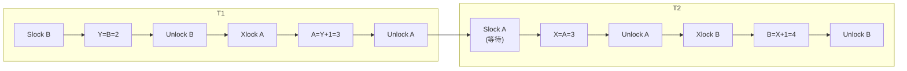

# 数据库原理期末综合试卷一

## 一、单项选择题

**题目1.** 单个用户使用的数据视图的描述称为（ ）

A. 外模式　B. 概念模式　C. 内模式　D. 存储模式

> [!tip]- 答案
> **A. 外模式**

---

**题目2.** 关系数据模型的三个组成部分中，不包括（ ）

A. 完整性规则　B. 数据结构　C. 恢复　D. 数据操作

> [!tip]- 答案
> **C. 恢复**

---

**题目3.** 数据库中存储的是（ ）

A. 数据　B. 数据模型　C. 数据之间的联系　D. 数据以及数据之间的联系

> [!tip]- 答案
> **D. 数据以及数据之间的联系**

---

**题目4.** 下列四项中，不正确的提法是（ ）

A. SQL语言是关系数据库的国际标准语言　B. SQL语言具有数据定义、查询、操纵和控制功能　C. SQL语言可以自动实现关系数据库的规范化　D. SQL语言称为结构查询语言

> [!tip]- 答案
> **C**
>
> SQL 不能自动实现关系数据库的规范化，规范化需要设计人员分析函数依赖并手动分解。

---

**题目5.** 下列四项中，可以直接用于表示概念模型的是（ ）

A. 实体-联系(E-R)模型　B. 关系模型　C. 层次模型　D. 网状模型

> [!tip]- 答案
> **A. 实体-联系(E-R)模型**

---

**题目6.** 保证数据的（ ）是对数据库的最基本要求。

A. 一致性　B. 安全性　C. 完整性　D. 高效性

> [!tip]- 答案
> **C. 完整性**

---

**题目7.** R⟨U, F⟩，U = (A, B, C, G, H, I)，F = {A → B, A → C, CG → H, CG → I, B → H}，计算 (AG)⁺ = （ ）

A. AGBC　B. AGB　C. BCHI　D. AGBCIH

> [!tip]- 答案
> **D. AGBCIH**
>
> X(0) = AG → X(1) = ABGCH（由 A → B，A → C，CG → H）→ X(2) = ABGCHI（由 CG → I）→ X(3) = ABGCHI，故 (AG)⁺ = ABGCHI。

---

## 二、填空题

**题目8.** 关系的每一个分量必须是一个 ________ 的数据项。

> [!tip]- 答案
> **不可再分**

**题目9.** ________ 和 ________ 是关系模型必须满足的完整性约束条件，被称作是关系的两个不变性。

> [!tip]- 答案
> **实体完整性**；**参照完整性**

**题目10.** 事务必须具有的四个性质是：________、一致性、________ 和持久性。

> [!tip]- 答案
> **原子性**；**隔离性**

**题目11.** 嵌入式SQL中使用 ________ 语句把游标指针向前推进一条记录，并将缓冲区中的当前记录送至主语言。

> [!tip]- 答案
> **FETCH**

**题目12.** 在具有检查点的恢复子系统中，若事务T在检查点之前开始执行，在故障点之前提交，则应对其进行 ________ 操作。

> [!tip]- 答案
> **REDO（重做）**

---

## 三、判断题

**题目13.** 数据库的逻辑模型设计阶段，任务是将局部E-R模型转换成全局E-R模型。（ ）

> [!tip]- 答案
> **×**
>
> 合并局部E-R属于**概念结构设计**阶段。逻辑结构设计阶段的任务是将概念模型（E-R图）转换为DBMS支持的数据模型。

---

**题目14.** 关系数据库系统可以对视图进行各种更新操作。（ ）

> [!tip]- 答案
> **×**
>
> 视图存在更新限制，并非所有视图都支持更新（如包含聚集函数、GROUP BY、多表连接的视图通常不可更新）。

---

**题目15.** 系统一旦发现用户的任何操作请求违背了完整性约束条件，系统都将立即执行约束，拒绝该操作。（ ）

> [!tip]- 答案
> **√**

---

**题目16.** 系统的自主存取控制中可以通过GRANT和REVOKE语句进行权限的授予和收回。（ ）

> [!tip]- 答案
> **√**

---

**题目17.** 数据库并发控制中的二级封锁协议可以防止"丢失修改"和"读'脏'数据"造成的数据不一致。（ ）

> [!tip]- 答案
> **√**
>
> 一级封锁协议：防丢失修改；二级 = 一级 + S锁在读后释放 → 防读脏数据；三级 = S锁持续到事务结束 → 防不可重复读。

---

## 四、名词解释

### 题目18. 数据库（DB）

> [!definition] 数据库（DB）
> 长期存储在计算机内、有组织的、可共享的大量数据的集合。

### 题目19. 数据的逻辑独立性

> [!definition] 数据的逻辑独立性
> 用户的应用程序与数据库的全局逻辑模式相互独立。当数据库全局逻辑模式发生修改时，应用程序不用修改，由**外模式/模式映像**来保证逻辑独立性。

---

## 五、简答题

### 题目20. 简述数据库系统的特点

> [!note] 参考答案
> 1. 数据结构化
> 2. 数据共享性高、冗余度低、易扩充
> 3. 数据独立性高（物理独立性、逻辑独立性）
> 4. 数据由DBMS统一管理和控制（安全性、完整性、并发控制、故障恢复）

### 题目21. 简述数据库设计的基本步骤

> [!note] 参考答案
> 1. 需求分析
> 2. 概念结构设计
> 3. 逻辑结构设计
> 4. 物理结构设计
> 5. 数据库实施
> 6. 数据库运行和维护


---

## 六、综合分析题

### 题目22. SQL建表（8分）

> [!example] 题目
> 为财务处收学费工作设计一个数据库，包含两个关系：
> - 学生 (学号，姓名，专业，入学日期)
> - 收费 (学年，学号，学费，书费，总金额)
>
> 属性类型规定：学费、书费、总金额为整型；学号、姓名、学年、专业为字符型；入学日期为日期型。列宽度自定义。
>
> 试用SQL语句定义上述表的结构，包含主码、外码子句。

> [!note]- 参考答案
> ```sql
> CREATE TABLE 学生(
>     学号 CHAR(10) PRIMARY KEY,
>     姓名 VARCHAR(20),
>     专业 VARCHAR(30),
>     入学日期 DATE
> );
>
> CREATE TABLE 收费(
>     学年 CHAR(8),
>     学号 CHAR(10),
>     学费 INT,
>     书费 INT,
>     总金额 INT,
>     PRIMARY KEY(学年, 学号),
>     FOREIGN KEY(学号) REFERENCES 学生(学号)
> );
> ```

---

### 题目23. SQL查询与关系代数（14分）

> [!example] 题目
> 教学数据库三个关系：
> - 学生关系 S (SNO, SNAME, AGE, SEX)
> - 选课关系 SC (SNO, CNO, GRADE)
> - 课程关系 C (CNO, CNAME, TEACHER)
>
> 完成检索：
> (1) 用SQL语句检索各门课程号及相应的选课人数。
> (2) 用SQL语句检索"没有学习C1课程的学生姓名"。
> (3) 用关系代数检索"没有学习C1课程的学生姓名"。

> [!note]- 参考答案
> **(1) SQL**
> ```sql
> SELECT Cno, COUNT(Sno) AS 选课人数
> FROM SC
> GROUP BY Cno;
> ```
>
> **(2) SQL**
> ```sql
> SELECT SNAME
> FROM S
> WHERE NOT EXISTS(
>     SELECT * FROM SC
>     WHERE S.SNO = SC.SNO AND CNO = 'C1'
> );
> ```
>
> **(3) 关系代数**
>
> ΠSNAME(S) - ΠSNAME(σCno='C1'(S ⋈ SC))

---

### 题目24. E-R图设计与关系模式转换（16分）

> [!example] 题目
> 商业集团数据库，3个实体集：
> - "商店"：商店号、商店名、地址
> - "商品"：商品号、商品名、规格、单价
> - "职工"：职工号、姓名、性别、业绩
>
> 联系：
> ① 商店-商品：**销售**，多对多，属性：日销售量
> ② 商店-职工：**聘用**，一对多，属性：聘期、月薪
>
> 要求：
> (1) 画出E-R图，标注属性、联系类型。
> (2) 将E-R图转换成关系模式，注明主码、外码。

> [!note]- 参考答案
> **(1) E-R图**
>
> ```mermaid
> graph LR
>     SHOP["商店<br/>(商店号, 商店名, 地址)"] ---|销售 m:n<br/>(日销售量)| GOODS["商品<br/>(商品号, 商品名, 规格, 单价)"]
>     SHOP ---|聘用 1:n<br/>(聘期, 月薪)| STAFF["职工<br/>(职工号, 姓名, 性别, 业绩)"]
> ```

> [!note] 实体与联系说明
> - 实体：商店 (商店号，商店名，地址)；商品 (商品号，商品名，规格，单价)；职工 (职工号，姓名，性别，业绩)
> - 销售：商店与商品 m:n，属性：日销售量
> - 聘用：商店 1:n 职工，属性：聘期，月薪

> **(2) 转换后的关系模式：**
>
> | 关系模式 | 属性 | 主码 | 外码 |
> |---------|------|------|------|
> | 商店 | **商店号**，商店名，地址 | 商店号 | — |
> | 商品 | **商品号**，商品名，规格，单价 | 商品号 | — |
> | 职工 | **职工号**，姓名，性别，业绩，聘期，月薪，商店号 | 职工号 | 商店号→商店(商店号) |
> | 销售 | **商店号，商品号**，日销售量 | (商店号，商品号) | 商店号→商店；商品号→商品 |

---

### 题目25. 事务并发调度分析（6分）

> [!example] 题目
> 两个事务：
> - 事务T1：读B；A=B+1；写回A
> - 事务T2：读A；B=A+1；写回B
>
> A、B初值均为2。
>
> 调度序列：
>
> | T1 | T2 |
> |----|----|
> | Slock B | |
> | Y=B=2 | |
> | Unlock B | |
> | Xlock A | |
> | | Slock A |
> | A=Y+1 | 等待 |
> | 写回 A (=3) | 等待 |
> | Unlock A | 等待 |
> | | X=A=3 |
> | | Unlock A |
> | | Xlock B |
> | | B=X+1 |
> | | 写回 B (=4) |
> | | Unlock B |
>
> (1) 分析该调度是否是正确（可串行化）调度，说明理由。
> (2) 分析该调度是否满足两段锁协议，说明理由。

> [!note]- 参考答案
> **(1) 是可串行化调度。**
>
> 执行结果 A=3，B=4，等价于串行执行 T1→T2，结果一致，属于正确调度。
>
> **(2) 不满足两段锁协议。**
>
> T1 在执行 `Unlock B` 释放锁之后，后续还执行了 `Xlock A` 加锁。
>
> 两段锁协议要求：**所有加锁操作全部在释放锁之前完成**，释放锁之后不能再加新锁。T1 的锁操作序列为 Slock B → Unlock B → Xlock A → Unlock A，释放锁后又加新锁，违反两段锁协议。



---

### 题目26. 关系规范化（8分）

> [!example] 题目
> 关系模式 R (商店编号，商品编号，数量，部门编号，负责人)
>
> 规定：
> (1) 每个商店的每种商品只在一个部门销售
> (2) 每个商店的每个部门只有一个负责人
> (3) 每个商店的每种商品只有一个库存数量
>
> 问题：
> (1) 写出基本函数依赖
> (2) 找出候选码
> (3) 该关系最高达到第几范式？为什么？
> (4) 若不属于3NF，分解为3NF模式集。

> [!note]- 参考答案
> **(1) 函数依赖：**
>
> - (商店编号, 商品编号) → 部门编号
> - (商店编号, 部门编号) → 负责人
> - (商店编号, 商品编号) → 数量
>
> **(2) 候选码：** **(商店编号, 商品编号)**
>
> **(3) 最高达到 2NF。**
>
> 不存在非主属性对码的部分函数依赖（数量、部门编号均完全依赖于 (商店编号, 商品编号)）；但存在传递依赖：
>
> (商店编号, 商品编号) → 部门编号, 部门编号 → 负责人
>
> 负责人传递依赖于候选码，不满足 3NF。
>
> **(4) 3NF 分解：**
>
> | 关系模式 | 属性 | 主键 |
> |---------|------|------|
> | R1 | 商店编号，商品编号，数量，部门编号 | (商店编号，商品编号) |
> | R2 | 商店编号，部门编号，负责人 | (商店编号，部门编号) |
