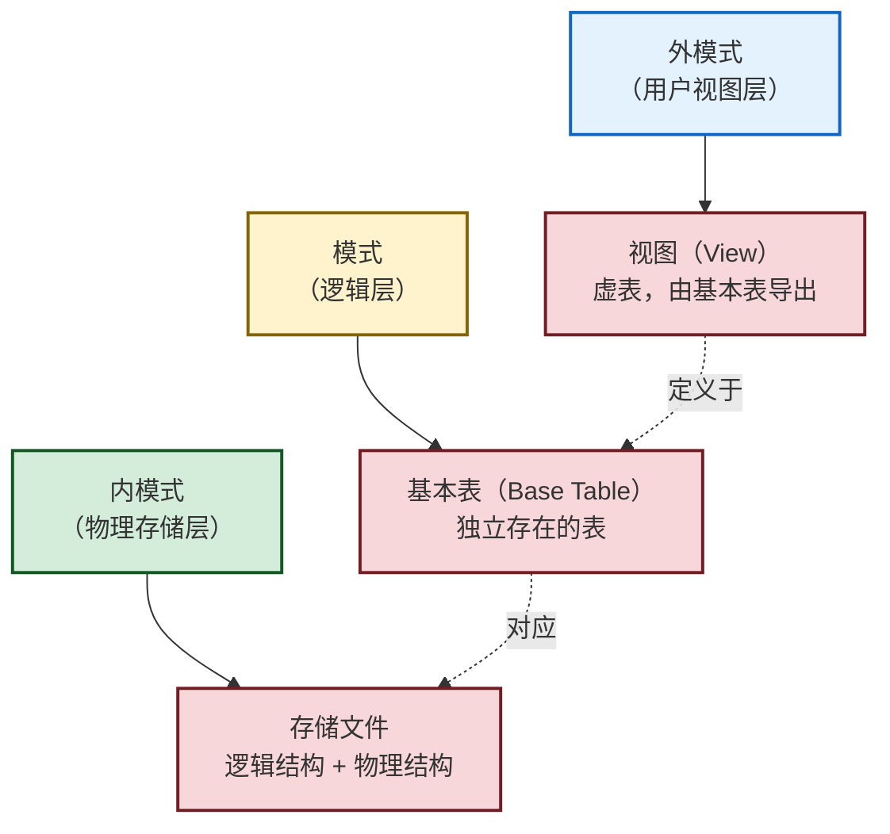

# 第3章 关系数据库标准语言SQL（3.1—3.2）

> [!abstract] 本节概述
> SQL（Structured Query Language，结构化查询语言）是关系数据库的标准语言。本笔记覆盖 **3.1 SQL 概述**（产生发展、特点、基本概念）和 **3.2 数据定义**（模式、基本表、索引的建立与删除、数据字典）。

> [!info] 本章完整结构
> 3.1 SQL 概述｜3.2 数据定义｜3.3 数据查询｜3.4 数据更新｜3.5 空值的处理｜3.6 视图

---

## 3.1 SQL 概述

SQL 是关系数据库的标准语言，功能包括数据查询、数据库模式创建、数据库数据的增删改、数据库安全性和完整性的定义与控制等。

### 3.1.1 SQL 的产生与发展

| 标准 | 篇幅（约）/页 | 发布日期/年 | 标准 | 大致页数 | 发布日期/年 |
| ---- | ------------ | ----------- | ---- | ------- | ----------- |
| SQL 86 | — | 1986 | SQL 2003 | 3 600 | 2003 |
| SQL 89（FIPS 127-1） | 120 | 1989 | SQL 2008 | 3 777 | 2008 |
| SQL 92 | 622 | 1992 | SQL 2011 | 3 817 | 2011 |
| SQL 99（SQL 3） | 1 700 | 1999 | SQL 2016 | 4 035 | 2016 |

> [!note] SQL 标准演进要点
> - **SQL 86 和 SQL 89** 是单个文档。
> - **SQL 92** 扩展为一系列开放的部分，增加了 SQL 调用接口、SQL 永久存储模块。
> - **SQL 99** 进一步扩展为框架、SQL 基础部分、SQL 调用接口、SQL 永久存储模块、SQL 宿主语言绑定、SQL 外部数据管理和 SQL 对象语言绑定等。
> - **SQL 2016** 扩展到 12 个部分，引入 XML 类型、Window 函数、`TRUNCATE` 操作、时序数据以及 JSON（JavaScript Object Notation）类型等。

> [!warning] 实际情况
> 目前，没有一个关系数据库管理系统能够支持 SQL 标准的所有概念和特性。不同数据库产品（如 MySQL、PostgreSQL、Oracle、SQL Server）对 SQL 标准的支持程度和扩展方式各不相同。

### 3.1.2 SQL 的特点

#### 1. 功能综合且风格统一

集**数据定义语言（DDL）**、**数据操纵语言（DML）**、**数据控制语言（DCL）** 功能于一体。可以独立完成数据库生命周期中的全部活动：

- 创建和删除数据库模式
- 创建基本表、创建视图
- 使用数据库（查询和增删改数据、事务处理等）
- 数据库控制（安全性控制、完整性控制和并发控制等）
- 数据库维护和重构（修改和删除基本表、数据库备份与恢复等）

用户在数据库投入运行后，可根据需要随时或逐步创建模式；数据操作符统一。

#### 2. 数据操纵高度非过程化

层次、网状模型的数据操纵语言面向过程，必须指定存取路径。SQL 只要提出"做什么"，无须了解存取路径。存取路径的选择以及 SQL 的操作过程由系统自动完成。

#### 3. 面向集合的操作方式

层次、网状模型采用面向记录的操作方式，操作对象是一条记录。SQL 采用集合操作方式：操作对象、查找结果可以是元组的集合；一次插入、删除、更新操作的对象也可以是元组的集合。

#### 4. 以统一的语法结构提供多种使用方式

SQL 是独立的语言，能够独立地用于联机交互的使用方式；同时也是嵌入式语言，能够嵌入到高级语言（如 C、C++、Java、Python）程序中，供程序员设计程序时使用。

#### 5. 语言简洁且易学易用

SQL 功能极强，但完成核心功能只用 9 个动词：

| SQL 功能 | 动词 |
| -------- | ---- |
| 数据定义 | `CREATE`，`DROP`，`ALTER` |
| 数据查询 | `SELECT` |
| 数据操纵 | `INSERT`，`UPDATE`，`DELETE` |
| 数据控制 | `GRANT`，`REVOKE` |

### 3.1.3 SQL 的基本概念

SQL 对关系数据库三级模式的支持：



> [!definition] 基本表（Base Table）
> - 本身独立存在的表。
> - 关系数据库管理系统中一个关系就对应一个基本表。
> - 一个或多个基本表对应一个存储文件。
> - 一个表可以带若干索引。

> [!definition] 存储文件（Storage File）
> - 逻辑结构和物理结构组成了关系数据库的**内模式**。
> - 物理文件结构由数据库管理系统设计确定，对用户透明。

> [!definition] 视图（View）
> - 从基本表或其他视图中导出的表。
> - 数据库中只存放视图的**定义**而不存放视图对应的**数据**。
> - 视图是一个**虚表**。
> - 用户可以在视图上再定义视图。

---

## 3.2 数据定义

SQL 的数据定义功能包括：数据库模式定义、表定义、视图和索引的定义。

| 操作对象 | 创建 | 删除 | 修改 |
| -------- | ---- | ---- | ---- |
| 数据库模式 | `CREATE SCHEMA` | `DROP SCHEMA` | *SQL 标准无修改语句 |
| 表 | `CREATE TABLE` | `DROP TABLE` | `ALTER TABLE` |
| 视图 | `CREATE VIEW` | `DROP VIEW` | — |
| 索引 | *`CREATE INDEX` | *`DROP INDEX` | *`ALTER INDEX` |

> [!note] 带星号（*）的操作
> 带 `*` 的索引操作（`CREATE INDEX`、`DROP INDEX`、`ALTER INDEX`）在 SQL 标准中已不建议使用，但大多数数据库产品仍支持。

> [!info] 数据库对象的层次化命名机制
> 关系数据库管理系统提供层次化的数据库对象命名机制：
> 
> **数据库**（有的系统称为目录）→ **模式** → **表以及视图、索引等**
> - 一个 RDBMS 实例（Instance）中可以建立多个数据库
> - 一个数据库中可以建立多个模式
> - 一个模式下通常包括多个表、视图和索引等数据库对象

### 3.2.1 模式的定义与删除

#### 1. 定义模式

> [!example] 例3.1
> 为用户 WANG 定义一个"学生选课"模式 S-C-SC：
> ```sql
> CREATE SCHEMA "S-C-SC" AUTHORIZATION WANG;
> ```

> [!example] 例3.2
> ```sql
> CREATE SCHEMA AUTHORIZATION WANG;
> ```
> 该语句没有指定模式名，模式名隐含为用户名 WANG。

> [!tip] 模式的本质
> 定义模式实际上定义了一个**命名空间**，在这个空间中可以定义该模式包含的数据库对象（基本表、视图、索引等）。在 `CREATE SCHEMA` 中可以接受 `CREATE TABLE`、`CREATE VIEW` 和 `GRANT` 子句。

**语句格式：**

```sql
CREATE SCHEMA <模式名> AUTHORIZATION <用户名>
  [<表定义子句>|<视图定义子句>|<授权定义子句>]
```

> [!example] 例3.3
> 为用户 ZHANG 创建一个模式 Test，并在其中定义一个表 Tab1：
> ```sql
> CREATE SCHEMA Test AUTHORIZATION Zhang
> CREATE TABLE Tab1 (
>     Col1 SMALLINT,
>     Col2 INT,
>     Col3 CHAR(20),
>     Col4 NUMERIC(10,3),
>     Col5 DECIMAL(5,2)
> );
> ```

#### 2. 删除模式

**语句格式：**

```sql
DROP SCHEMA <模式名> <CASCADE|RESTRICT>
```

> [!definition] CASCADE 与 RESTRICT
> - **`CASCADE`（级联）**：删除模式的同时把该模式中所有的数据库对象全部删除。
> - **`RESTRICT`（限制）**：如果该模式中定义了数据库对象（如表、视图等），则拒绝该删除语句的执行；仅当该模式中没有任何下属的对象时才能执行。

> [!example] 例3.4
> ```sql
> DROP SCHEMA Test CASCADE;
> ```
> 删除模式 Test，该模式中定义的表 Tab1 也被删除。

### 3.2.2 基本表的定义、删除与修改

#### 1. 定义基本表

**语句格式：**

```sql
CREATE TABLE <表名>
      (<列名> <数据类型> [<列级完整性约束>]
      [,<列名> <数据类型> [<列级完整性约束>]]
      …
      [,<表级完整性约束>] );
```

> [!note] 参数说明
> - **`<表名>`**：所要定义的基本表的名字
> - **`<列名>`**：组成该表的各个属性（列）
> - **`<列级完整性约束>`**：涉及相应属性列的完整性约束
> - **`<表级完整性约束>`**：涉及一个或多个属性列的完整性约束
> 
> 如果完整性约束涉及该表的多个属性列，则必须定义在表级上，否则既可以定义在列级也可以定义在表级。

> [!info] 学生选课数据库示例
> "学生选课"模式 S-C-SC 包含以下三个表（下划线属性为主码）：
> - **Student**(<u>Sno</u>, Sname, Ssex, Sbirthdate, Smajor)
> - **Course**(<u>Cno</u>, Cname, Ccredit, Cpno)
> - **SC**(<u>Sno, Cno</u>, Grade, Semester, Teachingclass)

> [!example] 例3.5：建立"学生"表 Student
> ```sql
> CREATE TABLE Student
>        (Sno   CHAR(8) PRIMARY KEY,        /* 列级完整性约束条件，Sno是主码 */
>         Sname VARCHAR(20) UNIQUE,         /* Sname取唯一值 */
>         Ssex  CHAR(6),
>         Sbirthdate Date,
>         Smajor VARCHAR(40)
>        );
> ```

> [!example] 例3.6：建立"课程"表 Course
> ```sql
> CREATE TABLE Course
>        (Cno     CHAR(5) PRIMARY KEY,
>         Cname   VARCHAR(40) NOT NULL,
>         Ccredit SMALLINT,
>         Cpno    CHAR(5),
>         FOREIGN KEY (Cpno) REFERENCES Course(Cno)
>        );
> ```
> `Cpno` 表示直接先修课，是外码；被参照表是 Course，被参照列是 Cno。

> [!example] 例3.7：建立"学生选课"表 SC
> ```sql
> CREATE TABLE SC
>        (Sno CHAR(8),
>         Cno CHAR(5),
>         Grade SMALLINT,            /* 成绩 */
>         Semester CHAR(5),          /* 开课学期 */
>         Teachingclass CHAR(8),     /* 学生选修某一门课所在的教学班 */
>         PRIMARY KEY (Sno, Cno),
>         /* 主码由两个属性构成，必须作为表级完整性进行定义 */
>         FOREIGN KEY (Sno) REFERENCES Student(Sno),
>         /* 表级完整性约束，Sno是外码，被参照表是Student */
>         FOREIGN KEY (Cno) REFERENCES Course(Cno)
>         /* 表级完整性约束，Cno是外码，被参照表是Course */
>        );
> ```

#### 2. 数据类型

SQL 中域的概念用数据类型来实现。定义表的属性时需要指明其数据类型及长度。选用哪种数据类型取决于：**取值范围**和**要做哪些运算**。

| 数据类型 | 含义 |
| -------- | ---- |
| `CHAR(n)`, `CHARACTER(n)` | 长度为 n 的定长字符串 |
| `VARCHAR(n)`, `CHARACTER VARYING(n)` | 最大长度为 n 的变长字符串 |
| `CLOB` | 字符串大对象 |
| `BLOB` | 二进制大对象 |
| `INT`, `INTEGER` | 整数（4 字节），取值范围 $[-2147483648, 2147483647]$ |
| `SMALLINT` | 短整数（2 字节），取值范围 $[-32768, 32767]$ |
| `BIGINT` | 大整数（8 字节），取值范围 $[-2^{63}, 2^{63}-1]$ |
| `NUMERIC(p, d)` | 定点数，由 p 位数字（不包括符号、小数点）组成，小数点后面有 d 位数字 |
| `DECIMAL(p,d)`, `DEC(p, d)` | 同 `NUMERIC` 类似，但数值精度不受 p 和 d 的限制 |
| `REAL` | 取决于机器精度的单精度浮点数 |
| `DOUBLE PRECISION` | 取决于机器精度的双精度浮点数 |
| `FLOAT(n)` | 可选精度的浮点数，精度至少为 n 位数字 |
| `BOOLEAN` | 逻辑布尔量 |
| `DATE` | 日期，包含年、月、日，格式为 `YYYY-MM-DD` |
| `TIME` | 时间，包含一日的时、分、秒，格式为 `HH:MM:SS` |
| `TIMESTAMP` | 时间戳类型 |
| `INTERVAL` | 时间间隔类型 |

#### 3. 模式与表

每一个基本表都属于某一个模式，一个模式包含多个基本表。定义基本表所属模式的方法：

> [!tip] 三种指定模式的方法
> **方法一**：在表名中明显地给出模式名
> ```sql
> CREATE TABLE "S-C-SC".Student(…);   /* Student所属的模式是S-C-SC */
> CREATE TABLE "S-C-SC".Course(…);    /* Course所属的模式是S-C-SC */
> CREATE TABLE "S-C-SC".SC(…);        /* SC所属的模式是S-C-SC */
> ```
> **方法二**：在创建模式语句中同时创建表（见例3.3）
> 
> **方法三**：设置所属的模式（搜索路径）

**搜索路径（SEARCH_PATH）**：

创建基本表（其他数据库对象）时，若没有指定模式，系统根据搜索路径来确定该对象所属的模式。RDBMS 会使用模式列表中第一个存在的模式作为数据库对象的模式名；若搜索路径中的模式名都不存在，系统将给出错误。

显示当前的搜索路径：

```sql
SHOW SEARCH_PATH;
```

搜索路径的当前默认值是：`$user, PUBLIC`。

数据库管理员用户可以设置搜索路径，然后定义基本表：

```sql
SET SEARCH_PATH TO "S-C-SC", PUBLIC;
CREATE TABLE Student(......);
```

建立 S-C-SC.Student 基本表——RDBMS 发现搜索路径中第一个模式名 S-C-SC，就把该模式作为基本表 Student 所属的模式。

#### 4. 修改基本表

**语句格式：**

```sql
ALTER TABLE <表名>
    [ADD [COLUMN] <新列名> <数据类型> [完整性约束]]
    [ADD <表级完整性约束>]
    [DROP [COLUMN] <列名> [CASCADE | RESTRICT]]
    [DROP CONSTRAINT <完整性约束名> [RESTRICT | CASCADE]]
    [RENAME COLUMN <列名> TO <新列名>]
    [ALTER COLUMN <列名> TYPE <数据类型>];
```

| 子句 | 说明 |
| ---- | ---- |
| `ADD COLUMN` | 增加新列、新的列级完整性约束和新的表级完整性约束 |
| `DROP COLUMN` | 删除表中的列。`CASCADE`：自动删除引用该列的其他对象；`RESTRICT`：若该列被其他对象引用则拒绝删除 |
| `DROP CONSTRAINT` | 删除指定的完整性约束 |
| `RENAME COLUMN` | 修改列名 |
| `ALTER COLUMN` | 修改列的数据类型 |

> [!example] 例3.8：向 Student 表增加"邮箱地址"列
> ```sql
> ALTER TABLE Student ADD Semail VARCHAR(30);
> ```
> > [!note] 不论基本表中原来是否已有数据，新增加的列一律为空值。

> [!example] 例3.9：修改列的数据类型
> ```sql
> ALTER TABLE Student ALTER COLUMN Sbirthdate TYPE VARCHAR(20);
> /* 注意，DATE类型占用19字节，所以修改为VARCHAR时长度要大于等于19 */
> ```

> [!example] 例3.10：增加唯一值约束
> ```sql
> ALTER TABLE Course ADD UNIQUE(Cname);
> ```

#### 5. 删除基本表

**语句格式：**

```sql
DROP TABLE <表名> [RESTRICT | CASCADE];
```

> [!definition] RESTRICT 与 CASCADE
> - **`RESTRICT`**：删除表是有限制的——欲删除的基本表不能被其他表的约束所引用；如果存在依赖该表的对象，则此表不能被删除。
> - **`CASCADE`**：删除该表没有限制——在删除基本表的同时，相关的依赖对象一起删除。

> [!example] 例3.11：删除 Student 表（CASCADE）
> ```sql
> DROP TABLE Student CASCADE;
> ```
> 基本表定义被删除，数据被删除；表上建立的索引、视图、触发器等一般也将被删除。

> [!example] 例3.12：RESTRICT 与 CASCADE 的对比
> 先在 Student 表上建立计算机科学与技术专业学生视图：
> ```sql
> CREATE VIEW CS_Student
> AS
> SELECT Sno, Sname, Ssex, Sbirthdate, Smajor
> FROM Student
> WHERE Smajor = '计算机科学与技术';
> ```
> 
> 选择 `RESTRICT` 删除：
> ```sql
> DROP TABLE Student RESTRICT;
> -- ERROR: cannot drop table Student because other objects depend on it
> /* 系统返回错误信息，存在依赖该表的对象，此表不能被删除 */
> ```
> 
> 选择 `CASCADE` 删除：
> ```sql
> DROP TABLE Student CASCADE;
> -- NOTICE: drop cascades to view CS_Student
> /* 系统返回提示，此表上的视图也被删除 */
> 
> SELECT * FROM CS_Student;
> -- ERROR: relation "CS_Student" does not exist
> /* CS_Student 视图不存在 */
> ```

### 3.2.3 索引的建立与删除

> [!abstract] 索引概述
> - **目的**：加快查询速度。
> - **常见类型**：顺序文件上的索引、B+树索引、哈希（hash）索引、位图索引。
> - **特点**：B+树索引具有动态平衡的优点；哈希索引具有查找速度快的特点。

> [!info] 索引的管理
> - **谁可以建立与删除**：数据库管理员或表的属主（即建立表的人）。
> - **谁维护**：RDBMS 自动完成。
> - **使用**：RDBMS 自动选择合适的索引作为存取路径，用户不必自主选择。

#### 1. 建立索引

**语句格式：**

```sql
CREATE [UNIQUE] [CLUSTER] INDEX <索引名>
ON <表名>(<列名> [<次序>] [,<列名> [<次序>]] …);
```

| 参数 | 说明 |
| ---- | ---- |
| `<表名>` | 要建索引的基本表的名字 |
| `<列名>` | 索引可以建立在该表的一列或多列上，各列名之间用逗号分隔 |
| `<次序>` | 指定索引值的排列次序：`ASC`（升序，默认）、`DESC`（降序） |
| `UNIQUE` | 此索引的每一个索引值只对应唯一的数据记录 |
| `CLUSTER` | 表示要建立的索引是聚簇索引 |

> [!example] 例3.13：为学生选课数据库建立索引
> Student 表按学生姓名升序建唯一索引，Course 表按课程名升序建唯一索引，SC 表按学号升序和课程号降序建唯一索引：
> ```sql
> CREATE UNIQUE INDEX Idx_StuSname ON Student(Sname);
> /* 保证了 Sname 取唯一值的约束 */
> 
> CREATE UNIQUE INDEX Idx_CouCname ON Course(Cname);
> /* 加上 Cname 取唯一值的约束 */
> 
> CREATE UNIQUE INDEX Idx_SCCno ON SC(Sno ASC, Cno DESC);
> /* 先按学号升序，对同一学号再按课程号降序 */
> ```

#### 2. 修改索引

**语句格式：**

```sql
ALTER INDEX <旧索引名> RENAME TO <新索引名>
```

> [!example] 例3.14
> ```sql
> ALTER INDEX Idx_SCCno RENAME TO Idx_SCSnoCno;
> ```

#### 3. 删除索引

**语句格式：**

```sql
DROP INDEX <索引名>;
```

> [!note] 删除索引时，系统会从数据字典中删去有关该索引的描述。

> [!example] 例3.15
> ```sql
> DROP INDEX Idx_StuSname;
> ```

> [!tip] 兼容性提示
> `ALTER INDEX ... RENAME TO` 语法仅PostgreSQL支持，MySQL不支持该标准语法，不同数据库产品索引操作存在差异。

### 3.2.4 数据字典

> [!definition] 数据字典（Data Dictionary）
> 数据字典是 RDBMS 内部的一组系统表，记录了数据库中所有定义信息：
> - 关系模式定义
> - 视图定义
> - 索引定义
> - 完整性约束定义
> - 各类用户对数据库的操作权限
> - 统计信息等

> [!info] 数据字典的作用
> 1. RDBMS 在执行 SQL 的数据定义语句时，就是在更新数据字典表中的相应信息。
> 2. 查询优化和查询处理时，RDBMS 要根据数据字典中的信息执行处理算法和优化算法。
