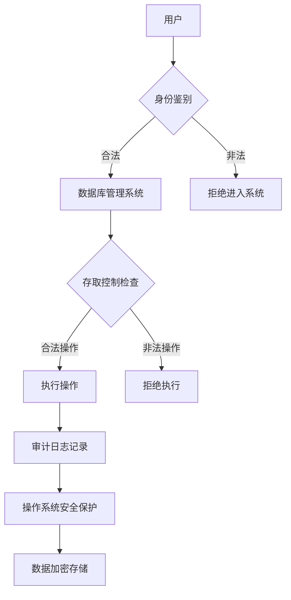
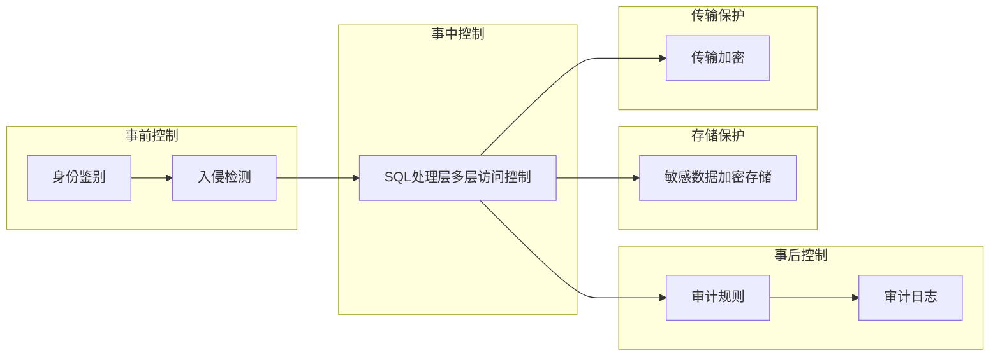
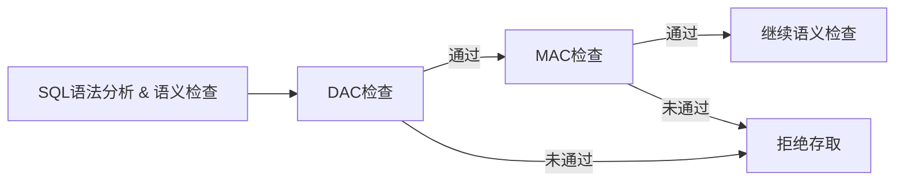

# 第4章 数据库安全性

> [!abstract] 问题提出
> 数据库的一大特点是数据可以共享，数据共享必然带来数据库的安全性问题。数据库系统中的数据共享不能是无条件的共享。例如：军事秘密、国家机密、新产品实验数据、市场需求分析、市场营销策略、销售计划、客户档案、医疗档案、银行储蓄数据等。

> [!info] 本章导读
> 数据库的安全性问题和计算机系统的安全性紧密联系。计算机系统的安全性问题可分技术安全类、管理安全类和政策法律类三大类安全性问题。本章讨论数据库技术安全类问题，即从技术上如何保证数据库系统的安全性。

本章内容：4.1 数据库安全性概述、4.2 数据库安全性控制、4.3 视图机制、4.4 审计、4.5 数据加密、4.6 其他安全性保护。

## 4.1 数据库安全性概述

数据库的安全性是指保护数据库以防止不合法使用所造成的数据泄露、篡改或破坏。数据成为一个部门、企业、乃至一个国家的重要资源，系统安全保护措施是否有效是数据库系统主要的性能指标之一。

### 4.1.1 数据库的不安全因素

数据库的安全性事故频发：2016年初某国家一所医院的计算机系统遭到黑客入侵，黑客将医院计算机系统中的数据进行加密，并向医院索要三百四十万美金来解锁这些数据信息；截止到2016年12月，总共有数十家医院遭受过勒索软件的侵害。

#### 1. 非授权用户对数据库的恶意存取和破坏

- 一些黑客（hacker）和犯罪分子在用户存取数据库时猎取用户名和用户口令，然后假冒合法用户偷取、修改甚至破坏用户数据。
- 有的黑客还故意锁定并修改数据，进行勒索和破坏等犯罪活动。
- 必须阻止有损数据库安全的非法操作。

#### 2. 数据库中重要或敏感的数据被泄露

- 黑客和敌对分子千方百计盗窃数据库中的重要敏感的机密数据，造成数据泄露。
- SQL注入：攻击者利用SQL注入技术，在入侵检测不严的情况下欺骗数据库服务器执行非授权的查询和操作，使得机密数据被泄露、篡改或锁定。

#### 3. 安全环境的脆弱性

- 数据库的安全性与计算机系统的安全性紧密联系：计算机硬件、操作系统、网络系统等的安全性。
- 需要建立一套可信（trusted）计算机系统的概念和标准。

### 4.1.2 安全标准简介

> [!info] 发展历程
> - 1985年美国国防部（DoD）正式颁布《DoD可信计算机系统评估准则》（简称TCSEC或DoD85）。
> - 1991年，颁布TCSEC/TDI，把TCSEC扩展到数据库系统。
> - 1993年起多个国家组织专门委员会开发了IT安全通用准则（Common Criteria，CC）。
> - 1999年CC V2.1版被ISO采用为国际标准。
> - 2001年CC V2.1版被我国采用为国家标准。

#### TCSEC/TDI安全级别划分

4组（division）7个等级：D、C（C1，C2）、B（B1，B2，B3）、A（A1），系统可靠或可信程度逐渐增高。

| 安全级别 | 定义 |
| --- | --- |
| A1 | 验证设计（verified design） |
| B3 | 安全域（security domains） |
| B2 | 结构化保护（structural protection） |
| B1 | 标记安全保护（labeled security protection） |
| C2 | 受控的存取保护（controlled access protection） |
| C1 | 自主安全保护（discretionary security protection） |
| D | 最小保护（minimal protection） |

各级别含义：

- **D级**：该级是最低级别，将一切不符合更高标准的系统都归于D组。
- **C1级**：非常初级的自主安全保护。能够实现对用户和数据的分离，进行自主存取控制（DAC），保护或限制用户权限的传播。
- **C2级**：安全产品的最低档。提供受控的存取保护，将C1级的DAC进一步细化，以个人身份注册负责，并实施审计和资源隔离。
- **B1级**：标记安全保护。对系统的数据加以标记，对标记的主体和客体实施强制存取控制（MAC）、审计等安全机制。被认为是真正意义上的安全产品，多冠以"安全"（security）或"可信的"（trusted）产品。
- **B2级**：结构化保护。建立形式化的安全策略模型，并对系统内的所有主体和客体实施DAC和MAC。
- **B3级**：安全域。该级的TCB必须满足访问监控器的要求，审计跟踪能力更强，并提供系统恢复过程。
- **A1级**：验证设计，即提供B3级保护的同时给出系统的形式化设计说明和验证，以确信各安全保护真正实现。

TDI从四个方面来描述安全性级别划分的指标：安全策略、责任、保证、文档。

#### CC（通用准则）

- 1999年被ISO采用为国际标准。
- 根据系统对安全保证要求的支持情况提出了评估保证级（Evaluation Assurance Level，EAL），从EAL1至EAL7共分为7级，按保证程度逐渐增高。

CC评估保证级（EAL）的划分及与TCSEC/TDI安全级别的对应：

| 评估保证级 | 定义 | TCSEC安全级别（近似相当） |
| --- | --- | --- |
| EAL1 | 功能测试（functionally tested） | |
| EAL2 | 结构测试（structurally tested） | C1 |
| EAL3 | 系统地测试和检查（methodically tested and checked） | C2 |
| EAL4 | 系统地设计、测试和复查（methodically designed, tested, and reviewed） | B1 |
| EAL5 | 半形式化设计和测试（semiformally designed and tested） | B2 |
| EAL6 | 半形式化验证的设计和测试（semiformally verified design and tested） | B3 |
| EAL7 | 形式化验证的设计和测试（formally verified design and tested） | A1 |

## 4.2 数据库安全性控制

计算机系统中，安全措施是一级一级层层设置的。



各层安全措施：

- 系统根据用户标识鉴定用户身份，合法用户才准许进入计算机系统。
- 数据库管理系统要执行安全保护，包括多种存取机制，目的是只允许用户执行合法操作。
- 用户退出系统后根据情况进行安全审计。
- 操作系统有自己的保护措施。
- 对敏感数据在传输过程中要进行加密保护，最后还应以密码形式存储到数据库中。



**数据库管理系统的安全性控制模型：**

1. **事前控制**：通过身份鉴别和入侵检测共同实现
2. **事中控制**：在SQL处理层提供多层访问控制
3. **事后控制**：配置审计规则，对用户访问行为和系统关键操作进行审计
4. **存储保护**：在数据存储层，对敏感数据、重要的存储过程定义加密存储
5. **传输保护**：提供了传输加密功能

本节内容：4.2.1 用户身份鉴别、4.2.2 存取控制、4.2.3 自主存取控制方法、4.2.4 授权与收回对数据的操作权限、4.2.5 数据库角色、4.2.6 强制存取控制方法。

### 4.2.1 用户身份鉴别

- 用户身份鉴别是系统提供的最外层安全保护措施。
- 用户标识：由用户名和用户标识号组成，用户标识号在系统整个生命周期内唯一。

**用户身份鉴别的方法：**

#### 1. 静态口令鉴别

- 静态口令一般由用户自己设定，这些口令静态不变，方式简单，易被攻击，安全性较低。
- 可采用双因子鉴别，即口令+数字证书。
- 提供一套口令策略。
- 用户身份鉴别可以重复多次。

#### 2. 动态口令鉴别

- 口令是动态变化的，采用一次一密的方法。
- 常用的方式：验证码和动态令牌方式。
- 安全性相对高一些。

#### 3. 生物特征鉴别

- 通过生物特征进行认证的技术，生物特征如指纹、虹膜和掌纹等。
- 安全性较高。

#### 4. 智能卡鉴别

- 智能卡是一种不可复制的硬件，内置集成电路的芯片，具有硬件加密功能。
- 智能卡读取数据是静态的，通过内存扫描或网络监听等技术可能截取到用户的身份验证信息，存在安全隐患。
- 实际应用中一般采用个人身份识别码（Personal Identification Number，PIN）和智能卡相结合方式。

#### 5. 入侵检测

- 检测前，管理员按实际需求定义检测规则。
- 检测中，实时进行入侵分析。
- 发现入侵情况，实时进行处理：通过邮件报警和断开会话连接、锁定用户进行处罚等。

### 4.2.2 存取控制

> [!definition] 存取控制机制组成
> 1. **定义用户权限，并将用户权限登记到数据字典中**
>    - 用户对某一数据对象的操作权力称为权限。
>    - 数据库管理系统提供适当的语言来定义用户权限，存放在数据字典中，称做安全规则或授权规则。
> 2. **合法权限检查**
>    - 用户发出存取数据库操作请求，数据库管理系统查找数据字典，进行合法权限检查。

用户权限定义和合法权限检查机制一起组成了数据库管理系统的存取控制子系统。

> [!info] 常用存取控制方法
> 1. **自主存取控制（Discretionary Access Control，DAC）**——C2级
>    - 用户对不同的数据对象有不同的存取权限
>    - 不同的用户对同一对象也有不同的权限
>    - 用户还可将其拥有的存取权限转授给其他用户
> 2. **强制存取控制（Mandatory Access Control，MAC）**——B1级
>    - 每一个数据对象被标以一定的密级
>    - 每一个用户也被授予某一个级别的许可证
>    - 对于任意一个对象，只有具有合法许可证的用户才可以存取

### 4.2.3 自主存取控制方法

- 通过SQL的GRANT语句和REVOKE语句实现。
- 用户权限组成：数据库对象 + 操作类型。
- 定义用户存取权限：定义用户可以在哪些数据库对象上进行哪些类型的操作。定义存取权限称为授权。

关系数据库系统中不同对象具有的主要存取权限：

| 对象类型 | 对象 | 操作类型 |
| --- | --- | --- |
| 数据库和模式 | 数据库和模式 | CREATE |
| 数据库和模式 | 基本表 | CREATE TABLE，ALTER TABLE |
| 数据库和模式 | 视图 | CREATE VIEW |
| 数据库和模式 | 索引 | CREATE INDEX |
| 数据 | 基本表和视图 | SELECT，INSERT，UPDATE，DELETE，REFERENCES，ALL PRIVILEGES |
| 数据 | 属性列 | SELECT，INSERT，UPDATE，REFERENCES，ALL PRIVILEGES |

### 4.2.4 授权与收回对数据的操作权限

#### 1. GRANT

GRANT语句的一般格式：

```sql
GRANT <权限>[,<权限>]...
ON <对象类型> <对象名>[,<对象类型> <对象名>]…
TO <用户>[,<用户>]...
[WITH GRANT OPTION];
```

语义：将对指定操作对象的指定操作权限授予指定的用户。

> [!note] 发出GRANT的用户
> 数据库管理员、数据库对象创建者（即属主owner）、拥有该权限的用户。

> [!note] 接受权限的用户
> 一个或多个具体用户、PUBLIC（即全体用户）。

> [!note] WITH GRANT OPTION子句
> - 指定：可以再授予。
> - 没有指定：不能传播。
> - 不允许循环授权。

> [!example] 例4.1
> 把查询Student表权限授给用户U1：
> ```sql
> GRANT SELECT
> ON TABLE Student
> TO U1;
> ```

> [!example] 例4.2
> 把对Student表和Course表的全部操作权限授予用户U2和U3：
> ```sql
> GRANT ALL PRIVILIGES
> ON TABLE Student, Course
> TO U2, U3;
> ```

> [!example] 例4.3
> 把对表SC的查询权限授予所有用户：
> ```sql
> GRANT SELECT
> ON TABLE SC
> TO PUBLIC;
> ```

> [!example] 例4.4
> 把查询Student表和修改学生学号的权限授给用户U4：
> ```sql
> GRANT UPDATE(Sno), SELECT
> ON TABLE Student
> TO U4;
> ```
> 对属性列授权时必须明确指出相应属性列名。

> [!example] 例4.5
> 把对表SC的INSERT权限授予U5用户，并允许将此权限再授予其他用户：
> ```sql
> GRANT INSERT
> ON TABLE SC
> TO U5
> WITH GRANT OPTION;
> ```
> 执行例4.5后，U5不仅拥有了对表SC的INSERT权限，还可以传播此权限。

> [!example] 例4.6
> U5将INSERT权限授予U6，并允许其再传播：
> ```sql
> GRANT INSERT
> ON TABLE SC
> TO U6
> WITH GRANT OPTION;
> ```

> [!example] 例4.7
> 同样，U6还可以将此权限授予U7：
> ```sql
> GRANT INSERT
> ON TABLE SC
> TO U7;
> ```
> 但U7不能再传播此权限。

执行了例4.1~例4.7语句后学生选课数据库的用户权限定义：

| 授权用户名 | 被授权用户名 | 数据库对象名 | 允许的操作类型 | 能否转授权 |
| --- | --- | --- | --- | --- |
| DBA | U1 | 关系Student | SELECT | 不能 |
| DBA | U2 | 关系Student | ALL | 不能 |
| DBA | U2 | 关系Course | ALL | 不能 |
| DBA | U3 | 关系Student | ALL | 不能 |
| DBA | U3 | 关系Course | ALL | 不能 |
| DBA | PUBLIC | 关系SC | SELECT | 不能 |
| DBA | U4 | 关系Student | SELECT | 不能 |
| DBA | U4 | 属性列Student.Sno | UPDATE | 不能 |
| DBA | U5 | 关系SC | INSERT | 能 |
| U5 | U6 | 关系SC | INSERT | 能 |
| U6 | U7 | 关系SC | INSERT | 不能 |

#### 2. REVOKE

授予的权限可以由数据库管理员或其他授权者用REVOKE语句收回。REVOKE语句的一般格式为：

```sql
REVOKE <权限>[,<权限>]...
ON <对象类型> <对象名>[,<对象类型> <对象名>]…
FROM <用户>[,<用户>]... [CASCADE | RESTRICT];
```

- 指定了CASCADE，则级联收回授予的权限。
- 指定了RESTRICT，如果转授了权限，则不能收回。
- 默认值为RESTRICT。

> [!example] 例4.8
> 把用户U4修改学生学号的权限收回：
> ```sql
> REVOKE UPDATE(Sno)
> ON TABLE Student
> FROM U4;
> ```

> [!example] 例4.9
> 收回所有用户对表SC的查询权限：
> ```sql
> REVOKE SELECT
> ON TABLE SC
> FROM PUBLIC;
> ```

> [!example] 例4.10
> 把用户U5对SC表的INSERT权限收回：
> ```sql
> REVOKE INSERT
> ON TABLE SC
> FROM U5 CASCADE;
> ```
> 将用户U5的INSERT权限收回，同时级联也收回了U6和U7的INSERT权限。如果U6或U7还从其他用户处获得对SC表的INSERT权限，则他们仍具有此权限，系统只收回直接或间接从U5处获得的权限。

执行例4.8~4.10语句后"学生选课"数据库的用户权限定义：

| 授权用户名 | 被授权用户名 | 数据库对象名 | 允许的操作类型 | 能否转授权 |
| --- | --- | --- | --- | --- |
| DBA | U1 | 关系Student | SELECT | 不能 |
| DBA | U2 | 关系Student | ALL | 不能 |
| DBA | U2 | 关系Course | ALL | 不能 |
| DBA | U3 | 关系Student | ALL | 不能 |
| DBA | U3 | 关系Course | ALL | 不能 |
| DBA | U4 | 关系Student | SELECT | 不能 |

> [!note] SQL灵活的授权机制
> - 数据库管理员：拥有所有对象的所有权限，根据实际情况把不同的权限授予不同的用户。
> - 用户：拥有自己建立的对象的全部的操作权限，可以使用GRANT把权限授予其他用户。
> - 被授权的用户：如果具有WITH GRANT OPTION的许可，可以把获得的权限再授予其他用户。
> - 所有授予出去的权力在必要时又都可用REVOKE语句收回。

#### 3. 创建数据库的权限

创建数据库也需要进行安全控制，也是要授权。以金仓数据库KingbaseES为例：用CREATE USER语句建立超级用户，再由超级用户创建具有CREATE数据库权限的用户。

CREATE USER语句格式：

```sql
CREATE USER <username> [WITH]
[SUPERUSER | CREATEDB]
| PASSWORD 'password';
```

格式说明：

- 具有SUPERUSER权限的用户是系统的超级用户，可以执行任何操作。
- 具有CREATEDB权限的用户可以创建数据库，成为数据库的属主（Owner），具有在数据库上创建模式（schema）的权限，并可以把这些权限授予其他用户。
- 第一个超级用户是系统初始化时指定的。在安装系统时可以指定一个名称为system的超级用户。

> [!example] 例4.11
> 创建超级用户system2。首先以超级用户system登录，然后创建system2：
> ```sql
> CREATE USER system2
> WITH SUPERUSER
> PASSWORD '123456';
> ```

> [!example] 例4.12
> 创建具有CREATEDB权限的用户U1和普通用户U2。以超级用户system登录，创建用户U1、U2：
> ```sql
> CREATE USER U1
> WITH CREATEDB
> PASSWORD '123456';     /*U1具有创建数据库的权限*/
>
> CREATE USER U2
> PASSWORD '123456';     /*U2是普通用户*/
> ```

> [!example] 例4.13
> 创建数据库U1DB。以U1用户登录，创建数据库U1DB：
> ```sql
> CREATE DATABASE U1DB;     /*U1创建了数据库*/
> ```
> U1成为数据库U1DB的属主，U1可以在U1DB数据库上创建SCHEMA。

### 4.2.5 数据库角色

> [!definition] 数据库角色
> 被命名的一组与数据库操作相关的权限。角色是权限的集合。可以为一组具有相同权限的用户创建一个角色，可以简化授权的过程。

**1. 角色的创建：**

```sql
CREATE ROLE <角色名>
```

**2. 给角色授权：**

```sql
GRANT <权限>[,<权限>]…
ON <对象类型> <对象名>
TO <角色>[,<角色>]…
```

**3. 将一个角色授予其他的角色或用户：**

```sql
GRANT <角色1>[,<角色2>]…
TO <角色3>[,<用户1>]…
[WITH ADMIN OPTION]
```

- 该语句把角色授予某用户，或授予另一个角色。
- 授予者是角色的创建者或拥有在这个角色上的ADMIN OPTION权限者。
- 指定了WITH ADMIN OPTION可以把权限授予其他角色。
- 一个角色的权限：直接授予这个角色的全部权限加上其他角色授予这个角色的全部权限。

**4. 角色权限的收回：**

```sql
REVOKE <权限>[,<权限>]…
ON <对象类型> <对象名>
FROM <角色>[,<角色>]…
```

- 用户可以回收角色的权限，从而修改角色拥有的权限。
- REVOKE执行者是：角色的创建者、拥有在这个（些）角色上的WITH ADMIN OPTION权限者。

> [!example] 例4.14
> 通过角色来实现将一组权限授予一个用户。步骤如下：
>
> （1）首先创建一个角色R1：
> ```sql
> CREATE ROLE R1;
> ```
> （2）然后使用GRANT语句，使角色R1拥有Student表的SELECT、UPDATE、INSERT权限：
> ```sql
> GRANT SELECT, UPDATE, INSERT
> ON TABLE Student
> TO R1;
> ```
> （3）将这个角色授予王平、张明、赵玲，使他们具有角色R1所包含的全部权限：
> ```sql
> GRANT R1
> TO 王平, 张明, 赵玲;
> ```
> （4）一次性通过R1来回收王平的这三个权限：
> ```sql
> REVOKE R1
> FROM 王平;
> ```

> [!example] 例4.15
> 给角色增加新的权限：
> ```sql
> GRANT DELETE
> ON TABLE Student
> TO R1;
> ```
> 使角色R1增加了Student表的DELETE权限。

> [!example] 例4.16
> 减少角色的权限：
> ```sql
> REVOKE SELECT
> ON TABLE Student
> FROM R1;
> ```
> 使R1减少了SELECT权限。

### 4.2.6 强制存取控制方法

> [!warning] 自主存取控制缺点
> 可能存在数据的"无意泄露"。原因是这种机制仅仅通过对数据的存取权限来进行安全控制，而数据本身并无安全性标记。解决：对系统控制下的所有主客体实施强制存取控制策略。

> [!definition] 强制存取控制（MAC）
> - 保证更高程度的安全性。
> - 用户不能直接感知或进行控制。
> - 适用于对数据有严格而固定密级分类的部门，如军事部门、政府部门。

**主体和客体：** 在MAC中，数据库管理系统所管理的全部实体分为主体和客体两大类：

- 主体是系统中的活动实体：数据库管理系统所管理的实际用户、代表用户的各进程。
- 客体是系统中的被动实体，受主体操纵：文件、基本表、索引、视图等。

**敏感度标记（label）：**

- 对于主体和客体，数据库管理系统为它们每个实例（值）指派一个敏感度标记（label）。
- 敏感度标记分成若干级别：绝密（top secret，TS）、机密（secret，S）、可信（confidential，C）、公开（public，P）。TS >= S >= C >= P。
- 主体的敏感度标记称为许可证级别；客体的敏感度标记称为密级。

> [!definition] 强制存取控制规则
> 1. 仅当主体的许可证级别大于或等于客体的密级时，该主体才能读取相应的客体。
> 2. 仅当主体的许可证级别小于或等于客体的密级时，该主体才能写相应的客体。
>
> 共同点：均禁止了拥有高许可证级别的主体更新低密级的数据对象，从而防止了敏感数据的泄露。

**MAC的特点：**

- 强制存取控制（MAC）是对数据本身进行密级标记，无论数据如何复制，标记与数据是一个不可分的整体，只有符合密级标记要求的用户才可以操纵数据。
- 实现MAC时要首先实现DAC，原因：较高安全性级别提供的安全保护要包含较低级别的所有保护。
- DAC与MAC共同构成数据库管理系统的安全机制。



先进行自主存取控制（DAC）检查，通过DAC检查的允许存取的数据对象，再由系统自动进行MAC检查，只有通过MAC检查的数据对象方可存取。

## 4.3 视图机制

- 通过视图机制，把要保密的数据对无权存取这些数据的用户隐藏起来，对数据提供一定程度的安全保护。
- 视图机制配合授权机制，间接地实现支持存取谓词的用户权限定义。

> [!example] 例4.17
> 建立计算机科学与技术专业学生的视图，把对该视图的SELECT权限授予王平，把该视图上的所有操作权限授予张明。
>
> 先建立视图CS_Student：
> ```sql
> CREATE VIEW CS_Student
> AS
> SELECT *
> FROM Student
> WHERE Smajor='计算机科学与技术'
> WITH CHECK OPTION;
> /*对该视图进行增删改时，必须满足Smajor='计算机科学与技术'的条件*/
> ```
> 在视图上进一步定义存取权限：
> ```sql
> GRANT SELECT          /*王平老师只能检索计算机科学与技术学生的信息*/
> ON CS_Student
> TO 王平;
>
> GRANT ALL PRIVILIGES  /*专业负责人张明具有检索和增删改该视图的所有权限*/
> ON CS_Student
> TO 张明;
> ```

## 4.4 审计

> [!definition] 审计
> - 启用一个专用的审计日志（Audit Log），把用户对数据库的所有操作自动记录放入审计日志。
> - 审计员利用审计日志监控数据库中的各种行为，找出非法存取数据的人、时间和内容。
> - C2以上安全级别的数据库管理系统必须具有审计功能。

> [!note] 审计功能的可选性
> - 审计很费时间和空间。
> - DBA可以根据应用对安全性的要求，灵活地打开或关闭审计功能。
> - 审计功能主要用于安全性要求较高的部门。

### 1. 审计事件

- **服务器事件**：审计数据库服务器发生的事件。
- **系统权限**：对系统拥有的结构或模式对象进行操作的审计，要求该操作的权限是通过系统权限获得的。
- **语句事件**：对SQL语句，如DDL、DML及DCL语句的审计。
- **模式对象事件**：对特定模式对象上进行的SELECT或DML操作的审计。

### 2. 审计功能

基本功能：

- 提供多种审计查阅方式。
- 多套审计规则：一般在初始化设定。
- 提供审计分析和报表功能。
- 审计日志管理功能：防止审计员误删审计记录，审计日志必须先转储后删除；对转储的审计记录文件提供完整性和保密性保护；只允许审计员查阅和转储审计记录，不允许任何用户新增和修改审计记录等。
- 提供查询审计设置及审计记录信息的专门视图。

### 3. AUDIT语句和NOAUDIT语句

- AUDIT语句：设置审计功能。
- NOAUDIT语句：取消审计功能。

**审计级别：**

- 用户级审计：任何用户可设置的审计，用户针对自己创建的数据库表和视图进行审计。
- 系统级审计：只能由数据库管理员设置，监测成功或失败的登录要求、监测授权和收回操作以及其他数据库级权限下的操作。

> [!example] 例4.18
> 对修改SC表结构或修改SC表数据的操作进行审计：
> ```sql
> /*(1)先显示当前审计开关状态*/
> SHOW AUDIT_TRAIL;
> /*(2)打开审计开关*/
> SET AUDIT_TRAIL TO ON;
> /*(3)对SC表设置审计*/
> AUDIT ALTER, UPDATE ON SC BY ACCESS;
> ```

> [!example] 例4.19
> 取消对SC表的ALTER和UPDATE操作审计：
> ```sql
> NOAUDIT ALTER, UPDATE ON SC;
> ```
> 审计设置以及审计日志一般都存储在数据字典中。必须把审计开关打开，才可以在系统表SYS_AUDITTRAIL中查看到审计信息。

## 4.5 数据加密

> [!definition] 数据加密
> 防止数据库中数据在存储和传输中失密的有效手段。
>
> - 加密的基本思想：根据一定的算法将原始数据——明文（plain text）经过一系列复杂计算，变换为不可直接识别的格式——密文（cipher text）。
> - 加密方法：存储加密、传输加密。

### 1. 存储加密

**透明存储加密：**

- 内核级加密保护方式，对用户完全透明。
- 数据在写到磁盘时对数据进行加密，授权用户读取数据时再对其进行解密。
- 数据库的应用程序不需要做任何修改，只需在创建表语句中说明需加密的字段即可。
- 内核级加密方法：性能较好，安全性较高。

**非透明存储加密：** 通过多个加密函数实现。

### 2. 传输加密

**链路加密：**

- 在链路层进行加密。
- 传输信息由报头和报文两部分组成，报文和报头均加密。

**端到端加密：**

- 在发送端加密，接收端解密。
- 只加密报文，不加密报头。
- 发送端和接收端需要密码设备，中间节点不需要密码设备。
- 所需密码设备相对较少，容易被非法监听者获取敏感信息。


> [!info] 基于安全套接层协议SSL传输方案的实现思路
> 1. **确认通信双方端点的可靠性**：采用基于数字证书的服务器和客户端认证方式。通信时均首先向对方提供己方证书，然后使用本地的CA信任列表和证书撤销列表对接收到的对方证书进行验证。
> 2. **协商加密算法和密钥**：确认双方端点的可靠性后，通信双方协商本次会话的加密算法与密钥，利用公钥基础设施方式。
> 3. **可信数据传输**：业务数据在被发送之前将被用某一组特定的密钥进行加密和消息摘要计算，以密文形式在网络上传输；当业务数据被接收的时候，需用相同一组特定的密钥进行解密和摘要计算。特定的密钥是由通信双方磋商决定的，为且仅为双方共享；会话密钥的生命周期仅限于本次通信。

**数据加密算法：**

- 对称加密算法：AES算法
- 非对称加密算法：RSA算法
- 数据库管理系统特定的加密算法

> [!note] 数据加密优缺点
> - 优点：数据安全性进一步提高。
> - 缺点：增加查询处理复杂性，查询效率受到影响。

## 4.6 其他安全性保护

### 1. 推理控制

- 处理强制存取控制未解决的问题。
- 避免用户利用能够访问的数据推知更高密级的数据。
- 常用方法：基于函数依赖的推理控制、基于敏感关联的推理控制。

### 2. 隐蔽信道

处理强制存取控制未解决的问题。

### 3. 数据隐私

- 控制不愿他人知道或他人不便知道的个人数据的能力。
- 范围很广：数据收集、数据存储、数据处理和数据发布等各个阶段。

### 4. "三权分立"的安全管理机制

解决数据库管理员权限过于集中的问题，遵照GB/T 20273-2019，引进"三权分立"的安全管理机制。

## 本章小结

> [!summary] 第4章要点
> - 数据库应用的日益广泛，计算机网络的发展，数据的安全保密越来越重要。
> - 数据库管理系统是管理数据的核心，因而其自身必须具有一整套完整而有效的安全性机制。
>
> **实现数据库系统安全性的技术和方法：**
> - 用户身份鉴别
> - 入侵检测
> - 存取控制技术：自主存取控制和强制存取控制
> - 视图技术
> - 审计技术
> - 数据存储加密和传输加密

大数据技术、云计算技术、移动互联、物联网、区块链等推动了数据库新技术的发展和应用，数据库安全性面临新的挑战，如云数据存储服务安全可信技术、分布数据访问控制技术、隐私保护统计数据发布技术等。
