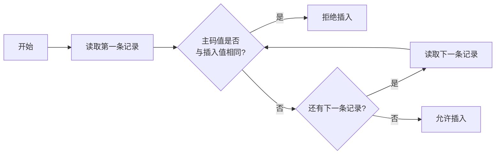

# 第5章 数据库完整性

本章内容：5.1 数据库完整性概述、5.2 实体完整性、5.3 参照完整性、5.4 用户定义的完整性、5.5 完整性约束命名子句、\*5.6 域的完整性限制、5.7 触发器。

## 5.1 数据库完整性概述

> [!definition] 数据库的完整性
> - **数据的正确性**：数据符合现实世界语义，反映了当前的实际状况。
> - **数据的相容性**：数据库同一对象在不同关系表中的数据是相同的。

例如：学生的学号必须唯一；百分制的课程成绩取值范围为0-100；学生所选的课程必须是学校开设的课程；学生所在的院系必须是学校已成立的院系等。

> [!info] 数据的完整性和数据库的安全性
> 两者有联系又不尽相同：
>
> | | 数据的完整性 | 数据的安全性 |
> | --- | --- | --- |
> | 目的 | 防止数据库中存在不符合语义的数据，防止数据库中存在不正确的数据 | 保护数据库防止恶意的破坏和非法的存取 |
> | 防范对象 | 不合语义的、不正确的数据 | 非法用户和非法操作 |

> [!note] 为维护数据库的完整性，关系数据库管理系统必须
> 1. **提供定义完整性约束的机制**
>    - 完整性约束也称为完整性规则，是数据库中的数据必须满足的语义约束。
>    - SQL标准使用了一系列概念来描述完整性，包括关系模型的实体完整性、参照完整性和用户定义完整性。
>    - 这些完整性约束一般由SQL的数据定义语言语句来实现。
> 2. **提供检查完整性约束的方法**
>    - 关系数据库管理系统中检查数据是否满足完整性约束的机制称为完整性检查。
>    - 一般在INSERT、UPDATE、DELETE语句执行后开始检查，也可以在事务提交时检查。
> 3. **提供完整性的违约处理方法**
>    - 关系数据库管理系统若发现用户的操作违背了完整性约束，就采取一定的动作：拒绝（NO ACTION）执行该操作，或级联（CASCADE）执行其他操作。

## 5.2 实体完整性

### 5.2.1 定义实体完整性

关系模型的实体完整性在CREATE TABLE中用PRIMARY KEY定义：

- 单属性构成的码有两种说明方法：定义为列级约束条件、定义为表级约束条件。
- 对多个属性构成的码只有一种说明方法：定义为表级约束条件。

> [!example] 例5.1
> 创建学生表Student，将Sno属性定义为主码：
> ```sql
> CREATE TABLE Student
>       (Sno  CHAR(8) PRIMARY KEY,     /*在列级定义主码*/
>        Sname CHAR(20) UNIQUE,
>        Ssex  CHAR(6),
>        Sbirthdate Date,
>        Smajor VARCHAR(40)
>       );
> ```
> 或者在表级定义主码：
> ```sql
> CREATE TABLE Student
>       (Sno  CHAR(8),
>        Sname CHAR(20) UNIQUE,
>        Ssex  CHAR(6),
>        Sbirthdate Date,
>        Smajor VARCHAR(40),
>        PRIMARY KEY (Sno)              /*在表级定义主码*/
>       );
> ```

> [!example] 例5.2
> 创建SC表，将(Sno, Cno)属性组定义为主码：
> ```sql
> CREATE TABLE SC
>       (Sno  CHAR(8),
>        Cno  CHAR(5),
>        Grade SMALLINT,
>        Semester CHAR(5),              /*开课学期*/
>        Teachingclass CHAR(8),         /*学生选修某一门课所在的教学班*/
>        PRIMARY KEY (Sno,Cno)          /*主码由两个属性构成，必须在表级定义主码*/
>       );
> ```

### 5.2.2 实体完整性检查和违约处理

插入或对主码列进行更新操作时，关系数据库管理系统按照实体完整性规则自动进行检查：

- 检查主码值是否唯一，如果不唯一则拒绝插入或修改。
- 检查主码的各个属性是否为空，只要有一个为空就拒绝插入或修改。

**检查方法：** 检查记录中主码值是否唯一的方法是进行全表扫描——依次判断表中每一条记录的主码值与将插入记录上的主码值（或者修改的新主码值）是否相同。



> [!tip] 优化
> 全表扫描十分耗时，关系数据库管理系统一般都在主码上自动建立一个索引（B+树索引）。
>
> 例如，新插入记录的主码值是25，通过主码索引，从B+树的根结点开始查找，读取3个结点：根结点（51）、中间结点（12 30）、叶结点（15 20 25），发现该主码值已经存在，不能插入这条记录。

## 5.3 参照完整性

### 5.3.1 定义参照完整性

关系模型的参照完整性定义：

- 在CREATE TABLE中用FOREIGN KEY短语定义哪些列为外码。
- 用REFERENCES短语指明这些外码参照哪些表的主码。

> [!example] 例5.3
> 定义SC中的参照完整性（关系SC中(Sno, Cno)是主码，Sno、Cno分别参照Student表的主码和Course表的主码）：
> ```sql
> CREATE TABLE SC
>       (Sno CHAR(8),
>        Cno CHAR(5),
>        Grade SMALLINT,
>        Semester CHAR(5),
>        Teachingclass CHAR(8),
>        PRIMARY KEY (Sno, Cno),            /*在表级定义实体完整性*/
>        FOREIGN KEY (Sno) REFERENCES Student(Sno),
>        /*在表级定义参照完整性，Sno是外码，被参照表是Student*/
>        FOREIGN KEY (Cno) REFERENCES Course(Cno)
>        /*在表级定义参照完整性，Cno是外码，被参照表是Course*/
>       );
> ```

### 5.3.2 参照完整性检查和违约处理

- 一个参照完整性将两个表中的相应元组联系起来。
- 对被参照表和参照表进行增删改操作时有可能破坏参照完整性，必须进行检查。

例如，对表SC和Student有四种可能破坏参照完整性的情况：

1. SC表中增加一个元组，该元组的Sno属性值在表Student中找不到一个元组，其Sno属性值与之相等。
2. 修改SC表中的一个元组，修改后该元组的Sno属性值在表Student中找不到一个元组，其Sno属性值与之相等。
3. 从Student表中删除一个元组，造成SC表中某些元组的Sno属性值在表Student中找不到一个元组，其Sno属性值与之相等。
4. 修改Student表中一个元组的Sno属性，造成SC表中某些元组的Sno属性值在表Student中找不到一个元组，其Sno属性值与之相等。

表5.1 可能破坏参照完整性的情况及违约处理

| 被参照表（例如Student） | 参照表（例如SC） | 违约处理 |
| --- | --- | --- |
| 可能破坏参照完整性 | 插入元组 | 拒绝 |
| 可能破坏参照完整性 | 修改外码值 | 拒绝 |
| 删除元组 | 可能破坏参照完整性 | 拒绝/级联删除/设置为空值 |
| 修改主码值 | 可能破坏参照完整性 | 拒绝/级联修改/设置为空值 |

> [!definition] 参照完整性违约处理
> 1. **拒绝执行**：不允许该操作执行。该策略一般设置为默认策略。
> 2. **级联操作**：当删除或修改被参照表（Student）的一个元组导致与参照表（SC）的不一致，则删除或修改参照表中的所有导致不一致的元组。
> 3. **设置为空值**：当删除或修改被参照表的一个元组时造成了不一致，则将参照表中的所有造成不一致的元组的对应属性设置为空值。

设置为空值的语义示例：有如下两个关系——学生（学号，姓名，性别，出生日期，主修专业）、专业（专业号，专业编码）。假设专业表中专业名为计算机科学与技术的元组被删除，则把学生表中主修专业='计算机科学与技术'的所有元组的主修专业设置为空值。语义：某个专业删除了，则选择该专业为主修专业的所有学生就要等待重新选择主修专业。

对于参照完整性，除了应该定义外码，还应定义外码列是否允许空值。

> [!example] 例5.4
> 显式说明参照完整性的违约处理示例：
> ```sql
> CREATE TABLE SC
>       (Sno CHAR(8),
>        Cno CHAR(5),
>        Grade SMALLINT,                  /*成绩*/
>        Semester CHAR(5),                /*选课学期*/
>        Teachingclass CHAR(8),           /*学生选修某一门课所在的教学班*/
>        PRIMARY KEY(Sno,Cno),            /*在表级定义实体完整性，Sno、Cno都不能取空值*/
>        FOREIGN KEY (Sno) REFERENCES Student(Sno)   /*在表级定义参照完整性*/
>          ON DELETE CASCADE     /*当删除Student表中的元组时，级联删除SC表中相应的元组*/
>          ON UPDATE CASCADE,    /*当更新Student表中的Sno时，级联更新SC表中相应的元组*/
>        FOREIGN KEY (Cno) REFERENCES Course(Cno)    /*在表级定义参照完整性*/
>          ON DELETE NO ACTION   /*当删除Course表中的元组造成与SC表不一致时，拒绝删除*/
>          ON UPDATE CASCADE     /*当更新Course表中的Cno时，级联更新SC表中相应元组的Cno*/
>       );
> ```

## 5.4 用户定义的完整性

用户定义的完整性是：针对某一具体应用的数据必须满足的语义要求。关系数据库管理系统提供了定义和检验这类完整性的机制，不必由应用程序承担。

包括：5.4.1 属性上的约束、5.4.2 元组上的约束。

### 5.4.1 属性上的约束

#### 1. 属性上约束的定义

CREATE TABLE中定义属性上的约束：

- 列值非空（NOT NULL）
- 列值唯一（UNIQUE）
- 检查列值是否满足一个条件表达式（CHECK短语）

#### 2. 不允许取空值

> [!example] 例5.5
> 在定义SC表时，说明Sno、Cno、Grade属性不允许取空值：
> ```sql
> CREATE TABLE SC
>       (Sno CHAR(8) NOT NULL,          /*Sno属性不允许取空值*/
>        Cno CHAR(5) NOT NULL,          /*Cno属性不允许取空值*/
>        Grade SMALLINT NOT NULL,       /*Grade属性不允许取空值*/
>        Semester CHAR(5),              /*选课学期*/
>        Teachingclass CHAR(8),         /*学生选修某一门课所在的教学班*/
>        PRIMARY KEY (Sno, Cno)
>        /*在表级定义实体完整性，隐含了Sno、Cno不允许取空值，在列级不允许取空值的定义也可不写*/
>       );
> ```

#### 3. 列值唯一

> [!example] 例5.6
> 建立学校学院表School，要求学院名称SHname列取值唯一，学院编号SHno列为主码：
> ```sql
> CREATE TABLE School
>       (SHno CHAR(8) PRIMARY KEY,      /*SHno列为主码*/
>        SHname VARCHAR(40) UNIQUE,     /*要求SHname值唯一*/
>        SHfounddate Date               /*学院创建日期*/
>       );
> ```

#### 4. 用CHECK短语指定列值应该满足的条件

> [!example] 例5.7
> Student表的Ssex只允许取"男"或"女"：
> ```sql
> CREATE TABLE Student
>       (Sno CHAR(8) PRIMARY KEY,       /*在列级定义主码*/
>        Sname CHAR(20) NOT NULL,       /*Sname属性不允许取空值*/
>        Ssex CHAR(6) CHECK (Ssex IN ('男','女')),
>        /*性别属性Ssex只允许取'男'或'女'*/
>        Sbirthdate Date,
>        Smajor VARCHAR(40)
>       );
> ```

> [!example] 例5.8
> SC表的Grade的值应该在0~100之间：
> ```sql
> CREATE TABLE SC
>       (Sno CHAR(8),
>        Cno CHAR(5),
>        Grade SMALLINT CHECK (Grade>=0 AND Grade<=100),  /*Grade取值范围是0~100*/
>        Semester CHAR(5),
>        Teachingclass CHAR(8),
>        PRIMARY KEY (Sno, Cno),
>        FOREIGN KEY (Sno) REFERENCES Student(Sno),
>        FOREIGN KEY (Cno) REFERENCES Course(Cno)
>       );
> ```

#### 5. 属性上约束的检查和违约处理

插入元组或修改属性值时，关系数据库管理系统检查属性上的约束是否被满足，如果不满足则操作被拒绝执行。

### 5.4.2 元组上的约束

#### 1. 元组上约束的定义

在CREATE TABLE语句中可以用CHECK短语定义元组上的约束，即元组级的限制。同属性值限制相比，元组级的限制可以设置不同属性之间的取值的相互约束。

> [!example] 例5.9
> 当学生的性别是男时，其名字不能以Ms.打头：
> ```sql
> CREATE TABLE Student
>       (Sno CHAR(8),
>        Sname CHAR(20) NOT NULL,
>        Ssex CHAR(6),
>        Sbirthdate Date,
>        Smajor VARCHAR(40),
>        PRIMARY KEY (Sno),
>        CHECK (Ssex='女' OR Sname NOT LIKE 'Ms.%')
>       );    /*定义了元组中Sname和Ssex两个属性值之间的约束条件*/
> ```
> 性别是女性的元组都能通过该项CHECK检查；当性别是男性时，要通过检查则名字一定不能以'Ms.'打头。

#### 2. 元组上约束的检查和违约处理

插入元组或修改属性的值时，关系数据库管理系统检查元组上的约束是否被满足，如果不满足则操作被拒绝执行。

## 5.5 完整性约束命名子句

### 1. 完整性约束命名子句格式

```sql
CONSTRAINT <完整性约束名> <完整性约束>
```

`<完整性约束>` 包括NOT NULL、UNIQUE、PRIMARY KEY、FOREIGN KEY、CHECK短语等。

> [!example] 例5.10
> 建立"学生"登记表Student，要求学号在10000000～29999999之间，姓名不能取空值，出生日期在1980年之后，性别只能是"男"或"女"：
> ```sql
> CREATE TABLE Student
>       (Sno CHAR(8)
>          CONSTRAINT C1 CHECK (Sno BETWEEN '10000000' AND '29999999'),
>        Sname CHAR(20)
>          CONSTRAINT C2 NOT NULL,
>        Sbirthdate Date
>          CONSTRAINT C3 CHECK (Sbirthdate > '1980-1-1'),
>        Ssex CHAR(6)
>          CONSTRAINT C4 CHECK (Ssex IN ('男','女')),
>        Smajor VARCHAR(40),
>        CONSTRAINT StudentKey PRIMARY KEY(Sno)
>       );
> ```

> [!example] 例5.11
> 建立教师表TEACHER，要求每个教师的应发工资（每月）不低于3000元。应发工资是工资列Sal与扣除项Deduct之和：
> ```sql
> CREATE TABLE TEACHER
>       (Eno CHAR(8) PRIMARY KEY,        /*在列级定义主码*/
>        Ename VARCHAR(20),
>        Job CHAR(8),
>        Sal NUMERIC(7,2),               /*每月工资*/
>        Deduct NUMERIC(7,2),            /*每月扣除项*/
>        Schoolno CHAR(8),               /*教师所在的学院编号*/
>        CONSTRAINT TEACHERFKey FOREIGN KEY (Schoolno) REFERENCES School(Schoolno),
>        /*外码约束（命名为TEACHERFKey）*/
>        CONSTRAINT C1 CHECK (Sal + Deduct >= 3000)   /*应发工资的约束条件C1*/
>       );
> ```

### 2. 修改表中的完整性限制

使用ALTER TABLE语句修改表中的完整性约束。

> [!example] 例5.12
> 去掉例5.10 Student表中对出生日期的限制：
> ```sql
> ALTER TABLE Student
> DROP CONSTRAINT C3;
> ```

> [!example] 例5.13
> 修改表Student中的约束条件，要求学号改为在900000到999999之间，出生日期改为1985年之后。可以先删除原来的约束条件，再增加新的约束条件：
> ```sql
> ALTER TABLE Student
> DROP CONSTRAINT C1;
> ALTER TABLE Student
> ADD CONSTRAINT C1 CHECK (Sno BETWEEN '900000' AND '999999');
> ALTER TABLE Student
> DROP CONSTRAINT C3;
> ALTER TABLE Student
> ADD CONSTRAINT C3 CHECK (Sbirthdate > '1985-1-1');
> ```

## \*5.6 域的完整性限制

> [!definition] 域
> 一组具有相同数据类型的值的集合。用CREATE DOMAIN语句建立一个域以及域应满足的完整性约束，用域来定义属性。
>
> 优点：不同属性可以来自同一个域，域上的完整性约束改变时只要改变域的定义即可。

> [!example] 例5.14
> 建立一个性别域，并声明性别域的取值范围：
> ```sql
> CREATE DOMAIN GenderDomain CHAR(6)
> CHECK (VALUE IN ('男','女'));
> ```
> 这样例5.10中对Ssex的说明可以改写为：
> ```sql
> Ssex GenderDomain
> ```

> [!example] 例5.15
> 建立一个性别域GenderDomain，并对其中的限制命名：
> ```sql
> CREATE DOMAIN GenderDomain CHAR(6)
> CONSTRAINT GD CHECK (VALUE IN ('男','女'));
> ```

> [!example] 例5.16
> 删除域GenderDomain的限制条件GD：
> ```sql
> ALTER DOMAIN GenderDomain
> DROP CONSTRAINT GD;
> ```

> [!example] 例5.17
> 在域GenderDomain上增加性别的限制条件GDD：
> ```sql
> ALTER DOMAIN GenderDomain
> ADD CONSTRAINT GDD CHECK (VALUE IN ('1','0'));
> ```

> [!note] SQL断言（ASSERTION）
> - SQL标准支持数据库完整性断言（ASSERTION）功能。
> - 可以使用DDL中的CREATE ASSERTION语句，通过声明性断言（declarative assertions）来指定更具一般性的完整性约束。
> - 可以定义涉及多个表或聚集操作的比较复杂的完整性约束。

## 5.7 触发器

> [!definition] 触发器
> 用户定义在关系表上的一类由事件驱动的特殊过程。
> - 可以实施更为复杂的检查和操作，具有更精细和更强大的数据控制能力。
> - 保存在数据库服务器中。
> - 任何用户对表的增、删、改操作均由服务器自动激活相应的触发器，在关系数据库管理系统核心层进行集中的完整性控制。

包括：5.7.1 定义触发器、5.7.2 执行触发器、5.7.3 删除触发器。

### 5.7.1 定义触发器

> [!definition] 事件-条件-动作规则（ECA rule）
> 触发器又叫做事件-条件-动作规则（event-condition-action rule，ECA rule）。
> - 当特定的系统事件发生时，对规则的条件进行检查。
> - 如果条件成立则执行规则中的动作，否则不执行该动作。
> - 规则中的动作体可以很复杂，通常是一段SQL存储过程。

CREATE TRIGGER语法格式：

```sql
CREATE TRIGGER <触发器名>
{BEFORE | AFTER} <触发事件> ON <表名>
REFERENCING NEW|OLD AS <变量>
FOR EACH {ROW | STATEMENT}
[WHEN <触发条件>] <触发动作体>
```

**语法说明：**

> [!note] （1）创建触发器
> 表的拥有者才可以在表上创建触发器。

> [!note] （2）触发器名
> 可以包含模式名，也可以不包含模式名；同一模式下，触发器名必须是唯一的；触发器名和表名必须在同一模式下。

> [!note] （3）表名
> 触发器只能定义在基本表上，不能定义在视图上；当基本表的数据发生变化时，将激活定义在该表上相应触发事件的触发器。

> [!note] （4）触发事件
> - 触发事件可以是INSERT、DELETE或UPDATE，也可以是这几个事件的组合。
> - 还可以是UPDATE OF <触发列，…>，即进一步指明修改哪些列时激活触发器。
> - AFTER/BEFORE是触发的时机：AFTER表示在触发事件的操作执行之后激活触发器；BEFORE表示在触发事件的操作执行之前激活触发器。

> [!note] （5）触发器类型
> - 行级触发器（FOR EACH ROW）
> - 语句级触发器（FOR EACH STATEMENT）
> - 如果是语句级触发器，执行完UPDATE语句后触发动作体将执行一次；如果是行级触发器，UPDATE语句影响多少行，就触发多少次。

> [!note] （6）触发条件
> - 触发器被激活时，只有当触发条件为真时触发动作体才执行，否则触发动作体不执行。
> - 如果省略WHEN触发条件，则触发动作体在触发器激活后立即执行。

> [!note] （7）触发动作体
> - 触发动作体可以是一个匿名PL/SQL过程块，也可以是对已创建存储过程的调用。
> - 如果是行级触发器，用户可以在过程体中使用NEW和OLD引用UPDATE/INSERT事件之后（前）的新（旧）值；如果是语句级触发器，不能在触发动作体中使用NEW或OLD进行引用。
> - 如果触发动作体执行失败，激活触发器的事件就会终止执行，触发器的目标表或触发器可能影响的其他对象不发生任何变化。

> [!example] 例5.18
> 当对表SC的Grade属性进行修改时，若分数增加了10%，则将此次操作记录到另一个表SC_U（Sno CHAR(8)、Cno CHAR(5)、Oldgrade SMALLINT、Newgrade SMALLINT）中，其中Oldgrade是修改前的分数，Newgrade是修改后的分数：
> ```sql
> CREATE TRIGGER SC_T            /*SC_T是触发器的名字*/
> AFTER UPDATE ON SC             /*UPDATE ON SC是触发事件*/
> /*AFTER是触发的时机，表示当对SC的Grade属性修改完后再触发下面的规则*/
> REFERENCING
>   OLD AS OldTuple,
>   NEW AS NewTuple
> FOR EACH ROW                   /*行级触发器，即每执行一次Grade的更新，下面的规则就执行一次*/
> WHEN (NewTuple.Grade >= 1.1 * OldTuple.Grade)
> /*触发条件，只有该条件为真时才执行下面的insert操作*/
> BEGIN
>   INSERT INTO SC_U (Sno,Cno,OldGrade,NewGrade)    /*触发动作体*/
>   VALUES(OldTuple.Sno, OldTuple.Cno, OldTuple.Grade, NewTuple.Grade)
> END
> ```

> [!example] 例5.19
> 将每次对表Student的插入操作所增加的学生个数记录到表StudentInsertLog(numbers INT)中（运行触发器之前需要创建此表）：
> ```sql
> CREATE TRIGGER Student_Count
> AFTER INSERT ON Student        /*指明触发器激活的时间是在执行INSERT后*/
> REFERENCING
>   NEWTABLE AS Delta
> FOR EACH STATEMENT             /*语句级触发器，即执行完INSERT语句后下面的触发动作体才执行一次*/
> BEGIN
>   INSERT INTO StudentInsertLog (Numbers)
>   SELECT COUNT(*) FROM Delta
> END
> ```

> [!example] 例5.20
> 定义一个BEFORE行级触发器，为教师表Teacher定义完整性规则：教授的工资不得低于4000元，如果低于4000元，自动改为4000元：
> ```sql
> CREATE TRIGGER Update_Sal              /*对教师表插入或更新时激活触发器*/
> BEFORE UPDATE ON Teacher               /*BEFORE触发事件*/
> REFERENCING NEW AS newTuple
> FOR EACH ROW                           /*这是行级触发器*/
> BEGIN                                  /*定义触发动作体，这是一个PL/SQL过程块*/
>   IF (newTuple.job='教授') AND (newTuple.sal < 4000)  /*因为是行级触发器，可在过程体中*/
>   THEN newTuple.sal := 4000;                          /*使用插入或更新操作后的新值*/
>   END IF;
> END;                                   /*触发动作体结束*/
> ```

### 5.7.2 执行触发器

触发器的执行，是由触发事件激活，并由数据库服务器自动执行。一个数据表上可能定义了多个触发器，遵循如下执行顺序：

1. 执行该表上的BEFORE触发器
2. 激活触发器的SQL语句
3. 执行该表上的AFTER触发器

### 5.7.3 删除触发器

删除触发器的SQL语法：

```sql
DROP TRIGGER <触发器名> ON <表名>;
```

触发器必须是一个已经创建的触发器，只能由具有相应权限的用户删除。

## 本章小结

> [!summary] 第5章要点
> **关系数据库管理系统完整性实现的机制：**
> - 完整性约束的定义机制
> - 完整性约束的检查方法
> - 违背完整性约束时应采取的动作
>
> **触发器：**
> - 可以实施更为复杂的完整性定义、检查和违约操作
> - 具有更精细和更强大的数据控制能力
> - 触发器规则中的动作体可以很复杂，通常是一段过程化SQL
