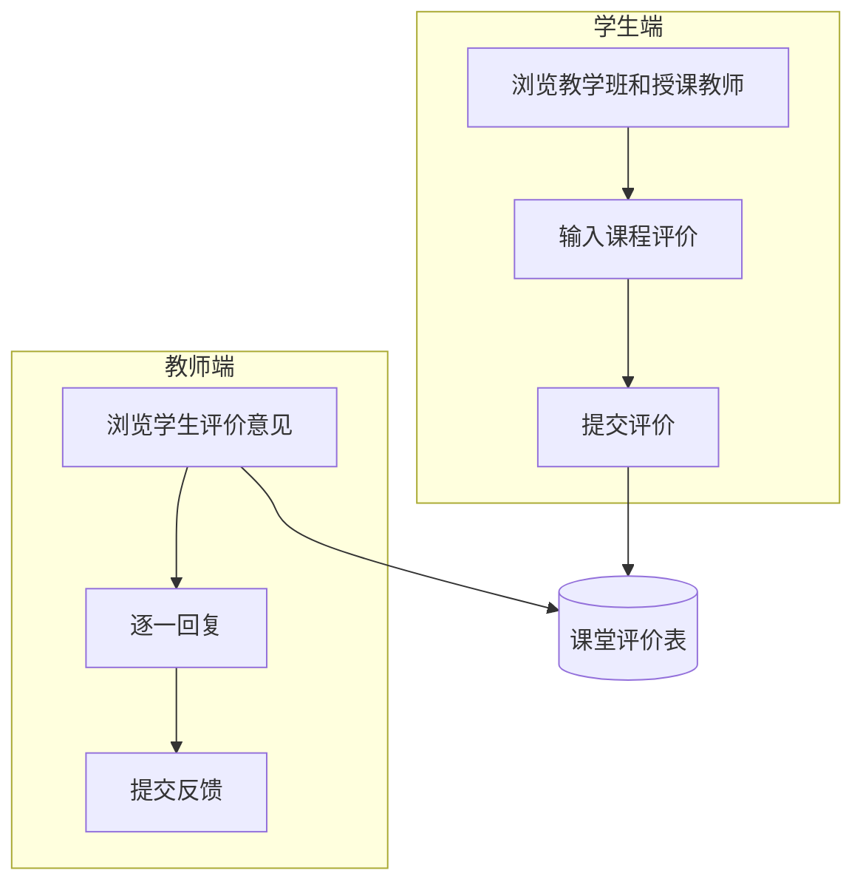
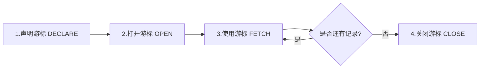
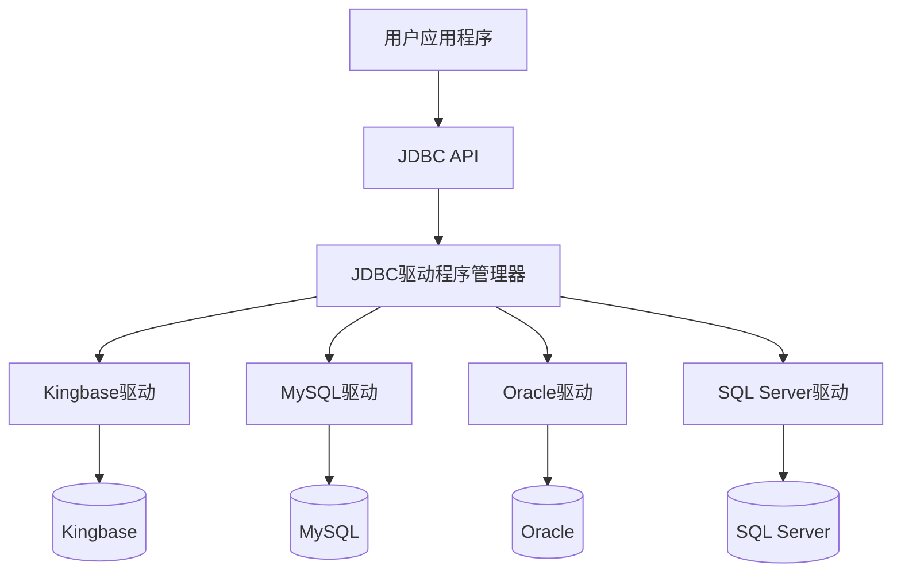
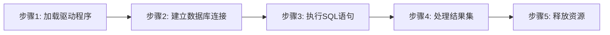
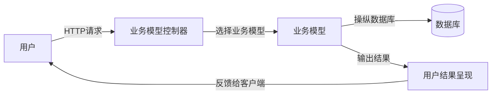

# 第8章 数据库编程

本章内容：8.1 概述、8.2 过程化SQL、8.3 JDBC编程、\*8.4 基于MVC框架的数据库应用开发。

## 8.1 概述

### 8.1.1 SQL表达能力的限制

> [!example] 任务1
> 打印"数据库系统概论"课程的所有先修课信息。
>
> Course表：
>
> | 课程号Cno | 课程名Cname | 学分Ccredit | 先修课程Cpno |
> |-----------|------------|-----------|-------------|
> | 81001 | 程序设计基础与C语言 | 4 | NULL |
> | 81002 | 数据结构 | 4 | 81001 |
> | 81003 | 数据库系统概论 | 4 | 81002 |
> | 81004 | 信息系统概论 | 4 | 81003 |
> | 81005 | 操作系统 | 4 | 81001 |
> | 81006 | Python语言 | 3 | 81002 |
> | 81007 | 离散数学 | 4 | NULL |
> | 81008 | 大数据技术概论 | 4 | 81003 |
>
> 先修关系链：数据库系统概论 →（直接先修课程）数据结构 →（间接先修课程）程序设计基础与C语言。

任务分析——SQL如何表达：

难点：课程可能同时存在直接先修课和间接先修课。

- 情况一：查询直接先修课——自身连接查询
- 情况二：查询间接先修课——递归查询（普通SQL无法表达）

直接先修课的SQL语句表达（自连接）。步骤1：找出"数据库系统概论"课程的全部直接先修课，记为L[1]；如果L[1]为空，则任务结束：

```sql
SELECT B.Cname
FROM Course A, Course B
WHERE A.Cname = '数据库系统概论'
  AND A.Cpno = B.Cno;
```

间接先修课的SQL语句表达（递归执行）：

步骤i（i>=2）：找出集合L[i-1]中每一门课程的全部直接先修课，并计算它们的并集，记为L[i]。迭代执行步骤i，直到并集L[i]为空，输出L[1] ∪ … ∪ L[i]。

L[2]：

```sql
SELECT B.Cname
FROM Course A, Course B
WHERE A.Cname = '数据结构' AND A.Cpno = B.Cno;
```

L[3]：

```sql
SELECT B.Cname
FROM Course A, Course B
WHERE A.Cname = '程序设计基础与C语言' AND A.Cpno = B.Cno;
```

执行过程：执行步骤1，找出"数据库系统概论"课程的直接先修课"数据结构"，即为L[1]；执行步骤2，找出"数据结构"课程的先修课"程序设计基础与C语言"，即为L[2]；步骤3，找出"程序设计基础与C语言"的先修课，得到L[3]，可以发现L[3]为空，递归查询结束。根据计算结果L[1]∪L[2]，任务1的输出如表8.1所示：

| Cpno | Cname |
> |------|-------|
> | 81002 | 数据结构 |
> | 81001 | 程序设计基础与C语言 |

表8.1 任务1的输出结果

> [!example] 任务2
> 打印一周内将过生日的学生信息。
>
> Student表：
>
> | 学号Sno | 姓名Sname | 性别Ssex | 生日Sbirthdate | 主修专业Smajor |
> |---------|----------|---------|---------------|--------------|
> | 20180001 | 李勇 | 男 | 2000-3-8 | 信息安全 |
> | 20180002 | 刘晨 | 女 | 1999-9-1 | 计算机科学与技术 |
> | 20180003 | 王敏 | 女 | 2001-8-1 | 计算机科学与技术 |
> | 20180004 | 张立 | 男 | 2000-1-8 | 计算机科学与技术 |
> | 20180005 | 陈新奇 | 男 | 2001-11-1 | 信息管理与信息系统 |
> | 20180006 | 赵明 | 男 | 2000-6-12 | 数据科学与大数据技术 |
> | 20180007 | 王佳佳 | 女 | 2001-12-7 | 数据科学与大数据技术 |

任务分析：任务2需要数据库系统提供内置函数（本任务主要是日期函数）。其求解思路为：扫描每个学生的出生日期，例如2000-6-12，并执行以下步骤：

1. 把出生日期的年份换成当前日期所在的年份（例如2021），即2021-6-12
2. 获取当前系统的日期，例如2021-6-9
3. 确定过生日的日期范围[2021-6-9, 2021-6-16]，即以当前日期为下界，当前日期后的第七天作为上界
4. 判断出生日期是否在上述日期范围内，如果是，输出该学生信息

8.1.2【例8.3】讲解如何使用SQL的内置函数完成该任务。

> [!example] 任务3
> 给定学生学号，计算学生的平均学分绩点GPA。
>
> 表8.2 学号为"20180001"的学生的选修课程：
>
> | 学号Sno | 课程号Cno | 成绩Grade | 选课学期Semester | 教学班Teachingclass |
> |---------|----------|----------|----------------|-------------------|
> | 20180001 | 81001 | 85 | 20192 | 81001-01 |
> | 20180001 | 81002 | 96 | 20201 | 81002-01 |
> | 20180001 | 81003 | 87 | 20202 | 81003-01 |

任务分析：难点是需要用户自主设计业务处理逻辑。本任务的求解思路：给定学生学号，找出该学生所有选修课程的学分、成绩；根据每门课程的成绩，参照"成绩和绩点对照表"，确定该成绩所处的范围，找出该门课程对应的绩点。8.2.5【例8.5】将介绍使用存储过程来完成这些比较复杂的业务逻辑的技术和方法。

> [!example] 任务4
> 教学评价浏览与反馈。
>
> 学生通过交互界面提交对某一位任课老师的教学评价意见，教师浏览这些评价意见并提供反馈信息。
>
> 任务分析：难点是需要建立交互功能。一方面，学生需要找到指定的教学班和授课教师，建立交互界面并输入课程评价；另一方面，还要建立交互界面，教师浏览教学班学生的评价意见，并针对每条评价逐一做出回复。8.3.3【例8.13】将讲解基于JDBC实现学生选课系统的评教功能。



> [!note] 小结——SQL语言表达能力的限制
> - 无法表达递归等复杂操作——例如间接先修课的查询
> - 无法对数据进行复杂操作——查询一周内将过生日的同学
> - 无法自主设计业务处理逻辑——计算学生平均学分绩点
> - 无法进行交互式操作——教学评价与反馈

### 8.1.2 扩展SQL的功能

扩展SQL语言的功能的三条途径：

1. 引入新的SQL子句
2. 引入新的内置函数
3. 引入PL/SQL与存储过程/存储函数

#### 1. 引入新的SQL子句

以任务1为例，SQL标准引入了WITH RECURSIVE子句，可执行递归查询。类似的SQL扩展还有很多，例如面向联机分析处理的窗口子句，面向空间数据管理、文档数据管理的SQL语言扩展等。

WITH子句的一般格式：

```sql
WITH RS1[(<目标列>,<目标列>)] AS      /*RS1为临时结果集的命名*/
     (SELECT 语句1)[,                 /*RS1对应SELECT语句的执行结果*/
     /*SELECT语句1中的目标列与RS1中的目标列必须保持一致*/
     RS2[(<目标列>,<目标列>)] AS      /*RS2为临时结果集的命名*/
     (SELECT 语句2),…]                /*RS2对应SELECT语句的执行结果*/
     /*SELECT语句2中的目标列与RS2中的目标列必须保持一致*/
SQL语句;                              /*执行与RS1，RS2,…,相关的查询*/
```

> [!example] 例8.1
> 求81001-01和81001-02两个教学班之间学生选课平均成绩的差异：
> ```sql
> WITH
> RS1(Grade) AS
>   (SELECT AVG(Grade) FROM SC
>    WHERE Teachingclass = '81001-01'),
> RS2(Grade) AS
>   (SELECT AVG(Grade) FROM SC
>    WHERE Teachingclass = '81001-02')
> SELECT RS1.Grade - RS2.Grade FROM RS1, RS2;
> ```

WITH RECURSIVE子句的一般格式：

```sql
WITH RECURSIVE RS AS
(
  SEED QUERY            /*初始化查询的临时结果集，记为L[1]*/
  UNION [ALL]           /*是否需要保留重复记录，加ALL为保留*/
  RECURSIVE QUERY       /*执行递归查询，得到全部临时结果集，即L[2]∪…∪L[i]*/
)
SQL语句                 /*执行与RS相关的查询*/
```

> [!example] 例8.2
> （任务1）打印"数据库系统概论"课程的所有先修课信息：
> ```sql
> WITH RECURSIVE RS AS (
>   /*初始化RS，假设结果集为L[1]，即"数据库系统概论"的所有直接先修课*/
>   SELECT Cpno FROM Course WHERE Cname = '数据库系统概论'
>   UNION
>   /*递归查询第i层(i>=1)的数据，即第i-1层数据的直接先修课课程号，并更新RS*/
>   SELECT Course.Cpno FROM Course, RS WHERE RS.Cpno = Course.Cno )
> /*根据RS中记录的所有先修课程号，通过查找课程表，输出课程号与课程名*/
> SELECT Cno, Cname FROM Course WHERE Cno IN (SELECT Cpno FROM RS);
> ```

#### 2. 引入新的内置函数

SQL常用的内置函数可以分为：

- 数学函数（如绝对值函数等）
- 聚合函数（如求和、求平均函数等）
- 字符串函数（如求字符串长度、求子串函数等）
- 日期和时间函数（如返回当前日期函数等）
- 格式化函数（如字符串转IP地址函数等）
- 控制流函数（如逻辑判断函数等）
- 加密函数（如使用密钥对字符串加密函数等）
- 系统信息函数（如返回当前数据库名、服务器版本函数等）

> [!example] 例8.3
> （任务2）打印一周内将过生日的学生信息：
> ```sql
> SELECT Sno, Sname, Ssex, Sbirthdate, Smajor
> FROM Student
> WHERE to_date(to_char(current_date,'yyyy') || '-' || to_char(Sbirthdate,'mm-dd'))
> BETWEEN CURRENT_DATE AND CURRENT_DATE + INTERVAL '7' DAY;
> ```
> 在WHERE语句中使用了以下内置函数：
> - 内置函数 `current_date` 返回当前的系统日期，例如2021-6-9。
> - 内置函数 `to_char(current_date,'yyyy')` 返回当前系统日期的年份，例如2021；`to_char(Sbirthdate,'mm-dd')` 返回学生出生日期中具体的月份和日期，例如6-9。
> - `to_date(to_char(current_date,'yyyy') || '-' || to_char(Sbirthdate,'mm-dd'))` 表示把当前年份与出生日期用'-'连在一起。符号 `||` 用于把其左右两边的字符串连在一起。
> - 内置函数 `to_date()` 的作用是将字符类型按一定格式转化为日期类型。
> - `current_date + interval '7' day` 是对当前的日期调整后的日期。参数interval是年(yyyy)、季度(q)、月(m)、日(d)、时(h)等粒度的时间单位。例如，`current_date + interval '7' day` 获得当前日期之后第七天的日期，即返回2021-6-16。
>
> 通过执行此WHERE语句，判断学生表中每位学生转换后的出生日期是否在[2021-6-9, 2021-6-16]区间内，如果是，打印该学生的信息。

#### 3. 引入PL/SQL与存储过程/存储函数

关系数据库管理系统中引入PL/SQL、存储过程和自定义函数等方法，使得用户可以自定义程序逻辑，开发完成业务逻辑复杂的应用系统。例如，在任务3中，需要用户自定义学分绩点的函数，8.2.5【例8.5】将详细给出求解方法。

### 8.1.3 通过高级语言实现复杂应用

> [!info] 三种途径
> 1. **通过动态链接库调用的方式**：关系数据库管理系统的功能被包装成一个子程序，由应用程序通过动态链接库调用来获得数据管理的功能。
> 2. **基于嵌入式SQL的方式**：将SQL嵌入到高级语言中混合编程，SQL语句负责操纵数据库，高级语言语句负责控制逻辑流程。
> 3. **基于ODBC/JDBC的中间件方式**：建立了连接不同数据库的一组规范。无论使用什么数据库，都采用同样的一组API来访问数据库。

## 8.2 过程化SQL

包括：8.2.1 过程化SQL的块结构、8.2.2 变量和常量的定义、8.2.3 流程控制、8.2.4 游标的定义与使用、8.2.5 存储过程、8.2.6 存储函数。

### 8.2.1 过程化SQL的块结构

> [!definition] 过程化SQL
> - 是SQL的扩展，增加了过程化语句功能。
> - 基本结构是块，块之间可以互相嵌套。
> - 每个块完成一个逻辑操作。

过程化SQL块的基本结构：

**1. 定义部分**

```sql
DECLARE 变量、常量、游标、异常等
```

定义的变量、常量等只能在该基本块中使用；当基本块执行结束时，定义就不再存在。

**2. 执行部分**

```sql
BEGIN
  SQL语句、过程化SQL的流程控制语句
EXCEPTION
  异常处理部分
END;
```

### 8.2.2 变量和常量的定义

#### 1. 变量定义

```sql
变量名 数据类型 [[NOT NULL] := 初值表达式]
```

或

```sql
变量名 数据类型 [[NOT NULL] 初值表达式]
```

#### 2. 常量定义

```sql
常量名 数据类型 CONSTANT := 常量表达式
```

常量必须要赋予一个值，并且该值在存在期间或常量的作用域内不能改变。如果试图修改它，过程化SQL将返回一个异常。

#### 3. 赋值语句

```sql
变量名称 := 表达式
```

### 8.2.3 流程控制

过程化SQL功能：1. 条件控制语句；2. 循环控制语句；3. 错误处理。

#### 1. 条件控制语句

IF-THEN、IF-THEN-ELSE和嵌套的IF语句：

```sql
（1）IF condition THEN
       Sequence_of_statements;
     END IF;

（2）IF condition THEN
       Sequence_of_statements1;
     ELSE
       Sequence_of_statements2;
     END IF;
```

在THEN和ELSE子句中还可以再包含IF语句，即IF语句可以嵌套。

#### 2. 循环控制语句

LOOP、WHILE-LOOP和FOR-LOOP。

简单的循环语句LOOP：

```sql
LOOP
  Sequence_of_statements;
END LOOP;
```

多数数据库服务器的过程化SQL都提供EXIT、BREAK或LEAVE等循环结束语句，保证LOOP语句块能够在适当的条件下提前结束。

WHILE-LOOP：

```sql
WHILE condition LOOP
  Sequence_of_statements;
END LOOP;
```

每次执行循环体语句之前，首先对条件进行求值：如果条件为真，则执行循环体内的语句序列；如果条件为假，则跳过循环并把控制传递给下一个语句。

FOR-LOOP：

```sql
FOR count IN [REVERSE] bound1 … bound2 LOOP
  Sequence_of_statements;
END LOOP;
```

#### 3. 错误处理

如果过程化SQL在执行时出现异常，则应该让程序在产生异常的语句处停下来，根据异常的类型去执行异常处理语句。SQL标准对数据库服务器提供什么样的异常处理做出了建议，要求过程化SQL管理器提供完善的异常处理机制。

### 8.2.4 游标的定义与使用

> [!definition] 游标
> - 在过程化SQL中，如果SELECT语句只返回一条记录，可以将该结果存放到变量中。
> - 当查询返回多条记录时，就要使用游标对结果集进行处理。一个游标与一个SQL语句相关联。

游标的用户接口：1.声明游标；2.打开游标；3.使用游标；4.关闭游标。



#### 1. 声明游标

```sql
DECLARE 游标名 [(参数1 数据类型, 参数2 数据类型, …)]
CURSOR FOR
SELECT语句;
```

定义游标仅仅是一条说明性语句，这时关系数据库管理系统并不执行SELECT语句。

#### 2. 打开游标

```sql
OPEN 游标名 [(参数1 数据类型, 参数2 数据类型, …)];
```

打开游标实际上是执行相应的SELECT语句，把查询结果取到缓冲区中。这时游标处于活动状态，指针指向查询结果集中的第一条记录。

#### 3. 使用游标

```sql
FETCH 游标名 INTO 变量1[, 变量2,…];
```

变量必须与SELECT语句中的目标列表达式一一对应。用FETCH语句把游标指针向前推进一条记录，同时将缓冲区中的当前记录取出来送至变量供过程化SQL进一步处理。循环执行FETCH语句，逐条取出结果集中的行进行处理。

#### 4. 关闭游标

```sql
CLOSE 游标名;
```

游标被关闭后就不再和原来的查询结果集相联系，但被关闭的游标可以再次被打开，与新的查询结果相联系。

> [!example] 例8.4
> 根据给定学号20180001，使用游标输出该学生的全部选课记录：
> ```sql
> DECLARE
>   CnoOfStudent CHAR(10);
>   GradeOfStudent INT;
>   mycursor CURSOR FOR
>     SELECT Cno, Grade FROM SC WHERE Sno = '20180001';
> BEGIN
>   OPEN mycursor;              /*打开游标*/
>   LOOP                        /*循环遍历游标*/
>     FETCH mycursor INTO CnoOfStudent, GradeOfStudent;  /*检索游标*/
>     EXIT WHEN mycursor%NOTFOUND;
>     RAISE NOTICE 'Sno:20180001, Cno:%, Grade:%', CnoOfStudent, GradeOfStudent;
>   END LOOP;
>   CLOSE mycursor;             /*关闭游标*/
> END;
> ```

### 8.2.5 存储过程

> [!definition] 存储过程
> 类似于高级语言程序，过程化SQL程序也可以被命名和编译，并保存在数据库中，称为存储过程（stored procedure）或存储函数（stored function），供其他过程化SQL调用。存储过程或存储函数也是一类数据库的对象，需要有创建、删除等语句。这里的存储函数指自定义函数。

存储过程的用户接口：1.创建存储过程；2.执行存储过程；3.修改存储过程；4.删除存储过程。

#### 1. 创建存储过程

```sql
CREATE OR REPLACE PROCEDURE 过程名(
  [[IN|OUT|INOUT] 参数1 数据类型,
   [IN|OUT|INOUT] 参数2 数据类型,
   …]
)                        /*存储过程首部*/
AS <过程化SQL块>;        /*存储过程体，描述该存储过程的操作*/
```

> [!note] 参数说明
> - **过程名**：数据库服务器合法的对象标识。
> - **参数列表**：存储过程提供了IN、OUT、INOUT三种参数模式，分别对应输入、输出、输入输出三种语义，不声明参数模式时，缺省为IN类型。输入参数在被调用时需要指定参数值；输出参数调用时不传入参数值，而是作为返回值返回；输入输出参数调用时需要传入初始值，并会返回操作后的最终值。参数列表中需要指定参数模式、参数名以及参数的数据类型。
> - **过程体**：是一个 `<过程化SQL块>`，包括声明部分和可执行语句部分。

> [!example] 例8.5
> 给定学生学号，计算学生的平均学分绩点GPA。
>
> 求解思路：给定学生学号，找出该学生所有选修课程的学分、成绩；根据每门课程的成绩，参照成绩和绩点对照表，确定该成绩所处的范围，找出该门课程对应的学分绩点。
>
> 学号为"20180001"学生的选修课程：
>
> | 学号Sno | 课程号Cno | 成绩Grade | 选课学期Semester | 教学班Teachingclass |
> |---------|----------|----------|----------------|-------------------|
> | 20180001 | 81001 | 85 | 20192 | 81001-01 |
> | 20180001 | 81002 | 96 | 20201 | 81002-01 |
> | 20180001 | 81003 | 87 | 20202 | 81003-01 |
>
> 成绩和绩点对照表：
>
> | 编码 | 成绩下限 | 成绩上限 | 绩点 |
> |------|---------|---------|------|
> | 1 | 0 | 59 | 0 |
> | 2 | 60 | 69 | 1 |
> | 3 | 70 | 79 | 2 |
> | 4 | 80 | 89 | 3 |
> | 5 | 90 | 100 | 4 |
>
> 计算过程："81001"课程考试成绩为85分，参照对照表，85分对应成绩范围为[80,89]，该门课程对应的学分绩点为3；类似地，课程号为"81002"对应的学分绩点为4；课程号为"81003"对应的学分绩点为3。三门课程的学分都是4，根据平均学分绩点GPA的计算公式：
>
> GPA = 总学分绩 ÷ 总学分 = Σ(课程学分 × 对应绩点) ÷ 总学分 = (3 × 4 + 4 × 4 + 3 × 4) ÷ 12 = 3.33
>
> 存储过程定义：
> ```sql
> CREATE OR REPLACE PROCEDURE compGPA(    /*定义存储过程compGPA*/
>   IN inSno CHAR(10),                    /*输入参数：学生学号inSno*/
>   OUT outGPA FLOAT)                     /*输出参数：平均学分绩outGPA*/
> AS
> DECLARE
>   courseGPA INT;        /*声明变量courseGPA，临时存储课程学分绩*/
>   totalGPA INT;         /*声明变量totalGPA，临时存储总学分绩*/
>   totalCredit INT;      /*声明变量totalCredit，临时存储总学分*/
>   grade INT;            /*声明变量grade，临时存储学生成绩*/
>   credit INT;           /*声明变量credit，临时存储课程学分*/
>   mycursor CURSOR FOR   /*声明游标mycursor*/
>     SELECT Ccredit, grade FROM SC, Course
>     WHERE Sno = inSno AND SC.Cno = Course.Cno;
> BEGIN
>   totalGPA := 0;
>   totalCredit := 0;
>   OPEN mycursor;                        /*打开游标mycursor*/
>   LOOP                                  /*循环遍历游标*/
>     FETCH mycursor INTO credit, grade;  /*检索游标*/
>     EXIT WHEN mycursor%NOTFOUND;
>     IF grade BETWEEN 90 AND 100 THEN courseGPA := 4.0;
>     ELSIF grade BETWEEN 80 AND 89 THEN courseGPA := 3.0;
>     ELSIF grade BETWEEN 70 AND 79 THEN courseGPA := 2.0;
>     ELSIF grade BETWEEN 60 AND 69 THEN courseGPA := 1.0;
>     ELSE courseGPA := 0;
>     END IF;   /*参照成绩和绩点对照表，根据成绩找出某门课程对应的学分绩点*/
>     totalGPA := totalGPA + courseGPA * credit;
>     totalCredit := totalCredit + credit;
>   END LOOP;
>   CLOSE mycursor;                       /*关闭游标mycursor*/
>   outGPA := 1.0 * totalGPA / totalCredit;
> END;
> ```

#### 2. 执行存储过程

```sql
CALL/PERFORM [PROCEDURE] 过程名([参数1, 参数2, ...]);
```

使用CALL或者PERFORM等方式激活存储过程的执行。在过程化SQL中，数据库服务器支持在过程体中调用其他存储过程。

> [!example] 例8.6
> 查询学号为"20180001"学生的课程GPA：
> ```sql
> DECLARE outGPA FLOAT;
> BEGIN
>   CALL compGPA('20180001', outGPA);
>   RAISE NOTICE 'GPA: %', outGPA;
> END;
> ```
> 在调用含有输入参数和输入输出参数的存储过程时，需要指定具体的参数值；在调用含有输出参数的存储过程时，对应位置不需要传入参数值，但需要事先定义输出变量。

#### 3. 修改存储过程

重命名：

```sql
ALTER PROCEDURE 过程名1 RENAME TO 过程名2;
```

重新编译：

```sql
ALTER PROCEDURE 过程名 COMPILE;
```

#### 4. 删除存储过程

```sql
DROP PROCEDURE 过程名;
```

> [!note] 存储过程的优点
> - 运行效率高
> - 降低了客户机和服务器之间的通信量
> - 方便实施企业规则

### 8.2.6 存储函数

> [!note] 存储函数和存储过程的异同
> - 同：都是持久性存储模块。
> - 异：函数必须指定返回的类型。

**1. 函数的定义语句格式：**

```sql
CREATE OR REPLACE FUNCTION 函数名([参数1 数据类型, 参数2 数据类型, ...])
RETURNS <类型>
AS <过程化SQL块>;
```

**2. 函数的执行语句格式：**

```sql
CALL/SELECT 函数名([参数1, 参数2, …]);
```

**3. 修改函数**

重命名：

```sql
ALTER FUNCTION 函数名1 RENAME TO 函数名2;
```

重新编译：

```sql
ALTER FUNCTION 函数名 COMPILE;
```

## 8.3 JDBC编程

包括：8.3.1 JDBC工作原理概述、8.3.2 JDBC API基础、8.3.3 使用JDBC操纵数据库的工作流程。

### 8.3.1 JDBC工作原理概述

> [!definition] JDBC
> JDBC（Java Database Connection）是面向Java语言的软件开发工具包（Java Development Kit，JDK）中有关数据库的一个组成部分，提供了一组访问数据库的应用程序编程接口（Application Programming Interface，API）。
>
> 由于不同的数据库管理系统的存在，在某个关系数据库管理系统下编写的应用程序就不能在另一个关系数据库管理系统下运行。许多应用程序需要共享多个部门的数据资源，访问不同的关系数据库管理系统。

> [!info] JDBC约束力
> - **规范应用开发**：使用JDBC提供的接口而不是RDBMS的接口来进行应用开发。
> - **规范关系数据库管理系统应用接口**：JDBC接口提供的功能必须完备，RDBMS必须实现所有JDBC接口。

JDBC应用系统的体系结构：



### 8.3.2 JDBC API基础

JDBC进行应用程序开发涉及到的所有类都包含在java.sql包中；不同的JDBC版本接口名和使用略有差异。

JDBC常用类：

| 类名 | 路径 | 备注 |
|------|------|------|
| 驱动程序类 | java.sql.Driver | 由各数据库厂商提供 |
| 驱动程序管理类 | java.sql.DriverManager | 作用于应用程序与驱动程序之间 |
| 数据库连接类 | java.sql.Connection | 用于建立与指定数据库的连接 |
| 静态SQL语句执行类 | java.sql.Statement | 用于执行静态SQL语句并返回结果 |
| 动态SQL语句执行类 | java.sql.PreparedStatement | 用于执行含参SQL语句并返回结果 |
| 存储过程语句执行类 | java.sql.CallableStatement | 用于执行存储过程语句并返回结果 |
| 结果集处理类 | java.sql.ResultSet | 用于检索结果集中的数据 |

**数据类型：**

- SQL数据类型：用于数据源，如VARCHAR、CHAR、BIT、NUMERIC、DATE等。
- Java数据类型：用于应用程序的Java代码，如String、boolean、BigDecimal、byte、short、int等。

由数据库管理系统的驱动程序完成自身数据类型和JDBC标准数据类型的映射。

JDBC中SQL与Java数据类型之间的对应关系：

| SQL数据类型 java.sql.types | Java数据类型 java.sql或java.lang | Oracle | SQL Server |
|---|---|---|---|
| BIT | boolean | SMALLINT | BIT |
| CHAR | java.lang.Character | CHAR | CHAR |
| VARCHAR | java.lang.String | VARCHAR2 | VARCHAR |
| DATE | java.sql.Date | DATE | DATETIME |
| TIMESTAMP | java.sql.Timestamp | TIMESTAMP(9) | DATETIME |
| CLOB | java.lang.String | CLOB | NTEXT |
| BLOB | byte[] / Serializable | BLOB | IMAGE |
| TINYINT | byte | SMALLINT | TINYINT |
| SMALLINT | short | SMALLINT | SMALLINT |
| INTEGER | int | INTEGER | INTEGER |
| BIGINT | long | NUMBER | NUMERIC |
| REAL | float | REAL | REAL |
| DOUBLE | double | DOUBLE PRECISION | FLOAT |
| DECIMAL(p,s) | java.math.BigDecimal | NUMBER(p,s) | DECIMAL(p,s) |

### 8.3.3 使用JDBC操纵数据库的工作流程



**步骤1：加载驱动程序**

驱动程序在JDBC API中实现定义数据交互的接口。

> [!example] 例8.7
> 对Kingbase、Oracle、SQL Server加载数据库驱动：
> ```java
> Class.forName("com.kingbase.Driver");                          /* Kingbase */
> Class.forName("oracle.jdbc.OracleDriver");                     /* Oracle */
> Class.forName("com.microsoft.jdbc.sqlserver.SQLServerDriver"); /* SQL Server */
> ```
> JDBC 4.0及以后版本不再需要使用 `Class.forName()` 显式地加载JDBC驱动程序。

**步骤2：设置待连接数据库的URL，并建立与数据库连接**

加载驱动后，可以通过URL地址与数据库建立连接。URL包含了连接数据库所需的协议、子协议和数据库名称，定义格式为：`<协议名>:<子协议名>:<数据库名称>`

> [!example] 例8.8
> 定义与Kingbase、Oracle、SQL Server数据库连接的URL：
> ```java
> strURL = "jdbc:kingbase://" + 服务器名 + ":" + 端口号 + "/" + 数据库名;
> strURL = "jdbc:oracle:thin:@" + 服务器名 + ":" + 端口号 + ":" + 数据库名;
> strURL = "jdbc:microsoft:sqlserver://" + 服务器名 + ":" + 端口号 + ":" + 数据库名;
> ```
> Kingbase、Oracle、SQL Server的默认端口号分别为54321、1521、1433。

> [!example] 例8.9
> 建立与Kingbase数据库的连接，假定服务器地址为192.168.0.118，端口为54321，数据库名为DB-Student，用户名为Info001，密码为123456：
> ```java
> String strURL = "jdbc:kingbase://192.168.0.118:54321/DB-Student";
> Connection conn = DriverManager.getConnection(strURL, "Info001", "123456");
> ```

**步骤3：执行SQL语句**

语句执行类：

- 静态语句执行类对象（Statement）
- 派生执行类对象：
  - 动态语句执行类（PreparedStatement）：执行动态的SQL语句
  - 存储过程执行类（CallableStatement）：执行数据库存储过程

执行方法：

- `ResultSet executeQuery()`：执行数据库查询语句
- `int executeUpdate()`：处理增、删、改以及定义语句
- `boolean execute()`：处理存储过程或动态SQL语句

> [!note] execute和executeUpdate的区别
> - 区别1：execute可以执行查询语句，然后通过getResultSet把结果集取出来；executeUpdate不能执行查询语句。
> - 区别2：execute返回boolean类型，true表示执行的是查询语句，false表示执行的是insert、delete、update等；executeUpdate返回的是int，表示有多少条数据受到了影响。

> [!warning] SQL注入防御
> 预编译、正则过滤、输入验证、框架等。

> [!example] 例8.10
> 使用JDBC向课堂评价表中插入一条记录：
> ```java
> PreparedStatement stmt = conn.prepareStatement("INSERT INTO SC VALUES(?,?,?,?,?,?)");
> /*生成PreparedStatement类对象中的动态参数，注意第六个字段Feedback，未设置输入值*/
> stmt.setString(1, "20180001");        /*设置学生学号*/
> stmt.setString(2, "19950018");        /*设置职工号*/
> stmt.setString(3, "81001-01");        /*设置教学班号*/
> stmt.setString(4, "老师讲得很出色");   /*设置学生评价意见*/
> stmt.setBoolean(5, true);             /*设置学生评价意见类型*/
> stmt.executeUpdate();
> ```

**步骤4：处理结果集**

- `ResultSet`：结果集合类对象。
- `.getXXX(参数)`：获取元组的属性值，XXX代表某种数据类型；可以指定参数为列号（JDBC的列从1开始）或列名。
- 游标（cursor）：JDBC处理结果集的机制。
  - `TYPE_FORWARD_ONLY`：只能向下滚动（默认类型）
  - `TYPE_SCROLL_INSENSITIVE` / `TYPE_SCROLL_SENSITIVE`：双向滚动，区别为是否同步数据库更新操作

> [!example] 例8.12
> 遍历教师职工号为19950018、教学班号为81001-01的学生课程评价详情：
> ```java
> String SQL = "SELECT Sno, Assess, CAtype, Feedback FROM ClassAssess WHERE Tno='19950018' AND TCo='81001-01'";
> ResultSet rs = stmt.executeQuery(SQL);
> while(rs.next()){
>   String Sno = rs.getString("Sno");              /*等价于rs.getString(1)*/
>   String strAssess = rs.getString("Assess");     /*等价于rs.getString(2)*/
>   Boolean bCAtype = rs.getBoolean("CAtype");     /*等价于rs.getBoolean(3)*/
>   String strFeedback = rs.getString("Feedback"); /*等价于rs.getString(4)*/
>   System.out.printf("[%s,%b,%s]%n", strAssess, bCAtype, strFeedback);
> }
> ```

**步骤5：释放资源**

执行结束后，将与数据库进行交互的对象释放。释放资源有标准的顺序：

1. 关闭结果集：`ResultSet.close()`
2. 关闭语句执行类对象：`Statement.close()`
3. 释放数据库连接对象：`Connection.close()`

> [!tip] 释放资源的Coding Tips
> - Connection对象在应用程序中较为稀有，尽量做到晚创建、早释放。
> - 推荐在finally代码块中释放资源，以满足异常处理机制（finally语句在什么情况下都会执行，确保一定会释放资源）。

标准连接和释放过程：

```java
public static void main(String[] args) {
  Connection conn = null;
  Statement state = null;
  ResultSet set = null;
  try {
    //注册数据库驱动
    DriverManager.registerDriver(new Driver());
    //获取数据库连接
    conn = DriverManager.getConnection("jdbc:mysql://localhost:3306/mydb", "root", "");
    //获取传输器对象
    state = conn.createStatement();
    //利用传输器对象执行sql语句
    set = state.executeQuery("select * from emp");
    while(set.next()){
      System.out.println(set.getString("name"));
    }
  } catch (SQLException e) {
    e.printStackTrace();
  } finally {
    try {
      set.close();
      state.close();
      conn.close();
    } catch (SQLException e) {
      e.printStackTrace();
    }
  }
}
```

> [!example] 例8.13
> 基于JDBC实现任务4。
>
> 选课关系模式：SC(Sno, TCno, Grade)
> 教师关系模式：Teacher(Tno, Tname, Ttitle, Tbirthdate, Dno)
> 教学班关系模式：TeachingClass(TCno, Capacity, Semester, Cno)
> 讲授关系模式：Teaching(TCno, Tno, isLeading)
> 课堂评价关系模式：ClassAssess(Sno, Tno, TCno, Assess, CAtype, CRfeedback)

```mermaid
graph ER
    SC ||--o{ ClassAssess : "Sno"
    Teacher ||--o{ ClassAssess : "Tno"
    TeachingClass ||--o{ ClassAssess : "TCno"
    TeachingClass ||--o{ Teaching : "TCno"
    Teacher ||--o{ Teaching : "Tno"
    SC }o--|| TeachingClass : "TCno"
```

> [!note] 实现要点（以金仓数据库为例）
> 1. **数据库连接的管理**：设置连接数据库的URL；创建连接数据库的静态函数；创建释放数据库连接对象的静态函数；将加载驱动、建立连接、释放资源封装到数据库连接管理类中。
> 2. **学生浏览指定的教学班和授课教师，并输入课程评价**：创建语句对象，生成获取教学班及授课教师信息的SQL语句；执行SQL语句，并将查询得到的结果集存到rs中；根据结果集执行用户逻辑——构建学生课程评价的动态SQL语句，遍历学生选课的每一条记录，在动态SQL语句中设置学生对该门课程的评价，并更新该条记录；最后释放结果集、语句、连接对象。
> 3. **教师浏览教学班同学的评价意见，并针对每条评价逐一作出回复**：逻辑同"学生浏览指定的教学班和授课教师，并输入课程评价"。

## \*8.4 基于MVC框架的数据库应用开发

> [!definition] MVC框架
> MVC框架包含三个部分，每个部分各自处理自己的工作，互不干扰：业务模型控制器、业务模型、用户结果呈现。



- **业务模型控制器**：接收用户通过浏览器发送的HTTP服务请求，包括用户需要选择的业务模型，以及其它可选的输入参数（可以是用户在文本框中输入的文本、下拉列表框中的数据项等，也可以是用户的操作类型）。
- **业务模型**：建立用户的业务逻辑。解析出来的用户数据，执行事先定义的业务逻辑，并操纵数据库存取数据。输出独立于具体的数据格式，可为多个用户结果呈现提供展示所需要的数据，减少了代码的重复性。
- **用户结果呈现**：用户看到并与之交互获得结果展示的界面。根据业务模型输出的结果反馈给客户端进行呈现。

## 本章小结

> [!summary] 第8章要点
> 本章讲解了以下内容：
> - **扩展SQL语言的功能**：引入新的SQL子句、引入新的内置函数、引入PL/SQL以及存储过程和存储函数等技术。
> - SQL与高级语言具有不同的数据处理方式：SQL是面向集合的，而高级语言是面向记录的。游标就是用来协调这两种不同的处理方式的机制。
> - **通过高级语言实现复杂应用**：JDBC的工作原理和工作流程。
> - 基于MVC框架的开发方式。
