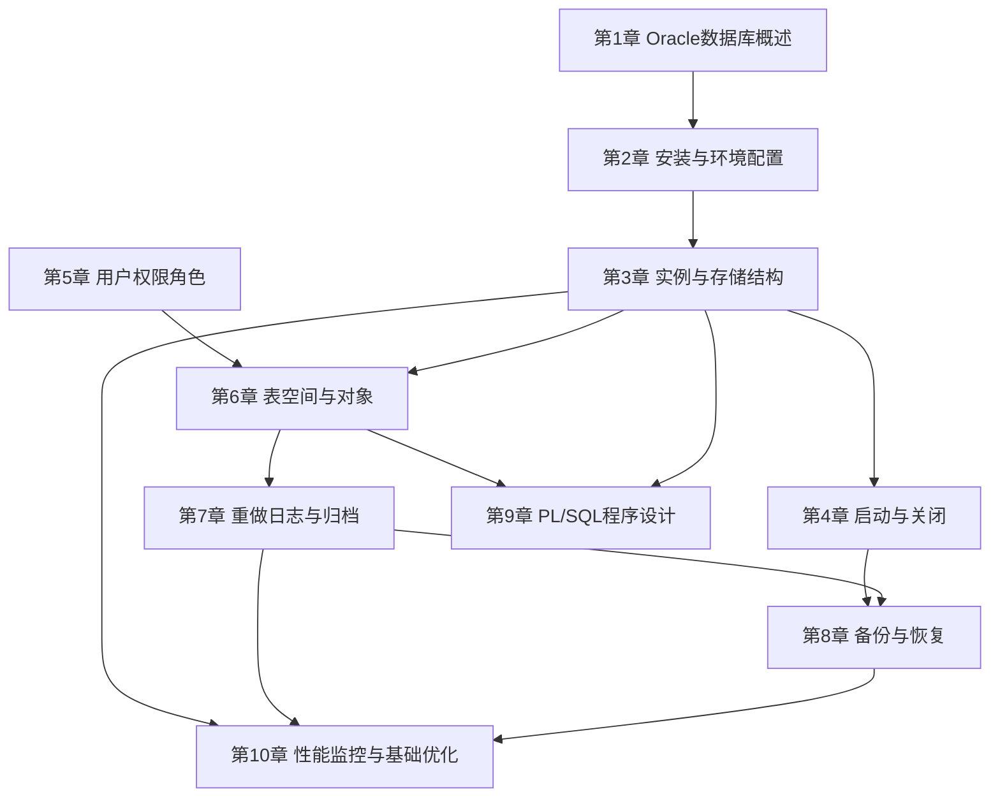

# MOC - Oracle数据库管理

> [!info] 课程定位
> Oracle数据库管理是数据库技术方向的核心专业课程，以 Oracle Database（Oracle 11g/12c/19c 主流版本）为实践平台，系统讲授 Oracle DBA 的**日常运维、体系结构、存储管理、安全控制、备份恢复与性能调优**六大核心能力。它在 [[MOC - 数据库原理]] 的关系模型理论与 SQL 基础之上，深入 Oracle 产品内部，解决"如何可靠、安全、高效地部署与运维企业级数据库"这一核心问题。课程的设计原则是：**凡涉及产品特性（如 RMAN、ASM、AWR、闪回、PL/SQL 自治事务），均明确标注为 Oracle 专有，不得描述为通用数据库规律；凡涉及高风险命令（DROP DATABASE、ALTER DATABASE 等），必须醒目标注风险等级与前提条件。**

## 课程摘要

本课程围绕"**架构—部署—存储—启动—安全—对象—日志—备份—编程—调优**"十条主线展开。DBA 需要掌握：

1. Oracle 发展历程、版本体系（Standard/Enterprise/Express）、Oracle 实例 Instance 与数据库 Database 的本质区别；
2. 软硬件环境要求、数据库软件安装步骤、监听 LISTENER.ORA 与 TNSNAMES.ORA 配置、环境变量（ORACLE_HOME、ORACLE_SID、PATH）；
3. 实例与存储结构：内存结构 SGA（DB_CACHE、SHARED_POOL、LARGE_POOL、JAVA_POOL、REDO_LOG_BUFFER）与 PGA；后台进程 PMON、SMON、DBWn、LGWR、CKPT、ARCn；物理文件（数据文件 .dbf、控制文件 .ctl、联机重做日志 .log）与逻辑存储四层（表空间 Tablespace → 段 Segment → 区 Extent → 块 Block）；
4. 四种启动模式（SHUTDOWN → NOMOUNT → MOUNT → OPEN）与四种关闭模式（NORMAL/TRANSACTIONAL/IMMEDIATE/ABORT）及启动故障排查；
5. 用户、权限与角色：CREATE USER、系统权限（SYSDBA/SYSOPER/CREATE SESSION）、对象权限（SELECT/INSERT/UPDATE/DELETE/EXECUTE）、ROLE 角色与 DBA/RESOURCE/CONNECT 三大预定义角色、Profile 资源配置；
6. 表空间与对象：永久/临时/撤销三大表空间的创建与维护，数据表、约束（PRIMARY KEY/FOREIGN KEY/UNIQUE/CHECK），索引、序列 Sequence、同义词 Synonym、视图，分区表基础（范围/哈希/列表）；
7. 重做日志与归档：联机重做日志组循环复用机制、ARCHIVELOG 与 NOARCHIVELOG 模式切换、ALTER SYSTEM SWITCH LOGFILE 日志切换、检查点 Checkpoint、归档日志维护；
8. 备份恢复：冷备份 vs 热备份、RMAN（Recovery Manager）工具基础、完全恢复与不完全恢复（基于时间/SCN/日志序列）、闪回技术（Flashback Query/Dropback/Table/Database）；
9. PL/SQL 编程：DECLARE-BEGIN-EXCEPTION 块结构、存储过程 PROCEDURE 与函数 FUNCTION、触发器（DML/DDL/INSTEAD OF）与显式隐式游标、EXCEPTION 异常处理（预定义与用户自定义）；
10. 性能监控与基础优化：数据字典与动态性能视图（DBA_/ALL_/USER_、V$）、EXPLAIN PLAN 与 SQL*Plus AUTOTRACE 查看执行计划、锁等待与会话排查（V$LOCK/V$SESSION/V$SQL）、基础优化思路（SQL 优化 / 索引 / 表空间 / I/O / 参数）。

## 章节结构与依赖关系

> [!note] 章节依赖说明
> 第1-2章建立产品认知与运行环境；第3章体系结构是后续所有章节的理论骨架——不理解 SGA 内存与 DBWn/LGWR 进程，就无法掌握启动关闭（第4章）、重做日志（第7章）、备份恢复（第8章）与性能调优（第10章）。第5章安全与第6章存储对象管理是 DBA 日常核心运维工作，彼此协同。第7章日志与归档是第8章备份恢复的前提——无归档则难以完成不完全恢复。第9章 PL/SQL 连接后端开发与数据库逻辑层。第10章性能调优是综合能力，依赖前面所有章节的知识积累。

## 章节导航

| 章节 | 主题 | 入口 | 关键能力 |
| ---- | ---- | ---- | -------- |
| 第1章 | Oracle数据库概述 | [[MOC - 第1章]] | 版本体系、实例 vs 数据库、体系结构总览 |
| 第2章 | 安装与环境配置 | [[MOC - 第2章]] | 软硬件评估、图形/静默安装、LISTENER/TNS 配置 |
| 第3章 | 实例与存储结构 | [[MOC - 第3章]] | SGA/PGA、六大后台进程、物理三文件、逻辑四层映射 |
| 第4章 | 启动与关闭 | [[MOC - 第4章]] | NOMOUNT/MOUNT/OPEN、四种关闭模式、故障排查 |
| 第5章 | 用户权限角色 | [[MOC - 第5章]] | CREATE USER、GRANT/REVOKE、ROLE、SYSDBA、Profile |
| 第6章 | 表空间与对象 | [[MOC - 第6章]] | CREATE TABLESPACE、表/约束/索引/序列/同义词、分区表 |
| 第7章 | 重做日志与归档 | [[MOC - 第7章]] | 联机日志组切换、ARCHIVELOG、检查点、归档维护 |
| 第8章 | 备份与恢复 | [[MOC - 第8章]] | RMAN BACKUP/RESTORE/RECOVER、闪回、完全/不完全恢复 |
| 第9章 | PL/SQL程序设计 | [[MOC - 第9章]] | PL/SQL块、存储过程/函数、触发器/游标、EXCEPTION |
| 第10章 | 性能监控与优化 | [[MOC - 第10章]] | DBA_/V$视图、EXPLAIN PLAN、锁等待、SQL优化思路 |

## 分阶段学习目标

> [!example] 基础入门阶段（第1–3章）
> 建立 Oracle 产品认知与运行环境：理解 Oracle 发展历程与版本体系，**严格区分 Instance（实例=内存+进程）与 Database（数据库=物理文件集合）**；完成图形化或静默安装；理解 SGA 五大内存区域与 PMON/SMON/DBWn/LGWR/CKPT/ARCn 六大后台进程职责；掌握数据文件、控制文件、重做日志三类物理文件及表空间→段→区→块四层逻辑结构及其映射关系。

> [!example] DBA 日常运维阶段（第4–7章）
> 掌握 DBA 高频运维操作：熟练使用 SQL*Plus 执行 STARTUP NOMOUNT/MOUNT/OPEN 与 SHUTDOWN IMMEDIATE/ABORT；掌握创建用户、授予系统/对象权限、角色与 Profile；熟练创建永久表空间（CREATE TABLESPACE ... DATAFILE ... SIZE ... AUTOEXTEND ON）、临时表空间（TEMP）、撤销表空间（UNDO），管理表/约束/索引/序列/同义词/视图；理解联机重做日志组工作循环与 ARCHIVELOG 归档模式配置。

> [!example] 灾难恢复阶段（第8章）
> 理解备份与恢复的完整体系：区分冷备份（脱机）与热备份（联机归档）；掌握 RMAN 工具的 BACKUP、RESTORE、RECOVER 命令；能完成完全恢复（介质故障后恢复到最新状态）与三类不完全恢复（UNTIL TIME/SCN/LOG SEQUENCE）；理解 Flashback Drop 回收站、Flashback Query、Flashback Table 的适用场景与使用限制。

> [!example] 应用开发阶段（第9章）
> 掌握 PL/SQL 数据库编程：书写规范的 DECLARE-BEGIN-EXCEPTION 块；熟练编写带参数的存储过程与函数（IN/OUT/IN OUT）；掌握 DML 触发器（BEFORE/AFTER + INSERT/UPDATE/DELETE）、INSTEAD OF 触发器、显式游标（DECLARE CURSOR...OPEN...FETCH...CLOSE）与隐式游标属性；掌握预定义异常（NO_DATA_FOUND、TOO_MANY_ROWS、DUP_VAL_ON_INDEX）与自定义异常的捕获与抛出。

> [!example] 性能调优阶段（第10章）
> 建立 DBA 性能问题定位与优化的方法论：熟练使用 DBA_TABLES、DBA_INDEXES、DBA_SEGMENTS 等数据字典视图与 V$SESSION、V$SQL、V$LOCK、V$SGA 等动态性能视图；用 EXPLAIN PLAN 或 AUTOTRACE 查看执行计划并识别全表扫描与索引扫描；能使用 V$SESSION_EVENT 与 V$LOCK 排查锁等待、死锁、会话阻塞；掌握基础优化思路——SQL 重写、索引重建、表空间布局、I/O 均衡、关键参数调优（SGA_TARGET、PGA_AGGREGATE_TARGET、DB_CACHE_SIZE）。

## 先修与关联课程

- **先修**：[[MOC - 数据库原理]]（关系模型、SQL 基础、事务 ACID、并发与封锁理论）、操作系统（Linux/Windows 服务与进程管理）、计算机网络（TCP/IP 监听端口 1521）
- **后续**：[[MOC - 数据库开发技术]]（JDBC/MyBatis 连接 Oracle、SQL 高级编程）、Oracle 高可用与容灾（RAC 集群、Data Guard 备库、GoldenGate 同步，超出本课范围）
- 关联延伸：[[MOC - Web开发技术]]（后端应用连接 Oracle 场景）、[[软件工程]]（数据库部署与变更纳入软件生命周期）

## 风险提示与操作规范

> [!danger] 高风险操作警示
> - `DROP DATABASE`、`DROP TABLESPACE ... INCLUDING CONTENTS AND DATAFILES`、`ALTER DATABASE ... CLEAR UNARCHIVED LOGFILE` 等命令**永久删除数据**，必须在测试环境演练并备份后才可执行生产操作，本课程示例仅在测试环境验证。
> - `SHUTDOWN ABORT` 等价于断电，会导致实例异常恢复，生产环境仅在其他方式均失败时使用。
> - `ALTER SYSTEM ARCHIVE LOG STOP` 会在高负载下迅速填满联机日志并冻结数据库，严禁用于生产。
> - 所有示例命令默认作用于**本地测试 Oracle 19c Standard Edition**，生产环境差异必须另行评估。

> [!tip] 实验环境建议
> 建议使用 Oracle VM VirtualBox 或 VMware 部署 CentOS 7 + Oracle 19c（或 Oracle Database 11g XE Express 免费版），创建独立练习实例 `ORCL`，配置 `hr` 样例用户与 `scott/tiger` 测试用户；所有命令先在测试实例运行验证，再复制进笔记。推荐工具：SQL*Plus（原生）、SQL Developer（图形）、PL/SQL Developer（Windows 常用）、DBeaver（通用跨平台）。

## 复习与查询入口

- 体系结构速查：[[1.2 Oracle体系结构总览]]、[[3.1 内存结构SGA、PGA]]、[[3.2 后台进程作用]]、[[3.3 物理文件：数据文件、控制文件、重做日志]]、[[3.4 逻辑存储：表空间、段、区、块]]
- 运维速查：[[2.3 监听程序、环境变量配置]]、[[4.1 数据库四种启动模式]]、[[4.2 正常关闭、立即关闭、事务关闭、中止关闭]]
- 安全速查：[[5.1 用户创建、修改、删除]]、[[5.2 系统权限、对象权限]]、[[5.3 角色Role管理与预定义角色]]
- 存储速查：[[6.1 永久表空间、临时表空间、撤销表空间]]、[[6.2 数据表、约束管理]]、[[6.3 索引、序列、同义词、视图]]
- 日志备份恢复速查：[[7.1 联机重做日志组工作机制]]、[[7.2 ARCH归档模式开启与关闭]]、[[8.2 RMAN工具基础使用]]、[[8.3 完全恢复与不完全恢复]]、[[8.4 闪回技术基础]]
- PL/SQL 速查：[[9.1 PL-SQL块结构|9.1 PL/SQL块结构]]、[[9.2 存储过程、函数]]、[[9.3 触发器、游标]]、[[9.4 异常处理机制]]
- 性能速查：[[10.1 常用数据字典视图]]、[[10.2 SQL执行计划查看]]、[[10.3 锁等待与会话排查]]、[[10.4 基础优化思路]]
