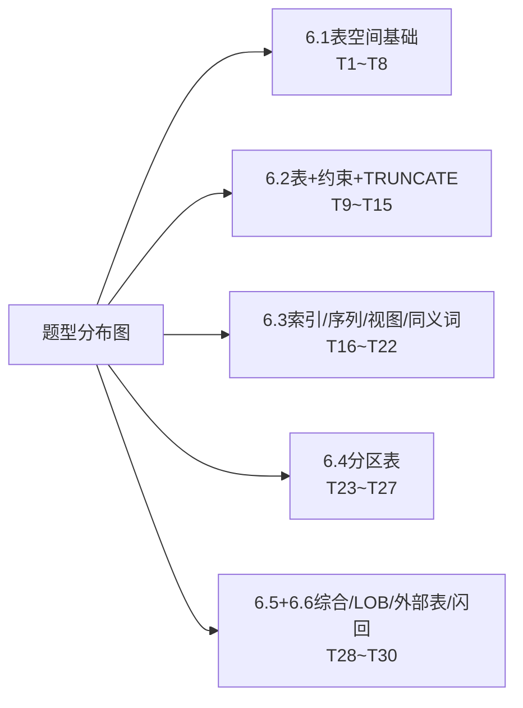

# MOC - 第6章习题 Oracle表空间与对象管理（共30题）

> [!info] 本章习题定位
> 覆盖第6章全部核心考点：表空间创建参数、5类约束与TRUNCATE vs DELETE、索引选型(B树/位图)、序列参数、视图CHECK OPTION、分区剪枝与LOCAL索引、LOB压缩、外部表CSV加载、DBLink安全、闪回表/回收站、在线重定义流程。
>
> 题型：SQL命令编写题★、场景案例分析题★★、多选型判断题★、画图分析题★★、生产故障综合题★★★

## 本章学习路径 + 对应题号



## 30道习题

---

### T1【CREATE TABLESPACE 命令编写★★★】
生产环境19c RAC，要求创建业务数据表空间，条件：① 表空间名APP_DATA_TS；② BIGFILE小文件？No，创建**小文件smallfile**永久表空间；③ 初始2个数据文件，各5GB放在`+DATA/ORCL/DATAFILE/`下（ASM）；④ 自动扩展每次512MB，单文件最大32GB；⑤ 本地管理LMT，统一UNIFORM SIZE 16MB；⑥ ASSM自动段空间管理；⑦ NOLOGGING模式节省REDO。写出完整CREATE TABLESPACE SQL。

<details><summary>💡 参考答案要点</summary>

```sql
CREATE SMALLFILE TABLESPACE APP_DATA_TS
  DATAFILE '+DATA/ORCL/DATAFILE/app_data_ts_01.dbf'
    SIZE 5G AUTOEXTEND ON NEXT 512M MAXSIZE 32G,
    '+DATA/ORCL/DATAFILE/app_data_ts_02.dbf'
    SIZE 5G AUTOEXTEND ON NEXT 512M MAXSIZE 32G
  NOLOGGING
  EXTENT MANAGEMENT LOCAL UNIFORM SIZE 16M
  SEGMENT SPACE MANAGEMENT AUTO
  BLOCKSIZE 8K
  DEFAULT COMPRESS FOR OLTP; -- 12c+ 建议默认开OLTP压缩
```

LMT+UNIFORM vs AUTOALLOCATE：生产表空间一般UNIFORM SIZE=64K/1M/16M/64M按业务对象尺寸选。小表64K，大表64M。

</details>

---

### T2【撤销表空间切换操作★★】
原UNDOTBS1满了，DBA新建了UNDOTBS2：`CREATE UNDO TABLESPACE UNDOTBS2 DATAFILE '...' SIZE 20G AUTOEXTEND ON;`
写出完整切换步骤（含参数修改生效方式、原UNDOTBS1下线、如何等待旧事务结束、最后DROP步骤）。

<details><summary>💡 参考答案要点</summary>

```sql
-- Step1：动态切换系统级撤销表空间（不需要重启，SCOPE=BOTH持久+立即生效）
ALTER SYSTEM SET UNDO_TABLESPACE=UNDOTBS2 SCOPE=BOTH;
-- Step2：验证切换成功
SHOW PARAMETER UNDO_TABLESPACE  -- 值应该是UNDOTBS2
-- Step3：查看原UNDOTBS1是否有活动回滚段（有ACTIVE状态的段不能DROP，要等事务结束）
SELECT tablespace_name, segment_name, status FROM DBA_ROLLBACK_SEGS WHERE tablespace_name='UNDOTBS1';
-- STATUS=OFFLINE才能DROP，有PENDING OFFLINE段等事务COMMIT/ROLLBACK
-- Step4：确认UNDOTBS1所有段都OFFLINE后，才能DROP（不能有任何UNEXPIRED过期EXPIRED的EXTENT依赖）
-- 设置短的RETENTION=100等过期，或直接等一段时间
DROP TABLESPACE UNDOTBS1 INCLUDING CONTENTS AND DATAFILES CASCADE CONSTRAINTS;
```

> [!danger] 严禁DROP还有ACTIVE/PENDING OFFLINE段的UNDO表空间！会导致实例崩溃+事务丢失！必须等段都OFFLINE。

</details>

---

### T3【表空间OFFLINE四种模式选择★★】
场景选择：① 业务低峰期做表空间数据文件位置迁移，数据文件全部正常可用 ② 表空间中某个数据文件磁盘损坏已离线，其他数据文件完好 ③ 强制快速下线（先不做检查点）
分别对应：OFFLINE NORMAL / OFFLINE TEMPORARY / OFFLINE IMMEDIATE / OFFLINE FOR DROP 中的哪一个？分别能否ONLINE后要不需要介质恢复？

<details><summary>💡 参考答案要点</summary>

| 场景 | 选模式 | 说明 | ONLINE是否要RECOVER？ |
| ---- | ---- | ---- | ---- |
| ① 所有数据文件完好做迁移 | **NORMAL** | 默认最干净，所有数据文件CHECKPOINT刷脏块+一致SCN | 直接ALTER TABLESPACE ONLINE；不需要RECOVER |
| ② 某数据文件损坏其余完好 | **TEMPORARY** | 所有在线数据文件CHECKPOINT（离线坏文件不写CKPT） | ONLINE前ALTER DATABASE DATAFILE坏文件路径RECOVER（或恢复坏文件）；好文件没问题 |
| ③ 紧急强制下线不检查CKPT | **IMMEDIATE** | 不写CKPT直接下线，SCN不一致 | ONLINE前**必须介质恢复**表空间：`RECOVER TABLESPACE ...;` 不然ONLINE报错 |
| 要迁移文件到新盘后要删旧文件 | OFFLINE NORMAL 后 RENAME | | NORMAL后RENAME DATAFILE再ONLINE不用RECOVER |

</details>

---

### T4【DEFAULT临时表空间与临时表空间组★】
为什么生产数据库必须改默认临时表空间（DATABASE DEFAULT TEMPORARY TABLESPACE）？把TEMP加入TEMP_GROUP临时表空间组有什么好处？SQL怎么写？

<details><summary>💡 参考答案要点</summary>

为什么不能用SYSTEM表空间的默认临时段：① 如果默认临时表空间没设置，新用户TEMPORARY TABLESPACE默认是SYSTEM表空间（`PROPERTY_NAME='DEFAULT_TEMP_TABLESPACE'` DATABASE_PROPERTIES查）；② SYSTEM表空间放临时段会严重影响数据字典性能、产生碎片、SYSTEM表空间满了数据库直接挂。

改默认临时：
```sql
ALTER DATABASE DEFAULT TEMPORARY TABLESPACE TEMP; -- 所有新用户没指定TEMPORARY TABLESPACE的都用TEMP
```

临时表空间组好处：① 一个大排序操作（CREATE INDEX/GROUP BY/DISTINCT大表）可以并发跨多个临时文件（多个TEMPFILE属于同组），IO均衡；② 单TEMPFILE最大32GB，2个组成员=64GB临时空间。
```sql
ALTER TABLESPACE TEMP TABLESPACE GROUP TEMP_GRP;
ALTER TABLESPACE TEMP2 TABLESPACE GROUP TEMP_GRP;
ALTER DATABASE DEFAULT TEMPORARY TABLESPACE TEMP_GRP; -- 整个组当默认临时
```

</details>

---

### T5【DROP TABLESPACE 场景决策★★★】
判断下列DROP命令安全等级（S安全/M中危/D高危+后果+前提）：
1. `DROP TABLESPACE TEST_TS;`
2. `DROP TABLESPACE TEST_TS INCLUDING CONTENTS;`
3. `DROP TABLESPACE USERS INCLUDING CONTENTS AND DATAFILES CASCADE CONSTRAINTS;`
4. 误执行3后，USERS表空间生产数据还能恢复吗？

<details><summary>💡 参考答案要点</summary>

| 命令 | 等级 | 后果 |
| ---- | ---- | ---- |
| ① 无INCLUDING | S | 只删数据字典表空间定义；必须是空表空间（无任何对象段），有对象直接报错不删，安全 |
| ② ONLY CONTENTS无AND DATAFILES | M | 删除表空间中所有对象段（表/索引/LOB/DATA DICTIONARY记录对象被删）；OS上物理DATAFILE还留着（可以重新CREATE TABLESPACE REUSE）；对象没了但文件还在（还能用特殊工具从DATAFILE抽数据） |
| ③ INCLUDING CONTENTS AND DATAFILES + CASCADE CONSTRAINTS | **D 极高危** | ★永久3件事：删所有对象段 + **OS上数据文件直接物理删除（rm命令级别！OS回收站都没）** + 级联删除其他表空间表的外键引用约束指向本空间的表；USERS表空间生产执行后如果没RMAN备份=永久性数据丢失！ |
| 误执行③后恢复 | 只有3条路 | ① RMAN备份恢复表空间TSPITR按时间点（最快）；② Flashback Database整个库到误操作前（有闪回日志）；③ OS上extundelete/特殊工具恢复已删除DBF（不一定成功，DBF被覆盖就不行）**没有备份基本GG** |

生产DROP前铁律：`SELECT COUNT(*) FROM DBA_SEGMENTS WHERE TABLESPACE_NAME='xxx';` + RMAN先备1份 + EXPORT EXPDP逻辑备份1份。

</details>

---

### T6【LMT vs DMT 对比题（多选）】
下列关于本地管理表空间LMT和字典管理DMT的说法，正确的有（ ）
A. LMT用数据文件头部位图管理空闲EXTENT，DMT查询FET$/UET$数据字典表管理空闲EXTENT
B. LMT的EXTENT分配有UNIFORM SIZE和AUTOALLOCATE两种，DMT必须手动指定DEFAULT STORAGE子句
C. Oracle 19c中DMT已经是默认值
D. LMT+ASSM组合下 PCTUSED FREELIST 参数完全被忽略（不用设）
E. SYSTEM表空间19c默认还是DMT，不能转LMT

<details><summary>💡 参考答案要点</summary>

✅ 正确：A、B、D
❌ 错误：C（19c默认LMT，DMT已废弃，SYSTEM都默认LMT）、E（19c SYSTEM表空间是LMT，9i就可以转了；只有SYSAUX必须LMT）

</details>

---

### T7【ASSM vs MSSM 段空间管理多选★】
生产建表空间SEGMENT SPACE MANAGEMENT AUTO（ASSM），下列关于ASSM说法正确的有（ ）
A. ASSM用BLOCK MAP位图管理数据块空闲度（PCTFREE<=75%/50%/25%/全满），替代MSSM的FREELIST列表
B. ASSM下MSSM的PCTUSED、FREELISTS、FREELIST GROUPS三个参数全部**被忽略**（写了也白写）
C. ASSM表空间下不支持SecureFile LOB
D. ASSM表空间下可以用ALTER TABLE SHRINK SPACE回收DELETE后的高水位线空间
E. RAC高并发INSERT的表ASSM依然存在热块问题（右索引、单调递增列），需要用反向键索引/哈希分区解决，和ASSM/MSSM无关

<details><summary>💡 参考答案要点</summary>

✅ 正确：A、B、D、E
❌ 错误：C（SecureFile LOB**强制要求**ASSM表空间！MSSM不支持SecureFile）

</details>

---

### T8【五大默认表空间功能匹配题★】
匹配默认表空间功能：① SYSTEM ② SYSAUX ③ TEMP ④ USERS ⑤ UNDOTBS1
(A) 用户对象默认永久表空间 (B) 存储数据字典表（TAB$/COL$/USER$），数据库挂载必须，损坏不可启动 (C) AWR/ADDMM/Statspack/Oracle Text/Spatial/EM 仓库等辅助组件 (D) 排序/哈希连接/临时表 (E) 事务撤销UNDO，读一致性

<details><summary>💡 参考答案要点</summary>

①→B；②→C；③→D；④→A；⑤→E

SYSAUX满了：数据库不会挂（只是AWR/EM组件不能用），SYSTEM满了：数据库直接挂，不能写数据字典=不能DML。

</details>

---

### T9【CREATE TABLE 约束综合编写题★★★】
编写CREATE TABLE语句：订单表t_order。要求：
- 表空间APP_DATA_TS，COMPRESS FOR OLTP，ENABLE ROW MOVEMENT，PCTFREE=20
- order_id NUMBER(18)主键，约束名ORD_PK，主键索引建在APP_INDX_TS表空间
- user_id NUMBER(10)非空，外键ORD_USER_FK→t_user(user_id)，删除用户级联删除订单
- order_no VARCHAR2(32)唯一键ORD_ORDER_NO_UK
- amount NUMBER(18,2)非空默认0，CHECK大于0，ORD_AMT_CK
- status VARCHAR2(10)，CHECK IN('NEW','PAID','SHIP','DONE','CANCEL')，ORD_STATUS_CK
- create_time DATE默认SYSDATE非空
- 普通索引ORD_USER_ID_IDX建在APP_INDX_TS（外键必须建索引防锁表）

<details><summary>💡 参考答案要点</summary>

```sql
CREATE TABLE app_user.t_order (
  order_id    NUMBER(18) CONSTRAINT ord_pk PRIMARY KEY
    USING INDEX TABLESPACE app_indx PCTFREE 10 INITRANS 4,
  user_id     NUMBER(10)
    CONSTRAINT ord_user_id_nn NOT NULL
    CONSTRAINT ord_user_fk REFERENCES app_user.t_user(user_id) ON DELETE CASCADE,
  order_no    VARCHAR2(32)
    CONSTRAINT ord_order_no_nn NOT NULL
    CONSTRAINT ord_order_no_uk UNIQUE USING INDEX TABLESPACE app_indx,
  amount      NUMBER(18,2) DEFAULT 0
    CONSTRAINT ord_amount_nn NOT NULL
    CONSTRAINT ord_amt_ck CHECK (amount >= 0),
  status      VARCHAR2(10) DEFAULT 'NEW'
    CONSTRAINT ord_status_ck CHECK (status IN ('NEW','PAID','SHIP','DONE','CANCEL')),
  create_time DATE DEFAULT SYSDATE
    CONSTRAINT ord_create_time_nn NOT NULL,
  update_time DATE
)
ORGANIZATION HEAP
PCTFREE 20 INITRANS 4
TABLESPACE app_data_ts
COMPRESS FOR OLTP
ENABLE ROW MOVEMENT
LOGGING;

-- 外键列索引★★★（否则删除用户锁全表！生产必建）
CREATE INDEX app_user.ord_user_id_idx
  ON app_user.t_order(user_id)
  TABLESPACE app_indx ONLINE PCTFREE 10 INITRANS 4;
```

</details>

---

### T10【NOT NULL vs CHECK约束关系题★】
下列关于NOT NULL和CHECK说法，错的有（ ）
A. NOT NULL是单独的一类约束，在DBA_CONSTRAINTS中类型='N'
B. Oracle实际NOT NULL是CHECK (column IS NOT NULL)，DBA_CONSTRAINTS类型=C
C. `ALTER TABLE t MODIFY col NOT NULL;` 如果col列有旧NULL行会直接成功
D. `ALTER TABLE t ADD col VARCHAR2(10) DEFAULT 'X' NOT NULL;` 11g+ 秒级完成（字典存默认值，不逐行UPDATE）
E. CHECK约束条件可以引用其他表的列（实现跨表校验）

<details><summary>💡 参考答案要点</summary>

❌ 错误：A、C、E
✅ 正确：B、D

A. NOT NULL类型是C（CHECK），DBA_CONSTRAINTS.CONSTRAINT_TYPE P/R/U/C/O，没有专门N类型；
C. MODIFY col NOT NULL 前旧数据只要有1行col=NULL → 直接报错ORA-02296 无法启用，必须先UPDATE col='X'把所有NULL清掉才能加；
E. CHECK约束只能引用本表本行行内列，不能引用其他表/其他行（要跨表校验→触发器/外键/应用层）。

</details>

---

### T11【外键级联动作场景选型★】
3种外键ON DELETE动作：(A) ON DELETE CASCADE (B) ON DELETE SET NULL (C) NO ACTION 默认
匹配业务场景：
① 用户表→订单表，删用户必须把用户订单也删？
② 员工表manager_id自引用外键→员工表employee_id，删经理行，下属的manager_id应该为空？
③ 用户表→支付流水表，还有支付流水记录的用户绝对不能删？

<details><summary>💡 参考答案要点</summary>

①→A（CASCADE）；②→B（SET NULL）；③→C（NO ACTION默认，有子记录删主记录直接报错ORA-02292子记录存在）

生产①CASCADE慎用支付流水这种强合规数据，绝对不能CASCADE！应该先逻辑删用户is_deleted='Y'，订单保留历史审计。

</details>

---

### T12【约束ENABLE NOVALIDATE 场景题★★】
数据仓库STG表要导入1000万条脏历史数据，其中部分旧数据违反CHECK约束（amount负数），但要允许进（历史数据不追究）；未来新导入数据必须符合amount>=0。怎么加CHECK约束最合理？写出SQL。

<details><summary>💡 参考答案要点</summary>

```sql
-- Step1：先DISABLE NOVALIDATE加约束（不查历史脏数据，未来DML也不校验=可以先插脏数据）
ALTER TABLE t_stg ADD CONSTRAINT amt_ck CHECK (amount >= 0) DISABLE NOVALIDATE;
-- Step2：导入脏历史数据期间DML不校验
INSERT /*+APPEND PARALLEL(8)*/ INTO t_stg NOLOGGING ...; COMMIT;
-- Step3：导入完后切 ENABLE NOVALIDATE（未来新INSERT/UPDATE必须amount>=0，历史负数不追究）
ALTER TABLE t_stg MODIFY CONSTRAINT amt_ck ENABLE NOVALIDATE;
-- 可选：查询优化器需要 RELY 告诉CBO：我保证约束逻辑有效可以剪枝
ALTER TABLE t_stg MODIFY CONSTRAINT amt_ck RELY;
-- 如果想要彻底VALIDATE历史数据（花时间检查所有历史行）：ALTER TABLE ... ENABLE VALIDATE;（有脏数据就报错，需先清理）
```

ENABLE NOVALIDATE + RELY = 数据仓库最常用组合：不校验历史，但阻止未来脏数据+告诉CBO优化器可以用约束进行剪枝。

</details>

---

### T13【TRUNCATE TABLE vs DELETE FROM 终极对比★★★】
10个维度对比：① 语言类型（DDL/DML）② 可回滚 ③ 高水位线HWM ④ 触发器触发 ⑤ UNDO大小 ⑥ 允许WHERE条件 ⑦ 外键影响 ⑧ 所需权限等级 ⑨ 执行速度 ⑩ DROP ANY TABLE权限要不要？（TRUNCATE）

<details><summary>💡 参考答案要点（和6.2节表一致）</summary>

| 维度 | DELETE | TRUNCATE |
| --- | --- | --- |
| ① 类型 | DML | DDL+隐式COMMIT |
| ② 回滚性 | ✅ COMMIT前ROLLBACK | ❌ 不可ROLLBACK（只有闪回/RMAN） |
| ③ HWM | 不变 | 归零 |
| ④ 触发器 | 逐行触发DELETE触发器 | ❌ 完全不触发DML触发器 |
| ⑤ UNDO | 极大（逐行） | 极小 |
| ⑥ WHERE条件 | ✅ | ❌ 整表/整分区 |
| ⑦ 外键 | CASCADE/默认报错 | 子表有外键默认ORA-02266即使空表！先DISABLE子表FK或12c+ CASCADE |
| ⑧ 权限 | 对象级DELETE ANY TABLE/TABLE对象权限 | 系统级DROP ANY TABLE（极高权限！）|
| ⑨ 速度 | 慢（线性） | 秒级（无关数据量） |
| ⑩ DROP权限 | 不 | TRUNCATE等价拥有DROP |

</details>

---

### T14【Oracle专有数据类型坑判断题★】
判断写的SQL有没有Oracle坑，错在哪？怎么改？
① `SELECT COUNT(*) FROM t WHERE name = ''`
② `SELECT * FROM orders WHERE create_date = DATE'2024-05-20'` 要查2024-05-20当天所有下单
③ `ALTER TABLE t ADD (col VARCHAR2(100)) DEFAULT 'N' NOT NULL;` 11g+是秒级还是锁表？
④ MySQL存INT(11)，迁移到Oracle用NUMBER(11)可以不？
⑤ `SELECT COUNT(*) FROM t WHERE col IS NULL` 普通B树索引(col)上能不能走索引？

<details><summary>💡 参考答案要点</summary>

① ❌ Oracle空字符串''=NULL，WHERE col='' 0行，改`WHERE name IS NULL`
② ❌ Oracle DATE含时分秒，DATE'2024-05-20'='2024-05-20 00:00:00'，当天08:00订单查不到。改：`WHERE create_date >= DATE'2024-05-20' AND create_date < DATE'2024-05-21'` 或 `TRUNC(create_date) = DATE'...'`（后者对create_date加函数走不到普通索引，需要函数基索引）
③ ✅ 11g+ DEFAULT + NOT NULL成对写→秒级字典存默认值；如果DEFAULT不带NOT NULL→全表逐行UPDATE锁表
④ ✅ NUMBER(11)没问题；但身份证/手机号/银行卡号不要NUMBER→要VARCHAR2，NUMBER丢前导0或18位溢出
⑤ ❌ 普通单列B树索引不存NULL行，WHERE IS NULL全表扫描；改位图索引存NULL行/函数基索引NVL(col,'X')，或者加AND col IS NULL同时有其他高选择率索引条件走其他索引。

</details>

---

### T15【约束类型匹配★★】
DBA_CONSTRAINTS.CONSTRAINT_TYPE：P/R/U/C/O/V 对应：① PRIMARY KEY ② FOREIGN KEY ③ UNIQUE ④ CHECK/NOT NULL ⑤ READ ONLY视图约束 ⑥ WITH CHECK OPTION视图约束

<details><summary>💡 参考答案要点</summary>

P→①；R→②REFERENTIAL外键；U→③；C→④（CHECK+NOT NULL都是C）；O→⑤（视图READ ONLY）；V→⑥（视图CHECK OPTION）。

</details>

---

### T16【索引选型综合题（B树/位图/函数/反向键）★★★】
选出合适的索引类型（A普通B树 B复合B树前缀C位图D函数基E反向键F域索引Oracle Text）并说明理由：
① OLTP订单表order_id NUMBER(18)单调递增主键，RAC 3节点，大量并发INSERT出现enq: TX - index contention热点块冲突？
② 报表库DW用户表，gender列（M/F）2个值，status列8个状态，region列34个省，几乎不DML，大量AND/OR组合条件过滤WHERE gender='F' AND region='GD' AND status='ACTIVE'。
③ OLTP订单表，业务查询经常写WHERE UPPER(email) = :B1
④ OLTP订单表，dept_id(100个值,区分度中)+ status(10个值) + create_date，常用条件WHERE dept_id=:B1 AND status=:B2 AND create_date>=:B3。索引列顺序怎么排？
⑤ 文档管理系统，对CLOB文章内容做关键词检索：WHERE CONTAINS(doc_content, 'Oracle DBA') > 0

<details><summary>💡 参考答案要点</summary>

①→E反向键REVERSE：单调递增主键RAC→右侧叶子块3节点同时INSERT热冲突，反向键打散字节到所有叶子块，热冲突消失（范围扫描失效等值不影响）
②→C位图索引，低基数+极少DML+AND/OR极快（OLTP不能位图，行锁变段锁）
③→D函数基索引：CREATE INDEX ... ON t(UPPER(email))，或11g+虚拟列+索引
④ B复合索引顺序原则：等值列在前+高选择率在前→(dept_id, status, create_date)。等值列dept_id/status先写（CBO能用INDEX SKIP SCAN/RANGE SCAN组合），范围列create_date最后
⑤→F域索引Oracle Text（CREATE INDEX ... INDEXTYPE IS CTXSYS.CONTEXT），普通B树不能给CLOB建。

</details>

---

### T17【CREATE INDEX ONLINE 判断题★】
关于`CREATE INDEX xxx ON t(col) TABLESPACE ts ONLINE;`说法正确的有（ ）
A. ONLINE=创建索引期间允许在t表上执行INSERT/UPDATE/DELETE DML（不加表级DML锁）
B. ONLINE创建期间Oracle启动临时日志表（SYS_JOURNAL_xxx），记录期间DML，索引建好后合并进去
C. ONLINE=NOPARALLEL，不能开并行PARALLEL n，会锁表
D. ONLINE创建失败时（如空间满中断），字典中不会留INDX_ONL$_xxx临时对象残留
E. 大表500GB建索引，生产应该用ONLINE+PARALLEL 8 + NOLOGGING组合，再ALTER INDEX LOGGING

<details><summary>💡 参考答案要点</summary>

✅ 正确：A、B、E
❌ 错误：C（ONLINE可以开PARALLEL，完全不冲突）；D（ONLINE失败留INDX_ONL$_临时对象和SYS_JOURNAL_日志表，需手动PURGE或DROP TABLE xxx ONLINE CLEANUP）

</details>

---

### T18【位图索引死锁场景案例分析★★】
OLTP电商库订单status列（10个值），开发建了位图索引想加速`WHERE status='PAID' AND ...`查询，结果大促时大量用户支付成功后`UPDATE t_order SET status='PAID' WHERE order_id=:B1`语句，大量会话等待`enq: TX - contention`锁，业务全挂。分析原因+解决方案。

<details><summary>💡 参考答案要点</summary>

根本原因：**位图索引的锁是段级锁不是行级锁！** 修改1个status=NEW→PAID行，位图索引中NEW位图串+PAID位图串两个位图段全部锁住，锁住了**这两个状态对应的所有上千/上万行**（不是1行）；两个并发支付会话改不同order_id的行，但要修改相同的两个位图段→互相等待TX锁=大量死锁，业务雪崩。

修复方案（三选一，推荐前两个）：
1. 【推荐】DROP位图索引，改普通B树索引CREATE INDEX ord_status_idx ON t_order(status) ONLINE; 虽然B树区分度低（10个值），但是**行级锁不会冲突**，OLTP安全第一。status='PAID'只占5%总行数，B树INDEX RANGE SCAN性能也可以（>5%也比挂了强）。
2. 【更优】复合B树索引：(user_id, status, create_date) 等值列在前，status只是组合条件之一，选择率大幅提升。
3. 【极不推荐】保留位图，改应用逻辑，UPDATE时加排他锁SELECT ... FOR UPDATE串行化，吞吐量降到1/1000，不现实。

</details>

---

### T19【序列CACHE参数锁争用题★】
OLTP每秒5000+新订单INSERT，序列`CREATE SEQUENCE order_id_seq CACHE 20 NOCYCLE NOORDER;` AWR大量TOP EVENT `enq: SQ - contention`锁争用，原因？怎么改？RAC集群下ORDER参数有什么影响？

<details><summary>💡 参考答案要点</summary>

原因：CACHE=20太小！高并发取NEXTVAL，20个缓存值1秒不到用光→频繁要访问SEQ$字典表取下一批20个，期间整个序列化操作加SQ enqueue排他锁，所有取NEXTVAL的会话排队，SQ锁争用严重。

修改：① CACHE加大到生产建议值1000~10000（根据TPS估算，1000TPS=1000CACHE可以1秒不冲突，CACHE=10000=10秒不冲突）。CACHE大唯一的坏处：实例异常CRASH时CACHE中没用到的序列值丢失（产生跳号，主键不允许跳号的业务不能接受，但绝大多数业务跳几个号没关系）。
```sql
ALTER SEQUENCE order_id_seq CACHE 10000 NOCYCLE;
```

RAC ORDER参数：默认NOORDER（默认）=每个RAC节点独立缓存一段范围（节点1缓存1~10000，节点2缓存10001~20000），所以ID不是严格按提交时间全局递增（用户A先提交但连在节点2，拿到的ID=10001比后提交用户B节点1的ID=2大）。业务严格要求按时间全局序，开ORDER参数，代价是每次取序列要RAC全局锁同步，性能下降20%~50%。

</details>

---

### T20【VIEW WITH CHECK OPTION 场景题★】
视图定义：
```sql
CREATE VIEW dept20_emp_v AS
SELECT empno, ename, sal, deptno FROM emp WHERE deptno=20
WITH CHECK OPTION CONSTRAINT dept20_ck;
```
执行下列SQL会成功还是失败？为什么？
① `INSERT INTO dept20_emp_v VALUES (9999, 'NEW', 3000, 20);`
② `INSERT INTO dept20_emp_v VALUES (9998, 'NEW', 3000, 30);`
③ `UPDATE dept20_emp_v SET sal=sal*2 WHERE empno=7369;`（7369原本deptno=20）
④ `UPDATE dept20_emp_v SET deptno=30 WHERE empno=7369;`
⑤ `UPDATE dept20_emp_v SET deptno=30 WHERE deptno=30;`（0行影响还是报错？）

<details><summary>💡 参考答案要点</summary>

① ✅ 成功：deptno=20，WITH CHECK OPTION过滤WHERE=20满足
② ❌ ORA-01402视图CHECK OPTION违反：deptno=30不满足WHERE deptno=20，INSERT的结果行不在视图可见范围内，CHECK拒
③ ✅ 成功：sal改，deptno仍=20，行仍在视图范围
④ ❌ 同②报错：UPDATE后deptno=30，行跑出视图范围，CHECK拒
⑤ ✅ 成功0行受影响：WHERE条件过滤0行，UPDATE不执行任何行，不会违反CHECK（有行UPDATE出来=报错）

</details>

---

### T21【同义词权限关系题★】
HR用户建`CREATE SYNONYM emp_syn FOR hr.employees;`并把emp_syn的SELECT权限GRANT给SCOTT。SCOTT能不能SELECT * FROM hr.emp_syn？为什么？需要什么？

<details><summary>💡 参考答案要点</summary>

**不能！** 同义词只是指针别名，最终访问的是底层对象hr.employees，需要真正的对象权限在底层对象上。SCOTT没有hr.employees的SELECT权限→执行emp_syn会报ORA-01031权限不足。

**解决**：HR（或DBA）真正GRANT底层对象：
```sql
GRANT SELECT ON hr.employees TO scott;  -- ★必须授权底层表，不是授权同义词！
```

公有同义词PUBLIC同理：`CREATE PUBLIC SYNONYM emp FOR hr.employees;` 所有人能看见同义词名，但SELECT还是需要真正`GRANT SELECT ON hr.employees TO xxx;`，GRANT TO PUBLIC就是所有用户能访问。

</details>

---

### T22【索引INVISIBLE vs UNUSABLE vs DISABLED 多选★】
11g+ INVISIBLE索引，对比UNUSABLE、DISABLE状态：
A. INVISIBLE索引段实际存在，DML期间还维护INSERT/UPDATE/DELETE同步更新索引；只是优化器CBO默认看不见（OPTIMIZER_USE_INVISIBLE_INDEXES=FALSE默认）不参与执行计划
B. UNUSABLE索引段存在但标记不可用，DML期间不维护（后续越积越落后），查询想用也报错，DBA_INDEXES.STATUS=UNUSABLE
C. DISABLED是约束状态不是索引状态；约束DISABLE NOVALIDATE不检查约束，索引可能独立VALID
D. 线上先测试删索引的影响：应该先DROP INDEX ...（立即不可恢复）
E. 测试索引不用能不能删的正确姿势：先ALTER INDEX ... INVISIBLE；观察1~2周AWR/业务性能没影响→再DROP

<details><summary>💡 参考答案要点</summary>

✅ 正确：A、B、C、E
❌ 错误：D（DROP后重建大表几小时到几天，INVISIBLE可逆，V秒切回来，推荐先INVISIBLE观察一段时间再DROP。）

</details>

---

### T23【RANGE分区表编写题★★★】
写SQL创建RANGE+INTERVAL按月自动分区销售表：① 表sales按time_id DATE RANGE分区；② INTERVAL自动按月建；③ 种子分区p2022 VALUES LESS THAN 2023-01-01归档HDD表空间COMPRESS HIGH；④ 1月p202301（archive表空间COMPRESS QUERY LOW）、2月p202302；⑤ 表时间列ENABLE ROW MOVEMENT；⑥ sales_id NUMBER(18)主键LOCAL索引在INDX表空间。

<details><summary>💡 参考答案要点</summary>

```sql
CREATE TABLE sh.sales (
  sales_id NUMBER(18) NOT NULL,
  prod_id NUMBER(6) NOT NULL,
  time_id DATE NOT NULL,
  cust_id NUMBER(10) NOT NULL,
  amount NUMBER(10,2),
  CONSTRAINT sales_pk PRIMARY KEY (sales_id, time_id)   -- ★★ 主键必须包含分区键time_id，才能建LOCAL唯一索引！
    USING INDEX LOCAL STORE IN (sh_indx_ts)
)
PARTITION BY RANGE (time_id)
INTERVAL (NUMTOYMINTERVAL(1,'MONTH'))
(
  PARTITION p2022 VALUES LESS THAN (DATE'2023-01-01')
    TABLESPACE archive_hdd_ts COMPRESS FOR ARCHIVE HIGH,
  PARTITION p202301 VALUES LESS THAN (DATE'2023-02-01')
    TABLESPACE archive_hdd_ts COMPRESS FOR QUERY LOW,
  PARTITION p202302 VALUES LESS THAN (DATE'2023-03-01')
    TABLESPACE sh_data_ts COMPRESS FOR OLTP
)
TABLESPACE sh_data_ts
ENABLE ROW MOVEMENT;
```

> [!note] 主键LOCAL唯一索引，主键列必须包含分区键time_id，否则Oracle不知道唯一约束落哪个LOCAL分区（ORA-14039报错）。只sales_id做唯一主键→必须建GLOBAL唯一索引（DROP分区会失效）。生产推荐主键包含分区键+LOCAL索引维护简单。

</details>

---

### T24【分区剪枝Partition Pruning判断题★★】
sales按time_id RANGE按月分区。哪些SQL会触发分区剪枝（只扫1~3个分区）？剪枝成功写✅+Pstart/Pstop预期；❌不剪+原因+怎么改？
① `SELECT * FROM sales WHERE TO_CHAR(time_id,'YYYY-MM')='2024-05'`
② `SELECT * FROM sales WHERE time_id >= DATE'2024-05-01' AND time_id < DATE'2024-06-01'`
③ `SELECT * FROM sales WHERE time_id + 7 > DATE'2024-05-20'`（time_id加了7天再比较）
④ `SELECT * FROM sales WHERE time_id = '2024-05-20'`（隐式VARCHAR2→DATE转换）
⑤ `SELECT * FROM sales WHERE time_id BETWEEN DATE'2024-01-01' AND DATE'2024-03-31'`

<details><summary>💡 参考答案要点</summary>

① ❌ 不剪！对分区键time_id加了TO_CHAR函数，CBO算不出范围→扫所有分区。改：`WHERE time_id >= DATE'2024-05-01' AND time_id < DATE'2024-06-01'`
② ✅ Pstart=对应5月分区号，Pstop=同=5月分区1个，完美剪
③ ❌ 不剪！time_id列+表达式，函数等价加在列上→隐式函数全扫。改：`WHERE time_id > DATE'2024-05-20' - 7`（移到右侧）
④ ❌ 不剪！隐式类型转换CHAR→DATE，等价`WHERE TO_DATE(time_id) = ...` 函数加列→全扫。改：写`time_id = DATE'...'`或`TO_DATE(字符串,...)`条件放右侧
⑤ ✅ 1~3月3个分区，Pstart=1月分区号，Pstop=3月分区号，3个分区扫

> [!warning] 头号杀手：WHERE中分区键加函数/表达式/隐式转换=分区不剪=花了分区钱没享受到性能！生产SQL必须严格避免。

</details>

---

### T25【LOCAL vs GLOBAL分区索引选型场景★★】
T级别大表按月RANGE分区，下列场景用LOCAL还是GLOBAL？理由？
① 按年DROP最老分区（每月做ALTER TABLE DROP PARTITION历史归档），不想DROP分区后花5小时REBUILD索引？
② 表主键是唯一order_id VARCHAR2(32)（不包含分区键time_id），需要全局唯一？
③ 所有查询SQL WHERE条件都带time_id分区键范围？
④ 查询几乎不带time_id，只查`WHERE user_id=:B1`？用户ID高基数字段索引（LOCAL USER_ID索引每个分区要扫一次？性能差？）

<details><summary>💡 参考答案要点</summary>

① **LOCAL（首选）**！DROP/TRUNCATE分区：LOCAL索引对应分区同步DROP，其他索引分区100% VALID，无任何影响；GLOBAL索引→100% UNUSABLE，必须UPDATE GLOBAL INDEXES子句（代价大）或REBUILD（TB级索引几小时）。频繁分区维护的大表：LOCAL是必选项。
② **GLOBAL唯一索引**（如果主键不包含分区键time_id）：LOCAL唯一索引要求索引列必须包含所有分区键（time_id），只有order_id做不到；必须GLOBAL PARTITION BY RANGE(order_id)全局分区。生产建议修改主键：(order_id, time_id)复合主键包含分区键→转LOCAL。
③ **LOCAL**：WHERE带分区键，剪枝到3个分区，LOCAL 3个索引分区扫，GLOBAL也是3个但是维护麻烦→LOCAL优。
④ **两难选择**：不带分区键→LOCAL索引=全表分区数12×N个索引分区全部扫一遍（12个月份=12次INDEX RANGE SCAN=INDEX FULL SCAN(MULTI PARTITION)代价大）；GLOBAL user_id全局分区索引=只扫1个索引分区，查询快；但代价是每次DROP历史分区→GLOBAL索引UNUSABLE，UPDATE GLOBAL INDEXES要额外花时间。

决策：DROP分区频率高（每月1次）且能接受UPDATE GLOBAL INDEXES额外开销→GLOBAL；否则改SQL强制带分区键/加应用层条件→LOCAL。

</details>

---

### T26【分区维护综合题：EXCHANGE PARTITION 加载千万行★★★】
大表sales按月分区，每月要加载1000万行新数据到当月分区。方案对比：A) 普通INSERT /*+APPEND*/ 1000万行到分区 B) EXCHANGE PARTITION+普通临时表LOAD+秒级交换。写出B方案的完整步骤SQL+为什么快几个数量级？

<details><summary>💡 参考答案要点</summary>

B方案步骤：
```sql
-- Step1：创建临时交换表STAGING（结构、约束、索引和sales表完全一致）
CREATE TABLE sh.sales_stg EXCHANGE TABLE FOR sh.sales; -- 12c+一键创建兼容表
-- 老版本：CREATE TABLE sh.sales_stg AS SELECT * FROM sh.sales WHERE 1=0; 手动对齐约束索引

-- Step2：直接路径APPEND加载1000万到临时表（NOLOGGING+PARALLEL 8，十几分钟完成）
INSERT /*+APPEND PARALLEL(8) LEADING(ext) USE_HASH(ext)*/ INTO sh.sales_stg NOLOGGING
SELECT * FROM sh.ext_sales_csv ext; COMMIT;

-- Step3：STG表建与sales相同LOCAL结构的索引/约束
-- （省略，结构和sales索引/约束对齐要一致，不然EXCHANGE INCLUDING INDEXES报错）

-- Step4：★★★秒级EXCHANGE！只改数据字典中STG段和P202405段的指针归属！1000万行1秒交换完成！
ALTER TABLE sh.sales
  EXCHANGE PARTITION p202405
  WITH TABLE sh.sales_stg
  INCLUDING INDEXES
  WITHOUT VALIDATION   -- 已确保STG数据time_id都在2024-05范围内，省校验时间
  UPDATE GLOBAL INDEXES;

-- Step5：校验+DROP临时表（里面是交换前P202405旧数据，没用了）
SELECT COUNT(*) FROM sh.sales PARTITION(p202405);
DROP TABLE sh.sales_stg PURGE;
```

为什么快：EXCHANGE PARTITION只修改数据字典（SYS.TAB$/IND$/SEG$/OBJ$等）中的段ID归属，不实际移动任何数据块→秒级。方案A INSERT 1000万行：1000万次UNDO+REDO+索引维护+日志切换，慢100倍，而且会锁表争用。

EXCHANGE PARTITION + EXTERNAL TABLE = DW入仓ETL标准流程（T+1日结批处理经典）。

</details>

---

### T27【DROP PARTITION 操作危险点★】
DBA执行`ALTER TABLE sales DROP PARTITION p202001;`后，发现所有查询sales表报ORA-01502 index 'SH.SALES_GLOBAL_IDX' or partition of such index is in unusable state。为什么？怎么避免？两条路。

<details><summary>💡 参考答案要点</summary>

原因：sales表上有GLOBAL分区/非分区索引。DROP/TRUNCATE/SPLIT/MERGE/EXCHANGE表分区→GLOBAL索引的所有分区/整个索引标记为UNUSABLE（因为Oracle不知道哪些行被删了，索引条目无法同步），CBO想用就直接报错。

避免两条路：
1. **【推荐】生产设计全用LOCAL索引（90%场景）**：DROP分区只DROP对应LOCAL索引分区，其他所有分区VALID→完全不影响。
2. 必须用GLOBAL索引：分区维护DDL带`UPDATE GLOBAL INDEXES`子句，边DROP分区边同步维护GLOBAL索引，索引始终VALID不会UNUSABLE。
```sql
ALTER TABLE sales DROP PARTITION p202001 UPDATE GLOBAL INDEXES PARALLEL 4;
-- 代价：DROP分区变慢（同步维护GLOBAL索引I/O），但索引不用重建，一直可用。
```
如果已经UNUSABLE了，只能全索引REBUILD ONLINE：
```sql
ALTER INDEX sh.sales_global_idx REBUILD PARTITION ALL ONLINE PARALLEL 8 NOLOGGING;
```

</details>

---

### T28【SecureFile LOB多选题★】
SecureFile LOB相比BasicFile有什么额外高级特性？（ ）
A. COMPRESS LOW/MEDIUM/HIGH 透明压缩，空间省50%~80%
B. DEDUPLICATE LOB 相同内容LOB去重（上传重复PDF只存1份）
C. ENCRYPT USING 'AES256' TDE透明列加密
D. 需要MSSM手动段空间管理表空间才能启用
E. ENABLE STORAGE IN ROW：<4000字节小LOB存行内，节省一次LOB段I/O
F. 支持分区表LOCAL LOB分区对齐

<details><summary>💡 参考答案要点</summary>

✅ 正确：A、B、C、E、F
❌ 错误：D（SecureFile必须**ASSM**自动段空间管理！MSSM老表空间无法创建SecureFile）

</details>

---

### T29【外部表CSV加载故障排查★★】
DBA外部表加载`CREATE TABLE ext(...) ORGANIZATION EXTERNAL(TYPE ORACLE_LOADER DEFAULT DIRECTORY ext_dir LOCATION('a.csv'));` SELECT * FROM ext报错：
A. ORA-29913: error in executing ODCIEXTTABLEOPEN callout + ORA-29400: data cartridge error + KUP-04063: unable to open log file a.log → 原因？
B. ORA-01722: invalid number 外部表number列加载CSV第3行失败→原因？怎么查第几行坏了？
C. 所有中文字段全是???乱码→原因？
D. SELECT * FROM ext WHERE id=100极慢→为什么？

<details><summary>💡 参考答案要点</summary>

A. **权限问题**：ext_dir目录对象Oracle OS用户（oracle:oinstall）对OS上的目录路径没有写权限（建LOGFILE/BADFILE需要写权限）。解决：`chmod 775 /u01/ext_dir && chown oracle:oinstall /u01/ext_dir` 或 GRANT READ,WRITE ON DIRECTORY ext_dir TO ...（两个WRITE：① 目录Oracle对象权限 ② OS文件系统权限 都要开！）
B. CSV第3行该number列有非数字字符（比如'12,456'带逗号/空格/'N/A'字符串）。查坏行：看BADFILE（第3行写进去），或REJECT LIMIT UNLIMITED跳过坏行再MINUS查：`SELECT * FROM ext MINUS SELECT ...`；ACCESS PARAMETERS里写`FIELDS DATE_FORMAT ... NULLIF ... = 'N/A'` 预处理。
C. 字符集不匹配。ACCESS PARAMETERS写`CHARACTERSET AL32UTF8`但CSV实际是GBK编码。解决：① 看CSV是UTF8 BOM/GBK：`CHARACTERSET ZHS16GBK`；② UltraEdit转码CSV为UTF8。
D. 外部表是堆表的外部映射，**根本没有索引！** 所有查询都是全表扫描（External Table Scan）+解析CSV。WHERE id=100必须逐行解析CSV匹配id，1000万行CSV=1000万次解析，极慢。优化：外部表→CTAS加载到普通STAGING堆表→加索引再查询。

</details>

---

### T30【Flashback系列综合故障题★★★★】
生产误操作场景对应闪回恢复技术选型（A Flashback Query B Flashback Table C Flashback Drop+Recycle Bin D Flashback Database E DBMS_FLASHBACK.TRANSACTION_BACKOUT F 无法闪回，只能RMAN恢复）：
① DBA误执行DROP TABLE HR.EMPLOYEES;
② 开发误UPDATE hr.employees SET salary=0 WHERE 1=1; 且COMMIT了；
③ 升级脚本把100个存储过程、50张表结构改乱了，业务全挂要回到1小时前全库状态；
④ TRUNCATE TABLE HR.EMPLOYEES; 清空了所有员工；
⑤ 要查昨天下午某订单3点修改前的旧值（只看不改）
⑥ 误执行了一个1亿行的大事务批量UPDATE整个账户表余额+COMMIT，要撤销事务反向SQL

<details><summary>💡 参考答案要点</summary>

①→C Flashback Drop+Recycle Bin：`FLASHBACK TABLE hr.employees TO BEFORE DROP;`秒级恢复（前提PURGE没删/表空间没压力自动清）
②→B Flashback Table：`ALTER TABLE hr.employees ENABLE ROW MOVEMENT; FLASHBACK TABLE hr.employees TO TIMESTAMP ...;` UNDO_RETENTION够（>误操作经过的时间）+ROW MOVEMENT开
③→D Flashback Database：整个库回退，`SHUTDOWN IMMEDIATE; STARTUP MOUNT EXCLUSIVE; FLASHBACK DATABASE TO TIMESTAMP ...; ALTER DATABASE OPEN RESETLOGS;` 前提是开了闪回日志+FRA够大
④→F 无法闪回！！TRUNCATE是DDL且不进回收站（Recycle Bin只DROP才进），UNDO里也没有整表行级旧值（TRUNCATE不产生逐行UNDO）。只有3条路：① RMAN TSPITR表空间时间点恢复 ② Oracle Flashback Data Archive（FDA闪回归档，提前开启的话）③ 逻辑备份IMPDP。生产切记TRUNCATE前先CTAS备份！
⑤→A Flashback Query：`SELECT * FROM hr.orders AS OF TIMESTAMP TO_TIMESTAMP('2024-05-20 15:00:00','YYYY-MM-DD HH24:MI:SS') WHERE order_id=123;` 只看旧值不用恢复表
⑥→E DBMS_FLASHBACK.TRANSACTION_BACKOUT（11g+）：先查V$LOGMNR/FLASHBACK_TRANSACTION_QUERY找事务XID，调TRANSACTION_BACKOUT自动生成反向UNDO SQL回滚1亿行+所有级联依赖事务，保证数据一致性（比手动写反向UPDATE安全N倍）。

场景④TRUNCATE最容易混淆：**TRUNCATE不进Recycle Bin，不等于DROP**！很多初级DBA以为可以Flashback Drop救TRUNCATE，直接GG，必须背下来。

</details>

---

## 章节导航

- 上一章习题：[[MOC - 第5章习题]]
- 下一章习题：[[MOC - 第7章习题]]
- 返回本章知识点总览：[[MOC - 第6章]]
