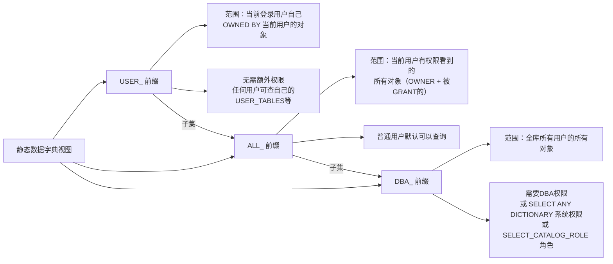
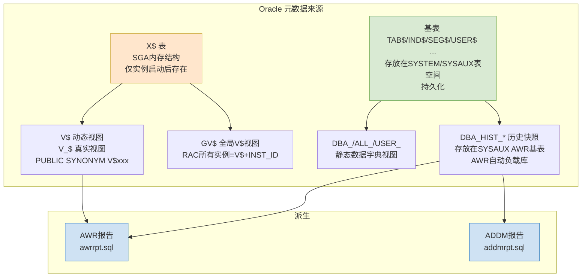

# 10.1 常用数据字典视图

> [!definition] 数据字典定义
> **Oracle 数据字典（Data Dictionary）** 是 Oracle 数据库的"元数据库"，是一组由 Oracle Server 自动维护的**只读**系统表与视图，存储数据库自身的描述信息：物理结构（数据文件/控制文件/日志文件）、逻辑结构（表空间/段/区/块）、对象定义（表/索引/约束/视图/过程）、用户权限与角色、空间使用情况、统计信息等。数据字典是 DBA 排查问题时最核心的信息来源。
>
> 数据字典视图分两大家族：
> - **静态数据字典视图**（DBA_ / ALL_ / USER_ 前缀）：存放在 SYSTEM/SYSAUX 表空间的基表中，持久化保存，实例关闭也存在；
> - **动态性能视图**（V$ / GV$ 前缀）：底层是 X$ 内存表，实时反映 SGA/PGA 中的运行时状态，**仅实例运行时存在**，实例关闭内容消失，重启清零。

---

## 一、静态数据字典视图三大前缀



> [!example] 三大前缀实际查询对比
> 假设 SCOTT 用户有 5 张自己的表，HR 用户把自己的 JOBS 表 SELECT 授权给 SCOTT，DBA 用户的 SYSTEM 模式有 300 张表：
> - SCOTT 查 `SELECT COUNT(*) FROM USER_TABLES` → 5
> - SCOTT 查 `SELECT COUNT(*) FROM ALL_TABLES` → 5 + 1(HR.JOBS) = 6（只显示能访问的）
> - DBA(SYSTEM) 查 `SELECT COUNT(*) FROM DBA_TABLES` → 5(SCOTT) + HR 所有表 + SYSTEM 300 表 = 全库总数

> [!note] Oracle 独有 vs MySQL 信息库对比
> | 维度 | Oracle | MySQL |
> | ---- | ---- | ---- |
> | 静态数据字典 | DBA_ / ALL_ / USER_ 三套体系，视图名语义化 | 一套 `information_schema` 数据库，所有元数据通过查表获得 |
> | 运行时性能表 | V$ 动态视图（内存中 X$ 表） | performance_schema（MySQL 5.6+） + SHOW PROCESSLIST 等 |
> | 对象名前缀 | 表前缀清晰分类：DBA_TABLES / DBA_INDEXES | information_schema.TABLES / STATISTICS |
> | 权限 | DBA_ 视图必须 DBA / SELECT_CATALOG_ROLE 角色 | information_schema 所有用户可读，只过滤出有权限的表 |
> | 实时性能数据 | V$SYSSTAT / V$SESSTAT 非常详细 | SHOW GLOBAL STATUS，维度和粒度远不如 Oracle V$ |

---

## 二、常用静态数据字典视图（DBA_ 前缀，ALL_/USER_ 对应类似）

### 2.1 对象与存储类

| 视图名 | 作用 | 常用排查场景 |
| ---- | ---- | ---- |
| **DBA_TABLES** | 所有表的元信息：OWNER/TABLESPACE_NAME/NUM_ROWS/BLOCKS/AVG_ROW_LEN/LAST_ANALYZED/DEGREE/PARTITIONED | 检查表是否收集统计信息（LAST_ANALYZED 是否过旧）、估算表大小 |
| **DBA_TAB_COLUMNS** | 所有表列：列名/类型/可空/NUM_DISTINCT/HIGH_VALUE/LOW_VALUE/CHAR_COL_DECL_LENGTH | 分析列基数，判断是否适合建索引 |
| **DBA_INDEXES** | 所有索引：OWNER/INDEX_NAME/TABLE_OWNER/TABLE_NAME/INDEX_TYPE/UNIQUENESS/BLEVEL/LEAF_BLOCKS/DISTINCT_KEYS/LAST_ANALYZED/STATUS(VALID/UNUSABLE) | 检查索引树高度 BLEVEL（通常 ≤3）、叶子块、索引是否失效 UNUSABLE |
| **DBA_IND_COLUMNS** | 索引中的列及顺序（COLUMN_POSITION）、升序降序（DESCEND） | 查看复合索引的列顺序，判断前缀列是否被 WHERE 条件使用 |
| **DBA_SEGMENTS** | 所有段对象（表段/索引段/回滚段/临时段等）：SEGMENT_NAME/SEGMENT_TYPE/TABLESPACE_NAME/BYTES/BLOCKS/EXTENTS/HEADER_FILE/HEADER_BLOCK | **查大表/大索引占用空间**，磁盘空间告警第一时间查 |
| **DBA_EXTENTS** | 每个段的区分配详情：SEGMENT_NAME/EXTENT_ID/FILE_ID/BLOCK_ID/BLOCKS/BYTES | 分析段碎片（EXTENTS 是否过多） |
| **DBA_PART_TABLES / DBA_TAB_PARTITIONS** | 分区表、分区详情：TABLE_NAME/PARTITIONING_TYPE(SUBPARTITIONING_TYPE)/PARTITION_COUNT/HIGH_VALUE/PCT_FREE | 检查大表分区策略，判断查询是否能做分区剪枝 |

### 2.2 表空间与物理文件类

| 视图名 | 作用 |
| ---- | ---- |
| **DBA_TABLESPACES** | 所有表空间：TABLESPACE_NAME/STATUS(ONLINE/OFFLINE/READ ONLY)/CONTENTS(PERMANENT/TEMPORARY/UNDO)/EXTENT_MANAGEMENT(LOCAL/DICTIONARY)/SEGMENT_SPACE_MANAGEMENT(AUTO/MANUAL)/BIGFILE | 判断是否本地管理 LMT、ASSM 自动段空间 |
| **DBA_DATA_FILES** | 永久/撤销数据文件详情：FILE_ID/FILE_NAME/TABLESPACE_NAME/BYTES/MAXBYTES/INCREMENT_BY/AUTOEXTENSIBLE(YES/NO)/STATUS/USER_BYTES | 看数据文件大小、是否 AUTOEXTEND ON |
| **DBA_TEMP_FILES** | TEMP 临时文件：FILE_ID/FILE_NAME/TABLESPACE_NAME/BYTES/MAXBYTES/AUTOEXTENSIBLE/STATUS | 临时表空间使用率高时查 |
| **DBA_FREE_SPACE** | 表空间可用空间：TABLESPACE_NAME/FILE_ID/BLOCK_ID/BYTES/BLOCKS | 计算空间使用率（=1 - FREE_SPACE / DBA_DATA_FILES.BYTES，注意 LMT 有些系统表空间不精准） |
| **V$TEMP_SPACE_HEADER / V$TEMPSEG_USAGE** | 当前 TEMP 临时段使用情况（谁的 SQL 占用了临时表空间） | TEMP 暴涨 100% 时找占用会话 |

### 2.3 用户、权限、对象类

| 视图名 | 作用 |
| ---- | ---- |
| **DBA_USERS** | 所有数据库用户：USERNAME/ACCOUNT_STATUS/LOCK_DATE/EXPIRY_DATE/DEFAULT_TABLESPACE/TEMPORARY_TABLESPACE/CREATED/PROFILE | 查用户是否被锁、密码过期时间 |
| **DBA_ROLES** / **DBA_ROLE_PRIVS** / **DBA_SYS_PRIVS** / **DBA_TAB_PRIVS** | 角色、系统权限、对象权限授权关系 | 权限不足排查某用户缺少什么 GRANT |
| **DBA_CONSTRAINTS** / **DBA_CONS_COLUMNS** | 约束（PK/UK/FK/CHECK）及对应列 | 外键未加索引是常见 DML 性能陷阱，检查 FK 列是否都有对应索引 |
| **DBA_SOURCE** | PL/SQL 对象源代码（PROCEDURE/FUNCTION/PACKAGE/TRIGGER 等）按行存储：OWNER/NAME/TYPE/LINE/TEXT | 查找过程/函数的代码，配合 ALL_ERRORS 排查编译错误 |
| **DBA_ERRORS / USER_ERRORS** | 最新编译错误：OWNER/NAME/TYPE/SEQUENCE/LINE/POSITION/TEXT | PL/SQL 对象编译失败第一时间查（或 SQL*Plus `SHOW ERRORS`） |
| **DBA_OBJECTS** | 所有数据库对象：OWNER/OBJECT_NAME/OBJECT_TYPE/CREATED/LAST_DDL_TIME/TIMESTAMP/STATUS(VALID/INVALID) | 批量编译 INVALID 对象、检查对象最近 DDL 变更时间 |
| **DBA_DEPENDENCIES** | 对象依赖关系：OWNER/NAME/TYPE/REFERENCED_OWNER/REFERENCED_NAME/REFERENCED_TYPE | 某表被哪些过程/视图/触发器依赖（DROP 前查依赖，避免大量 INVALID） |

### 2.4 调度任务类

| 视图名 | 作用 |
| ---- | ---- |
| **DBA_JOBS** | 旧版 DBMS_JOB 任务（10g 之前风格）：JOB/WHAT/NEXT_DATE/INTERVAL/BROKEN/FAILURES |
| **DBA_SCHEDULER_JOBS** | 新版 DBMS_SCHEDULER 任务（10g+ 推荐）：OWNER/JOB_NAME/JOB_TYPE/JOB_ACTION/START_DATE/REPEAT_INTERVAL/ENABLED(TRUE/FALSE)/STATE/NEXT_RUN_DATE/LAST_RUN_DATE/FAILURE_COUNT | 调度任务不跑/失败排查 |
| **DBA_SCHEDULER_JOB_RUN_DETAILS** | Scheduler 任务的历史执行记录：LOG_ID/LOG_DATE/OWNER/JOB_NAME/STATUS(SUCCEEDED/FAILED)/ERROR#/ERRORS/RUN_DURATION | 查每次跑多久、失败原因 |

---

### 常用静态视图 SQL 示例

#### 示例 1：查指定用户所有段的大小（MB）——磁盘空间告急时第一 SQL

```sql
SELECT segment_name, segment_type,
       ROUND(bytes/1024/1024, 2) AS size_mb,
       extents
  FROM dba_segments
 WHERE owner = 'SCOTT'
 ORDER BY bytes DESC;
```

#### 示例 2：查找表空间使用率（%）

```sql
SELECT
    t.tablespace_name,
    ROUND(MAX(d.bytes)/1024/1024, 2)                          AS total_mb,
    ROUND((MAX(d.bytes) - NVL(SUM(f.bytes), 0))/1024/1024, 2) AS used_mb,
    ROUND(NVL(SUM(f.bytes), 0)/1024/1024, 2)                  AS free_mb,
    ROUND((MAX(d.bytes) - NVL(SUM(f.bytes), 0)) / MAX(d.bytes) * 100, 2)
                                                                AS used_pct
  FROM dba_tablespaces t,
       dba_data_files d,
       dba_free_space f
 WHERE t.tablespace_name = d.tablespace_name
   AND f.tablespace_name(+) = d.tablespace_name
   AND f.file_id(+)       = d.file_id
 GROUP BY t.tablespace_name
 ORDER BY used_pct DESC;
```

> [!warning] 临时表空间 / UNDO 表空间注意
> TEMP 临时表空间的使用率不能用上面 DBA_FREE_SPACE 查，需要查 V$TEMP_SPACE_HEADER 或 DBA_TEMP_FREE_SPACE（11g+）。UNDO 表空间部分空间已过期但仍占用，不要看见 UNDO 用了 90% 就慌，先看 V$UNDOSTAT 中 UNXPSTEALCNT（未过期区被偷用次数）是否为 0，若为 0 说明 UNDO 压力不大。

---

## 三、动态性能视图（V$ 前缀，RAC 用 GV$）

> [!note] V$ 视图的真实名称与权限
> 用户常用的 `V$SESSION` 其实是一个公共同义词（PUBLIC SYNONYM），真正的视图名是 `SYS.V_$SESSION`（注意中间多了个下划线 `_`）。Oracle 在数据库 OPEN 状态后动态创建 V$ 视图，NOMOUNT/MOUNT 时部分 V$ 视图（如 V$INSTANCE、V$DATABASE、V$DATAFILE、V$LOGFILE）仍可访问——这就是为何我们能在 MOUNT 状态查 `SELECT name FROM v$database;`。

### 3.1 实例与内存结构

| V$ 视图 | 作用 | 关键列 |
| ---- | ---- | ---- |
| **V$INSTANCE** | 当前实例状态：INSTANCE_NAME/HOST_NAME/VERSION/STARTUP_TIME/STATUS(STARTED/MOUNTED/OPEN)/LOGINS(ALLOWED/RESTRICTED)/DATABASE_STATUS | 判断实例是否正常 OPEN |
| **V$DATABASE** | 数据库元信息：NAME/CREATED/LOG_MODE(ARCHIVELOG/NOARCHIVELOG)/OPEN_MODE(READ WRITE/READ ONLY)/PROTECTION_MODE/DB_UNIQUE_NAME | 查是否开归档 |
| **V$SGA** / **V$SGAINFO / V$SGASTAT** | SGA 各组件分配（Fixed Size / Variable Size / Database Buffers / Redo Buffers） + V$SGASTAT 详细按 POOL/NAME 统计字节 | 分析 SGA 内部结构 |
| **V$PGASTAT / V$PROCESS / V$SESSTAT** | PGA 使用情况：aggregate PGA target parameter（PGA_AGGREGATE_TARGET 值）、total PGA allocated、maximum PGA allocated、global memory bound | PGA 设置是否过小 |
| **V$SGA_TARGET_ADVICE / V$PGA_TARGET_ADVICE / V$DB_CACHE_ADVICE / V$SHARED_POOL_ADVICE** | Oracle 内存调优**顾问视图**，给出不同 SGA/PGA/Buffer Cache/Shared Pool 大小下的预估 DB Time 减少比例 | 决定加不加内存的依据，不要拍脑袋 |
| **V$PARAMETER / V$SYSTEM_PARAMETER** | 实例参数（非默认显示 ISDEFAULT='FALSE'）：NUM/NAME/TYPE/DISPLAY_VALUE/ISSYS_MODIFIABLE(IMMEDIATE/DEFERRED/FALSE)/SESS_MODIFIABLE | 检查参数真实生效值，不要只看 spfile/pfile |

### 3.2 会话与进程类（排查性能第一组视图）

| V$ 视图 | 作用 | 关键列 |
| ---- | ---- | ---- |
| **V$SESSION** | **⭐最重要的排查视图**：每个会话一行：SID/SERIAL#/USERNAME/STATUS(ACTIVE/INACTIVE/KILLED)/SCHEMANAME/OSUSER/MACHINE/PROGRAM/MODULE/ACTION/SQL_ID/SQL_CHILD_NUMBER/PREV_SQL_ID/EVENT（正在等待事件）/WAIT_CLASS/SECONDS_IN_WAIT/STATE/BLOCKING_SESSION_STATUS/BLOCKING_INSTANCE/BLOCKING_SESSION（11g+ 直接告诉你谁在阻塞我！）/SERVER(PROCESS/DEDICATED/SHARED)/TYPE(USER/BACKGROUND)/PROCESS（OS进程ID）/LOGON_TIME | 第一时间查"卡的会话"在做什么：看 EVENT 列等什么，SQL_ID 是什么 SQL，BLOCKING_SESSION 谁在阻塞 |
| **V$PROCESS** | 操作系统进程：PID/SPID(OS PID)/USERNAME(PROGRAM)/BACKGROUND/PGA_USED_MEM/PGA_ALLOC_MEM | V$SESSION.PROCESS = V$PROCESS.SPID；找 Linux 下的 Oracle 进程号 |
| **V$SESSTAT / V$STATNAME** | 每个会话的累计统计值（逻辑读/物理读/CPU time/parse count等）：SID/STATISTIC#/VALUE + STATISTIC#→NAME | 对比两个快照的差值 = 期间消耗 |
| **V$MYSTAT** | 当前自己会话的 STAT（查自己跑的 SQL 消耗） |
| **V$SESSION_WAIT** | 当前会话**正在等待的事件**（如果在等）：SID/EVENT/P1TEXT/P1/P2TEXT/P2/P3TEXT/P3/WAIT_TIME/SECONDS_IN_WAIT/STATE | 更细的等待事件参数，比如 P1/P2/P3 可以定位到数据文件号+块号 |

### 3.3 SQL 性能类（SQL 慢排查第一组视图）

| V$ 视图 | 作用 | 关键列 |
| ---- | ---- | ---- |
| **V$SQL / V$SQLAREA** | ⭐ Library Cache 中共享 SQL 区统计（每条 SQL + child cursor）：SQL_ID/FULL_HASH_VALUE/CHILD_NUMBER/SQL_TEXT（前1000字符）/SQL_FULLTEXT(CLOB)/EXECUTIONS/PARSE_CALLS/FETCHES/ROWS_PROCESSED/**CPU_TIME**/**ELAPSED_TIME**/BUFFER_GETS（逻辑读）/DISK_READS（物理读）/DIRECT_WRITES/**SORTS**/USERS_EXECUTING/PLAN_HASH_VALUE/LAST_ACTIVE_TIME/INVALIDATIONS/LITERAL_HASH_VALUE/MODULE | 找 Top SQL：按 ELAPSED_TIME（总耗时）/CPU_TIME/EXECUTIONS/DISK_READS 排，找前 10 名 |
| **V$SQLTEXT / V$SQLTEXT_WITH_NEWLINES** | 完整 SQL 文本（V$SQL.SQL_TEXT 被截断为 1000 字符，这个按 PIECE 拼接成完整 SQL）：ADDRESS/HASH_VALUE/SQL_ID/PIECE/SQL_TEXT | 拿到 SQL_ID 获取完整 SQL |
| **V$SQL_PLAN** | SQL 执行计划（共享池中实际执行过的）：SQL_ID/CHILD_NUMBER/PLAN_HASH_VALUE/ID/OPERATION/OPTIONS/OBJECT_NAME/OBJECT_TYPE/COST/CARDINALITY/BYTES/TIME/PROJECTION/ACCESS_PREDICATES/FILTER_PREDICATES | 和 DBMS_XPLAN.DISPLAY_CURSOR 等价 |
| **V$SQL_BIND_CAPTURE** | SQL 绑定变量捕获值：SQL_ID/CHILD_NUMBER/NAME/POSITION/DATATYPE_STRING/WAS_CAPTURED/LAST_CAPTURED/VALUE_STRING | 看生产 SQL 真实传的什么值（为什么绑定变量窥探选错索引） |
| **V$SQL_MONITOR**（11g+，Diagnostic/Tuning Pack 许可） | 正在执行的长时间运行 SQL 实时监控：SQL_ID/SID/SERIAL#/ELAPSED_TIME/CPU_TIME/DBTIME/QUEUE_TIME/BUFFER_GETS/DISK_READS/REFRESH_TIME | 大 SQL 执行中途看进度和瓶颈 |

### 3.4 锁与等待事件类

| V$ 视图 | 作用 | 关键列 |
| ---- | ---- | ---- |
| **V$LOCK** | 持有的锁 / 请求的锁：ADDR/KADDR/SID/TYPE(TX/TM/UL等)/ID1/ID2/LMODE(持有锁模式0-6)/REQUEST(请求锁模式0-6)/CTIME/BLOCK(是否阻塞别人0/1) | **锁排查黄金视图**：block=1 是阻塞者，request>0 是等锁的人，同一 (ID1,ID2,TYPE) 表示同一资源 |
| **V$LOCKED_OBJECT** | DML 锁被哪些会话持有：XIDUSN/XIDSLOT/XIDSQN/OBJECT_ID/SESSION_ID/ORACLE_USERNAME/OS_USER_NAME/PROCESS/LOCKED_MODE(0-6) | + DBA_OBJECTS 直接找到**被锁的对象名** |
| **V$SESSION_WAIT**（前面讲过） | 当前每个会话正在等什么：SID/EVENT/P1/P2/P3 |
| **V$SESSION_EVENT** | 会话累计等待：SID/EVENT/TOTAL_WAITS/TOTAL_TIMEOUTS/TIME_WAITED/AVERAGE_WAIT/MAX_WAIT/TIME_WAITED_MICRO | 对比会话历史主要花时间在哪些等待上 |
| **V$SYSTEM_EVENT** | 整个实例启动以来累计等待：EVENT/TOTAL_WAITS/TIME_WAITED/AVERAGE_WAIT/TIME_WAITED_MICRO/TOTAL_TIMEOUTS | AWR Top 5 Events 来源；实例级别看主要瓶颈 |
| **V$WAITSTAT** | 各种块类（data block / segment header / undo header / undo block 等）的等待次数+时间：CLASS/COUNT/TIME | Buffer Cache 热块/争用分析 |
| **V$ENQUEUE_LOCK** | 排队锁（Enqueue）细节：与 V$LOCK 类似，更专注 enqueue 类型 |

### 3.5 UNDO、Redo、归档类

| V$ 视图 | 作用 |
| ---- | ---- |
| **V$UNDOSTAT** | 最近 4 天 UNDO 使用统计快照（每 10 分钟一行）：BEGIN_TIME/END_TIME/UNDOTSN/UNDOBLKS（消耗块数）/TXNCOUNT/MAXQUERYLEN(秒)/MAXQUERYSQLID/**UNXPSTEALCNT**（未过期块被偷）/EXPSTEALCNT（过期块被偷）/SSOLDERRCNT（ORA-01555快照过旧次数）/NOSPACEERRCNT（UNDO空间不足次数） | 判断 UNDO 表空间大小是否合理、是否需要加大 UNDO_RETENTION |
| **V$LOG** | 联机重做日志组：GROUP#/THREAD#/SEQUENCE#/BYTES/MEMBERS/ARCHIVED(YES/NO)/STATUS(CURRENT/ACTIVE/INACTIVE) | 当前日志组切换情况 |
| **V$LOGFILE** | 联机日志成员文件：GROUP#/STATUS/IS_RECOVERY_DEST_FILE/MEMBER |
| **V$ARCHIVED_LOG** | 归档日志历史：RECID/STAMP/NAME/DEST_ID/THREAD#/SEQUENCE#/FIRST_CHANGE#/NEXT_CHANGE#/FIRST_TIME/COMPLETION_TIME/BLOCKS/BLOCK_SIZE/ARCHIVED/STATUS(A=available,D=deleted) | RMAN 恢复时看哪些归档存在、删除过期归档 |
| **V$RECOVERY_FILE_DEST** | 闪回恢复区（FRA/DB_RECOVERY_FILE_DEST）：NAME/SPACE_LIMIT/SPACE_USED/SPACE_RECLAIMABLE/NUMBER_OF_FILES | FRA 使用率告警时查 |
| **V$RECOVER_AREA_USAGE** | FRA 内部按文件类型占用率：FILE_TYPE/CONFIGURED/USED/RECLAIMABLE | 看是备份片、归档、闪回日志哪个占满 FRA |

### 3.6 RAC / 长操作 / 调度类

| V$ 视图 | 作用 |
| ---- | ---- |
| **GV$ 开头的所有视图** | Global V$，RAC 所有实例汇总，比对应 V$ 多一个 **INST_ID** 列：GV$SESSION、GV$INSTANCE 等 |
| **V$SESSION_LONGOPS** | 运行时间超过 6 秒的长时间操作（如 RMAN 备份/恢复、排序、哈希连接、表扫描、统计收集）：SID/SERIAL#/OPNAME/TARGET/TARGET_DESC/SOFAR/TOTALWORK/UNITS/START_TIME/LAST_UPDATE_TIME/TIME_REMAINING/ELAPSED_SECONDS/MESSAGE/SQL_ID | **看长 SQL 进度百分比**：SOFAR/TOTALWORK 就是进度，TIME_REMAINING 估算剩余分钟 |
| **V$RMAN_STATUS / V$RMAN_BACKUP_JOB_DETAILS** | RMAN 备份任务状态和历史 |

---

### 3.7 动态性能视图黄金 SQL 示例

#### 示例 1：查 SGA、PGA 当前大小与总分配

```sql
SELECT * FROM V$SGA;

SELECT ROUND(SUM(pga_used_mem)/1024/1024, 2)    AS pga_used_mb,
       ROUND(SUM(pga_alloc_mem)/1024/1024, 2)   AS pga_alloc_mb,
       ROUND(SUM(pga_max_mem)/1024/1024, 2)     AS pga_max_mb
  FROM V$PROCESS;
```

#### 示例 2：Top 10 最耗时 SQL（过去 24h 内活跃，按总 elapsed 时间排序）

```sql
-- Oracle 11gR2+ 都可运行，需要 SELECT ANY DICTIONARY 权限
SELECT *
  FROM (
    SELECT
        sql_id,
        child_number,
        executions                                                    AS execs,
        ROUND(elapsed_time  / 1000000, 2)                           AS total_elapsed_s,
        ROUND(cpu_time      / 1000000, 2)                           AS total_cpu_s,
        ROUND((elapsed_time / NULLIF(executions,0)) / 1000000, 4)   AS per_exec_s,
        disk_reads                                                    AS phys_reads,
        buffer_gets                                                   AS logical_reads,
        rows_processed                                                AS rows_proc,
        plan_hash_value                                               AS phv,
        SUBSTR(sql_text, 1, 80)                                       AS sql_text_preview
      FROM V$SQLAREA
     WHERE parsing_schema_name NOT IN ('SYS','SYSMAN','DBSNMP','GSMADMIN_INTERNAL')
       AND last_active_time > SYSDATE - 1
     ORDER BY elapsed_time DESC
  )
 WHERE ROWNUM <= 10;
```

#### 示例 3：锁等待排查：找到阻塞者 SID 与被阻塞者

```sql
SELECT
    '(BLOCKER sid=' || b.sid || ', serial#=' || b.serial# ||
    ', ' || b.username || '@' || b.machine || ' prog=' || b.program ||
    ') 阻塞了  (WAITER sid=' || w.sid || ', serial#=' || w.serial# ||
    ', ' || w.username || '@' || w.machine || ' waitsec=' || w.seconds_in_wait || ')' AS block_chain,
    l.type                                      AS lock_type,
    l.id1 || ',' || l.id2                       AS lock_resource,
    DECODE(l.lmode, 0,'None',1,'Null',2,'Row Share',3,'Row Excl',4,'Share',
                  5,'Row Share Excl',6,'Exclusive','?')          AS blocker_hold_mode,
    DECODE(wl.request,0,'None',1,'Null',2,'Row Share',3,'Row Excl',4,'Share',
                  5,'Row Share Excl',6,'Exclusive','?')          AS waiter_request_mode,
    b.sql_id                                    AS blocker_sqlid,
    w.sql_id                                    AS waiter_sqlid,
    w.event                                     AS waiter_event
  FROM V$LOCK  l,
       V$LOCK  wl,
       V$SESSION b,
       V$SESSION w
 WHERE l.block   = 1                    -- B:阻塞者（占有锁+block=1）
   AND wl.request > 0                   -- W:被阻塞者（在请求锁request>0）
   AND l.id1     = wl.id1               -- 同一资源
   AND l.id2     = wl.id2
   AND l.type    = wl.type
   AND l.sid     = b.sid
   AND wl.sid    = w.sid;

-- 直接查到被锁的对象（表名）+ 持有会话
SELECT o.owner, o.object_name, o.object_type,
       s.sid, s.serial#, s.username, s.program, s.machine,
       s.sql_id, s.event, s.seconds_in_wait,
       DECODE(lo.locked_mode, 0,'None',2,'Row Share',3,'Row Excl',
             4,'Share',5,'Row Share Excl',6,'Exclusive','?')  AS hold_mode
  FROM V$LOCKED_OBJECT lo, DBA_OBJECTS o, V$SESSION s
 WHERE lo.object_id   = o.object_id
   AND lo.session_id  = s.sid
 ORDER BY lo.session_id;
```

> [!danger] 后续杀会话命令
> 确认阻塞者是业务僵尸会话后：
> ```sql
> ALTER SYSTEM KILL SESSION '<sid>,<serial#>' IMMEDIATE;
> ```
> **生产务必先查清楚业务来源和影响！！** KILL 会立即回滚该会话事务，大事务回滚需要时间。

---

## 四、V$ 与 DBA_ 视图家族关系



> [!note] DBA_HIST_* 历史快照视图（AWR）
> AWR（Automatic Workload Repository，10g+ 自带，Diagnostic Pack 许可）由 MMON 后台进程默认**每小时**自动对 V$ 视图做一次快照（默认保留 8 天），存进 SYSAUX 表空间的 DBA_HIST_\* 表族：DBA_HIST_SNAPSHOT（快照列表）、DBA_HIST_SQLSTAT（SQL 历史执行统计，对应 V$SQL 的历史）、DBA_HIST_SQL_PLAN（SQL 历史执行计划）、DBA_HIST_SYSTEM_EVENT（对应 V$SYSTEM_EVENT 的历史）、DBA_HIST_ACTIVE_SESS_HISTORY（ASH 活动会话历史，每秒采样一次活动会话）。
>
> 生成 AWR 报告：在 SQL*Plus 运行 `@?/rdbms/admin/awrrpt.sql` 选起止快照 → 生成 HTML/TXT 报告，比直接查 V$ 更全面。
