# 10.2 SQL执行计划查看

> [!definition] 执行计划定义
> **SQL 执行计划（Execution Plan）** 是 Oracle 查询优化器（Optimizer）在执行 SQL 语句前，根据当前统计信息、系统参数、对象定义等生成的一个"执行步骤树"。它决定了 Oracle 如何一步步访问数据、连接多表、做排序/分组/去重，以最小代价得到 SQL 结果。
>
> 执行计划的三要素：
> 1. **访问路径（Access Path）**：单表怎么取数据——TABLE ACCESS FULL（全表扫）/ INDEX UNIQUE SCAN（索引唯一扫）/ INDEX RANGE SCAN（索引范围扫）等；
> 2. **连接顺序（Join Order）**：多表 JOIN 时先访问哪张表（驱动表/外表），再访问哪张表（被驱动表/内表）；
> 3. **连接方法（Join Method）**：两张表 JOIN 的算法——NESTED LOOPS / HASH JOIN / SORT MERGE JOIN。

> [!warning] 性能优化第一步：看执行计划
> Oracle 官方统计：90% 以上的 SQL 性能问题都是 SQL 写法或索引缺失导致。**不看执行计划就谈优化 = 瞎猜！** 遇到 SQL 慢，第一件事不是加内存，不是换 SSD，而是先拿 EXPLAIN 看执行计划，找出 TABLE ACCESS FULL、NL 小表驱动反了、Sort 几万行这种问题点。

---

## 一、执行计划中的关键操作

```mermaid
flowchart TD
    A[SQL执行计划操作] --> B["单表访问路径 Access Path"]
    A --> C["多表连接方法 Join Method"]
    A --> D["其他操作（排序/分组/去重/集合等）"]

    B --> B1["TABLE ACCESS FULL 全表扫描<br/>高水位HWM下所有块多块读<br/>⚠️ 大表极慢"]
    B --> B2["TABLE ACCESS BY INDEX ROWID BATCHED<br/>先索引扫→再ROWID跳表块取行<br/>常见组合"]
    B --> B3["INDEX UNIQUE SCAN 索引唯一扫<br/>UNIQUE/PRIMARY KEY索引，等号查询→只1行✅最佳"]
    B --> B4["INDEX RANGE SCAN 索引范围扫<br/>非唯一索引/前缀匹配/范围条件(<>>=BETWEEN LIKE'abc%')✅常见"]
    B --> B5["INDEX FULL SCAN 索引全扫<br/>按索引顺序全读，ORDER BY列在索引内避免排序"]
    B --> B6["INDEX SKIP SCAN 索引跳跃扫<br/>复合索引前缀未指定，但索引选择性好时9i+优化器用"]
    B --> B7["INDEX FAST FULL SCAN 快速全索引扫<br/>替代全表扫，并行多块读索引段本身"]

    C --> C1["NESTED LOOPS 嵌套循环<br/>✅驱动表(外)结果集小(10~100行)<br/>被驱动表(内)有索引，反复循环索引扫"]
    C --> C2["HASH JOIN 哈希连接<br/>✅大数据量最常用，小/中表构建哈希表<br/>大表Probe匹配，等值连接"]
    C --> C3["SORT MERGE JOIN 排序合并连接<br/>✅两张都是有序的（或ORDER BY索引列）<br/>范围连接>/>=，大数据但避免哈希PGA不够"]

    D --> D1["SORT(ORDER BY / GROUP BY / AGGREGATE / UNIQUE / JOIN)"]
    D --> D2["HASH(GROUP BY / UNIQUE / JOIN) 哈希分组/去重"]
    D --> D3["WINDOW(SORT) 分析函数窗口排序"]
    D --> D4["FILTER 过滤子查询"]
    D --> D5["CONNECT BY 层次查询"]
    D --> D6["VIEW / MERGE / PUSHED PREDICATE 视图合并/谓词推入"]
```



> [!tip] 读执行计划：Id 顺序 = 缩进深度优先
> 执行计划表格的 Id 列是树的编号，**越靠右（缩进越深）越先执行**；同级 Id 从上到下执行。最后 Id=0 的 SELECT STATEMENT 是最终输出。口诀：**先深后广，先右后左；父节点等子节点全部执行完才出结果。**

---

## 二、四种查看执行计划的方法

### 方法一：EXPLAIN PLAN FOR + DBMS_XPLAN.DISPLAY（只估算不执行）

**适用场景：** 开发阶段看估算计划、SQL 太长不想真的跑、只看访问路径和连接顺序。

```sql
-- 步骤1：把SQL解析后把估算计划写入PLAN_TABLE（临时表，每个会话私有）
EXPLAIN PLAN FOR
SELECT e.empno, e.ename, d.dname
  FROM emp e, dept d
 WHERE e.deptno = d.deptno
   AND e.sal > 2000;

-- 步骤2：格式化输出
SELECT * FROM TABLE(DBMS_XPLAN.DISPLAY(
    table_name => 'PLAN_TABLE',
    statement_id => NULL,
    format => 'TYPICAL'    -- BASIC / TYPICAL / ALL / ALLSTATS / ALLSTATS LAST / OUTLINE / PEEKED_BINDS / +PREDICATE / +PROJECTION / +PARTITION / +COST / +BYTES
));
```

> [!note] FORMAT 参数常用值
> - `BASIC`：最简，只有 Operation + Name
> - `TYPICAL`（默认）：Operation / Name / Rows / Bytes / Cost(%CPU) / Time + Predicate Information
> - `ALL`：TYPICAL + Projection(字段投影) + Alias(别名) + Remarks
> - `ALLSTATS LAST`（配合 gather_plan_statistics Hint 才真实）：E-Rows 估算 / A-Rows 实际 / Buffers 逻辑读 / Reads 物理读 / A-Time 实际时间

**输出示例：**
```
Plan hash value: 3511086347
---------------------------------------------------------------------------------------
| Id  | Operation                    | Name         | Rows  | Bytes | Cost (%CPU)| Time     |
---------------------------------------------------------------------------------------
|   0 | SELECT STATEMENT             |              |     4 |   148 |     6  (17)| 00:00:01 |
|   1 |  NESTED LOOPS                |              |       |       |            |          |
|   2 |   NESTED LOOPS               |              |     4 |   148 |     6  (17)| 00:00:01 |
|*  3 |    TABLE ACCESS FULL         | EMP          |     4 |    88 |     3   (0)| 00:00:01 |
|*  4 |    INDEX UNIQUE SCAN         | PK_DEPT      |     1 |       |     0   (0)| 00:00:01 |
|   5 |   TABLE ACCESS BY INDEX ROWID| DEPT         |     1 |    15 |     1   (0)| 00:00:01 |
---------------------------------------------------------------------------------------

Predicate Information (identified by operation id):
---------------------------------------------------
   3 - filter("E"."SAL">2000)
   4 - access("E"."DEPTNO"="D"."DEPTNO")
```

**解读：** Id=3（TABLE ACCESS FULL EMP filter SAL>2000）先执行 → 每行进入 Id=4（INDEX UNIQUE SCAN PK_DEPT access E.DEPTNO=D.DEPTNO）→ 命中后 Id=5 取出 DEPT 行 → Id=2 内层嵌套循环完成 → Id=1 外层 → Id=0 返回。注意 Id=3 的 TABLE ACCESS FULL（全表扫 EMP），如果 EMP 100 万行、SAL>2000 很少 1%，应该在 SAL 或 (SAL, DEPTNO) 上建索引替换全表扫。

---

### 方法二：SQL*Plus SET AUTOTRACE（真实执行 + 自动出计划 + 真实统计）

**适用场景：** 开发用 SQL*Plus / SQL Developer 调试单条 SELECT / DML，看真实 I/O、排序、行数统计。**需要 PLUSTRACE 角色。**

```sql
-- 首次使用：SYS 授予当前用户 PLUSTRACE 角色（SQL*Plus 自带，其他客户端也能识别 AUTOTRACE 设置）
-- CONN / AS SYSDBA;  或 conn SYS/password AS SYSDBA
-- @?/sqlplus/admin/plustrce.sql;   -- 创建 PLUSTRACE 角色
-- GRANT PLUSTRACE TO scott;

-- 开启 AUTOTRACE 常见开关组合：
SET AUTOTRACE ON              -- 同时输出 SQL 结果 + 执行计划 + 统计
SET AUTOTRACE ON EXPLAIN      -- 输出 SQL 结果 + 只执行计划（无统计）
SET AUTOTRACE ON STATISTICS   -- 输出 SQL 结果 + 只统计（无执行计划）
SET AUTOTRACE TRACEONLY       -- 不输出 SQL 结果本身，只出计划+统计（大结果集常用，避免打印太久）
SET AUTOTRACE TRACEONLY EXPLAIN      -- 只出计划，不输出结果
SET AUTOTRACE TRACEONLY STATISTICS   -- 只出统计，不输出结果
SET AUTOTRACE OFF             -- 关闭
-- 常用组合：调试大结果集 SELECT 时用 SET AUTOTRACE TRACEONLY STAT

SELECT e.empno, e.ename, d.dname, e.sal
  FROM emp e JOIN dept d ON e.deptno = d.deptno
 WHERE e.deptno = 20;

-- 关闭
SET AUTOTRACE OFF;
```

**真实 Statistics 输出列含义（最关键）：**
| 统计列 | 含义 | 健康值参考 |
| ---- | ---- | ---- |
| **recursive calls** | 递归调用次数（解析、空间分配、PL/SQL 等） | 简单 SQL 应为 0 或 < 10 |
| **db block gets** | 当前模式读（Current Mode，UPDATE/DELETE 用） | SELECT 应为 0 |
| **consistent gets** | 一致读（Consistent Mode，普通 SELECT 用），逻辑读总数 = consistent gets + db block gets | **越低越好**，是 SQL 调优核心指标 |
| **physical reads** | 物理读（从磁盘读入 Buffer Cache） | 与逻辑读比值 < 1% 是 Buffer 命中率好；第一次执行高是冷缓存 |
| **redo size** | 产生的 redo 字节数 | DML 才有，SELECT 应为 0 |
| **bytes sent via SQL*Net to / from client** | 网络往返字节数 | 大结果集关注，可判断是否分页 |
| **sorts (memory / disk)** | 内存排序次数 / 磁盘排序次数 | ✅ sorts(disk) = 0，任何磁盘排序都是性能灾难 |
| **rows processed** | SQL 处理的总行数 | |

> [!tip] 调优前后对比用 AUTOTRACE STAT
> 优化 SQL 前后两次跑，对比 consistent gets（逻辑读）。consistent gets 从 500,000 降到 1,000，性能肯定上去了，不用看秒数（秒数受缓存、负载影响，不稳定）。逻辑读是**客观衡量 SQL 工作量的最佳指标**。

---

### 方法三：DBMS_XPLAN.DISPLAY_CURSOR（生产推荐 - 看实际执行过的 SQL 的真实计划）

**适用场景：生产环境排查某 SQL 为什么慢**——你已经从 AWR/V$SQL 拿到慢 SQL 的 SQL_ID，想看它**真实执行时用了什么计划、每个步骤消耗了多少 Buffer / A-Time**。

```sql
-- 前置：找到慢SQL的SQL_ID
SELECT sql_id, child_number, executions,
       ROUND(elapsed_time/1000000, 2) elapsed_s,
       buffer_gets, disk_reads,
       SUBSTR(sql_text, 1, 60) sql_text
  FROM V$SQLAREA
 WHERE parsing_schema_name = 'SCOTT'
   AND last_active_time > SYSDATE - 0.1
 ORDER BY elapsed_time DESC;

-- 假设上一步得到 SQL_ID = 'abcdefgh12345', CHILD_NUMBER = 0
SELECT * FROM TABLE(DBMS_XPLAN.DISPLAY_CURSOR(
    sql_id        => 'abcdefgh12345',
    child_number  => NULL,         -- NULL = 所有 child；也可指定具体 child_number
    format        => 'TYPICAL'     -- ALLSTATS LAST = 带上真实 A-Rows/Buffers/A-Time！极有价值
));
```

> [!tip] 让 DISPLAY_CURSOR 输出真实运行统计（ALLSTATS LAST）
> 默认 DISPLAY_CURSOR 只有优化器估算的 E-Rows。要拿到每个步骤实际跑了多少行、花了多少时间、用了多少 Buffer：
> 1. 会话级 `ALTER SESSION SET STATISTICS_LEVEL='ALL';` 或者 SQL 加 Hint：`SELECT /*+ GATHER_PLAN_STATISTICS */ ...`；
> 2. 执行该 SQL；
> 3. 再用 `format => 'ALLSTATS LAST'` 调 DISPLAY_CURSOR，输出增加列：`E-Rows`（估算）/ `A-Rows`（实际）/ `A-Time`（实际累积时间）/ `Buffers`（实际逻辑读）/ `Reads`（实际物理读）/ `OMem`（优化器估算内存）/ `1Mem`（0-pass 内存）/ `Used-Mem`（实际排序/哈希内存）/ `O/1/M`（排序次数 0-pass/1-pass/Multi-pass）。
>
> **E-Rows ≠ A-Rows 是第一大优化线索**：如果 E-Rows 估算 1 实际 A-Rows 10000（10000 倍偏差），优化器按"1 行"选了 NESTED LOOPS，实际 10000 行导致反复索引扫 → 换成 HASH JOIN 立刻快 100 倍。**90% 的优化器"选错计划"原因是统计信息过旧/列值倾斜导致基数估算偏差**。

---

### 方法四：AWR 历史执行计划 + ADDM（系统级报告，Diagnostic Pack 许可）

```sql
-- AWR 中找某SQL的历史执行计划（对比过去 vs 现在是否变更）
SELECT * FROM TABLE(DBMS_XPLAN.DISPLAY_AWR(
    sql_id            => 'abcdefgh12345',
    plan_hash_value   => NULL,      -- NULL = 所有 PLAN_HASH_VALUE，不同计划可以对比
    dbid              => NULL,      -- NULL = 当前DB
    format            => 'TYPICAL'
));

-- 查某SQL在AWR历史中的执行统计趋势：每次快照的 avg ET per exec
SELECT snap_id,
       TO_CHAR(s.end_interval_time, 'YYYY-MM-DD HH24:MI') snap_time,
       plan_hash_value,
       executions_delta execs,
       ROUND(elapsed_time_delta/1000000 / NULLIF(executions_delta,0), 4) per_exec_s,
       ROUND(cpu_time_delta/1000000, 2) cpu_s,
       iowait_delta/1000000 io_s,
       buffer_gets_delta gets,
       disk_reads_delta reads
  FROM DBA_HIST_SQLSTAT st, DBA_HIST_SNAPSHOT s
 WHERE st.sql_id = 'abcdefgh12345'
   AND st.snap_id = s.snap_id
   AND s.end_interval_time > SYSDATE - 7
 ORDER BY snap_id;
```

生成 AWR 完整报告：`CONN SYS/pass AS SYSDBA` → `@?/rdbms/admin/awrrpt.sql` → 选 Type(html/text) → Num days(默认7天) → 选 Begin Snap/End Snap → 输出文件。

> [!note] 4 种方法对比速记
> | 方法 | 真执行？ | 真实统计？ | 适用 | 生产常用？ |
> | ---- | ---- | ---- | ---- | ---- |
> | EXPLAIN PLAN FOR | ❌ 只解析 | ❌ 估算 Rows/Cost | 开发看估算计划、解析报错 | ⭐ 少 |
> | AUTOTRACE ON | ✅ | ✅ consistent gets/physical reads/sorts | 开发调优单条 SQL 前后对比 | ⭐⭐⭐ 常用 |
> | DISPLAY_CURSOR + ALLSTATS LAST | ✅ 已执行过 | ✅ A-Rows/Buffers/A-Time 每步骤真实值 | **生产排查 SQL 最推荐** | ⭐⭐⭐⭐⭐ 最实用 |
> | AWR DISPLAY_AWR / awrrpt.sql | ✅ 历史执行 | ✅ 快照累计统计 | 周期性慢 SQL、历史 vs 当前对比 | ⭐⭐⭐⭐ DBA 必备 |

---

## 三、执行计划关键列 & Predicate 谓词判读

```
| Id  | Operation                    | Name          | Rows  | Bytes | Cost (%CPU)| Time      |
|-----|------------------------------|---------------|-------|-------|------------|-----------|
| predicate(访问列条件):  access("COL1"=:B1)   filter(...)                           |
```

| 列 | 含义 | 注意点 |
| ---- | ---- | ---- |
| **Id** | 步骤编号，缩进越深越先执行（深度优先） | 看父子关系：Id=1 是 Id=0 的子步骤 |
| **Operation** | 操作名（TABLE ACCESS FULL / NESTED LOOPS 等） | 前带 `*` 号表示对应 Id 有 Predicate Information 条件 |
| **Name** | 操作对象名（表名、索引名） | 注意对象是否是别名的真实表/索引 |
| **Rows（Cardinality）** | 优化器**估算**该步骤输出行数 | 严重不准（E-Rows vs A-Rows 几倍~几百倍差异）→ 收集统计信息！|
| **Bytes** | 估算字节数 | Rows × 行宽度 |
| **Cost (%CPU)** | 优化器内部成本单位（不是秒，不是绝对时间），越小越好 | 相对值：Cost 100 vs Cost 10 万 ≈ 性能差 1000 倍 |
| **Time** | 估算耗时 HH:MM:SS（基于 Cost 推算） | 仅供参考，不准很正常 |

**Predicate Information（最关键的条件判断）：**
| 关键字 | 含义 |
| ---- | ---- |
| `access("A"."ID" = "B"."ID")` | **访问条件（Access Predicate）**：通过索引结构直接定位行（索引键值匹配），索引扫的核心高效部分 |
| `filter("SAL" > 2000)` | **过滤条件（Filter Predicate）**：取出行后再逐行检查过滤，比 access 低效；出现在 TABLE ACCESS FULL 里就是逐行扫全表过滤（慢） |

> [!warning] 危险信号排查清单（看到就要警惕）
> 1. 🔴 **大表 TABLE ACCESS FULL**（行数几十万+）且谓词只有 filter（没 access） → **缺索引**
> 2. 🔴 **NESTED LOOPS** 的外表（Id 小的第一个子节点）Rows 估算大 → **小表驱动原则被违反**，应该小结果集当驱动表；或者改为 HASH JOIN
> 3. 🔴 **SORT (JOIN) / SORT (ORDER BY) / SORT (GROUP BY)** 输入 Rows 大 → 看能否靠索引避免排序（ORDER BY 列全在索引内索引有序天然有序）
> 4. 🔴 **HASH JOIN** 输入其中一张表是超小表（10 行）→ 改 NESTED LOOPS 可能更省哈希表构建时间
> 5. 🔴 **TABLE ACCESS FULL 后接 FILTER 子查询** 且外层行数大 → 改为 JOIN / EXISTS 可能被优化器重写
> 6. 🔴 **VIEW** 视图未合并（外层 filter 未推入内层 PUSHED PREDICATE）→ 先跑整个视图生成几万行再外层过滤几行 → 用 NO_MERGE / MERGE Hint 或直接改写 SQL 避免视图封装

---

## 四、NESTED LOOPS / HASH JOIN / SORT MERGE JOIN 三大连接方法对比

| 维度 | NESTED LOOPS 嵌套循环 | HASH JOIN 哈希连接 | SORT MERGE JOIN 排序合并 |
| ---- | ---- | ---- | ---- |
| **算法描述** | 循环：取外表1行 → 用连接条件查内表索引（反复多次） | 1. Build阶段：把**小表**（Join Key+所需列）读入内存建**哈希表**；2. Probe阶段：逐行读**大表**，Hash后匹配哈希表输出 | 1. 对两表分别按连接列 **SORT**；2. 两路**归并** MERGE 同时扫描排序后的两个有序列表，匹配输出 |
| **最佳场景** | ✅ **小结果集驱动大表**：外表 < 1000行、内表有**唯一/高选择性索引**；需要快速返回前N行（OLTP 分页 Web 场景） | ✅ **大数据量等值连接**：百万/千万行 JOIN；OLAP 统计查询两表都很大；内表没索引（全表扫+内存哈希比反复索引扫更快） | ✅ **非等值连接**（> >= < <= BETWEEN，哈希只支持等值）；输出必须有序（后续 GROUP BY/ORDER BY 可省一次排序）；两张表本身已经有序（来自索引范围扫） |
| **不推荐场景** | ❌ 外表万行以上，内表索引反复扫的随机读代价爆炸 | ❌ PGA_AGGREGATE_TARGET 太小，哈希表溢出到 TEMP（磁盘写临时段极慢）；非等值条件无法哈希 | ❌ 两表都无序，需要先 SORT（两遍大表排序的代价远超过哈希建表） |
| **内存需求** | 低（只存当前行+游标） | 中高（小表必须放进 Build Area 内存，否则 onepass/multipass 落到 TEMP） | 高（两张表都要 Sort Area，内存不够也要到 TEMP） |
| **返回首行速度** | ⚡ 极快（立刻开始返回匹配行） | 🐢 慢：Build 小表哈希表完了 Probe 第一批才输出 | 🐢 慢：两张表都 SORT 完才开始归并输出 |
| **可利用索引** | 内表连接列必须有索引（核心） | 不需要索引（但索引能过滤 Where 条件的话还是好） | 索引有序的话可以跳过 SORT 阶段 |

> [!example] 真实调优案例：NL → HASH 带来 100 倍提升
> ```sql
> -- 原SQL：关联订单表 + 订单明细表
> SELECT /* 原计划: NESTED LOOPS, 外表 order 10万行全表扫 → 每条查 order_detail 索引 10万次随机读 */
>        o.order_id, o.user_id, SUM(od.subtotal) total
>   FROM orders o, order_detail od
>  WHERE o.order_date >= DATE'2024-01-01'
>    AND o.order_date <  DATE'2024-02-01'
>    AND o.order_id = od.order_id
>  GROUP BY o.order_id, o.user_id;
> -- 执行15分钟未返回。看执行计划：NL外表(orders,10万行),内表(order_detail),每次INDEX RANGE SCAN。
> -- 优化：加 Hint /*+ USE_HASH(o od) LEADING(o) */，或直接刷新统计信息让优化器自动选
> -- 改 HASH JOIN 后：
> --   1. Build 阶段 orders 1月 10万行 → 哈希表(几MB,内存里)
> --   2. Probe 阶段 full scan order_detail 5000万行,哈希匹配
> -- 总耗时 8.4s ✅ （100倍提升），consistent gets 从 3,500,000 → 820,000
> ```

---

## 五、执行计划优化前后对比示例

**场景：** EMP 表 50 万行，DEPTNO=20 的员工有 5 万人（10%），查询 `SELECT * FROM emp WHERE deptno = 20;`

### 优化前（缺索引）：

```sql
EXPLAIN PLAN FOR SELECT * FROM emp WHERE deptno = 20;
SELECT * FROM TABLE(DBMS_XPLAN.DISPLAY);
-- Plan hash value: 3956160932
--------------------------------------------------------------------------
| Id  | Operation         | Name | Rows  | Bytes | Cost (%CPU)| Time     |
--------------------------------------------------------------------------
|   0 | SELECT STATEMENT  |      | 50000 |  9277K|   560   (2)| 00:00:07 |
|*  1 |  TABLE ACCESS FULL| EMP  | 50000 |  9277K|   560   (2)| 00:00:07 |
--------------------------------------------------------------------------
Predicate Information (identified by operation id):
---------------------------------------------------
   1 - filter("DEPTNO"=20)
```
**判读**：Id=1 是 **TABLE ACCESS FULL EMP filter DEPTNO=20** → Oracle 把 EMP 高水位下 50 万行全部读出来，每行判断 deptno 是否等于 20 → filter=逐行过滤；AUTOTRACE consistent gets ≈ 6000（EMP 块数 5800），耗时 ≈ 2.1s。

### 优化后（在 DEPTNO 上建索引）：

```sql
CREATE INDEX idx_emp_deptno ON emp(deptno) TABLESPACE indx;   -- 生产记得单独放索引表空间

EXPLAIN PLAN FOR SELECT * FROM emp WHERE deptno = 20;
SELECT * FROM TABLE(DBMS_XPLAN.DISPLAY);
-- Plan hash value: 1234567890
---------------------------------------------------------------------------------------------------
| Id  | Operation                           | Name            | Rows  | Bytes | Cost (%CPU)| Time     |
---------------------------------------------------------------------------------------------------
|   0 | SELECT STATEMENT                    |                 | 50000 |  9277K|  1021   (1)| 00:00:13 |
|   1 |  TABLE ACCESS BY INDEX ROWID BATCHED| EMP             | 50000 |  9277K|  1021   (1)| 00:00:13 |
|*  2 |   INDEX RANGE SCAN                  | IDX_EMP_DEPTNO  | 50000 |       |    74   (0)| 00:00:01 |
---------------------------------------------------------------------------------------------------
Predicate Information (identified by operation id):
---------------------------------------------------
   2 - access("DEPTNO"=20)
```
**判读**：执行流程：Id=2 **INDEX RANGE SCAN IDX_EMP_DEPTNO access("DEPTNO"=20)** → 从索引 B 树找到 DEPTNO=20 约 50000 个 ROWID → Id=1 **TABLE ACCESS BY INDEX ROWID BATCHED** 根据这些 ROWID 跳回 EMP 表块取出整行。
- 看起来 Cost 比全表扫还大？因为 Oracle 估算 TABLE ACCESS BY ROWID 每次都是随机读（1 次 IO 1 行）。5 万行 × 随机读的成本估算 > 全表扫多块读。
- **真实情况 AUTOTRACE consistent gets ≈ 5000（索引 74 blocks + 表 4900 blocks）≈ 与全表扫差不多！** 因为取回 10% 的行（50000/500000），随机读 + 回表总块数与全表扫接近。结论：**当选择率 > 5%~15% 时，索引回表可能不如全表扫更快**，这个阈值取决于行宽度、db_file_multiblock_read_count、存储延迟差等。

### 再优化一次：让查询所需列全部在索引里，不用回表（覆盖索引 / 索引组织表）

```sql
-- 如果业务只需要 empno, ename, sal, deptno 四列，就建复合索引把列全包进去（覆盖索引）
CREATE INDEX idx_emp_deptno_cov ON emp(deptno, empno, ename, sal) TABLESPACE indx;

EXPLAIN PLAN FOR SELECT empno, ename, sal, deptno FROM emp WHERE deptno = 20;
SELECT * FROM TABLE(DBMS_XPLAN.DISPLAY);
-- Plan hash value: ...
----------------------------------------------------------------------------------------------
| Id  | Operation        | Name                | Rows  | Bytes | Cost (%CPU)| Time     |
----------------------------------------------------------------------------------------------
|   0 | SELECT STATEMENT |                     | 50000 |  1953K|    74   (0)| 00:00:01 |
|*  1 |  INDEX RANGE SCAN| IDX_EMP_DEPTNO_COV  | 50000 |  1953K|    74   (0)| 00:00:01 |
----------------------------------------------------------------------------------------------
Predicate Information:
   1 - access("DEPTNO"=20)
```
**判读**：只有 Id=1 **INDEX RANGE SCAN**，没有 TABLE ACCESS BY ROWID！✅ 因为所有 SELECT 的列都在索引里（deptno 前缀 + empno, ename, sal 后续列），**索引本身就能返回所有数据，不需要跳回表**——这种索引叫 **覆盖索引（Covering Index）**。AUTOTRACE consistent gets = 104，耗时 ≈ 0.04s，性能比全表扫提升 50 倍 ✅。

---

## 六、扩展：SQL 跟踪 Trace / 10046 / 10053 事件 / 高级分析工具

| 工具 | 用途 | 语法 |
| ---- | ---- | ---- |
| **SQL_TRACE / 10046 事件** | 跟踪 SQL 的完整执行路径（解析/执行/Fetch 每一步耗时、绑定变量值、等待事件），输出到 udump trace 文件，用 **tkprof / orasrp / Trace Analyzer** 工具格式化 | 会话级：`ALTER SESSION SET SQL_TRACE=TRUE;` 或 10046 level 4（含绑定变量）/ 8（含等待）/ 12（4+8）：`ALTER SESSION SET EVENTS '10046 trace name context forever, level 12';` → 执行 SQL → `ALTER SESSION SET EVENTS '10046 trace name context off';` |
| **10053 事件（优化器决策跟踪）** | SQL 执行计划"选错"时，看优化器如何计算各路径的 Cost、选了哪个统计信息、弃了哪个路径 | `ALTER SESSION SET EVENTS '10053 trace name context forever, level 1';` → EXPLAIN PLAN FOR 你的 SQL → off。输出 trace 含 CBO 完整决策链。 |
| **DBMS_PROFILER / DBMS_HPROF** | PL/SQL 过程逐行性能分析（哪行代码耗时最多、调用次数），不用改代码 | `DBMS_HPROF.START_PROFILING(location=>'DIR', filename=>'prof.trc')` → 跑过程 → `STOP_PROFILING`，用 `dbmshptab.sql` + `DBMS_HPROF.ANALYZE()` 生成层级调用树 HTML |
| **Real-Time SQL Monitoring（DBMS_SQLTUNE / 11g+）** | 长时间运行 SQL 实时监控图形（每步进度、IO、CPU、Temp 使用），DB Console/Cloud Control 里直接看 | SQL 并行度≥4 自动监控；手工加 `/*+ MONITOR */` Hint。报告：`SELECT DBMS_SQLTUNE.REPORT_SQL_MONITOR(sql_id=>'...') FROM dual;`（需要 Tuning Pack） |

> [!warning] 调优后必须对比基准
> **优化 SQL 前后必须保存 AUTOTRACE 统计（consistent gets / physical reads / sorts disk）、DISPLAY_CURSOR ALLSTATS LAST 的 A-Rows/Buffers/A-Time 或 10046 tkprof 报告作为基准**。不要凭"感觉快了"做结论，拿数据说话。生产变更前务必在 UAT/预发环境用真实数据量+真实并发压测验证，不要直接改生产索引。
