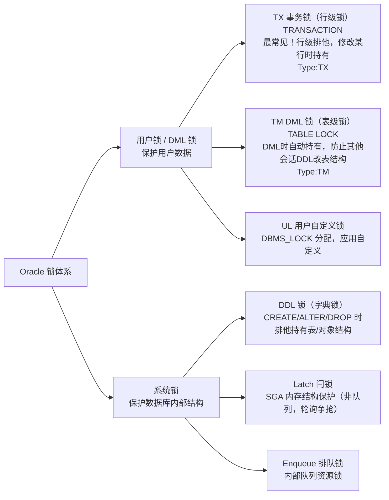
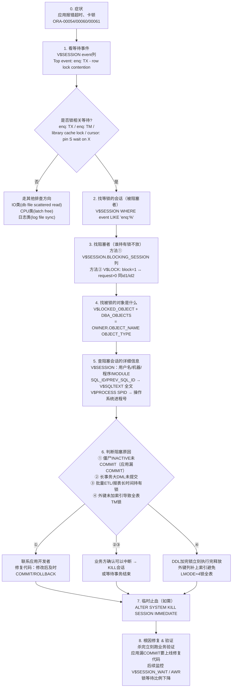

# 10.3 锁等待与会话排查

> [!definition] 锁（Lock）定义
> Oracle **锁机制**是数据库实现并发控制、保证数据一致性与完整性的核心手段。当多个事务同时修改同一行数据、或 DML 与 DDL 冲突时，Oracle 通过锁"序列化"冲突操作——第一个操作获得锁继续执行，后到的操作进入**等待（Wait）**队列，直到锁被释放（COMMIT/ROLLBACK/会话断开）。锁等待过久会导致应用"卡住"、SQL 执行超时，是 DBA 日常高频排查问题。
>
> 锁等待场景的排查黄金口诀：**先看等待事件 → 找阻塞会话 → 找被锁对象 → 看阻塞者 SQL → 业务侧沟通或 KILL。**

---

## 一、Oracle 锁类型总览



### 1.1 两大最常见锁：TX 与 TM

| 锁 | Type 值 | 保护什么 | 获取时机 | 粒度 |
| ---- | ---- | ---- | ---- | ---- |
| **TX = Transaction Lock 事务行锁** | TX | 事务中被修改的**具体数据行**（行级排他） | 第一个 DML（INSERT/UPDATE/DELETE/MERGE）执行时，事务获取一个 TX 锁；同时对**每行被修改行**在该行上加行级锁标记（ITL 槽） | 行级（但每个事务只有一个 TX 锁条目，真正的行锁在行块 ITL 里） |
| **TM = DML Enqueue 表锁** | TM | 整个**表的结构**，防止 DML 执行中其他会话对表做 DDL（DROP/TRUNCATE/ALTER） | 执行 DML 时自动对被 DML 的表加 TM 锁；对父表执行 DML 时也会对子/父表（外键）加 TM | 表级 |

> [!note] SELECT ... FOR UPDATE（显式加行锁）
> 普通 SELECT 不加任何锁（一致性读通过 UNDO 回滚段构造 CR 块实现），不会阻塞任何 DML。如果 SELECT 时就想对选中的行加排他锁，防止其他会话修改：
> ```sql
> SELECT * FROM emp WHERE deptno = 20 FOR UPDATE;       -- 加锁，其他会话UPDATE这些行会等待
> SELECT * FROM emp WHERE empno = 7369 FOR UPDATE NOWAIT;-- 锁不到立刻报错 ORA-00054 资源忙
> SELECT * FROM emp WHERE empno = 7369 FOR UPDATE WAIT 5;-- 等5秒，锁不到报错
> ```
> FOR UPDATE 的 SELECT 执行后必须 COMMIT/ROLLBACK 才会释放锁，否则会一直持有阻塞别人！应用开发中常见"查出来放到 Java 页面让用户编辑，编辑完再 COMMIT"→ 如果用户没点保存锁就一直持有，等于慢性自杀。**FOR UPDATE 只适合在数据库存储过程中短暂加锁+立刻提交，不要跨越用户思考时间。**

---

## 二、锁模式（0-6 共 7 种）与 TM 锁相容矩阵

Oracle 定义了 7 种锁模式（MODE 值 0-6），`lmode` 列表示**已持有**锁的模式，`request` 列表示**正在请求**的模式。两者如果**相容（兼容）**就可以同时持有，**不相容（冲突）**后者就进入等待。

| 模式值 | 缩写 | 名称 | 说明 |
| ---- | ---- | ---- | ---- |
| 0 | NONE | 无锁（NULL） | 未持有锁；request=0 表示已持有 |
| 1 | SS / RS | **Row Share 行级共享**（Sub Share） | SELECT ... FOR UPDATE、LOCK TABLE ... IN ROW SHARE MODE；允许其他并发读 |
| 2 | SX / RX | **Row Exclusive 行级排他**（Sub Exclusive） | DML 自动获取（INSERT/UPDATE/DELETE），表示该事务在表中修改了某些行；允许其他并发 DML/读，禁止 LOCK TABLE 排他/共享表锁 |
| 3 | S | **Share 共享表锁** | LOCK TABLE ... IN SHARE MODE；允许其他人读，禁止 DML |
| 4 | SSX / SRX | **Share + Row Exclusive 行共享排他** | LOCK TABLE ... IN SHARE ROW EXCLUSIVE MODE；比 S 更严格，不允许其他人再加 S/SSX 锁 |
| 5 | X | **Exclusive 排他表锁**（最高级） | LOCK TABLE ... IN EXCLUSIVE MODE / DROP TABLE / ALTER TABLE 等 DDL；其他会话任何操作都等 |

> [!example] TM 表锁相容矩阵（✓ 相容可同时持有，✗ 冲突需等待）
> | 已持有 \ 请求 | SS(1) | SX(2) | S(3) | SSX(4) | X(5) |
> | ---- | ---- | ---- | ---- | ---- | ---- |
> | SS Row Share | ✓ | ✓ | ✓ | ✓ | ✗ |
> | SX Row Exclusive（**INSERT/UPDATE/DELETE默认**） | ✓ | ✓ | ✗ | ✗ | ✗ |
> | S Share | ✓ | ✗ | ✓ | ✗ | ✗ |
> | SSX Share+RowX | ✓ | ✗ | ✗ | ✗ | ✗ |
> | X Exclusive（**DROP/ALTER TABLE**） | ✗ | ✗ | ✗ | ✗ | ✗ |
>
> 结论：SX（普通 DML 自动持有）互相之间是相容的 ✓ → 两个事务 DML **不同行**不会冲突；但如果两个事务 DML **同一行** → 在 TX 行锁层面冲突（同一行的 ITL 槽），等待 `enq: TX - row lock contention`。如果 DML vs DDL → SX vs X，互斥 ✗，等待 `enq: TM - contention`。

---

## 三、锁等待排查的完整流程（8 步标准作业）



---

## 四、锁排查的黄金 SQL（Oracle 11g / 12c / 19c 通用）

### 4.1 SQL ①：找到锁等待中的会话（被阻塞者）

```sql
COL username FOR a12
COL program  FOR a20 TRUNCATE
COL machine  FOR a18 TRUNCATE
COL event    FOR a35 TRUNCATE
COL wait_class FOR a15
SELECT
    s.sid, s.serial#, s.username, s.status,
    s.machine, s.program, s.module, s.action,
    s.event, s.wait_class, s.seconds_in_wait wait_sec,
    s.state, s.blocking_session_status,
    s.blocking_instance || ',' || s.blocking_session AS blocking_sid,
    s.sql_id, s.prev_sql_id
  FROM V$SESSION s
 WHERE s.type = 'USER'      -- 过滤后台进程，只看用户会话
   AND s.username IS NOT NULL
   AND (s.event LIKE 'enq: %'                 -- TM/TX 锁
        OR s.event LIKE 'library cache %'
        OR s.event LIKE 'cursor: pin %')
 ORDER BY s.seconds_in_wait DESC;
```

> [!tip] V$SESSION 11g+ 的 BLOCKING_SESSION 列（懒人神器）
> Oracle 11g 起 V$SESSION 新增 `BLOCKING_SESSION_STATUS`（VALID/NO HOLDER/GLOBAL/NOT IN WAIT）、`BLOCKING_INSTANCE`、`BLOCKING_SESSION` 三列，直接告诉我们"**哪个 SID 在阻塞当前会话**"——不用再手动关联 V$LOCK 了，95% 场景用这个够用！STATUS = VALID 时 BLOCKING_SESSION 就是阻塞者 SID。

---

### 4.2 SQL ②：关联阻塞者 ↔ 被阻塞者 完整链路 + 锁模式 + SQL 文本

```sql
COL blocker_status  FOR a120
COL resource        FOR a20
COL blocker_mode    FOR a18
COL waiter_mode     FOR a18
COL blocker_event   FOR a40 TRUNCATE
COL waiter_event    FOR a40 TRUNCATE
COL blocker_sql     FOR a60 TRUNCATE
COL waiter_sql      FOR a60 TRUNCATE
SELECT
    '(BLOCKER) sid=' || b.sid || ', serial#=' || b.serial# ||
    ' [' || b.username || '@' || b.machine || ' ' || b.program ||
    ' STATUS=' || b.status || ' LOGON=' ||
    TO_CHAR(b.logon_time,'YYYY-MM-DD HH24:MI:SS') || ']' ||
    CHR(10) || '  ↓↓ 阻塞了 ↓↓' || CHR(10) ||
    '(WAITER)  sid=' || w.sid || ', serial#=' || w.serial# ||
    ' [' || w.username || '@' || w.machine || ' ' || w.program ||
    ' 已等待=' || w.seconds_in_wait || '秒]'
        AS blocker_status,
    l.type || '(' || l.id1 || ',' || l.id2 || ')' AS resource,
    DECODE(l.lmode,0,'None',1,'Null',2,'RowShare RS',3,'RowExcl RX',
           4,'Share S',5,'SRowExcl SRX',6,'Exclusive X','?'||l.lmode)   AS blocker_mode,
    DECODE(wl.request,0,'None',1,'Null',2,'RowShare RS',3,'RowExcl RX',
           4,'Share S',5,'SRowExcl SRX',6,'Exclusive X','?'||wl.request) AS waiter_mode,
    b.sql_id                                AS blocker_sqlid,
    (SELECT SUBSTR(sql_text,1,80) FROM V$SQL s
      WHERE s.sql_id = b.sql_id AND ROWNUM=1) AS blocker_sql,
    w.sql_id                                AS waiter_sqlid,
    (SELECT SUBSTR(sql_text,1,80) FROM V$SQL s
      WHERE s.sql_id = w.sql_id AND ROWNUM=1) AS waiter_sql,
    w.event                                 AS waiter_event,
    w.seconds_in_wait                       AS wait_sec
  FROM V$LOCK l,
       V$LOCK wl,
       V$SESSION b,
       V$SESSION w
 WHERE l.block = 1                      -- 阻塞者：持有锁（lmode≥2）且block=1
   AND wl.request > 0                   -- 被阻塞者：在request模式下等待锁
   AND l.id1 = wl.id1 AND l.id2 = wl.id2 AND l.type = wl.type
   AND l.sid = b.sid AND wl.sid = w.sid
 ORDER BY wait_sec DESC;
```

---

### 4.3 SQL ③：直接查到被锁的对象（哪个表/索引被锁）

```sql
COL owner        FOR a10
COL object_name  FOR a30
COL object_type  FOR a12
COL username     FOR a12
COL program      FOR a20 TRUNCATE
COL machine      FOR a18 TRUNCATE
COL hold_mode    FOR a18
SELECT
    o.owner, o.object_name, o.object_type,
    lo.session_id sid, s.serial#, s.username, s.status,
    s.machine, s.program, s.sql_id, s.event, s.seconds_in_wait,
    DECODE(lo.locked_mode, 0,'None',1,'Null',2,'RowShare RS',
           3,'RowExcl RX',4,'Share S',5,'SRowExcl SRX',6,'Exclusive X',
           '?'||lo.locked_mode) AS hold_mode,
    (SELECT SUBSTR(sql_text,1,80) FROM V$SQL st
      WHERE st.sql_id = s.sql_id AND ROWNUM = 1) AS curr_sql_text
  FROM V$LOCKED_OBJECT lo, DBA_OBJECTS o, V$SESSION s
 WHERE lo.object_id  = o.object_id
   AND lo.session_id = s.sid
 ORDER BY lo.session_id;
```

> [!example] 典型输出解读
> 如果查询到 OBJECT_NAME=EMP、TYPE=TABLE、HOLD_MODE=RowExcl RX、SESSION_ID=234、STATUS=INACTIVE、PROGRAM=JDBC Thin Client → 说明 SID=234 的 JDBC 会话之前对 EMP 做了 DML（UPDATE/DELETE），拿到了 SX 的 TM 表锁 + 对应行 TX 锁，但**事务没有 COMMIT**（STATUS=INACTIVE 表示当前没在执行 SQL，锁却还持有）——**典型应用代码漏 COMMIT**。

---

## 五、ALTER SYSTEM KILL SESSION：杀阻塞会话（谨慎用，生产高风险）

> [!danger] ALTER SYSTEM KILL SESSION 高风险！
> 执行杀会话命令会：
> 1. 立即回滚被杀会话**所有未提交事务**（如果事务很大 UPDATE 了 500 万行，回滚可能需要几十分钟，期间锁仍然保持不释放）；
> 2. 应用侧收到异常：ORA-00028: your session has been killed；
> 3. 某些情况下会话会变成 "KILLED" 标记状态（PMON 还没来得及真正清理进程），需要等 PMON 后台进程回收或在 OS 层 kill Oracle 前台进程。
>
> **生产杀会话前 3 必做：**
> - ✅ 打印阻塞者会话的完整信息（SID/SERIAL/USERNAME/PROGRAM/MACHINE/SQL_ID/执行时间），截图存档；
> - ✅ 口头/IM 通知对应的开发/业务负责人"即将杀 xxx 业务会话，会中断他们当前操作"；
> - ✅ 如果是 INACTIVE 僵尸会话优先找应用重启 JDBC 连接池（治本），如果是 ACTIVE 大事务，评估回滚时间（看 V$TRANSACTION.USED_UBLK × DB_BLOCK_SIZE / 回滚速度），不要一上来就杀。

### 标准杀会话步骤

```sql
-- ① 先通过 SID 查出 SERIAL#（必须配对，不能只给 SID）
SELECT s.sid, s.serial#, s.username, s.status, s.program, s.machine,
       s.logon_time, s.sql_id
  FROM V$SESSION s
 WHERE s.sid = 234;
-- 假设查到：SID=234, SERIAL#=56789

-- ② 杀会话（推荐加 IMMEDIATE，不等待用户当前语句执行完）
ALTER SYSTEM KILL SESSION '234,56789' IMMEDIATE;
-- 语法：ALTER SYSTEM KILL SESSION 'sid,serial#' [IMMEDIATE | POST_TRANSACTION | DISCONNECT SESSION 'sid,serial#' IMMEDIATE];
--  POST_TRANSACTION: 等当前事务结束再杀（温和）
--  DISCONNECT SESSION ... IMMEDIATE: 直接断开连接并回滚（12c+，比KILL更彻底）

-- ③ 确认是否已被杀
SELECT status FROM V$SESSION WHERE sid = 234;
-- 应该查不到（或 STATUS='KILLED' 标记，PMON随后清理）
```

### OS 层杀 Oracle 进程（会话杀不掉时最后手段）

```sql
-- 查出对应 OS 的 SPID（Linux/UNIX 中是进程 PID，Windows 中是线程号）
SELECT p.spid os_pid, s.sid, s.serial#, s.username, s.program
  FROM V$SESSION s, V$PROCESS p
 WHERE s.paddr = p.addr AND s.sid = 234;
-- Linux 中执行（root / oracle 用户，kill -9 <SPID> 立即终止进程，触发 PMON 回滚事务）
--   $ kill -9 12345
-- Windows 中用 orakill <ORACLE_SID> <SPID>（Oracle 自带工具）
--   C:\> orakill ORCL 12345
```

---

## 六、死锁（Deadlock）ORA-00060

> [!definition] 死锁
> 两个（或多个）事务相互等待对方持有的锁，且都不释放自己的锁，构成**循环等待**，Oracle 自动检测到后会选择其中一个**代价最小（回滚成本最低、产生 undo 最少）**的事务回滚，抛出 `ORA-00060: Deadlock detected. More info in file ...trc`，另一个事务可以正常继续执行。Oracle 的死锁检测是**自动的**（不需要 DBA 干预，后台 LCK0/PMON 进程监测），默认死锁检测时间 ~3 秒。

### 典型死锁场景（90% 都是这几类）

| 死锁类型 | 复现过程（两个会话按 1-2-3-4 顺序） | 解决方案 |
| ---- | ---- | ---- |
| **同表不同行交叉更新（最常见 80%）** | 会话① UPDATE emp SET sal=1000 WHERE empno=7369 → 会话② UPDATE emp SET sal=2000 WHERE empno=7499 → 会话① 再 UPDATE emp SET sal=2000 WHERE empno=7499 → 会话② 再 UPDATE emp SET sal=1000 WHERE empno=7369 → ORA-00060 | 所有事务固定更新顺序（例如永远按 empno 升序更新）；减少事务中语句数量尽快 COMMIT |
| **外键未加索引（TM 表锁从 RX 升级到 S）** | 会话① UPDATE dept SET loc='X' WHERE deptno=20（需要对 EMP 表加 S=4 锁扫描子行）→ 会话② INSERT emp(...) VALUES(9999,'A','CLERK',...,20)（EMP 上 SX=3 锁）→ 互相等 TM 锁 | **所有外键列必须建索引**！（不仅为了死锁，也是 DML 从父表删除时防止全表扫子表锁所有行） |
| **位图索引段头 ITL 争用（DSS/OLAP 中批量 INSERT）** | 不同会话 INSERT 到同一位图索引的同一数据块 → ITL 槽不够 / 位图索引分段更新范围冲突 | OLTP 不要用位图索引（用 B 树）；批量 INSERT 减少并发度 |
| **自治事务 + 主事务互锁（较少）** | 主事务 INSERT t1 → 调用自治事务过程，自治事务又尝试 UPDATE t1 同一行 → 自治事务等主事务的行锁，主事务等自治事务结束 | 自治事务不要访问主事务正在修改的表（或相同行） |

### 排查死锁的关键证据：用户转储 trace 文件

Oracle 每次检测到 ORA-00060 都会在 `user_dump_dest`（11g+ ADR 目录 `$ORACLE_BASE/diag/rdbms/<dbname>/<sid>/trace/`）下生成一个 `<sid>_ora_<spid>.trc` 文件，里面包含完整的死锁信息：

```
*** SESSION ID:(234.56789) yyyy-mm-dd hh:mi:ss
DEADLOCK DETECTED
[Transaction Deadlock]
The following deadlock is not an ORACLE error. It is a deadlock due to user error in the design of an application
or from issuing incorrect ad-hoc SQL.
Deadlock graph:
                   ---------Blocker(s)--------  ---------Waiter(s)---------
Resource Name          process session holds waits  process session holds waits
TX-00020011-00002a3b       12     234     X             15     345           X
TX-0005000c-00001e22       15     345     X             12     234           X

session 234: DID 0001-000C-00000... objn 12345 EMP row (0,1)
session 234: DID 0001-000C-00000... objn 12345 EMP row (0,2)
Rows waited on:
  Session 234: obj - rowid = AAAJj3AAEAAAAnKAAA
  Session 345: obj - rowid = AAAJj3AAEAAAAnKAAB
Information for the OTHER waiting sessions:
Session 345:
  file# / block# ... etc
  Current SQL:
  UPDATE emp SET sal=2000 WHERE empno=7499
  ----- PL/SQL Call Stack -----
    object      line  object
    handle    number  name
    0x...       20    SCOTT.PKG_SALARY.PROC_RAISE_SAL
End of information
```

从 trace 可以直接看到：① 互相等待的两个事务 session id；② 死锁的资源是两行 TX 锁（rowid 可以查具体哪两行数据）；③ 触发死锁的 SQL 文本 + 过程调用栈（PKG_SALARY 第 20 行）。有了这些信息 90% 的死锁问题都能精准定位到业务代码哪里乱序更新。

> [!tip] 监控死锁：AWR 报告 "enq: TX - allocate ITL entry" 或 alert_SID.log
> alert.log 中每次死锁都会写一条 ORA-00060 以及 trace 文件路径。批量死锁报警可以在 AWR 中看 `Wait Class Concurrency` 占比、或者在 V$SYSTEM_EVENT 中统计 `enq: TX - row lock contention` 总等待时间增长趋势。

---

## 七、常见 Top 10 等待事件速查卡（锁+IO+CPU+日志全面覆盖）

Oracle 慢的第一入口就是 Top 5 Timed Foreground Events（AWR 报告里看）。下面列出常见等待事件、含义、可能原因、优化方向：

| 等待事件名 | Wait Class | 含义 | 常见根因 | 优化方向 |
| ---- | ---- | ---- | ---- | ---- |
| **enq: TX - row lock contention** | Concurrency | 行锁等待：SQL 在等别人的行锁释放（同一行被两个事务 UPDATE） | 应用漏 COMMIT；长事务；死锁前兆；批量并发更新相同行范围 | 代码及时 COMMIT；避免长事务；更新顺序一致；热点行用 SELECT FOR UPDATE NOWAIT 显式报错不等待 |
| **enq: TX - index contention** | Concurrency | 索引块争用：并发 INSERT 到同一段索引叶块（右增长索引，高并发插入递增主键/时间列） | 单调递增 B 树索引的索引叶热点块冲突 | 反向键索引（REVERSE）、哈希分区索引、增大 PCTFREE |
| **enq: TM - contention** | Application | TM 表锁冲突：DML 跟 DDL 打架（DDL 持 X，DML 在等）或外键未加索引删除父表对子表 TM S 锁与其他 DML SX 冲突 | 跑 DDL 时业务在 DML 同一张表；外键列缺失索引 | DDL 放业务低峰；**外键全部建索引** |
| **db file scattered read** | User I/O | **多块读 = 全表扫描 / 全索引扫**，一次读 db_file_multiblock_read_count 个块 | 大表 TABLE ACCESS FULL，缺索引；SQL 写法问题导致全表扫 | 看 V$SQL/V$ACTIVE_SESSION_HISTORY 的 SQL_ID → 加合适索引 / 重写 SQL 用 WHERE；调整 mbrc 参数 |
| **db file sequential read** | User I/O | **单块读 = 索引 ROWID 跳表块**，一次读 1 块（TABLE ACCESS BY INDEX ROWID 的回表动作） | 索引回表太多行（选择率高时索引回表反而不如全表扫），或者索引本身太多层级 BLEVEL 深 | 选择率 > 15% 左右考虑全表扫 / 覆盖索引避免回表；BLEVEL 过高重建索引 REBUILD ONLINE |
| **log file sync** | Commit | 用户 COMMIT / ROLLBACK 时，等 LGWR 把 redo buffer 写进联机 redo 日志（写盘完成才返回 OK） | redo 日志文件在慢盘（普通 HDD 而非 SSD）；过度频繁 COMMIT（Java 循环 1000 次 executeUpdate + 1000 次 COMMIT，应该批量 500 条一次 COMMIT）；LGWR 写太慢；log_buffer 太大 flush 一次时间长 | redo 放本地 SSD / 高 IOPS 存储；减少 commit 频率，改批量 commit；合理的 redo 大小 & 组数；避免用 RAID5 放 redo（写入惩罚） |
| **log file parallel write** | System I/O | LGWR 后台进程在写 redo 日志组的多个成员（跟前台 COMMIT 相关） | 同 log file sync：redo 所在盘 IO 慢 | 同上；重做日志组成员分散到不同物理盘（为了镜像），但所在盘都要快 |
| **buffer busy waits** | Concurrency | **Buffer Cache 热块争用**：多个会话同时读/改同一个 Buffer Cache 中的数据块 / 段头块 / Undo 头块 | 热点表：某些行/块被大量并发修改（订单流水表同一分钟插入）；ASSM 段头 BITMAP 争用 | 表/索引分区、反向键索引、增大 PCTFREE 分散数据；ASSM 下用更大 EXTENT SIZE；热点对象用 KEEP POOL 缓存 |
| **latch: cache buffers chains (CBC)** | Other / SGA | Buffer Cache 的**内存哈希桶链表闩锁争用**：同一时刻大量会话去查同一个 buffer chain 哈希桶，反复抢 CBC latch 失败 spin（消耗 CPU） | 大量并发查询/修改同一块热数据；过小的 db_block_buffers / 子 latch 数量不足；SQL 软解析不够每次都要遍历 bucket | 热块处理同 buffer busy waits；适当增加 _db_block_hash_latches；应用加缓存层；加合适索引避免全表扫热点区 |
| **direct path read / temp** | User I/O | 直接读数据文件绕过 Buffer Cache（并行查询扫描大表） / 写临时段到 TEMP（排序 / 哈希连接 / 全局临时表） | PGA_AGGREGATE_TARGET 设置太小：排序 SORT_AREA_SIZE / HASH_AREA_SIZE 不够 → 溢出到 TEMP 表空间磁盘写临时段 | 加大 PGA_AGGREGATE_TARGET（V$PGA_TARGET_ADVICE 看建议值）；TEMP 放 SSD / 裸设备；SQL 避免不必要的大排序（建索引替代 ORDER BY） |
| **latch: shared pool / library cache lock / pin** | Concurrency | 共享池 Library Cache 闩锁/锁等待：SQL 解析、PL/SQL 包载入期间的串行化闩 | 没绑定变量！同语义 SQL 字面量不同，硬解析成千上万次抢 Shared Pool Latch；PL/SQL 包非常大编译载入时 | **强制绑定变量**：`ALTER SYSTEM SET cursor_sharing=FORCE;`（临时救急，终极方案改代码用 PreparedStatement 占位符）；开 SESSION_CACHED_CURSORS；大表 DDL 低峰期（导致 SQL 失效硬解析） |

> [!example] 排查会话卡在等某个事件时，V$SESSION_WAIT 的 P1/P2/P3 参数是什么？
> 不同事件 P1/P2/P3 含义不一样，查官方 V$EVENT_NAME 视图：
> ```sql
> SELECT name, parameter1, parameter2, parameter3 FROM V$EVENT_NAME
>  WHERE name = 'db file sequential read';
> -- 输出：file#（数据文件号）/ block#（块号）/ blocks（读几块，seq read=1，scattered read=mbrc）
> ```
> 知道 P1=file#、P2=block# → 可以用 `DBA_DATA_FILES` 反查文件名 → `SELECT DBMS_ROWID.ROWID_CREATE(1, data_object_id, file#, block#, 0) FROM DBA_OBJECTS WHERE ...` 定位到是哪个表/索引的哪个块。

---

## 八、V$SESSION_LONGOPS 长时间操作监控（进度百分比神器）

超过 6 秒的操作（RMAN 备份恢复、统计收集、排序、哈希连接、并行扫描、数据泵 EXPDP/IMPDP、索引创建 REBUILD 等）会出现在 V$SESSION_LONGOPS 里，支持估算剩余时间。

```sql
COL opname FOR a30
COL target_desc FOR a30
COL progress FOR a22
COL time_remain FOR a10
COL sql_text FOR a70 TRUNCATE
SELECT
    s.sid, s.serial#, s.username, s.sql_id,
    l.opname,
    ROUND(l.sofar  * 100 / NULLIF(l.totalwork,0), 1) AS percent_done,
    l.sofar || '/' || l.totalwork || ' ' || l.units AS progress,
    l.start_time,
    l.last_update_time,
    NUMTODSINTERVAL(l.time_remaining, 'SECOND') AS time_remain,
    ROUND(l.elapsed_seconds / 60, 1) || 'min 已用' elapsed_min,
    (SELECT SUBSTR(sql_text, 1, 70) FROM V$SQL sq WHERE sq.sql_id = s.sql_id AND ROWNUM=1) sql_text
  FROM V$SESSION_LONGOPS l, V$SESSION s
 WHERE l.sid   = s.sid
   AND l.serial# = s.serial#
   AND l.sofar  <> l.totalwork    -- 还没完成的
 ORDER BY l.start_time DESC;
```

典型输出：`OPNAME=RMAN: full datafile backup` `PERCENT_DONE=48.5` `PROGRESS=485/1000 Blocks` `TIME_REMAIN=+00 00:12:30` → 还剩 12 分半完成。

---

## 九、生产锁排查典型工作流（经验总结）

> [!example] 生产凌晨 2 点报警"订单支付慢"，10 分钟内从 0 到解决的真实流程：
> 1. 登录 SQL Developer：`SELECT sid,event,seconds_in_wait,blocking_session FROM V$SESSION WHERE username='ORDER_APP' ORDER BY seconds_in_wait DESC;` → 30+ 会话都在 `enq: TX - row lock contention`，等待 600 秒+，BLOCKING_SESSION 全部指向同一个 SID=123。
> 2. `SELECT program, machine, status, sql_id, prev_sql_id, logon_time FROM V$SESSION WHERE sid=123;` → 输出：`PROGRAM=SQL Developer.exe, MACHINE=DESKTOP-XXX, STATUS=INACTIVE, LOGON=前一天18点` → 原来是某开发同学下班后电脑没关，SQL Developer 窗口里昨天下午跑了 `UPDATE orders SET status='PAID' WHERE order_id=12345;` 忘了 commit！回家了。STATUS=INACTIVE 表示 SQL 已经执行完，但事务未提交。
> 3. 电话给开发同学确认可以杀 → 查 serial# → `ALTER SYSTEM KILL SESSION '123,45678' IMMEDIATE;`
> 4. 10 秒后再查 V$SESSION：大量 enq: TX 会话消失 → 回到 V$SESSION event 列都是正常 SQL*Net message from client → 看应用监控订单支付成功率恢复。
> 5. 根因复盘：SQL Developer / 客户端工具执行 DML 必须记得 COMMIT/ROLLBACK；数据库侧可以给个人账号配置 PROFILE `IDLE_TIME < 60` 空闲超时自动断开，避免开发回家事务挂一整夜。
