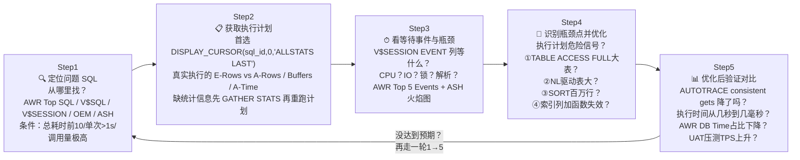

# 10.4 基础优化思路（方法论）

> [!definition] 数据库优化整体观
> Oracle 数据库性能优化不是"改一个参数、加一个索引"的魔术，而是一个**体系化、分层、自顶向下**的工程方法论。根据 Oracle 官方统计和大量生产实践，**80%~90% 的性能问题来自应用层（SQL 写得差、索引缺失、架构不合理）**，只有 10% 左右来自数据库配置或硬件。因此优化的黄金顺序永远是：**先上层（应用 SQL / 索引）→ 后下层（内存 / IO / OS / 硬件）**，上层优化 ROI（投入产出比）最高，成本最低，效果往往成百上千倍。
>
> 本章将建立一个五层面优化框架，并给出 SQL 优化标准五步法、AWR/ADDM 报告解读、完整慢查询优化案例。

---

## 一、五层面优化框架（自顶向下，ROI 递减）

```mermaid
flowchart TD
    subgraph Oracle 五层面优化框架（从顶到底）
        direction TB

        L1["① 应用 SQL 层<br/>⭐⭐⭐⭐⭐ ROI 最高<br/>SQL写法/绑定变量/分页/UNION ALL/函数列"]
        L2["② 索引层<br/>⭐⭐⭐⭐ ROI 高<br/>B树/复合/函数索引；重建碎片索引；删除无用索引"]
        L3["③ 表空间与 I/O 布局层<br/>⭐⭐⭐ ROI 中<br/>数据/索引/TEMP/UNDO/FRA 分盘；ASM；分区表剪枝"]
        L4["④ 内存与参数层<br/>⭐⭐ ROI 中低<br/>SGA/PGA/AMM；Buffer命中率；Shared Pool；游标参数"]
        L5["⑤ OS/网络/硬件层<br/>⭐ ROI 最低<br/>CPU核数/SSD/HBA卡/网络RTT/OS内核参数"]
    end

    L1 --> L2 --> L3 --> L4 --> L5

    NOTE["优化顺序：永远从上往下做<br/>做完 L1-L2 绝大多数问题就解决了<br/>不要一上来就加内存换SSD！<br/>（那是逃避分析，不是优化）"]
    NOTE ~~~ L1
```

| 层面 | 优化手段（举例 5 条） | 投入 | 效果 | 典型场景 |
| ---- | ---- | ---- | ---- | ---- |
| ① **应用 SQL 层** | 去掉 SELECT \* 选需要列；大表必须带 WHERE；UNION ALL 替 UNION；索引列不加函数避免失效；避免隐式类型转换；用绑定变量减少硬解析；深分页用 Seek 方法 | 低（改 SQL 代码） | 极高（10 倍 ~ 1000 倍） | Web 应用查询慢、报表超 30s、慢 SQL 占 DB Time 高 |
| ② **索引层** | WHERE/JOIN 列建 B 树复合索引；表达式建函数索引 FBI；定期 `ALTER INDEX REBUILD ONLINE` 重建碎片；查 V$SQL_PLAN 从未用的索引 DROP；OLAP 低基数字段用位图索引 | 中（DDL 创建/重建） | 高（5 倍 ~ 100 倍） | 全表扫描、执行计划 TABLE ACCESS FULL |
| ③ **表空间/IO 层** | 数据/索引/TEMP/UNDO/FRA 独立表空间 + 散列不同磁盘；大表按时间 RANGE 分区；TEMP 放最快 SSD；LMT+ASSM；并行查询 DOP；ASM 条带化 | 高（迁数据文件/改表空间） | 中（1.5 倍 ~ 5 倍） | db file scattered read / direct path write temp 等待高 |
| ④ **内存参数层** | AMM 开 MEMORY_TARGET；V$DB_CACHE_ADVICE 加大 DB_CACHE_SIZE 命中率到 95%+；SESSION_CACHED_CURSORS=50+；PGA_AGGREGATE_TARGET 够大避免临时段写磁盘；OPEN_CURSORS=1000 | 低-中（ALTER SYSTEM 参数） | 中（1.2 倍 ~ 3 倍） | Buffer Cache 命中率 < 90%、大量 sorts(disk)、ORA-04031 |
| ⑤ **OS/硬件/网络** | 核心交易用本地 NVMe SSD 延迟 0.05ms；CPU 根据 license 配够；应用与 DB 同机房 RTT<1ms；关闭 THP；HBA 卡多路径；OS preinstall 脚本内核参数 | 极高（买硬件、装机） | 中（1.5 倍 ~ 3 倍） | 存储队列深度长、CPU 100% runq 大、跨机房 DB 调用 |

> [!warning] 最常见的 DBA 错误做法（反模式）
> 用户说"慢"，DBA 立刻 `ALTER SYSTEM SET SGA_TARGET=...` 加内存、要求买 SSD、迁到更快的存储——**结果钱花了几十万，SQL 还是慢**！因为那条 SQL 全表扫描 1 亿行，加内存只是缓存全表 1 亿行，不解决根本问题。**先让我看执行计划！**

---

## 二、SQL 优化标准五步法（遇到慢 SQL 就套这个流程）



**每一步的具体工具和检查清单：**

### Step 1 定位问题 SQL 常用入口

| 场景 | 工具 | 语法 |
| ---- | ---- | ---- |
| **历史（过去 1 天/1 周慢 SQL）** | AWR + DBA_HIST_SQLSTAT | @?/rdbms/admin/awrrpt.sql 生成报告 → "SQL ordered by Elapsed Time"章节，直接复制前 10 SQL_ID |
| **当前（现在正在卡的 SQL）** | V$SESSION + V$SQL | `SELECT sql_id, event, seconds_in_wait FROM V$SESSION WHERE status='ACTIVE' AND username NOT IN ('SYS') ORDER BY seconds_in_wait DESC;` |
| **过去 N 分钟活跃会话采样** | ASH（Active Session History，Diagnostic Pack）V$ACTIVE_SESSION_HISTORY | `SELECT sql_id, COUNT(*), TOP(event) FROM V$ACTIVE_SESSION_HISTORY WHERE sample_time > SYSDATE - 5/1440 GROUP BY sql_id;` 过去 5 分钟哪条 SQL 占用采样最多 |
| **Library Cache 共享池累积** | V$SQLAREA / V$SQLSTATS | 按 `ELAPSED_TIME / CPU_TIME / DISK_READS / PARSE_CALLS` 排序取 top 10 |
| **逐行 PL/SQL 哪行慢** | DBMS_HPROF（分层剖析器） | 开始剖析 → 跑过程 → 停止 → 生成 HTML 调用树，每个过程/每行累计耗时比例一目了然 |

### Step 2 & 3 & 4 合并：拿到执行计划后检查清单（10 个最常见坑，命中就优化）

1. **TABLE ACCESS FULL 大表（行数>1万），谓词只有 filter（没有 access）→ 缺索引** → 在 WHERE 条件列（JOIN 列优先）建 B 树复合索引；注意不要对低基数字段（性别、状态只有几个值）建普通 B 树索引（选择性差反而不如全表扫），OLTP 用位图要慎重（并发 DML 代价高）。
2. **WHERE 子句对索引列写了函数/表达式 → 索引失效（INDEX FULL SCAN/FTS）**：`WHERE TO_CHAR(create_time,'YYYY-MM-DD')='2024-01-01'` → 改写成范围条件：`create_time >= DATE'2024-01-01' AND create_time < DATE'2024-01-02'`；或者必须用函数就建**函数索引（FBI）**：`CREATE INDEX idx ON tab(TO_CHAR(create_time,'YYYY-MM-DD'))`；常见的还有 `WHERE UPPER(name)='ABC'` → 要么写应用层存大写，要么函数索引。
3. **隐式类型转换导致索引失效**：`WHERE phone_num = 13800000000` 但 phone_num 是 VARCHAR2 列 → Oracle 内部转换为 `WHERE TO_NUMBER(phone_num)=13800000000` → 索引完全失效，走全表扫。规范：VARCHAR2 列 = '字符串' 加引号；NUMBER 列 = 数字。
4. **NESTED LOOPS 外表（驱动表）结果集大**：NL 算法复杂度 O(外 × log 内)，外表 10 万行，内表索引扫 10 万次随机读 → 慢死。要么保证外表 WHERE 条件过滤后只剩 10~1000 行，要么强制 Hint 改成 HASH JOIN（`/*+ USE_HASH(t1 t2) LEADING(t1) */`）。
5. **SORT 排序开销大（Sorts(disk) > 0）**：看执行计划 Id 步骤有 SORT(ORDER BY / GROUP BY / JOIN) → 对应 ORDER BY / GROUP BY 列建复合索引，索引本身有序天然避免排序。
6. **SELECT \* 返回大量不必要的列**：不仅浪费 IO/网络，还会导致覆盖索引失效（SELECT 里有 50 列不可能全建进索引），LOB 列还会触发额外的表块访问。规范：写 `SELECT empno, ename, sal` 不写 `SELECT *`。
7. **UNION（会去重排序） → 业务上不重复就改 UNION ALL**。两表各 10 万行 UNION = 20 万行排序去重 = 极慢；改 UNION ALL 直接拼 = O(1) 输出。
8. **没绑定变量：parse_calls ≈ executions，Library Cache Latch 争用** → 代码改 PreparedStatement 占位符；紧急救援：`ALTER SYSTEM SET CURSOR_SHARING=FORCE;`（副作用：不同值计划可能互相影响，仅临时止血用）。
9. **视图嵌套视图、过多层 WITH 子查询导致无法合并谓词**：执行计划第一步 VIEW 输出几万行，外层 FILTER 最后只剩几行 → 要么写 Hint `/*+ PUSH_PRED(v) */` 把外层谓词推入内层视图，要么干脆展开视图直接写 JOIN（给优化器更多自由度）。
10. **Pagination 深分页：`WHERE ROWNUM BETWEEN 99001 AND 100000` → 前 99000 行都要取出来再丢弃** → Seek Method 基于上次最后主键/排序键：`WHERE (sort_col, pk) < (:last_sort, :last_pk) ORDER BY sort_col DESC, pk DESC FETCH FIRST N ROWS ONLY`，深分页性能从 O(n) → O(1)。

### Step 5 验证优化效果：4 个核心指标必须对比

- ✅ **逻辑读 consistent gets / buffer gets**（AUTOTRACE / V$SESSTAT 对比）：优化前后比值 100:1 才叫优化到位，5:1 就是优化没到位还能继续搞。
- ✅ **执行计划变更**：TABLE ACCESS FULL → INDEX RANGE SCAN；NL → HASH JOIN；SORT → 消失；Cost 降低、E-Rows 准确。
- ✅ **单次 elapsed time**：生产慢 SQL 从 30s 降到 0.1s 是合格线（300x）。
- ✅ **系统级 AWR DB Time 占比**：某条 SQL 优化后 DB Time 从 30% → <1%，同时其他 SQL 不应该出现明显恶化（防止加了索引拖慢 INSERT）。

> [!warning] 优化后必须做回归测试（INSERT/UPDATE/DELETE 性能）
> 加索引能加速 SELECT，但会**拖慢 DML**（每 INSERT/UPDATE 一条要维护所有索引树）。如果该表是典型高并发写入订单流水表，索引数量 5 个以上可能导致 TPS 掉一半。优化后必须在 UAT 用 JMeter/LoadRunner 跑并发 DML 验证写入性能下降幅度 < 20%，否则得不偿失。索引不是银弹，是有代价的。

---

## 三、各层面具体优化手段（按层，每节 5+ 条）

### 3.1 ① 应用 SQL 层手段（最有价值）

- **列裁剪**：永远不要 SELECT \*，只取应用需要列。
- **行过滤**：大表 SELECT 必须带 WHERE 条件，禁止"导出整张表"业务全量同步用 Data Pump / OGG（Oracle GoldenGate）。
- **用 UNION ALL 替 UNION**：业务确认结果集不重复就写 UNION ALL，跳过去重排序。
- **索引列永远不要套函数/表达式/隐式转换**：WHERE 条件写在列的右侧，不要列上改值。
- **绑定变量 + 批处理**：Java/.NET 用 PreparedStatement 占位符；循环 1000 次 JDBC executeUpdate → 改成 addBatch() 100~500 条一次 executeBatch()，减少 round-trip × 100。
- **分页避免深翻页**：Seek 方法（基于上次排序键），不要依赖 ROWNUM BETWEEN 大偏移。
- **复杂统计不要在 DB 里硬算**：日报/月报聚合 → 物化视图按小时/天增量刷新 + 查物化视图，不要每次页面打开 SUM 5 亿行；或者出到 ClickHouse / Doris 这类 OLAP 专门跑分析。
- **IN 列表 / OR 条件不要几千项**：几百个 IN 值 → Oracle 解析就炸，改临时表 + JOIN；跨库查询用表函数或物化视图。
- **避免 COUNT(\*) 全表扫取总数**：分页控件"总数 123456 条"一般不准没关系，用 estimate `SELECT num_rows FROM DBA_TABLES`（统计信息估算），或者只显示"10000+"，真要点到 1000 页的用户不存在。
- **把 PL/SQL 中逐行 UPDATE 的 LOOP → 改成单条集合化 UPDATE / MERGE**：减少 PL/SQL↔SQL 引擎上下文切换，10 万行 LOOP UPDATE 10s 变集合化 UPDATE 200ms。

### 3.2 ② 索引层手段

- **B 树索引（OLTP 主选）**：WHERE 条件列选择性高（唯一/接近唯一）→ 单列 B 树；多个条件 AND → 复合索引，列顺序按**选择性从高到低排，等值条件列放前面，范围条件放后面**（等值列可以作为 Index Skip Scan 前缀）。
- **函数索引 FBI（基于函数的索引）**：必须对列套函数才查询的场景，`CREATE INDEX idx ON tab(function(col)) TABLESPACE indx COMPUTE STATISTICS;`
- **位图索引（OLAP 选）**：低基数 OLAP 只读/读多写少（性别、状态只有 2~10 个值，且不常 UPDATE），多个位图索引 AND/OR 效率极高。
- **定期收集统计信息**：SQL 选错计划 70% 是统计信息过期，`EXEC DBMS_STATS.GATHER_TABLE_STATS(OWNNAME=>USER, TABNAME=>'EMP', ESTIMATE_PERCENT=>DBMS_STATS.AUTO_SAMPLE_SIZE, CASCADE=>TRUE, METHOD_OPT=>'FOR ALL COLUMNS SIZE AUTO');` 级联收集索引。GATHER_SCHEMA_STATS 周级或大数据量变更后跑。
- **重建碎片索引**：DBA_INDEXES BLEVEL>3、LEAF_BLOCKS 持续增长、DELETE 多的表 → `ALTER INDEX idx_name REBUILD ONLINE TABLESPACE indx NOLOGGING COMPUTE STATISTICS;` 11g+ ONLINE 加 ONLINE DML 不阻塞表写入。批量删除后定期 REBUILD。
- **删除无用索引**：V$OBJECT_USAGE（ALTER INDEX ... MONITORING USAGE 后跑 1 周业务）没被使用过的索引 DROP；或从 DBA_HIST_SQL_PLAN 查某索引从未出现 → 清掉，节省写入代价。

### 3.3 ③ 表空间与 I/O 布局

- **物理布局分散 IO**：永久数据表空间、索引表空间、TEMP 临时表空间、UNDO 撤销表空间、FRA 闪回恢复区**各放不同磁盘组/ASM Diskgroup/LUN**，避免热点盘等待。TEMP 一定要放在最快的盘（排序溢出用）。
- **大表分区**：千万级以上历史流水表按时间 RANGE 分区 + 本地索引，查询 WHERE 时间范围 → Oracle 自动分区剪枝 Partition Pruning，只扫相关分区，性能跟小表无异。年度归档 DROP 分区秒级完成。
- **表空间 LMT + ASSM**：11g 默认就是本地管理 + 自动段空间管理。不要 DMT 字典管理（表空间位图管理比字典管理快）。
- **小表 Keep Pool**：频繁读的小配置字典表 CACHE STORAGE，ALTER TABLE tab STORAGE (BUFFER_POOL KEEP); 扔 KEEP 池永不过期。
- **并行查询 DOP**：报表/批处理 ALTER SESSION ENABLE PARALLEL DML / PARALLEL QUERY + `/*+ PARALLEL(t,8) */` 开并行，利用多 CPU 处理大数据。OLTP 禁止并行（会把 CPU 吃光）。

### 3.4 ④ 内存参数层

- **开 AMM 自动内存管理（Oracle 11g~19c 推荐）**：`ALTER SYSTEM SET MEMORY_TARGET=8G SCOPE=SPFILE; MEMORY_MAX_TARGET=12G SCOPE=SPFILE;` 重启实例 → Oracle 自动在 SGA/PGA 之间按需调整，DBA 不用管内部细节。
- **不开 AMM 就用 ASMM：SGA_TARGET + PGA_AGGREGATE_TARGET**（10g 风格），SGA 占物理内存 60% 左右（单机），PGA = (物理内存 × 0.2) ~ (并发数 × 每个 SQL 排序/哈希 10MB)。
- **Buffer Cache 命中率 < 95%**：看 V$SYSSTAT `consistent gets + db block gets` vs `physical reads` 比值，或者 V$DB_CACHE_ADVICE 看 2 倍大小下物理读下降多少，有显著下降就加 DB_CACHE_SIZE。
- **Library Cache Hit Ratio < 99% 或 latch: shared pool 等待多**：先排查是不是没绑定变量（`SELECT sql_id, parse_calls, executions FROM V$SQLAREA WHERE parse_calls > 1000 ORDER BY parse_calls DESC;` 前几条 parse_calls ≈ executions = 没绑变量），绑定变量是根因 → 改代码；加 SHARED_POOL_SIZE 只是缓解，救不了全是字面量 SQL。
- **游标相关参数**：OPEN_CURSORS=1000（防 ORA-01000 too many open cursors，Java ResultSet 没关也会漏）；SESSION_CACHED_CURSORS=50~200（会话内重复执行的 SQL 直接复用 cursor，减少软解析）；CURSOR_SHARING=EXACT（正常默认，紧急才 FORCE）。
- **避免 sorts(disk) > 0**：AUTOTRACE 里 disk 排序 = PGA 不够用写到 TEMP，加 PGA_AGGREGATE_TARGET 或者改 SQL 让排序行数少（建索引避免排序）。

### 3.5 ⑤ OS / 网络 / 硬件层

- **存储延迟（最重要）**：核心 DB 数据文件 & redo 放**本地 NVMe SSD**（延迟 0.05~0.1ms / IOPS 几十万），比 15K HDD 快 100 倍；归档备份放 SATA HDD；不要把 redo 放 RAID5（写入校验惩罚），redo 组用 RAID10 或 RAID1。
- **CPU**：根据 Oracle 许可证配。生产 CPU 平均 40%~60%，高峰期 70%~80%，超过 90% 持续 runqueue > cpu_count → 要么优化 SQL 降消耗，要么加核。
- **网络**：应用服务器与 DB **同机房同一交换机** RTT < 0.5ms，禁止跨机房应用直连生产 DB（每次 SQL RTT 20ms，1000 个 SQL 就 20s 凭空消失，加多少内存都没用），异地用只读库、缓存层、OGG 同步。
- **OS 内核**：用 Oracle 官方 preinstall RPM 一键改（`oracle-database-preinstall-19c.el7.x86_64`），自动调 shmmax、sem、nofile hugepages；**关闭 Transparent HugePages（THP）**（Oracle 官档明确说 THP 会导致 Oracle 内存分配延迟）。
- **文件系统**：生产用 ASM（自动条带/镜像/在线重平衡）或 XFS，不要用 ext3（fsck 慢、32TB 限制）。

---

## 四、AWR 报告核心 8 大板块必看（MMON 每小时自动快照）

> [!note] 生成 AWR 报告步骤
> ```sql
> -- ① 登录 SYS / SYSTEM
> CONN SYS/password AS SYSDBA;
> -- ② 运行 awrrpt.sql
> @?/rdbms/admin/awrrpt.sql
> -- ③ 选 Type: html（推荐）或 text → 回车
> -- ④ 选显示几天内的快照 → 默认 7 天回车
> -- ⑤ 看 Begin Snap / End Snap ID，输入开始快照号 → 结束快照号
> -- ⑥ 输入 report_name: awr_xxxx.html → 生成在当前 SQL*Plus 运行目录，用浏览器打开
> ```

AWR 是 Oracle 最有价值的性能诊断报告（需要 Oracle Diagnostics Pack 许可），打开 HTML 后按顺序看这些：

1. **Load Profile 负载画像**：每秒事务数 TPS、每秒 SQL 执行数、每秒逻辑读/物理读、每次事务 Redo 大小。判断是不是业务量真的暴涨（TPS × 10）还是 SQL 变差（TPS 不变但逻辑读 × 10）。
2. **Instance Efficiency Percentages 实例命中率**：
   - **Buffer Nowait % / Buffer Hit % > 95%**（低于就查 db cache advice 加 DB_CACHE_SIZE，或者 SQL 太差）
   - **Library Hit % / Soft Parse % > 99%**（低于=硬解析太多，绑变量问题）
   - **Execute to Parse % > 70%**（低=parse/execute比值高，cursor没复用）
   - **% Non-Parse CPU > 90%**（低=CPU都花在解析上而不是执行，还是绑变量）
3. **Top 5 Timed Foreground Events（⭐⭐⭐⭐⭐ 第一诊断入口）**：按总等待时间排前 5 个事件。如果第 1 是 **DB CPU**（CPU 满）→ 看 Top SQL CPU 最高那条加索引减少逻辑读；如果是 `db file scattered read` → 大量全表扫描缺索引；如果是 `enq: TX - row lock contention` → 锁等待查阻塞者；如果是 `log file sync` → redo IO 慢 / commit 太频繁。
4. **Time Model Statistics 时间模型**：`sql execute elapsed time` 占 DB Time 比例最高正常；`parse time elapsed` 很高 → 解析多了绑变量；`PL/SQL execution elapsed time` 高 → 慢过程用 DBMS_HPROF 逐行剖析。
5. **SQL Statistics：8 个排序表（各取 Top 10）**：
   - **SQL ordered by Elapsed Time**：总耗时最多的（第一名一般就是根因）；
   - **SQL ordered by CPU Time**：耗 CPU 最多（逻辑读高 / 排序 / 哈希）；
   - **SQL ordered by Gets**：逻辑读最多（加索引降 gets × 100）；
   - **SQL ordered by Reads**：物理读最多（缺索引 + 冷缓存）；
   - **SQL ordered by Executions**：执行次数最多的，每次哪怕 2ms × 100 万次也能占满 DB；
   - **SQL ordered by Parse Calls**：Parse Calls ≈ Executions 的前几名 = 完全没绑变量，Fix！
   - **SQL ordered by Sharable Memory**：单个 SQL 占共享池几 MB = 字面量 SQL 爆了子游标；
   - **SQL ordered by Version Count**：子游标几百上千 → ACS 自适应游标共享导致子游标爆炸。
6. **Tablespace / File IO Stats**：看哪个表空间/文件读次数最多、平均读时间 Avg Rd(ms) > 10ms = 慢盘，要迁存储。TEMP 文件平均写时间 > 50ms 就是 TEMP 盘太慢。
7. **Segment Statistics**：`Segments by Logical Reads` 前 10 大对象 = 热点表/索引，重点优化那几张表的 SQL。`Segments by Row Lock Waits` = 锁等待最多的段 = 这张表并发更新冲突。
8. **Buffer Wait / Enqueue Activity**：buffer busy waits 哪个块类 / enq: TX / TM 锁各占多少。

> [!tip] ADDM 自动给优化建议（懒 DBA 神器）
> 生成 AWR 后运行 `@?/rdbms/admin/addmrpt.sql` 选起止快照 → ADDM 自动分析 AWR 输出一个优先级列表：
> - FINDING 1: 性能影响 42% = SQL_ID=abcdef 全表扫描大表 → RECOMMENDATION: 考虑在 EMP(DEPTNO) 上建索引，预期收益 88% DB Time。
> - FINDING 2: 性能影响 23% = 硬解析严重 → RECOMMENDATION: 应用用绑定变量，临时可 ALTER SYSTEM SET CURSOR_SHARING=FORCE。
> - FINDING 3: 性能影响 10% = SGA 太小 Buffer Cache 命中率 82% → RECOMMENDATION: 把 SGA_TARGET 从 2G 提到 5G，V$DB_CACHE_ADVICE 预测物理读降 47%。
>
> 当然 ADDM 建议**必须人工校验**（它可能建议建一个索引，你要评估是不是高写入表拖慢 DML），但它给的方向基本不会错，看完再用 SQL 优化五步法深入。

---

## 五、完整优化案例：某电商订单列表 SQL 从 38s → 0.12s（316 倍提升）

> [!example] 典型电商场景优化全流程
> **问题**：订单列表页用户查询"2024-01-01 ~ 2024-01-31 我自己的订单"，每次加载 30+ 秒才返回，AWR 显示这条 SQL 占 DB Time 32%，是 Top 1。

### Step 1 定位 SQL：从 AWR 拿到 SQL_ID = abcd1234

```sql
-- 业务原 SQL
SELECT *
  FROM (
    SELECT t.order_id, t.user_id, t.status, t.total_amount, t.create_time,
           ROW_NUMBER() OVER (ORDER BY t.create_time DESC) rn
      FROM big_order t
     WHERE t.user_id = 10086
       AND t.create_time BETWEEN DATE'2024-01-01' AND DATE'2024-02-01'
  )
 WHERE rn BETWEEN 1 AND 20;
-- 表 big_order 共 8600 万行，无分区，user_id + create_time 各有单列索引（两个独立单列）
```

### Step 2 拿真实执行计划（DISPLAY_CURSOR ALLSTATS LAST）

```
----------------------------------------------------------------------------------------------------------
| Id | Operation                  | Name      | Starts | E-Rows | A-Rows |   A-Time   | Buffers | Reads |
----------------------------------------------------------------------------------------------------------
| 0  | SELECT STATEMENT           |           |      1 |        |     20 |00:00:37.82 |  315040 | 301230|
|* 1 |  VIEW                      |           |      1 |  18000 |     20 |00:00:37.82 |  315040 | 301230|
| 2  |   WINDOW SORT PUSHED RANK  |           |      1 |  18000 |  500000|00:00:35.04 |  315040 | 301230|
| 3  |    CONCATENATION           |           |      1 |        |  500000|00:00:12.11 |  315040 | 301230|
| 4  |     TABLE ACCESS BY INDEX ROWID BATCHED|BIG_ORDER|1|  880000|  500000|00:00:08.30| 315040|301230|
|* 5 |      INDEX RANGE SCAN      | IDX_USERID|     1 |  880000|  500000|00:00:01.20|   1200 |  1100|
| 6  |     TABLE ACCESS BY INDEX ROWID BATCHED|BIG_ORDER|1|  2.4M |   ...  |     ...    |   ...  |  ... |
|* 7 |      INDEX RANGE SCAN      | IDX_CTIME |     1 |  2.4M  |   ...  |     ...    |   ...  |  ... |
----------------------------------------------------------------------------------------------------------
Predicate Information:
   1 - filter("RN"<=20 AND "RN">=1)
   5 - access("T"."USER_ID"=10086)
   7 - access("T"."CREATE_TIME">=... AND "T"."CREATE_TIME"<...)
```

**分析执行计划问题：**
1. 🔴 Id=5/7 Oracle 选了**两个单列索引的 CONCATENATION（拼接结果）**——先从 IDX_USERID 拿 user_id=10086 所有 50 万行订单、再从 IDX_CTIME 拿 1 月份 240 万行订单，求并集。
2. 🔴 Id=2 WINDOW SORT 给 50 万行做分析函数排序 → 耗时 35s，`Buffers 315,040` 逻辑读 = 读 2.4GB 数据块。
3. 🔴 A-Rows 50 万 → 最后只要 20 行（1/25000 的产出率）。

### Step 3 看等待事件 & 瓶颈识别

V$ACTIVE_SESSION_HISTORY 显示该 SQL 90% 时间在 `db file sequential read` + `db file scattered read`，IO 瓶颈为主，因为选了 CONCATENATION 两个大索引回表 50 万行。

**根因：没有 (user_id, create_time) 复合索引！** user_id 和 create_time 各自有单列索引，优化器在 AND 条件下用 CONCATENATION 凑合用，效率极低。

### Step 4 优化动作

1. **SQL 层面**：保持 SQL 不变（应用不改动上线）。
2. **索引层面（核心改动）**：在 WHERE 两列 AND 条件上建**复合索引**，等值条件 user_id 放前缀、范围条件 create_time 放后面：
   ```sql
   CREATE INDEX idx_order_uid_ctime ON big_order(user_id, create_time DESC)
     TABLESPACE indx ONLINE NOLOGGING COMPUTE STATISTICS PARALLEL 8;
   ALTER INDEX idx_order_uid_ctime NOPARALLEL;
   -- 建复合索引，因为要排序 create_time DESC，建索引就按 DESC 存，Oracle 读索引顺序就是结果顺序，WINDOW SORT 可以跳过！
   ```
3. **内存层面**：顺便确认 SGA_TARGET 够，Index 段会缓存。

### Step 5 验证效果

重新跑相同 SQL，再 DISPLAY_CURSOR ALLSTATS LAST：

```
----------------------------------------------------------------------------------------------------------------
| Id | Operation                      | Name               | E-Rows | A-Rows |   A-Time   | Buffers | Reads |
----------------------------------------------------------------------------------------------------------------
| 0  | SELECT STATEMENT               |                    |        |     20 |00:00:00.12 |     156 |    42|
|* 1 |  VIEW                          |                    |  20000 |     20 |00:00:00.12 |     156 |    42|
| 2  |   WINDOW NOSORT STOPKEY        |                    |  20000 |     20 |00:00:00.12 |     156 |    42|
| 3  |    TABLE ACCESS BY INDEX ROWID | BIG_ORDER          |  20000 |     20 |00:00:00.10 |     156 |    42|
|* 4 |     INDEX RANGE SCAN           | IDX_ORDER_UID_CTIME|  20000 |     20 |00:00:00.01 |      6 |     4|
----------------------------------------------------------------------------------------------------------------
Predicate:
   1 - filter("RN">=1 AND "RN"<=20)
   4 - access("USER_ID"=10086 AND "CREATE_TIME">=... AND "CREATE_TIME"<...)
```

**✅ 效果对比：**

| 指标 | 优化前 | 优化后 | 提升倍数 |
| ---- | ---- | ---- | ---- |
| 执行时间 | 37.82s | **0.12s** | 315 倍 |
| 逻辑读 Buffers | 315,040 | **156** | 2,019 倍 |
| 物理读 Reads | 301,230 | **42** | 7,172 倍 |
| 排序 | WINDOW SORT 扫 50 万行排序 | WINDOW NOSORT STOPKEY 索引有序停在 20 条 | ✅ 无排序 |
| AWR DB Time 占比 | 32% | 0.3% | ✅ 系统负载大幅下降 |

**额外回归验证：** big_order INSERT/UPDATE TPS 从 980 → 890（-9.2%），在 20% 可接受范围内 ✅。

> [!warning] 优化后必须对比回归验证
> 最后写进优化报告：**不要只告诉业务"我加了索引"**，把前后执行时间、Buffers、AWR 占比、DML 回归数据列成表格附上 SQL 计划截图，任何不拿数据说话的优化都是耍流氓。

---

## 六、性能优化总结 checklist（生产执行前过一遍）

1. ✅ 优化顺序自顶向下 SQL → 索引 → IO → 内存 → 硬件；
2. ✅ 拿到问题 SQL 的真实执行计划（DISPLAY_CURSOR ALLSTATS LAST），不看估算；
3. ✅ AWR Top 5 Events + Top SQL 定位系统级瓶颈，不盲目调参；
4. ✅ 每一步变更后对比 consistent gets、Elapsed Time、DML TPS 三项指标，可量化才叫优化；
5. ✅ 生产变更先在 UAT 用真实数据量压测，通过再上线，上线后盯 2 小时 AWR 指标；
6. ✅ SQL Trace / 10046 / DBMS_PROFILER / HPROF 有完整基准测试报告存档，便于未来对比。
