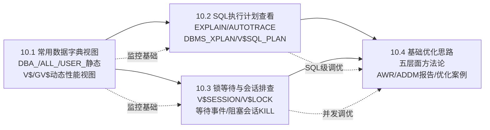

# MOC - 第10章 性能监控与基础优化

> [!info] 本章定位
> 本章是 Oracle 数据库管理的综合能力章，解决"数据库慢了怎么排查、怎么调优"这一 DBA 最核心的日常问题。内容分四节：10.1 熟练使用 Oracle 数据字典（DBA_/ALL_/USER_ 三大前缀静态视图）与动态性能视图（V$ 开头，内存实时数据）快速了解数据库状态；10.2 用 EXPLAIN PLAN、SQL*Plus AUTOTRACE、DBMS_XPLAN、V$SQL_PLAN 四种方法查看并判读 SQL 执行计划（全表扫描 vs 索引扫描、NL/HASH/SORT MERGE 三种连接方式）；10.3 通过 V$SESSION/V$LOCK/V$LOCKED_OBJECT 排查锁等待与阻塞会话，了解常见等待事件；10.4 建立"自顶向下"的五层面优化方法论（应用 SQL 层 > 索引 > 表空间与 I/O > 内存 > OS/参数），并学会用 AWR/ADDM 报告定位系统级瓶颈。
>
> **前置知识**：[[MOC - 第3章]]（SGA/PGA 内存结构、后台进程、物理文件）、[[MOC - 第9章]]（SQL + PL/SQL 编程理解）、数据库原理中查询优化与事务封锁理论。

## 学习路线图



> [!tip] 路线说明
> 推荐按 10.1 → 10.2 → 10.3 → 10.4 顺序学习。10.1 是所有排查工具的基础——所有性能数据都来自 DBA_ 静态视图和 V$ 动态视图；10.2 是 SQL 级优化的必备技能（90% 的性能问题是 SQL 写得差，看执行计划就能定位 80%）；10.3 解决"应用卡住、SQL 不动"这类并发阻塞问题；10.4 是方法论升华，把前面工具综合运用，并引入 AWR/ADDM 报告做全局系统级瓶颈分析。每节均有真实 SQL 示例可在 Oracle 19c 测试库运行。

## 知识点导航表

| 节 | 主题 | 核心要点 | 入口链接 |
| ---- | ---- | ---- | ---- |
| 10.1 | 常用数据字典视图 | DBA_/ALL_/USER_ 三大前缀区别、常用静态视图（DBA_TABLES/DBA_INDEXES/DBA_SEGMENTS/DBA_DATA_FILES/DBA_USERS）、常用动态性能视图（V$INSTANCE/V$SGA/V$SESSION/V$SQL/V$LOCK/V$SESSION_WAIT/V$SYSTEM_EVENT）、GV$ 集群视图、常用排查 SQL 示例 | [[10.1 常用数据字典视图]] |
| 10.2 | SQL执行计划查看 | 什么是执行计划（访问路径+连接顺序+连接方法）、4种查看方法（EXPLAIN PLAN FOR + DBMS_XPLAN.DISPLAY / SET AUTOTRACE / DBMS_XPLAN.DISPLAY_CURSOR 实际执行计划 / AWR）、执行计划关键列（Id/Operation/Name/Rows/Bytes/Cost/Time/Predicate）、TABLE ACCESS FULL 与各类索引扫描、NESTED LOOPS vs HASH JOIN vs SORT MERGE JOIN 对比、优化前后执行计划示例 | [[10.2 SQL执行计划查看]] |
| 10.3 | 锁等待与会话排查 | Oracle 锁类型（TX 事务行锁 / TM 表锁 / DDL 锁 / Latch 闩锁）、6 种锁模式（0-6，SS/SX/S/SSX/X）、TM 锁相容矩阵、锁等待排查 SQL（V$LOCK+V$SESSION 找阻塞者被阻塞者、V$LOCKED_OBJECT 找被锁对象）、`ALTER SYSTEM KILL SESSION 'sid,serial#' IMMEDIATE` 杀会话、死锁 ORA-00060、常见 Top 10 等待事件含义、V$SESSION_LONGOPS 长操作监控、排查 Mermaid 流程图 | [[10.3 锁等待与会话排查]] |
| 10.4 | 基础优化思路 | 五层面优化框架（①应用 SQL 层 ②索引层 ③表空间与 I/O 布局 ④内存参数 ⑤OS/网络）、自顶向下优化顺序、SQL 优化 5 步方法论（定位问题 SQL → 看执行计划 → 看等待事件 → 识别瓶颈 → 优化后重测对比）、常见 SQL 优化手段（SELECT \* / 不带条件 / UNION ALL 替 UNION / 索引列不要用函数 / 隐式转换 / 绑定变量 / 分页）、索引优化 B 树/位图/函数索引、表空间 I/O 分离、内存参数（SGA_TARGET/PGA_AGGREGATE_TARGET/MEMORY_TARGET、DB_CACHE_SIZE 命中率、SHARED_POOL_SIZE）、AWR 报告核心关注点（Top 5 Timed Events、Top SQL、Instance Efficiency）、ADDM 自动诊断、完整优化案例 Mermaid 图 | [[10.4 基础优化思路]] |

## 核心考点（8 点 warning）

> [!warning] 重点掌握
> 1. **DBA_ / ALL_ / USER_ 三大前缀区别**：DBA_ = 全库所有对象（需 DBA 权限或 SELECT_CATALOG_ROLE）；ALL_ = 当前用户有权限访问的所有对象；USER_ = 当前用户自己拥有的对象。数量 USER_ ⊆ ALL_ ⊆ DBA_。
> 2. **静态视图 vs 动态 V$ 视图本质区别**：DBA_ 等前缀来自系统表（SYSTEM/SYSAUX 表空间中的数据字典基表），是**静态元数据**，实例关闭也存在；V$ 视图的底层是 X$ 表（SGA 内存结构），是**内存中的实时统计**，实例启动后才存在，关闭立即消失，重启后数据清零。
> 3. **执行计划 4 种查看方法各自适用场景**：①EXPLAIN PLAN FOR = 只估算不执行，看优化器估算的计划；②SET AUTOTRACE ON EXPLAIN = SELECT 实际执行但不输出结果，自动出计划+统计；③DBMS_XPLAN.DISPLAY_CURSOR('SQL_ID', NULL, 'TYPICAL') = 看**真实执行过**的 SQL 的实际计划（生产最实用）；④AWR dba_hist_sql_plan = 历史快照中保存的过去的执行计划。
> 4. **执行计划中三大危险信号**：①对大表的 `TABLE ACCESS FULL`（全表扫描，无索引）；②`NESTED LOOPS` 的驱动表（外表）行数很大（应该小表驱动）；③排序操作 `SORT (ORDER BY / GROUP BY / AGGREGATE)` 的输入行数极大，应该用索引避免排序。
> 5. **锁排查的两条黄金 SQL**：①找阻塞链——V$LOCK 中 block=1 且 lmode>=2 的 SID 是**阻塞者**，request>0 的是被阻塞者，通过 id1/id2 关联；②找被锁对象——V$LOCKED_OBJECT + DBA_OBJECTS 找到被锁的表名+持有会话。ALTER SYSTEM KILL SESSION 前务必确认会话信息和业务影响。
> 6. **Top 5 等待事件是 Oracle 慢的第一诊断入口**：`enq: TX - row lock contention` = 行锁阻塞；`db file scattered read` = 大量全表扫描多块读（缺索引）；`db file sequential read` = 索引单块读（频繁时可能索引选择性差）；`log file sync` = 提交时 LGWR 写 redo 慢（redo 日志在慢盘/频繁提交）；`buffer busy waits` = 热块争用；`latch: cache buffers chains` = SGA 内存闩锁争用。
> 7. **优化顺序：自顶向下，上层收益最大成本最低**：永远先优化**应用层 SQL 和索引**（ROI 最高，通常能解决 90% 的慢 SQL），实在不行再调**表空间布局/I/O**，然后是**内存参数**，最后才考虑 OS/硬件升级（ROI 最低，成本最高）。避免一上来就加内存换 SSD 而不去改一条没加索引的 SQL。
> 8. **AWR 报告四大必看部分**：①**Top 5 Timed Foreground Events**：系统主要在等什么（CPU 还是 I/O 还是锁）；②**Top SQL by Elapsed Time / CPU Time / Executions / Parse Calls**：哪个 SQL 消耗最多资源（90% 优化在这里）；③**Instance Efficiency Percentages**：Buffer Cache 命中率（目标 95%+）、Library Cache 命中率（目标 99%+）、Soft Parse 比例（绑定变量是否好）；④**SQL ordered by Parse Calls**：前几名 Parse Calls ≈ Executions 的就是没绑变量，全是硬解析。

## 自测题（4 道）

> [!question] 1. 列举 Oracle 三大类数据字典前缀的区别（DBA_ / ALL_ / USER_）。为什么 DBA_SEGMENTS 查不到某个用户刚创建的表，而 USER_TABLES 能查到？V$ 视图和 DBA_ 视图本质上有什么区别？
> > [!check]- 参考答案
> > **三大前缀区别：**
> > | 前缀 | 查看范围 | 权限要求 |
> > | ---- | ---- | ---- |
> > | USER_ | 当前用户**自己拥有**的对象 | 无需额外权限，任何用户都能查自己的 |
> > | ALL_ | 当前用户**有权限访问**的所有对象（包括其他用户授权给我的） | 普通用户即可 |
> > | DBA_ | **整个数据库所有用户**的所有对象 | 需要 DBA 角色，或 SELECT ANY DICTIONARY 系统权限，或 SELECT_CATALOG_ROLE 角色 |
> > 覆盖范围：USER_ ⊆ ALL_ ⊆ DBA_。
> >
> > **"DBA_SEGMENTS 查不到 USER_TABLES 能查到的表"**：刚 CREATE TABLE 但**没有插入数据**时，表只是"定义"了还没有分配**段（SEGMENT）**，因此 DBA_SEGMENTS 中没有记录。USER_TABLES 是表的定义（数据字典），只要 CREATE 了就有。插入第一条数据后，Oracle 才会真正分配段空间（EXTENT），此时 DBA_SEGMENTS 就能查到。
> >
> > **DBA_ 静态视图 vs V$ 动态视图：**
> > - **DBA_ / ALL_ / USER_ 静态视图**：底层存放在 SYSTEM/SYSAUX 表空间的**数据字典基表**（如 TAB$, IND$, SEG$）中，是数据库的**元数据定义**，持久化保存——实例关闭、重启仍然存在，重启后数据不变。
> > - **V$ 动态性能视图**：底层是 **X$ 表**（SGA 内存结构，内存中的数组/结构体），反映实例运行时的**实时状态与累计统计**，**只在实例启动后存在**，实例 SHUTDOWN 后完全消失，重启后所有计数器清零。V$ 视图是 SYS 用户拥有的公共同义词，真正的底层视图是 V_$（带下划线），授权一般通过授予 `SELECT ANY DICTIONARY` 或 `SELECT_CATALOG_ROLE` 角色。RAC 集群用 `GV$`（全局 V$）查看所有实例的数据，其中 INST_ID 列区分节点。

> [!question] 2. 什么是 SQL 执行计划？列举并对比四种常用查看执行计划的方法的优缺点与适用场景。什么情况下"EXPLAIN PLAN FOR 看到的执行计划"和"真正在生产中实际执行的计划"可能不一样？
> > [!check]- 参考答案
> > **执行计划（Execution Plan）定义**：Oracle 优化器（Optimizer）在执行 SQL 前，根据表/索引统计信息、系统参数、数据分布等，选择的一条"最优"执行步骤树。每一步包括：① 访问路径（怎么访问单表：全表扫描 TABLE ACCESS FULL / 索引扫描 INDEX RANGE SCAN / 索引唯一扫描等）；② 连接顺序（多表时先访问哪张表作为驱动表）；③ 连接方法（多表连接算法：NESTED LOOPS / HASH JOIN / SORT MERGE JOIN）；④ 其他操作（排序 SORT、去重 UNIQUE、分组 GROUP BY 等）。
> >
> > **四种查看方法对比：**
> > | 方法 | 语法 | 是否真实执行 | 输出内容 | 适用场景 |
> > | ---- | ---- | ---- | ---- | ---- |
> > | **① EXPLAIN PLAN FOR + DBMS_XPLAN.DISPLAY** | `EXPLAIN PLAN FOR sql; SELECT * FROM TABLE(DBMS_XPLAN.DISPLAY);` | ❌ 不执行，只解析估算 | 优化器估算的基数 Rows / Cost / 谓词信息 | 开发阶段快速看估算计划；SQL 执行时间很长不想真跑 |
> > | **② SQL*Plus SET AUTOTRACE** | `SET AUTOTRACE ON EXPLAIN STATISTICS; SELECT ...;` | ✅ 真实执行（TRACEONLY STAT 不输出结果） | 执行计划 + 真实运行统计（逻辑读/物理读/排序/行数） | 开发在 SQL*Plus 调试 SQL，对比优化前后 I/O 差异 |
> > | **③ DBMS_XPLAN.DISPLAY_CURSOR** | `SELECT * FROM TABLE(DBMS_XPLAN.DISPLAY_CURSOR('sql_id', child_no, 'TYPICAL'));` | ✅ 看的是**已执行过**的真实计划 | 实际执行计划 + 真实运行 A-Time / Buffers / Reads | **生产排查最推荐**：从 V$SQL 找到 SQL_ID 直接看它实际跑的计划；对正在跑/刚跑完的 SQL 有效 |
> > | **④ AWR dba_hist_sql_plan** | `SELECT * FROM TABLE(DBMS_XPLAN.DISPLAY_AWR('sql_id'));` | ✅ 历史执行过的计划 | 快照保存的过去的执行计划（历史对比） | 对比"过去快现在慢"的 SQL：历史执行计划 vs 当前执行计划是否变化 |
> >
> > **EXPLAIN 估算计划 ≠ 真实计划的情况**：① 统计信息**过旧/过期**，EXPLAIN 按老统计估算；② **绑定变量窥探（Bind Peeking）**：EXPLAIN 不知道绑定变量具体值，实际执行时 Oracle 知道具体值可能选不同计划（11g+ ACS 自适应游标共享）；③ **SQL Profile / SQL Plan Baseline / 存储大纲**强制了计划，EXPLAIN 默认看不到；④ 会话级参数与 EXPLAIN 所在会话参数不同（如 optimizer_mode、并行度 DOP）；⑤ 使用了 VPD（虚拟私有数据库）行级安全策略，EXPLAIN 不模拟 VPD 谓词。

> [!question] 3. 简述 Oracle 锁等待排查的完整流程。当发现数据库大量会话卡在 "enq: TX - row lock contention" 等待事件时，怎么找到**阻塞者**和**被阻塞者**？如何安全地终止阻塞会话？杀会话有哪些风险？
> > [!check]- 参考答案
> > **锁等待排查完整流程：**
> > 1. **进入点：看等待事件** → V$SESSION 中 event 列长时间显示 `enq: TX - row lock contention`、`enq: TM - contention` 等锁相关等待；
> > 2. **找被阻塞会话 SID** → V$SESSION WHERE event LIKE 'enq: TX%'；这些会话的 SECONDS_IN_WAIT 不断增长就是等锁的人；
> > 3. **找阻塞者（谁持有锁不放）** → 用 V$LOCK：`block=1` 且 lmode >= 2 的 SID 是阻塞者（它占有锁，block=1 表示它在阻塞别人）；被阻塞会话 request > 0（它在请求锁）；两者的 id1/id2 相同（同一资源）；
> > 4. **定位被锁对象是什么** → V$LOCKED_OBJECT + DBA_OBJECTS 得到 owner.object_name / object_type；
> > 5. **定位阻塞者在跑什么 SQL（找业务根因）** → 通过 V$SESSION.SQL_ID → V$SQL 查 SQL 全文；V$SESSION.PREV_SQL_ID 查上一条 SQL；V$SESSION 的 USERNAME / PROGRAM / MACHINE / OSUSER 定位业务来源；
> > 6. **决策：沟通 or KILL** → 优先联系业务方（开发/运维）让阻塞者自己提交/回滚（COMMIT/ROLLBACK）；确认可以杀才执行 KILL。
> >
> > **典型阻塞者+被阻塞者 SQL（Oracle 11g/12c/19c 通用）：**
> > ```sql
> > SELECT
> >   '(阻塞者 SID=' || l1.sid || ',' || s1.username || '@' || s1.machine ||
> >   ' program=' || s1.program || ') 阻塞了 ' ||
> >   '(被阻塞 SID=' || l2.sid || ',' || s2.username || '@' || s2.machine || ')' AS status,
> >   l1.id1, l1.id2, l1.lmode hold_mode, l2.request req_mode,
> >   s1.sql_id blocker_sqlid, s2.sql_id waiter_sqlid
> > FROM v$lock l1, v$lock l2, v$session s1, v$session s2
> > WHERE l1.block = 1
> >   AND l2.request > 0
> >   AND l1.id1 = l2.id1 AND l1.id2 = l2.id2
> >   AND l1.sid = s1.sid AND l2.sid = s2.sid;
> > ```
> >
> > **安全 KILL 阻塞会话：**
> > ```sql
> > -- ①先通过SID查SERIAL#（必须配对使用！不同时间同一个SID可能是不同会话）
> > SELECT sid, serial#, username, program, machine, status, sql_id
> >   FROM v$session WHERE sid = <阻塞者SID>;
> > -- ②杀死会话（IMMEDIATE表示立即回滚并释放所有锁，不等待事务结束）
> > ALTER SYSTEM KILL SESSION '<sid>,<serial#>' IMMEDIATE;
> > ```
> >
> > **杀会话的风险（> [!danger]）：**
> > - 被 KILL 的会话正在执行的**事务立即无条件 ROLLBACK**，如果事务很大（UPDATE 百万行），回滚需要很长时间（回滚期间锁可能仍不释放，且产生大量 redo/undo I/O）；
> > - 业务方代码没有重试机制时，用户侧表现为"突然报错断开、数据丢了"（其实是回滚了）；
> > - 极个别情况下（杀的是核心后台进程、XA 分布式事务分支）会导致实例异常；
> > - 生产环境杀会话前**必须打印完整会话信息、SQL 文本、业务模块、执行时间**，最好截图/保存证据，通知相关方后再操作。若会话是 INACTIVE 但持有锁（应用代码忘了 COMMIT），优先联系应用开发者修复代码，KILL 只是临时止血。

> [!question] 4. 画出并解释五层面优化框架（自顶向下），并按顺序列举每个层面的 3-5 条具体优化手段。用一个具体案例（某大表分页查询极慢）说明如何走完整的优化五步法（定位→看计划→看等待→找瓶颈→优化+对比）。
> > [!check]- 参考答案
> > **五层面优化框架（自顶向下 = 上层 ROI 最高，先做）：**
> > ```
> > L1 ① 应用 SQL 层（ROI最高 ✨✨✨✨✨）：SQL写法、绑定变量、逻辑拆分、分页
> > L2 ② 索引层         （ROI高 ✨✨✨✨）    ：B树/位图/函数/复合索引、重建、无用索引删除
> > L3 ③ 表空间与 I/O层 （ROI中 ✨✨✨）     ：表/索引/TEMP/UNDO/FRA 分盘、大表分区、ASM条带化
> > L4 ④ 内存参数层     （ROI中低 ✨✨）      ：SGA/PGA、DB_CACHE命中率、共享池、cursor参数
> > L5 ⑤ OS/硬件/网络层 （ROI最低 ✨）       ：CPU核数、SSD、HBA卡带宽、网络RTT、操作系统参数
> > ```
> > **越上层越应该先做**：一条没加索引的 SQL 导致的全表扫描，用百倍成本的 SSD 也赶不上加一个索引的效果。
> >
> > **各层面具体优化手段：**
> > - **①应用SQL层**：避免 SELECT \* 只取需要列；大表查询必须带 WHERE 条件过滤；UNION ALL 替代 UNION（不需要去重时，避免排序）；**不要在索引列上套函数**（WHERE TO_CHAR(hiredate,'YYYY')='2024' → 改为 hiredate BETWEEN DATE'2024-01-01' AND DATE'2025-01-01'-1/86400）；避免隐式类型转换（VARCHAR2 列 = NUMBER 常量）；批量操作用 FORALL/BULK COLLECT 减少 PL/SQL↔SQL 切换；分页查询用 ROWNUM / ROW_NUMBER() 分析函数，先按索引排序再分页避免全表排序。
> > - **②索引层**：WHERE 条件高频列 + JOIN 列建 B 树索引；复合索引按选择性从高到低排顺序（可选性高的放索引前缀）；基数字段低（如性别、状态只有几个值）用位图索引（OLAP 非高并发）；表达式查询建函数索引（FBI：CREATE INDEX idx ON tab(UPPER(name))）；定期检查 V$SQL_PLAN 中从未被用到的索引，DBA_INDEXES 中 BLEVEL 高、LEAF_BLOCKS 大的索引定期 `ALTER INDEX ... REBUILD ONLINE NOLOGGING` 重建（碎片多的索引效率下降 30%+）。
> > - **③表空间/I/O层**：数据文件散列到不同磁盘/LUN/ASM 磁盘组，避免热点盘；数据表空间、索引表空间、TEMP 临时表空间、UNDO 撤销表空间、FRA 闪回恢复区**各自独立**；TEMP 放在最快的盘上（排序、哈希、临时表用）；大表（千万级以上）按时间 RANGE 分区 + 本地索引，查询时利用分区剪枝只扫描相关分区；LMT 本地管理表空间（Oracle 9i 起默认）、ASSM 自动段空间管理（9i R2 起默认，9i+推荐），不要用 DMT 字典管理 + MSSM。
> > - **④内存参数层**：11g+ 优先开 AMM 自动内存管理（MEMORY_TARGET / MEMORY_MAX_TARGET，Oracle 自动调 SGA+PGA）；或 10g 风格 SGA_TARGET + PGA_AGGREGATE_TARGET 分别自动调；DB_CACHE_ADVICE / V$DB_CACHE_ADVICE 建议加大 DB_CACHE_SIZE → 命中率 > 95%+；SHARED_POOL_SIZE 够大避免 ORA-04031，Library Cache Hit Ratio > 99%，关键是用绑定变量（否则共享池再大也没用）；OPEN_CURSORS = 300+，SESSION_CACHED_CURSORS = 50+，避免反复解析相同 SQL。
> > - **⑤OS/硬件层**：CPU 核数与 Oracle license 匹配；存储用 SSD（随机读延迟从 10ms → 0.1ms，提升 100 倍）替代 15K SAS；HBA 卡带宽 8Gbps+、多路径冗余；网络 RTT < 1ms（应用服务器与 DB 不要跨机房，否则每个 SQL 往返 RTT 都会叠加成灾难）；OS 内核参数（SHMMAX / semmni / 最大打开文件数）按 Oracle 安装文档 preinstall 脚本设置；关闭 Transparent HugePages（THP 会导致 Oracle 内存分配卡顿）。
> >
> > **完整优化案例（大表分页查询慢）：**
> > ```
> > 原始慢查询：SELECT * FROM (SELECT t.*, ROWNUM rn FROM big_order t WHERE status='PAID') WHERE rn BETWEEN 99001 AND 100000;
> > （用户要查按创建时间排序的第1000页，每页100条，每次查询耗时35s）
> > ```
> > **Step 1 定位问题 SQL：** AWR Top SQL by Elapsed Time → 定位到该 SQL_ID，每次执行 35s，日调用 1 万次，占 DB Time 30%。
> > **Step 2 看执行计划：** `SELECT * FROM TABLE(DBMS_XPLAN.DISPLAY_CURSOR('xxx'));` → 发现 TABLE ACCESS FULL BIG_ORDER 全表扫 5000 万行 → SORT ORDER BY 全排序 5000 万行 → 再取 ROWNUM 分页。虽然最后只取 100 条，但前面扫了全表+排了全表。
> > **Step 3 看等待事件：** 该 SQL 主要等待 `db file scattered read`（全表扫描多块读）+ `direct path write temp`（排序太大 PGA 不够，溢出到 TEMP 临时表空间写临时段，极慢）。
> > **Step 4 识别瓶颈：** ① 没有合适索引（按条件+排序建复合索引）；② 分页 SQL 写法差（先全表取数再包 ROWNUM，导致前 99000 条都被取出来再丢弃）。
> > **Step 5 优化并对比：**
> > - **优化①加复合索引**：`CREATE INDEX idx_bigorder_status_ctime ON big_order(status, create_time DESC) ONLINE NOLOGGING;`
> > - **优化②改写SQL走索引避免全表排序**：
> > ```sql
> > SELECT * FROM (
> >   SELECT t.*, ROWNUM rn
> >     FROM (SELECT * FROM big_order WHERE status='PAID' ORDER BY create_time DESC) t
> >    WHERE ROWNUM <= 100000
> > ) WHERE rn > 99000;
> > -- Oracle 12c+ 更简洁：OFFSET 99000 ROWS FETCH NEXT 100 ROWS ONLY;
> > ```
> > - **对比验证**：用 SQL_TRACE 10046 事件 + tkprof 或 AUTOTRACE 看 STATISTICS。优化前：逻辑读 580,000、物理读 420,000、执行时间 35.2s。优化后：INDEX RANGE SCAN 只走索引取 100,000 条（实际只需要最后 100 条）→ TABLE ACCESS BY INDEX ROWID 100 条 → 逻辑读 1,230、物理读 120、执行时间 **0.08s**。性能提升 440 倍 ✅。
> > - **注意**：深分页（第10万条以上）用 Seek Method（基于上次最后一条主键/排序键）进一步优化：`WHERE (create_time, id) < (:last_ctime, :last_id) ORDER BY create_time DESC, id DESC FETCH FIRST 100 ROWS ONLY` 性能基本与页码无关（常量时间）。

## 章节导航

- 上一级：[[MOC - Oracle数据库管理]]
- 上一章：[[MOC - 第9章]]（PL/SQL程序设计）
- 本章习题：[[MOC - 第10章习题]]
- 上一章习题：[[MOC - 第9章习题]]
