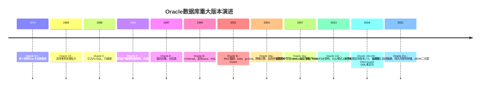
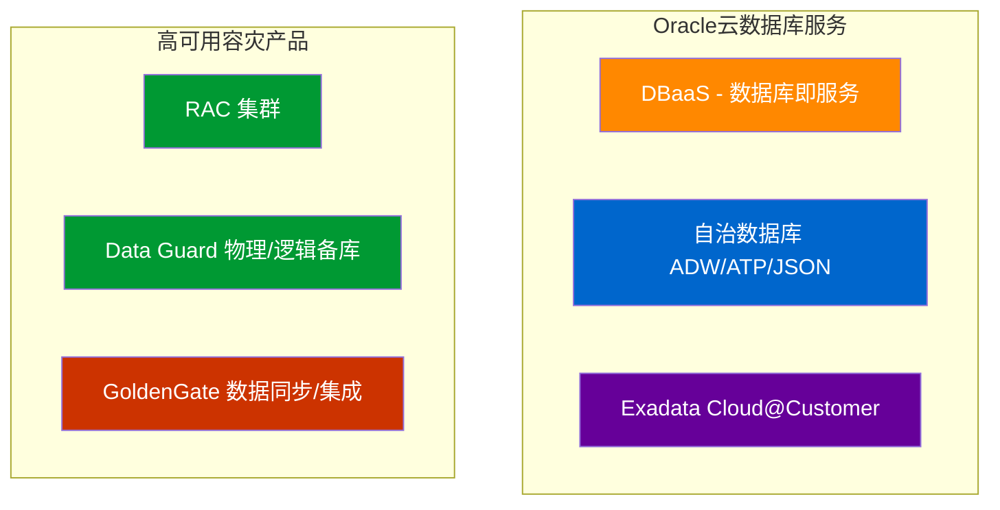

# 1.1 Oracle发展与版本体系

本节梳理Oracle数据库从实验室原型到云原生自治数据库的发展脉络，厘清版本体系与产品矩阵，通过竞品对比明确Oracle的产品定位。

## Oracle发展历程

> [!definition] Oracle公司起源
> Oracle前身是1977年Larry Ellison等人创办的**SDL（Software Development Laboratories）**，受IBM研究论文《A Relational Model of Data for Large Shared Data Banks》启发，率先实现商业关系型数据库。1979年发布Oracle V2（跳过V1，寓意"没有bug的版本"的商业策略）。

> [!note] Oracle专有特性标注
> - **多租户架构（CDB/PDB）**：12c首创，一个容器数据库(CDB)承载多个可插拔数据库(PDB)，实现数据库整合与快速克隆，是Oracle区别于MySQL/PostgreSQL的独有架构。
> - **RAC（Real Application Clusters）**：真正应用集群，9i引入，多节点共享存储提供高可用和水平扩展，竞品无同等原生实现。
> - **ADG（Active Data Guard）**：物理备库可读查询+实时查询，备库可用于报表卸载查询的备份库查询。

## 版本体系

### 版本类型

| 版本类型 | 定位 | 核心特性 | 授权模式 | 适用场景 |
|---|---|---|---|---|
| Enterprise Edition (EE) 企业版 | 旗舰产品 | RAC、ADG、分区、高级压缩、高级安全、RMAN、OLAP/数据挖掘全部特性全部功能 | 按CPU核数或按用户数授权 | 大型企业核心业务、生产系统、对高可用高性能要求场景 |
| Standard Edition 2 (SE2) 标准版 | 中小企业版 | 基础RAC（最多2节点）、基础特性限制功能子集 | 按CPU或按用户 | 中小企业、部门级应用 |
| Express Edition (XE) 免费版 | 免费开发学习版 | 功能受限（最多2CPU、2GB内存、12GB用户数据 | 免费 | 开发测试、学习、小型原型 |

> [!warning] SE2限制说明
> Oracle 19c SE2限制：最多16线程、最多2节点RAC、不支持分区/ADG/高级压缩/高级安全/闪回数据归档等企业特性。生产选型务必确认功能匹配。

### 版本号命名规则

Oracle数据库版本号格式：**MAJOR.MINOR.RELEASE.UPDATE.PATCH**

| 位置 | 含义 | 示例(19.16.0.0.0) |
|---|---|---|
| MAJOR | 主版本号 | 19 |
| MINOR | 次版本号（维护兼容性） | 16 |
| RELEASE | 发布版本号 | 0 |
| UPDATE | 更新版本号（RU更新） | 0 |
| PATCH | 补丁版本号 | 0 |

> [!tip] 长期支持版(LTS)说明
> Oracle 19c是当前长期支持版本，支持到2027年（延展支持到2032年。21c是创新版本，支持周期短。生产系统推荐19c。

## Oracle vs 竞品对比

| 对比维度 | Oracle 19c EE | MySQL 8.0 | PostgreSQL 15 | SQL Server 2022 |
|---|---|---|---|---|
| 许可证成本 | 极高（企业级授权昂贵） | 社区版免费/企业版付费 | 完全开源免费 | 企业版贵/Express免费 |
| 高可用 | RAC多活集群+ADG | Group Replication/InnoDB Cluster | Streaming Replication + Patroni | AlwaysOn AG |
| 可扩展性 | 水平扩展(RAC) | 读写分离、分库分表 | 读写分离 | AlwaysOn读写分离 |
| 性能优化器 | 业界领先CBO、SQL调优包AWR/ASH/ADDM | 逐步增强 | 优秀 | 优秀 |
| 分区表 | 范围/列表/哈希/间隔/组合分区 | 范围/列表/哈希 | 声明式分区 | 表分区 |
| 备份恢复 | RMAN企业级、块级恢复、闪回技术 | mysqldump/xtrabackup | pg_dump/pg_basebackup | SSMS备份、TDE透明加密 |
| 适用企业规模 | 超大型/大型企业 | 中/小型、互联网 | 全栈开源 | 微软生态企业 |
| 典型场景 | 金融、电信、政企核心库 | 互联网应用、电商OLTP | GIS、复杂查询 | .NET应用、BI、数据分析 |

> [!note] Oracle专有
> **闪回技术（Flashback）**系列能力：闪回查询/闪回表/闪回数据库/闪回删除/闪回数据归档，是Oracle独有的数据恢复利器，竞品缺乏同等深度的时间点回退能力。

## Oracle云产品矩阵

| 产品 | 说明 |
|---|---|
| **DBaaS** | 云端托管Oracle，用户负责运维管理，按需付费 |
| **自治数据库ADW/ATP** | 自动驾驶：自动调优、自动备份、自动打补丁、自动扩展 |
| **ADW（自治数据仓库）** | 面向分析场景，列式存储+ML优化 |
| **ATP（自治事务处理）** | 面向OLTP高并发场景 |
| **Exadata** | Oracle自有硬件一体机，智能存储软件优化极致性能 |
| **GoldenGate** | 异构数据库实时数据复制、大机下移、双活数据中心 |

> [!tip] 选型建议
> 核心交易系统、对RPO/RTO要求极高的金融/电信场景优先Oracle EE + RAC + ADG；预算有限的互联网场景可评估MySQL/PostgreSQL；分析类业务评估自治数据库ADW。

## 小结

- Oracle从1979年首个商业关系库发展到21c云原生，核心竞争力在于企业级高可用、性能、稳定性
- 版本体系分为EE企业版、SE2标准版、XE免费版，生产选型优先19c LTS
- Oracle的RAC、多租户CDB/PDB、闪回、ADG等是竞品缺失或不成熟的独有特性
- 云时代Oracle提供DBaaS和自治数据库，降低运维门槛

## 关联

- 返回本章MOC：[[MOC - 第1章 Oracle数据库概述]]
- 上一节：本章起始
- 下一节：[[1.2 Oracle体系结构总览]]
- 相关概念：[[1.3 数据库与实例概念区分]]、[[3.2 后台进程作用]]
