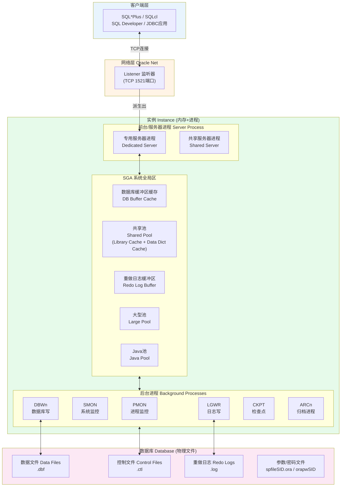
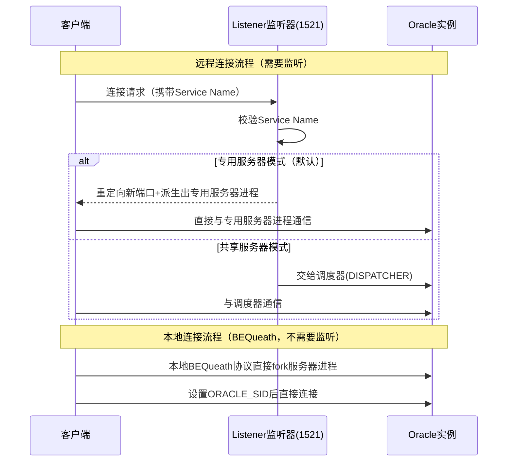

# 1.2 Oracle体系结构总览

Oracle体系结构是理解一切DBA操作的基础，其最核心的设计理念是将**运行态的实例（Instance）**与**存储态的数据库（Database）**彻底解耦，这是Oracle与MySQL/PostgreSQL最本质的区别之一。

## 体系结构两大组成

> [!definition] Oracle体系结构 = 实例 + 数据库
> - **实例（Instance）**：由**内存结构（SGA）** + **后台进程**组成，是Oracle运行时的"引擎"，生命周期随数据库启动/关闭，服务器重启后原实例消失
> - **数据库（Database）**：由**磁盘物理文件**（数据文件.dbf、控制文件.ctl、重做日志.log等）组成，是Oracle存储的"仓库"，永久保存数据
> - 单实例环境下：一个实例对应一个数据库（一一对应）
> - RAC集群环境下：多个实例对应一个数据库（多对一）

> [!note] Oracle专有
> Oracle严格区分Instance与Database是独有的设计哲学。MySQL中mysqld进程对应datadir是一体的概念，不存在"先启动实例再加载数据库"的三阶段启动流程——这是Oracle独有的，务必建立正确心智模型。

## 完整体系结构图



## 客户端连接Oracle流程

Oracle客户端连接分两种方式，连接机制完全不同：

| 连接方式 | 连接路径 | 是否需要监听 | 使用场景 |
|---|---|---|---|
| **本地连接 BEQueath** | 客户端进程→直接fork服务器进程 | ❌不需要监听 | DBA本地运维、sqlplus / as sysdba |
| **远程连接 Listener** | 客户端→TCP 1521→监听器→派生出服务器进程 | ✅必须启动监听 | 应用服务器、远程客户端、JDBC |



> [!example] Oracle 19c
> ```sql
> -- 本地连接（不通过监听）：需要先设置ORACLE_SID
> -- export ORACLE_SID=orcl     -- Linux/Unix
> -- set ORACLE_SID=orcl          -- Windows
> sqlplus / as sysdba
> 
> -- 远程连接（通过监听1521端口，使用Service Name）：
> sqlplus system/yourpassword@//192.168.1.100:1521/orcl.example.com
> -- 或使用TNS网络服务名：
> sqlplus scott/tiger@ORCL
> ```

> [!warning] 本地连接权限
> `sqlplus / as sysdba`使用**操作系统认证**（OS Authentication），依赖当前用户是否属于dba组（Unix）或ORA_DBA组（Windows）。远程连接必须使用密码文件认证，切勿在生产环境使用弱密码。

## 网络结构核心要素

### 1. 监听端口 1521

> [!definition] Listener监听器
> 监听器是Oracle实例外部的独立进程，运行在Oracle服务端，默认监听TCP **1521端口**，负责接收远程客户端连接请求，然后将连接**重定向**或**转交**给实例内的服务器进程。

> [!danger] 高风险：安全注意
> 生产环境务必：① 修改默认1521端口或使用TCPS加密；② 限制监听器仅监听指定IP；③ 启用监听器密码；④ 设置VALID_NODE_CHECKING_REGISTRATION防止恶意注册实例到监听。

### 2. SID vs Service Name

| 概念 | 定义 | 配置位置 | 典型值示例 |
|---|---|---|---|
| **SID** (System Identifier) | **实例**的唯一标识符，操作系统层面区分不同实例 | 环境变量ORACLE_SID、listener.ora中SID_LIST | orcl、prod、testdb |
| **Service Name** | **数据库对外提供的逻辑服务名**，一个数据库可注册多个服务名，便于应用灵活连接 | init.ora/spfile参数SERVICE_NAMES | orcl.example.com、oltp.example.com |

> [!tip] 服务名优势
> Service Name支持以下高级特性（SID不支持）：
> - 负载均衡（多个实例注册同一服务名）
> - 连接时故障转移（Connect-time Failover）
> - 应用透明故障转移TAF（Transparent Application Failover）
> - 服务级别监控和资源管理（DBMS_SERVICE）

### 3. 网络配置文件

| 文件 | 作用 | 典型位置 |
|---|---|---|
| **listener.ora** | 服务端监听器配置：监听地址、端口、静态注册的SID | $ORACLE_HOME/network/admin/ |
| **tnsnames.ora** | 客户端网络服务名解析：别名→连接描述符映射 | $ORACLE_HOME/network/admin/ |
| **sqlnet.ora** | 网络层全局参数：认证方式、域名、日志级别 | $ORACLE_HOME/network/admin/ |

> [!example] Oracle 19c 网络配置示例
> ```
> -- listener.ora (服务端)
> LISTENER =
>   (DESCRIPTION =
>     (ADDRESS = (PROTOCOL = TCP)(HOST = dbserver.example.com)(PORT = 1521))
>   )
> 
> -- tnsnames.ora (客户端)
> ORCL =
>   (DESCRIPTION =
>     (ADDRESS = (PROTOCOL = TCP)(HOST = 192.168.1.100)(PORT = 1521))
>     (CONNECT_DATA =
>       (SERVER = DEDICATED)
>       (SERVICE_NAME = orcl.example.com)
>     )
>   )
> ```

## 小结

- Oracle体系结构的核心拆分：**实例（SGA内存+后台进程）**是运行态，**数据库（物理文件）**是存储态
- 完整的数据流：客户端→监听→服务器进程→SGA内存→后台进程→物理文件
- 连接方式分本地BEQueath（无监听、OS认证）和远程监听（1521端口、密码/服务名）
- 网络三要素：1521端口、SID（实例标识）、Service Name（数据库服务标识）

## 关联

- 返回本章MOC：[[MOC - 第1章 Oracle数据库概述]]
- 上一节：[[1.1 Oracle发展与版本体系]]
- 下一节：[[1.3 数据库与实例概念区分]]
- 深入学习：[[3.1 内存结构SGA、PGA]]、[[3.2 后台进程作用]]、[[2.3 监听程序、环境变量配置]]
