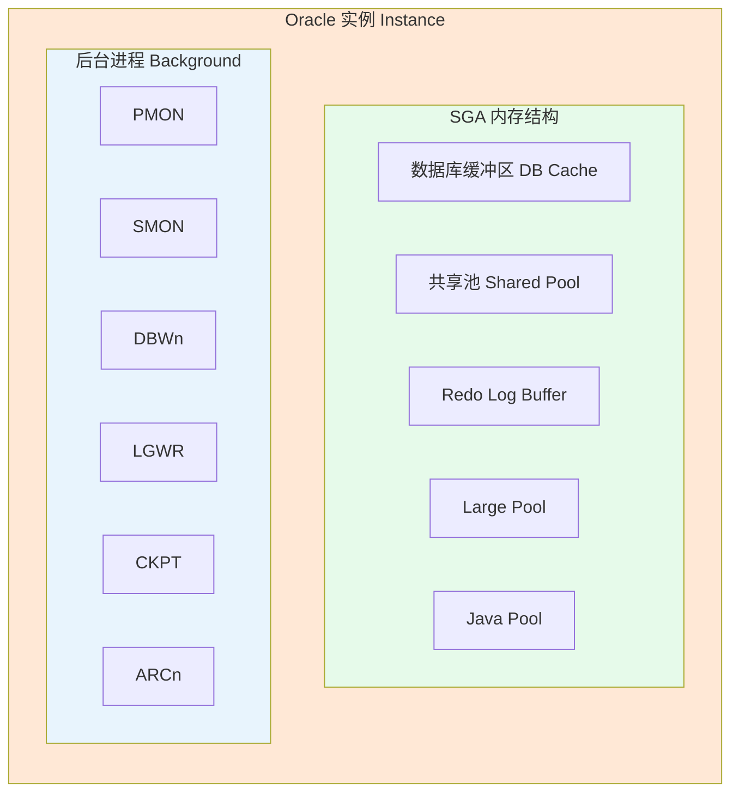
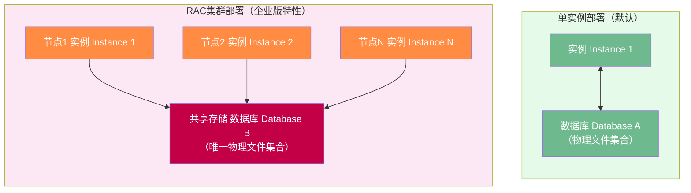

# 1.3 数据库与实例概念区分

Oracle的核心概念中，**实例（Instance）**与**数据库（Database）**是绝对核心的区分点，也是后续启动、关闭、备份、恢复操作的基石。若不理解这一区分，所有DBA命令都会沦为机械记忆。

## Database数据库的定义

> [!definition] Database（数据库）
> 数据库是**磁盘上物理文件的集合**，是数据永久存储的容器。即使数据库关闭、服务器断电、操作系统重启，这些文件依然存在，数据不会丢失。

### 数据库物理文件构成

| 文件类型 | 扩展名（惯例） | 数量 | 作用 | 丢失后果 |
|---|---|---|---|---|
| **数据文件 Data Files** | .dbf | N个（每个表空间至少1个） | 永久存储用户数据、系统元数据、索引、UNDO、临时数据 | 丢失对应表空间的数据，需备份恢复 |
| **控制文件 Control File** | .ctl | 至少2个（多路复用，建议3个） | 二进制文件，记录数据库结构元信息：数据库名、SCN、数据文件/日志文件列表、日志历史、备份信息 | 丢失导致数据库无法MOUNT，需重建控制文件或备份恢复 |
| **重做日志文件 Redo Log** | .log | 至少2组（每组至少2个成员多路复用） | 循环记录所有事务变更，用于实例恢复和介质恢复 | 丢失当前日志组导致数据丢失、数据库崩溃 |
| **参数文件 SPFILE/PFILE** | spfileSID.ora / initSID.ora | 1个 | 实例启动参数配置：内存大小、控制文件位置、归档目标等 | 丢失无法启动实例，需重建 |
| **密码文件 Password File** | orapwSID | 1个 | 远程SYS用户认证、具有SYSDBA/SYSOPER权限的密码存储 | 丢失导致远程SYS连接失败，可重建 |
| **告警日志 Alert Log** | alertSID.log | 1个 | 记录数据库重大事件：启动/关闭、错误、参数变更 | 诊断数据库问题的首要日志，不影响运行 |
| **跟踪文件 Trace Files** | .trc / .trm | N个 | 后台进程/用户进程的详细诊断信息 | 不影响运行，用于问题诊断 |

> [!warning] 控制文件多路复用
> Oracle强烈建议控制文件至少**多路复用3份**，存放在不同物理磁盘。控制文件是数据库的"目录"，丢失后数据库无法识别自己的数据文件位置。SPFILE参数`control_files`控制多路复用：
> ```
> control_files = '/disk1/control01.ctl','/disk2/control02.ctl','/disk3/control03.ctl'
> ```

> [!example] Oracle 19c
> ```sql
> -- 查询数据文件位置与大小
> SELECT file_name, tablespace_name, bytes/1024/1024 AS size_mb
> FROM dba_data_files ORDER BY tablespace_name;
> 
> -- 查询控制文件位置
> SELECT name, status FROM v$controlfile;
> 
> -- 查询重做日志组与成员
> SELECT group#, member, status FROM v$logfile ORDER BY group#, member;
> ```

## Instance实例的定义

> [!definition] Instance（实例）
> 实例是**访问数据库的引擎**，由**SGA系统全局区内存结构** + **一组后台进程**组成。实例随`STARTUP`命令创建，随`SHUTDOWN`命令销毁，生命周期是临时的——每次启动都是新的实例。

### 实例组成


### ORACLE_SID环境变量

> [!definition] ORACLE_SID
> **ORACLE_SID = Oracle System Identifier**，是操作系统层面用于**区分同一台服务器上不同Oracle实例**的环境变量。`ORACLE_SID`必须与实例名（instance_name参数）一致。

| 操作系统 | 设置方式 | 示例 |
|---|---|---|
| Linux / Unix | export环境变量（.bash_profile） | `export ORACLE_SID=orcl` |
| Windows | set命令或注册表 | `set ORACLE_SID=prod` |

> [!tip] ORACLE_SID的作用
> 1. **本地连接识别**：`sqlplus / as sysdba`通过ORACLE_SID知道连接哪个实例
> 2. **默认参数文件名**：spfile${ORACLE_SID}.ora、init${ORACLE_SID}.ora
> 3. **默认密码文件名**：orapw${ORACLE_SID}
> 4. **告警日志文件名**：alert_${ORACLE_SID}.log

## 单实例 vs RAC集群映射关系

> [!warning] 映射关系的区别
> Oracle独有的两种部署模式：



| 对比项 | 单实例（Single Instance） | RAC集群（Real Application Clusters） |
|---|---|---|
| 实例:数据库 | 1 : 1（一一对应） | N : 1（多对一） |
| 存储 | 本地文件系统或NAS | 共享存储（ASM/集群文件系统） |
| 节点数 | 1台服务器 | 2~100+节点 |
| 高可用 | 服务器故障=数据库不可用 | 单节点故障不影响，其余节点接管 |
| 版本要求 | SE2/EE均可 | EE企业版（SE2最多2节点） |
| 典型场景 | 绝大多数业务系统 | 金融电信核心、7×24不可中断系统 |

> [!note] Oracle专有：RAC
> RAC是Oracle独有的**共享磁盘多活集群**架构，通过Cache Fusion高速互联实现跨节点内存块缓存融合，竞品（MySQL集群、PostgreSQL集群）均属于**无共享或主备模式**，达不到同等水平的多活读写下扩展能力。

## 数据库启动三阶段

> [!definition] Oracle启动三阶段（Oracle专有）
> Oracle启动严格按顺序经过三个阶段，每个阶段完成的动作、可用的命令、能看到的视图完全不同——这是Oracle独有的设计。


| 阶段 | 执行动作 | 读取文件 | 可执行操作 | 可查询视图 |
|---|---|---|---|---|
| **NOMOUNT** 未挂载 | 1. 读取参数文件spfile/pfile<br>2. 分配SGA内存<br>3. 启动后台进程 | 参数文件 SPFILE/PFILE | 创建数据库、重建控制文件 | V$INSTANCE、V$SGA、V$PARAMETER |
| **MOUNT** 已挂载 | 1. 从参数文件读取控制文件位置<br>2. 读取控制文件<br>3. 确认数据文件/日志文件清单 | 控制文件 Control File | 重命名数据文件、改归档模式、执行恢复、切换日志模式 | + V$DATABASE、V$DATAFILE、V$LOG、V$TABLESPACE |
| **OPEN** 打开 | 1. 检查所有数据文件存在性<br>2. 执行SMON实例恢复（若异常关闭）<br>3. 打开数据文件和日志文件<br>4. 允许用户连接 | 全部物理文件 | 正常数据库所有操作、DML/DDL/查询 | + DBA_*视图、ALL_*、USER_*视图全部可用 |

> [!example] Oracle 19c
> ```sql
> -- 分步骤启动（演示三阶段）
> STARTUP NOMOUNT;            -- 仅启动实例
> ALTER DATABASE MOUNT;       -- 加载数据库（读控制文件）
> ALTER DATABASE OPEN;        -- 打开数据库
> 
> -- 一步到位启动
> STARTUP;                    -- = NOMOUNT -> MOUNT -> OPEN
> 
> -- 查询当前数据库状态
> SELECT status FROM v$instance;
> -- 输出: STARTED (NOMOUNT) / MOUNTED / OPEN
> 
> -- 关闭顺序与启动相反
> SHUTDOWN IMMEDIATE;         -- 推荐：禁止新连接→回滚未提交→关闭
> ```

> [!danger] 高风险：SHUTDOWN ABORT
> `SHUTDOWN ABORT`相当于"拔电源式硬关机"，不回滚、不写检查点。下次启动会触发SMON做实例恢复，极端情况可能损坏数据文件。除非紧急故障，严禁使用ABORT关闭生产数据库。优先使用`SHUTDOWN IMMEDIATE`。

## Oracle vs MySQL 概念对照

> [!warning] Oracle专有 vs MySQL
> 以下概念Oracle独有，MySQL中没有直接对应物或含义完全不同：

| Oracle概念 | Oracle含义 | MySQL中对应概念/差异 |
|---|---|---|
| **Instance 实例** | SGA内存+后台进程，运行态，可独立于数据库启动 | MySQL中"实例"=mysqld进程+datadir，二者一体，不存在三阶段启动 |
| **Database 数据库** | 物理文件集合（全局唯一，含所有用户数据） | MySQL中"数据库"=SCHEMA，是逻辑命名空间（一个mysqld下有N个database），类比Oracle的**PDB**或**用户Schema** |
| **NOMOUNT/MOUNT/OPEN** | 三阶段启动，各阶段权限/视图/操作不同 | MySQL直接启动mysqld，一次性完成，无阶段 |
| **控制文件 Control File** | 二进制元数据文件，多路复用，数据库的"目录" | MySQL无控制文件概念，元数据存于.frm/.ibd文件和InnoDB系统表空间 |
| **表空间 Tablespace** | 逻辑容器，由多个数据文件组成，系统级管理 | MySQL InnoDB有独立表空间（每表一个.ibd），但概念更弱，无UNDO/TEMP独立表空间管理 |
| **Redo Log 重做日志** | 循环写的在线日志组，多路复用成员 | MySQL InnoDB Redo Log（ib_logfile0/1）概念相似，但无多路复用成员组 |
| **SYSDBA/SYSOPER** | 超级管理员权限，操作系统认证+密码文件 | MySQL root用户，单一权限体系 |
| **ORACLE_SID** | 操作系统级实例标识符 | MySQL无对应概念，用--defaults-file或socket区分多实例 |

> [!note] Oracle Database vs MySQL Database是最容易混淆的点！
> Oracle里创建一个"Database"是极其重量级的操作（创建全新的物理文件集合+控制文件+系统表空间），通常一台服务器只有1-2个Database。MySQL里创建一个"Database"（`CREATE DATABASE xxx`）只是创建一个逻辑Schema，非常轻量，一个mysqld下有几十上百个Database是常态。

## 小结

- **Database（数据库）**=磁盘物理文件（.dbf/.ctl/.log等），永久存储，是"仓库"
- **Instance（实例）**=SGA内存+后台进程，临时运行态，是"引擎"
- 单实例1:1，RAC多实例:1数据库（共享存储）
- Oracle启动三阶段：NOMOUNT（读参数，起实例）→MOUNT（读控制文件）→OPEN（打开文件对外服务）
- ORACLE_SID是操作系统级实例标识符，控制本地连接和默认文件名
- 与MySQL对比：Oracle的Database ≠ MySQL的Database；Oracle的Instance ≠ MySQL的mysqld

## 关联

- 返回本章MOC：[[MOC - 第1章 Oracle数据库概述]]
- 上一节：[[1.2 Oracle体系结构总览]]
- 下一章入口：[[MOC - 第2章 Oracle安装与环境配置]]
- 深入学习：[[3.1 内存结构SGA、PGA]]、[[3.3 物理文件：数据文件、控制文件、重做日志]]、[[3.2 后台进程作用]]
