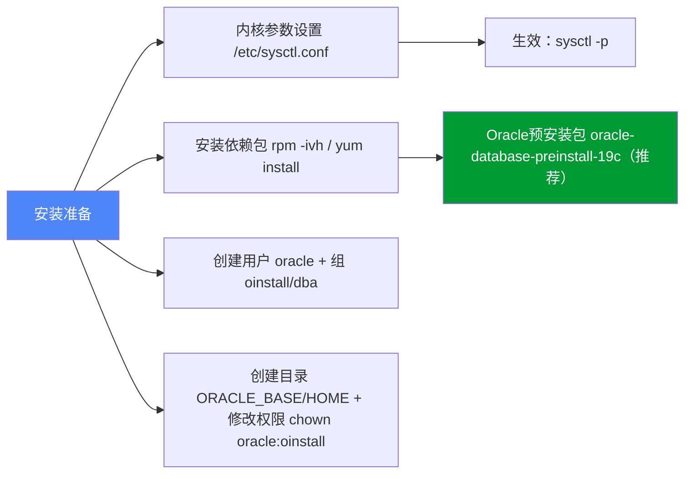
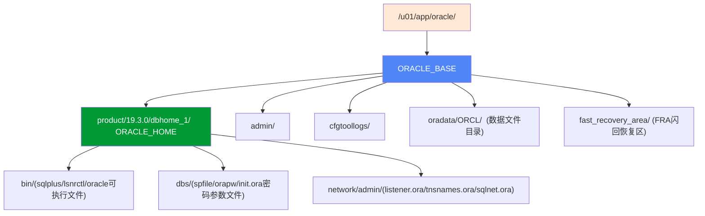

# 2.1 Oracle软硬件环境要求

Oracle数据库对服务器软硬件有严格的官方认证基线，不符合要求轻则安装先决条件检查失败，重则生产运行时性能不稳、OOM崩溃、数据损坏。本节以**Oracle 19c + CentOS/RHEL 7.x**（生产最常用组合）为基准，涵盖硬件、软件、用户组、目录结构四大准备项。

> [!warning] 生产前提：版本兼容性矩阵
> 安装前务必查Oracle官方文档（MOS认证矩阵）：Oracle 19c仅支持RHEL/CentOS 7.4以上、Oracle Linux 7.x，**不支持CentOS 8/9、Ubuntu、Debian**（非官方社区折腾可用，生产不支持）。Windows支持Windows Server 2016/2019/2022。

## 硬件要求

### CPU、内存、磁盘最低基线

| 资源项 | 学习/测试环境最低要求 | 生产环境推荐配置 | Oracle 19c官方要求 |
|---|---|---|---|
| **CPU** | 2核 | ≥8核（OLTP）、≥16核（混合负载） | ≥2核 x86_64架构 |
| **物理内存RAM** | 4GB（仅GUI安装能跑，极卡） | ≥16GB（小型生产）、≥32GB（中大型） | 最低**8GB**，低于8GB安装预检直接Fail |
| **Swap交换分区** | 4GB（等于RAM） | RAM≤8GB → Swap=RAM；8GB<RAM≤16GB→Swap=8GB；RAM>16GB→Swap≥16GB | 按官方规则：见正文Swap公式 |
| **/tmp目录空间** | ≥1GB | ≥5GB（大安装解压需要） | 最低**1GB**，Oracle Universal Installer解压到/tmp |
| **Oracle软件磁盘** | ≥20GB（仅软件不包含数据） | ≥100GB（软件+备份+归档） | 最低**6.4GB**（EE软件安装文件解压后约6.4GB） |
| **数据库数据磁盘** | ≥20GB（学习） | 按业务量预估（建议每100GB数据预留1.5倍空间+冗余） | 无下限，SYSTEM+SYSAUX+UNDOTBS+TEMP默认约5GB起步 |
| **tmpfs /dev/shm** | RAM大小默认 | ≥SGA_MAX_SIZE（19c MEMORY_TARGET用tmpfs） | 至少等于SGA，否则启动报错ORA-00845 |

> [!definition] tmpfs /dev/shm 说明
> tmpfs是基于内存的虚拟文件系统。Oracle 11g以后的**自动内存管理（AMM, MEMORY_TARGET参数）**使用/dev/shm存放SGA+PGA部分内存。如果tmpfs小于SGA，启动会报错：
> ```
> ORA-00845: MEMORY_TARGET not supported on this system
> ```
> 解决方案：`mount -o remount,size=16G /dev/shm` 临时调整，或写入/etc/fstab永久生效。

### Swap分区官方计算规则

| 物理内存RAM | 推荐Swap大小 |
|---|---|
| RAM ≤ 2GB | 2×RAM |
| 2GB < RAM ≤ 8GB | = RAM |
| RAM > 8GB | 至少0.75×RAM，推荐≥16GB |

> [!warning] Swap配置注意
> - Swap必须是独立分区（swap分区），不建议用swap文件（性能差）
> - 生产Swap必须在本地SSD盘，避免NFS/SAN延迟
> - 安装先决条件检查`Pre-Check`不通过，可忽略安装（-ignoreSysPrereqs强制）但生产必须解决

## 软件要求

### 操作系统版本

| Oracle版本 | 支持的Linux发行版 | 内核版本要求 |
|---|---|---|
| **Oracle 19c** | Oracle Linux 7.4+ （推荐，原厂最优）<br>Red Hat Enterprise Linux 7.4+（RHEL 7.x）<br>CentOS 7.4+（社区RHEL兼容） | kernel-3.10.0-693.el7.x86_64 以上 |
| 不支持 | RHEL/CentOS 8.x/9.x、Ubuntu、Debian、SUSE（部分需单独认证） | |

### 内核参数 /etc/sysctl.conf



> [!warning] 内核参数设置（Oracle 19c生产最低值）
> 必须以root用户编辑 `/etc/sysctl.conf`，追加以下参数，**生产按实际内存调优**：
> ```conf
> # 共享内存：shmmax 设为物理内存的一半（字节，例如16GB内存则设8589934592）
> kernel.shmmax = 8589934592
> # 共享内存段最小/最大数量
> kernel.shmmni = 4096
> kernel.shmall = 2097152
> 
> # 信号量：semmsl semmns semopm semmni
> # semmsl=最大信号量集大小=最大PROCESSES参数+10
> kernel.sem = 250 32000 100 128
> 
> # 文件句柄数：最大打开文件描述符
> fs.file-max = 6815744
> 
> # 本地端口范围（客户端出站端口）
> net.ipv4.ip_local_port_range = 9000 65500
> 
> # Socket接收/发送缓冲区
> net.core.rmem_default = 262144
> net.core.rmem_max = 4194304
> net.core.wmem_default = 262144
> net.core.wmem_max = 1048576
> 
> # 启用异步I/O（Oracle强烈推荐，大幅提升性能）
> fs.aio-max-nr = 1048576
> ```
> 生效命令：`sysctl -p`（立即生效，无需重启）

> [!tip] 偷懒方案：Oracle预安装RPM包
> Oracle官方提供 **oracle-database-preinstall-19c.x86_64.rpm**（Oracle Linux）或 **oracle-rdbms-server-19c-preinstall**（RHEL），一键完成：内核参数、依赖包、创建用户/组、limits.conf设置全部自动。
> ```bash
> # Oracle Linux yum 安装（最省心）：
> yum install -y oracle-database-preinstall-19c
> ```
> 完成后id oracle检查用户是否创建成功即可。

### yum/rpm 依赖包列表

如果不使用预安装包，需要手动安装以下依赖（CentOS 7）：

```bash
yum install -y bc \
    binutils \
    compat-libcap1 \
    compat-libstdc++-33 \
    gcc \
    gcc-c++ \
    glibc \
    glibc-devel \
    ksh \
    libaio \
    libaio-devel \
    libX11 \
    libXau \
    libXi \
    libXtst \
    libgcc \
    libstdc++ \
    libstdc++-devel \
    libxcb \
    make \
    nfs-utils \
    net-tools \
    python \
    python-configshell \
    python-rtslib \
    python-six \
    targetcli \
    sysstat \
    unixODBC \
    unixODBC-devel \
    zlib-devel
```

> [!warning] 32位依赖包说明
> Oracle 19c部分组件仍需32位库，虽然纯数据库服务64位足够，但安装预检会检查32位包缺失报错。生产若无法安装32位包，使用`runInstaller -ignoreSysPrereqs -ignorePrereq`忽略强制安装。

### 用户资源限制 /etc/security/limits.conf

Oracle用户软/硬资源限制，避免用户级资源限制导致进程数/文件句柄不足：

```conf
# /etc/security/limits.conf 追加
oracle   soft   nofile    1024
oracle   hard   nofile    65536
oracle   soft   nproc     2047
oracle   hard   nproc     16384
oracle   soft   stack     10240
oracle   hard   stack     32768
oracle   soft   memlock   3145728
oracle   hard   memlock   3145728
```

同时PAM认证启用limits生效（/etc/pam.d/login追加）：
```
session required pam_limits.so
```

## 用户与组创建

### Oracle用户与三个核心组

| 组名 | 作用 | GID推荐 | 类型 |
|---|---|---|---|
| **oinstall** | Oracle Inventory组，软件安装所有者组（主组） | 54321 | 主组（必须） |
| **dba** | SYSDBA操作系统认证组，用户属于此组可sqlplus / as sysdba | 54322 | 附加组（必须） |
| **oper** | SYSOPER权限OS认证组（DBA子集，启动关闭权限） | 54323 | 附加组（可选） |

> [!definition] oinstall vs dba 区别
> - **oinstall（安装组）**：拥有oracle软件文件所有权（ORACLE_HOME下所有文件属主是oracle:oinstall），是oracle用户的**主组**
> - **dba（管理组）**：OS认证，/etc/group dba组用户可`sqlplus / as sysdba`免密登录，拥有SYSDBA权限。oinstall和dba分离是Oracle推荐的权限分离最佳实践（安装组和管理组分开，安全）。

```bash
# 1. 创建组
groupadd -g 54321 oinstall
groupadd -g 54322 dba
groupadd -g 54323 oper

# 2. 创建oracle用户（主组oinstall，附加组dba,oper）
useradd -u 54321 -g oinstall -G dba,oper oracle

# 3. 设置oracle用户密码（务必生产设置强密码）
passwd oracle

# 4. 验证
id oracle
# 预期输出：uid=54321(oracle) gid=54321(oinstall) groups=54321(oinstall),54322(dba),54323(oper)
```

## 目录结构（ORACLE_BASE / ORACLE_HOME）

> [!definition] Optimal Flexible Architecture（OFA）
> OFA是Oracle推荐的**灵活目录结构最佳实践**，核心规则：
> - 一个ORACLE_BASE下可安装多个ORACLE_HOME（多版本并存）
> - 数据文件、闪回恢复区、管理文件分离存放
> - 清晰的权限管理和备份策略



### 目录创建步骤

```bash
# 1. 创建顶级目录（根目录/u01，生产建议单独挂载LVM或ASM磁盘组）
mkdir -p /u01/app/oracle/product/19.3.0/dbhome_1
mkdir -p /u01/app/oracle/oradata
mkdir -p /u01/app/oracle/fast_recovery_area
mkdir -p /u01/app/oraInventory

# 2. 递归修改属主和权限
chown -R oracle:oinstall /u01/app/oracle
chown -R oracle:oinstall /u01/app/oraInventory
chmod -R 775 /u01/app/oracle
chmod -R 775 /u01/app/oraInventory

# 3. 验证
ls -ld /u01/app/oracle /u01/app/oracle/product/19.3.0/dbhome_1
```

> [!note] ORACLE_BASE vs ORACLE_HOME 区别
> | 变量 | 定义 | 示例路径 | 说明 |
> |---|---|---|---|
> | **ORACLE_BASE** | Oracle产品根目录，所有Oracle版本软件/数据的顶层目录 | `/u01/app/oracle` | 服务器上只有一个ORACLE_BASE（建议） |
> | **ORACLE_HOME** | 特定版本数据库软件目录，sqlplus可执行文件、库文件所在位置 | `/u01/app/oracle/product/19.3.0/dbhome_1` | 一个ORACLE_BASE下可存在多个HOME（如同时安装11g/19c两个版本，dbhome_1=19c, dbhome_2=11g） |
> | **oraInventory** | Oracle产品安装清单目录，记录安装的所有Oracle软件版本 | `/u01/app/oraInventory` | 一个服务器全局只有一个Inventory，不属于任何ORACLE_BASE |

## 小结

- 硬件基线：RAM≥8GB、Swap按规则、/tmp≥1GB、磁盘满足软件+数据量
- 软件基线：OS用RHEL/CentOS/Oracle Linux 7.4+，内核参数sysctl.conf六大类、依赖包、limits.conf
- 用户组：oracle用户主组oinstall（安装）附加dba组（OS认证SYSDBA）
- 目录结构：OFA规范 ORACLE_BASE=/u01/app/oracle，ORACLE_HOME=BASE下product/版本/dbhome_1
- 推荐一键用oracle-database-preinstall-19c RPM包，自动完成90%准备工作

## 关联

- 返回本章MOC：[[MOC - 第2章 Oracle安装与环境配置]]
- 上一节：本章起始
- 下一节：[[2.2 数据库软件安装步骤]]
- 相关概念：[[2.3 监听程序、环境变量配置]]
