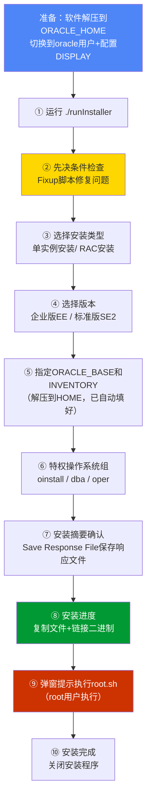

# 2.2 数据库软件安装步骤

Oracle软件安装分两大流派：**GUI图形化安装**（适合新手学习、可视化操作、故障排错直观）和**静默/响应文件安装**（适合自动化脚本化部署、批量服务器、无人值守）。Oracle 19c有一个重大变化：**安装文件解压即ORACLE_HOME**（和11g/12cR1先运行runInstaller再选HOME不同）。

> [!warning] Oracle 19c解压位置
> Oracle 19c安装包LINUX.X64_193000_db_home.zip必须直接解压到**目标ORACLE_HOME目录**，而不是解压到临时目录后再运行安装程序指定HOME。
> 
> 错误：`unzip LINUX.X64_193000_db_home.zip -d /tmp`然后安装时指定HOME
> 正确：`unzip LINUX.X64_193000_db_home.zip -d /u01/app/oracle/product/19.3.0/dbhome_1`

## 图形化GUI安装流程



### 第①步：准备环境与DISPLAY转发

> [!example] Oracle 19c Linux环境
> ```bash
> # 0. 切换oracle用户，所有安装操作必须用oracle用户执行（严禁root安装）
> su - oracle
> 
> # 1. 解压安装包到ORACLE_HOME（关键！19c必须直接解压到HOME）
> unzip /soft/LINUX.X64_193000_db_home.zip -d $ORACLE_HOME
> 
> # 2. 设置DISPLAY变量（图形化必需！）
> # -- 方式A：本机桌面环境直接安装，不需要X转发
> export DISPLAY=:0.0
> # -- 方式B：远程SSH + X11转发，先在SSH客户端Xshell/SecureCRT勾选X11 Forwarding转发
> # ssh -X oracle@服务器IP，然后DISPLAY会自动设置
> export DISPLAY=localhost:10.0
> 
> # 3. 测试DISPLAY是否正常
> xclock
> xeyes
> # 弹出小钟/能弹出窗口说明X11转发正常
> 
> # 4. 进入ORACLE_HOME运行安装程序
> cd $ORACLE_HOME
> ./runInstaller
> ```

> [!danger] 高风险：不要用root用户安装Oracle软件
> 严禁以root身份执行./runInstaller！root用户安装会导致ORACLE_HOME下所有文件权限错误、后续sqlplus启动报错且无法修复。必须全程使用oracle用户。生产严禁root安装后再chown也是错误做法。

### 第②步：先决条件检查 Fixup Script

安装程序会自动检测内核参数、依赖包、内存/磁盘等是否符合要求。如果有FAILED项：
1. **看Check Ignore All（不推荐，强制安装的选项勾忽略全部）：强制安装

**推荐**：勾选Fixup Script修复脚本自动生成。脚本到/tmp/CVU_19.0.0.0.0_oracle/runfixup.sh
```bash
# root执行
sh /tmp/CVU_19.0.0.0.0_oracle/runfixup.sh
```

### 第③-⑥步：关键选项说明

| 安装界面 | 选项 | 推荐选择 | 说明 |
|---|---|---|---|
| 配置安全更新 | 邮箱+My Oracle Support账号 | **不填，取消勾选"我希望通过My Oracle Support接收安全更新" | 学习/内网环境跳过；生产务必填 |
| 安装选项 | 创建并配置数据库 / 仅安装数据库软件 / 升级现有数据库 | **仅安装数据库软件** | 先装软件，再用DBCA单独建库（生产推荐，灵活）；桌面类=一步到位装完+建库 |
| 系统类 | 桌面类 Desktop Class / 服务器类 Server Class | **服务器类** | 生产必选服务器类（高级配置） |
| 版本选择 | 企业版/标准版 | **企业版（学习）/ 按实际授权 | 学习选企业版（功能全） |
| 安装位置 | ORACLE_BASE / ORACLE_HOME | 自动识别（解压在HOME已OK） | 核对无误即可 |
| 操作系统组 | OINSTALL / DBA组 | oinstall / dba | 默认正确 |
| 概要 | 保存响应文件 Save Response File | ✅必须保存到/soft/db_install.rsp | 下次静默安装直接复用 |

### 第⑨步：执行root.sh

安装接近完成时弹出提示执行脚本：

```bash
# 新开一个root窗口执行
sh /u01/app/oraInventory/orainstRoot.sh
sh /u01/app/oracle/product/19.3.0/dbhome_1/root.sh
# 按Enter默认路径一路回车（默认/usr/local/bin
```

> [!note] orainstRoot.sh 作用
> orainstRoot.sh只在服务器首次安装Oracle时执行一次（oraInventory首次初始化oracle首次），后续其他ORACLE_HOME安装只需要执行root.sh。

## 静默安装（Response File方式

> [!definition] 静默安装=无人值守安装。学习GUI服务器/生产自动化必备技能，适合批量部署脚本。使用：


### 静默安装完整示例命令

```bash
# 1. 准备响应文件（或从GUI安装Summary页面Save Response File获取模板。核心参数修改：
cat > /soft/db_install.rsp <<EOF
oracle.install.option=INSTALL_DB_SWONLY
ORACLE_HOSTNAME=db1.example.com
UNIX_GROUP_NAME=oinstall
INVENTORY_LOCATION=/u01/app/oraInventory
SELECTED_LANGUAGES=en,zh_CN
oracle.install.db.InstallEdition=EE
oracle.install.db.OSDBA_GROUP=dba
oracle.install.db.OSOPER_GROUP=oper
oracle.install.db.OSBACKUPDBA_GROUP=dba
oracle.install.db.OSDGDBA_GROUP=dba
oracle.install.db.OSKMDBA_GROUP=dba
oracle.install.db.OSRACDBA_GROUP=dba
EOF

# 2. 执行静默安装（oracle用户，先cd到ORACLE_HOME）
su - oracle
cd /u01/app/oracle/product/19.3.0/dbhome_1
./runInstaller -silent -force -ignorePrereqFailure \
  -responseFile /soft/db_install.rsp \
  -waitForCompletion
# 日志位置：/u01/app/oraInventory/logs/installActions<时间戳>.log

# 3. 安装完成后root执行脚本
sh /u01/app/oraInventory/orainstRoot.sh
sh /u01/app/oracle/product/19.3.0/dbhome_1/root.sh
```

## DBCA创建数据库

软件安装完成后，使用**DBCA（Database Configuration Assistant）创建数据库。

### 图形化DBCA建库步骤

```mermaid
flowchart LR
    START["启动 dbca"] --> MODE["① 选择：创建数据库\n（Advanced Mode高级模式（推荐）"]
    MODE --> TYPE["② 数据库类型\n一般用途/事务处理/数据仓库"]
    TYPE --> NAME["③ 全局数据库名\norcl.example.com\n+ SID=orcl"]
    NAME --> CDB["④ 是否CDB容器数据库\n☑创建为容器数据库\n+ PDB名=PDB1"]
    CDB --> OPT["⑤ 配置选项\n字符集AL32UTF8、内存/连接模式专用服务器"]
    OPT --> STORAGE["⑥ 存储位置\n文件系统/ASM\n数据文件目录 $ORACLE_BASE/oradata/ORCL"]
    STORAGE --> FRA["⑦ 闪回恢复区FRA\n+ 启用归档ARCHIVELOG（生产☑必选"]
    FRA --> SCHEMA["⑧ 初始化参数\nSYS/SYSTEM用户密码\n（生产强密码")]
    SCHEMA --> SUMMARY["⑨ 保存建库脚本\n+ 执行建库"]
    style FRA fill:#C30,color:#fff
```

### DBCA静默建库示例：

```bash
# oracle用户图形化启动：
dbca

# 或静默方式（一行命令建库：
dbca -silent -createDatabase \
  -templateName General_Purpose.dbc \
  -gdbName orcl.example.com \
  -sid orcl \
  -responseFile NO_VALUE \
  -characterSet AL32UTF8 \
  -sysPassword Oracle123 \
  -systemPassword Oracle123 \
  -createAsContainerDatabase true \
  -numberOfPDBs 1 \
  -pdbName pdb1 \
  -pdbAdminPassword Oracle123 \
  -databaseType MULTIPURPOSE \
  -memoryPercentage 60 \
  -emConfiguration DBEXPRESS \
  -storageType FS \
  -datafileDestination /u01/app/oracle/oradata \
  -recoveryAreaDestination /u01/app/oracle/fast_recovery_area \
  -recoveryAreaSize 20480 \
  -archiveLogMode true \
  -redoLogFileSize 512 \
  -ignorePreReqs
```

> [!danger] 字符集选择：AL32UTF8（生产推荐UTF8是Oracle推荐）
> **强烈推荐AL32UTF8是Unicode字符集，支持全球所有语言，存储，避免生僻字中文选ZHS16GBK只能简体中文，但AL32UTF8是标准。生产必须AL32UTF8是原生Unicode字符集推荐，迁移极难转换。

> [!danger] 严禁覆盖安装已有数据库（高风险）
> 生产环境**绝对禁止在生产环境已有数据库服务器上**覆盖安装Oracle到已有ORACLE_HOME或覆盖数据文件！
>
> 典型事故：指定的oradata目录已存在.dbf文件→覆盖→生产数据库立即导致数据丢失、无法恢复。
>
> 安全措施：
> 1. 安装前检查`ps -ef | grep pmon`确保没有其他Oracle进程运行
> 2. 检查`/etc/oratab、检查$ORACLE_BASE/oradata下没有同名数据库实例
> 3. 建议全新安装服务器做好备份
> 4. 新建库选Create as切实例，用DBCA有数据库创建库一定要核对全局数据库名和已有数据库务必唯一

## NETCA配置监听

DBCA建库过程中会自动启动NETCA配置监听，也可以单独运行NETCA配置监听配置监听NETCA（Network Configuration Assistant）：

```bash
# oracle用户启动图形化：
netca

# 图形化步骤：
# ①监听程序配置→添加→LISTENER→TCP→1521→完成

# 启动监听（启动监听配置完毕，查看监听状态：
lsnrctl status
```

> [!example] Oracle 19c 验证安装成果
> ```sql
> # 1. 本地连接
> sqlplus / as sysdba
> 
> -- 查看数据库状态
> SELECT status, instance_name FROM v$instance;
> -- 查看数据库名
> SELECT name, open_mode, cdb FROM v$database;
> -- 查看数据库版本
> SELECT * FROM v$version;
> -- 查看PDB
> show pdbs;
> ```

## 小结

- Oracle 19c解压必须解压到ORACLE_HOME（和11g不同
- GUI安装流程：./runInstaller→预检Fixup→选服务器类/企业版→执行root.sh
- 静默安装：response file + -silent -responseFile脚本自动化批量部署
- DBCA建库：选高级模式→字符集AL32UTF8→CDB/PDB架构→FRA归档模式
- 生产安装四大原则：①用oracle用户不root安装；②严禁覆盖已有数据库；③字符集选AL32UTF8；④归档ARCHIVELOG+FRA

## 关联

- 返回本章MOC：[[MOC - 第2章 Oracle安装与环境配置]]
- 上一节：[[2.1 Oracle软硬件环境要求]]
- 下一节：[[2.3 监听程序、环境变量配置]]
