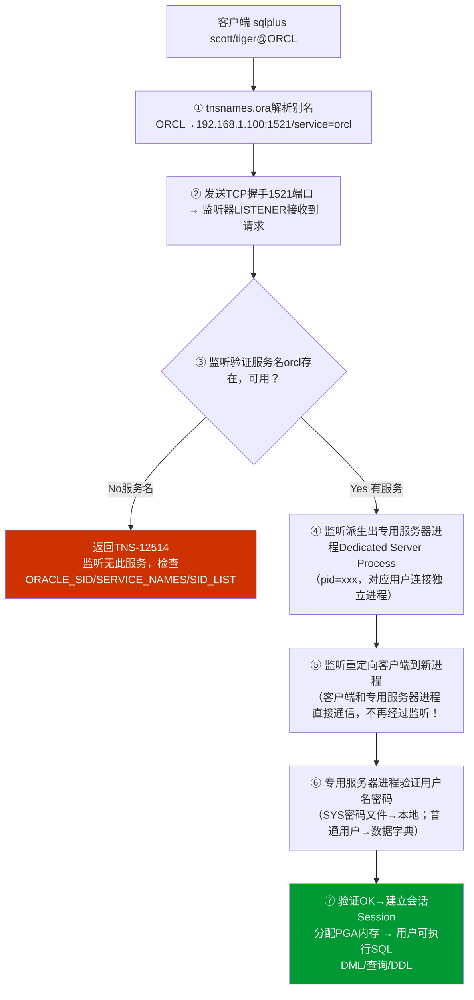

# 2.3 监听程序、环境变量配置

Oracle安装完成后，**监听程序**是远程连接的入口，**环境变量**是操作系统识别Oracle命令的前提，两者配置错误占DBA日常排错的80%以上。本节完整覆盖listener.ora/tnsnames.ora/sqlnet.ora三大网络配置文件、六大环境变量设置、连接诊断三步走。

## 监听LISTENER配置

> [!definition] Listener监听器
> 监听器是运行在Oracle服务器端的独立进程（不属于实例！实例关闭监听仍可运行），默认监听TCP 1521端口，接受远程客户端请求，验证后为客户端派生出专用/共享服务器进程。客户端请求经过监听器后不再经过监听器（重定向后和客户端直接通信！监听只负责建连握手。

### listener.ora服务端配置示例

> [!example] Oracle 19c listener.ora示例
> 路径：$ORACLE_HOME/network/admin/listener.ora
> ```
> # LISTENER.ORA 服务端监听器配置
> 
> # 监听器名称LISTENER（默认名）
> LISTENER =
>   (DESCRIPTION_LIST =
>     (DESCRIPTION =
>       (ADDRESS = (PROTOCOL = TCP)(HOST = db1.example.com)(PORT = 1521))
>       (ADDRESS = (PROTOCOL = IPC)(KEY = EXTPROC1521))
>     )
>   )
> 
> # 静态注册SID（可选，实例未启动时也能识别。动态注册不需要配置，PMON自动注册
> SID_LIST_LISTENER =
>   (SID_LIST =
>     (SID_DESC =
>       (GLOBAL_DBNAME = orcl.example.com)
>       (ORACLE_HOME = /u01/app/oracle/product/19.3.0/dbhome_1)
>       (SID_NAME = orcl)
>     )
>   )
> 
> # 可选：ADR_BASE日志/跟踪目录
> ADR_BASE_LISTENER = /u01/app/oracle
> ```

| 配置项 | 说明 |
|---|---|
| (PROTOCOL = TCP) | 协议：TCP/IP |
| (HOST = db1.example.com) | 监听主机名/IP，生产绑定内网IP避免公网监听，填0.0.0.0有风险 |
| (PORT = 1521) | 默认端口，生产建议修改非默认端口1522等加固 |
| SID_LIST_LISTENER | 静态注册，实例启动前监听也能识别SID；未配置则PMON动态注册（实例启动后1分钟内动态注册完成） |
| GLOBAL_DBNAME | 对外服务名，和SERVICE_NAMES参数一致 |

> [!note] 动态注册 vs 静态注册
> | 类型 | 何时生效 | 适用场景 | 优缺点 |
> |---|---|---|---|
> | **动态注册（默认推荐） | 实例启动后PMON进程自动向监听器注册（LOCAL_LISTENER参数指定） | 常规业务 | 无需手写listener.ora；仅实例运行时才注册；实例重启瞬间客户端会报错TNS-12514 |
> | **静态注册**（配置SID_LIST_xxx） | 监听器启动就识别，实例没启动也能识别 | Data Guard物理备库、安装DBCA阶段、冷备切换等 | 实例NOMOUNT状态就能远程连接（如RMAN恢复场景必备） |

### lsnrctl 管理命令

> [!example] Oracle 19c lsnrctl命令
> ```bash
> # 启动监听（启动LISTENER默认名，需要其他监听加监听名 lsnrctl start LISTENER2
> lsnrctl start
> 
> # 停止监听
> lsnrctl stop
> 
> # 查看监听状态（最常用！）
> lsnrctl status
> 
> # 查看监听详细的服务注册情况（实例/SID/SERVICE_NAME的清单）
> lsnrctl service
> 
> # 重载监听配置（修改listener.ora后重新加载，不中断已连接的用户！）
> lsnrctl reload
> 
> # 查看日志跟踪级别设置
> lsnrctl set log_status on
> 
> # 安全：设置监听器密码（防止远程关闭监听
> lsnrctl change_password
> ```

> [!warning] lsnrctl status输出关键字段
> ```
> Services Summary...
> Service "orcl.example.com" has 1 instance(s).         ← 服务名
>   Instance "orcl", status READY, has 1 handler(s)... ← 实例动态注册成功READY=PMON动态；UNKNOWN=静态注册
> The command completed successfully
> ```
> - status **READY**：动态注册成功（实例已启动，PMON注册
> - status **UNKNOWN**：静态注册（SID_LIST静态写死，监听器不知道实例死活）
> - status **BLOCKED**：实例正启动过程中MOUNT/NOMOUNT阶段
> - 无此服务名：监听器没注册=客户端连接ORA-12514

## tnsnames.ora 网络服务名

> [!definition] tnsnames.ora作用
> tnsnames.ora类似"/etc/hosts"的别名解析文件，将**简短别名（如ORCL）映射为完整连接描述符**（主机:端口:服务名），应用使用别名连接而不用写完整串。

> [!example] Oracle 19c tnsnames.ora示例
> 路径：$ORACLE_HOME/network/admin/tnsnames.ora（客户端和服务器端都可以存在
> ```
> # 别名=ORCL，连接时：sqlplus scott/tiger@ORCL
> ORCL =
>   (DESCRIPTION =
>     (ADDRESS = (PROTOCOL = TCP)(HOST = 192.168.1.100)(PORT = 1521))
>     (CONNECT_DATA =
>       (SERVER = DEDICATED)
>       (SERVICE_NAME = orcl.example.com)
>     )
>   )
> 
> # 带连接时故障转移（多IP，Failover
> ORCL_FAILOVER =
>   (DESCRIPTION_LIST =
>     (FAILOVER = ON)
>     (LOAD_BALANCE = OFF)
>     (DESCRIPTION =
>       (ADDRESS = (PROTOCOL = TCP)(HOST = db1)(PORT = 1521))
>       (CONNECT_DATA =
>         (SERVICE_NAME = orcl.example.com)
>         (FAILOVER_MODE =
>           (TYPE = SELECT)        -- SELECT会话中断后自动重连并重做查询
>           (METHOD = BASIC)       -- 连接时连接，失败后才尝试备用
>           (RETRIES = 180)
>           (DELAY = 5)
>         )
>       )
>     )
>     (DESCRIPTION =
>       (ADDRESS = (PROTOCOL = TCP)(HOST = db2)(PORT = 1521))
>       (CONNECT_DATA =
>         (SERVICE_NAME = orcl.example.com)
>       )
>     )
>   )
> 
> # PDB专用服务名（12c+多租户，连PDB1
> PDB1 =
>   (DESCRIPTION =
>     (ADDRESS = (PROTOCOL = TCP)(HOST = 192.168.1.100)(PORT = 1521))
>     (CONNECT_DATA =
>       (SERVER = DEDICATED)
>       (SERVICE_NAME = pdb1.example.com)
>     )
>   )
> ```

| 参数 | 说明 |
|---|---|
| SERVICE_NAME = orcl.example.com | 推荐：使用服务名连接（RAC/ADG兼容） |
| SID = orcl | 不推荐：仅单实例可用，RAC/ADG不兼容 |
| SERVER = DEDICATED | 专用服务器模式（默认推荐，每个连接独立进程 |
| SERVER = SHARED | 共享服务器模式（高并发连接数，MTS模式，少用） |
| FAILOVER_MODE | TAF透明应用故障转移（RAC/ADG备库切换时应用透明断线重连 |

### tnsping 连接诊断第2步

```bash
# tnsping测试别名能否解析 + 网络能否到达（不需要用户名密码！
tnsping ORCL
tnsping PDB1
tnsping orcl.example.com 10   # 第二个参数=ping次数（默认1次
```

tnsping成功输出：
```
TNS Ping Utility for Linux: Version 19.0.0.0.0 - Production on ...
Used parameter files:
/u01/app/oracle/product/19.3.0/dbhome_1/network/admin/sqlnet.ora
Used TNSNAMES adapter to resolve the alias
Attempting to contact (DESCRIPTION= ... )
OK (10 msec)    ← 10ms，正常！
```

> [!tip] tnsping成功≠数据库能登录
> tnsping只验证**网络**（1.别名解析 2.端口连通 3.监听器有这个服务名注册。不验证实例是否OPEN、不验证用户名密码正确性。tnsping OK但sqlplus报错ORA-01017用户名密码错误/ORA-01033 ORACLE initialization or shutdown in progress是常见情形！

### sqlnet.ora 全局网络参数（可选

sqlnet.ora控制**所有**网络连接的全局参数：
```
# 客户端优先用tnsnames解析别名（顺序：TNSNAMES → EZCONNECT → LDAP
NAMES.DIRECTORY_PATH= (TNSNAMES, EZCONNECT, HOSTNAME)

# 认证服务（OS认证=NTS（Windows），ALL=允许所有
# SQLNET.AUTHENTICATION_SERVICES= (NTS)

# 启用加密（生产可选
# SQLNET.ENCRYPTION_SERVER = required
# SQLNET.ENCRYPTION_TYPES_SERVER = (AES256, AES192, AES128)

# 连接超时（秒，防止挂死
SQLNET.INBOUND_CONNECT_TIMEOUT = 30
SQLNET.OUTBOUND_CONNECT_TIMEOUT = 10
SQLNET.RECV_TIMEOUT = 300
SQLNET.SEND_TIMEOUT = 300
```

## 环境变量配置

Oracle必须配置的**6个环境变量**，写在oracle用户的~/.bash_profile下（Linux/Unix。

> [!example] Oracle 19c .bash_profile完整示例
> ```bash
> # ~oracle/.bash_profile
> 
> # 1. ORACLE_BASE  Oracle产品根目录
> export ORACLE_BASE=/u01/app/oracle
> 
> # 2. ORACLE_HOME  数据库软件目录（关键！$ORACLE_HOME/bin下才是可执行文件
> export ORACLE_HOME=$ORACLE_BASE/product/19.3.0/dbhome_1
> 
> # 3. ORACLE_SID   实例标识符（本地连接用，大写，和实例名一致
> export ORACLE_SID=orcl
> 
> # 4. PATH         加入$ORACLE_HOME/bin，才能直接用sqlplus/lsnrctl
> export PATH=$ORACLE_HOME/bin:$PATH:/usr/local/bin
> 
> # 5. LD_LIBRARY_PATH  Oracle库文件路径（C/Pro*C/OCI程序依赖
> export LD_LIBRARY_PATH=$ORACLE_HOME/lib:/lib:/usr/lib
> 
> # 6. NLS_LANG     客户端字符集+地区（必须和数据库字符集一致，防止乱码
> # 格式：NLS_LANG=<语言>_<地区>.<字符集>
> # 数据库是AL32UTF8（生产推荐）→客户端必须也设AL32UTF8
> export NLS_LANG=AMERICAN_AMERICA.AL32UTF8
> # 中文环境示例：
> # export NLS_LANG=SIMPLIFIED CHINESE_CHINA.AL32UTF8
> 
> # 可选：TNS_ADMIN（tnsnames.ora/listener.ora不在默认路径时指定
> # export TNS_ADMIN=$ORACLE_HOME/network/admin
> 
> # 可选：umask 022（文件创建默认权限
> umask 022
> 
> # 可选：stty终端设置
> stty erase ^h
> 
> # 可选：别名（效率提升
> alias sqlp='sqlplus / as sysdba'
> alias lss='lsnrctl status'
> 
> # 生效：重新登录 或 source ~/.bash_profile
> ```

### 环境变量排错清单

| 症状 | 原因检查 |
|---|---|
| `sqlplus: command not found` | PATH没加$ORACLE_HOME/bin，或ORACLE_HOME没设对，或没source |
| `ORA-12162: TNS:net service name is incorrectly specified`（sqlplus / as sysdba报 | ORACLE_SID没设/设错 |
| `ORA-01034: ORACLE not available ORA-27101: shared memory realm does not exist`（sqlplus /报 | ORACLE_SID错误，实例没启动，ORACLE_HOME/SID不匹配 |
| 登录后查询中文乱码 | NLS_LANG和数据库字符集不一致，查`SELECT * FROM nls_database_parameters WHERE parameter='NLS_CHARACTERSET'` |
| 编译Pro*C/C++/OCI报错找不到libclntsh.so | LD_LIBRARY_PATH没配 |
| 显示$ORACLE_HOME为空 | echo $ORACLE_HOME没输出，检查~/.bash_profile |

> [!example] Oracle 19c 验证环境变量
> ```bash
> # 查看当前全部环境变量
> env | grep -i oracle
> env | grep -i nls
> 
> # 验证PATH：which sqlplus / which lsnrctl 输出$ORACLE_HOME/bin下的可执行
> which sqlplus
> which lsnrctl
> 
> # 验证sqlplus版本
> sqlplus -v
> # 输出：SQL*Plus: Release 19.0.0.0.0 - Production
> ```

## 客户端→监听→服务端 完整通信流程



## 连接诊断三步法

```
lsnrctl status → tnsping 别名 → sqlplus 用户名/密码@别名
```

| 步骤 | 命令 | 验证内容 | 常见错误 |
|---|---|---|---|
| **第1步**：监听状态 | `lsnrctl status` | 监听器进程启动？服务名注册？ | TNS-12541 TNS:no listener（监听没启动 |
| **第2步**：网络解析测试 | `tnsping ORCL` | tnsnames别名解析+IP端口通+服务名在监听 | TNS-03505 Failed to resolve name（别名不存在）<br>TNS-12543 TNS:destination host unreachable（网络不通/防火墙）<br>TNS-12514 TNS:listener does not currently know of service（监听没注册服务） |
| **第3步**：登录验证 | `sqlplus scott/tiger@ORCL` | 实例OPEN、用户名密码正确、权限够 | ORA-01017 invalid username/password（密码错/user=用户名不存在）<br>ORA-01033 ORACLE initialization or shutdown in progress（实例没OPEN在MOUNT）<br>ORA-28000 the account is locked（用户被锁，解锁：`alter user scott account unlock` |

> [!example] Oracle 19c 典型连接测试
> ```bash
> # 本地OS认证连接（不通过监听，SID识别
> sqlplus / as sysdba
> 
> -- 执行SQL查看是否OPEN
> SELECT status FROM v$instance;
> SELECT name, open_mode FROM v$database;
> 
> # 远程连接1：使用tnsnames别名
> sqlplus system/Oracle123@ORCL
> 
> # 远程连接2：Easy Connect 简单连接（不需要tnsnames.ora
> # 格式：用户名/密码@//主机:端口/服务名
> sqlplus hr/Oracle123@//192.168.1.100:1521/orcl.example.com
> 
> # 远程连接3：PDB多租户连接
> sqlplus pdbadmin/Oracle123@PDB1
> ```

> [!danger] 高风险：SYSDBA远程登录安全加固
> `sqlplus sys/Oracle123@ORCL as sysdba`远程登录SYS需要密码文件认证。生产必须：
> 1. 使用强密码：`orapwd file=$ORACLE_HOME/dbs/orapworcl password=StrongP@ssw0rd! entries=10`
> 2. REMOTE_LOGIN_PASSWORDFILE=EXCLUSIVE（默认是）
> 3. 防火墙只允许管理IP段访问1521监听端口
> 4. 定期修改SYS/SYSTEM密码

## 小结

- 监听器：独立进程，默认1521，接收客户端请求派生出专用服务器进程。listener.ora在服务端配置。
- tnsnames.ora：别名解析文件（两端都可有。客户端用别名连接。
- sqlnet.ora：全局网络参数，控制解析顺序、加密、超时。
- 环境变量六件套：ORACLE_BASE、ORACLE_HOME、ORACLE_SID、PATH、LD_LIBRARY_PATH、NLS_LANG，写~/.bash_profile
- 诊断三步法：`lsnrctl status`→`tnsping`→`sqlplus`逐层排查

## 关联

- 返回本章MOC：[[MOC - 第2章 Oracle安装与环境配置]]
- 上一节：[[2.2 数据库软件安装步骤]]
- 下一章：[[MOC - 第3章 Oracle实例与存储结构]]
- 深入学习：[[1.2 Oracle体系结构总览]]
