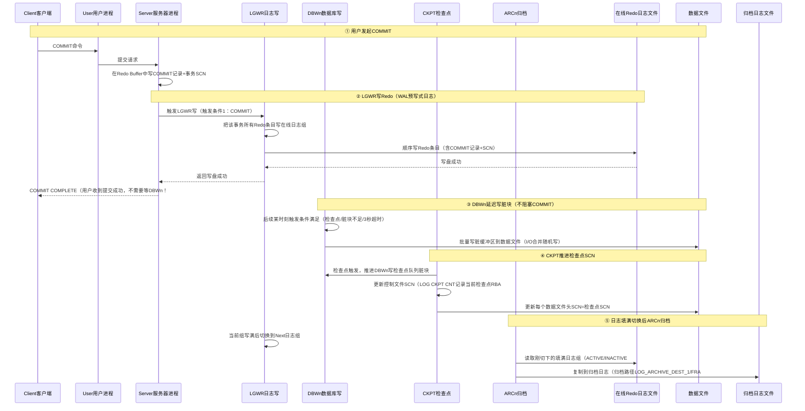

# 3.2 后台进程作用

Oracle实例启动时会启动一系列**后台进程（Background Processes）**，它们是Oracle实例的"工人"，分工负责SGA内存与磁盘物理文件之间的异步I/O操作、异常清理、一致性维护等核心任务。理解每个进程的触发条件和协作关系，是诊断实例Hang、数据丢失、性能瓶颈的必备知识。

> [!tip] 快速查看后台进程
> ```bash
> # Linux下查看Oracle后台进程：
> ps -ef | grep ora_ | grep -v grep
> # 输出形如：
> # ora_pmon_orcl      → PMON进程监控
> # ora_smon_orcl      → SMON系统监控
> # ora_dbw0_orcl      → DBW0数据库写（n=0~n，可多进程
> # ora_lgwr_orcl      → LGWR日志写（唯一，1个！
> # ora_ckpt_orcl      → CKPT检查点
> # ora_arc0_orcl      → ARC0归档进程（ARCHIVELOG模式才启动
> ```

## 六大核心后台进程

| 进程名 | 全称 | 唯一性 | 启动模式 | 核心职责（一句话） |
|---|---|---|---|---|
| **PMON** | Process Monitor | 唯一 | 始终运行 | 进程监控与清理、监听动态注册、用户进程失败善后 |
| **SMON** | System Monitor | 唯一 | 始终运行 | 实例恢复（前滚+回滚）、合并空闲空间、清理临时段 |
| **DBWn** | Database Writer | 多进程（n=0~100+） | 始终运行 | SGA脏缓冲区批量写回数据文件（延迟写I/O合并） |
| **LGWR** | Log Writer | **严格唯一**（只有1个！） | 始终运行 | Redo Buffer写在线重做日志（WAL预写式日志） |
| **CKPT** | Checkpoint Process | 唯一 | 始终运行 | 触发检查点、更新控制文件/数据文件头SCN、触发DBWn |
| **ARCn** | Archiver Process | 多进程（n=0~30） | **仅ARCHIVELOG模式** | 在线日志组填满后，备份到归档日志（保障PITR可恢复） |

> [!note] Oracle专有：LGWR严格唯一
> Oracle的LGWR只有一个，Redo写必须严格串行保证顺序性（Redo按SCN顺序写保证恢复一致性）。LGWR是典型I/O瓶颈（单进程顺序写在线日志），解决方案：①快速SSD放在线日志；②多路复用成员放在不同磁盘分散竞争；③适当增大redo日志组大小减少切换频率。这是Oracle独有的设计。

## PMON 进程监控 Process Monitor

> [!definition] PMON
> PMON=Oracle的"垃圾回收+监听器注册员"，负责清理失败的用户进程/服务器进程，注册实例到监听，维护实例健康状态。

### PMON核心职责
1. **用户进程失败清理**：用户异常断开（Kill -9、网络中断、应用崩溃）→服务器进程成"孤儿进程"→PMON检测到→回滚未提交事务、释放锁（enqueue）、释放SGA资源（Buffer Pin）、清理PGA内存
2. **监听动态注册（Service Registration）**：PMON周期性（默认每1分钟或立即）将INSTANCE_NAME和SERVICE_NAMES注册到本地监听器LOCAL_LISTENER和远程REMOTE_LISTENER
3. **重启可恢复的调度器/共享服务器进程**：共享服务器模式调度器DISPATCHER进程崩溃，PMON重启新的调度器
4. **事务恢复检查**：分布式事务（XA）失败时PMON定期检查恢复悬挂的分布式事务

> [!example] Oracle 19c PMON触发注册
> ```sql
> -- 立即触发PMON重注册到监听（刚改完service_names参数，不用等1分钟自动注册）
> ALTER SYSTEM REGISTER;
> -- lsnrctl status立即看到服务名
> ```

> [!warning] PMON异常
> PMON如果异常终止（极少发生），实例会自动ABORT（PMON是核心进程崩溃=实例崩溃），alert日志会有PMON died的报错。这种情况只能重启实例，alert日志找根因。

## SMON 系统监控 System Monitor

> [!definition] SMON
> SMON=Oracle的"系统大管家"，负责启动阶段的实例恢复、日常空间维护、临时段清理等系统级任务。

### SMON核心职责
1. **⭐实例恢复（Instance Recovery / Crash Recovery）**：实例异常关闭（SHUTDOWN ABORT/断电）后，下次启动OPEN阶段SMON自动执行：
   - **前滚（Rolling Forward/Cache Recovery）**：应用在线Redo Log中所有已记录的变更（包括未提交）前滚到SGA，恢复到崩溃瞬间
   - **回滚（Rolling Back/Transaction Recovery）**：回滚断电时未提交的事务（UNDO段撤销未提交，保证事务ACID）
   - **释放资源**：回滚完成后清理锁
2. **合并空闲空间（Coalesce）**：字典管理DMT表空间中合并相邻空闲Extent减少碎片（LMT本地管理表空间已不需要合并空闲区自动管理
3. **清理临时段（Temporary Segments）**：排序/哈希等临时段使用后清理（如CREATE INDEX失败后临时段清理）
4. **UNDO段OFFLINE回收**：将不再需要的UNDO Extent回收可供重用
5. **回滚OFFLINE表空间事务**：表空间OFFLINE时SMON回滚其中未提交事务

> [!warning] SMON和实例恢复时间
> 大事务崩溃（如批量UPDATE几亿行后ABORT）→下次启动SMON回滚可能耗时**几小时甚至几天**！因此：①不要在高峰执行超大单事务批量操作；②设置FAST_START_MTTR_TARGET控制实例恢复时间（秒级RTO恢复目标，ADDM自动调优检查点频率减少恢复时间

## DBWn 数据库写进程 Database Writer

> [!definition] DBWn
> DBWn=Oracle的"批量写入员"，负责把SGA中DB Buffer Cache的**脏缓冲区（Dirty Buffer，被修改但还没写盘的数据块）**批量写回磁盘数据文件。Oracle通过DBWn**延迟写（Deferred Write）**实现I/O合并，极大提升性能（用户COMMIT不需要等DBWn写盘，LGWR写完就返回。

> [!note] Oracle专有：多DBWn进程
> 为了支撑高并发脏块写盘，Oracle可启动多个DBWn进程（DBW0~DBW9、DBWa~DBWz、BW36~BW99，最多100+个）。参数DB_WRITER_PROCESSES控制，一般设置为CPU数/8或按AWR建议调。单进程写瓶颈→多进程写吞吐量提升。

### DBWn写触发的8大条件

| 触发条件 | 说明 |
|---|---|
| 1. **检查点触发（最主要）** | CKPT进程发信号→DBWn把对应检查点队列上所有脏块写盘 |
| 2. **脏缓冲区数量不足** | 服务器进程要读新块进Buffer Cache→空闲块不够→触发DBWn批量写脏块腾空间 |
| 3. **超时（3秒）** | DBWn每3秒自动检查，有脏块就写少量（避免堆积过多脏块，减少实例恢复时间） |
| 4. **RAC Ping** | RAC集群中另一个节点需要某个脏块→该节点DBWn先把脏块写盘/通过Cache Fusion传过去 |
| 5. **表空间BEGIN BACKUP** | `ALTER TABLESPACE xxx BEGIN BACKUP`→DBWn把该表空间所有脏块写盘（热备开始前保证一致性SCN |
| 6. **表空间OFFLINE NORMAL** | 把该表空间所有脏块写盘后才能OFFLINE |
| 7. **表空间READ ONLY** | 所有脏块写盘后把该表空间置只读 |
| 8. **DROP TABLE/TRUNCATE** | 删除/截断前写对应脏块 |

> [!warning] DBWn和性能瓶颈
> DBWn写慢→典型表现：AWR中**free buffer waits**等待事件排Top1。原因：①DB_WRITER_PROCESSES太少；②数据文件放普通HDD→换SSD/ASM条带化；③SGA太小→脏块刚写不久又读→反复I/O。

## LGWR 日志写进程 Log Writer ⭐⭐⭐⭐⭐

> [!definition] LGWR
> Oracle中**最核心的后台进程（唯一不可替代）**，负责把SGA中Redo Log Buffer的重做条目循环写到在线重做日志文件。LGWR实现了WAL（Write-Ahead Logging预写式日志）：**先写日志，后写数据；提交事务时只需等日志写盘成功就返回，不需要等数据块写盘**。这是Oracle高性能+高可靠性的基石。

> [!note] Oracle专有：Log Writer严格唯一
> LGWR只有1个进程！Redo条目必须按SCN严格顺序写才能保证恢复一致性，不能多进程并行写（会乱序）。LGWR是Oracle最经典的写瓶颈点（LGWR写慢=所有COMMIT都慢）。

### LGWR写触发的5大条件（必考！）

| 序号 | 触发条件 | 说明 |
|---|---|---|
| 1 | **用户COMMIT提交事务**（最主要） | 服务器进程触发LGWR写该事务所有redo+commit记录写盘成功才返回Commit Complete给用户（Log File Sync等待=COMMIT慢） |
| 2 | **每3秒超时** | LGWR每3秒自动唤醒检查，不管有没有提交都写（防止Redo Buffer堆积太久，崩溃丢最多3秒未提交redo |
| 3 | **Redo Log Buffer 1/3满** | Redo Buffer写了1/3容量→立即写（通常1MB阈值=1/3 * 几十MB=几十MB阈值） |
| 4 | **Redo Buffer有≥1MB重做条目** | 即使没到1/3，够1MB也写 |
| 5 | **DBWn写脏块前检查SCN同步** | DBWn要写的脏块对应Redo还没写盘（数据块SCN>Redo写盘SCN）→触发LGWR先写对应的redo到日志→LGWR写完才允许DBWn写数据块（WAL保证！不能有数据块先写盘redo还没写=崩溃丢提交） |

> [!warning] LGWR瓶颈经典等待事件
> AWR报告中Top等待事件出现**log file sync**（用户等COMMIT完成）或**log file parallel write**（LGWR本身写日志慢）：
> - 根因1：在线日志放慢速HDD→移到高速SSD或PCIe卡，顺序写HDD也很慢
> - 根因2：日志组太小切换太频繁→日志组每个2GB以上，切换目标每15-30分钟
> - 根因3：应用过度COMMIT（每行就COMMIT，批量应该批量提交）→改批量COMMIT
> - 根因4：多路复用成员放同一块盘→I/O竞争，成员放不同物理盘

## CKPT 检查点进程 Checkpoint Process

> [!definition] CKPT
> CKPT=Oracle的"SCN同步员"，负责触发检查点（Checkpoint）：①发信号给DBWn把脏块写盘；②更新控制文件和数据文件头的SCN，保证三者一致。检查点是Oracle实例恢复时间的调节器（检查点越频繁→实例恢复越快→I/O越多性能越差，Trade-off）。

### 检查点类型

| 检查点类型 | 触发条件 | 说明 |
|---|---|---|
| **完全检查点 Full Checkpoint** | ALTER SYSTEM CHECKPOINT / ALTER DATABASE BEGIN BACKUP / 正常一致性关库 | 写Buffer Cache所有脏块，更新所有数据文件头SCN+控制文件SCN（I/O大，触发期间系统卡） |
| **增量检查点 Incremental Checkpoint**（默认19c默认自动） | 后台持续，每3秒更新检查点队列→DBWn按RBA进度持续写脏块 | 19c默认增量检查点，写轻量，只推进检查点队列RBA指针，不更新所有数据文件头 |
| **局部检查点 Partial Checkpoint** | ALTER TABLESPACE OFFLINE / BEGIN BACKUP / DROP TABLE / READ ONLY | 只写特定表空间对应脏块 |
| **线程检查点 Thread Checkpoint** | RAC每个实例有独立线程检查点 | RAC多实例各自独立线程检查点 |
| **日志切换检查点** | ALTER SYSTEM SWITCH LOGFILE 日志切换 | 触发完全检查点（切换当前日志组） |

### CKPT核心职责
1. 触发检查点→DBWn把脏块写盘
2. 更新控制文件（记录检查点SCN、RBA地址、检查点时间戳
3. 更新数据文件头（每个数据文件头记录检查点SCN→OPEN启动时SCN一致性检查）

> [!example] Oracle 19c 调优检查点频率
> ```sql
> -- 设置实例恢复目标时间（秒，调优检查点频率最关键参数）
> -- FAST_START_MTTR_TARGET = Mean Time To Recover，目标实例恢复时间
> ALTER SYSTEM SET FAST_START_MTTR_TARGET=300 SCOPE=BOTH;  -- 目标5分钟恢复完成，检查点自动调优
> -- 设0=Oracle自动调（默认0自动调优MTTR
> 
> -- 禁止检查点自动调优（19c默认自动开启
> -- _disable_selftune_checkpointing=TRUE 隐式参数不建议生产
> 
> -- 手动触发完全检查点：
> ALTER SYSTEM CHECKPOINT;
> -- 手动切换日志组（触发线程检查点）：
> ALTER SYSTEM SWITCH LOGFILE;
> ```

## ARCn 归档进程 Archiver

> [!definition] ARCn
> ARCn只在**ARCHIVELOG归档模式**（数据库open归档模式）下启动，NOARCHIVELOG模式下不会有ARCn进程。ARCn负责：在线重做日志组填满被切换后，ARCn把填满的日志组内容复制到归档日志（Archive Log）保存。归档日志是Oracle PITR时间点恢复的基础。

> [!note] Oracle专有：归档多进程ARC0~ARCn
> Oracle支持启动多个归档进程并发归档（ARC0~ARC9、ARCa~ARCt共30个），提高归档吞吐量。参数LOG_ARCHIVE_MAX_PROCESSES控制，默认4个，大事务高峰可设8-16。归档慢会导致LGWR被阻塞（日志组写满还没归档完不能重用→ARCn归档完成=LGWR才能覆盖重用）→阻塞所有COMMIT！

### ARCn核心职责
1. **在线日志切换后归档填满的Redo组**：LGWR切换到下一组→ARCn把刚切换填满的组（ACTIVE/INACTIVE状态）复制到归档目的地（LOG_ARCHIVE_DEST_n，可本地+远程ADG备库最多31个目的地）
2. **多目的地归档**：本地磁盘+FRA闪回恢复区+Data Guard备库同时归档
3. **失败重试**：某目的地归档失败（NFS挂了/磁盘满）→ARCn自动重试ARC1重归档失败的组
4. **Data Guard Log Transport**：ADG场景下ARCn/LNS把Redo传输给备库RFS进程

> [!danger] 高风险：归档空间满
> ARCHIVELOG模式下归档目的地**磁盘满/FRA空间满**→ARCn无法归档→在线日志组全部变ACTIVE→LGWR被阻塞→整个数据库HANG住（无法COMMIT、DML）！
> 生产必须：①监控FRA使用率；②定期备份+删除归档（RMAN DELETE ARCHIVELOG ALL BACKED UP...）；③归档目的地上限设置足够大+告警阈值（80%告警95%紧急
>
> 临时应急：RMAN删除归档+释放空间后数据库自动恢复。

## 六大进程协作流程图

用户提交COMMIT时六大核心进程协作（Oracle事务提交流程）：



> [!warning] Oracle事务提交=Fast-Commit机制
> Oracle专有机制：COMMIT返回给用户的**唯一条件是LGWR把Redo成功写盘**，不管DBWn是否已把脏块写盘。这保证：
> - **已提交事务永不丢失**：只要Redo在磁盘上，崩溃后SMON前滚Redo就恢复所有提交。
> - **极快提交响应**：Redo顺序写比数据块随机写快N倍，COMMIT延迟只跟LGWR写日志速度有关。

> [!example] Oracle 19c 后台进程诊断SQL
> ```sql
> -- 1. 查看实例所有后台进程（PID/SPID/程序名）：
> SELECT p.pid, p.spid OS进程号, p.program, p.username, p.background,
>        s.sid, s.serial#, s.status
> FROM v$process p LEFT JOIN v$session s ON p.addr=s.paddr
> WHERE p.background = 1
> ORDER BY p.program;
> 
> -- 2. 查看LGWR/DBWn/CKPT/ARCn特定进程：
> SELECT program, spid, pid, tracefile
> FROM v$process
> WHERE program LIKE '%(LGWR)%' OR program LIKE '%(DBW%)%'
>    OR program LIKE '%(CKPT)%' OR program LIKE '%(ARC%)%';
> 
> -- 3. 查询归档模式、归档目的地：
> SELECT log_mode, archive_log, force_logging FROM v$database;
> SELECT dest_id, status, destination, archiver, process, error
> FROM v$archive_dest WHERE dest_id <= 10;
> 
> -- 4. 查看Redo日志组切换频率（每小时切几次，目标15-60分钟切一次合理）：
> SELECT to_char(first_time,'YYYY-MM-DD HH24') 小时,
>        COUNT(*) 切换次数
> FROM v$loghist
> WHERE first_time > SYSDATE - 7
> GROUP BY to_char(first_time,'YYYY-MM-DD HH24')
> ORDER BY 小时;
> 
> -- 5. 检查点调优MTTR目标vs实际：
> SELECT recovery_estimated_ios, actual_redo_blks, target_mttr, estimated_mttr
> FROM v$instance_recovery;
> ```

## 小结

- PMON：进程监控+清理+监听动态注册
- SMON：实例恢复（前滚+回滚）+ 空间维护
- DBWn：延迟写脏块到数据文件，8大触发条件
- LGWR：严格唯一！5大触发条件写Redo（WAL），Oracle提交机制核心=LGWR写完就返回COMMIT
- CKPT：检查点触发+SCN同步控制文件/数据文件头，MTTR调优检查点频率
- ARCn：归档模式下ARCn归档在线日志，保障可恢复性
- 协作本质：LGWR先写日志→COMMIT返回；DBWn延迟写；CKPT同步SCN；ARCn备份日志

## 关联

- 返回本章MOC：[[MOC - 第3章 Oracle实例与存储结构]]
- 上一节：[[3.1 内存结构SGA、PGA]]
- 下一节：[[3.3 物理文件：数据文件、控制文件、重做日志]]
- 相关概念：[[1.3 数据库与实例概念区分]]
