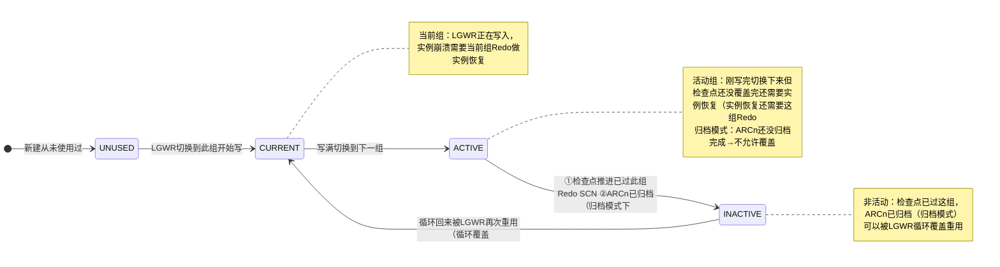

# 3.3 物理文件：数据文件、控制文件、重做日志

数据库=磁盘上的真实存储，是Oracle数据持久化的物理体现。本系统梳理五大核心物理文件：数据文件.dbf、控制文件.ctl、重做日志.log、参数文件SPFILE/PFILE、密码文件、告警日志。每个文件的作用、丢失后果、查询SQL和恢复方案。

## 物理文件全景图

```mermaid
flowchart TB
    subgraph Database["Oracle 数据库=物理文件集合"]
        direction LR
        subgraph Permanent["核心文件（损坏=Database丢失=数据库无法正常打开）
            DF["数据文件 Data Files\n.dbf / +DATA/ASM路径
            系统/SYSAUX/UNDOTBS/TEMP/USERS/业务表空间对应
            永久存储（不丢失后果=表空间对应数据文件
            数据块永久数据
        end
        subgraph ControlFile["控制文件 Control File\n.ctl / +DATA / 小而关键
            数据库元信息=数据库心脏
            多路复用（至少2份
        end
        subgraph RedoFile["重做日志 Online Redo Log Files\n.log / +RECO
            循环复用（至少2组，每组至少2成员
            记录所有变更Redo
        end
        subgraph Other["其他辅助文件"]
            SPFILE["参数文件spfileSID.ora\n二进制参数文件initSID.ora文本参数文件
            PFILE["initSID.ora文本"]
            PwdFile["密码文件orapwSID\nSYSDBA远程认证
            AlertLog["告警日志alertSID.log\n数据库所有重大事件
            Trace["进程跟踪.trc文件"]
        end
    end
    style Permanent fill:#093,color:#fff
    style ControlFile fill:#C30,color:#fff
    style RedoFile fill:#FF8C42,color:#fff
    style Other fill:#777,color:#fff
```

## 一、数据文件 Data Files .dbf

> [!definition] 数据文件
> 数据文件是Oracle数据的**永久存储容器**，每个数据文件属于一个表空间，一个表空间可包含一个或多个数据文件。Oracle块（DB_BLOCK_SIZE默认8KB）是数据文件最小I/O单位。SYSTEM/SYSAUX/UNDOTBS/TEMP/USERS等都是表空间物理对应1-N个.dbf文件。

| 表空间类别 | 典型数据文件 | 典型数据文件命名 | 作用 | 能否删除 | 丢失后果 |
|---|---|---|---|---|---|
| **SYSTEM系统表空间 | system01.dbf | $ORACLE_BASE/oradata/ORCL/system01.dbf | 数据字典（基表（tab$/col$/obj$）、PL/SQL代码、SYSTEM回滚段 | ❌绝对不能删除/脱机 | 丢失数据库直接损坏（无法OPEN | 必须恢复（需要SYSTEM表空间介质恢复（归档+联机备份SYSTEM+控制文件+系统表空间恢复。
| **SYSAUX辅助表空间 | sysaux01.dbf | .../sysaux01.dbf | AWR/ASH/ADDM、OEM、Oracle Text、Data Pump、XDB、LogMiner、Statspack等辅助组件 | ❌也不能删除 | ⚠️ 丢失不会直接OPEN但大部分辅助功能不可用+部分元数据损坏，可单独恢复可重建SYSAUX表空间 |
| **UNDO撤销表空间 | undotbs01.dbf | .../undotbs01.dbf | 存储UNDO数据：回滚未提交、读一致性、闪回查询 | ❌删前切换到新UNDO表空间 | 丢失导致数据库HANG住+读一致性故障+需要介质恢复 |
| **TEMP临时表空间 | temp01.dbf | .../temp01.dbf | 排序/哈希/临时段（会话级临时表，实例重启后自动清空 | ❌默认TEMP需替换 | 丢失可OPEN但排序/哈希连接操作失败（ORA-25153。重建临时文件 |
| **USERS默认用户表空间 | users01.dbf | .../users01.dbf | 新建用户默认表空间 | ⚠️可删（需先迁移用户数据 | 业务用户数据丢失。可恢复备份+归档恢复 |
| **业务数据表空间 | xxx_data01.dbf, xxx_idx01.dbf | /u02/oradata/ORCL/sales_data01.dbf | 用户自定义业务数据/索引分离 | ✅可删除表空间管理 | 仅该表空间数据丢失+可表空间级PITR恢复 |

> [!warning] 小文件vs大文件表空间数据文件
> | 类型 | 每个表空间数据文件数 | 单个文件最大大小 | 适用场景 |
> |---|---|---|---|
> | **Smallfile小文件表空间（默认）** | 最多1022个数据文件/表空间 | 32GB（8KB块时32GB文件大小 = 4M个块×8KB=32GB） | 绝大多数业务场景 |
> | **Bigfile大文件表空间（Oracle专有的** | 只能1个数据文件/表空间 | 8KB块时最大128TB（8EB理论上） | 数据仓库/超大型VLDB，减少管理数据文件数量 |
>
> ```sql
> -- Oracle 19c 创建大文件表空间语法：
> CREATE BIGFILE TABLESPACE big_sales_tbs
> DATAFILE '+DATA' SIZE 10T AUTOEXTEND ON NEXT 10G MAXSIZE UNLIMITED
> EXTENT MANAGEMENT LOCAL AUTOALLOCATE
> SEGMENT SPACE MANAGEMENT AUTO;
> ```

> [!example] Oracle 19c 数据文件SQL查询
> ```sql
> -- 1. 查询所有数据文件基本信息（路径/大小/所属表空间/自动扩展）：
> SELECT file_id, file_name, tablespace_name,
>        bytes/1024/1024 size_mb,
>        maxbytes/1024/1024 maxsize_mb,
>        autoextensible, status, online_status
> FROM dba_data_files
> ORDER BY tablespace_name, file_id;
> 
> -- 2. 查询每个数据文件剩余空间（使用率监控：
> SELECT df.tablespace_name, df.file_name,
>        df.bytes/1024/1024 total_mb,
>        (df.bytes - SUM(NVL(fs.bytes,0))/1024/1024 used_mb,
>        ROUND((df.bytes - SUM(NVL(fs.bytes,0)) / df.bytes * 100, 1) used_pct
> FROM dba_data_files df LEFT JOIN dba_free_space fs
>   ON df.file_id = fs.file_id
> GROUP BY df.tablespace_name, df.file_name, df.bytes
> ORDER BY used_pct DESC;
> 
> -- 3. 新增数据文件扩大表空间：
> ALTER TABLESPACE sales_tbs ADD DATAFILE '/u02/oradata/ORCL/sales02.dbf
> SIZE 10G AUTOEXTEND ON NEXT 500M MAXSIZE 30G;
> 
> -- 4. 数据文件自动扩展开关+调整大小：
> ALTER DATABASE DATAFILE '/u01/.../sales01.dbf AUTOEXTEND ON NEXT 1G MAXSIZE 32G;
> ALTER DATABASE DATAFILE '/u01/.../sales01.dbf RESIZE 25G; -- 扩大数据文件大小
> 
> -- 5. 数据文件OFFLINE/ONLINE（介质恢复前OFFLINE恢复）：
> ALTER DATABASE DATAFILE 5 OFFLINE;
> RECOVER DATAFILE 5;
> ALTER DATABASE DATAFILE 5 ONLINE;
> ```

> [!danger] 高风险：数据文件丢失/损坏处理流程
> | 场景 | 恢复步骤概要 |
> |---|---|
> | **非系统非UNDO/TEMP/USERS业务表空间数据文件.dbf磁盘损坏** | ①数据文件OFFLINE→从备份RESTORE对应表空间数据文件→RECOVER TABLESPACE xxx→ALTER TABLESPACE xxx ONLINE; |
> | **SYSTEM系统表空间文件损坏** | ①实例必须MOUNT状态→RESTORE DATAFILE 1→RECOVER DATABASE→ALTER DATABASE OPEN;（不能OFFLINE SYSTEM表空间不可OFFLINE |
> | **UNDOTBS文件损坏** | ①MOUNT→RESTORE→RECOVER |
> | **TEMP临时文件损坏** | ①OPEN状态下删除TEMPFILE：ALTER DATABASE TEMPFILE '/.../temp01.dbf' DROP INCLUDING DATAFILES; ②新增临时文件：ALTER TABLESPACE temp ADD TEMPFILE '.../temp01.dbf' SIZE 10G; |

## 二、控制文件 Control File .ctl

> [!definition] 控制文件
> Control File是Oracle数据库的**"心脏目录**，小型二进制文件，记录数据库的物理结构元信息**。控制文件多路复用至少3份存不同物理盘。丢失控制文件=无法MOUNT数据库。

### 控制文件核心内容（Oracle专有内容

| 内容分类 | 控制文件中存储的信息 |
|---|---|
| **数据库标识** | DB_NAME数据库名、DBID数据库唯一标识、数据库创建SCN起始 |
| **物理结构清单** | 所有数据文件列表（路径+文件名+文件号+CHECKPOINT SCN+大小
| 所有在线Redo日志组/成员列表（路径+成员号+组号
| 表空间列表及状态 |
| 日志历史** | 所有日志切换历史记录、归档日志信息（SCN范围/状态） |
| 归档日志清单 | 归档日志SCN范围/状态/路径（RMAN备份元数据 |
| 检查点信息 | 当前Checkpoint SCN、Resetlogs SCN/Counter |
| RMAN备份元数据** | 控制文件自动备份、备份集SCN（Catalog不在Catalog时 |
| 闪回日志** | 闪回数据库日志文件列表/范围 |

> [!note] Oracle专有：控制文件多路复用
> Oracle通过SPFILE的`CONTROL_FILES参数控制多路复用。示例：
> ```
> control_files='/disk1/control01.ctl','/disk2/control02.ctl','/disk3/control03.ctl'
> ```
> Oracle更新控制文件时**同步更新全部多路复用文件，只要还有≥1个完好就能正常启动；损坏路径下能启动**。全部损坏就必须CREATE CONTROLFILE重建控制文件（复杂。

> [!example] Oracle 19c 控制文件SQL查询与管理
> ```sql
> -- 1. 查看控制文件位置与状态：
> SELECT name, status, is_recovery_dest_file, block_size, file_size_blks
> FROM v$controlfile;
> 
> -- 2. 查看当前控制文件中记录的关键信息（数据库SCN、检查点进度）：
> SELECT dbid, name, log_mode, checkpoint_change#, current_scn, resetlogs_change#
> FROM v$database;
> 
> -- 3. 备份控制文件（非常重要！备份策略：
> -- 3.1 备份为二进制文件：
> ALTER DATABASE BACKUP CONTROLFILE TO '/backup/control_ORCL_20240101.ctl.bak';
> -- 3.2 备份为TRACE文本SQL脚本（重建控制文件用：
> ALTER DATABASE BACKUP CONTROLFILE TO TRACE AS '/backup/create_control.sql';
> -- 生成的脚本在udump下有create controlfile脚本
> 
> -- 4. 控制文件多路复用增加成员：
> -- 4.1 修改SPFILE参数CONTROL_FILES参数（加新成员路径）
> ALTER SYSTEM SET control_files='/disk1/control01.ctl','/disk2/control02.ctl','/disk3/control03.ctl' SCOPE=SPFILE;
> -- 4.2 关库SHUTDOWN IMMEDIATE
> -- 4.3 OS复制原有控制文件到/disk3/control03.ctl cp原文件到新路径
> -- 4.4 STARTUP启动
> ```

> [!warning] 控制文件备份策略（生产必备）
> 1. **多路复用至少3个控制文件在不同物理磁盘/不同存储控制器
> 2. **每次数据库结构变化（加数据文件/加日志组/加表空间/改归档模式/重命名文件）**必须立即备份控制文件
> 3. 控制文件自动备份开启（RMAN CONFIGURE CONTROLFILE AUTOBACKUP ON;）
> 4. 每周至少备份一次控制文件（二进制+TRACE文本双备份

## 三、重做日志文件 Online Redo Log Files .log

> [!definition] 重做日志=Redo Log
> 循环复用的日志文件，记录所有数据库变更（DML/DDL/DCL的Redo条目，实现实例崩溃后SMON前滚恢复和介质恢复，WAL的存储。核心概念：**日志组（Group）+ 多路复用成员（Member）**

### Redo三大核心特性

| 核心特性 | 说明 | Oracle专有 |
|---|---|---|
| **循环复用 | 至少2组，A组满→切到B组→B满→切回覆盖A | ✅ 专有机制 |
| **多路复用成员** | 每组至少2个Member成员镜像，写同时写成员镜像保护（LGWR同时同组所有Member都失败才会写失败 | ✅ 至少每组至少2成员在不同盘防单点故障 |
| **三种状态CURRENT/ACTIVE/INACTIVE** 三种状态 | ✅ |

### Redo日志组状态流转



| 状态 | 含义 | 能否被覆盖重写 |
|---|---|---|
| **UNUSED | 新建/从未写过 | - |
| **CURRENT** | LGWR当前正在写的组 | ❌绝对不行 |
| **ACTIVE** | 写满刚切换下来；实例崩溃需要实例恢复可能需要这组Redo还需要 | ❌归档模式ARCn没归档完不能覆盖（ARCn归档完且检查点推进后变为INACTIVE |
| **INACTIVE** | 检查点已推进过了，ARCn已归档完成（归档模式） | ✅可以被LGWR循环写满时覆盖重用 |

> [!example] Oracle 19c Redo日志管理SQL
> ```sql
> -- 1. 查询Redo日志组基本信息：
> SELECT group#, thread#, sequence#, bytes/1024/1024 size_mb, members,
>        status, archived, first_change#, first_time
> FROM v$log
> ORDER BY group#;
> 
> -- 2. 查询每个组成员路径：
> SELECT group#, status, type, member, is_recovery_dest_file
> FROM v$logfile
> ORDER BY group#, member;
> 
> -- 3. 新增Redo日志组（每组2成员，生产每组至少2成员：
> ALTER DATABASE ADD LOGFILE GROUP 4 (
>   '/u03/oradata/ORCL/redo04a.log',
>   '/u04/oradata/ORCL/redo04b.log'
> ) SIZE 2G;  -- 生产每个日志组典型大小2G，目标每15-60分钟切换1次合理
> 
> ALTER DATABASE ADD LOGFILE MEMBER '/u04/oradata/ORCL/redo01b.log' TO GROUP 1;
> -- 给已存在组加多路复用成员
> 
> -- 4. 手动切换日志组（测试/清空当前组）：
> ALTER SYSTEM SWITCH LOGFILE;
> -- 触发LGWR切换到下一组。触发检查点推进。5. 清空日志组（介质恢复前清空INACTIVE组：
> ALTER DATABASE CLEAR LOGFILE GROUP 3;
> -- 清除日志组内容（未归档用UNARCHIVED时加UNARCHIVED：
> ALTER DATABASE CLEAR UNARCHIVED LOGFILE GROUP 3;
> 
> -- 6. 删除日志组（必须INACTIVE，不能删CURRENT/ACTIVE！
> ALTER DATABASE DROP LOGFILE GROUP 4;
> -- OS层面rm删掉文件
> ```

> [!warning] 日志切换频率调优（生产关键）
> 推荐每小时切换4-6次=每15-60分钟切换1次（Oracle建议：
> - 太频繁（每2-3分钟切换一次）→性能下降，每次切日志触发CKPT全检查点+ARCn归档压力
> - 太稀疏（半天不切换）→实例恢复时间太长，恢复要读很多Redo
> - 太小的组太小→调大日志组到2G~8G/组
> - LGWR写满快：AWR看log file switch checkpoint not completed等待
> - Redo组数量太少→新增日志组+足够多的组，生产建议最少4组以上

## 四、其他辅助物理文件

### 参数文件 SPFILE/PFILE

> [!definition] 参数文件=Oracle实例启动时读取的配置参数（内存/控制文件位置/进程数等。
> 两种格式，优先读（Oracle 19c默认用SPFILE二进制格式）

| 类型 | 格式 | 路径 | 能否在线修改 | 推荐 |
|---|---|---|---|---|
| **SPFILE（Server Parameter File** | 二进制文件 | `$ORACLE_HOME/dbs/spfile${ORACLE_SID}.ora`（Unix<br>`%ORACLE_HOME%\database\SPFILE%ORACLE_SID%.ora`Windows | ✅ `ALTER SYSTEM SET xxx=yyy SCOPE=SPFILE/BOTH/MEMORY三种范围 | ✅19c生产推荐默认SPFILE |
| **PFILE（Initialization Parameter File）** | 纯文本（initSID.ora | 可读文本 | ❌ 修改文本手动编辑，重启生效 | 紧急恢复场景用（SPFILE损坏时用PFILE启动 |

```sql
-- Oracle 19c 参数文件互转备份：
CREATE PFILE='/backup/initorcl_bak.ora' FROM SPFILE;
CREATE SPFILE FROM PFILE='/backup/initorcl_bak.ora';

-- 修改参数：
ALTER SYSTEM SET SGA_TARGET=10G SCOPE=SPFILE; --SPFILE重启生效（静态参数只能SPFILE
ALTER SYSTEM SET PGA_AGGREGATE_TARGET=4G SCOPE=BOTH;  --BOTH=立即生效+重启保留
ALTER SYSTEM SET SORT_AREA_SIZE=65536 SCOPE=MEMORY;   --MEMORY仅当前实例生效
```

### 密码文件 Password File

> [!definition] 密码文件orapwSID
> 存储具有SYSDBA/SYSOPER/SYSBACKUP等管理权限用户的密码哈希。**远程登录认证（sqlplus sys@tns as sysdba认证**。本地OS认证不需要密码文件。

```bash
# 密码文件创建（Oracle 19c：
# 默认位置$ORACLE_HOME/dbs/orapw${ORACLE_SID}（Unix
orapwd file=$ORACLE_HOME/dbs/orapworcl password=StrongP@ssw0rd entries=10 format=12 force=y ignorecase=n
# entries=最大SYSDBA用户数。force=y覆盖已存在=忽略大小写=12c+格式
```

```sql
-- 1. 查看密码文件中用户（有SYSDBA等权限的用户：
SELECT * FROM v$pwfile_users;

-- 2. 授予/收回SYSDBA：
GRANT SYSDBA TO app_dba;   --写入密码文件
REVOKE SYSDBA FROM app_dba;
```

### 告警日志 Alert Log

> [!definition] 告警日志alertSID.log
> 数据库所有**重大事件文本日志**=DBA排错第一日志**。实例启动/关闭、参数变更、ALTER命令、错误ORA-600/ORA-7445内部错误、死锁、归档、表空间OFFLINE/ONLINE、数据文件损坏、日志文件损坏、备份恢复等等。

```bash
# 19c默认路径（ADR Automatic Diagnostic Repository：
# 19c ADR基路径：
$ORACLE_BASE/diag/rdbms/${DB_NAME}/${ORACLE_SID}/trace/alert_${ORACLE_SID}.log

# 实时看告警日志（最常用
tail -100f $ORACLE_BASE/diag/rdbms/orcl/orcl/trace/alert_orcl.log

# 查询告警日志路径SQL：
SELECT name, value FROM v$diag_info WHERE name IN ('Diag Trace', 'Alert Log');
```

> [!tip] 告警日志查看频率
> 生产每天检查alert日志，或者脚本自动检查alert有无ORA-报错。任何ORA-出现ORA-600（内部错误）、ORA-00600、ORA-7445、ORA-01555快照过旧、ORA-01578数据块损坏、ORA-00257归档程序错误

## 物理文件丢失应急方案汇总

| 文件类型 | 丢失一个多路复用成员 | 全部丢失 | 应急恢复难度 |
|---|---|---|---|
| **数据文件.dbf** | 无多路复用概念（每个文件独立） | RESTORE+RECOVER对应表空间 | 中 |
| **控制文件.ctl** | ✅关库cp好的覆盖→启动 | 重建控制文件CREATE CONTROLFILE或RMAN恢复 | 难/中 |
| **Redo日志.log** | ✅组内还有成员就OK。删坏成员加新成员（组多路复用） | CURRENT组损坏→不完全恢复CANCEL-based恢复 | 极难 |
| **SPFILE参数文件** | 有PFILE备份→CREATE SPFILE FROM PFILE | 无备份→手动写init.ora从alert日志找参数启动重建 | 易 |
| **密码文件** | orapwd重建即可 | orapwd重建 | 极容易 |

## 小结

- **数据文件.dbf**：永久数据存储，表空间→数据文件映射，损坏RESTORE+RECOVER，业务、系统、UNDO损坏等级不同
- **控制文件.ctl**：小而关键的二进制文件，多路复用3份，记录所有元数据结构，备份策略=控制文件+TRACE脚本
- **重做日志.log**：循环复用，至少2组每组2成员，CURRENT/ACTIVE/INACTIVE三状态，调优大小/组数，15-60分钟切换一次合理
- **SPFILE/PFILE**：实例参数，SPFILE二进制优先，PFILE文本恢复；密码文件远程SYSDBA认证；告警日志日常排错入口

## 关联

- 返回本章MOC：[[MOC - 第3章 Oracle实例与存储结构]]
- 上一节：[[3.2 后台进程作用]]
- 下一节：[[3.4 逻辑存储：表空间、段、区、块]]
- 深入学习：备份恢复相关 [[MOC - Oracle备份恢复]]（规划中
