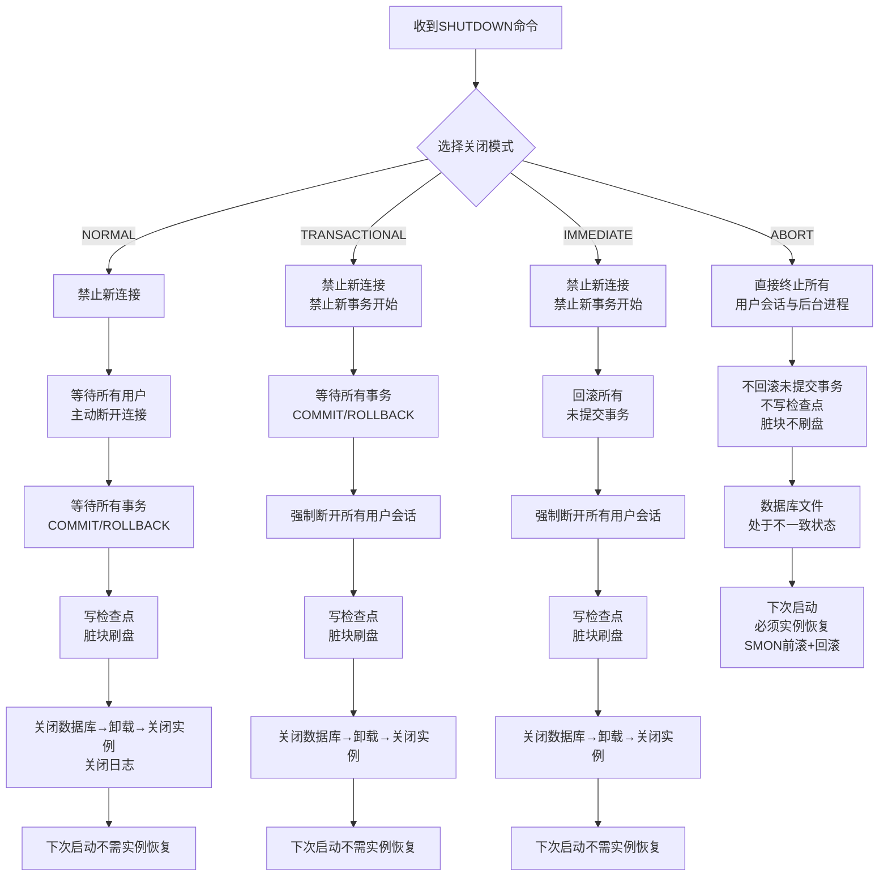

# 4.2 正常关闭、立即关闭、事务关闭、中止关闭

本节解决的核心问题是：**如何安全、高效地关闭Oracle数据库？四种关闭模式在数据一致性、等待时间、对业务的影响上有什么区别？** 选择错误的关闭模式可能导致业务长时间中断或下次启动需要漫长的实例恢复。

## 4.2.1 四种关闭模式总览

> [!definition] SHUTDOWN命令四种模式
> Oracle提供四种关闭模式，从**最干净最慢**到**最快但最暴力**依次为：**NORMAL（默认） → TRANSACTIONAL（事务关闭） → IMMEDIATE（立即关闭） → ABORT（中止关闭）**。核心差异在于：是否允许新连接、是否等待事务提交、是否等待用户断开、是否写检查点、是否需要实例恢复。



## 4.2.2 SHUTDOWN NORMAL（正常关闭，默认）

> [!definition] SHUTDOWN NORMAL
> 最干净但最慢的关闭方式。**不做任何强制操作**，完全等待用户主动退出。是SHUTDOWN不带参数时的**默认模式**。

### 1. 执行步骤

| 步骤 | 动作 | 说明 |
| ---- | ---- | ---- |
| ① | 禁止新的连接请求 | 新用户登录会收到"数据库正在关闭"错误。 |
| ② | 等待所有已连接用户**主动断开** | **只要有一个用户未退出，数据库就一直等待，永不超时！** |
| ③ | 等待所有事务**COMMIT或ROLLBACK** | 即使用户断开，也要确保事务已正常结束。 |
| ④ | 写检查点（Checkpoint） | 将Buffer Cache中所有已提交的脏数据块刷写到数据文件，更新控制文件与数据文件头部SCN，保证关闭后所有文件SCN一致。 |
| ⑤ | 三步骤关闭 | CLOSE DATABASE → DISMOUNT DATABASE → SHUTDOWN INSTANCE。关闭后台进程、释放SGA、关闭告警日志。 |

### 2. 优缺点与使用场景

| 维度 | 说明 |
| ---- | ---- |
| **数据一致性** | ✅ 最完美，所有文件SCN一致，无未提交事务残留。 |
| **等待时间** | ❌ **不确定**，取决于最慢的用户何时断开。可能几小时甚至卡住。 |
| **下次启动** | ✅ 无需实例恢复，启动速度最快。 |
| **对业务影响** | ❌ 必须等所有用户主动退出，运维窗口不可控。 |
| **典型使用场景** | 几乎不用！仅在完全无用户连接的测试/开发库，或准备长期冷备关闭时用。 |

### 3. SQL命令（Oracle 19c）

```sql
-- 正常关闭（默认），效果完全相同
SHUTDOWN NORMAL;
SHUTDOWN;

-- 告警日志alert_SID.log中会记录：
-- Shutting down instance: further logons disabled
-- ... 等待用户断开，看到"All normal sessions disconnected"后才继续 ...
-- SMON: disabling tx recovery
-- SMON: disabling cache recovery
-- Database closed successfully
-- Completed: ALTER DATABASE CLOSE NORMAL
```

> [!warning] SHUTDOWN NORMAL 实际运维中极少使用
> 生产环境几乎不用NORMAL模式——你永远不知道哪个用户开了SQL Developer忘关、哪个应用连接池还保持着连接。正常命令发出后可能**无限等待**，最后只能用SHUTDOWN ABORT强制关闭（反而更糟）。生产优先选**IMMEDIATE**。

---

## 4.2.3 SHUTDOWN TRANSACTIONAL（事务关闭）

> [!definition] SHUTDOWN TRANSACTIONAL
> NORMAL与IMMEDIATE的折衷方案：**不等待用户，但等事务**。适合有长事务批处理、不想中断事务但又不能无限等待用户的场景。

### 1. 执行步骤

| 步骤 | 动作 | 说明 |
| ---- | ---- | ---- |
| ① | 禁止新连接 + 禁止新事务开始 | 新用户无法登录；已连接用户发起新事务会报错。 |
| ② | 等待所有进行中的事务**COMMIT或ROLLBACK** | 只要事务还在执行（比如一个大的UPDATE跑了2小时），就一直等。事务一旦结束，立即断开该会话。 |
| ③ | 所有事务结束后，强制断开所有用户会话 | 不再等用户主动退出。 |
| ④ | 写检查点 | 同NORMAL，刷脏块、更新SCN。 |
| ⑤ | 三步骤关闭 | CLOSE → DISMOUNT → SHUTDOWN。 |

### 2. 优缺点与使用场景

| 维度 | 说明 |
| ---- | ---- |
| **数据一致性** | ✅ 完美，所有正常结束的事务都被提交/回滚，检查点写入。 |
| **等待时间** | ⚠️ 取决于**最长事务**的执行时间。大事务可能等很久。 |
| **下次启动** | ✅ 无需实例恢复。 |
| **对业务影响** | 不中断正在执行的事务，但阻止新事务开始。 |
| **典型使用场景** | 批处理窗口关闭（如夜间银行日终批处理，不想中断正在执行的结算事务）。生产中**偶尔使用**。 |

### 3. SQL命令（Oracle 19c）

```sql
-- 事务关闭
SHUTDOWN TRANSACTIONAL;

-- 告警日志记录：
-- Shutting down instance: further logons disabled
-- ... 等待活动事务结束 ...
-- SHUTDOWN: waiting for active calls to complete.
-- ... 所有事务结束后： ...
-- SMON: disabling tx recovery
-- Database closed successfully
-- Completed: ALTER DATABASE CLOSE NORMAL  -- 注意：关闭动作本身仍标记为NORMAL
```

---

## 4.2.4 SHUTDOWN IMMEDIATE（立即关闭，生产最常用）

> [!definition] SHUTDOWN IMMEDIATE
> 生产环境**最常用**的关闭方式。**不等用户、不等事务**，立即回滚所有未提交事务并断开会话，然后写检查点关闭。兼顾速度与一致性。

### 1. 执行步骤

| 步骤 | 动作 | 说明 |
| ---- | ---- | ---- |
| ① | 禁止新连接 + 禁止新事务开始 | 立即阻止所有新接入。 |
| ② | **回滚所有未提交事务** | Oracle构造回滚段的反向操作，将未COMMIT的修改恢复到事务开始前状态。如果有大量未提交事务（如一个大INSERT回滚），这一步会耗时。 |
| ③ | 强制断开所有用户会话 | 不论用户在做什么，直接Kill会话。 |
| ④ | 写检查点 | 回滚完成后，Buffer Cache中所有已提交脏块刷盘，更新SCN。 |
| ⑤ | 三步骤关闭 | CLOSE → DISMOUNT → SHUTDOWN。 |

### 2. 优缺点与使用场景

| 维度 | 说明 |
| ---- | ---- |
| **数据一致性** | ✅ **一致**。未提交事务被回滚，已提交事务通过检查点持久化。下次启动不需要实例恢复。 |
| **等待时间** | ⚠️ 取决于**未提交事务回滚时间**。通常很快（秒级），但有超大事务回滚时可能很慢（分钟级）。 |
| **下次启动** | ✅ 无需实例恢复。 |
| **对业务影响** | 未提交事务全部丢失（被回滚），用户下次连接需重新操作。但不会造成数据不一致。 |
| **典型使用场景** | **生产环境绝大多数场景**：计划内停机（如打补丁、升级、重启服务器）。是DBA的首选关闭命令。 |

### 3. SQL命令（Oracle 19c）

```sql
-- 立即关闭（生产首选）
SHUTDOWN IMMEDIATE;

-- 告警日志记录：
-- Shutting down instance: further logons disabled
-- Active call for process 12345 user 'HR' program 'sqlplus.exe'
-- SHUTDOWN: waiting for active calls to complete.
-- ... 回滚未提交事务 ...
-- -- 大量回滚日志（如有大事务）
-- SMON: disabling tx recovery
-- Database closed successfully
-- Completed: ALTER DATABASE CLOSE NORMAL
```

> [!tip] SHUTDOWN IMMEDIATE 卡住怎么办？
> 如果IMMEDIATE卡住超过合理时间（如15分钟以上），通常是因为某会话正在执行超大事务的回滚（例如回滚一个插入了1000万行的大表）。此时：
> 1. **耐心等待**——强制ABORT会让下次启动需要更长的实例恢复（且实例恢复无法中断）。
> 2. 可以查询V$TRANSACTION视图查看回滚进度：`SELECT used_ublk, used_urec FROM v$transaction;`（USED_UBLK值持续减少说明回滚在进行）。
> 3. **只有当确认回滚也卡死（长时间USED_UBLK不下降）时**，才被迫使用SHUTDOWN ABORT。

---

## 4.2.5 SHUTDOWN ABORT（中止关闭，最暴力）

> [!definition] SHUTDOWN ABORT
> 最极端的关闭方式。**什么都不等、什么都不做**，直接终止所有进程，相当于模拟断电。**下次启动必须实例恢复**！仅在紧急情况使用。

### 1. 执行步骤

| 步骤 | 动作 | 说明 |
| ---- | ---- | ---- |
| ① | 直接终止所有用户会话与Oracle后台进程 | OS层面相当于Kill -9所有ora_进程。不做任何交互。 |
| ② | **不回滚未提交事务** | 未提交的修改残留在数据文件中（"脏数据"）。 |
| ③ | **不写检查点** | Buffer Cache中已提交的脏块**丢失**（没刷盘），数据文件SCN滞后于控制文件SCN。 |
| ④ | **数据库文件处于不一致状态** | 控制文件SCN ≠ 数据文件头部SCN，且存在未提交事务残留。 |
| ⑤ | **下次启动必须实例恢复** | SMON自动执行：先Redo前滚（从重做日志恢复已提交但未刷盘的修改）→ 再Undo回滚（回滚未提交事务）。 |

### 2. 优缺点与使用场景

| 维度 | 说明 |
| ---- | ---- |
| **数据一致性** | ❌ **关闭时不一致**。下次启动由SMON做实例恢复后才恢复一致。 |
| **等待时间** | ✅ **最快**，几乎瞬间完成（进程秒Kill）。 |
| **下次启动** | ❌ **必须实例恢复**。启动时间取决于重做日志量与回滚段大小，可能从几秒到几十分钟不等。且实例恢复过程**无法中断**。 |
| **对业务影响** | 立即停机。下次启动需要额外恢复时间，业务停机窗口不可控。 |
| **典型使用场景** | **仅紧急情况**：① SHUTDOWN IMMEDIATE卡死且确认回滚也卡死；② 实例挂起（HANG）无法响应任何命令；③ 出现严重错误（如内存损坏、后台进程异常终止）。 |

### 3. SQL命令与实例恢复过程（Oracle 19c）

```sql
-- 中止关闭（仅紧急情况！）
SHUTDOWN ABORT;

-- 告警日志记录（下次启动时自动实例恢复）：
-- Starting ORACLE instance (normal)
-- ... 分配SGA、启动进程 ...
-- Beginning crash recovery of 1 threads
-- Started redo scan      -- 开始前滚：扫描重做日志
-- Completed redo scan
--  24567 redo blocks read, 8901 data blocks need recovery
-- Started recovery at Thread 1: logseq 12345, block 1, scn 9876543210
-- Recovery of Online Redo Log: Thread 1 Group 3 Seq 12345 Reading mem 0
-- Completed redo application of 8901 blocks   -- 前滚完成
-- Completed crash recovery at Thread 1: logseq 12345, block 24567, scn 9876570000
-- Started transactional recovery:    -- 开始回滚未提交事务
--  Rolled back 3 transaction(s) in recovery set     -- 回滚完成
-- Database Characterset is AL32UTF8
-- Opening with internal Resource Manager plan
-- Completed: ALTER DATABASE OPEN
```

> [!danger] SHUTDOWN ABORT 是最后的手段
> 1. **永远不要把ABORT作为常规关闭手段**。生产环境除非其他三种都无法使用，否则绝不走这条路。
> 2. **RAC集群严禁逐个节点ABORT关闭**——RAC节点之间共享数据文件，一个节点ABORT导致的实例恢复可能与其他节点冲突，引发数据文件损坏。RAC关闭要按顺序：先关闭服务（srvctl stop service），再逐个节点正常IMMEDIATE关闭，最后关闭ASM。
> 3. **执行ABORT后，强烈建议立即启动到OPEN状态（让SMON完成实例恢复），再做备份或其他操作**。不要让数据库长期停留在"关闭但不一致"的状态。

---

## 4.2.6 四种关闭模式对比总表

| 对比项 | SHUTDOWN NORMAL | SHUTDOWN TRANSACTIONAL | SHUTDOWN IMMEDIATE | SHUTDOWN ABORT |
| ---- | ---- | ---- | ---- | ---- |
| **允许新连接** | ❌ 禁止 | ❌ 禁止 | ❌ 禁止 | ❌ 直接终止 |
| **允许新事务** | ✅ 到用户断开为止 | ❌ 禁止 | ❌ 禁止 | ❌ 直接终止 |
| **等待事务提交** | ✅ 等全部 | ✅ 等进行中的 | ❌ 回滚未提交 | ❌ 不处理 |
| **等待用户主动断开** | ✅ 等全部 | ❌ 事务完就断 | ❌ 直接断 | ❌ 直接断 |
| **写检查点（刷脏块）** | ✅ 写 | ✅ 写 | ✅ 写 | ❌ 不写 |
| **未提交事务处理** | 用户提交/回滚后完成 | 等待提交/回滚 | 立即回滚 | 遗留到下次启动回滚 |
| **下次启动需实例恢复** | ❌ 不需要 | ❌ 不需要 | ❌ 不需要 | ✅ **必须**（SMON自动前滚+回滚） |
| **关闭速度** | ❌ 最慢（不确定） | ⚠️ 中（取决于最长事务） | ⚠️ 中快（取决于回滚量） | ✅ 最快（秒级） |
| **数据一致性风险** | ✅ 无 | ✅ 无 | ✅ 无 | ⚠️ 关闭时不一致，启动恢复后一致 |
| **生产使用频率** | 几乎不用 | 偶尔（批处理） | **最常用** | 仅紧急情况 |
| **等价效果** | 正常应用退出 | 批处理优雅停机 | 业务计划内停机 | **模拟断电** |

> [!note] Oracle专有概念：实例恢复（Instance Recovery / Crash Recovery）
> 实例恢复是Oracle的**自动机制**，由SMON后台进程在OPEN阶段之前自动执行，DBA无需干预。分两步：
> 1. **Cache Recovery（前滚 / Rolling Forward）**：从在线重做日志中读取已COMMIT但未写入数据文件的重做记录，把它们重新应用到数据文件，恢复Buffer Cache丢失的脏块。
> 2. **Transaction Recovery（回滚 / Rolling Back）**：前滚完成后，数据库OPEN（此时用户可登录查询），SMON在后台继续回滚ABORT时未提交的事务。对用户来说，已回滚和未回滚的块都能正确访问——Oracle通过回滚段提供一致性读。

---

## 小结

本节对比了四种SHUTDOWN关闭模式的执行流程、一致性保证、速度差异与使用场景。**生产环境优先用SHUTDOWN IMMEDIATE**——它既保证关闭后数据库一致、下次启动不需实例恢复，又不需要无限等待用户。SHUTDOWN ABORT是最后的手段，仅在紧急情况使用；它等价于断电，会触发下次启动时SMON自动执行"前滚+回滚"的实例恢复过程。

## 关联

- 上一级：[[MOC - 第4章]]
- 上一节：[[4.1 数据库四种启动模式]]
- 下一节：[[4.3 启动故障简单排查]]
- 相关概念：[[MOC - 第3章 Oracle实例与存储结构]]（SMON后台进程、回滚段、检查点CKPT）、[[MOC - 第7章 Oracle重做日志、归档模式]]（重做日志用于前滚）、[[MOC - 第8章 Oracle备份与恢复]]（实例恢复与介质恢复的区别）
