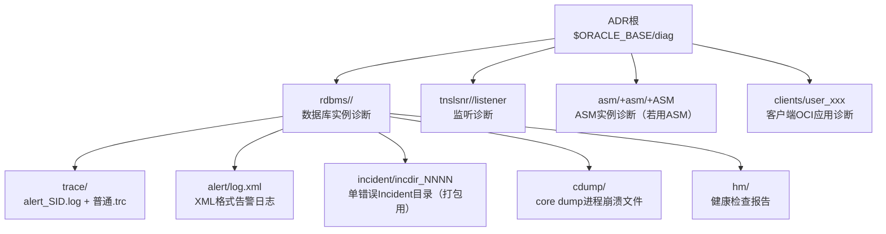

# 4.5 告警日志、跟踪文件与ADR自动诊断库

本节解决的核心问题是：**Oracle数据库出现异常时，去哪里找日志？告警日志、跟踪文件、ADR分别是什么？如何利用诊断文件快速定位问题？** 日志与诊断文件是DBA排查故障的第一手资料，掌握正确的查看方法至关重要。

## 4.5.1 告警日志（Alert Log）

> [!definition] 告警日志（Alert Log，alert_<SID>.log）
> Oracle数据库最重要的**系统级日志文件**，按时间顺序记录数据库与实例的关键操作、错误信息与状态变更。它是DBA排查任何问题的**第一入口**。

### 1. 告警日志记录的内容

| 类别 | 具体内容 |
| ---- | ---- |
| **生命周期事件** | 每次STARTUP、SHUTDOWN的完整过程（包括开始时间、每个阶段完成时间） |
| **参数变更** | ALTER SYSTEM SET修改系统参数的操作记录（含修改前后值、修改用户、修改时间） |
| **结构变更** | CREATE DATABASE、CREATE/ALTER/DROP TABLESPACE、ADD DATAFILE/REDO等DDL |
| **归档日志事件** | 每次日志切换（ALTER SYSTEM SWITCH LOGFILE）、归档成功/失败信息 |
| **检查点与恢复** | 检查点开始/完成时间、实例恢复/介质恢复开始与完成信息 |
| **后台进程错误** | SMON、PMON、DBWn、LGWR、CKPT、ARCH等后台进程的报错 |
| **ORA-错误** | 绝大多数ORA-严重错误（注意：普通用户的ORA-00942表不存在等业务错误不记录） |
| **作业与调度** | DBMS_JOB、DBMS_SCHEDULER作业的启动与异常 |
| **ORA-600/ORA-7445/ORA-00600** | Oracle内部错误（Internal Error，必查！），会附带trace文件路径 |

> [!note] 内部错误：ORA-00600 / ORA-07445 / ORA-03113
> - **ORA-00600**：Oracle内核代码的通用内部错误，参数值指向代码中不同的断言位置，通常是Oracle Bug或数据损坏，需要配合附带的trc文件分析。
> - **ORA-07445**：操作系统级的异常（如段错误SIGSEGV），通常对应Oracle进程崩溃，会生成core dump文件。
> - **ORA-03113**：通信通道文件结束，通常意味着服务器端进程异常终止，导致连接断开。
>
> 这三类错误**必须看告警日志附带的跟踪文件路径**，并配合Oracle MOS（My Oracle Support）搜索错误号与第一参数判断解决方案。

### 2. 告警日志路径与定位方法（Oracle 19c）

```sql
-- 方法一：V$DIAG_INFO视图（11g+推荐，最准确）
SELECT name, value FROM v$diag_info;
-- 关键两行：
-- Diag Trace  → 告警日志与普通跟踪文件所在目录
-- Alert log   → 告警日志alert_SID.log的完整路径

-- 方法二：show parameter background_dump_dest（旧版兼容）
-- 11g+ 这个参数已被ADR替代，但仍能查询
SHOW PARAMETER background_dump_dest;
```

```bash
# 典型ADR路径（Oracle 11g~19c，默认）
# $ORACLE_BASE/diag/rdbms/<数据库名，小写>/<实例名，通常大写>/
#
# 例如：ORACLE_BASE=/u01/app/oracle，DB_NAME=orcl，SID=ORCL
/u01/app/oracle/diag/rdbms/orcl/orcl/
├── alert/                 # XML格式告警日志（log.xml）
│   └── log.xml
├── cdump/                 # Core dump文件（进程崩溃时生成）
├── hm/                    # Health Monitor健康检查报告
├── incident/              # 严重错误的Incident目录（每个ORA-600/7445一个子目录含trc）
├── ir/                    # Incident报告
├── trace/                 # 文本格式告警日志+普通用户/后台进程trc文件
│   ├── alert_orcl.log     # ★ 我们最常看的文本告警日志在这里！
│   ├── orcl_lgwr_12345.trc
│   ├── orcl_smon_23456.trc
│   └── orcl_ora_34567.trc
└── metadata/
```

### 3. 告警日志日常查看命令（Linux）

```bash
# 0. 先设置环境变量找到文件
export SID=orcl
export ALERT_LOG=$ORACLE_BASE/diag/rdbms/orcl/$SID/trace/alert_$SID.log

# 1. 实时查看尾部（最常用，等于tail -f）
tail -f $ALERT_LOG
# 配合grep只看错误
tail -f $ALERT_LOG | grep -E "ORA-|Error|Completed:|ALTER"

# 2. 看最后200行（快速看最近发生了什么）
tail -n 200 $ALERT_LOG

# 3. 搜索所有ORA错误
grep "ORA-" $ALERT_LOG | head -50

# 4. 看今天启动/关闭记录（配合grep搜索关键词）
grep -E "Starting ORACLE instance|Shutting down instance|Database opened|Database closed" $ALERT_LOG

# 5. 看大日志时用less，支持搜索与翻页
less $ALERT_LOG
# 在less中输入/ORA-搜索错误，n/N上下跳转
```

> [!warning] 告警日志文件管理
> - 告警日志**不会自动循环或截断**，会一直增长直到占满磁盘（尤其是DML密集的库，几年不处理可能到几十GB）。
> - **清理方法**：业务低峰期截断或删除旧日志（Oracle会在下次写入时自动创建新文件）
>   ```bash
>   # 方法一：截断为0（瞬间完成，推荐）
>   > $ALERT_LOG
>   # 方法二：保留前N行后压缩归档（保留历史）
>   tail -n 10000 $ALERT_LOG > $ALERT_LOG.new
>   mv $ALERT_LOG $ALERT_LOG.20240101 && gzip $ALERT_LOG.20240101
>   mv $ALERT_LOG.new $ALERT_LOG
>   ```
> - 12c+ ADRCI工具可自动清理：`adrci> purge -age 1440`（保留24小时，7*24=1440分钟）

---

## 4.5.2 跟踪文件（Trace Files，.trc）

> [!definition] 跟踪文件（.trc文件）
> 单个Oracle进程（后台进程或用户服务器进程）生成的**进程级诊断文件**。当某个进程出现错误、或者DBA手动开启SQL追踪时，会把该进程的详细执行信息（SQL执行计划、绑定变量值、等待事件、错误堆栈）写入对应的.trc文件。

### 1. 跟踪文件分类

| 类型 | 命名规则 | 生成时机 | 典型用途 |
| ---- | ---- | ---- | ---- |
| **后台进程跟踪文件** | `<SID>_<进程名>_<OS_PID>.trc`<br/>如：orcl_smon_12345.trc | 后台进程出错、被手动跟踪 | 排查SMON/PMON/LGWR/DBWn异常 |
| **用户服务器进程跟踪文件** | `<SID>_ora_<OS_PID>.trc`<br/>如：orcl_ora_34567.trc | 用户进程出错、SQL Trace开启 | 排查单个会话的性能、ORA错误 |
| **核心转储文件（Core Dump）** | core_<PID> 或s<进程名>.core | 进程崩溃（ORA-07445段错误） | 配合Oracle Support分析内核崩溃 |

### 2. 手动开启SQL Trace跟踪

> [!example] 常见Trace开启场景
> - 某个SQL特别慢，想看完整执行计划与等待事件
> - ORA错误复现不规律，想记录出错时的完整上下文
> - 应用侧报错但数据库侧看不到具体SQL

```sql
-- === 方法一：跟踪自己当前会话 ===
-- 开启会话级SQL Trace（不包含等待事件与绑定变量）
ALTER SESSION SET sql_trace=TRUE;
-- 执行你的SQL...
SELECT ... FROM ... WHERE ...;
-- 关闭Trace
ALTER SESSION SET sql_trace=FALSE;

-- 10046事件（推荐，DBA最常用，级别4/8/12）
-- level 4 = 包含绑定变量值
-- level 8 = 包含等待事件
-- level 12 = 绑定变量 + 等待事件（最详细）
ALTER SESSION SET EVENTS '10046 trace name context forever, level 12';
-- 执行SQL...
ALTER SESSION SET EVENTS '10046 trace name context off';
```

```sql
-- === 方法二：跟踪其他用户的会话（需知道SID,SERIAL#）===
-- 第一步：查询要跟踪的会话
SELECT s.sid, s.serial#, s.username, s.program, p.spid os_pid
  FROM v$session s, v$process p
 WHERE s.paddr = p.addr
   AND s.username='HR';

-- 第二步：用DBMS_MONITOR包开启（10g+推荐）
EXEC DBMS_MONITOR.SESSION_TRACE_ENABLE(
  session_id   => 123,        -- SID
  serial_num   => 45678,      -- SERIAL#
  waits        => TRUE,       -- 包含等待事件
  binds        => TRUE        -- 包含绑定变量
);
-- 会话执行一段时间后...
EXEC DBMS_MONITOR.SESSION_TRACE_DISABLE(session_id => 123, serial_num => 45678);

-- 或者用 oradebug （命令行工具，更底层）
-- 用OS PID跟踪：
-- oradebug setospid <spid>;
-- oradebug unlimit;          -- 取消trc文件大小限制
-- oradebug event 10046 trace name context forever, level 12;
-- ... 等待业务执行 ...
-- oradebug event 10046 trace name context off;
-- oradebug tracefile_name;   -- 查看生成的trc路径
```

### 3. tkprof工具：格式化.trc文件

直接打开.trc文件会看到大量原始输出，难以阅读。Oracle提供**tkprof**工具把原始trc转换为人类可读的汇总报告。

```bash
# 1. 找到生成的trc文件路径
# 如果是自己会话开的，可用SQL查：
SELECT value FROM v$diag_info WHERE name = 'Default Trace File';

# 2. 用tkprof格式化
tkprof /u01/.../trace/orcl_ora_34567.trc \
       /u01/backup/report_34567.txt \
       explain=hr/hrpassword \          -- 附带来源用户的执行计划
       sort=exeela,prsela,fchela \      -- 按执行、解析、提取时间排序
       sys=no \                         -- 不显示SYS递归SQL
       waits=yes \                      -- 显示等待事件
       record=record.lst                -- 单独列出绑定变量值

# 3. 打开report_34567.txt，重点看：
# - 每个SQL的总耗时（CPU / Elapsed）
# - 执行计划（Rows / Bytes / Cost）
# - 等待事件细分（db file sequential read等）
```

---

## 4.5.3 ADR自动诊断库（Automatic Diagnostic Repository）

> [!definition] ADR自动诊断库
> Oracle 11g引入的**统一诊断数据管理框架**。把以前散落在各个`_dump_dest`目录的告警日志、跟踪文件、core dump、Incident错误等统一集中到`$ORACLE_BASE/diag`目录下，并提供了一套命令行工具ADRCI来管理与打包诊断数据。

### 1. ADR目录结构总览



### 2. ADRCI命令行工具使用

ADRCI（ADR Command Interface）是Oracle自带的诊断管理工具，无需登录数据库即可使用，常用于上传诊断数据给Oracle Support。

```bash
# 启动ADRCI（无需用户名密码，直接在OS下执行）
adrci

# ========= 常用交互命令 =========
adrci> SHOW BASE;                              -- 显示ADR根目录
adrci> SHOW HOMES;                             -- 列出当前机器所有ADR Home（实例+监听+ASM）
adrci> SET HOMEPATH diag/rdbms/orcl/orcl;      -- 设置当前ADR Home为指定实例
adrci> SHOW ALERT -TAIL 50;                    -- 看告警日志最后50行（等同tail -n 50）
adrci> SHOW ALERT -TAIL;                       -- 实时跟随告警日志（等同tail -f）
adrci> SHOW ALERT -P "MESSAGE_TEXT LIKE '%ORA-%'";  -- 过滤只看含ORA的告警行
adrci> SHOW INCIDENT;                          -- 列出当前所有严重错误Incident（ORA-600/7445等）
adrci> SHOW PROBLEM;                           -- 汇总去重后的问题列表
adrci> PURGE -AGE 1440;                        -- 删除24小时（1440分钟）前的旧诊断数据（日志轮转）

# ========= 打包诊断数据上传MOS =========
adrci> SET HOMEPATH diag/rdbms/orcl/orcl;
adrci> IPS CREATE PACKAGE INCIDENT 12345;      -- 针对某个Incident创建打包
adrci> IPS GENERATE PACKAGE 1 IN /tmp;         -- 把包1生成到/tmp目录，得到.zip
-- 将.zip上传到MOS（My Oracle Support）服务请求SR，供Oracle工程师分析
```

> [!tip] 健康检查（Health Monitor，HM）
> 11g+ HM可以主动检查数据库各种组件的健康状态：
> ```sql
> -- 查看所有HM检查项
> SELECT name, description FROM v$hm_check WHERE internal_check='N';
> -- 手动执行一次数据字典完整性检查
> VAR run_id NUMBER;
> EXEC DBMS_HM.RUN_CHECK('Dictionary Integrity Check', 'dic_check_20240101', :run_id);
> PRINT :run_id
> -- ADRCI查看报告：
> adrci> SHOW HM RUN -R dic_check_20240101;
> ```

---

## 小结

本节详述了Oracle诊断体系的三大组成：**告警日志alert_SID.log**（系统级关键事件总入口）、**跟踪文件.trc**（进程级详细诊断，配合tkprof分析SQL性能）、**ADR自动诊断库**（11g+统一管理+ADRCI工具打包）。掌握V$DIAG_INFO定位文件路径、`tail -f`/`grep`日常查日志、10046事件+tkprof分析慢SQL、ADRCI打包Incident上传MOS，是DBA故障排查的必备技能。

## 关联

- 上一级：[[MOC - 第4章]]
- 上一节：[[4.4 参数文件SPFILE与PFILE详解]]
- 本章习题：[[MOC - 第4章习题]]
- 相关概念：[[4.3 启动故障简单排查]]（7类故障均需告警日志定位）、[[MOC - 第10章 性能监控与基础优化]]（SQL Trace与tkprof用于性能分析）
