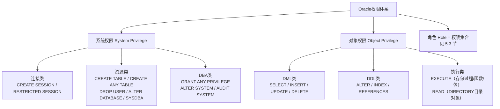

# 5.2 系统权限、对象权限

本节解决的核心问题是：**Oracle有哪两类权限？GRANT/REVOKE授予回收的规则有什么区别？SYSDBA和SYSOPER到底有什么权限？WITH ADMIN OPTION和WITH GRANT OPTION在回收时为什么行为不同？** 权限管理是数据库安全的核心，授权过松会被滥用，授权过严会影响业务。

## 5.2.1 权限（Privilege）两类总览

> [!definition] 权限（Privilege）
> 权限是用户执行特定SQL或访问特定对象的**许可**。Oracle将权限严格分为两大类：
> - **系统权限（System Privilege）**：数据库级操作的许可，如"能否连接数据库"、"能否在任意Schema建表"。权限范围广、风险高，授予需谨慎。
> - **对象权限（Object Privilege）**：对**具体Schema中具体对象**的操作许可，如"能否SELECT HR.EMPLOYEES表"、"能否UPDATE SCOTT.DEPT"。粒度细，风险可控。



---

## 5.2.2 系统权限（System Privilege）

> [!definition] 系统权限
> 对整个数据库级别的操作许可，与具体对象无关。Oracle 19c有超过200种系统权限，命名规则：`CREATE/ALTER/DROP/UNDER/ADMINISTER ... ANY ...`表示跨任意Schema的权限。

### 1. 最常用系统权限清单（DBA必掌握）

| 系统权限 | 作用 | 风险等级 | 典型授予对象 |
| ---- | ---- | ---- | ---- |
| **CREATE SESSION** | 连接数据库的最基本权限（没有这个登录都登不上） | 低 | 所有业务用户必授 |
| **RESTRICTED SESSION** | 在RESTRICT模式（STARTUP RESTRICT）下仍能登录 | 中 | DBA |
| **CREATE TABLE** | 在**自己的Schema**中创建/修改/删除表、索引 | 低 | 业务开发用户 |
| **CREATE ANY TABLE** | 在**任意Schema**（除SYS）中建表 | **高**（越权写他人数据） | 慎重授予 |
| **ALTER ANY TABLE** | 修改任意Schema的表结构 | **高** | DBA专用 |
| **DROP ANY TABLE** | 删除任意Schema的表 | **极高** | 严禁给普通用户 |
| **CREATE VIEW / CREATE SEQUENCE / CREATE PROCEDURE / CREATE TRIGGER** | 在自己Schema中创建对应对象 | 低 | 开发用户按需给 |
| **CREATE USER / ALTER USER / DROP USER** | 用户管理权限 | **高** | DBA专用 |
| **ALTER SYSTEM** | 修改实例参数、KILL会话、SWITCH LOGFILE等动态调整 | **极高** | DBA专用 |
| **ALTER DATABASE** | 数据文件操作、切换归档、OPEN MOUNT等 | **极高** | DBA专用 |
| **GRANT ANY PRIVILEGE / GRANT ANY ROLE** | 能把**任意系统权限/角色**授予别人（等于超级DBA） | **极高** | 严禁给普通用户 |
| **UNLIMITED TABLESPACE** | 无视所有表空间QUOTA限制，相当于任意表空间不限配额 | 中 | 大表应用用户 |
| **SYSDBA** | 超级管理员权限集合（见下表详述） | **极高** | 仅SYS和极少数核心DBA |
| **SYSOPER** | 运维管理员权限集合（启动关闭/备份恢复基础） | 高 | 二线运维 |

> [!warning] ANY 关键字 = 跨任意Schema权限！
> 授`DROP ANY TABLE`给普通用户 = 赋予他删库里所有业务表的能力。任何带`ANY`的系统权限在生产环境授予前必须三审：业务是否真需要、是否能改成对象权限替代、能否用存储过程封装最小权限。

### 2. GRANT授予系统权限语法

> [!definition] GRANT 系统权限语法
> ```sql
> GRANT 权限名 [, 权限名2, ...] TO { 用户 | 角色 | PUBLIC }
>   [WITH ADMIN OPTION];
> ```
> - **WITH ADMIN OPTION**：被授予者**可以再把该系统权限授予别人**。只建议给DBA角色的管理账户。

### 3. 完整GRANT示例（Oracle 19c）

```sql
-- ================ 1. 给新用户最基本权限 ================
GRANT CREATE SESSION TO new_user;                    -- 能登录就够了（只读用户）

-- ================ 2. 给开发用户创建对象的权限 ================
GRANT CREATE SESSION,
      CREATE TABLE,                                   -- 自己Schema里建表
      CREATE VIEW,                                    -- 建视图
      CREATE SEQUENCE,                                -- 建序列
      CREATE PROCEDURE,                               -- 建存储过程/函数/包
      CREATE TRIGGER,                                 -- 建触发器
      CREATE SYNONYM                                  -- 建同义词（自己的）
  TO dev_user;

-- 别忘了还要给表空间配额，否则CREATE TABLE会因QUOTA=0报错
ALTER USER dev_user QUOTA UNLIMITED ON users;
-- 或者干脆授予不限配额（省事但风险略高，推荐上面按表空间精控）
GRANT UNLIMITED TABLESPACE TO dev_user;

-- ================ 3. WITH ADMIN OPTION：被授权者可再转授 ================
GRANT CREATE USER, DROP USER TO dba_team WITH ADMIN OPTION;
-- 现在dba_team用户可以执行：GRANT CREATE USER TO 别人;

-- ================ 4. 给PUBLIC所有人（慎用！相当于开全库权限） ================
GRANT CREATE SESSION TO PUBLIC;                      -- 所有用户（含未来新建的）都能登录
-- 不推荐！生产通常只给具体角色或用户。
```

### 4. REVOKE回收系统权限：关键是**不级联！**

> [!danger] 系统权限回收不级联（核心考点！）
> A 授予 B（WITH ADMIN OPTION），B 授予 C。DBA 从 A 回收权限时，**B 和 C 的权限都不受影响，仍保留**。Oracle不自动追踪系统权限的授予链。

```sql
-- 示例：
-- SYS执行：
GRANT CREATE TABLE TO a WITH ADMIN OPTION;       -- A有，可转授
-- A登录后执行：
GRANT CREATE TABLE TO b WITH ADMIN OPTION;       -- A→B
-- B登录后执行：
GRANT CREATE TABLE TO c;                          -- B→C

-- SYS现在执行：
REVOKE CREATE TABLE FROM a;
-- 结果：A没了，但是 B 和 C 的 CREATE TABLE 权限还在！
-- 必须显式从B、C各自REVOKE才能真正全部收回。
```

```sql
-- REVOKE系统权限语法
REVOKE CREATE TABLE, CREATE VIEW FROM dev_user;
REVOKE UNLIMITED TABLESPACE FROM old_user;
```

---

## 5.2.3 对象权限（Object Privilege）

> [!definition] 对象权限
> 对**某个具体Schema中的具体对象**的操作许可。粒度比系统权限细得多，是最小权限原则的基础。命名格式：`权限名 ON [schema.]对象名`。

### 1. 全部9种对象权限

| 对象权限 | 作用 | 可用对象类型 |
| ---- | ---- | ---- |
| **SELECT** | 查询（读）数据 | 表、视图、序列、物化视图 |
| **INSERT** | 插入新行 | 表、视图 |
| **UPDATE** | 修改现有行 | 表、视图（可授到具体列：UPDATE(col1, col2) ON ...） |
| **DELETE** | 删除行 | 表、视图 |
| **ALTER** | 修改对象结构（加列、改表名等） | 表、序列 |
| **INDEX** | 在表上创建/删除索引 | 表 |
| **REFERENCES** | 创建外键引用该表（用于父子表FOREIGN KEY约束） | 表（可授到具体列） |
| **EXECUTE** | 执行存储过程、函数、包、类型、Java类 | 存储过程/函数/包/类型/库 |
| **READ / WRITE** | 读/写DIRECTORY目录对象（11g+），或PL/SQL文件UTL_FILE读写 | DIRECTORY |
| **UNDER** | 在该视图上再建子视图（11g+Edition View层级） | 视图 |
| **FLASHBACK** | 用Flashback Query查询该表历史版本 | 表、视图 |

### 2. GRANT授予对象权限语法

> [!definition] GRANT 对象权限语法
> ```sql
> GRANT { 权限名 [(列名[,列名])] [, 权限名2 ...] | ALL [PRIVILEGES] }
>   ON [schema.]对象名
>   TO { 用户 | 角色 | PUBLIC }
>   [WITH GRANT OPTION]           -- 对象权限专用，可再转授
>   [WITH HIERARCHY OPTION];      -- 类型子对象层级（少见）
> ```
> - **WITH GRANT OPTION**：被授予者可以再把该对象权限转授给其他人。
> - **列级授予**：UPDATE/INSERT/REFERENCES可以精控到具体列。
> - **ALL PRIVILEGES**：授予该对象类型的全部可用权限（不推荐，授太多）。

### 3. 完整GRANT示例

```sql
-- ================ 1. 给报表用户仅SELECT查询 ================
GRANT SELECT ON hr.employees TO report_user;           -- 单表查询
GRANT SELECT ON hr.departments TO report_user;
-- 批量授：用SQL拼语句一次性给所有表授SELECT
SELECT 'GRANT SELECT ON ' || owner || '.' || object_name || ' TO report_user;'
  FROM dba_objects
 WHERE owner = 'HR' AND object_type = 'TABLE';

-- ================ 2. 给应用用户增删改某业务表 ================
GRANT SELECT, INSERT, UPDATE, DELETE ON app.order_main TO app_user;

-- ================ 3. 列级精确授权（敏感列，比如工资列不让改） ================
GRANT SELECT ON hr.employees TO hr_assistant;
GRANT UPDATE (first_name, last_name, email, phone_number, job_id, department_id)
   ON hr.employees TO hr_assistant;
-- hr_assistant能改姓名邮箱电话，但不能改salary工资列！

-- ================ 4. REFERENCES权限（允许建外键） ================
-- B用户想在自己的表里建外键引用A用户的ORDER_MAIN表ORDER_ID主键
GRANT REFERENCES (order_id) ON app.order_main TO billing_user;
-- 否则billing_user执行CREATE TABLE时 FOREIGN KEY 会报权限不足

-- ================ 5. EXECUTE执行存储过程权限 ================
GRANT EXECUTE ON pkg_billing_calc TO finance_app;

-- ================ 6. WITH GRANT OPTION：被授权者可再转授 ================
GRANT SELECT ON hr.employees TO hr_manager WITH GRANT OPTION;
-- 现在hr_manager可以：GRANT SELECT ON hr.employees TO 他下属;
```

### 4. REVOKE回收对象权限：关键是**级联！**

> [!danger] 对象权限回收级联（和系统权限相反！核心考点！）
> A 授予 B（WITH GRANT OPTION），B 授予 C。DBA或A从 B 回收对象权限时，**C 通过 B 获得的该对象权限会被 Oracle 自动级联删除**，不需要手动从C再REVOKE。

```sql
-- 示例：
-- HR用户执行：
GRANT SELECT ON employees TO b WITH GRANT OPTION;      -- HR→B
-- B登录后执行：
GRANT SELECT ON hr.employees TO c;                      -- B→C
-- 此时B和C都能SELECT。

-- HR现在回收：
REVOKE SELECT ON employees FROM b;
-- 结果：B的SELECT没了，C的SELECT也被自动一起级联回收了！
-- （和系统权限WITH ADMIN OPTION不级联完全相反！）
```

---

## 5.2.4 系统权限 vs 对象权限 回收对比总表（★必背考点）

| 对比项 | 系统权限 System Privilege | 对象权限 Object Privilege |
| ---- | ---- | ---- |
| **授予可转授子句** | `WITH ADMIN OPTION` | `WITH GRANT OPTION` |
| **回收是否级联** | ❌ **不级联**（A→B→C，从A回收，B/C都还在） | ✅ **自动级联**（A→B→C，从B回收，C自动一起没） |
| **回收需要写CASCADE吗** | 不需要，本来就不级联 | 不需要，Oracle自动级联 |
| **回收者必须是授予者吗** | 不需要，DBA可以回收任何人的系统权限 | 一般需要，通常是谁GRANT谁REVOKE（DBA也可以强制回收） |
| **可否授予PUBLIC** | ✅ 可以 | ✅ 可以（但不推荐） |
| **权限粒度** | 粗，通常跨全库/Schema | 细，单个对象甚至单列 |
| **ALL关键字** | `ALL PRIVILEGES`=所有200+系统权限（几乎不用） | `ALL [PRIVILEGES]`=该对象所有可用权限（也不推荐，精控更好） |

> [!tip] 快速记忆
> - **ADMIN** → 系统权限，A开头→**Abandon**不级联（抛弃了下层）
> - **GRANT** → 对象权限，G开头→**Grasp all**一把抓级联（收回时全抓回来）

---

## 5.2.5 SYSDBA vs SYSOPER 权限详细对比（★必背）

> [!definition] SYSDBA与SYSOPER
> 两个特殊的**管理权限（Administrative Privilege）**，不是普通系统权限。它们允许用户执行**STARTUP/SHUTDOWN**这类普通系统权限无法完成的实例级操作，登录时必须用`AS SYSDBA`或`AS SYSOPER`，通过密码文件或OS认证验证。

| 权限/操作 | SYSDBA | SYSOPER | 说明 |
| ---- | ---- | ---- | ---- |
| **STARTUP / SHUTDOWN** | ✅ | ✅ | 基础运维 |
| **CREATE DATABASE / DROP DATABASE** | ✅ | ❌ | 建库删库（SYSDBA专属） |
| **ALTER DATABASE 任何操作**（MOUNT/OPEN/ARCHIVELOG/RENAME DATAFILE等） | ✅ | 部分（仅OPEN/MOUNT/BEGIN BACKUP/END BACKUP/切换归档等恢复相关） | SYSDBA完全控制 |
| **ALTER SYSTEM**（改参数/KILL会话等） | ✅ | 部分（仅归档切换、限制会话等少量参数） | |
| **CREATE SPFILE / PFILE** | ✅ | ✅ | |
| **完整介质恢复（RECOVER DATABASE）** | ✅ | ✅（可恢复，但不能做不完全恢复到时间点/SCN） | |
| **RESTRICTED SESSION** | ✅ 自动拥有 | ✅ 自动拥有 | RESTRICT模式下都能登 |
| **CREATE ANY TABLE / DROP ANY TABLE 等普通系统权限** | ✅ **全部系统权限**（隐含授予） | ❌（只拥有上表运维权限） | SYSDBA就是超级DBA |
| **访问SYS用户Schema任意对象** | ✅ | ❌ | 查数据字典基表SYS.USER$等需SYSDBA |
| **默认登录后连接身份** | 以SYS用户身份操作（SHOW USER=SYS） | 以PUBLIC用户身份操作（不能直接查SYS对象） | 本质区别！ |
| **ALTER DATABASE OPEN RESETLOGS** | ✅ | ❌ | 不完全恢复后重置日志必须SYSDBA |
| **典型使用场景** | 核心DBA：建库、删库、版本升级、不完全恢复、重置日志 | 二线运维：日常启停、备份、归档切换、基本恢复 | 权限分离原则 |

```sql
-- ========== 授予/回收SYSDBA/SYSOPER ==========
-- 注意：必须用SYS AS SYSDBA身份执行！
GRANT SYSDBA TO core_dba;           -- 授SYSDBA（core_dba用CONNECT core_dba/xxx AS SYSDBA登录）
GRANT SYSOPER TO ops_user;          -- 授SYSOPER给运维

REVOKE SYSDBA FROM former_dba;      -- 回收离职DBA的SYSDBA！生产安全必做

-- 查谁拥有SYSDBA/SYSOPER
SELECT * FROM v$pwfile_users;
-- 或：SELECT username, sysdba, sysoper FROM v$pwfile_users;
```

> [!warning] 安全最佳实践
> - **SYSDBA能不用就不用**，日常DBA工作用普通DBA角色账户即可。
> - **SYSDBA/SYSOPER操作必须审计**：开启数据库审计（AUDIT ALL BY ACCESS BY SESSION WHENEVER SUCCESSFUL / NOT SUCCESSFUL;）或启用Unified Auditing（12c+推荐），记录所有SYSDBA操作。
> - **离职DBA 24小时内回收SYSDBA权限**+删除OS dba组+修改SYS密码+清除密码文件中多余用户。

---

## 5.2.6 权限查询视图

| 视图 | 用途 | 典型SQL |
| ---- | ---- | ---- |
| **DBA_SYS_PRIVS** | 所有用户/角色被授予的系统权限 | `SELECT grantee, privilege, admin_option FROM dba_sys_privs WHERE grantee = 'DEV_USER';` |
| **DBA_TAB_PRIVS** | 所有用户/角色被授予的对象权限 | `SELECT grantee, owner, table_name, privilege, grantable FROM dba_tab_privs WHERE owner = 'HR';` |
| **DBA_COL_PRIVS** | 列级对象权限 | `SELECT * FROM dba_col_privs WHERE owner='HR' AND table_name='EMPLOYEES';` |
| **USER_SYS_PRIVS / USER_TAB_PRIVS** | 当前用户自己的系统/对象权限 | （不需要DBA角色即可查） |
| **SESSION_PRIVS** | 当前会话**生效中**的系统权限（包含通过角色继承的） | `SELECT * FROM session_privs ORDER BY 1;` |
| **V$PWFILE_USERS** | 密码文件中拥有SYSDBA/SYSOPER的用户 | `SELECT * FROM v$pwfile_users;` |

```sql
-- DBA审计：哪些用户拥有"ANY"高危系统权限（越权风险排查）
SELECT grantee, privilege, admin_option
  FROM dba_sys_privs
 WHERE privilege LIKE '%ANY%'
    OR privilege IN ('ALTER SYSTEM', 'ALTER DATABASE', 'DROP USER', 'GRANT ANY PRIVILEGE')
 ORDER BY privilege, grantee;

-- 查SCOTT当前会话所有能用到的系统权限（包括通过角色继承来的）
-- 先以SCOTT登录执行：
SELECT * FROM session_privs;
```

> [!note] Oracle专有：系统权限ALL PRIVILEGES
> `GRANT ALL PRIVILEGES TO user;`会把200多种系统权限全部授予给该用户，生产**严禁这么写**，等价于给了半套DBA。正确做法是按需给具体权限：先给CREATE SESSION，再按业务补CREATE TABLE、CREATE SEQUENCE等。最小权限原则是安全第一原则。

---

## 小结

本节详解了Oracle权限体系的两大分支：**系统权限**（数据库级操作，WITH ADMIN OPTION授予→回收不级联）与**对象权限**（单对象精控，WITH GRANT OPTION授予→回收自动级联）。对比了二者在回收级联行为上的本质差异（★必考点）。详述了SYSDBA与SYSOPER两大管理权限的权限边界与使用场景（SYSDBA=超级DBA/能建库删库；SYSOPER=二线运维/启装备份）。最后通过DBA_SYS_PRIVS/DBA_TAB_PRIVS/SESSION_PRIVS等视图给出了权限审计的常用SQL。

## 关联

- 上一级：[[MOC - 第5章]]
- 上一节：[[5.1 用户创建、修改、删除]]
- 下一节：[[5.3 角色Role管理与预定义角色]]
- 相关概念：[[5.4 资源配置与Profile文件]]（资源与口令限制）、[[MOC - 第10章 性能监控与基础优化]]（审计SYSDBA操作）
