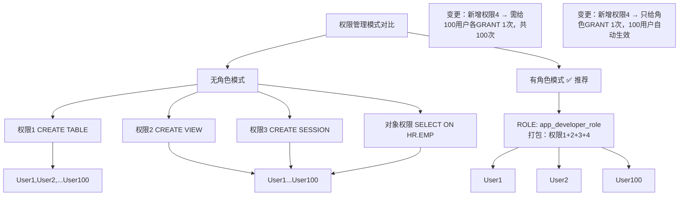
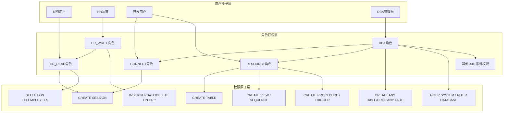

# 5.3 角色Role管理与预定义角色

本节解决的核心问题是：**为什么需要角色？如何创建自定义角色实现批量权限管理？Oracle预定义的CONNECT/RESOURCE/DBA三大角色到底包含哪些权限？为什么DBA角色权限极大不能乱授？** 角色（Role）是权限的打包集合，通过角色授予可以把20个权限一次给100个用户变成"给1个角色授予20个权限→100个用户每人授1个角色"，极大降低管理成本。

## 5.3.1 角色（Role）的价值与概念

> [!definition] 角色（Role）
> 角色是**命名的权限集合**——可以把多个系统权限、对象权限、甚至其他角色打包在一起，作为一个整体授予用户或其他角色。Oracle推荐的权限管理最佳实践是：**权限只授予角色，角色再授予用户**，不直接给用户授一堆零散权限。



### 角色的三大核心价值

| 价值点 | 说明 | 示例 |
| ---- | ---- | ---- |
| **简化权限管理** | 20个权限×100个用户→1个角色×100个用户，管理量从2000降到100 | 新增一个权限只需GRANT给角色一次，所有拥有该角色的用户立即自动获得 |
| **动态权限切换** | SET ROLE可以临时启用/禁用某些角色，同一个会话按需获得不同权限集 | 开发用户日常用只读角色，发布变更时临时SET ROLE开发写角色 |
| **权限继承层级** | 角色可以授予给角色，形成多级继承树（类似企业组织架构） | CTO角色→包含DBA角色+经理角色，DBA角色→包含开发+运维角色 |

> [!note] 角色 vs 用户 vs 权限 的关系
> - **权限**是最小单元（能做一个具体操作）
> - **角色**是权限/子角色的打包集合
> - **用户**是权限/角色的载体（人或应用程序）
> - 关系：权限 → 角色（打包） → 用户（授予）
> - 1个用户可有多个角色，1个角色可授予多个用户（多对多），1个角色可包含多个权限+多个子角色。

---

## 5.3.2 自定义角色的创建、授予、修改、删除

> [!definition] 角色管理DDL语法（Oracle 19c）
> ```sql
> -- 1. 创建角色
> CREATE ROLE 角色名
>   [NOT IDENTIFIED | IDENTIFIED BY password | IDENTIFIED EXTERNALLY | IDENTIFIED GLOBALLY];
>
> -- 2. 给角色授予权限/子角色
> GRANT {系统权限 | 对象权限 | 角色名} TO 角色名 [WITH ADMIN OPTION];
>
> -- 3. 把角色授予用户/其他角色
> GRANT 角色名 TO {用户名 | 角色名 | PUBLIC} [WITH ADMIN OPTION] [DEFAULT ROLE];
>
> -- 4. 会话中临时启用/禁用角色
> SET ROLE {角色名 [IDENTIFIED BY password] [, 角色名...] | ALL [EXCEPT 角色名...] | NONE};
>
> -- 5. 修改角色
> ALTER ROLE 角色名 [NOT IDENTIFIED | IDENTIFIED BY password | ...];
>
> -- 6. 删除角色
> DROP ROLE 角色名;
> ```

### 1. 完整SQL示例：创建APP_READ/APP_WRITE业务角色

```sql
-- ===============================================
-- 场景：企业ERP系统有3类用户：
--   ① 财务人员（只读+报销表写）
--   ② 业务运营人员（业务表全读写）
--   ③ 管理员（全表全权限+DDL权限）
-- 用角色分层管理，绝不直接给用户授零散权限
-- ===============================================

-- ========== 1. 创建三个角色（密码保护：启用时需要输入，防止滥用）==========
CREATE ROLE erp_readonly_role  NOT IDENTIFIED;                  -- 只读角色，免密码启用
CREATE ROLE erp_write_role     IDENTIFIED BY "WriteRole123!";   -- 写角色，启用要密码
CREATE ROLE erp_admin_role     IDENTIFIED BY "AdminRole456@";   -- 管理员角色

-- ========== 2. 给只读角色授予基础权限（登录+全表SELECT）==========
GRANT CREATE SESSION TO erp_readonly_role;
-- 批量给所有ERP业务表授SELECT（用SQL拼语句）
BEGIN
  FOR rec IN (SELECT owner, object_name FROM dba_objects
               WHERE owner='ERP_APP' AND object_type='TABLE') LOOP
    EXECUTE IMMEDIATE 'GRANT SELECT ON ' || rec.owner || '.' || rec.object_name
                   || ' TO erp_readonly_role';
  END LOOP;
END;
/

-- ========== 3. 给写角色授予（=只读 + INSERT/UPDATE/DELETE核心表）==========
-- 先继承只读角色
GRANT erp_readonly_role TO erp_write_role WITH ADMIN OPTION;
-- 再补充写权限（只放开业务表，系统表不放开）
GRANT INSERT, UPDATE, DELETE ON erp_app.customer TO erp_write_role;
GRANT INSERT, UPDATE, DELETE ON erp_app.sales_order TO erp_write_role;
GRANT INSERT, UPDATE, DELETE ON erp_app.inventory TO erp_write_role;

-- ========== 4. 给管理员角色授予（=写角色 + DDL权限+高阶系统权限）==========
GRANT erp_write_role TO erp_admin_role;
GRANT CREATE ANY TABLE, ALTER ANY TABLE, DROP ANY TABLE TO erp_admin_role;
GRANT CREATE ANY INDEX, ALTER ANY INDEX, DROP ANY INDEX TO erp_admin_role;
GRANT CREATE VIEW, CREATE SEQUENCE TO erp_admin_role;
GRANT ALTER SESSION TO erp_admin_role;

-- ========== 5. 把角色授予具体用户 ==========
GRANT erp_readonly_role TO finance_01, finance_02;         -- 财务只读
GRANT erp_readonly_role, erp_write_role TO ops_mgr_01;     -- 运营主管：读+写（两个角色都给，启用写时要密码）
GRANT erp_admin_role TO it_admin_01;                       -- IT管理员给管理员角色

-- ========== 6. ops_mgr_01登录后临时启用写角色 ==========
-- 登录后默认只有erp_readonly_role生效（因为写角色有密码，默认不自动启用）
SET ROLE erp_readonly_role, erp_write_role IDENTIFIED BY "WriteRole123!";
-- 现在就能DML写业务表了

-- 做完变更切回只读，防止误操作
SET ROLE erp_readonly_role;

-- 查看当前会话启用了哪些角色
SELECT * FROM session_roles;
```

### 2. SET ROLE会话级启用禁用

```sql
-- 场景：用户拥有3个角色，按需启用
-- 1. 只启用特定角色（其他全部临时禁用）
SET ROLE erp_readonly_role;

-- 2. 启用全部角色（除了要密码的，如果有密码的角色会报错）
SET ROLE ALL;
-- 2.1 启用全部，除了某个不想启用的
SET ROLE ALL EXCEPT erp_admin_role;

-- 3. 禁用所有角色（完全变成最基础无权限用户）
SET ROLE NONE;

-- 4. 启用要密码的角色
SET ROLE erp_admin_role IDENTIFIED BY "AdminRole456@";
```

> [!tip] 用户默认启用角色的控制
> 可以设置用户登录时**默认自动启用哪些角色**（不需要每次SET ROLE）：
> ```sql
> -- 用户默认启用授予他的全部角色（除了IDENTIFIED BY密码角色不会默认启用）
> ALTER USER ops_mgr_01 DEFAULT ROLE ALL;
> -- 默认只启用指定角色
> ALTER USER ops_mgr_01 DEFAULT ROLE erp_readonly_role;
> -- 不默认启用任何角色（登录后自己SET ROLE）
> ALTER USER ops_mgr_01 DEFAULT ROLE NONE;
> ```

---

## 5.3.3 预定义角色（Predefined Roles）★重点

> [!definition] 预定义角色
> Oracle创建数据库时自动创建的一批内置角色，封装了常见管理/操作权限集合。正确使用能快速授权，但其中DBA等角色权限极大必须谨慎授予。最核心的三大传统角色：**CONNECT、RESOURCE、DBA**。

### 1. 三大传统角色详解（12c+略有变化，下面以19c为准）

#### (1) CONNECT角色

| 维度 | 说明 |
| ---- | ---- |
| **定位** | 最基础的"能连接数据库"角色。过去含一堆建对象权限，12c+已大幅度瘦身。 |
| **19c实际包含的系统权限** | 只含一个最核心的：**CREATE SESSION**（能连数据库登录）。 |
| **适合用户** | 所有需要登录数据库的用户（至少给这个或等效CREATE SESSION）。 |
| **生产建议** | 可以直接给，也可以不给，自己GRANT CREATE SESSION等效。 |

> [!note] 12c前后CONNECT角色变化
> - **11g及之前**：CONNECT含CREATE SESSION、CREATE TABLE、CREATE VIEW、CREATE SEQUENCE、CREATE CLUSTER、CREATE SYNONYM、ALTER SESSION、CREATE DATABASE LINK共8个权限。老DBA容易形成惯性。
> - **12c+**：瘦身到只剩CREATE SESSION。如果升级后老用户不能建表了，就是少补了RESOURCE或单独的CREATE TABLE权限。

#### (2) RESOURCE角色

| 维度 | 说明 |
| ---- | ---- |
| **定位** | 开发用户建对象用的"资源包"角色。 |
| **19c包含的系统权限** | **CREATE TABLE、CREATE CLUSTER、CREATE SEQUENCE、CREATE PROCEDURE、CREATE TRIGGER、CREATE TYPE、CREATE OPERATOR、CREATE INDEXTYPE**（共8类建Schema对象的权限）。 |
| **重要注意** | 11g及之前隐含授予**UNLIMITED TABLESPACE**系统权限（直接绕开QUOTA），12c+已移除这个隐含权限，需单独授QUOTA或GRANT UNLIMITED TABLESPACE。 |
| **适合用户** | 开发用户、应用建表用户（需要建表/索引/存储过程等）。 |

#### (3) DBA角色

> [!danger] DBA角色权限极大，严禁给普通业务用户！
> DBA角色（注意：**只是角色，不是SYSDBA权限**）包含绝大多数系统权限：ALTER ANY TABLE、DROP ANY TABLE、GRANT ANY PRIVILEGE、CREATE USER、DROP USER、ALTER SYSTEM、ALTER DATABASE等200+几乎所有系统权限。**拥有DBA角色基本就能在数据库里做除了STARTUP/SHUTDOWN/CREATE DATABASE/RESETLOGS之外的任何事情。**

| 维度 | 说明 |
| ---- | ---- |
| **定位** | 超级DBA管理员角色（不等于SYSDBA权限，别混淆）。 |
| **权限范围** | 200+系统权限（除SYSDBA/SYSOPER管理权限外的几乎所有）。 |
| **做不了的事** | STARTUP/SHUTDOWN、CREATE DATABASE、DROP DATABASE、OPEN RESETLOGS等需要SYSDBA的操作。 |
| **能做的事** | 创建/删除用户、任意GRANT/REVOKE、任意DDL（建删改任意表）、任意DML、修改系统参数ALTER SYSTEM等。 |
| **适合用户** | 仅限企业授权的DBA人员。生产业务用户、开发人员**一律不能给DBA角色**。 |

> [!warning] DBA角色 vs SYSDBA权限
> 两个完全不同的概念，常被混淆：
> - **DBA是一个角色（Role）**：登录时不用AS SYSDBA，普通登录即可，拥有普通系统权限大合集。
> - **SYSDBA是一个管理权限（Administrative Privilege）**：登录必须AS SYSDBA，拥有SYS超级用户身份，能做DBA角色做不了的STARTUP/SHUTDOWN/CREATE DATABASE等实例级操作。
> - 关系：拥有SYSDBA自动隐含拥有DBA角色所有权限；但拥有DBA角色≠拥有SYSDBA权限。

### 2. 其他重要预定义角色一览

| 预定义角色 | 用途 | 典型授予对象 |
| ---- | ---- | ---- |
| **SELECT_CATALOG_ROLE** | 查询所有DBA_数据字典视图的权限（SELECT ON DBA_TABLES等1400+个），不含修改 | 二线运维、报表DBA（只查不改） |
| **SCHEDULER_ADMIN** | DBMS_SCHEDULER作业调度管理权限（创建/修改/删除任意用户的作业） | 运维调度管理员 |
| **EXECUTE_CATALOG_ROLE** | 执行所有SYS系统包的权限（DBMS_STATS、DBMS_OUTPUT等） | 通常搭配SELECT_CATALOG_ROLE使用 |
| **EXP_FULL_DATABASE** | Data Pump Export全库导出所需的权限集合 | 备份/ETL导出用户 |
| **IMP_FULL_DATABASE** | Data Pump Import全库导入所需权限集合 | 运维导入用户 |
| **AQ_USER_ROLE / AQ_ADMINISTRATOR_ROLE** | Advanced Queuing高级队列用户/管理员权限 | 消息队列开发/管理员 |
| **PUBLIC**（特殊） | 每个用户天生拥有，授予PUBLIC等于授予所有人 | 极少用，全库公开的系统包（如UTL_FILE）默认授给PUBLIC |

> [!note] Oracle 12c+ 公用角色（Common Role） vs 本地角色（Local Role）
> 12c引入多租户CDB/PDB架构后：
> - **Common Role（C##开头）**：CDB根容器中创建，在所有PDB中可见，用于跨容器统一管理权限。命名强制C##前缀。
> - **Local Role**：具体PDB内创建，只在该PDB内生效。传统单实例非CDB架构的角色都是Local Role。
> 非多租户环境不需要区分，直接创建即可。

---

## 5.3.4 角色权限层级Mermaid图示例



> [!tip] 最佳实践：三层授权架构
> 1. **底层：业务对象权限 → 打包成业务角色**（如HR_READ包含所有HR表SELECT）
> 2. **中层：系统权限 + 多个业务角色 → 打包成用户岗位角色**（如HR_OPS角色 = CREATE SESSION + HR_READ + HR_WRITE_SPECIFIC）
> 3. **顶层：岗位角色 → 授予具体用户**
> 这样用户离职/换岗时只需GRANT/REVOKE一个角色，不用动几十条零散权限。

---

## 5.3.5 查询角色信息的数据字典

| 视图 | 用途 | 典型SQL |
| ---- | ---- | ---- |
| **DBA_ROLES** | 数据库中所有角色（角色名、认证方式、是否公用角色） | `SELECT role, password_required, authentication_type FROM dba_roles WHERE role IN ('CONNECT','RESOURCE','DBA');` |
| **DBA_ROLE_PRIVS** | 用户/角色被授予了哪些角色 | `SELECT grantee, granted_role, admin_option, default_role FROM dba_role_privs WHERE grantee = 'SCOTT';` |
| **ROLE_ROLE_PRIVS** | 角色继承关系（角色包含哪些子角色） | `SELECT role, granted_role FROM role_role_privs START WITH role='DBA' CONNECT BY PRIOR granted_role = role;`（递归查DBA下所有子角色） |
| **ROLE_SYS_PRIVS** | 角色包含哪些系统权限 | `SELECT role, privilege, admin_option FROM role_sys_privs WHERE role IN ('CONNECT','RESOURCE','DBA') ORDER BY role,privilege;` |
| **ROLE_TAB_PRIVS** | 角色包含哪些对象权限 | `SELECT role, owner, table_name, privilege FROM role_tab_privs WHERE role = 'HR_READ';` |
| **USER_ROLE_PRIVS** | 当前用户自己的角色（非DBA可查） | `SELECT * FROM user_role_privs;` |
| **SESSION_ROLES** | 当前会话**已启用生效中**的角色 | `SELECT * FROM session_roles ORDER BY 1;` |

```sql
-- DBA审计：哪些用户被直接授予了DBA角色（生产安全检查清单）
SELECT grantee, granted_role, admin_option, default_role
  FROM dba_role_privs
 WHERE granted_role = 'DBA'
   AND grantee NOT IN ('SYS', 'SYSTEM')   -- 排除默认预定义
 ORDER BY grantee;
-- 如果查出来有业务用户名，立即回收！

-- 递归查询DBA角色到底包含了哪些子角色和权限
SELECT LPAD(' ', 2*(LEVEL-1)) || granted_role role_tree,
       privilege, admin_option
  FROM (SELECT role, granted_role, admin_option, NULL privilege
          FROM dba_role_privs rp
         WHERE granted_role IN (SELECT role FROM dba_roles)
         UNION ALL
        SELECT role, NULL, admin_option, privilege
          FROM dba_sys_privs sp)
 START WITH role = 'DBA'
 CONNECT BY PRIOR granted_role = role
        AND PRIOR privilege IS NULL;
```

---

## 小结

本节介绍了角色作为"权限打包集合"的三大价值（简化管理、动态切换、层级继承），详解了CREATE ROLE/GRANT TO ROLE/SET ROLE/DROP ROLE的完整语法与ERP业务角色实战案例。重点详述了三大预定义角色：CONNECT（CREATE SESSION登录）、RESOURCE（8类建对象权限，12c+不再隐含UNLIMITED TABLESPACE）、DBA（200+系统权限，严禁给普通用户），并对比了DBA角色与SYSDBA管理权限的本质区别。最后给出了ROLE_SYS_PRIVS/DBA_ROLE_PRIVS/SESSION_ROLES视图与DBA安全审计SQL。

## 关联

- 上一级：[[MOC - 第5章]]
- 上一节：[[5.2 系统权限、对象权限]]
- 下一节：[[5.4 资源配置与Profile文件]]
- 相关概念：[[5.1 用户创建、修改、删除]]（用户是角色的载体）、[[MOC - 第10章 性能监控与基础优化]]（权限审计）
