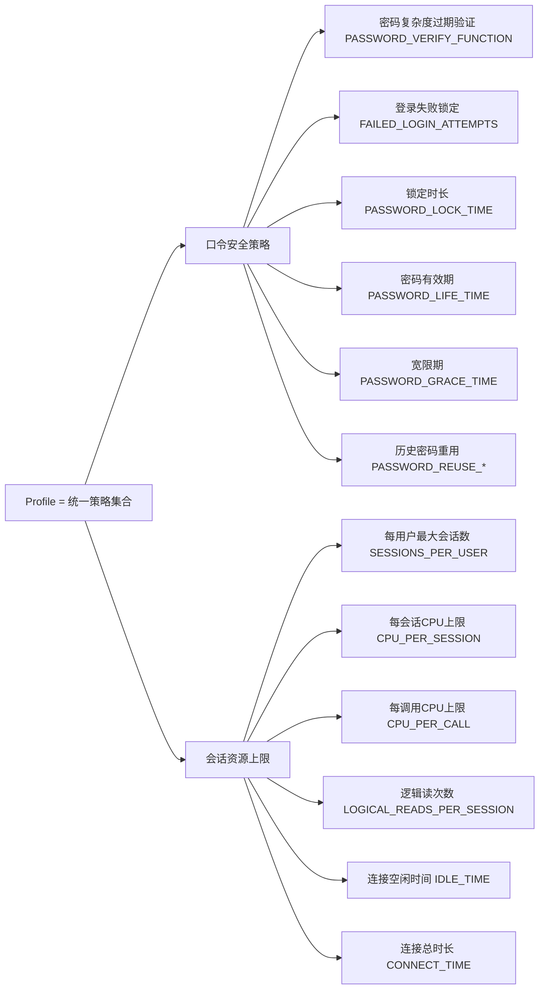
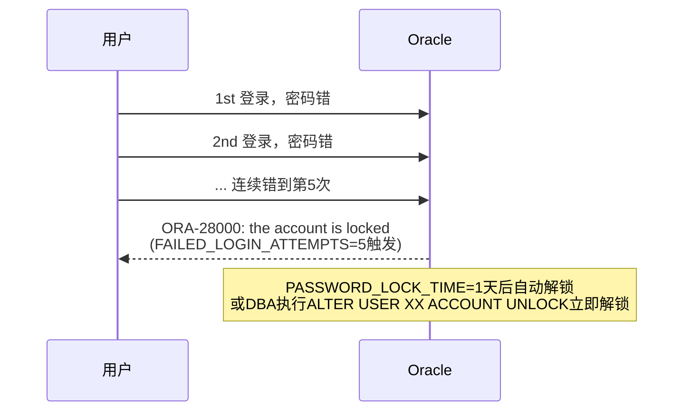

# 5.4 资源配置与Profile文件

本节解决的核心问题是：**如何限制用户的密码复杂度、登录失败锁定、密码过期周期、会话资源上限？如果DBA自己的Profile过于严格把自己锁在外面了怎么办？** Profile是Oracle对用户的"统一策略管理文件"，一个Profile同时管两类限制：**口令安全策略**（密码复杂度/过期/锁定）与**会话资源使用上限**（CPU/IO/连接数）。

## 5.4.1 Profile文件概念

> [!definition] Profile（资源配置文件）
> Profile是Oracle数据库中**口令安全策略与会话资源限制的命名集合**。一个Profile可以授予多个用户共享同一条策略；一个用户同一时刻只能有一个生效Profile。所有用户默认使用名为`DEFAULT`的系统Profile。



> [!note] 资源限制需要开启resource_limit参数
> 资源类（CPU/IO/连接数）限制需要`ALTER SYSTEM SET resource_limit=TRUE SCOPE=BOTH;`显式开启才生效。口令类限制（密码过期/锁定等）**不需要**开此参数，默认永久生效。

---

## 5.4.2 CREATE PROFILE完整语法与参数

> [!definition] CREATE PROFILE 语法（Oracle 19c常用参数）
> ```sql
> CREATE PROFILE profile名 LIMIT
>   -- ==== 口令安全参数（12个，都对所有版本生效，默认开启）====
>   FAILED_LOGIN_ATTEMPTS    整数 | UNLIMITED | DEFAULT   -- 失败几次锁定
>   PASSWORD_LOCK_TIME       整数(天) | UNLIMITED | DEFAULT   -- 锁定天数
>   PASSWORD_LIFE_TIME       整数(天) | UNLIMITED | DEFAULT   -- 密码有效期
>   PASSWORD_GRACE_TIME      整数(天) | UNLIMITED | DEFAULT   -- 过期宽限
>   PASSWORD_REUSE_TIME      整数(天) | UNLIMITED | DEFAULT   -- 多少天内不许重用旧密码
>   PASSWORD_REUSE_MAX       整数 | UNLIMITED | DEFAULT        -- 改多少次密码后才能用旧密码
>   PASSWORD_VERIFY_FUNCTION 函数名 | NULL | DEFAULT          -- 自定义复杂度校验函数
>   -- ==== 12c+ 新增口令参数（更严）====
>   PASSWORD_ROLLOVER_TIME   整数(小时/天)                     -- 新旧密码并行期
>   INACTIVE_ACCOUNT_TIME    整数(天)                          -- 多久没登录自动锁
>   -- ==== 资源限制参数（需resource_limit=TRUE才生效）====
>   SESSIONS_PER_USER        整数 | UNLIMITED | DEFAULT        -- 每用户最大并发会话
>   CPU_PER_SESSION          整数(10ms单位) | UNLIMITED
>   CPU_PER_CALL             整数(10ms) | UNLIMITED
>   LOGICAL_READS_PER_SESSION整数 | UNLIMITED
>   LOGICAL_READS_PER_CALL   整数 | UNLIMITED
>   IDLE_TIME                整数(分钟) | UNLIMITED           -- 空闲超时自动断
>   CONNECT_TIME             整数(分钟) | UNLIMITED           -- 单次会话最长时长
>   COMPOSITE_LIMIT          整数(服务单位) | UNLIMITED
>   PRIVATE_SGA              整数(字节) | UNLIMITED           -- 共享服务器模式下用户用SGA上限
> ```

### 参数值说明：

| 值 | 含义 |
| ---- | ---- |
| **具体整数** | 比如FAILED_LOGIN_ATTEMPTS 5 = 失败5次锁；数字单位：天（PASSWORD_*_TIME）、分钟（IDLE/CONNECT）、10毫秒（CPU）、次数（REUSE_MAX） |
| **UNLIMITED** | 完全无限制，对应策略关闭 |
| **DEFAULT** | 继承DEFAULT Profile中同名参数的值（级联，改DEFAULT就全改） |

---

## 5.4.3 口令安全参数详解（★生产最常用）

### 1. FAILED_LOGIN_ATTEMPTS + PASSWORD_LOCK_TIME：暴力破解防护



```sql
-- 等保2.0三级推荐：密码输错5次锁1天
FAILED_LOGIN_ATTEMPTS = 5
PASSWORD_LOCK_TIME    = 1
-- 或永久锁直到DBA解锁：PASSWORD_LOCK_TIME = UNLIMITED
```

### 2. PASSWORD_LIFE_TIME + PASSWORD_GRACE_TIME：密码周期性强制更换

```mermaid
stateDiagram-v2
    direction LR
    [*] --> Active: 刚改密码/新用户
    Active --> Grace: PASSWORD_LIFE_TIME=90天到期
    Grace --> Expired: PASSWORD_GRACE_TIME=7天宽限期用完
    Expired --> MustChange: 下一次登录触发
    MustChange --> Active: 用户成功改密码
    state Active {
        description: 密码正常使用阶段<br/>90天
    }
    state Grace {
        description: 宽限期7天<br/>能登录但每次警告 ORA-28002<br/>不改密码也能继续用
    }
    state Expired {
        description: 密码已过期<br/>不修改就不能登录<br/>报ORA-28001: the password has expired
    }
```

```sql
-- 生产常用：密码每90天必须换，到期后7天宽限期
PASSWORD_LIFE_TIME  = 90
PASSWORD_GRACE_TIME = 7
```

### 3. PASSWORD_REUSE_TIME + PASSWORD_REUSE_MAX：历史密码重用

防止用户在多个密码间来回循环（如Pass1→Pass2→回到Pass1）。Oracle 19c必须**两个条件同时满足**才能重用旧密码（AND关系，不是OR）：

```sql
-- 规则：至少改5次密码后，且旧密码已过了180天，才能再重用
PASSWORD_REUSE_TIME = 180     -- 180天内不许用旧密码
PASSWORD_REUSE_MAX  = 5       -- 至少改5次以后才能用回旧密码
```

### 4. PASSWORD_VERIFY_FUNCTION：密码复杂度校验函数

Oracle自带`utlpwdmg.sql`脚本安装`VERIFY_FUNCTION_11G`函数，满足复杂度：
- 密码长度 ≥ 8 位
- 至少包含1个字母 + 1个数字 + 1个特殊字符
- 密码不等于用户名、用户名反转
- 不是常见弱口令（welcome1/oracle123等）

```sql
-- 步骤1：执行Oracle自带脚本安装VERIFY_FUNCTION_11G（SYS用户下执行）
@$ORACLE_HOME/rdbms/admin/utlpwdmg.sql
-- 该脚本还会顺便把DEFAULT Profile的PASSWORD_VERIFY_FUNCTION设为VERIFY_FUNCTION_11G

-- 步骤2：自定义Profile中引用
CREATE PROFILE app_user_profile LIMIT
  FAILED_LOGIN_ATTEMPTS 5
  PASSWORD_LOCK_TIME UNLIMITED
  PASSWORD_LIFE_TIME 90
  PASSWORD_GRACE_TIME 7
  PASSWORD_VERIFY_FUNCTION VERIFY_FUNCTION_11G;   -- 自定义或自带函数都可以

-- 步骤3：给用户用
ALTER USER scott PROFILE app_user_profile;
```

> [!danger] DBA用户Profile陷阱（生产真实踩坑！）
> 新手最容易犯的错：把FAILED_LOGIN_ATTEMPTS=3、PASSWORD_LOCK_TIME=UNLIMITED的严格Profile同时应用在SYS/SYSTEM/核心DBA账户上。某天DBA运维脚本密码写错连错3次，**SYS和SYSTEM全被锁且UNLIMITED永久不会自动解锁**，而又没有第二个DBA账户，只能走OS认证应急方案（见自测题4）。
>
> **正确做法**：SYS/SYSTEM/核心DBA账户单独建一个"宽松Profile"，FAILED_LOGIN_ATTEMPTS=UNLIMITED或50，PASSWORD_LOCK_TIME=1/24（锁1小时自动解），把严格Profile只应用给普通业务用户。

---

## 5.4.4 资源限制参数详解（二级参数，生产按需开启）

| 参数 | 单位 | 作用 | 生产建议 |
| ---- | ---- | ---- | ---- |
| **SESSIONS_PER_USER** | 会话数 | 同一用户同时在线的最大并发连接数 | 防止应用连接池泄漏把processes撑爆：应用用户设500~2000，人力用户设50 |
| **IDLE_TIME** | 分钟 | 会话空闲超过多少分钟就强制断开 | 防止开发SQL Developer忘关占着连接：设120（2小时） |
| **CONNECT_TIME** | 分钟 | 单次会话最长总持续时间，到点强断 | 批处理用户需要UNLIMITED，人力用户设1440（1天） |
| **CPU_PER_SESSION** | 10ms/次 | 单会话累计CPU上限 | 防止烂SQL占满CPU：开发库可设10万（约17分钟） |
| **CPU_PER_CALL** | 10ms/次调用 | 单次SQL/PLSQL调用CPU上限 | 防报表SELECT执行几小时：设3万（约5分钟）超时自动回滚 |
| **LOGICAL_READS_PER_SESSION/CALL** | 块数 | 逻辑读上限（防大表全扫） | 同上，对应IO滥用 |

> [!note] 资源限制生效前提
> 资源类参数要先开参数才能生效：
> ```sql
> ALTER SYSTEM SET resource_limit = TRUE SCOPE = BOTH;
> SHOW PARAMETER resource_limit;   -- 确认TRUE
> ```

---

## 5.4.5 实战：三套生产Profile模板（Oracle 19c）

```sql
-- ============================================================
-- 模板一：dba_strict_profile（DBA使用：账户安全松，密码严格+期限适中）
-- ============================================================
CREATE PROFILE dba_strict_profile LIMIT
  -- 账户安全（较宽松，防止把自己锁外面！）
  FAILED_LOGIN_ATTEMPTS    50
  PASSWORD_LOCK_TIME       1/24         -- 锁1小时自动解锁（1天=24小时，1/24=1小时）
  -- 密码策略
  PASSWORD_LIFE_TIME       60
  PASSWORD_GRACE_TIME      7
  PASSWORD_REUSE_TIME      365
  PASSWORD_REUSE_MAX       10
  PASSWORD_VERIFY_FUNCTION VERIFY_FUNCTION_11G
  INACTIVE_ACCOUNT_TIME    30           -- 30天没登录自动锁（离职DBA自动防护）
  -- 资源
  SESSIONS_PER_USER        UNLIMITED
  IDLE_TIME                480          -- 8小时空闲断
  CPU_PER_SESSION          UNLIMITED;

-- ============================================================
-- 模板二：app_security_profile（普通业务用户，安全严格）
-- ============================================================
CREATE PROFILE app_security_profile LIMIT
  FAILED_LOGIN_ATTEMPTS    5
  PASSWORD_LOCK_TIME       UNLIMITED    -- 锁到DBA解（防暴力破解）
  PASSWORD_LIFE_TIME       90
  PASSWORD_GRACE_TIME      7
  PASSWORD_REUSE_TIME      180
  PASSWORD_REUSE_MAX       5
  PASSWORD_VERIFY_FUNCTION VERIFY_FUNCTION_11G
  INACTIVE_ACCOUNT_TIME    60           -- 60天不登录自动锁
  -- 资源
  SESSIONS_PER_USER        1000
  IDLE_TIME                120
  CONNECT_TIME             1440;

-- ============================================================
-- 模板三：report_readonly_profile（只读报表用户/人机接口用户）
-- ============================================================
CREATE PROFILE report_readonly_profile LIMIT
  FAILED_LOGIN_ATTEMPTS    10
  PASSWORD_LOCK_TIME       1
  PASSWORD_LIFE_TIME       365          -- 每年换一次（报表人不想频繁改）
  PASSWORD_GRACE_TIME      14
  PASSWORD_REUSE_TIME      UNLIMITED
  PASSWORD_REUSE_MAX       UNLIMITED
  PASSWORD_VERIFY_FUNCTION DEFAULT     -- 用DEFAULT的函数
  INACTIVE_ACCOUNT_TIME    180
  -- 资源
  SESSIONS_PER_USER        20
  IDLE_TIME                60
  CPU_PER_CALL             60000;       -- 10分钟超时（大报表别跑太久）
```

---

## 5.4.6 ALTER PROFILE / DROP PROFILE 修改删除

```sql
-- ========== 修改Profile（立即生效，对已授予该Profile的用户马上生效）==========
ALTER PROFILE app_security_profile LIMIT
  FAILED_LOGIN_ATTEMPTS 3                -- 从5改严到3
  PASSWORD_LIFE_TIME 60;                 -- 从90天缩短到60天

-- ========== 删除Profile ==========
-- 没有任何用户在用时：
DROP PROFILE app_security_profile;

-- 有用户在用时：加CASCADE把这些用户的Profile切换回DEFAULT，再删Profile
DROP PROFILE app_security_profile CASCADE;
```

---

## 5.4.7 查询Profile数据字典

| 视图 | 用途 | 典型SQL |
| ---- | ---- | ---- |
| **DBA_PROFILES** | 所有Profile的所有参数值（最常用） | `SELECT profile, resource_name, resource_type, limit FROM dba_profiles ORDER BY profile, resource_name;` |
| **DBA_USERS** | 每个用户当前使用的Profile | `SELECT username, profile, account_status, expiry_date FROM dba_users WHERE username='SCOTT';` |
| **USER_PASSWORD_LIMITS** | 当前用户自己的口令限制（非DBA查） | `SELECT * FROM user_password_limits;` |
| **USER_RESOURCE_LIMITS** | 当前用户的资源限制 | `SELECT * FROM user_resource_limits;` |

```sql
-- 查询所有用户当前使用的Profile，快速定位配置混乱的
SELECT u.profile, COUNT(*) user_count,
       LISTAGG(u.username, ', ') WITHIN GROUP (ORDER BY u.username) users_in_profile
  FROM dba_users u
 GROUP BY u.profile
 ORDER BY user_count DESC;

-- 查即将过期（7天内）密码的用户清单，批量发邮件提醒
SELECT username, account_status, expiry_date, profile,
       TRUNC(expiry_date - SYSDATE) days_to_expire
  FROM dba_users
 WHERE expiry_date IS NOT NULL
   AND account_status = 'OPEN'
   AND expiry_date BETWEEN SYSDATE AND SYSDATE + 7
 ORDER BY expiry_date;
```

---

## 5.4.8 Oracle 12c+口令新增特性

| 特性 | 参数 | 用途 |
| ---- | ---- | ---- |
| **密码过渡（Rollover）期** | PASSWORD_ROLLOVER_TIME=1~60天 | 改密码后，新旧密码并行有效N天。应用配置文件多、改密码要滚动重启的场景神器——不会因为改密码全库连接立即报错ORA-1017 |
| **不活跃账户自动锁** | INACTIVE_ACCOUNT_TIME=天 | 连续N天没登录过的账户自动锁。防止离职员工/僵尸账户被滥用。 |

```sql
-- 密码过渡期：7天内新旧密码都能用
ALTER PROFILE app_security_profile LIMIT
  PASSWORD_ROLLOVER_TIME 7;      -- 7天并行期（12.2+）

-- 用法：
-- 第0天：DBA执行ALTER USER app_user IDENTIFIED BY NEW_PASSWORD;
-- 第0~7天：应用配置写的 OLD_PASSWORD 和 NEW_PASSWORD 都能登录成功
-- 第7天24点之后：OLD_PASSWORD失效，只剩新密码有效
-- 这7天内运维可以分批滚动更新应用连接池配置，零停机改密码！
```

---

## 小结

本节详解了Profile的两大作用域——**口令安全策略**（FAILED_LOGIN_ATTEMPTS锁定防护、PASSWORD_LIFE_TIME周期更换、PASSWORD_VERIFY_FUNCTION复杂度、12c+ ROLLOVER过渡与INACTIVE不活跃账户锁）与**会话资源上限**（SESSIONS_PER_USER连接数限制、IDLE_TIME空闲断连、CPU_PER_CALL防烂SQL）。提供了三套生产级Profile模板（DBA宽松型/业务用户严格型/报表只读型），并强调了DBA用户必须单独使用宽松Profile避免把SYS/SYSTEM锁死的真实踩坑。配合DBA_PROFILES视图与即将过期SQL，可以全面管控全库账户安全策略。

## 关联

- 上一级：[[MOC - 第5章]]
- 上一节：[[5.3 角色Role管理与预定义角色]]
- 本章习题：[[MOC - 第5章习题]]
- 相关概念：[[5.1 用户创建、修改、删除]]（CREATE USER时指定PROFILE子句）、[[MOC - 第10章 性能监控与基础优化]]（烂SQL资源占用治理）
