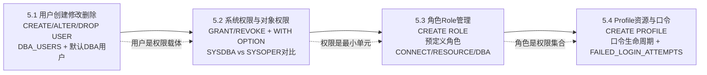

# MOC - 第5章 用户、权限与角色管理

> [!info] 本章定位
> 本章是Oracle DBA的**安全管理核心章**，解决"谁能登录、能做什么、做到什么程度、密码与资源如何限制"这四个数据库安全基本问题。它从用户的创建、修改、删除入手，区分身份验证方式与默认DBA用户；详解系统权限（SYSDBA/SYSOPER等数据库级操作）与对象权限（SELECT/UPDATE等表级操作）的授予与回收规则；介绍角色（Role）作为权限集合的批量管理机制，以及CONNECT/RESOURCE/DBA等预定义角色；最后说明Profile文件如何管理口令复杂度、账户锁定、会话资源上限。
>
> 安全管理贯穿全库生命周期：新建业务用户→授权→建表；审计时查DBA_SYS_PRIVS/DBA_ROLE_PRIVS；安全加固时调Profile。本章与[[MOC - 第6章 Oracle表空间与对象管理]]的表空间配额、对象创建权限强关联。

## 学习路线图



> [!tip] 路线说明
> 推荐按 5.1 → 5.2 → 5.3 → 5.4 顺序学习。5.1 先建立用户概念（SYS必须AS SYSDBA登录）；5.2 理解系统权限WITH ADMIN OPTION与对象权限WITH GRANT OPTION回收差异（易考点）；5.3 掌握角色层级图的权限传递；5.4 熟悉Profile参数的生产推荐值。本章SQL实操题多，建议边学边在测试库验证。

## 知识点导航

| 节 | 主题 | 核心要点 | 入口链接 |
| ---- | ---- | ---- | ---- |
| 5.1 | 用户创建、修改、删除 | CREATE USER语法、DBA_USERS、身份验证方式、预定义用户SYS/SYSTEM区别、DROP USER CASCADE风险 | [[5.1 用户创建、修改、删除]] |
| 5.2 | 系统权限、对象权限 | 系统权限ADMIN OPTION与对象权限GRANT OPTION回收差异对比表、SYSDBA vs SYSOPER权限表 | [[5.2 系统权限、对象权限]] |
| 5.3 | 角色Role管理与预定义角色 | CREATE ROLE、CONNECT/RESOURCE/DBA三大预定义角色权限范围、角色权限层级Mermaid图 | [[5.3 角色Role管理与预定义角色]] |
| 5.4 | 资源配置与Profile文件 | PROFILE参数说明、口令生命周期图、FAILED_LOGIN_ATTEMPTS锁定机制、PASSWORD_VERIFY_FUNCTION | [[5.4 资源配置与Profile文件]] |

## 核心考点

> [!warning] 重点掌握
> 1. **CREATE USER完整语法**：IDENTIFIED BY、DEFAULT TABLESPACE、TEMPORARY TABLESPACE、QUOTA、PROFILE、PASSWORD EXPIRE、ACCOUNT LOCK各子句作用。
> 2. **DROP USER CASCADE高风险命令**：永久删除用户下所有表/索引/视图/存储过程，不可逆。
> 3. **预定义DBA用户区别**：SYS拥有数据字典基表，只能AS SYSDBA登录；SYSTEM是普通DBA用户；DBSNMP/SYSMAN用于OEM管理。
> 4. **系统权限vs对象权限回收差异**：系统权限用WITH ADMIN OPTION授予→回收**不级联**；对象权限用WITH GRANT OPTION授予→回收**级联**（对比表记忆）。
> 5. **SYSDBA vs SYSOPER权限详细对比表**：启动关闭、备份恢复、CREATE DATABASE、RESTRICTED SESSION等权限是否拥有。
> 6. **三大预定义角色权限清单**：CONNECT（CREATE SESSION等）、RESOURCE（CREATE TABLE/CLUSTER/SEQUENCE/PROCEDURE/TRIGGER/TYPE等）、DBA（几乎所有权限除了SYSDBA级）。DBA角色权限太大，不建议给普通业务用户！
> 7. **Profile关键参数**：FAILED_LOGIN_ATTEMPTS（失败次数）、PASSWORD_LOCK_TIME（锁定天数）、PASSWORD_LIFE_TIME（过期天数）、PASSWORD_GRACE_TIME（宽限期）、SESSIONS_PER_USER（每用户最大会话数）。
> 8. **口令生命周期Mermaid图**：正常使用→LIFE_TIME到期→GRACE_TIME宽限期→过期必须改→锁定DBA解锁。

## 自测题

> [!question] 1. CREATE USER语句中，DEFAULT TABLESPACE和QUOTA子句分别起什么作用？如果忘了给用户设置QUOTA会产生什么后果？
> > [!check]- 参考答案
> > - **DEFAULT TABLESPACE**：指定用户创建对象（表、索引等）时默认存放的表空间。如果不显式指定，默认是`USERS`表空间（11g+）或`SYSTEM`（旧版本，不推荐）。
> > - **QUOTA <配额大小> ON <表空间名>`**：限制用户在该表空间上能占用的最大空间总量。可选值：`UNLIMITED`（不限）、`50M`/`10G`等具体值、`0`（完全禁止使用）。
> > - **未设QUOTA的后果**：用户在对应表空间上的QUOTA默认为0，执行CREATE TABLE/INDEX等需要分配区的SQL会报错`ORA-01536: space quota exceeded for tablespace 'XXX'`，即使表空间有剩余空间也无法使用。`GRANT UNLIMITED TABLESPACE`系统权限可以一次性突破所有表空间的QUOTA限制（生产给RESOURCE角色时通常会附带这个）。

> [!question] 2. 系统权限的WITH ADMIN OPTION和对象权限的WITH GRANT OPTION，在回收时有什么关键区别？请举例说明。
> > [!check]- 参考答案
> > **区别核心：回收是否级联（CASCADE）**
> > - **系统权限 WITH ADMIN OPTION**：A→B→C级联授予，DBA从A回收系统权限时，**B和C的权限不受影响，仍保留**（回收不级联）。
> > - **对象权限 WITH GRANT OPTION**：A→B→C级联授予，DBA或A从B回收对象权限时，**C通过B获得的权限也被一起回收**（回收级联，Oracle自动级联，不需要写CASCADE关键字）。
> >
> > 举例：
> > ```sql
> > -- 系统权限（回收不级联）
> > GRANT CREATE TABLE TO a WITH ADMIN OPTION;     -- A有
> > CONN a/a
> > GRANT CREATE TABLE TO b WITH ADMIN OPTION;     -- A→B
> > CONN / as sysdba
> > REVOKE CREATE TABLE FROM a;                    -- 从A回收
> > -- 结果：B的CREATE TABLE权限仍在！
> >
> > -- 对象权限（回收级联）
> > GRANT SELECT ON hr.employees TO b WITH GRANT OPTION;  -- B有
> > CONN b/b
> > GRANT SELECT ON hr.employees TO c;                    -- B→C
> > CONN / as sysdba
> > REVOKE SELECT ON hr.employees FROM b;         -- 从B回收
> > -- 结果：C的SELECT权限也被自动回收了！
> > ```

> [!question] 3. SYS用户和SYSTEM用户有什么区别？为什么SYS登录必须用AS SYSDBA？
> > [!check]- 参考答案
> > **SYS用户（超级用户）**：
> > - Oracle数据库的**创造者和拥有者**，数据字典基表（SYS.TAB$、SYS.IND$等底层系统表）和PL/SQL系统包都属于SYS。
> > - 默认拥有**全部系统权限**+**SYSDBA管理权限**。
> > - **必须用AS SYSDBA身份登录**（11g+强制）。直接`CONN SYS/password`会报错：`ORA-28009: connection as SYS should be as SYSDBA or SYSOPER`。原因：SYSDBA登录会走密码文件/OS认证，允许做STARTUP/SHUTDOWN等操作，且登录时记录到V$PWFILE_USERS。
> >
> > **SYSTEM用户（普通DBA用户）**：
> > - Oracle预定义的DBA管理用户，拥有DBA角色权限，用于日常DBA管理操作。
> > - 不拥有数据字典基表，**不能AS SYSDBA登录（除非显式GRANT SYSDBA给SYSTEM）**。
> > - 直接`CONN SYSTEM/manager`普通登录即可。
> >
> > 其他预定义用户：DBSNMP（OEM代理监控用）、SYSMAN（Oracle Enterprise Manager资料档案库用，12c+已淘汰）、OUTLN（存储大纲，优化器计划稳定性）、XS$NULL（12c+ Real Application Security）。**这些预定义账户除了SYS/SYSTEM，日常不要动，生产建议保持默认锁定状态**。

> [!question] 4. 生产环境Profile中FAILED_LOGIN_ATTEMPTS、PASSWORD_LIFE_TIME、PASSWORD_LOCK_TIME三个参数如何设置更安全？如果DBA自己的账户因为登录失败被锁定了怎么办？
> > [!check]- 参考答案
> > **生产推荐安全值（参考等保2.0三级要求）**：
> > | 参数 | 推荐值 | 作用 |
> > | ---- | ---- | ---- |
> > | FAILED_LOGIN_ATTEMPTS | 5~10次 | 连续输错密码N次后账户自动锁，防暴力破解 |
> > | PASSWORD_LOCK_TIME | 1（天）或 UNLIMITED | 锁定时间，UNLIMITED表示锁定后必须DBA手动解锁 |
> > | PASSWORD_LIFE_TIME | 90天 | 密码有效期，到期必须改 |
> > | PASSWORD_GRACE_TIME | 7天 | LIFE_TIME到期后的宽限期，7天内不改密码仍能登录，但会被警告 |
> >
> > **DBA账户被锁定的解决：**
> >
> > > [!danger] DBA用户Profile陷阱
> > > 很多新手把FAILED_LOGIN_ATTEMPTS=3同时应用在SYS/SYSTEM账户上，导致SYS也被锁！
> >
> > 应急解锁方案：
> > 1. 如果还有**另一个DBA权限的账户没被锁**：登录后`ALTER USER sys ACCOUNT UNLOCK;`
> > 2. 如果**所有DBA账户都被锁了**：
> >    - 关闭数据库：`SHUTDOWN IMMEDIATE;`
> >    - 暂时把SQLNET.ORA中`SQLNET.AUTHENTICATION_SERVICES=(NONE)`改为`(NTS)`（Windows）或保持`(ALL)`（Linux，启用OS认证）
> >    - 用OS组认证登录：`sqlplus / as sysdba`（Linux需当前OS用户在dba组）
> >    - 解锁SYS：`ALTER USER sys ACCOUNT UNLOCK IDENTIFIED BY "新密码";`
> >    - 重新启动数据库
> > 3. 预防：SYS/SYSTEM账户单独给一个宽松Profile（FAILED_LOGIN_ATTEMPTS=UNLIMITED），普通业务用户用严格的安全Profile。

## 章节导航

- 上一级：[[MOC - Oracle数据库管理]]
- 上一章：[[MOC - 第4章 Oracle数据库启动与关闭]]
- 下一章：[[MOC - 第6章 Oracle表空间与对象管理]]
- 本章习题：[[MOC - 第5章习题]]
