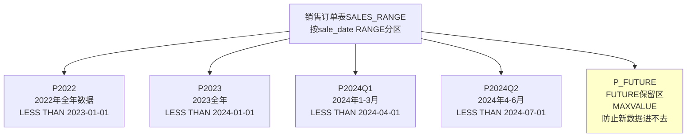

# 6.4 分区表基础

本节解决的核心问题是：**大表（千万/亿级行）如何拆分让查询快、维护易？RANGE/LIST/HASH/复合四大分区策略如何选型？分区剪枝Partition Pruning原理是什么？分区索引LOCAL vs GLOBAL如何选？分区维护操作ADD/DROP/TRUNCATE/SPLIT/MERGE/EXCHANGE如何在线完成？** 分区表是Oracle管理TB级超大表的基础，是DBA面试必考、生产必备知识。

## 6.4.1 分区表解决什么问题？

> [!definition] 分区表（Partitioned Table）
> 把一张逻辑上的大表，按某列或多列组合（分区键）的值范围/列表/哈希值，物理切分成多个独立的段（分区段），每个分区有独立的数据文件、独立的高水位线、独立的索引段。对用户来说还是一张表（SELECT * FROM 大表），对Oracle内部是多个独立的小表段。

### 1. 分区表四大优势（为什么要分区？）

| 优势 | 原理/说明 | 生产实例 |
| ---- | ---- | ---- |
| **① 提高查询性能：分区剪枝Partition Pruning** | WHERE条件中带分区键，Oracle优化器直接跳过不满足条件的分区（只读数据量大表10%的分区而非100%），I/O量降几个数量级 | 订单表按年/月RANGE分区，`WHERE sale_date BETWEEN '2024-01' AND '2024-03'`只读P202401/P202402/P202403三个分区 |
| **② 提高可用性：分区独立，故障隔离** | 某个分区所在磁盘坏/数据损坏，只有该分区不可访问；其他分区照常读写；备份恢复也可以分区级独立做 | 历史分区P202001数据文件损坏，不影响2024年订单查询；RMAN恢复只恢复该分区文件 |
| **③ 便于维护：历史数据滚动卸载/保留** | 老数据归档/删除不再是DELETE百万行慢操作，直接`ALTER TABLE DROP/TRUNCATE PARTITION`秒级完成（DDL） | 保留近24个月订单，每月初自动DROP最老的一个分区，2~3秒完成 |
| **④ 均衡I/O：多分区分散到不同表空间/磁盘** | 热分区（当月）放高性能SSD表空间，冷历史分区放大容量HDD归档表空间，分级存储省钱 | 当月分区P202404放SSD_TS表空间，2020年分区放ARCHIVE_HDD_TS |

> [!note] 分区建议阈值（经验值）
> - OLTP系统：单表超过**2000万行**或**单表段>10GB** → 强烈建议分区
> - 数据仓库/OLAP：单表>**100GB** 或 亿级行以上 → 必须分区
> - 有明确的时间维度（日/月/年）或地域维度 → 优先按该维度RANGE/LIST分区
> - 小表<200万行、<2GB → 不分区，增加管理复杂度收益不大

---

## 6.4.2 四大分区类型（★★★必考）

### 1. RANGE分区（范围分区，★★★最常用90%场景都是RANGE）

按分区键的数值范围（日期/数字）切分，最典型的**按年/月/日分区**（历史数据管理必备）。



```sql
-- ========== RANGE分区：按月分区（★生产最常用）==========
CREATE TABLE sh.sales_range (
  sales_id    NUMBER(18) NOT NULL,
  prod_id     NUMBER(6) NOT NULL,
  cust_id     NUMBER(10) NOT NULL,
  time_id     DATE NOT NULL,                 -- ★分区键：销售时间DATE类型
  channel_id  CHAR(1),
  quantity_sold NUMBER(3),
  amount_sold NUMBER(10,2)
)
PARTITION BY RANGE (time_id)        -- ★RANGE按时间分区
INTERVAL (NUMTOYMINTERVAL(1, 'MONTH'))   -- ★11g+ INTERVAL自动分区！超过最后一个分区范围时，Oracle自动按月建新分区（不用每月手动ADD）
(
  -- 手动建几个种子分区，之后靠INTERVAL自动建
  PARTITION p_before_2023 VALUES LESS THAN (TO_DATE('2023-01-01','YYYY-MM-DD'))
    TABLESPACE archive_hdd_ts COMPRESS FOR ARCHIVE HIGH,   -- 历史分区放归档HDD，高压缩省空间
  PARTITION p202301 VALUES LESS THAN (TO_DATE('2023-02-01','YYYY-MM-DD'))
    TABLESPACE archive_hdd_ts COMPRESS FOR QUERY LOW,
  PARTITION p202302 VALUES LESS THAN (TO_DATE('2023-03-01','YYYY-MM-DD'))
    TABLESPACE archive_hdd_ts COMPRESS FOR QUERY LOW
)
TABLESPACE sh_data_ts
ENABLE ROW MOVEMENT;          -- ★必须开！如果UPDATE分区键time_id让行从2023月1月→2月，不开ENABLE ROW MOVEMENT会报错ORA-14402（不能跨分区移动行）

-- ========== 不带INTERVAL的手动RANGE（老版本或需要精细控制）==========
CREATE TABLE sh.year_sales (
  year_id NUMBER(4) NOT NULL,  -- 分区键数字列：年份2020,2021,2022...
  sales_amount NUMBER(18,2)
) PARTITION BY RANGE (year_id)
(
  PARTITION p2020 VALUES LESS THAN (2021) TABLESPACE archive_ts,
  PARTITION p2021 VALUES LESS THAN (2022) TABLESPACE archive_ts,
  PARTITION p2022 VALUES LESS THAN (2023) TABLESPACE data_ts,
  PARTITION p_future VALUES LESS THAN (MAXVALUE) TABLESPACE data_ts   -- MAXVALUE兜底，任何超范围year_id都进这里防报错
);
```

> [!tip] INTERVAL自动分区（11g+）是RANGE分区的神器
> 老方式每月要写`ALTER TABLE sales_range ADD PARTITION p202405 VALUES LESS THAN (...)` 手工加，容易忘；INTERVAL一劳永逸，自动按月/按日建。但注意：① 自动分区名是Oracle生成的怪名字（SYS_P12345），建议定时DBMS_SCHEDULER作业重命名为规范名；② 分区键必须DATE/NUMBER，不能是字符串。

---

### 2. LIST分区（列表分区，按枚举值切分）

分区键是离散枚举值（如省份、渠道、订单状态等数量有限的值），每个分区列出包含的分区键值集合。

```sql
-- ========== LIST分区：按省份code分区 ==========
CREATE TABLE sh.cust_by_region (
  cust_id NUMBER(10) NOT NULL,
  cust_name VARCHAR2(50),
  region_code CHAR(2) NOT NULL,     -- ★分区键：省份编码 BJ=北京,SH=上海,GD=广东...
  amount NUMBER(18,2)
) PARTITION BY LIST (region_code)
AUTOMATIC                              -- 12c+ LIST也支持自动分区（新出现未枚举的region_code自动建新分区，不用手动ADD）
(
  PARTITION p_north VALUES ('BJ','TJ','HEB','SHX','NMG')  TABLESPACE north_ts, -- 华北
  PARTITION p_east  VALUES ('SH','JS','ZJ','AH','SD')     TABLESPACE east_ts,  -- 华东
  PARTITION p_south VALUES ('GD','GX','FJ','HAIN')        TABLESPACE south_ts, -- 华南
  PARTITION p_sw    VALUES ('SC','CQ','GZ','YN','XZ')     TABLESPACE sw_ts,    -- 西南
  PARTITION p_default VALUES (DEFAULT)                    TABLESPACE other_ts  -- 兜底DEFAULT，所有未在上面列出的region_code都进这里
) ENABLE ROW MOVEMENT;
```

> [!note] LIST分区vs RANGE分区
> - RANGE：分区键连续有序（DATE/NUMBER），适合时间范围
> - LIST：分区键离散枚举（省份/状态/渠道），值不连续，数量有限

---

### 3. HASH分区（哈希分区，打散分布均衡I/O）

没有合适的范围/列表维度，但需要把大表**均匀打散到N个分区**，均衡I/O到多个磁盘。缺点：按分区键查等值查询快，范围查询全分区扫描（不剪枝）。

```sql
-- ========== HASH分区：按user_id哈希散列到16个分区 ==========
CREATE TABLE sh.user_behavior_log (
  log_id    NUMBER(18) NOT NULL,
  user_id   NUMBER(18) NOT NULL,       -- ★分区键：用户ID（高基数，分布均匀）
  action    VARCHAR2(30),
  log_time  DATE
) PARTITION BY HASH (user_id)
PARTITIONS 16                          -- ★直接分16个（2的幂次方：2,4,8,16... 哈希分布最均匀）
STORE IN (tbs1, tbs2, tbs3, tbs4,     -- 16个分区循环放到4个表空间（4块磁盘），均衡IO
          tbs1, tbs2, tbs3, tbs4,
          tbs1, tbs2, tbs3, tbs4,
          tbs1, tbs2, tbs3, tbs4);
```

---

### 4. 复合分区（Composite Partition，RANGE-LIST/RANGE-HASH最常用）

一级RANGE分区 + 二级子分区（LIST/HASH/RANGE），两层维度切分（如按月+按省，亿级超大表常用）。

```sql
-- ========== 复合分区：RANGE(月) - LIST(省) 二级分区 ==========
CREATE TABLE sh.composite_sales (
  sale_id NUMBER(18) NOT NULL,
  sale_date DATE NOT NULL,     -- 一级RANGE分区键
  region_code CHAR(2) NOT NULL,-- 二级LIST子分区键
  amount NUMBER(18,2)
) PARTITION BY RANGE (sale_date)
SUBPARTITION BY LIST (region_code)
SUBPARTITION TEMPLATE (                     -- ★模板：每个RANGE分区都自动套用这个LIST子分区模板
  SUBPARTITION p_north VALUES ('BJ','TJ','HEB'),
  SUBPARTITION p_east  VALUES ('SH','JS','ZJ'),
  SUBPARTITION p_south VALUES ('GD','GX'),
  SUBPARTITION p_other VALUES (DEFAULT)
)
INTERVAL (NUMTOYMINTERVAL(1,'MONTH'))
(
  PARTITION p_before VALUES LESS THAN (DATE'2023-01-01')
);
-- 最终结构：每个月4个省子分区，2023年1月是P202301_1_P_NORTH / P_EAST / P_SOUTH / P_OTHER等共4×月数个分区，精细！
```

### 5. 四大分区类型选择决策图

```mermaid
flowchart TD
    A[要分区的大表<br/>有什么适合的分区键？] --> B{分区键是<br/>日期/连续数字？<br/>有历史归档需求？}
    B -->|是→| C[★RANGE分区<br/>+INTERVAL自动分区<br/>生产最常用]
    B -->|否→离散枚举值<br/>(省份/状态/渠道)| D[LIST分区<br/>+12c+ AUTOMATIC自动建分区]
    B -->|无合适维度<br/>只想均衡I/O<br/>查询按分区键等值不按范围| E[HASH分区<br/>分区数2的幂]
    A --> F{两个维度都重要<br/>超亿级大表？<br/>如：按月份+按省份}
    F -->|是→| G[复合分区<br/>RANGE-LIST / RANGE-HASH]
```

---

## 6.4.3 分区剪枝（Partition Pruning，★★★分区性能核心）

> [!definition] 分区剪枝Partition Pruning
> Oracle优化器（CBO）在解析SQL时，根据WHERE条件中的分区键谓词，提前判定哪些分区可能包含满足条件的数据，**跳过（剪去）**不相关分区，只扫描可能相关的分区段的技术。分区剪枝是分区表"快"的根本原因，分区键+不剪枝=没收益。

### 1. 触发分区剪枝的条件（★注意坑！）

| 谓词类型 | 能否剪枝？ | 示例 |
| ---- | ---- | ---- |
| 分区键=等值 比较（= / IN / BETWEEN） | ✅ 完美剪枝 | `WHERE time_id = DATE'2024-01-15'` → 只扫P202401一个分区 |
| 分区键 范围比较（>= / <= / BETWEEN ... AND）| ✅ 范围剪枝 | `WHERE time_id BETWEEN DATE'2024-01' AND DATE'2024-03'` → 只扫P202401~P202403 |
| **对分区键列用了函数/表达式** ⚠️ | ❌ 极大概率不剪枝！（除非函数基分区）| `WHERE TO_CHAR(time_id,'YYYY')='2024'` → 对time_id用TO_CHAR，优化器算不出对应哪个分区 → **全分区扫描！**（分区收益全毁）|
| 分区键 隐式类型转换 | ❌ 不剪枝 | `WHERE time_id = '2024-01-15'`（CHAR→DATE隐式转，函数相当于加在列上） |
| 分区键 IS NULL | 视分区策略（一般不剪枝） | 分区键NOT NULL最好 |
| 复合分区键只用了二级键 | ❌ 不剪一级（RANGE-LIST只用省LIST查询）| 可以剪二级LIST子分区，一级RANGE全扫（查询代价大） |

> [!warning] 分区剪枝头号杀手：对分区键列加函数/表达式！
> ```sql
> -- ❌ 错误写法（每个月分区都扫一遍）：
> SELECT * FROM sales_range WHERE TO_CHAR(time_id,'YYYY-MM') = '2024-01';
> -- ✅ 正确写法（只扫P202401）：
> SELECT * FROM sales_range WHERE time_id >= DATE'2024-01-01' AND time_id < DATE'2024-02-01';
> SELECT * FROM sales_range WHERE time_id BETWEEN DATE'2024-01-01' AND DATE'2024-01-31'-1/86400;
> ```

### 2. 验证分区剪枝是否生效：执行计划Pstart/Pstop

```sql
EXPLAIN PLAN FOR
SELECT * FROM sh.sales_range
 WHERE time_id BETWEEN DATE'2024-01-01' AND DATE'2024-03-31';
SELECT * FROM TABLE(DBMS_XPLAN.DISPLAY());
-- ┌───────────────────────────────────────────────────────────────
-- │Id  Operation               Name         │Rows│Pstart│Pstop│
-- ├───────────────────────────────────────────────────────────────
-- │ 0  SELECT STATEMENT                       │
-- │ 1  PARTITION RANGE ITERATOR               │   │     8│   10│   ←★Pstart=8，Pstop=10：只扫描8号到10号（3个）分区，剪枝成功！
-- │ 2  TABLE ACCESS FULL       SALES_RANGE    │   │     8│   10│
--
-- ❌ 不剪枝：Pstart=1, Pstop=n（全部分区1~n全扫）：
-- │ 1  PARTITION RANGE ALL                    │   │     1│   48│   ←全48个分区扫
```

---

## 6.4.4 分区索引：LOCAL vs GLOBAL

分区表上的索引也分区，分两大类，选择是DBA经典题。

| 维度 | **LOCAL本地分区索引**（★生产90%选LOCAL） | **GLOBAL全局分区索引** |
| ---- | ---- | ---- |
| 分区策略 | 和底层表分区**完全对齐**（1表分区对应1索引分区，键范围相同） | 索引独立分区，和表分区不对齐，可以用自己的分区键/分区策略（通常按索引键RANGE） |
| 前缀/非前缀 | **支持前缀LOCAL**（索引首列=表分区键）、**非前缀LOCAL**（索引首列≠表分区键，9i+支持非前缀唯一LOCAL索引需要索引列包含所有表分区键） | 只有前缀GLOBAL（索引首列=索引分区键），一般是前缀索引 |
| 分区维护影响（DROP/TRUNCATE/SPLIT/MERGE表分区）| ✅ **不影响LOCAL索引！** 只有对应索引分区被DROP，其他索引分区全部保持VALID，不失效 → DBA维护方便、无停机 | ❌ **所有GLOBAL索引分区全变成UNUSABLE**！ALTER TABLE DROP PARTITION后，GLOBAL索引全不可用必须REBUILD，大表索引REBUILD需要几小时窗口 |
| 访问效率（查询不带表分区键条件） | ❌ **非前缀LOCAL**：查询WHERE索引列=xxx但没写表分区键条件 → 必须扫描所有LOCAL索引分区（1表16分区就扫16次LOCAL索引），性能差（类似位图索引级） | ✅ **好**：只扫GLOBAL索引对应的1~2个索引分区，不会多扫 |
| 主键/唯一约束GLOBAL vs LOCAL | ⚠️ 要LOCAL主键唯一索引 → 主键所有列**必须包含表分区键列**（否则Oracle不知道要放哪个LOCAL分区） | ✅ 普通全局唯一索引不用包含表分区键，灵活 |
| SQL示例 | `CREATE INDEX ... ON t(col) LOCAL;` | `CREATE INDEX ... ON t(col) GLOBAL PARTITION BY RANGE(col) (...);` |
| 适用场景 | ★★绝大多数：有分区键条件的查询多；分区维护（DROP老分区等）频繁（不想索引失效）；DBA维护简单优先 | 极少：查询几乎不带表分区键，但又需要唯一索引且主键不包含分区键（反模式，尽量让主键包含分区键用LOCAL） |

> [!danger] DROP/TRUNCATE表分区 → GLOBAL索引全部UNUSABLE！
> 用了GLOBAL索引，又执行了`ALTER TABLE sales_range DROP PARTITION p202301;` 之后所有GLOBAL索引分区状态=UNUSABLE，任何SQL想走GLOBAL索引都会报错→生产事故。
> **正确姿势**：① 99%场景用LOCAL；② 一定要GLOBAL索引，分区维护时带`UPDATE GLOBAL INDEXES`子句：
> ```sql
> ALTER TABLE sales_range DROP PARTITION p202301 UPDATE GLOBAL INDEXES;  -- 边DROP分区边同步维护GLOBAL索引，不会UNUSABLE（DROP变慢但索引一直可用）
> ```

```sql
-- ========== LOCAL分区索引（首选）==========
CREATE INDEX sh.sales_range_time_prod_idx
  ON sh.sales_range (time_id, prod_id)
  LOCAL                              -- ★LOCAL=和表分区对齐
  STORE IN (sh_indx_ts)              -- 所有LOCAL索引分区放这个表空间（也可以每个分区单独TABLESPACE）
  COMPRESS 1
  ONLINE;

-- 还可以单独指定每个分区参数：
CREATE INDEX sh.sales_range_cust_idx
  ON sh.sales_range (cust_id)
  LOCAL (
    PARTITION p_before_idx TABLESPACE archive_indx_ts,
    PARTITION p202301_idx   TABLESPACE archive_indx_ts,
    PARTITION p202302_idx   TABLESPACE data_indx_ts
  ) ONLINE;

-- ========== GLOBAL全局分区索引（少用）==========
CREATE UNIQUE INDEX sh.sales_range_sales_id_glob_idx
  ON sh.sales_range (sales_id)
  GLOBAL PARTITION BY RANGE (sales_id)
  ( PARTITION p1 VALUES LESS THAN (1000000)   TABLESPACE glob_idx_ts,
    PARTITION p2 VALUES LESS THAN (10000000)  TABLESPACE glob_idx_ts,
    PARTITION pmax VALUES LESS THAN (MAXVALUE) TABLESPACE glob_idx_ts
  ) ONLINE;
```

---

## 6.4.5 分区维护6大操作（★★★生产日常）

假设对象：`sh.sales_range` RANGE按月分区，带INTERVAL自动分区，LOCAL索引。

```sql
-- ========== ① ADD PARTITION：新增分区（INTERVAL会自动，手动加）==========
ALTER TABLE sh.sales_range ADD
  PARTITION p202406 VALUES LESS THAN (DATE'2024-07-01')
  TABLESPACE sh_data_ts;

-- ========== ② DROP PARTITION：删除老分区（秒级，替代DELETE百万行）==========
> [!danger] 高危操作！DROP前必须备份（EXPDP/RMAN/CTAS建备份表）！
ALTER TABLE sh.sales_range DROP PARTITION p202001
  UPDATE GLOBAL INDEXES;  -- 有GLOBAL索引必带，或直接用LOCAL就不用带

-- ========== ③ TRUNCATE PARTITION：清空分区数据（秒级）==========
-- 保留分区结构，只清数据（比DROP更常用，TRUNCATE完分区还可以再用）
ALTER TABLE sh.sales_range TRUNCATE PARTITION p202001
  UPDATE GLOBAL INDEXES
  REUSE STORAGE;           -- 保留段空间（频繁TRUNCATE的临时分区表用）

-- ========== ④ SPLIT PARTITION：拆分一个大分区为两个 ==========
-- 例：把未来兜底分区MAXVALUE拆成p2024+pmax
ALTER TABLE sh.year_sales SPLIT PARTITION p_future AT (2025)   -- AT=拆分点：<2025进第一个新分区，>=2025进第二个
  INTO (
    PARTITION p2024 TABLESPACE data_ts,
    PARTITION p_future TABLESPACE data_ts
  ) UPDATE GLOBAL INDEXES ONLINE;

-- ========== ⑤ MERGE PARTITIONS：合并多个相邻分区为一个 ==========
ALTER TABLE sh.sales_range MERGE PARTITIONS p202201, p202202, p202203
  INTO PARTITION p2022q1 TABLESPACE archive_hdd_ts COMPRESS FOR ARCHIVE HIGH
  UPDATE GLOBAL INDEXES ONLINE;

-- ========== ⑥ EXCHANGE PARTITION：分区和普通表互换（★★★大数据加载神器！）==========
-- 场景：批量加载1000万行到当月分区。如果直接INSERT慢→先LOAD到普通临时表（直接路径、APPEND、NOLOGGING快），再EXCHANGE瞬间换进分区（秒级，只改数据字典指针！）
-- Step1：建临时中间表（结构、索引、约束都和目标分区完全一致，列类型顺序要同）
CREATE TABLE sh.sales_tmp EXCHANGE TABLE FOR sh.sales_range;  -- 12c+ 直接创建EXCHANGE兼容表（老版本手动CREATE TABLE ... AS SELECT * FROM ... WHERE 1=0）
-- Step2：INSERT /*+APPEND PARALLEL(8)*/ INTO sh.sales_tmp NOLOGGING ...（1000万行加载几分钟就完）
-- Step3：分析临时表+建同样的LOCAL前置索引（要EXCHANGE索引段）
-- Step4：瞬间EXCHANGE！
ALTER TABLE sh.sales_range
  EXCHANGE PARTITION p202405
  WITH TABLE sh.sales_tmp
  INCLUDING INDEXES          -- 连同索引段一起EXCHANGE
  WITH VALIDATION            -- VALIDATION校验数据是否都符合分区范围（默认），确认数据没问题可以WITHOUT VALIDATION秒级完成（快）
  UPDATE GLOBAL INDEXES;
-- ✅ 完成！临时表中1000万行在p202405分区，原p202405的数据在临时表中，可以DROP临时表
```

> [!tip] EXCHANGE PARTITION是数据仓库/大表加载的最高效方式，1000万行INSERT可能半小时，EXCHANGE只花1秒，因为不实际移动数据块，只在数据字典中交换段指针归属。

---

## 6.4.6 查询分区信息字典

```sql
-- 分区表基本信息
SELECT owner, table_name, partitioning_type, partition_count, interval
  FROM dba_part_tables WHERE owner='SH';
  -- partitioning_type = RANGE/LIST/HASH/SYSTEM
  -- interval=INTERVAL自动分区规则（如 NUMTOYMINTERVAL(1,'MONTH')）

-- 单表所有分区明细
SELECT table_owner, table_name, partition_name, partition_position,
       high_value, tablespace_name, num_rows, blocks*8/1024 mb, compression, compress_for
  FROM dba_tab_partitions
 WHERE table_owner='SH' AND table_name='SALES_RANGE'
 ORDER BY partition_position;
-- HIGH_VALUE = 分区上限（TO_DATE/VALUES值，长文本需用DBMS_XPLAN取）

-- 分区索引信息
SELECT index_owner, index_name, table_name, locality, alignment, partitioning_type
  FROM dba_part_indexes WHERE table_owner='SH';
  -- LOCALITY=LOCAL/GLOBAL
  -- alignment=PREFIXED/NON_PREFIXED（前缀/非前缀索引）

-- 分区级索引状态（有没有UNUSABLE）
SELECT index_owner, index_name, partition_name, status, tablespace_name
  FROM dba_ind_partitions WHERE index_owner='SH' AND status <> 'USABLE';
  -- status = UNUSABLE的索引分区：需要REBUILD ONLINE修复
```

---

## 小结

本节系统介绍了Oracle分区表基础知识：四大分区类型（RANGE+INTERVAL最常用、LIST、HASH、复合）、分区剪枝Partition Pruning原理与生效条件（**千万不要对分区键加函数会毁剪枝**）、分区索引LOCAL vs GLOBAL对比（90%选LOCAL，GLOBAL必须UPDATE GLOBAL INDEXES维护）、六大分区维护操作ADD/DROP/TRUNCATE/SPLIT/MERGE/EXCHANGE（EXCHANGE秒级加载千万行神器），最后给出DBA_PART_TABLES/DBA_TAB_PARTITIONS/DBA_PART_INDEXES字典查询。分区表是管理TB级大表的基础设施，面试/生产/考试均需精通。

## 关联

- 上一级：[[MOC - 第6章]]
- 上一节：[[6.3 索引、序列、同义词、视图]]
- 后续学习：[[MOC - 第9章 备份与恢复基础]]（分区级备份恢复）、[[MOC - 第10章 性能监控与基础优化]]（分区剪枝执行计划分析）
