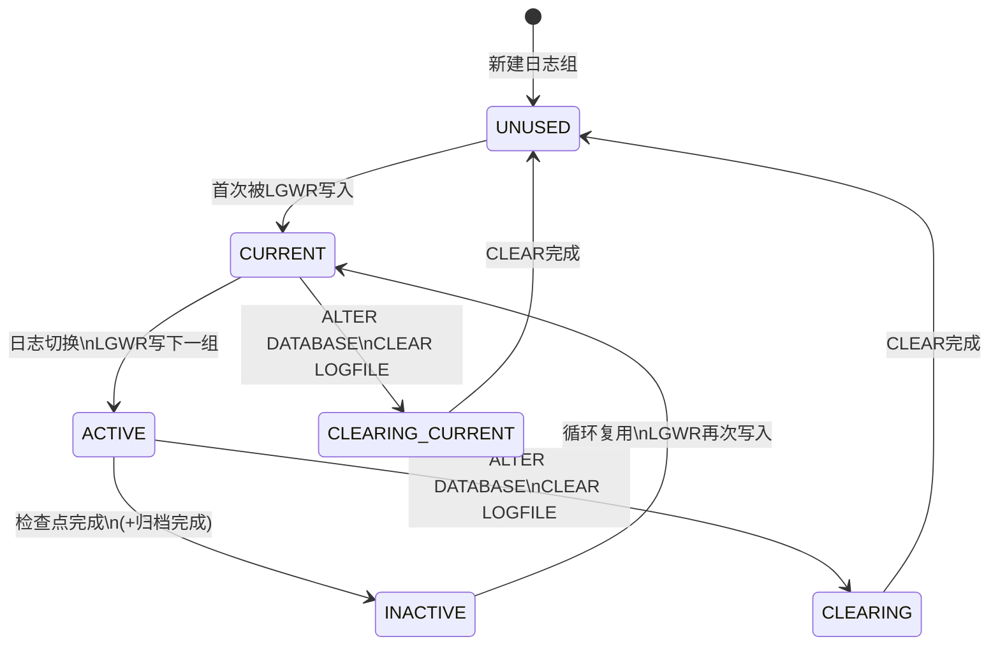
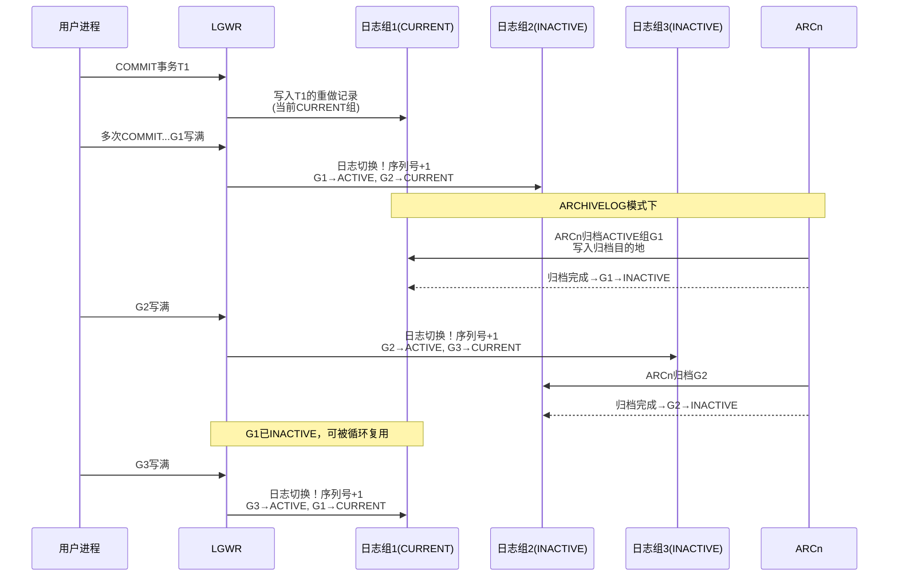
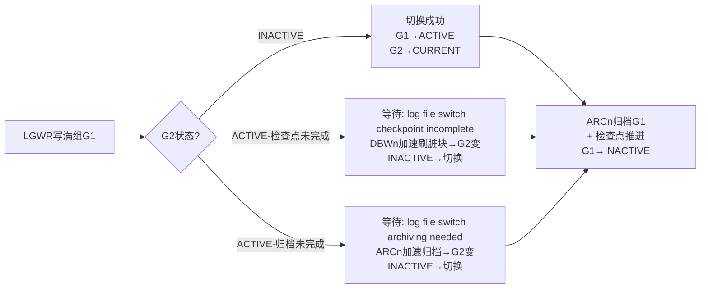

# 7.1 联机重做日志组工作机制

本节是[[MOC - 第7章]]的核心内容，讲解Oracle数据库区别于通用数据库的**重做日志循环复用机制**。重做日志（Redo Log）是Oracle实例恢复与介质恢复的物理基础，其设计遵循**WAL（Write-Ahead Logging）先写日志原则**，这是Oracle专有架构的关键特性。理解本节是掌握[[7.2 ARCH归档模式开启与关闭]]、[[7.3 日志切换、检查点]]与[[MOC - 第8章]]备份恢复的前提。

## REDO LOG 的核心作用

> [!definition] 重做日志（Redo Log）
> 重做日志记录Oracle数据库的**所有变化**，包括DML（INSERT/UPDATE/DELETE）、DDL（CREATE/ALTER/DROP）、DCL（GRANT/REVOKE）操作产生的**重做记录（Change Vector，变更向量）**。每条重做记录描述"哪个数据块的哪个字节从什么旧值改成什么新值"，是实例恢复与介质恢复的物理依据。

> [!note] Oracle 专有特性：WAL 先写日志原则
> Oracle严格遵循**Write-Ahead Logging（先写日志后写数据）**：当事务COMMIT时，LGWR先把重做缓冲区（Redo Log Buffer）中的重做记录写入联机重做日志文件并刷盘，之后DBWn才可以把对应脏缓冲写入数据文件。这一顺序保证：即使DBWn尚未写盘就断电，重启后也可根据已落盘的重做记录**REDO**重建已提交事务的数据变更。通用数据库可能以不同方式实现持久性，但Oracle的WAL+重做向量是其专有实现。

重做日志的两大核心用途：
1. **实例恢复（Instance Recovery）**：实例异常崩溃后（如断电），重启时SMON自动利用在线重做日志，把已COMMIT但DBWn尚未写入数据文件的事务**前滚（REDO）**，把未COMMIT但已写入数据文件的事务**回滚（UNDO）**。
2. **介质恢复（Media Recovery）**：磁盘数据文件损坏后，利用备份的数据文件+归档日志+在线重做日志，把数据库恢复到故障前的任意时刻。

## 重做线程、日志组与多路复用

> [!definition] 重做线程（Redo Thread）
> 每个Oracle实例对应一个重做线程。单实例环境只有一个线程（Thread 1），RAC集群环境每个节点实例有独立的重做线程。每个线程至少拥有**2个联机重做日志组（Log Group）**。

### 日志组（Group）与成员（Member）

每个重做线程由多个**日志组**构成循环队列，每组至少**2个成员**（多路复用，Multiplexing）：

| 概念 | 说明 | Oracle 要求 |
| ---- | ---- | ---- |
| 日志组（Group） | LGWR并行写入的逻辑单元，组内所有成员内容完全一致 | 每个实例至少 2 组，建议 3~4 组 |
| 日志成员（Member） | 组内的物理文件（.log），同一组内成员**大小相同、内容相同** | 每组至少 2 个成员，存放于**不同磁盘**防止单盘损坏 |

> [!tip] 多路复用的保护逻辑
> 同一组内成员分散在不同物理磁盘上。当某磁盘损坏导致一个成员不可读时，LGWR仍可写入其他成员，不会导致日志丢失。若某组成员全部丢失，则该组内容彻底丢失，可能需要**不完全恢复**。

## 日志组的六种状态

日志组在其生命周期中在以下六种状态间循环转换：

| 状态 | 含义 |
| ---- | ---- |
| **CURRENT** | LGWR 当前正在写入的组。实例崩溃恢复需要此组 |
| **ACTIVE** | LGWR 已写完切换到下一组，但检查点尚未完成（该组对应的脏缓冲尚未全部写入数据文件），**崩溃恢复仍需要此组**。ARCHIVELOG 模式下此组正在等待或正在被 ARCn 归档 |
| **INACTIVE** | 检查点已完成，ARCn 归档也已完成（ARCHIVELOG 模式下），实例恢复不再需要此组。可以被 LGWR 循环复用覆盖 |
| **UNUSED** | 新建的日志组或经 CLEAR 后从未被写入过 |
| **CLEARING** | 正在执行 `ALTER DATABASE CLEAR LOGFILE` 清空该组 |
| **CLEARING_CURRENT** | 当前日志组正在被 CLEAR 清空（极少见，通常 CLEAR 操作故障后残留状态） |



> [!warning] 状态判断的关键点
> - **只有 INACTIVE/UNUSED 状态的组可被循环覆盖**。若所有组都处于 ACTIVE（归档太慢或检查点太慢），LGWR 无法继续写入，数据库将挂起，直到有一组变为 INACTIVE。
> - **CURRENT/ACTIVE 组是崩溃恢复必需的**。若 CURRENT 组物理损坏，数据库将无法正常打开，可能需要重建控制文件并使用 RESETLOGS 打开。

## LGWR 写触发条件与协作流程

LGWR（Log Writer）是Oracle六大后台进程之一，负责把SGA重做缓冲区（Redo Log Buffer）的内容写入当前CURRENT日志组。其触发条件共五类：

1. **用户 COMMIT 提交**：事务COMMIT时，LGWR必须把该事务的所有重做记录写入日志文件并刷盘（fsync），返回COMMIT成功给用户——这是持久性D的保证。
2. **每 3 秒定时**：即使无COMMIT，LGWR每3秒自动把缓冲区已有内容写入日志。
3. **日志缓冲区 1/3 满或达到 1MB**：重做缓冲区使用量达到阈值时触发写入。
4. **DBWn 写脏块前**：DBWn要写某个脏缓冲前，要求该脏缓冲对应的所有重做记录已先写入日志（WAL原则），必要时通知LGWR同步写日志。
5. **手动切换或关库前**：`ALTER SYSTEM SWITCH LOGFILE` 手动触发日志切换；实例正常关闭前LGWR把缓冲区全部内容写入日志。

### LGWR、ARCn、日志组循环协作流程



## 联机重做日志的 DDL 操作

以下示例基于 Oracle 19c，所有路径需根据实际环境替换。

### 创建日志组与成员

```sql
-- Oracle 19c: 新增第4组，含2个成员，每组大小500M
ALTER DATABASE ADD LOGFILE GROUP 4 (
  '/u01/app/oracle/oradata/ORCL/redo04a.log',
  '/u02/app/oracle/oradata/ORCL/redo04b.log'
) SIZE 500M;

-- 向已有的第4组追加成员（REUSE表示文件已存在则覆盖）
ALTER DATABASE ADD LOGFILE MEMBER
  '/u03/app/oracle/oradata/ORCL/redo04c.log' REUSE
  TO GROUP 4;
```

### 删除日志组与成员

> [!danger] 删除日志组的高风险限制
> - **严禁删除 CURRENT 或 ACTIVE 状态的组**！必须先执行 `ALTER SYSTEM SWITCH LOGFILE` 手动切换，等待检查点把该组变为 INACTIVE 后才能删除。
> - 删除后仍需保证**每个实例至少 2 组**、**每组至少 2 个成员**的多路复用最低要求，否则数据库稳定性严重受损。

```sql
-- Oracle 19c: 先切换日志，等待G4变为INACTIVE后再删除
ALTER SYSTEM SWITCH LOGFILE;
-- 可查询 V$LOG 确认G4状态为INACTIVE后执行：
ALTER DATABASE DROP LOGFILE GROUP 4;
```

> [!danger] 删除日志成员的高风险限制
> - 删除成员前必须确认：该成员所属组删除后组内仍至少有**2个有效成员**，且该组成员并非全部 INVALID。
> - 若某组只剩 1 个有效成员，再删除会导致该组完全失效，可能引发实例崩溃。

```sql
-- Oracle 19c: 删除第4组中的某一成员
ALTER DATABASE DROP LOGFILE MEMBER
  '/u03/app/oracle/oradata/ORCL/redo04c.log';
```

### 重命名日志成员（物理迁移）

```sql
-- Oracle 19c: 先在操作系统层mv移动文件，再在数据字典中RENAME
-- 步骤1: 关库或使该组INACTIVE后，OS层面复制/移动文件
-- 步骤2: MOUNT状态下执行：
ALTER DATABASE RENAME FILE
  '/u01/app/oracle/oradata/ORCL/redo04a.log'
  TO
  '/u04/app/oracle/oradata/ORCL/redo04a.log';
```

## 关键数据字典与动态性能视图

| 视图 | 用途 | 关键字段 |
| ---- | ---- | ---- |
| **V$LOG** | 查询日志组信息 | GROUP#（组号）、SEQUENCE#（序列号）、BYTES（字节数）、MEMBERS（成员数）、STATUS（状态）、FIRST_CHANGE#（第一个SCN）、FIRST_TIME（第一个SCN时间） |
| **V$LOGFILE** | 查询日志成员信息 | GROUP#、MEMBER（成员路径）、STATUS（INVALID/STALE/DELETED/null） |
| **V$LOG_HISTORY** | 查询日志切换历史 | RECID、STAMP、THREAD#、SEQUENCE#、FIRST_CHANGE#、FIRST_TIME、NEXT_CHANGE# |

```sql
-- Oracle 19c: 查询日志组状态与成员
SELECT g.group#, g.sequence#, g.bytes/1024/1024 size_mb,
       g.status, g.first_change#, g.first_time,
       f.member, f.status member_status
FROM   v$log g
       JOIN v$logfile f ON g.group# = f.group#
ORDER  BY g.group#;
```

## 日志切换频率与性能调优

> [!tip] 合理的日志切换频率
> 生产环境建议日志切换频率 **15~30 分钟/次**。
> - **切换过于频繁（<5分钟）**：说明日志文件太小，频繁日志切换会触发过多检查点，产生大量I/O，出现 `log file switch (checkpoint incomplete)`、`log file switch (archiving needed)` 等等待事件，严重影响性能。
> - **切换过于稀疏（>1小时）**：日志文件太大，实例崩溃后SMON前滚所需重做记录过多，恢复时间太长，故障时可能丢失更多已提交数据（虽WAL保证COMMIT已落盘，但恢复时长不可控）。

### 日志大小估算公式

```
单次日志切换重做量 ≈ 15~30分钟内产生的Redo量
日志文件大小 = 平均每小时Redo量 × (15~30)/60  ÷ 每组成员数（多路复用不增加容量，只增加冗余）
```

实际可通过 AWR 报告或查询 `V$LOG_HISTORY` 统计重做产生速率：

```sql
-- Oracle 19c: 统计最近24小时每小时日志切换次数与Redo量
SELECT to_char(first_time, 'YYYY-MM-DD HH24') hour,
       count(*) switches,
       round(sum(blocks * block_size) / 1024 / 1024, 2) redo_mb
FROM   v$log_history
WHERE  first_time >= sysdate - 1
GROUP  BY to_char(first_time, 'YYYY-MM-DD HH24')
ORDER  BY hour;
```

### 关键等待事件

| 等待事件 | 含义 | 调优方向 |
| ---- | ---- | ---- |
| **log file sync** | 用户COMMIT后等待LGWR把重做写入日志完成 | 减少COMMIT频率（批量提交）、把日志成员放在高速SSD、增加日志缓冲区 |
| **log file switch (checkpoint incomplete)** | 要切换的下一组仍是ACTIVE（检查点未完成） | 增加日志组数量、增大日志文件、调快DBWn（增加DB_WRITER_PROCESSES）、调小FAST_START_MTTR_TARGET |
| **log file switch (archiving needed)** | 要切换的下一组ACTIVE尚未被ARCn归档完（ARCHIVELOG模式） | 增加ARCn进程数、增快归档目的地I/O、扩容归档存储 |



## 小结

> [!summary] 本节核心
> - Oracle重做日志记录所有数据库变更的Change Vector，遵循WAL先写日志原则（Oracle专有实现方式），支撑实例恢复与介质恢复。
> - 每个重做线程至少2组、每组至少2成员多路复用分散到不同磁盘。日志组在 CURRENT→ACTIVE→INACTIVE→CURRENT 间循环复用。
> - LGWR五大触发条件：COMMIT、每3秒、缓冲区1/3或1MB满、DBWn写前、手动切换/关库。ARCHIVELOG模式下ACTIVE组由ARCn归档后才变为INACTIVE。
> - `ALTER DATABASE ADD/DROP/RENAME LOGFILE` 管理日志组与成员。删除CURRENT/ACTIVE组、删除后多路复用不足均为高风险操作，必须danger标注。
> - 合理日志切换频率15~30分钟/次，重点关注 log file sync、log file switch 类等待事件。

## 关联

- 本章入口：[[MOC - 第7章]]
- 先修：[[3.2 后台进程作用]]（LGWR/DBWn/CKPT/ARCn职责）、[[3.3 物理文件：数据文件、控制文件、重做日志]]
- 后续：[[7.2 ARCH归档模式开启与关闭]]、[[7.3 日志切换、检查点]]、[[MOC - 第8章]]（完全/不完全恢复依赖重做与归档）
