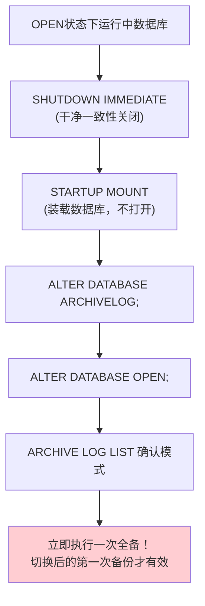
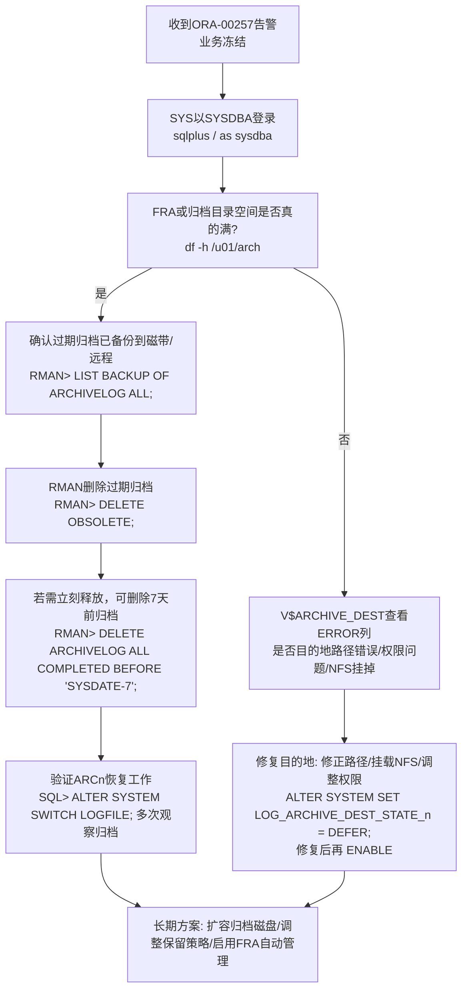

# 7.2 ARCH 归档模式开启与关闭

本节讲解Oracle数据库的两种运行模式：**NOARCHIVELOG（非归档模式）**与 **ARCHIVELOG（归档模式）**。归档模式的选择直接决定[[MOC - 第8章]]中能否做**热备份**与**不完全恢复**，是生产数据库部署时必须做出的关键架构决策。本节在[[7.1 联机重做日志组工作机制]]的日志组循环复用基础上，引入ARCn归档进程的工作机制。

## 两种归档模式对比

### NOARCHIVELOG 非归档模式

> [!definition] NOARCHIVELOG（非归档模式）
> 联机重做日志组写满并完成日志切换后，下一次循环复用该组时**直接覆盖原有内容**，不保留历史重做记录。

| 维度 | 说明 |
| ---- | ---- |
| **覆盖写** | 日志组 INACTIVE 后直接被 LGWR 覆盖写入，历史重做流丢失 |
| **恢复能力** | 只能恢复到**最后一次备份时刻**，备份之后到故障时刻的所有数据全部丢失 |
| **可用备份** | 只能做**冷备份（脱机一致备份）**，数据库必须干净关库后才能备份 |
| **适用场景** | 测试环境、开发环境、可容忍数据丢失的非核心系统 |

> [!warning] NOARCHIVELOG 模式的限制
> - 严禁在 NOARCHIVELOG 模式下做热备份（BEGIN BACKUP/END BACKUP），否则恢复时一致性无法保证。
> - 介质故障（数据文件损坏）后，只能用最后一次冷备份重装，之后全部更新丢失。

### ARCHIVELOG 归档模式

> [!definition] ARCHIVELOG（归档模式）
> 联机重做日志组写满完成日志切换变为 ACTIVE 后，**ARCn 后台进程先把该组内容完整复制为归档日志文件（Archived Log）写入归档目的地**，归档成功后该组才变为 INACTIVE，可被 LGWR 循环复用。**所有历史重做记录完整保留，形成连续重做流（Redo Stream）**。

| 维度 | 说明 |
| ---- | ---- |
| **顺序写不覆盖** | 归档日志按时间顺序编号追加，永不覆盖（除非DBA主动删除） |
| **ARCn 进程** | Oracle 自动启动 ARC0~ARC9 共 10 个归档进程，归档失败自动重试 |
| **恢复能力** | 可做**热备份**（数据库 OPEN 状态下备份）；支持**完全恢复**（到故障前最新时刻）与**不完全恢复**（到故障前任意中间时刻/SCN/日志序列号） |
| **适用场景** | 所有生产环境、核心业务系统、金融/电信/政务等不允许数据丢失的系统 |

> [!note] Oracle 专有特性：连续重做流
> Oracle的归档机制保证从数据库 OPEN RESETLOGS 那一刻起，所有重做变更都按日志序列号（Log Sequence Number, LSN）顺序编号形成完整重做流。基于完整重做流，可以把任意备份时刻的数据文件前滚到重做流中的任意时间点——这是Oracle不完全恢复（DBPITR）的物理基础，也是RMAN、Data Guard、LogMiner、闪回等Oracle专有高级特性的底层依赖。通用数据库的归档/WAL机制在命名与具体格式上不同，Oracle的重做流编号+SCN单调递增机制为其专有设计。

## 归档模式切换的完整步骤

> [!danger] 切换前提：必须干净关闭后 MOUNT 状态切换
> `ALTER DATABASE ARCHIVELOG/NOARCHIVELOG` 只能在数据库 **MOUNT** 状态下执行，且关闭必须是一致性关闭（`SHUTDOWN IMMEDIATE` 或 `SHUTDOWN NORMAL` 或 `SHUTDOWN TRANSACTIONAL`）。严禁在 `SHUTDOWN ABORT` 后直接切换模式！否则会导致数据文件 SCN 不一致，切换后数据库可能无法 OPEN。

### NOARCHIVELOG → ARCHIVELOG 切换流程



Oracle 19c SQL 实现：

```sql
-- Oracle 19c: 第1步 干净关库（SQL*Plus中执行）
SHUTDOWN IMMEDIATE;

-- Oracle 19c: 第2步 启动到MOUNT状态
STARTUP MOUNT;

-- Oracle 19c: 第3步 切换为归档模式
ALTER DATABASE ARCHIVELOG;

-- Oracle 19c: 第4步 打开数据库
ALTER DATABASE OPEN;

-- Oracle 19c: 第5步 验证模式
ARCHIVE LOG LIST;
-- 期望输出: Database log mode        Archive Mode
--          Automatic archival        Enabled
```

> [!danger] 生产切换 ARCHIVELOG 后必须立即做全备
> 从 NOARCHIVELOG 切换到 ARCHIVELOG 的那一刻起，**切换前的所有备份全部失效**！因为切换前没有归档日志，切换前的备份无法与切换后的重做流拼接。因此切换完成、打开数据库后，**必须立刻执行一次完整备份（RMAN全备或冷备）**，否则一旦发生介质故障将无可用备份用于恢复。

### ARCHIVELOG → NOARCHIVELOG 切换流程（生产慎用）

```sql
-- Oracle 19c: 回退到非归档模式（生产环境强烈不建议！）
SHUTDOWN IMMEDIATE;
STARTUP MOUNT;
ALTER DATABASE NOARCHIVELOG;
ALTER DATABASE OPEN;
ARCHIVE LOG LIST;
-- 期望输出: Database log mode        No Archive Mode
```

## 查询当前归档模式

### ARCHIVE LOG LIST 命令（最常用）

```sql
ARCHIVE LOG LIST;
```

典型输出含义：
| 字段 | 说明 |
| ---- | ---- |
| Database log mode | Archive Mode / No Archive Mode |
| Automatic archival | Enabled / Disabled（是否自动归档） |
| Archive destination | 归档目的地路径 |
| Oldest online log sequence | 最旧在线日志序列号 |
| Next log sequence to archive | 下一个待归档序列号 |
| Current log sequence | 当前CURRENT组序列号 |

### V$DATABASE 视图查询

```sql
-- Oracle 19c: 通过V$DATABASE查看LOG_MODE
SELECT name, log_mode, open_mode, checkpoint_change#
FROM   v$database;
-- LOG_MODE列: ARCHIVELOG / NOARCHIVELOG
```

## 归档目的地配置

Oracle 19c 支持最多 **31 个归档目的地**（`LOG_ARCHIVE_DEST_1` ~ `LOG_ARCHIVE_DEST_31`），每个目的地可独立配置为本地路径或远程Data Guard备库。

### 本地归档目的地 + 可选远程 Data Guard

```sql
-- Oracle 19c: 配置2个本地归档目的地 + 1个远程备库目的地
ALTER SYSTEM SET LOG_ARCHIVE_DEST_1 =
  'LOCATION=/u01/arch/ORCL VALID_FOR=(ALL_LOGFILES,ALL_ROLES) DB_UNIQUE_NAME=ORCL'
  SCOPE=BOTH;

ALTER SYSTEM SET LOG_ARCHIVE_DEST_2 =
  'LOCATION=/u02/arch/ORCL VALID_FOR=(ALL_LOGFILES,ALL_ROLES) DB_UNIQUE_NAME=ORCL'
  SCOPE=BOTH;

-- 第3个目的地: 远程Data Guard物理备库（SERVICE为TNS名）
ALTER SYSTEM SET LOG_ARCHIVE_DEST_3 =
  'SERVICE=ORCL_STB LGWR ASYNC VALID_FOR=(ONLINE_LOGFILES,PRIMARY_ROLE) DB_UNIQUE_NAME=ORCLSTB'
  SCOPE=BOTH;

-- 启用/禁用目的地（ENABLED/DEFERRED）
ALTER SYSTEM SET LOG_ARCHIVE_DEST_STATE_1 = ENABLE SCOPE=BOTH;
ALTER SYSTEM SET LOG_ARCHIVE_DEST_STATE_3 = DEFER SCOPE=BOTH; -- 临时禁用
```

### 归档文件名格式

```sql
-- Oracle 19c: 定义归档文件命名格式
-- %t = 线程号(Thread#)，%s = 日志序列号(Sequence#)，%r = RESETLOGS ID
ALTER SYSTEM SET LOG_ARCHIVE_FORMAT = '%t_%s_%r.dbf' SCOPE=SPFILE;
-- 修改后需重启生效（静态参数）
```

> [!tip] 必须包含 %s %t %r
> `%s` 保证序列号唯一、`%t` RAC多线程区分、`%r` RESETLOGS后防止重名。三个格式符缺一不可，否则归档文件可能重名覆盖。

### 最少成功归档目的地数

```sql
-- Oracle 19c: 要求至少 n 个目的地成功归档，否则LGWR挂起
ALTER SYSTEM SET LOG_ARCHIVE_MIN_SUCCEED_DEST = 2 SCOPE=BOTH;
-- 默认值1：只要1个成功即可。生产建议≥2（对应本地双目的地），
-- 防止单个归档磁盘损坏时仍有另一份归档可用。
```

## 归档信息查询视图

| 视图 | 用途 |
| ---- | ---- |
| **V$ARCHIVED_LOG** | 已归档日志历史：序列号、线程号、第一个SCN、归档时间、文件大小、归档路径、是否已被RMAN备份等 |
| **V$ARCHIVE_DEST** | 所有31个归档目的地配置与状态：DEST_NAME、STATUS（VALID/DEFERRED/ERROR）、ARCHIVER、DESTINATION、ERROR 错误信息 |
| **V$ARCHIVE_PROCESSES** | 当前ARCn进程状态：进程号、状态、所属实例 |

```sql
-- Oracle 19c: 查看最近10条归档记录
SELECT thread#, sequence#, first_change#, first_time, next_change#,
       name, blocks * block_size / 1024 / 1024 size_mb,
       archived, deleted, backup_count
FROM   v$archived_log
ORDER  BY sequence# DESC
FETCH  FIRST 10 ROWS ONLY;

-- Oracle 19c: 查看所有归档目的地状态
SELECT dest_id, dest_name, status, destination, error,
       archiver, valid_type, valid_role
FROM   v$archive_dest
WHERE  dest_id <= 10; -- 通常前10个已配置
```

## 归档空间满危机 ORA-00257

> [!warning] ORA-00257: Archiver error. Connect AS SYSDBA only until resolved.
> **这是生产环境最高优先级故障之一！** 当所有归档目的地磁盘空间用尽，ARCn无法继续归档ACTIVE组，LGWR发现下一组仍是ACTIVE（归档未完成）无法覆盖写入，数据库**完全冻结**——除SYS用户以SYSDBA身份登录清理外，普通用户所有DML操作全部挂起，业务停摆。

### 紧急处理步骤



> [!danger] 严禁直接用 OS rm 删除归档文件！
> OS直接删除会导致 RMAN 存储库（恢复目录或控制文件）记录与物理文件不一致：RMAN认为归档仍存在，但实际物理文件已丢失——后续备份、恢复、CROSSCHECK均报错。
> **正确姿势**：先用 `CROSSCHECK ARCHIVELOG ALL;` 核对物理文件与RMAN元数据，标记失效的归档为EXPIRED，再执行 `DELETE EXPIRED ARCHIVELOG ALL;` 清理元数据。或直接用RMAN内部命令 `DELETE ARCHIVELOG ...`，RMAN会同时删除物理文件并更新元数据。

## 小结

> [!summary] 本节核心
> - NOARCHIVELOG：日志组覆盖写，只能冷备，只能恢复到备份点，适合测试/开发。
> - ARCHIVELOG：ARCn进程先把ACTIVE组归档为归档文件，顺序编号形成完整重做流，支持热备、完全恢复、不完全恢复，生产必选。
> - 切换必须 SHUTDOWN IMMEDIATE → STARTUP MOUNT → ALTER DATABASE ARCHIVELOG → OPEN。切换后立即全备，旧备份失效。
> - LOG_ARCHIVE_DEST_n 支持本地 LOCATION 与远程 SERVICE（Data Guard）共31个目的地。LOG_ARCHIVE_MIN_SUCCEED_DEST 控制最少成功数。
> - ORA-00257 归档空间满是生产最高优先级故障，必须用 RMAN DELETE 系列命令清理，严禁 OS 直接 rm。

## 关联

- 本章入口：[[MOC - 第7章]]
- 先修：[[7.1 联机重做日志组工作机制]]（ACTIVE组 → ARCn归档 → INACTIVE）
- 后续：[[7.3 日志切换、检查点]]（日志切换触发归档）、[[7.4 归档日志维护策略]]、[[MOC - 第8章]]（备份恢复完全依赖归档模式）
