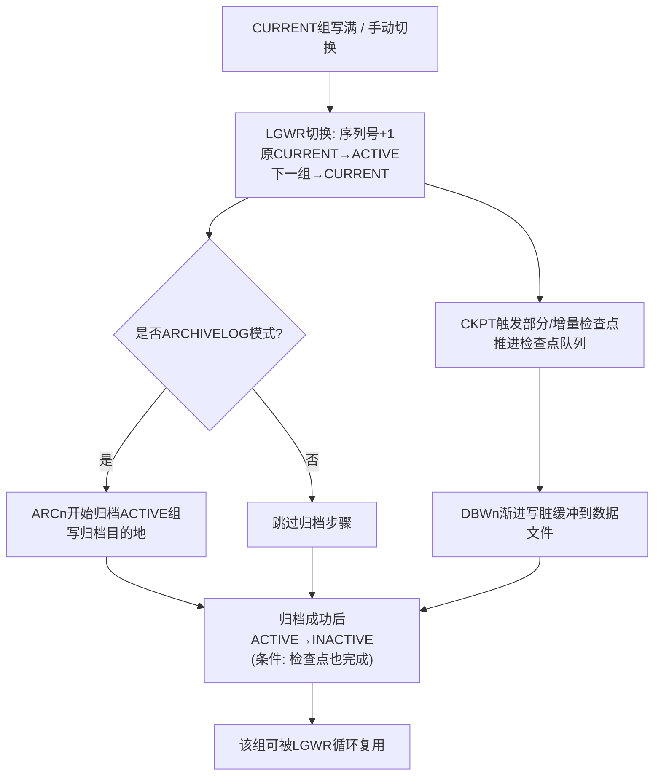
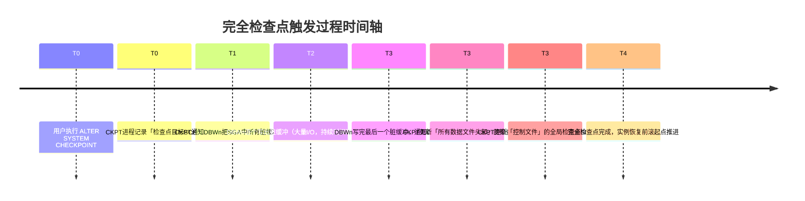
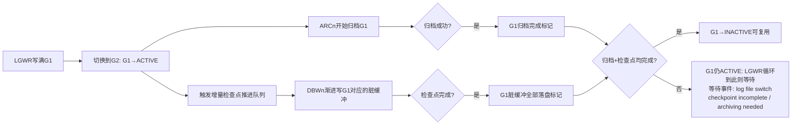

# 7.3 日志切换、检查点

本节在[[7.1 联机重做日志组工作机制]]与[[7.2 ARCH归档模式开启与关闭]]的基础上，深入讲解**日志切换（Log Switch）**与**检查点（Checkpoint）**两个紧密关联的Oracle内部机制。日志切换触发检查点推进，检查点进度反过来限制日志切换能否成功；两者协同决定实例崩溃恢复的时长，是理解Oracle数据库高可用与性能调优的关键环节。

## 日志切换（Log Switch）

> [!definition] 日志切换（Log Switch）
> LGWR 停止向当前 CURRENT 日志组写入，转而写下一个**可用组（INACTIVE/UNUSED）**，并把**日志序列号（Sequence#）+1**的动作。切换后：原 CURRENT → ACTIVE，下一组 INACTIVE/UNUSED → CURRENT。

### 日志切换的三类触发方式

| 触发方式 | 说明 |
| ---- | ---- |
| **自动切换（最常见）** | CURRENT 组写满后，LGWR 自动寻找下一组 INACTIVE/UNUSED 切换 |
| **手动切换** | DBA 执行 `ALTER SYSTEM SWITCH LOGFILE` 或 `ALTER SYSTEM ARCHIVE LOG CURRENT` |
| **隐含触发** | 部分 DDL 操作、表空间热备 BEGIN BACKUP 等内部触发日志切换 |

### 两种手动切换命令的区别

```sql
-- Oracle 19c: 方式一：SWITCH LOGFILE（异步，不等待归档）
ALTER SYSTEM SWITCH LOGFILE;
-- 立即返回给用户。后台ARCn异步归档ACTIVE组。
-- 若归档目的地慢，后续切换可能遇到 "log file switch (archiving needed)" 等待。
```

```sql
-- Oracle 19c: 方式二：ARCHIVE LOG CURRENT（同步，等待归档完成）
ALTER SYSTEM ARCHIVE LOG CURRENT;
-- 等当前CURRENT组写入完成 + 切换 + ARCn归档完成后才返回。
-- 确保返回时，切换前所有在线日志都已成功归档。
-- 备份前常执行此命令，确保所有重做都已归档可供恢复。
```

> [!tip] 选用建议
> - 日常运维快速切换：用 `SWITCH LOGFILE`。
> - 备份前、重要维护窗口前、归档空间紧急清理后验证：用 `ARCHIVE LOG CURRENT`，确保归档全部落盘。

### 日志切换触发的后续动作



## 检查点（Checkpoint）

> [!definition] 检查点（Checkpoint）
> 由 CKPT 后台进程触发的**数据一致性推进事件**。检查点完成意味着：
> 1. **DBWn 把检查点时刻 SGA 中所有脏缓冲（Dirty Buffer）写入对应数据文件**；
> 2. **所有数据文件头部的「检查点SCN」被更新为新值**；
> 3. **控制文件中的「全局检查点SCN」「检查点计数」被更新**。
>
> 检查点的核心目的是**缩短实例崩溃恢复所需前滚（REDO）的范围**——检查点之前的所有脏缓冲已落盘，恢复时只需从检查点SCN开始前滚重做记录。

### CKPT 后台进程的职责

| 更新目标 | 更新内容 | 用途 |
| ---- | ---- | ---- |
| **数据文件头部** | 检查点SCN、检查点计数（Checkpoint Count） | 数据库OPEN时Oracle比对数据文件头部SCN与控制文件SCN是否一致，判断是否需要介质恢复 |
| **控制文件** | 全局检查点SCN、检查点计数、最近检查点位置RBA（Redo Byte Address） | 实例恢复时SMON据此决定从重做日志的哪个位置开始前滚 |

> [!note] Oracle专有：检查点计数（Checkpoint Change# / Cnt）
> 除SCN外，Oracle额外维护「检查点计数」单调递增。即使RESETLOGS后SCN重置，检查点计数仍继续递增——用于OPEN时快速判断数据文件是否来自同一数据库祖先（Incarnation），防止错误把旧备份的数据文件带入新RESETLOGS分支。通用数据库通常只用SCN或LSN单字段判断，Oracle的检查点计数+SCN双重校验是其专有增强。

### 三类检查点

| 类型 | 触发时机 | 写脏缓冲范围 | 影响 |
| ---- | ---- | ---- | ---- |
| **完全检查点（Complete Checkpoint）** | 正常关库（`SHUTDOWN NORMAL/IMMEDIATE/TRANSACTIONAL`）、`ALTER SYSTEM CHECKPOINT` 手动触发 | SGA中**全部脏缓冲**一次性写盘 | 所有数据文件头部SCN一致。实例崩溃后恢复只需极少甚至无需REDO。I/O尖峰明显 |
| **增量检查点（Incremental Checkpoint）** | 每3秒定时触发、按 `FAST_START_MTTR_TARGET` 目标渐进推进 | 只写「检查点队列」尾部的**部分脏缓冲**，分批渐进写 | 平滑I/O，避免完全检查点的I/O尖峰。崩溃恢复从**增量检查点队列的LRBA（Low RBA）**开始前滚，而非从完全检查点位置 |
| **局部检查点（Partial Checkpoint）** | 表空间 OFFLINE / BEGIN BACKUP / RMAN 备份 / 数据文件离线 | 只写**对应表空间/数据文件的脏缓冲** | 局部一致性，表空间离线/备份期间的数据文件头部SCN冻结，保证备份出的文件可用于恢复 |



> [!example] 增量检查点的渐进推进
> 假设 FAST_START_MTTR_TARGET=300秒（5分钟）。CKPT每3秒唤醒一次，根据目标恢复时长计算「当前需要把检查点队列推进到什么位置」，通知DBWn把该位置之前的脏缓冲写出。DBWn每次只写少量缓冲，I/O均匀分布在3秒间隔内，避免完全检查点的瞬间I/O洪峰。

## 检查点相关参数与视图

### 三大检查点控制参数

| 参数名 | 含义 | 推荐值 | Oracle 19c 说明 |
| ---- | ---- | ---- | ---- |
| **FAST_START_MTTR_TARGET** | 期望的**平均崩溃恢复时间（秒）**。Oracle据此自动调整增量检查点推进速度与日志切换频率 | 300（5分钟）生产建议；测试环境可更大 | 替代旧参数 LOG_CHECKPOINT_INTERVAL / TIMEOUT 的推荐现代方式。0表示关闭自动调整 |
| **LOG_CHECKPOINT_INTERVAL** | 每写满多少个**操作系统块数**的重做日志触发一次检查点 | 不推荐手动设置，让 FAST_START_MTTR_TARGET 自动计算 | 旧参数，与块大小相关（512字节/块），不同OS块大小不同易配错 |
| **LOG_CHECKPOINT_TIMEOUT** | 每隔多少秒触发一次检查点 | 不推荐手动设置，现代Oracle依赖增量检查点 | 旧参数，设置过小会频繁触发完全检查点导致I/O尖峰 |

```sql
-- Oracle 19c: 设置目标恢复时长5分钟（最推荐的参数）
ALTER SYSTEM SET FAST_START_MTTR_TARGET = 300 SCOPE=BOTH;
```

### 检查点性能与恢复时间估算视图

```sql
-- Oracle 19c: V$INSTANCE_RECOVERY 估算实际恢复时间
SELECT recovery_estimated_ios,            -- 恢复需要的预估I/O次数
       actual_redo_blks,                   -- 实际重做块数
       target_redo_blks,                   -- 目标重做块数（按MTTR推导）
       estimated_mttr,                     -- 预估MTTR（秒）Oracle内部估计
       target_mttr,                        -- 设定的目标MTTR
       optimal_logfile_size                -- 推荐的最佳联机日志大小（MB）
FROM   v$instance_recovery;
```

> [!tip] 日志大小推荐
> `V$INSTANCE_RECOVERY.OPTIMAL_LOGFILE_SIZE` 字段直接给出Oracle基于当前工作负载和MTTR目标推荐的**每组日志文件大小**。若此值远大于当前日志实际大小，应按推荐值扩容，避免频繁切换。

### 日志切换历史统计

```sql
-- Oracle 19c: 统计最近7天每天日志切换次数（判断切换频率是否合理）
SELECT to_char(first_time, 'YYYY-MM-DD') day,
       count(*) switches,
       round(count(*) / 24, 1) per_hour,
       round(24 * 60 / count(*), 0) avg_minutes_per_switch
FROM   v$log_history
WHERE  first_time >= trunc(sysdate) - 7
GROUP  BY to_char(first_time, 'YYYY-MM-DD')
ORDER  BY day DESC;
```

理想值：`avg_minutes_per_switch` 在 **15~30 分钟** 区间。若 <5 分钟 → 日志文件太小或重做产生太猛；若 >60 分钟 → 日志太大，恢复时间过长。

## 日志切换与检查点的相互制约关系



> [!warning] 两类高频等待的排查
> - **log file switch (checkpoint incomplete)**：检查点太慢 → DBWn写不赢。调优：增大日志文件、增加日志组数、增加DB_WRITER_PROCESSES、启用异步I/O、把数据文件放到更快的存储。
> - **log file switch (archiving needed)**：归档太慢 → ARCn写不赢。调优：增加ARCn进程、把归档目的地放更快磁盘、扩容FRA/归档目录、减少远程归档目的地的网络延迟。

## 手动触发检查点与切换的SQL汇总

```sql
-- Oracle 19c: 手动触发完全检查点（所有脏缓冲写盘）
ALTER SYSTEM CHECKPOINT;

-- Oracle 19c: 手动触发全局日志切换（不等归档完成）
ALTER SYSTEM SWITCH LOGFILE;

-- Oracle 19c: 手动触发全局日志切换 + 等待所有线程归档完成
ALTER SYSTEM ARCHIVE LOG CURRENT;

-- Oracle 19c: 仅归档指定序列号（手工补归档用）
ALTER SYSTEM ARCHIVE LOG SEQUENCE 1234 THREAD 1;

-- Oracle 19c: 归档所有尚未归档的日志
ALTER SYSTEM ARCHIVE LOG ALL;
```

## 小结

> [!summary] 本节核心
> - 日志切换：LGWR从当前CURRENT组切换到下一组INACTIVE/UNUSED，序列号+1。手动命令 `SWITCH LOGFILE`（异步）与 `ARCHIVE LOG CURRENT`（同步等归档）。
> - 检查点三类：完全检查点（一次性全脏缓冲写盘，I/O尖峰，关库/手动触发）、增量检查点（每3秒渐进写，平滑I/O，生产默认主力）、局部检查点（表空间备份/离线触发）。
> - CKPT进程更新数据文件头部与控制文件中的检查点SCN+检查点计数，后者为Oracle专有RESETLOGS分支校验机制。
> - `FAST_START_MTTR_TARGET`（秒）是现代Oracle控制检查点与恢复时长的推荐参数，`V$INSTANCE_RECOVERY` 给出实际MTTR估算与日志大小推荐。
> - 切换与检查点相互制约：下一组未INACTIVE时LGWR等待，产生 checkpoint incomplete / archiving needed 等待事件。

## 关联

- 本章入口：[[MOC - 第7章]]
- 先修：[[7.1 联机重做日志组工作机制]]（CURRENT→ACTIVE→INACTIVE状态流）、[[7.2 ARCH归档模式开启与关闭]]（ARCn归档ACTIVE组）、[[3.2 后台进程作用]]（CKPT、DBWn职责）
- 后续：[[7.4 归档日志维护策略]]、[[8.3 完全恢复与不完全恢复]]（检查点SCN+重做流决定恢复范围）
