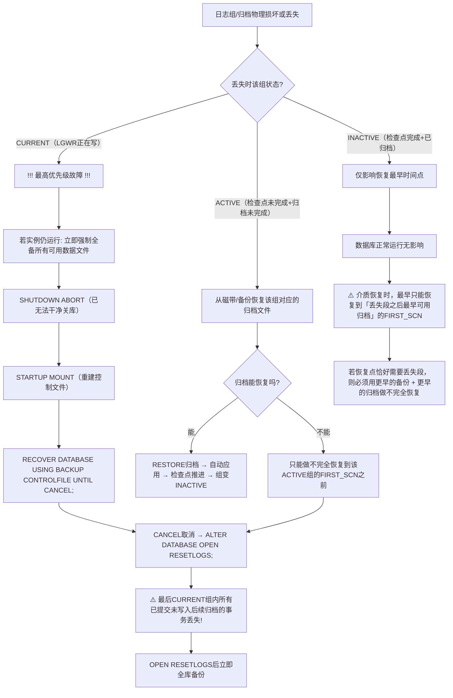

# 7.4 归档日志维护策略

本节是[[MOC - 第7章]]的实战汇总，讲解生产环境中归档日志的全生命周期管理：归档日志的多种用途、多目的地配置与状态监控、RMAN删除策略（与OS rm的区别与danger）、归档丢失按状态分类的处理流程、以及Oracle 10g+专有闪回恢复区（FRA）的自动管理机制。

## 归档日志的多种用途

> [!note] 归档日志的六大核心用途
> 1. **介质恢复（Media Recovery）必备**：数据文件从备份还原后，必须按顺序应用归档日志+在线重做，把数据库前滚到故障前时刻。详见[[8.3 完全恢复与不完全恢复]]。
> 2. **Data Guard 物理/逻辑备库同步**：主库ARCn/LGWR实时把归档重做流传输到备库，备库MRP持续应用归档以保持数据同步。
> 3. **LogMiner 日志挖掘**：通过 `DBMS_LOGMNR` 包解析归档日志内容，还原历史DML操作，用于审计、误操作溯源、逻辑错误分析。
> 4. **闪回技术（Flashback）底层依赖**：[[8.4 闪回技术基础]]中 Flashback Database 依赖归档+闪回日志；Flashback Query/Version Query/Transaction Query 依赖UNDO，但FDA闪回归档也会用到重做。
> 5. **逻辑备库 / 变更捕获 / Streams / GoldenGate**：Oracle Streams、GoldenGate 等高级复制产品通过捕获归档重做中的变更向量实现跨库同步。
> 6. **合规审计与长期数据留存**：金融、医疗、政务等行业法规要求保存多年重做记录以应对审计。

## 归档目的地管理

### 多目的地类型与状态

| 目的地类型 | 参数配置 | 场景 |
| ---- | ---- | ---- |
| **本地 LOCATION** | `LOCATION=/disk/arch` | 本地磁盘归档，生产至少配置2份到不同磁盘 |
| **远程 SERVICE** | `SERVICE=tns_name LGWR ASYNC/SYNC AFFIRM` | Data Guard 主库把归档传输到备库（Oracle专有Data Guard架构） |
| **闪回恢复区 FRA** | 不单独指定，自动使用 `DB_RECOVERY_FILE_DEST` | Oracle 10g+推荐的统一自动管理目录，存放归档/备份/闪回/控制文件自动备份等 |

目的地状态：

| V$ARCHIVE_DEST.STATUS | 含义 |
| ---- | ---- |
| **VALID** | 目的地启用且工作正常 |
| **DEFERRED** | DBA 手动 `LOG_ARCHIVE_DEST_STATE_n = DEFER` 临时禁用 |
| **ERROR** | 写入失败，如路径不存在、权限不足、磁盘满、NFS断连、网络不通等 |
| **DISABLED** | 参数为空或显式禁用 |

### 查询目的地状态与错误

```sql
-- Oracle 19c: 查看前15个目的地配置与状态
SELECT dest_id, status, destination, error,
       archiver, process, register,
       valid_type, valid_role, db_unique_name
FROM   v$archive_dest
WHERE  dest_id <= 15
ORDER  BY dest_id;
```

## 归档日志的 RMAN 管理命令

> [!danger] 严禁 OS `rm` / `del` 直接删除归档文件！
> - **物理OS删除**：只删磁盘文件，RMAN存储库（控制文件或恢复目录）中仍记录该归档存在。后续 `BACKUP ARCHIVELOG ALL` 会因找不到文件报错；`CROSSCHECK` 会把找不到的归档标记为 **EXPIRED**。
> - **正确做法**：要么**用RMAN内部DELETE命令同时删除物理文件+更新元数据**，要么OS删除后立即 `CROSSCHECK ARCHIVELOG ALL` + `DELETE EXPIRED ARCHIVELOG ALL` 清理元数据。
> - **删除前必确认**：要删除的归档**已成功备份到磁带或远程备份**（RMAN `LIST BACKUP OF ARCHIVELOG FROM SEQUENCE n` 验证）。生产归档一旦删除且无备份，恢复能力立即退回到「最早可用归档」。

### RMAN 归档维护命令

```rman
-- Oracle 19c RMAN: 查看保留策略下已过期归档
RMAN> REPORT OBSOLETE;

-- Oracle 19c RMAN: 按保留策略删除过期归档（同时删物理文件+更新元数据）
RMAN> DELETE OBSOLETE;

-- Oracle 19c RMAN: 删除7天前的所有归档（无条件按时间）
RMAN> DELETE ARCHIVELOG ALL COMPLETED BEFORE 'SYSDATE - 7';

-- Oracle 19c RMAN: 删除SCN范围外的归档
RMAN> DELETE ARCHIVELOG FROM SCN 1000000 UNTIL SCN 2000000;

-- Oracle 19c RMAN: 删除序列号1~100（线程1）
RMAN> DELETE ARCHIVELOG SEQUENCE BETWEEN 1 AND 100 THREAD 1;

-- Oracle 19c RMAN: OS手动删文件后，核对物理文件与RMAN元数据，标记EXPIRED
RMAN> CROSSCHECK ARCHIVELOG ALL;

-- Oracle 19c RMAN: 删除已标记为EXPIRED的归档元数据（物理文件已不存在）
RMAN> DELETE EXPIRED ARCHIVELOG ALL;

-- Oracle 19c RMAN: 备份归档后立即删除输入源文件（先备后删，生产推荐）
RMAN> BACKUP ARCHIVELOG ALL DELETE ALL INPUT;
```

### RMAN 归档保留策略配置

```rman
-- Oracle 19c RMAN: 冗余策略 - 至少保留2份备份（含归档），2份之外标记OBSOLETE
RMAN> CONFIGURE RETENTION POLICY TO REDUNDANCY 2;

-- Oracle 19c RMAN: 恢复窗口策略 - 确保任意时刻都能恢复到30天内任一时间点
RMAN> CONFIGURE RETENTION POLICY TO RECOVERY WINDOW OF 30 DAYS;
```

> [!warning] 跨平台保留策略建议
> - 金融/电信/政务：建议保留**30~90天在线归档**，超过后备份到磁带/对象存储再保存**7~10年**。
> - 普通互联网业务：保留**7~14天在线归档**，超过后迁移至二级存储。
> - Data Guard环境：主、备归档都保留，保留窗口一致。

## 不同状态重做/归档丢失的处理流程

当某组重做日志或某段归档意外丢失时，处理方式严格取决于**丢失时该组的状态**。



> [!danger] CURRENT 组丢失的后果
> CURRENT 组中保存着尚未切换的、最新已提交事务的重做记录。一旦 CURRENT 组物理损坏且无多路复用成员完好，这些已COMMIT但尚未进入后续归档的事务就**永久丢失**。只能重建控制文件、以 OPEN RESETLOGS 强制打开——这是Oracle中「数据丢失」的极少数场景之一。**多路复用 + 成员分散不同磁盘**是避免此灾难的唯一手段。

## 闪回恢复区（FRA, Fast Recovery Area）

> [!definition] Oracle 专有：闪回恢复区（FRA）
> Oracle 10g+推出的**统一备份恢复存储管理区**，通过两个初始化参数集中配置：
> - `DB_RECOVERY_FILE_DEST`：FRA根目录路径（本地磁盘或ASM磁盘组）
> - `DB_RECOVERY_FILE_DEST_SIZE`：FRA可使用的最大空间上限
>
> FRA内**自动管理**以下文件：归档日志、RMAN备份集/镜像副本、控制文件自动备份、闪回日志（Flashback Database用）、在线重做日志镜像副本（可选）。Oracle自动按RMAN保留策略标记OBSOLETE并删除，空间满时自动清理过期文件。

### FRA 配置

```sql
-- Oracle 19c: 配置FRA路径与大小（动态参数，SCOPE=BOTH立即生效）
ALTER SYSTEM SET DB_RECOVERY_FILE_DEST = '/u02/fra/ORCL' SCOPE=BOTH;
ALTER SYSTEM SET DB_RECOVERY_FILE_DEST_SIZE = '500G' SCOPE=BOTH;
```

### FRA 空间使用监控

```sql
-- Oracle 19c: V$RECOVERY_FILE_DEST 查看FRA总空间/已用/可回收
SELECT name,
       space_limit / 1024 / 1024 / 1024 total_gb,
       space_used  / 1024 / 1024 / 1024 used_gb,
       space_reclaimable / 1024 / 1024 / 1024 reclaimable_gb,
       number_of_files files
FROM   v$recovery_file_dest;

-- Oracle 19c: V$FLASH_RECOVERY_AREA_USAGE 按文件类型细分
SELECT file_type,
       percent_space_used,
       percent_space_reclaimable,
       number_of_files
FROM   v$flash_recovery_area_usage;
```

> [!warning] ORA-19809 / ORA-19815: FRA 空间不足
> 当 `V$RECOVERY_FILE_DEST.SPACE_USED` 接近 `SPACE_LIMIT` 且 `SPACE_RECLAIMABLE` 不够释放时，Oracle抛出 `ORA-19809: limit exceeded for recovery files` 或 `ORA-19815: WARNING: db_recovery_file_dest_size of X bytes is Y% used`。处理优先级：
> 1. **扩容**：`ALTER SYSTEM SET DB_RECOVERY_FILE_DEST_SIZE = '800G' SCOPE=BOTH;`（最优先，生产磁盘有余量时首选）。
> 2. **备份后删除**：RMAN `BACKUP RECOVERY AREA DELETE INPUT;` 把FRA文件备份到磁带后删除输入。
> 3. **删除过期**：RMAN `DELETE OBSOLETE;` + `CROSSCHECK` + `DELETE EXPIRED`。
> 4. **临时调大保留策略窗口**（不推荐，只是延后问题）。

### FRA 配置与归档目的地的关系

当同时配置 `LOG_ARCHIVE_DEST_n = 'LOCATION=USE_DB_RECOVERY_FILE_DEST'` 时，归档日志自动写入 FRA。若未显式配置 LOG_ARCHIVE_DEST_n 且设置了 FRA，Oracle 19c 默认用 FRA 作为归档目的地。

## 小结

> [!summary] 本节核心
> - 归档日志六大用途：介质恢复、Data Guard同步、LogMiner挖掘、闪回技术底层、Streams/GoldenGate复制、合规审计。
> - 归档目的地：LOCAL本地、SERVICE远程Data Guard、FRA自动管理。监控 V$ARCHIVE_DEST.STATUS 与 ERROR 字段。
> - **严禁OS rm直接删归档**。用RMAN `DELETE OBSOLETE / DELETE ARCHIVELOG ... COMPLETED BEFORE` 同时删物理+更新元数据。OS误删后必须 `CROSSCHECK ARCHIVELOG ALL` + `DELETE EXPIRED`。
> - 日志丢失按状态处理：CURRENT丢失需重建控制文件OPEN RESETLOGS（数据丢失风险）；ACTIVE丢失尝试恢复归档或不完全恢复；INACTIVE丢失只影响最早可恢复时间点。
> - Oracle专有FRA（闪回恢复区）：通过 DB_RECOVERY_FILE_DEST + SIZE 统一自动管理归档/备份/闪回/控制文件自动备份。ORA-19809空间满时，优先扩容或备份到磁带后删除输入。

## 关联

- 本章入口：[[MOC - 第7章]]
- 先修：[[7.2 ARCH归档模式开启与关闭]]、[[7.3 日志切换、检查点]]
- 后续：[[MOC - 第8章]]（[[8.2 RMAN工具基础使用]]中的RMAN命令、[[8.3 完全恢复与不完全恢复]]中的归档应用、[[8.4 闪回技术基础]]中的FRA+闪回日志）
