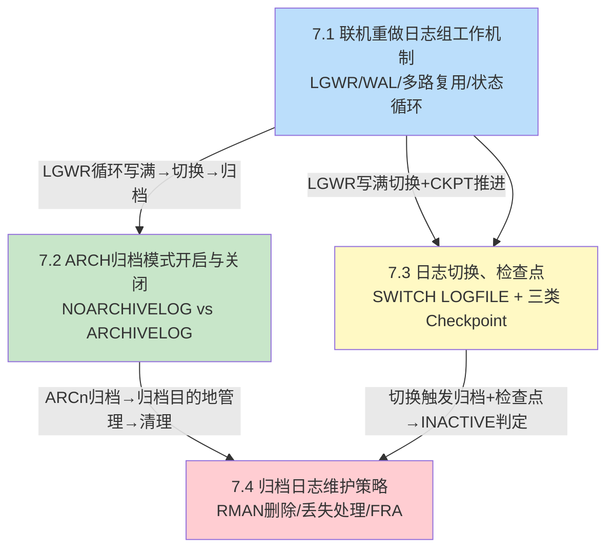

# MOC - 第7章 Oracle重做日志、归档模式

> [!info] 本章定位
> 本章讲解Oracle数据库的核心高可用机制：**联机重做日志组的循环复用机制**与**ARCHIVELOG归档模式**——这是数据库介质恢复的前提，也是Oracle区别于通用数据库的关键专有设计之一。[[7.1 联机重做日志组工作机制]]深入LGWR写触发条件、CURRENT/ACTIVE/INACTIVE状态循环与多路复用；[[7.2 ARCH归档模式开启与关闭]]对比NOARCHIVELOG/ARCHIVELOG两种模式的恢复能力与切换步骤；[[7.3 日志切换、检查点]]讲解SWITCH LOGFILE与三类检查点（完全/增量/局部）的协作关系；[[7.4 归档日志维护策略]]给出多目的地管理、RMAN删除规范与FRA闪回恢复区配置。没有归档就没有热备份，没有重做流就没有不完全恢复——本章是[[MOC - 第8章]]备份与恢复的直接物理基础。

## 学习路线图

> [!note] 学习顺序说明
> 7.1是基础骨架：必须先理解「日志组多路复用+WAL+状态循环」才能理解为什么ARCn必须归档ACTIVE组、为什么CURRENT组不能删。7.2在7.1的ACTIVE→INACTIVE状态转换上引入ARCn归档步骤，对比两种归档模式对恢复能力的决定性影响。7.3聚焦日志切换事件与检查点的相互制约——下一组ACTIVE状态的两个原因（归档未完成/检查点未完成）分别对应7.2与7.3的内容。7.4是实战运维汇总，给出目的地监控、RMAN删除规范、丢失分类处理与FRA自动管理。建议严格按序学习。

## 知识点导航

| 节 | 主题 | 入口 | 关键概念 |
| ---- | ---- | ---- | ---- |
| 7.1 | 联机重做日志组工作机制 | [[7.1 联机重做日志组工作机制]] | WAL先写日志、Change Vector重做向量、多路复用、组状态CURRENT/ACTIVE/INACTIVE循环、LGWR五大触发条件、V$LOG/V$LOGFILE查询 |
| 7.2 | ARCH归档模式开启与关闭 | [[7.2 ARCH归档模式开启与关闭]] | NOARCHIVELOG覆盖写、ARCHIVELOG重做流、SHUTDOWN IMMEDIATE→MOUNT切换模式、切换后立即全备、LOG_ARCHIVE_DEST_n、ORA-00257处理 |
| 7.3 | 日志切换、检查点 | [[7.3 日志切换、检查点]] | SWITCH LOGFILE vs ARCHIVE LOG CURRENT、完全检查点、增量检查点、局部检查点、FAST_START_MTTR_TARGET、V$INSTANCE_RECOVERY、log file switch等待事件 |
| 7.4 | 归档日志维护策略 | [[7.4 归档日志维护策略]] | RMAN DELETE OBSOLETE/DELETE ARCHIVELOG、CROSSCHECK+DELETE EXPIRED、CURRENT/ACTIVE/INACTIVE丢失处理、FRA闪回恢复区DB_RECOVERY_FILE_DEST、ORA-19809 |

## 核心考点

> [!warning] 7点核心考点warning（必须掌握）
> 1. **WAL先写日志原则**：明确Oracle专有WAL实现顺序——COMMIT时LGWR先写重做日志刷盘→DBWn后写脏数据文件。对比[[8.1 备份分类：冷备份、热备份]]中热备份期间额外重做的原理。
> 2. **日志组六种状态循环**：画出UNUSED→CURRENT→ACTIVE→INACTIVE→CURRENT循环图，说明每一步的触发条件（LGWR写满/检查点完成/归档完成）。特别强调CURRENT和ACTIVE组崩溃恢复需要。
> 3. **多路复用最低要求**：每个重做线程至少2组、每组至少2个成员，且成员必须存放在不同磁盘上。删除成员/组前必须验证剩余数量满足最低要求——>danger考点。
> 4. **归档模式切换三步+全备**：SHUTDOWN IMMEDIATE → STARTUP MOUNT → ALTER DATABASE ARCHIVELOG → ALTER DATABASE OPEN → 立即全备。背诵切换后旧备份失效的原因。
> 5. **ORA-00257归档空间满处理**：生产最高优先级故障，步骤是SYS登录→检查空间→CROSSCHECK→RMAN DELETE OBSOLETE/DELETE ARCHIVELOG BEFORE SYSDATE-7→验证切换成功。严禁OS rm。
> 6. **三类检查点的区别**：完全（关库/手动，I/O尖峰）、增量（每3秒渐进，FAST_START_MTTR_TARGET控制）、局部（表空间备份/离线）。FAST_START_MTTR_TARGET vs 旧参数 LOG_CHECKPOINT_INTERVAL/TIMEOUT 的选择。
> 7. **CURRENT组丢失处理**：CURRENT组物理损坏后，多路复用无完好成员，只能SHUTDOWN ABORT→STARTUP MOUNT→USING BACKUP CONTROLFILE RECOVER UNTIL CANCEL→OPEN RESETLOGS，最后一个CURRENT组内事务永久丢失——>danger最高级考点。

## 自测题

> [!question] 自测题 1
> 下列关于Oracle重做日志组状态的描述，错误的是（　）。
> A. CURRENT组是LGWR当前正在写的组，实例崩溃恢复必须用到
> B. ACTIVE组是LGWR已写完、但检查点尚未完成且归档（ARCHIVELOG）尚未完成的组，崩溃恢复仍需要
> C. INACTIVE组表示该组从未被写入过，可以被LGWR覆盖写入
> D. 若所有INACTIVE/UNUSED组都不可用，LGWR将无法继续写入而挂起

> [!check] 答案
> **C**。INACTIVE表示检查点与归档均已完成、崩溃恢复不再需要、**可以被循环复用覆盖**。而UNUSED才是「从未被写入过」的新建组或CLEAR后组。

> [!question] 自测题 2
> 生产数据库从NOARCHIVELOG切换为ARCHIVELOG后，DBA下一步正确的操作是（　），并说明理由。
> A. 立即做一次全备
> B. 立即删除切换前的所有冷备份，避免占用空间
> C. 立即做一次热备份测试
> D. 不做任何操作，等定期维护窗口再备份

> [!check] 答案
> **A**。切换后，切换前的所有冷备份因无对应归档日志而失效（无法用新重做流恢复旧备份）。因此必须立刻做一次切换后的完整备份，否则一旦介质故障将无可用备份。B错误：删除旧备份前至少应确认切换后新备份完成。C错误：先做全备再做热备测试。D错误：一旦接下来发生故障就无法恢复。

> [!question] 自测题 3
> 解释 `log file switch (checkpoint incomplete)` 等待事件的成因，并给出至少3种调优方案。

> [!check] 答案
> **成因**：LGWR要切换到下一组时，该组仍处于ACTIVE状态（检查点未完成——该组对应的脏缓冲尚未被DBWn全部写入数据文件），LGWR无法覆盖写，挂起等待。
> **调优方案**：①增大日志文件大小（或增加日志组数量），让每组写满时间变长、给检查点留足时间；②增加DB_WRITER_PROCESSES进程数，加速DBWn写脏缓冲；③调小FAST_START_MTTR_TARGET（让增量检查点推进更激进）或把数据文件迁移到更快SSD；④OS层面启用异步I/O（DISK_ASYNCH_IO参数）。

> [!question] 自测题 4
> 某DBA执行了OS命令 `rm /u01/arch/*` 清理了所有归档文件。请指出这会造成什么问题，以及正确的后续纠正步骤。

> [!check] 答案
> **问题**：OS直接rm只删除了磁盘文件，但RMAN存储库（控制文件或恢复目录）中仍记录这些归档存在。后续 `BACKUP ARCHIVELOG ALL` 会报错找不到文件；`RESTORE/RECOVER`时RMAN可能尝试恢复不存在的归档导致恢复中断。
> **纠正步骤**：①RMAN中执行 `CROSSCHECK ARCHIVELOG ALL;` 核对物理文件，不存在的标记为EXPIRED；② `DELETE EXPIRED ARCHIVELOG ALL;` 清理RMAN元数据；③如果rm前归档未备份，立即评估丢失归档的影响——是否影响保留窗口与恢复能力；④后续改用RMAN `DELETE OBSOLETE` 或 `DELETE ARCHIVELOG ALL COMPLETED BEFORE 'SYSDATE-7'` 删除。

## 章节导航

- 上级MOC：[[MOC - Oracle数据库管理]]
- 上一章：[[MOC - 第6章]]
- 下一章：[[MOC - 第8章]]
- 本章习题：[[MOC - 第7章习题]]
- 下一章习题：[[MOC - 第8章习题]]
